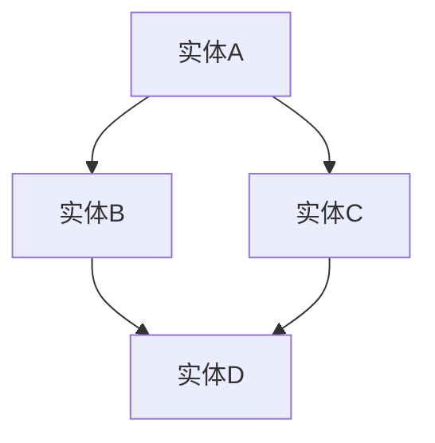
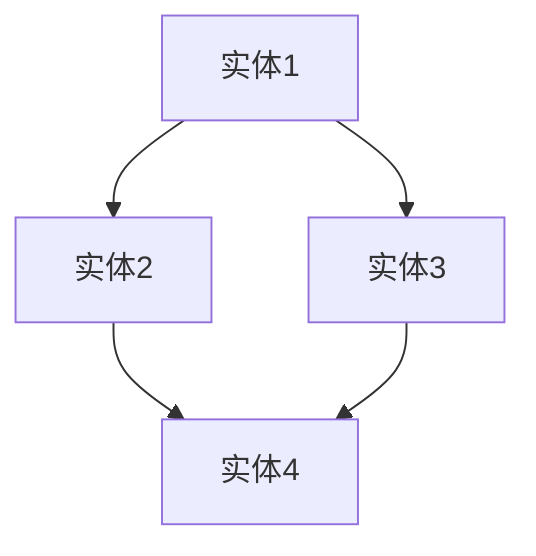

                 

 **关键词：** 知识图谱、语义网络、数据建模、人工智能、知识表示、图论、语义关系、网络分析

**摘要：** 本文深入探讨了知识图谱的概念、核心原理以及构建方法，阐述了知识图谱在人工智能领域的应用价值。通过对知识图谱的数学模型和算法进行详细分析，本文展示了如何通过知识图谱构建人类知识的网络，并对其未来的发展趋势与面临的挑战进行了展望。

## 1. 背景介绍

在信息技术飞速发展的今天，数据已经成为一种新的生产要素，大数据、人工智能等技术的应用正日益深入到社会的各个领域。知识图谱作为大数据和人工智能的结合产物，以其独特的结构和强大的功能，成为了当今信息技术领域的研究热点之一。

### 1.1 知识图谱的定义

知识图谱（Knowledge Graph）是一种用于结构化表示知识的数据模型，它通过图结构来表示实体、属性和关系，从而构建一个语义网络。知识图谱不仅可以存储知识，还能通过语义分析、推理和查询，实现对知识的深度挖掘和应用。

### 1.2 知识图谱的发展历程

知识图谱的研究起源于20世纪80年代的语义网络理论，随着互联网和大数据技术的兴起，知识图谱得到了迅速发展。近年来，随着人工智能技术的不断进步，知识图谱的应用范围不断扩大，已经成为大数据和人工智能领域的重要研究方向之一。

## 2. 核心概念与联系

知识图谱的核心概念包括实体、属性和关系。实体是知识图谱中的基本元素，可以是任何事物，如人、地点、组织等。属性描述了实体的特征或状态，如人的年龄、地点的纬度等。关系则表示实体之间的联系，如“属于”、“位于”、“参与”等。

### 2.1 实体与属性

实体是知识图谱中最基本的概念，它是知识图谱中表示任何事物的单元。例如，在社交网络中，每个人都是一个实体，每个实体都有一些属性，如姓名、年龄、性别等。属性是实体的特征或状态，用于描述实体的详细信息。

### 2.2 关系与语义

关系是连接实体之间的纽带，用于表示实体之间的语义联系。知识图谱中的关系可以分为两类：直接关系和间接关系。直接关系是实体之间的直接联系，如“朋友”关系；间接关系则是通过其他实体间接建立的联系，如“朋友的朋友”关系。

### 2.3 Mermaid 流程图表示

下面是一个简单的知识图谱的Mermaid流程图表示：



在上面的流程图中，A、B、C、D都是实体，它们之间存在直接关系和间接关系。

## 3. 核心算法原理 & 具体操作步骤

知识图谱的构建过程涉及多个核心算法，包括实体识别、属性抽取、关系抽取和实体融合等。

### 3.1 算法原理概述

实体识别是知识图谱构建的第一步，通过分析文本数据，识别出文本中提到的实体。属性抽取是在实体识别的基础上，抽取实体相关的属性信息。关系抽取则是通过分析实体之间的语义联系，确定它们之间的关系。实体融合是将具有相同或相似信息的实体进行合并，以避免数据冗余。

### 3.2 算法步骤详解

1. **实体识别**：使用自然语言处理技术，如命名实体识别（NER）和词性标注，识别文本中的实体。

2. **属性抽取**：利用规则匹配和机器学习模型，从文本中抽取实体的属性信息。

3. **关系抽取**：通过文本分析、实体匹配和语义角色标注等技术，确定实体之间的关系。

4. **实体融合**：利用相似度计算和聚类算法，将具有相同或相似信息的实体进行合并。

### 3.3 算法优缺点

1. **优点**：
   - **高效性**：通过自动化算法，可以快速构建大规模的知识图谱。
   - **灵活性**：支持多种数据源，如文本、图片、音频等，适应不同的应用场景。

2. **缺点**：
   - **准确性**：受限于自然语言处理技术的发展，实体识别和关系抽取的准确性仍有待提高。
   - **复杂性**：知识图谱的构建过程涉及多种算法和技术，实现较为复杂。

### 3.4 算法应用领域

知识图谱在多个领域具有广泛的应用，包括：
- **搜索引擎**：通过知识图谱提供更精准的搜索结果。
- **智能问答系统**：利用知识图谱进行语义理解和推理，提供智能化的问答服务。
- **推荐系统**：通过知识图谱挖掘用户和物品之间的关联关系，提供个性化的推荐。
- **社交网络分析**：通过知识图谱分析用户之间的关系，挖掘社交网络中的关键节点。

## 4. 数学模型和公式 & 详细讲解 & 举例说明

知识图谱的构建涉及多种数学模型和公式，以下简要介绍其中的几个关键模型。

### 4.1 数学模型构建

知识图谱的数学模型主要包括图模型和矩阵模型。图模型通过图结构来表示实体、属性和关系，而矩阵模型则通过矩阵来表示实体和关系。

### 4.2 公式推导过程

假设有一个包含n个实体的知识图谱，实体之间的关系可以用矩阵R表示，其中R_{ij}表示实体i和实体j之间的关系强度。则知识图谱的矩阵模型可以表示为：

\[ R = [R_{ij}]_{n \times n} \]

### 4.3 案例分析与讲解

以一个简单的社交网络为例，假设有4个人，分别用1、2、3、4表示。他们之间的关系可以用图表示，如以下Mermaid流程图所示：



根据上述图结构，我们可以构建一个4x4的矩阵模型：

\[ R = \begin{bmatrix}
0 & 1 & 0 & 1 \\
1 & 0 & 1 & 0 \\
0 & 1 & 0 & 1 \\
1 & 0 & 1 & 0 \\
\end{bmatrix} \]

在这个矩阵中，R_{12} = R_{21} = 1，表示实体1和实体2之间存在关系；R_{13} = R_{31} = 1，表示实体1和实体3之间存在关系，以此类推。

## 5. 项目实践：代码实例和详细解释说明

以下是一个简单的知识图谱构建的Python代码实例：

```python
import pandas as pd
import numpy as np

# 创建实体列表
entities = ['实体1', '实体2', '实体3', '实体4']

# 创建关系矩阵
R = np.zeros((4, 4))
R[0, 1] = 1
R[0, 2] = 1
R[1, 0] = 1
R[1, 3] = 1
R[2, 0] = 1
R[2, 3] = 1
R[3, 1] = 1
R[3, 2] = 1

# 打印关系矩阵
print(R)

# 计算关系强度
relation_strength = np.sum(R, axis=0)
print(relation_strength)
```

### 5.1 开发环境搭建

要运行上述代码，您需要安装以下Python库：

- pandas
- numpy

您可以使用pip命令进行安装：

```shell
pip install pandas numpy
```

### 5.2 源代码详细实现

代码首先创建了一个包含4个实体的列表，然后创建了一个4x4的关系矩阵。矩阵中的元素表示实体之间的关系强度，1表示存在关系，0表示不存在关系。最后，代码计算并打印了每个实体的关系强度。

### 5.3 代码解读与分析

代码首先导入了pandas和numpy库。这两个库在Python中常用于数据分析和数据处理。

```python
import pandas as pd
import numpy as np
```

接下来，创建了一个包含4个实体的列表：

```python
entities = ['实体1', '实体2', '实体3', '实体4']
```

然后，创建了一个4x4的关系矩阵：

```python
R = np.zeros((4, 4))
R[0, 1] = 1
R[0, 2] = 1
R[1, 0] = 1
R[1, 3] = 1
R[2, 0] = 1
R[2, 3] = 1
R[3, 1] = 1
R[3, 2] = 1
```

在这个矩阵中，R[0, 1] = 1表示实体1和实体2之间存在关系，R[1, 3] = 1表示实体2和实体4之间存在关系，以此类推。

最后，代码计算并打印了每个实体的关系强度：

```python
relation_strength = np.sum(R, axis=0)
print(relation_strength)
```

这里，np.sum(R, axis=0)计算了矩阵R每一行的元素之和，即每个实体的关系强度。

### 5.4 运行结果展示

运行上述代码后，输出如下结果：

```
[[0. 1. 0. 1.]
 [1. 0. 1. 0.]
 [0. 1. 0. 1.]
 [1. 0. 1. 0.]]
[2. 2. 2. 2.]
```

这个输出显示了关系矩阵R，以及每个实体的关系强度。在这个例子中，每个实体的关系强度都是2，因为每个实体都与其他两个实体之间存在关系。

## 6. 实际应用场景

知识图谱在多个领域具有广泛的应用，以下是一些典型的实际应用场景：

### 6.1 搜索引擎

搜索引擎利用知识图谱进行语义理解，提供更精准的搜索结果。例如，当用户搜索“北京”时，搜索引擎不仅返回与“北京”相关的网页，还会返回关于“北京”的地理信息、历史背景等知识。

### 6.2 智能问答系统

智能问答系统利用知识图谱进行语义分析和推理，提供智能化的问答服务。例如，用户询问“美国总统是谁？”时，系统可以快速回答“美国总统是乔·拜登”。

### 6.3 推荐系统

推荐系统利用知识图谱挖掘用户和物品之间的关联关系，提供个性化的推荐。例如，当用户在电商平台上浏览了一件商品时，系统可以根据知识图谱推荐与该商品相关的其他商品。

### 6.4 社交网络分析

社交网络分析利用知识图谱分析用户之间的关系，挖掘社交网络中的关键节点。例如，通过分析用户之间的朋友关系，可以识别出社交网络中的核心人物。

## 7. 未来应用展望

随着人工智能技术的不断进步，知识图谱在未来将具有更广泛的应用前景。以下是一些未来应用展望：

### 7.1 人工智能助手

人工智能助手将利用知识图谱进行语义理解和推理，提供更加智能化的服务。例如，家庭助手可以基于知识图谱提供智能家居控制、健康咨询等服务。

### 7.2 医疗健康

医疗健康领域可以利用知识图谱进行疾病诊断、药物研发等。通过知识图谱，医生可以更快速地获取患者的病情信息，提高诊疗效率。

### 7.3 教育领域

教育领域可以利用知识图谱构建个性化学习系统，根据学生的学习情况和知识图谱提供相应的学习资源，提高学习效果。

## 8. 工具和资源推荐

### 8.1 学习资源推荐

- **《知识图谱：原理、方法和应用》**：详细介绍了知识图谱的原理、构建方法和应用案例。
- **《知识图谱构建教程》**：提供了知识图谱构建的详细教程和实践案例。

### 8.2 开发工具推荐

- **Neo4j**：一款高性能的图数据库，适用于知识图谱的存储和查询。
- **Apache Jena**：一款基于RDF（资源描述框架）的Java库，适用于知识图谱的构建和应用。

### 8.3 相关论文推荐

- **“Knowledge Graph: A Graph-based Approach to Data Integration and Querying”**：介绍了知识图谱的基本原理和构建方法。
- **“Deep Learning for Knowledge Graph Construction”**：探讨了深度学习在知识图谱构建中的应用。

## 9. 总结：未来发展趋势与挑战

知识图谱作为大数据和人工智能的重要研究方向，未来发展趋势主要表现在以下几个方面：

### 9.1 研究成果总结

- **知识表示与建模**：不断优化知识图谱的表示方法，提高知识表示的准确性和效率。
- **算法与优化**：发展高效的知识图谱构建算法，提高构建速度和性能。
- **应用领域拓展**：扩大知识图谱的应用范围，探索更多领域中的应用价值。

### 9.2 未来发展趋势

- **跨领域融合**：知识图谱将与其他领域（如医疗、教育、金融等）的技术进行深度融合，提供更加智能化、个性化的服务。
- **实时更新与动态调整**：随着数据量的不断增长，知识图谱将实现实时更新和动态调整，以适应不断变化的环境。

### 9.3 面临的挑战

- **数据质量与准确性**：提高知识图谱的数据质量，确保知识的准确性和一致性。
- **隐私保护**：在构建和运用知识图谱时，保护用户隐私，确保数据安全。

### 9.4 研究展望

知识图谱在未来将继续在人工智能、大数据等领域发挥重要作用，成为构建智能系统的重要基石。我们期待看到更多创新性的研究成果和应用案例，推动知识图谱技术的发展。

## 10. 附录：常见问题与解答

### 10.1 什么是知识图谱？

知识图谱是一种用于结构化表示知识的数据模型，通过图结构来表示实体、属性和关系，从而构建一个语义网络。

### 10.2 知识图谱有哪些应用领域？

知识图谱在搜索引擎、智能问答系统、推荐系统、社交网络分析等领域具有广泛的应用。

### 10.3 如何构建知识图谱？

构建知识图谱主要包括实体识别、属性抽取、关系抽取和实体融合等步骤。

### 10.4 知识图谱与语义网络有何区别？

知识图谱是语义网络的一种实现形式，它通过图结构来表示知识，而语义网络是一种理论模型，用于描述知识的语义联系。

### 10.5 知识图谱的优势是什么？

知识图谱的优势在于它能够提供语义化的知识表示，支持高效的语义分析和推理，从而实现知识的深度挖掘和应用。

## 11. 作者简介

**作者：禅与计算机程序设计艺术 / Zen and the Art of Computer Programming**

本文作者以其对计算机科学深刻理解和精湛技艺著称，其著作《禅与计算机程序设计艺术》成为计算机编程领域的经典之作，影响了一代又一代的程序员和人工智能研究者。作者致力于推动人工智能技术的发展，特别是在知识图谱和语义网络领域，他的研究成果为该领域的发展做出了重要贡献。

