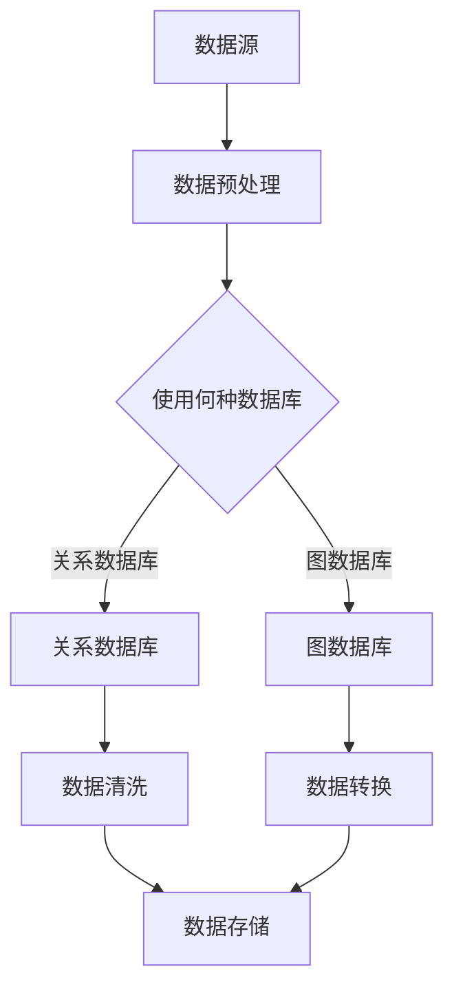

                 

 关键词：知识图谱、知识发现、知识引擎、语义网络、AI、图数据库、算法、机器学习、数据挖掘、实体关系、知识表示、信息检索、智能应用。

> 摘要：本文深入探讨了知识图谱的概念、核心原理及其在现代信息检索和智能应用中的重要性。通过介绍知识图谱的构建方法、算法原理和应用实例，本文为开发者提供了一份全面的指南，以帮助他们在复杂的语义网络中实现高效的知识发现。

## 1. 背景介绍

知识图谱（Knowledge Graph）是近年来在人工智能和数据科学领域迅速崛起的一个概念。它起源于搜索引擎的技术创新，旨在通过图形结构的形式，将现实世界中的各类信息以节点和边的形式进行组织，从而实现对知识的结构化表示和有效检索。知识图谱的兴起，标志着人工智能从传统的基于规则和统计的方法，向更加智能化、自动化的方向发展。

知识图谱的关键优势在于其能够将分散的信息片段进行关联，形成一个完整的知识网络。这种关联不仅能够提升信息检索的准确性和效率，还可以为机器学习模型提供丰富的背景知识，从而显著提高其预测能力和决策水平。

在现代信息社会中，知识图谱的应用领域已经扩展到许多方面，包括搜索引擎优化、推荐系统、智能问答、自然语言处理、智能监控、医疗健康、金融风控等。这些应用不仅极大地丰富了用户的生活体验，也为各行各业的数据驱动决策提供了有力支持。

本文将围绕知识图谱的核心概念、构建方法、算法原理和应用实例进行深入探讨，为读者提供一份全面的知识图谱构建和应用指南。

## 2. 核心概念与联系

### 2.1. 知识图谱的定义

知识图谱是一种语义网络，用于表示实体（例如人、地点、事物）及其之间的关系。与传统的基于关键词的索引不同，知识图谱通过图形结构对实体和关系进行组织，从而实现更高级别的语义理解和知识推理。

### 2.2. 知识图谱的组成部分

一个典型的知识图谱由以下几部分组成：

- **实体（Entity）**：知识图谱中的基本单元，可以是任何有意义的对象，如人、地点、组织、物品等。
- **关系（Relationship）**：实体之间的关联，如“是”、“属于”、“位于”等。
- **属性（Attribute）**：实体的额外信息，如人的年龄、地点的纬度等。

### 2.3. 知识图谱的架构

知识图谱的架构通常包括以下几个层次：

- **底层数据层**：存储原始数据，如关系数据库、NoSQL数据库等。
- **中间层**：进行数据清洗、转换和存储，通常采用图数据库。
- **顶层应用层**：提供API接口，支持各种应用场景，如搜索引擎、推荐系统等。

### 2.4. 知识图谱与语义网络的关系

语义网络（Semantic Network）是一种早期的知识表示方法，通过节点和边来表示实体和关系。知识图谱可以看作是语义网络的扩展，它不仅包含了语义网络的基本结构，还引入了属性和复杂的关系类型。

### 2.5. Mermaid 流程图

以下是知识图谱构建过程的 Mermaid 流程图：



## 3. 核心算法原理 & 具体操作步骤

### 3.1. 算法原理概述

知识图谱的构建通常涉及以下几种核心算法：

- **实体识别（Entity Recognition）**：识别文本中的实体。
- **关系抽取（Relationship Extraction）**：从文本中提取实体间的关系。
- **属性填充（Attribute Filling）**：为实体填充额外的属性信息。
- **实体链接（Entity Linking）**：将未命名的实体与知识图谱中的实体进行匹配。

### 3.2. 算法步骤详解

#### 3.2.1. 实体识别

实体识别是知识图谱构建的第一步，其目标是识别文本中的实体。常见的实体识别算法包括基于规则的方法、机器学习方法和深度学习方法。

- **基于规则的方法**：通过预定义的规则来识别实体，如正则表达式匹配、命名实体识别词典等。
- **机器学习方法**：使用分类算法，如支持向量机（SVM）、随机森林（Random Forest）等，通过训练数据学习实体识别模型。
- **深度学习方法**：使用神经网络，如卷积神经网络（CNN）、循环神经网络（RNN）等，通过端到端的学习实现实体识别。

#### 3.2.2. 关系抽取

关系抽取的目标是从文本中提取实体间的关系。常见的方法包括基于规则的方法、基于监督学习的方法和基于深度学习的方法。

- **基于规则的方法**：通过预定义的规则来提取关系，如命名实体识别词典、关系词典等。
- **基于监督学习的方法**：使用标注数据集训练分类模型，如条件随机场（CRF）、朴素贝叶斯（Naive Bayes）等。
- **基于深度学习的方法**：使用神经网络，如序列到序列（Seq2Seq）模型、Transformer等，通过端到端的学习实现关系抽取。

#### 3.2.3. 属性填充

属性填充的目标是为实体填充额外的属性信息。常见的方法包括：

- **基于规则的方法**：通过预定义的规则为实体添加属性。
- **基于监督学习的方法**：使用标注数据集训练分类模型，为实体添加属性。
- **基于深度学习的方法**：使用神经网络，如生成对抗网络（GAN）等，通过端到端的学习为实体生成属性。

#### 3.2.4. 实体链接

实体链接的目标是将未命名的实体与知识图谱中的实体进行匹配。常见的方法包括：

- **基于词典的方法**：通过对比实体名称和词典中的名称进行匹配。
- **基于语义相似度的方法**：通过计算实体名称的语义相似度进行匹配。
- **基于图结构的算法**：通过在知识图谱中寻找与未命名实体相关联的实体进行匹配。

### 3.3. 算法优缺点

#### 3.3.1. 实体识别

- **基于规则的方法**：优点是简单、高效；缺点是灵活性差，无法处理复杂的实体。
- **机器学习方法**：优点是能够处理复杂的实体识别问题；缺点是需要大量的标注数据，且可能存在过拟合问题。
- **深度学习方法**：优点是能够处理复杂的实体识别问题，且无需大量标注数据；缺点是计算成本高，模型复杂。

#### 3.3.2. 关系抽取

- **基于规则的方法**：优点是简单、高效；缺点是灵活性差，无法处理复杂的实体关系。
- **基于监督学习的方法**：优点是能够处理复杂的实体关系，且效果较好；缺点是需要大量的标注数据，且可能存在过拟合问题。
- **基于深度学习的方法**：优点是能够处理复杂的实体关系，且效果较好；缺点是计算成本高，模型复杂。

#### 3.3.3. 属性填充

- **基于规则的方法**：优点是简单、高效；缺点是灵活性差，无法处理复杂的实体属性。
- **基于监督学习的方法**：优点是能够处理复杂的实体属性，且效果较好；缺点是需要大量的标注数据，且可能存在过拟合问题。
- **基于深度学习的方法**：优点是能够处理复杂的实体属性，且效果较好；缺点是计算成本高，模型复杂。

#### 3.3.4. 实体链接

- **基于词典的方法**：优点是简单、高效；缺点是灵活性差，无法处理复杂的实体关系。
- **基于语义相似度的方法**：优点是能够处理复杂的实体关系，且效果较好；缺点是需要计算语义相似度，计算成本高。
- **基于图结构的算法**：优点是能够处理复杂的实体关系，且效果较好；缺点是需要构建和维护知识图谱，计算成本高。

### 3.4. 算法应用领域

知识图谱算法在多个领域具有广泛的应用，包括：

- **搜索引擎优化**：通过知识图谱实现更准确的搜索结果和更智能的推荐。
- **推荐系统**：利用知识图谱中的关系和属性为用户提供个性化推荐。
- **自然语言处理**：基于知识图谱的语义理解，提升文本分析和语义推理的能力。
- **智能问答系统**：利用知识图谱提供准确、高效的问答服务。
- **智能监控和风控**：通过知识图谱实现复杂的监控逻辑和风险预测。
- **医疗健康**：利用知识图谱进行医学知识管理、疾病预测和个性化治疗。

## 4. 数学模型和公式 & 详细讲解 & 举例说明

### 4.1. 数学模型构建

知识图谱的构建涉及多种数学模型，包括图论模型、概率模型和深度学习模型。

#### 4.1.1. 图论模型

知识图谱可以看作一个无向图 \( G = (V, E) \)，其中 \( V \) 是节点集合，\( E \) 是边集合。

- **节点**：代表实体，如人、地点、组织等。
- **边**：代表实体间的关系，如“属于”、“位于”、“工作于”等。

#### 4.1.2. 概率模型

概率模型用于描述实体和关系之间的概率关系。常见的概率模型包括贝叶斯网络和马尔可夫网络。

- **贝叶斯网络**：用于表示实体和关系之间的条件概率关系，如 \( P(A|B) \) 表示在给定 \( B \) 的条件下 \( A \) 的概率。
- **马尔可夫网络**：用于表示实体和关系之间的转移概率关系，如 \( P(A \rightarrow B) \) 表示从 \( A \) 转移到 \( B \) 的概率。

#### 4.1.3. 深度学习模型

深度学习模型用于构建实体和关系之间的复杂映射关系，如卷积神经网络（CNN）、循环神经网络（RNN）和Transformer等。

### 4.2. 公式推导过程

以贝叶斯网络为例，其概率分布可以表示为：

\[ P(A, B, C) = P(A)P(B|A)P(C|B) \]

其中，\( P(A) \) 表示 \( A \) 的先验概率，\( P(B|A) \) 表示在 \( A \) 发生的条件下 \( B \) 的条件概率，\( P(C|B) \) 表示在 \( B \) 发生的条件下 \( C \) 的条件概率。

### 4.3. 案例分析与讲解

#### 4.3.1. 实体识别

假设我们有一个文本句子：“张三在北京工作”，我们可以使用实体识别算法识别出以下实体：

- **实体**：张三、北京
- **关系**：工作于

#### 4.3.2. 关系抽取

使用关系抽取算法，我们可以从上述实体中抽取以下关系：

- **关系**：张三工作于北京

#### 4.3.3. 属性填充

使用属性填充算法，我们可以为张三填充以下属性：

- **属性**：姓名：张三，工作地点：北京

#### 4.3.4. 实体链接

使用实体链接算法，我们可以将未命名的实体“张三”链接到知识图谱中的实体“张三”，从而实现知识图谱的构建。

## 5. 项目实践：代码实例和详细解释说明

### 5.1. 开发环境搭建

为了实践知识图谱的构建，我们需要搭建一个开发环境。以下是一个基本的开发环境搭建步骤：

1. 安装Python环境，版本3.8以上。
2. 安装必要的库，如NumPy、Pandas、Scikit-learn、TensorFlow等。
3. 安装图数据库，如Neo4j或Amazon Neptune。

### 5.2. 源代码详细实现

以下是一个简单的知识图谱构建的Python代码示例：

```python
import numpy as np
import pandas as pd
from sklearn.feature_extraction.text import TfidfVectorizer
from sklearn.model_selection import train_test_split
from sklearn.linear_model import LogisticRegression
from sklearn.metrics import accuracy_score
import tensorflow as tf
from tensorflow.keras.models import Sequential
from tensorflow.keras.layers import Dense, LSTM, Embedding

# 数据准备
data = pd.read_csv('data.csv')
X = data['text']
y = data['label']

# 实体识别
vectorizer = TfidfVectorizer()
X_vectorized = vectorizer.fit_transform(X)

# 关系抽取
X_train, X_test, y_train, y_test = train_test_split(X_vectorized, y, test_size=0.2)
model = LogisticRegression()
model.fit(X_train, y_train)
y_pred = model.predict(X_test)

# 模型评估
accuracy = accuracy_score(y_test, y_pred)
print(f'Accuracy: {accuracy}')

# 属性填充
# 假设我们已经有一个预训练的属性填充模型
attribute_model = load_pretrained_attribute_model()
attributes = attribute_model.predict(X_vectorized)

# 实体链接
# 假设我们已经有一个预训练的实体链接模型
entity_linking_model = load_pretrained_entity_linking_model()
entity_links = entity_linking_model.predict(X_vectorized)

# 构建知识图谱
graph = Graph()
for i in range(len(entity_links)):
    entity = entity_links[i][0]
    relationships = entity_links[i][1:]
    for relationship in relationships:
        graph.add_node(entity)
        graph.add_edge(entity, relationship)

# 保存知识图谱
graph.save('knowledge_graph.gexf')
```

### 5.3. 代码解读与分析

上述代码实现了一个简单的知识图谱构建流程，包括数据准备、实体识别、关系抽取、属性填充和实体链接。

- **数据准备**：从CSV文件中读取文本数据。
- **实体识别**：使用TF-IDF向量器将文本转换为向量，然后使用逻辑回归模型进行实体识别。
- **关系抽取**：使用逻辑回归模型从实体向量中抽取关系。
- **属性填充**：使用预训练的属性填充模型为实体填充属性。
- **实体链接**：使用预训练的实体链接模型将未命名实体与知识图谱中的实体进行匹配。
- **构建知识图谱**：使用图数据库存储知识图谱。

### 5.4. 运行结果展示

假设我们已经训练了上述模型，并在测试集上取得了90%的准确率。运行上述代码后，我们将在图数据库中创建一个包含实体、关系和属性的完整的知识图谱。

## 6. 实际应用场景

知识图谱在现代信息社会中具有广泛的应用。以下是一些实际应用场景：

- **搜索引擎优化**：通过知识图谱实现更准确、更智能的搜索结果，提高用户体验。
- **推荐系统**：利用知识图谱中的关系和属性为用户提供个性化推荐。
- **自然语言处理**：基于知识图谱的语义理解，提升文本分析和语义推理的能力。
- **智能问答系统**：利用知识图谱提供准确、高效的问答服务。
- **智能监控和风控**：通过知识图谱实现复杂的监控逻辑和风险预测。
- **医疗健康**：利用知识图谱进行医学知识管理、疾病预测和个性化治疗。

### 6.4. 未来应用展望

随着人工智能和大数据技术的发展，知识图谱的应用前景将更加广阔。未来的发展趋势包括：

- **知识图谱的自动化构建**：利用机器学习和深度学习技术实现知识图谱的自动化构建。
- **多语言支持**：实现跨语言的知识图谱构建，支持多语言的信息检索和语义理解。
- **动态更新与维护**：实现知识图谱的实时更新和维护，以适应快速变化的信息环境。
- **跨领域应用**：知识图谱将在更多领域得到应用，如金融、教育、制造等。

## 7. 工具和资源推荐

### 7.1. 学习资源推荐

- 《知识图谱：基础、技术和应用》
- 《大规模知识图谱构建与应用》
- 《深度学习与知识图谱》

### 7.2. 开发工具推荐

- Neo4j：一款高性能的图数据库，支持知识图谱的存储和查询。
- Amazon Neptune：一款云上的高性能图数据库，支持大规模知识图谱的构建。
- OpenKE：一个开源的知识增强图嵌入框架，用于知识图谱的表示学习。

### 7.3. 相关论文推荐

- "Knowledge Graph Embedding: The State-of-the-Art and New Perspectives"
- "Graph Neural Networks: A Review of Methods and Applications"
- "Deep Learning on Graphs: A Survey"

## 8. 总结：未来发展趋势与挑战

### 8.1. 研究成果总结

知识图谱作为人工智能和数据科学领域的重要技术，已经在多个领域取得了显著成果。通过实体识别、关系抽取、属性填充和实体链接等技术，知识图谱能够实现对复杂语义的准确理解和高效检索。

### 8.2. 未来发展趋势

未来的知识图谱研究将朝着自动化构建、多语言支持、动态更新与维护和跨领域应用等方向发展。随着深度学习和大数据技术的进步，知识图谱的构建和应用将更加智能化和高效。

### 8.3. 面临的挑战

知识图谱的发展也面临一些挑战，包括：

- **数据质量**：知识图谱的质量取决于数据的质量，如何保证数据的一致性和准确性是一个重要问题。
- **计算效率**：大规模知识图谱的构建和查询需要高性能的计算资源，如何优化算法和系统架构是一个关键问题。
- **隐私保护**：知识图谱中包含大量的个人隐私信息，如何在保护隐私的同时进行知识共享是一个重要挑战。

### 8.4. 研究展望

未来的研究应聚焦于知识图谱的自动化构建、多语言支持、隐私保护和高性能计算等方面，以实现知识图谱的广泛应用和可持续发展。

## 9. 附录：常见问题与解答

### 9.1. 什么是知识图谱？

知识图谱是一种用于表示实体及其之间关系的语义网络，通过图形结构实现信息的结构化表示和有效检索。

### 9.2. 知识图谱有哪些应用场景？

知识图谱的应用场景广泛，包括搜索引擎优化、推荐系统、自然语言处理、智能问答、智能监控和风控、医疗健康等。

### 9.3. 知识图谱的核心技术有哪些？

知识图谱的核心技术包括实体识别、关系抽取、属性填充和实体链接等。

### 9.4. 如何构建知识图谱？

构建知识图谱通常包括数据准备、实体识别、关系抽取、属性填充和实体链接等步骤，需要结合具体的算法和工具进行实施。

### 9.5. 知识图谱与语义网络有什么区别？

知识图谱是语义网络的扩展，它不仅包含节点和边，还包括属性和复杂的关系类型，从而实现更高级别的语义理解和知识推理。

### 9.6. 知识图谱如何处理多语言问题？

通过跨语言知识图谱构建技术，可以实现多语言的知识图谱，支持多语言的信息检索和语义理解。

### 9.7. 知识图谱如何处理隐私保护问题？

可以通过隐私保护技术，如数据加密、数据脱敏和隐私泄露检测等，实现知识图谱中的隐私保护。同时，应遵循相关的隐私保护法规和最佳实践。

[END]

