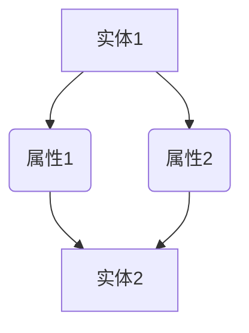
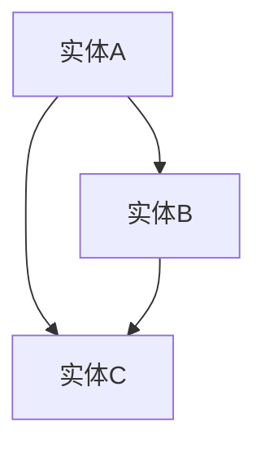

                 

关键词：知识图谱、知识管理、语义网络、数据模型、人工智能

摘要：知识图谱作为一种新兴的数据模型，正在引领知识管理的变革。本文将深入探讨知识图谱的核心概念、算法原理、数学模型、应用场景以及未来发展趋势，旨在为读者提供全面而深刻的理解。

## 1. 背景介绍

随着互联网和大数据的迅猛发展，数据量呈现出爆炸式增长。然而，如何有效地管理和利用这些海量数据，成为企业和研究者共同面临的挑战。知识图谱（Knowledge Graph）作为一种先进的数据模型，应运而生。知识图谱旨在将海量数据组织成一个语义丰富的、层次分明的网络结构，从而提高数据的可解释性和可操作性。

知识图谱的起源可以追溯到20世纪80年代的语义网络（Semantic Network）概念。在随后的几十年中，随着人工智能、自然语言处理和图论等技术的不断发展，知识图谱逐渐演化成为现代数据管理的重要工具。

## 2. 核心概念与联系

### 2.1. 定义

知识图谱是一种语义网络，它使用节点和边来表示实体和它们之间的关系。每个节点代表一个实体，如人、地点或物体；边表示实体之间的关系，如“是”、“属于”或“发生在”。

### 2.2. 结构

知识图谱通常包含三个主要部分：实体、属性和关系。

- **实体（Entity）**：知识图谱中的数据对象，可以是任何具有独立存在意义的事物，如人、地点、组织等。
- **属性（Property）**：实体的特征描述，如姓名、年龄、地址等。
- **关系（Relation）**：实体之间的关联，如“朋友”、“居住在”、“工作于”等。

### 2.3. Mermaid 流程图

以下是一个简化的知识图谱的 Mermaid 流程图：



在这个例子中，实体1具有属性1和属性2，实体2与实体1通过属性1和属性2建立关系。

## 3. 核心算法原理 & 具体操作步骤

### 3.1. 算法原理概述

知识图谱的核心算法主要包括实体识别、关系抽取和图谱构建。

- **实体识别**：识别文本中的实体，并将其转换为知识图谱中的节点。
- **关系抽取**：从文本中提取实体之间的关系，并将其转换为知识图谱中的边。
- **图谱构建**：将实体和关系组织成一个语义丰富的网络结构。

### 3.2. 算法步骤详解

#### 3.2.1. 实体识别

实体识别通常使用命名实体识别（Named Entity Recognition, NER）技术。NER 的主要步骤如下：

1. **分词**：将文本拆分成单词或词组。
2. **词性标注**：为每个词分配词性，如名词、动词、形容词等。
3. **实体分类**：根据词性和上下文，将词组分类为实体。

#### 3.2.2. 关系抽取

关系抽取通常使用依存句法分析（Dependency Parsing）技术。关系抽取的主要步骤如下：

1. **句法分析**：分析句子结构，识别词与词之间的依赖关系。
2. **关系分类**：根据依赖关系，将关系分类为预定义的类型，如“是”、“属于”、“发生在”等。

#### 3.2.3. 图谱构建

图谱构建的主要步骤如下：

1. **创建节点**：根据实体识别的结果，创建节点。
2. **添加边**：根据关系抽取的结果，为节点添加边。
3. **优化图谱**：通过图算法，对图谱进行优化，如去重、合并相似节点等。

### 3.3. 算法优缺点

#### 优点

- **高可解释性**：知识图谱具有清晰的语义结构，使得数据更加易于理解和解释。
- **高效检索**：通过图算法，可以快速查询图谱中的实体和关系。

#### 缺点

- **数据质量**：知识图谱的质量依赖于原始数据的质量，如果原始数据存在错误，知识图谱也会受到影响。
- **复杂度**：知识图谱的处理和构建过程相对复杂，需要较高的技术和资源。

### 3.4. 算法应用领域

知识图谱在多个领域都有广泛应用，如：

- **搜索引擎**：通过知识图谱，可以提供更准确的搜索结果和更智能的推荐系统。
- **自然语言处理**：知识图谱可以用于实体识别、关系抽取、语义分析等任务。
- **智能推荐**：通过知识图谱，可以更好地理解用户和物品之间的关系，提供更个性化的推荐。

## 4. 数学模型和公式 & 详细讲解 & 举例说明

### 4.1. 数学模型构建

知识图谱的数学模型通常基于图论和图矩阵。

- **图论**：知识图谱可以看作是一个无向图，其中节点代表实体，边代表关系。
- **图矩阵**：知识图谱可以用图矩阵（Adjacency Matrix）表示，其中矩阵元素表示节点之间的关系。

### 4.2. 公式推导过程

设 \( G = (V, E) \) 是一个知识图谱，其中 \( V \) 是节点集，\( E \) 是边集。图矩阵 \( A \) 的元素 \( A_{ij} \) 表示节点 \( v_i \) 和 \( v_j \) 之间的关系。

1. **节点度**：节点 \( v_i \) 的度（Degree）定义为与其相连的边数，即 \( d_i = \sum_{j=1}^{n} A_{ij} \)。
2. **路径长度**：节点 \( v_i \) 和 \( v_j \) 之间的最短路径长度为 \( L_{ij} \)。
3. **聚类系数**：节点 \( v_i \) 的聚类系数（Clustering Coefficient）定义为 \( C_i = \frac{2 \times |N(i)|}{d_i \times (d_i - 1)} \)，其中 \( N(i) \) 是与 \( v_i \) 相连的节点的集合。

### 4.3. 案例分析与讲解

假设有一个简单的知识图谱，其中包含三个节点和三条边，如下图所示：



1. **节点度**：节点A的度 \( d_A = 2 \)，节点B的度 \( d_B = 2 \)，节点C的度 \( d_C = 2 \)。
2. **路径长度**：节点A和节点C之间的最短路径长度 \( L_{AC} = 1 \)。
3. **聚类系数**：节点A的聚类系数 \( C_A = 1 \)，节点B的聚类系数 \( C_B = 1 \)，节点C的聚类系数 \( C_C = 1 \)。

通过这个例子，我们可以看到知识图谱的数学模型如何帮助我们理解和分析图谱的结构。

## 5. 项目实践：代码实例和详细解释说明

### 5.1. 开发环境搭建

为了演示知识图谱的构建，我们将使用Python语言和图数据库Neo4j。

1. **安装Neo4j**：从官方网站下载并安装Neo4j。
2. **安装Python环境**：确保Python环境已安装。
3. **安装Py2neo库**：使用pip命令安装Py2neo库，用于Python与Neo4j的交互。

```bash
pip install py2neo
```

### 5.2. 源代码详细实现

下面是一个简单的知识图谱构建的示例代码：

```python
from py2neo import Graph

# 连接到Neo4j数据库
graph = Graph("bolt://localhost:7687", auth=("neo4j", "password"))

# 创建实体节点
graph.run("CREATE (a:Person {name: 'Alice'})")
graph.run("CREATE (b:Person {name: 'Bob'})")
graph.run("CREATE (c:Person {name: 'Charlie'})")

# 创建关系边
graph.run("MATCH (a:Person), (b:Person) WHERE a.name = 'Alice' AND b.name = 'Bob' CREATE (a)-[:FRIEND]->(b)")
graph.run("MATCH (a:Person), (c:Person) WHERE a.name = 'Alice' AND c.name = 'Charlie' CREATE (a)-[:FRIEND]->(c)")

# 查询图谱
results = graph.run("MATCH (n) RETURN n")
for result in results:
    print(result)
```

### 5.3. 代码解读与分析

1. **连接Neo4j数据库**：使用Py2neo库连接到本地运行的Neo4j数据库。
2. **创建实体节点**：使用Cypher查询语言创建三个Person实体节点，每个节点包含一个name属性。
3. **创建关系边**：为每个实体节点创建两个FRIEND关系边。
4. **查询图谱**：使用Cypher查询语言查询图谱中的所有节点，并打印输出。

通过这个示例，我们可以看到如何使用Python和Neo4j构建一个简单的知识图谱。

## 6. 实际应用场景

### 6.1. 社交网络分析

知识图谱可以用于社交网络分析，如识别用户之间的社交关系、推荐朋友等。

### 6.2. 智能搜索

知识图谱可以用于智能搜索，如根据用户查询，提供相关的实体和关系，从而提高搜索结果的准确性。

### 6.3. 产品推荐

知识图谱可以用于产品推荐，如根据用户的历史购买记录和兴趣，推荐相关的产品。

### 6.4. 未来应用展望

随着人工智能和大数据技术的发展，知识图谱在未来将会有更广泛的应用，如智能医疗、智能金融、智能城市等。

## 7. 工具和资源推荐

### 7.1. 学习资源推荐

- **《图数据库技术指南》**：详细介绍了图数据库的基本概念、原理和应用。
- **《知识图谱技术与应用》**：全面介绍了知识图谱的构建、算法和应用。

### 7.2. 开发工具推荐

- **Neo4j**：最受欢迎的图数据库之一，支持丰富的图算法和API。
- **Py2neo**：Python库，用于Python与Neo4j的交互。

### 7.3. 相关论文推荐

- **"Knowledge Graph Embedding: The State-of-the-Art and Beyond"**：对知识图谱嵌入技术进行了全面的综述。
- **"Deep Learning for Knowledge Graph Embedding"**：介绍了深度学习在知识图谱嵌入中的应用。

## 8. 总结：未来发展趋势与挑战

### 8.1. 研究成果总结

知识图谱作为一种先进的数据模型，已经在多个领域取得了显著的成果。未来，知识图谱将继续在人工智能、大数据等领域发挥重要作用。

### 8.2. 未来发展趋势

随着人工智能和大数据技术的发展，知识图谱将继续向智能化、自动化和高效化方向发展。未来，知识图谱将更加注重跨领域融合和个性化应用。

### 8.3. 面临的挑战

知识图谱在发展过程中也面临一些挑战，如数据质量、算法复杂度、计算效率等。未来，需要进一步研究和解决这些问题。

### 8.4. 研究展望

知识图谱是知识管理的重要工具，未来将在更多领域得到应用。我们期待看到知识图谱在人工智能、大数据等领域的进一步发展和创新。

## 9. 附录：常见问题与解答

### Q: 什么是知识图谱？

A: 知识图谱是一种语义网络，它使用节点和边来表示实体和它们之间的关系。

### Q: 知识图谱有哪些应用领域？

A: 知识图谱广泛应用于社交网络分析、智能搜索、产品推荐、智能医疗、智能金融等领域。

### Q: 如何构建知识图谱？

A: 构建知识图谱通常包括实体识别、关系抽取和图谱构建三个步骤。

### Q: 知识图谱和语义网络有什么区别？

A: 知识图谱是语义网络的一种发展，它在语义网络的基础上引入了更丰富的语义信息和结构化数据。

作者：禅与计算机程序设计艺术 / Zen and the Art of Computer Programming
----------------------------------------------------------------

以上就是本文的完整内容。知识图谱作为一种先进的数据模型，正逐渐改变我们的数据管理和分析方式。通过本文的探讨，我们深入了解了知识图谱的核心概念、算法原理、数学模型、应用场景以及未来发展趋势。希望本文能为读者提供有价值的参考和启发。在未来的研究和应用中，让我们共同努力，探索知识图谱的无限可能。

