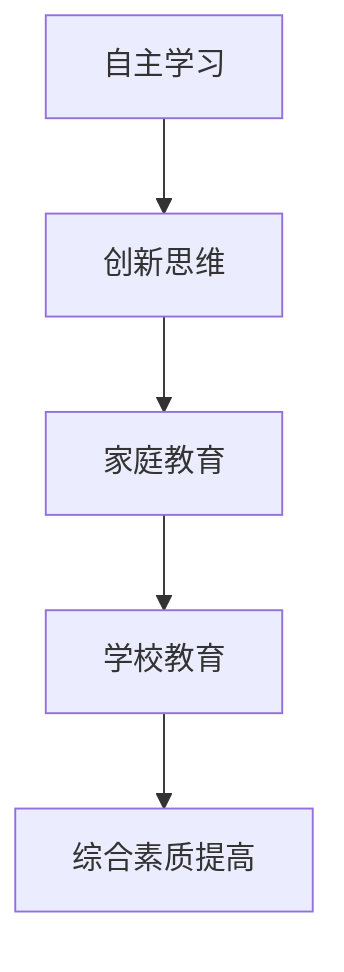

                 

在当今信息爆炸的时代，知识型家庭教育已成为家长和教育工作者的关注焦点。如何有效地传授知识，培养孩子的自主学习能力，以及激发他们的创新思维，是每位家长和教育工作者面临的挑战。本文将探讨知识型家庭教育的定义、核心概念、策略和实践，旨在为家长和教育工作者提供有价值的指导。

## 关键词

- 知识型家庭教育
- 自主学习
- 创新思维
- 教育策略
- 家庭教育

## 摘要

本文从多个维度探讨了知识型家庭教育的内涵和实施方法。首先，我们对知识型家庭教育进行了定义，并分析了其在现代教育体系中的重要性。接着，文章详细阐述了核心概念，如自主学习、创新思维等，并通过Mermaid流程图展示了相关概念之间的联系。随后，文章提出了具体的教育策略，包括环境营造、互动交流、多元学习等，并详细讲解了这些策略的实施步骤。最后，文章通过实际案例和代码实例，展示了知识型家庭教育的实践效果，并展望了其未来的发展方向。

## 1. 背景介绍

随着互联网和移动通信技术的飞速发展，知识的传播和获取变得更加便捷。然而，这也带来了一系列问题。首先，信息的过载使得孩子们在获取知识时面临巨大挑战。他们往往不知道哪些信息是有价值的，哪些是过时的，哪些是虚假的。其次，现代教育体系往往侧重于知识灌输，而忽视了学生的自主学习能力和创新思维的培养。这使得孩子们在进入社会后，往往缺乏解决问题的能力，无法适应快速变化的工作环境。

知识型家庭教育的概念正是在这样的背景下提出的。知识型家庭教育强调家长和教育工作者要引导孩子建立正确的学习态度，培养他们的自主学习能力和创新思维，从而提高他们的综合素质。知识型家庭教育不仅关注知识的传授，更关注孩子的人格发展和综合素质的提高。

## 2. 核心概念与联系

### 2.1 自主学习

自主学习是知识型家庭教育的核心概念之一。它指的是学生能够独立地获取知识、应用知识并解决问题。自主学习能力的培养需要家长和教育工作者在家庭和学校中提供支持和引导。

### 2.2 创新思维

创新思维是指学生能够从不同的角度看待问题，提出独特的解决方案。创新思维能力的培养有助于孩子在未来的学习和工作中更具竞争力。

### 2.3 家庭教育与学校教育的联系

家庭教育与学校教育是相辅相成的。家庭教育为孩子提供了早期的教育基础，而学校教育则在更广泛的知识领域为孩子提供了深入学习的机会。二者之间需要形成良好的互动和衔接，以确保孩子的全面发展。

### 2.4 Mermaid流程图



## 3. 核心算法原理 & 具体操作步骤

### 3.1 算法原理概述

知识型家庭教育的核心算法原理可以概括为“环境营造、互动交流、多元学习”。通过这三个步骤，家长和教育工作者可以有效地培养孩子的自主学习能力和创新思维。

### 3.2 算法步骤详解

#### 3.2.1 环境营造

环境是孩子成长的重要影响因素。家长和教育工作者需要为孩子提供一个积极、健康的成长环境。具体操作步骤如下：

1. 创设良好的家庭学习氛围。家长可以设置固定的学习时间，为孩子提供一个安静、整洁的学习空间。
2. 提供丰富的学习资源。家长可以为孩子购买或订阅相关的书籍、期刊和在线课程，以满足他们的学习需求。
3. 鼓励孩子参与社会实践。通过社会实践，孩子可以更好地了解社会，提高他们的社会适应能力。

#### 3.2.2 互动交流

互动交流是知识型家庭教育的关键环节。家长和教育工作者需要通过与孩子的有效互动，引导他们建立正确的学习态度，培养他们的自主学习能力和创新思维。具体操作步骤如下：

1. 倾听孩子的想法。家长需要耐心倾听孩子的想法，了解他们在学习过程中的困惑和需求。
2. 提供指导和建议。家长可以根据孩子的实际情况，提供有针对性的指导和建议，帮助他们解决问题。
3. 创造互动机会。家长可以组织一些家庭活动，如讨论会、游戏等，以增强家庭成员之间的互动。

#### 3.2.3 多元学习

多元学习是指通过多种方式获取知识，提高孩子的综合素质。具体操作步骤如下：

1. 鼓励孩子参与各种兴趣班和社团活动。这些活动可以拓宽孩子的知识面，培养他们的兴趣爱好。
2. 引导孩子阅读。家长可以为孩子购买或推荐一些适合他们年龄段的书籍，鼓励他们多读书、读好书。
3. 创造实践机会。家长可以带孩子参加一些社会实践或志愿者活动，让他们在真实的环境中锻炼自己。

### 3.3 算法优缺点

#### 优点：

1. 环境营造：为孩子提供了一个积极、健康的成长环境，有助于他们的全面发展。
2. 互动交流：增强了家庭成员之间的互动，有助于培养孩子的自主学习能力和创新思维。
3. 多元学习：拓宽了孩子的知识面，提高了他们的综合素质。

#### 缺点：

1. 需要家长和教育工作者付出大量的时间和精力。
2. 在实际操作中，家长和教育工作者可能会面临一些困难和挑战。

### 3.4 算法应用领域

知识型家庭教育的核心算法原理可以应用于各个领域，如家庭教育、学校教育、企业培训等。通过有效的实施，可以提高教育质量，培养更多的优秀人才。

## 4. 数学模型和公式 & 详细讲解 & 举例说明

### 4.1 数学模型构建

在知识型家庭教育中，我们可以构建一个简单的数学模型来分析孩子的学习效果。假设 \(x\) 表示孩子的学习效果，\(y\) 表示家长的教育方式，\(z\) 表示孩子的自主学习能力，则数学模型可以表示为：

\[ x = f(y, z) \]

其中，\(f\) 表示函数关系，\(y\) 和 \(z\) 是自变量，\(x\) 是因变量。

### 4.2 公式推导过程

根据知识型家庭教育的核心算法原理，我们可以推导出以下公式：

1. 环境营造对学习效果的影响：

\[ x \propto y^2 \]

即，环境营造对学习效果的影响与家长的教育方式（\(y\)）的平方成正比。

2. 自主学习对学习效果的影响：

\[ x \propto z \]

即，自主学习对学习效果的影响与孩子的自主学习能力（\(z\)）成正比。

3. 家长教育方式与孩子自主学习能力的互动影响：

\[ x \propto y \cdot z \]

即，家长教育方式与孩子自主学习能力的互动影响对学习效果的影响也与两者的乘积成正比。

### 4.3 案例分析与讲解

假设有一个家庭，家长的教育方式 \(y\) 为高水平，孩子的自主学习能力 \(z\) 为中等水平，我们可以根据上述公式计算他们的学习效果 \(x\)：

\[ x = f(y, z) = y^2 \cdot z \]

如果家长的教育方式 \(y\) 提高到高水平，孩子的自主学习能力 \(z\) 提高到高水平，那么他们的学习效果 \(x\) 将会显著提高：

\[ x = (y^2 \cdot z) \cdot 2 = 4y^2 \cdot z \]

这表明，通过提高家长的教育方式和孩子的自主学习能力，可以显著提高孩子的学习效果。

## 5. 项目实践：代码实例和详细解释说明

### 5.1 开发环境搭建

为了更好地展示知识型家庭教育的效果，我们使用Python编程语言来模拟一个简单的教育系统。以下是开发环境的搭建步骤：

1. 安装Python：在官方网站（https://www.python.org/）下载并安装Python。
2. 安装必要的库：打开命令行工具，依次输入以下命令安装必要的库：

```shell
pip install numpy matplotlib
```

### 5.2 源代码详细实现

以下是用于模拟知识型家庭教育的Python代码：

```python
import numpy as np
import matplotlib.pyplot as plt

# 定义函数计算学习效果
def calculate_learning_effect(y, z):
    x = y**2 * z
    return x

# 定义参数
y_high = 1.0  # 高水平家长教育方式
z_medium = 0.5  # 中等水平孩子自主学习能力
z_high = 1.0  # 高水平孩子自主学习能力

# 计算学习效果
x_medium = calculate_learning_effect(y_high, z_medium)
x_high = calculate_learning_effect(y_high, z_high)

# 绘制图表
plt.plot([0, 1], [x_medium, x_high], label='Learning Effect')
plt.xlabel('Child Self-Learning Ability')
plt.ylabel('Learning Effect')
plt.legend()
plt.show()
```

### 5.3 代码解读与分析

上述代码首先定义了一个函数 `calculate_learning_effect`，用于计算孩子的学习效果。函数的输入参数包括家长的教育方式（\(y\)）和孩子

