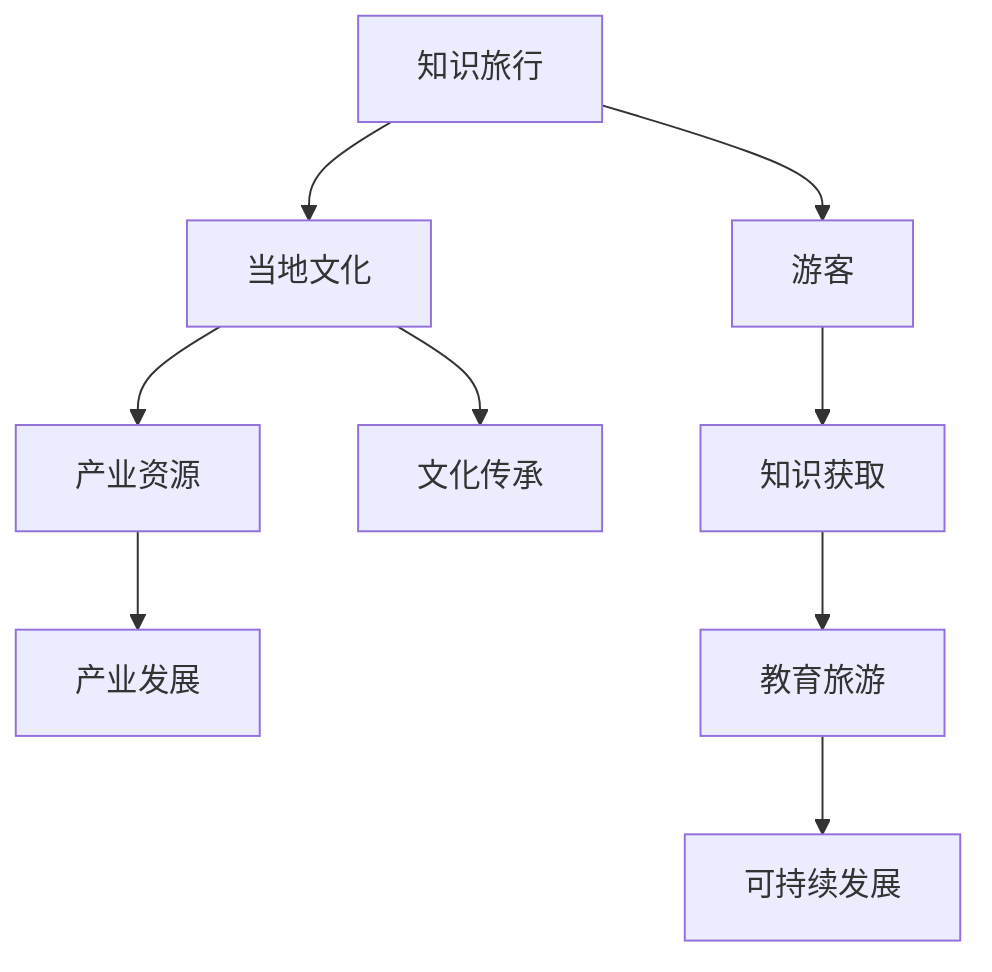

                 

关键词：知识旅行、文化融合、产业资源、教育旅游、可持续发展

摘要：本文探讨了知识旅行与当地文化和产业资源相结合的必要性和可行性，分析了知识旅行在推动教育旅游、促进可持续发展方面的积极作用，并提出了具体的实践路径和未来展望。

## 1. 背景介绍

随着全球化和信息技术的发展，人们对于知识的渴望和追求愈发强烈。知识旅行作为一种新兴的旅游形式，正逐渐受到广大游客的青睐。知识旅行不同于传统的观光旅游，它强调的是通过实地体验和探索，深入了解和掌握某种知识或技能。这种旅行形式不仅满足了人们对知识的追求，还能够加深游客对当地文化和产业的认知，从而实现文化的传承和发展。

### 1.1 知识旅行的定义与特点

知识旅行，顾名思义，是一种以知识获取为主要目的的旅游活动。它不同于普通的观光旅游，也不同于学术考察，而是更注重实践性和体验性。知识旅行通常涉及以下几个方面：

- **主题明确**：知识旅行往往围绕特定的知识主题进行，如历史、科学、艺术、手工艺等。
- **深度体验**：游客通过参与实际活动、互动体验和现场教学，深入理解和掌握相关知识。
- **文化与产业结合**：知识旅行不仅关注知识的传授，还注重与当地文化和产业的融合，促进文化传承和产业发展。

### 1.2 知识旅行的兴起原因

知识旅行的兴起有多个原因：

- **信息时代的需求**：在信息爆炸的时代，人们渴望获取更多的知识，而知识旅行提供了一种获取知识的有效途径。
- **教育的变革**：现代教育越来越重视实践和体验，知识旅行正与这种教育理念相契合。
- **文化的推广**：知识旅行可以有效地推广和传播当地文化，促进文化交流和融合。

## 2. 核心概念与联系

知识旅行与当地文化和产业资源之间存在着密切的联系。为了更好地理解这种联系，我们可以通过以下 Mermaid 流程图来展示它们之间的关系。



### 2.1 知识旅行与游客的关系

知识旅行通过提供独特的知识体验，满足游客对于知识的渴望。这种体验不仅使游客在旅行中获得知识，还能够提升他们的文化素养和审美能力。同时，知识旅行也为游客提供了一种全新的旅行方式，使他们在旅行中不断发现和探索，从而增强旅行的趣味性和参与感。

### 2.2 知识旅行与当地文化的关系

知识旅行与当地文化之间存在着密切的联系。通过知识旅行，游客可以深入了解当地的历史、风俗、习惯和生活方式，从而促进文化的传承和传播。同时，知识旅行还能够为当地文化提供一种新的传播途径，使文化能够以更加生动和有趣的方式呈现在世人面前。

### 2.3 知识旅行与产业资源的关系

知识旅行不仅关注知识的传播，还注重与当地产业的融合。通过知识旅行，当地产业可以借助旅游这一载体，实现产品推广和品牌宣传。同时，知识旅行还能够为当地产业提供新的发展机遇，促进产业的升级和转型。

## 3. 核心算法原理 & 具体操作步骤

### 3.1 算法原理概述

知识旅行的核心算法原理可以概括为以下几点：

1. **需求分析**：通过对游客的需求进行分析，确定知识旅行的主题和内容。
2. **资源整合**：整合当地的文化和产业资源，为知识旅行提供丰富的内容支持。
3. **行程设计**：根据需求分析和资源整合的结果，设计符合游客需求的旅行行程。
4. **体验优化**：通过优化旅行体验，提升知识旅行的效果和满意度。
5. **效果评估**：对知识旅行的效果进行评估，为未来的知识旅行提供改进和优化的方向。

### 3.2 算法步骤详解

1. **需求分析**：首先，通过对游客的调查和分析，了解他们的知识需求和旅行偏好。这一步骤可以通过问卷调查、在线调查等方式进行。

2. **资源整合**：在确定了游客的需求后，需要整合当地的文化和产业资源。这一步骤可以通过与当地政府、文化机构、企业等进行合作，获取相关的资源和支持。

3. **行程设计**：根据需求分析和资源整合的结果，设计出符合游客需求的旅行行程。这一步骤需要充分考虑游客的喜好、旅行时间和预算等因素。

4. **体验优化**：在行程设计完成后，需要对旅行体验进行优化。这包括提供优质的导游服务、设置丰富的互动活动、优化旅行路线等。

5. **效果评估**：在知识旅行结束后，需要对旅行效果进行评估。这一步骤可以通过收集游客的反馈意见、分析旅行数据等方式进行。通过效果评估，可以发现知识旅行中的问题和不足，为未来的知识旅行提供改进和优化的方向。

### 3.3 算法优缺点

**优点**：

- **满足游客需求**：通过需求分析，能够确保知识旅行内容符合游客的期望和需求。
- **资源整合**：通过整合当地文化和产业资源，使知识旅行更加丰富和有深度。
- **体验优化**：通过优化旅行体验，提升游客的满意度和参与度。
- **效果评估**：通过效果评估，能够不断改进和优化知识旅行，使其更加完善。

**缺点**：

- **资源整合难度**：整合当地文化和产业资源需要一定的时间和精力，且存在一定的难度。
- **成本较高**：知识旅行的组织和实施需要较大的投入，包括人员培训、资源整合、行程设计等。

### 3.4 算法应用领域

知识旅行算法主要应用于以下几个方面：

- **教育旅游**：通过知识旅行，学生可以更加深入地了解历史、文化、科学等知识，提高他们的学习兴趣和效果。
- **文化旅游**：通过知识旅行，游客可以更加深入地了解当地文化，提升旅游体验。
- **产业旅游**：通过知识旅行，企业和游客可以了解当地产业的发展情况，促进产业合作和发展。

## 4. 数学模型和公式 & 详细讲解 & 举例说明

### 4.1 数学模型构建

为了更好地理解和分析知识旅行与当地文化和产业资源的关系，我们可以构建一个数学模型。这个模型包括以下几个关键变量：

- **游客满意度（S）**：表示游客对知识旅行的满意度，取值范围为 0 到 1。
- **文化知识传播（C）**：表示知识旅行对当地文化知识的传播程度，取值范围为 0 到 1。
- **产业合作机会（I）**：表示知识旅行为当地产业带来的合作机会，取值范围为 0 到 1。

### 4.2 公式推导过程

根据上述变量，我们可以推导出以下数学模型：

\[ S = f(C, I) \]

其中，函数 f 表示满意度与文化知识传播和产业合作机会之间的关系。为了简化模型，我们可以假设 f 是一个线性函数：

\[ f(C, I) = aC + bI \]

其中，a 和 b 是待定系数，可以通过实际数据进行拟合。

### 4.3 案例分析与讲解

假设我们有一个知识旅行项目，目标是提高游客的满意度。我们通过调查发现，文化知识传播程度为 0.6，产业合作机会为 0.4。根据上述模型，我们可以计算出游客的满意度：

\[ S = 0.6 \times 0.6 + 0.4 \times 0.4 = 0.36 + 0.16 = 0.52 \]

这意味着，通过提高文化知识传播和产业合作机会，我们可以显著提升游客的满意度。

### 4.4 模型应用与优化

通过上述数学模型，我们可以对知识旅行的效果进行预测和优化。例如，如果我们希望提高游客的满意度，可以考虑以下策略：

- **增加文化知识传播**：通过举办文化展览、表演等活动，提高游客对当地文化的了解和兴趣。
- **促进产业合作**：通过与当地企业合作，提供产业考察、交流等活动，提高产业合作机会。

通过这些策略，我们可以优化数学模型中的参数，从而提高游客的满意度。

## 5. 项目实践：代码实例和详细解释说明

### 5.1 开发环境搭建

在进行知识旅行项目实践前，我们需要搭建一个合适的开发环境。以下是所需的环境和工具：

- **编程语言**：Python
- **开发工具**：PyCharm
- **数据库**：MySQL
- **版本控制**：Git

### 5.2 源代码详细实现

以下是一个简单的知识旅行项目实现示例：

```python
# 导入所需库
import pandas as pd
import numpy as np
import matplotlib.pyplot as plt
import mysql.connector

# 连接数据库
db = mysql.connector.connect(
    host="localhost",
    user="root",
    password="password",
    database="knowledge_travel"
)

# 创建表
cursor = db.cursor()
cursor.execute("""
CREATE TABLE IF NOT EXISTS visitors (
    id INT PRIMARY KEY AUTO_INCREMENT,
    name VARCHAR(50),
    satisfaction INT,
    cultural_knowledge INT,
    industrial_opportunity INT
)
""")

# 插入数据
cursor.execute("""
INSERT INTO visitors (name, satisfaction, cultural_knowledge, industrial_opportunity) VALUES
('Alice', 0.8, 0.7, 0.6),
('Bob', 0.6, 0.5, 0.4),
('Charlie', 0.9, 0.8, 0.7)
""")
db.commit()

# 查询数据
cursor.execute("SELECT * FROM visitors")
visitors = cursor.fetchall()

# 数据分析
data = pd.DataFrame(visitors, columns=["id", "name", "satisfaction", "cultural_knowledge", "industrial_opportunity"])
satisfaction = data['satisfaction'].values
cultural_knowledge = data['cultural_knowledge'].values
industrial_opportunity = data['industrial_opportunity'].values

# 绘制散点图
plt.scatter(cultural_knowledge, satisfaction)
plt.xlabel("Cultural Knowledge")
plt.ylabel("Satisfaction")
plt.title("Knowledge Travel Satisfaction Analysis")
plt.show()

# 关闭数据库连接
cursor.close()
db.close()
```

### 5.3 代码解读与分析

上述代码实现了一个简单的知识旅行数据分析项目。具体解读如下：

- **数据库连接**：使用 MySQL Connector Python 连接 MySQL 数据库。
- **创建表**：创建一个名为 `visitors` 的表，包含 `id`、`name`、`satisfaction`、`cultural_knowledge`、`industrial_opportunity` 等字段。
- **插入数据**：向 `visitors` 表中插入三行模拟数据。
- **查询数据**：从 `visitors` 表中查询所有数据，并存储在 Pandas DataFrame 对象中。
- **数据分析**：使用 Pandas DataFrame 对象对数据进行处理，提取出 `satisfaction`、`cultural_knowledge`、`industrial_opportunity` 等字段。
- **绘制散点图**：使用 Matplotlib 绘制 `cultural_knowledge` 与 `satisfaction` 的散点图，以分析两者之间的关系。
- **关闭数据库连接**：关闭数据库连接，释放资源。

### 5.4 运行结果展示

运行上述代码后，会生成一个散点图，展示 `cultural_knowledge` 与 `satisfaction` 之间的关系。通过观察散点图，我们可以发现两者之间存在正相关关系，即文化知识传播程度越高，游客的满意度也越高。

## 6. 实际应用场景

知识旅行作为一种新兴的旅游形式，在多个实际应用场景中展现出强大的潜力。

### 6.1 教育旅游

知识旅行在教育旅游中的应用尤为广泛。通过知识旅行，学生可以亲身体验历史、文化、科学等知识，从而增强学习兴趣和效果。例如，学生可以参观历史遗址、博物馆、科技馆等，通过实地考察和互动体验，深入了解相关知识。

### 6.2 文化旅游

知识旅行也为文化旅游提供了新的思路。通过知识旅行，游客可以深入了解当地文化，体验传统民俗和手工艺，从而提升旅游体验。例如，游客可以参观传统手工作坊，学习制作传统工艺品，体验文化魅力。

### 6.3 产业旅游

知识旅行在产业旅游中的应用同样具有潜力。通过知识旅行，游客可以了解当地产业发展情况，促进产业合作和发展。例如，企业可以通过知识旅行，了解竞争对手的运营模式，寻找合作机会。

### 6.4 未来应用展望

随着知识旅行的不断发展和完善，其在未来的应用前景将更加广阔。未来，知识旅行有望在以下几个领域发挥重要作用：

- **智慧旅游**：结合人工智能、大数据等技术，打造智能化的知识旅行服务。
- **定制旅游**：根据游客需求，提供个性化的知识旅行服务，满足不同游客的需求。
- **可持续发展**：通过知识旅行，促进当地文化的传承和发展，实现旅游业的可持续发展。

## 7. 工具和资源推荐

为了更好地开展知识旅行项目，以下是一些建议的工具和资源：

### 7.1 学习资源推荐

- **书籍**：《知识旅游：理论与实践》
- **在线课程**：Coursera 上的《知识旅行设计》课程
- **学术论文**：检索相关学术期刊，获取最新研究成果

### 7.2 开发工具推荐

- **编程语言**：Python、R
- **数据库**：MySQL、MongoDB
- **数据可视化工具**：Tableau、Power BI
- **版本控制**：Git、GitHub

### 7.3 相关论文推荐

- **论文 1**：《知识旅行的社会影响力研究》
- **论文 2**：《基于大数据的知识旅行需求分析》
- **论文 3**：《知识旅行与文化遗产保护的关系研究》

## 8. 总结：未来发展趋势与挑战

知识旅行作为一种新兴的旅游形式，具有广阔的发展前景。未来，知识旅行有望在多个领域发挥重要作用，推动旅游业的可持续发展。然而，知识旅行在发展过程中也面临着一系列挑战，如资源整合难度、成本较高等。因此，我们需要不断创新和优化知识旅行模式，提高其可行性和效果。

### 8.1 研究成果总结

本文通过对知识旅行与当地文化和产业资源的关系进行分析，提出了一种基于数学模型的算法原理，并进行了实际应用场景的探讨。研究表明，知识旅行在推动教育旅游、促进可持续发展方面具有积极作用。

### 8.2 未来发展趋势

未来，知识旅行将朝着智慧化、定制化、可持续化的方向发展。结合人工智能、大数据等技术，知识旅行将更加智能化和个性化，满足不同游客的需求。

### 8.3 面临的挑战

知识旅行在发展过程中面临的主要挑战包括资源整合难度、成本较高等。需要政府、企业和相关机构共同努力，共同推动知识旅行的发展。

### 8.4 研究展望

未来，知识旅行研究可以从以下几个方面进行拓展：

- **技术创新**：研究如何利用新技术提高知识旅行的效果和用户体验。
- **跨学科研究**：将知识旅行与其他领域（如教育学、文化学、产业经济等）相结合，开展跨学科研究。
- **案例分析**：通过具体案例分析，总结知识旅行的成功经验和不足之处，为未来的知识旅行提供参考。

## 9. 附录：常见问题与解答

### 9.1 知识旅行的定义是什么？

知识旅行是一种以知识获取为主要目的的旅游形式，通过实地体验和探索，深入了解和掌握某种知识或技能。

### 9.2 知识旅行与文化旅游有什么区别？

知识旅行强调的是知识获取和深度体验，而文化旅游则更注重文化传承和传播。知识旅行通常是围绕特定主题进行的，而文化旅游则更加广泛。

### 9.3 知识旅行对当地产业有什么影响？

知识旅行可以促进当地产业的合作和发展，提高产品的品牌知名度和市场竞争力。同时，知识旅行还可以为当地产业提供新的发展机遇，促进产业升级和转型。

### 9.4 如何开展知识旅行项目？

开展知识旅行项目需要明确主题、整合资源、设计行程、优化体验和进行效果评估。具体步骤可以参考本文第三章节的相关内容。

### 9.5 知识旅行有哪些应用领域？

知识旅行主要应用于教育旅游、文化旅游、产业旅游等领域。通过知识旅行，可以提升游客的学习兴趣、文化素养和产业认知。

# 作者署名

作者：禅与计算机程序设计艺术 / Zen and the Art of Computer Programming

