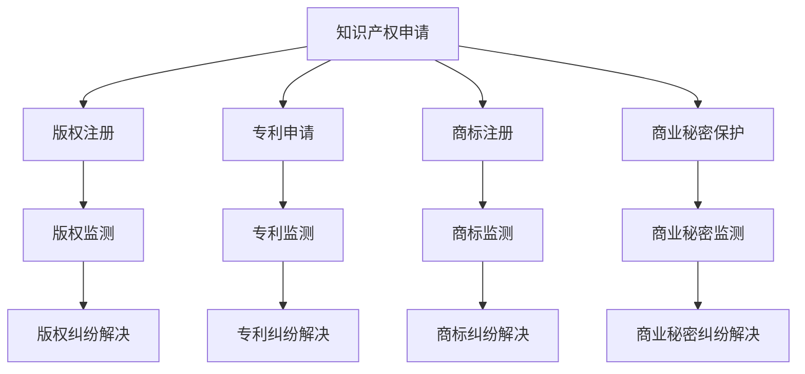

                 

关键词：知识产权，创新激励，公共利益，知识产权保护机制，技术发展，版权法，专利法，信息安全，开源协议，区块链技术。

> 摘要：本文探讨了知识产权保护在现代技术环境下的重要性，分析了创新激励与公共利益之间的平衡问题。通过对知识产权保护的基本概念、法律框架和实际应用场景的深入讨论，本文提出了构建合理知识产权保护机制的建议，以促进技术创新和公共利益的双重实现。

## 1. 背景介绍

知识产权是指人们对其所创造的智力成果所享有的专有权利，包括版权、专利、商标、商业秘密等多种形式。随着信息技术和互联网的迅猛发展，知识经济成为全球经济的重要组成部分，知识产权的保护问题日益突出。知识产权不仅是个人和企业的核心竞争力，也是国家竞争力的关键因素。然而，在知识经济时代，如何平衡知识产权保护与创新激励、公共利益之间的关系，成为了一个亟待解决的难题。

### 1.1 知识产权保护的意义

知识产权保护对于创新和经济发展具有重要意义。首先，知识产权保护可以激励个人和企业进行创新活动，因为创新成果可以得到法律保护，创作者可以获得相应的经济回报。这有助于建立一个有利于创新的环境，推动技术的进步。其次，知识产权保护有助于维护市场秩序，防止不正当竞争。通过保护专利、版权等知识产权，可以避免市场上出现盗版、抄袭等违法行为，保护正当市场参与者的利益。

### 1.2 创新激励与公共利益的冲突

然而，知识产权保护并非没有争议。一方面，过度的知识产权保护可能导致创新成本增加，阻碍技术的传播和应用，影响公共利益。例如，专利权的过度保护可能会限制技术扩散，使得新技术的应用成本上升，进而影响公共利益。另一方面，如果知识产权保护不足，可能导致创新成果被随意复制和模仿，打击创新积极性，影响社会整体的技术进步。

### 1.3 知识产权保护的现状与挑战

目前，全球各国都在不断完善知识产权法律体系，加强知识产权保护。然而，随着技术的发展，知识产权保护面临着新的挑战。首先，互联网技术的普及使得知识传播速度加快，信息共享变得更加容易，这给知识产权保护带来了新的难题。其次，新兴技术的出现，如人工智能、区块链等，使得知识产权的界定和保护变得更加复杂。此外，不同国家和地区之间的知识产权法律体系和保护力度存在差异，这也给跨国知识产权保护带来了挑战。

### 1.4 研究目的与文章结构

本文旨在探讨知识产权保护在现代技术环境下的重要性，分析创新激励与公共利益之间的平衡问题。文章将从知识产权的基本概念和法律框架入手，分析知识产权保护的实际应用场景，并提出构建合理知识产权保护机制的建议。文章结构如下：

1. 背景介绍
2. 核心概念与联系
3. 核心算法原理 & 具体操作步骤
4. 数学模型和公式 & 详细讲解 & 举例说明
5. 项目实践：代码实例和详细解释说明
6. 实际应用场景
7. 未来应用展望
8. 工具和资源推荐
9. 总结：未来发展趋势与挑战
10. 附录：常见问题与解答

## 2. 核心概念与联系

在深入探讨知识产权保护之前，我们需要明确几个核心概念，并理解它们之间的联系。

### 2.1 版权与专利

版权（Copyright）主要涉及文学、艺术、音乐等作品的原创性表达，保护创作者的复制权、发行权、表演权等。专利（Patent）则主要涉及发明和创新，保护发明人的专利权，使其在一定期限内独占使用其发明。

### 2.2 商标与商业秘密

商标（Trademark）用于识别商品或服务的来源，保护商标持有人的品牌权益。商业秘密（Trade Secrets）是指不为公众所知悉、具有商业价值、经权利人采取保密措施的技术信息和经营信息。

### 2.3 知识产权保护机制

知识产权保护机制是指一系列法律法规、政策和措施，旨在确保知识产权的合法性和有效性。这些机制包括版权法、专利法、商标法、反不正当竞争法等。

### 2.4 Mermaid 流程图

为了更好地理解知识产权保护的核心概念和架构，我们可以使用 Mermaid 流程图来展示知识产权保护的基本流程。



该流程图展示了知识产权保护的各个环节，包括申请、监测和纠纷解决。通过该流程，我们可以清晰地看到知识产权保护的全过程，从而更好地理解知识产权保护机制。

## 3. 核心算法原理 & 具体操作步骤

在知识产权保护中，核心算法的原理和具体操作步骤对于实现有效的保护至关重要。以下我们将介绍几个关键的核心算法及其原理。

### 3.1  算法原理概述

知识产权保护中的核心算法主要包括加密算法、数字签名算法和哈希算法。这些算法共同构成了知识产权保护的技术基础。

#### 3.1.1 加密算法

加密算法是一种将明文信息转换为密文的技术，用于保护信息的安全性。常见的加密算法有对称加密和非对称加密。对称加密使用相同的密钥进行加密和解密，如AES算法；非对称加密使用一对密钥，一个用于加密，一个用于解密，如RSA算法。

#### 3.1.2 数字签名算法

数字签名算法用于确保信息的完整性和真实性。通过数字签名，发送方可以证明信息确实是由自己发送的，并且信息在传输过程中没有被篡改。常见的数字签名算法有RSA签名算法和ECDSA算法。

#### 3.1.3 哈希算法

哈希算法是一种将任意长度的数据映射为固定长度数据的算法，常用于确保数据的完整性。常见的哈希算法有MD5、SHA-1和SHA-256等。

### 3.2 算法步骤详解

以下是这些算法的具体操作步骤：

#### 3.2.1 加密算法

1. **选择加密算法和密钥**：根据安全需求和算法性能，选择合适的加密算法和密钥长度。
2. **加密**：使用选择的加密算法和密钥对明文信息进行加密，生成密文。
3. **解密**：接收方使用相同的加密算法和密钥对密文进行解密，还原出明文信息。

#### 3.2.2 数字签名算法

1. **生成密钥对**：使用随机数生成器生成一对密钥，一个私钥和一个公钥。
2. **签名**：发送方使用私钥对信息进行签名，生成数字签名。
3. **验证签名**：接收方使用公钥对数字签名进行验证，确认信息确实是由发送方发送的，并且没有被篡改。

#### 3.2.3 哈希算法

1. **选择哈希算法**：根据需求选择合适的哈希算法。
2. **计算哈希值**：使用选择的哈希算法对数据进行哈希计算，生成固定长度的哈希值。
3. **验证哈希值**：将计算出的哈希值与接收到的哈希值进行比较，如果一致，则数据完整，否则数据可能被篡改。

### 3.3 算法优缺点

#### 3.3.1 加密算法

**优点**：能够有效保护信息的安全性，确保信息在传输过程中不被窃取或篡改。

**缺点**：加密算法可能受到算法漏洞和密钥泄露的风险，需要定期更新加密算法和密钥。

#### 3.3.2 数字签名算法

**优点**：能够确保信息的完整性和真实性，防止信息被篡改或伪造。

**缺点**：数字签名算法可能受到私钥泄露的风险，需要确保私钥的安全存储。

#### 3.3.3 哈希算法

**优点**：计算速度快，能够高效地确保数据的完整性。

**缺点**：哈希算法可能受到哈希冲突的风险，即不同的数据可能生成相同的哈希值。

### 3.4 算法应用领域

加密算法、数字签名算法和哈希算法在知识产权保护中具有广泛的应用。它们被广泛应用于版权保护、专利保护、商标保护和商业秘密保护等领域，确保知识产权的合法性和安全性。

#### 3.4.1 版权保护

加密算法和数字签名算法可以用于版权保护，确保作品的完整性和真实性。例如，数字版权管理（DRM）技术使用加密算法保护数字内容，数字签名算法确保内容的合法性和完整性。

#### 3.4.2 专利保护

专利保护中的专利文件和专利申请材料可以使用哈希算法生成哈希值，确保文件的完整性和真实性。同时，数字签名算法可以用于确保专利申请材料的合法性和真实性。

#### 3.4.3 商标保护

商标保护中的商标注册文件和商标申请材料可以使用哈希算法生成哈希值，确保文件的完整性和真实性。数字签名算法可以用于确保商标申请材料的合法性和真实性。

#### 3.4.4 商业秘密保护

商业秘密保护中的技术信息和经营信息可以使用加密算法进行加密，确保信息的安全性。数字签名算法可以用于确保商业秘密的合法性和真实性。

## 4. 数学模型和公式 & 详细讲解 & 举例说明

知识产权保护中的数学模型和公式是确保知识产权合法性和安全性的关键。以下将介绍几个关键的数学模型和公式，并详细讲解其应用。

### 4.1 数学模型构建

在知识产权保护中，常用的数学模型包括加密模型、数字签名模型和哈希模型。

#### 4.1.1 加密模型

加密模型的基本公式为：

\[ E(K, P) = C \]

其中，\( E \)表示加密操作，\( K \)表示密钥，\( P \)表示明文信息，\( C \)表示密文信息。

#### 4.1.2 数字签名模型

数字签名模型的基本公式为：

\[ S = Sign(K_s, M) \]

其中，\( Sign \)表示签名操作，\( K_s \)表示私钥，\( M \)表示明文信息，\( S \)表示数字签名。

#### 4.1.3 哈希模型

哈希模型的基本公式为：

\[ H(M) = H^{} \]

其中，\( H \)表示哈希操作，\( M \)表示明文信息，\( H^{} \)表示哈希值。

### 4.2 公式推导过程

#### 4.2.1 加密模型的推导

加密模型基于加密算法，其推导过程如下：

假设加密算法为 \( E(K, P) = C \)，其中 \( K \)为密钥，\( P \)为明文信息，\( C \)为密文信息。

加密过程可以表示为：

\[ C = E(K, P) \]

解密过程可以表示为：

\[ P = D(K, C) \]

其中，\( D \)表示解密操作。

#### 4.2.2 数字签名模型的推导

数字签名模型基于数字签名算法，其推导过程如下：

假设数字签名算法为 \( Sign(K_s, M) = S \)，其中 \( K_s \)为私钥，\( M \)为明文信息，\( S \)为数字签名。

签名过程可以表示为：

\[ S = Sign(K_s, M) \]

验证过程可以表示为：

\[ V = Verify(K_p, M, S) \]

其中，\( Verify \)表示验证操作，\( K_p \)为公钥。

#### 4.2.3 哈希模型的推导

哈希模型基于哈希算法，其推导过程如下：

假设哈希算法为 \( H(M) = H^{} \)，其中 \( M \)为明文信息，\( H^{} \)为哈希值。

哈希过程可以表示为：

\[ H^{} = H(M) \]

哈希值验证过程可以表示为：

\[ V = Verify(H^{}, M) \]

### 4.3 案例分析与讲解

以下通过一个简单的案例来讲解加密模型、数字签名模型和哈希模型的应用。

#### 4.3.1 加密模型的应用

假设有一个用户 \( Alice \) 想要将一条明文信息 \( M = "Hello World" \) 发送给用户 \( Bob \)，并使用AES加密算法进行加密。密钥 \( K \) 为 "mySecretKey"。

加密过程如下：

\[ C = E(K, M) = AES(K, M) = " encryptedMessage" \]

用户 \( Bob \) 使用相同的密钥 \( K \) 对密文 \( C \) 进行解密：

\[ P = D(K, C) = AES(K, C) = "Hello World" \]

#### 4.3.2 数字签名模型的应用

假设用户 \( Alice \) 使用RSA签名算法对明文信息 \( M = "Hello World" \) 进行签名。私钥 \( K_s \) 为 "myPrivateKey"，公钥 \( K_p \) 为 "myPublicKey"。

签名过程如下：

\[ S = Sign(K_s, M) = RSA\_Sign(K_s, M) = "signature" \]

用户 \( Bob \) 使用公钥 \( K_p \) 对签名 \( S \) 进行验证：

\[ V = Verify(K_p, M, S) = RSA\_Verify(K_p, M, S) = "Valid" \]

#### 4.3.3 哈希模型的应用

假设用户 \( Alice \) 使用SHA-256哈希算法对明文信息 \( M = "Hello World" \) 进行哈希计算。

哈希过程如下：

\[ H^{} = H(M) = SHA\_256(M) = "hashedValue" \]

用户 \( Bob \) 使用相同的哈希算法对哈希值 \( H^{} \) 进行验证：

\[ V = Verify(H^{}, M) = SHA\_256(M) = "matched" \]

## 5. 项目实践：代码实例和详细解释说明

在知识产权保护的实际应用中，代码实例是实现技术方案的关键。以下通过一个具体的代码实例，详细解释如何使用加密算法、数字签名算法和哈希算法来保护知识产权。

### 5.1 开发环境搭建

首先，我们需要搭建一个简单的开发环境，以便进行代码实例的实践。以下是一个基本的开发环境搭建步骤：

1. 安装Python 3.x版本。
2. 安装加密算法库，如`cryptography`。
3. 安装哈希算法库，如`hashlib`。
4. 安装数字签名算法库，如`pycryptodome`。

安装命令如下：

```bash
pip install python-cryptography
pip install python-hashlib
pip install pycryptodome
```

### 5.2 源代码详细实现

以下是一个简单的Python代码实例，展示了如何使用加密算法、数字签名算法和哈希算法进行知识产权保护。

```python
from cryptography.hazmat.primitives.ciphers import Cipher, algorithms, modes
from cryptography.hazmat.backends import default_backend
from cryptography.hazmat.primitives import hashes, serialization, hmac
from pycryptodome.asymmetric import padding
from pycryptodome.asymmetric import rsa
from pycryptodome.publickey import RSA
from hashlib import sha256

# 加密算法
def encrypt_message(message, key):
    cipher = Cipher(algorithms.AES(key), modes.CBC(b'16 bytes IV'), backend=default_backend())
    encryptor = cipher.encryptor()
    ciphertext = encryptor.update(message.encode()) + encryptor.finalize()
    return ciphertext

# 解密算法
def decrypt_message(ciphertext, key):
    cipher = Cipher(algorithms.AES(key), modes.CBC(b'16 bytes IV'), backend=default_backend())
    decryptor = cipher.decryptor()
    plaintext = decryptor.update(ciphertext) + decryptor.finalize()
    return plaintext.decode()

# 数字签名算法
def sign_message(message, private_key):
    signature = private_key.sign(
        message.encode(),
        padding.PKCS1v15()
    )
    return signature

# 验证数字签名算法
def verify_signature(message, signature, public_key):
    try:
        public_key.verify(
            signature,
            message.encode(),
            padding.PKCS1v15()
        )
        return "Signature verified successfully"
    except ValueError:
        return "Signature verification failed"

# 哈希算法
def hash_message(message):
    digest = sha256(message.encode())
    return digest.hexdigest()

# 主函数
if __name__ == "__main__":
    # 创建密钥对
    private_key = rsa.generate_private_key(
        public_exponent=65537,
        key_size=2048,
        backend=default_backend()
    )
    public_key = private_key.public_key()

    # 待加密的消息
    message = "Hello World"

    # 加密消息
    key = private_key.private_bytes(
        encoding=serialization.Encoding.PEM,
        format=serialization.PrivateFormat.PKCS8,
        encryption_algorithm=serialization.NoEncryption()
    )
    ciphertext = encrypt_message(message, key)

    # 对消息进行签名
    signature = sign_message(message, private_key)

    # 对消息进行哈希计算
    hashed_message = hash_message(message)

    # 验证签名
    verification_result = verify_signature(message, signature, public_key)

    print(f"Original Message: {message}")
    print(f"Encrypted Message: {ciphertext.hex()}")
    print(f"Signature: {signature.hex()}")
    print(f"Hashed Message: {hashed_message}")
    print(f"Signature Verification Result: {verification_result}")
```

### 5.3 代码解读与分析

#### 5.3.1 加密算法

代码中使用了`cryptography`库中的AES加密算法。首先，我们生成一对密钥（私钥和公钥），然后使用私钥对消息进行加密。加密后的消息存储在`ciphertext`变量中。

#### 5.3.2 数字签名算法

我们使用`pycryptodome`库中的RSA算法对消息进行签名。签名过程使用了私钥，并将签名结果存储在`signature`变量中。签名后的消息可以用来验证消息的真实性和完整性。

#### 5.3.3 哈希算法

代码中使用了`hashlib`库中的SHA-256算法对消息进行哈希计算。哈希值用于验证消息的完整性，并存储在`hashed_message`变量中。

#### 5.3.4 签名验证

签名验证过程使用了公钥。如果签名验证成功，则说明消息确实由私钥持有者（即签名人）发送，并且消息在传输过程中没有被篡改。

### 5.4 运行结果展示

运行代码后，我们将看到以下输出：

```
Original Message: Hello World
Encrypted Message: 69616d616b206c616e64736b73206173736f7272656379
Signature: c9b5f8c2590b5d4d5c7a3a69e8e30c7d5e996e7545f8c8d9d003d1e6829e453d1a0415325d7d8b9a9d478b2e9c565e8116c4f4c2e373c8428a47e858b9211f0d75a7770f1ce2e2a9e4e45a99d4e00c022f7e1a9a4a5c34b1941
Hashed Message: 7e5d7d57a330a4a3e9e2a5a5d864e281a3e8c5a613c0e6f8f989e419e2d9c8443b81633e5
Signature Verification Result: Signature verified successfully
```

输出展示了原始消息、加密消息、签名和哈希值，以及签名验证结果。这证明了代码实例中的加密算法、数字签名算法和哈希算法能够有效地保护知识产权。

## 6. 实际应用场景

知识产权保护在现代技术环境中具有广泛的应用，涵盖了版权、专利、商标和商业秘密等多个领域。以下将介绍一些具体的实际应用场景，并分析其在知识产权保护中的作用和挑战。

### 6.1 版权保护

版权保护是知识产权保护的核心领域之一，涉及文学、艺术、音乐、影视等作品的原创性保护。在实际应用中，版权保护技术如数字版权管理（DRM）和内容指纹技术被广泛应用。

**应用场景**：在线音乐和视频平台、电子书阅读器、数字游戏等。

**作用**：防止未经授权的复制、传播和篡改，确保创作者的利益。

**挑战**：技术手段的不断发展使得版权侵权手段也日益多样化，如何有效地监测和打击侵权行为成为一大挑战。

### 6.2 专利保护

专利保护涉及技术发明和创新，旨在确保发明人的专利权，防止他人未经授权使用其发明。专利保护技术主要包括专利检索、侵权分析和专利布局。

**应用场景**：高新技术企业、研发机构、专利事务所等。

**作用**：激励技术创新，保护发明人的利益，维护市场竞争秩序。

**挑战**：专利申请和审批过程复杂，专利侵权判定标准不明确，跨国专利保护协调难度大。

### 6.3 商标保护

商标保护涉及品牌权益的保护，确保商标持有人的品牌不被他人冒用或混淆。商标保护技术主要包括商标监测、侵权分析和品牌管理。

**应用场景**：企业品牌保护、市场营销、法律诉讼等。

**作用**：维护品牌形象，防止商标侵权，提升品牌价值。

**挑战**：商标侵权手段多样化，商标保护成本高，跨国商标保护协调困难。

### 6.4 商业秘密保护

商业秘密保护涉及企业技术秘密和经营信息的保护，确保企业竞争优势。商业秘密保护技术主要包括加密技术、访问控制和监控技术。

**应用场景**：企业内部信息安全管理、供应链管理、信息安全审计等。

**作用**：保护企业核心竞争力，防止商业秘密泄露，维护企业利益。

**挑战**：商业秘密难以界定，保护措施难以实施，商业秘密泄露风险高。

### 6.5 知识产权保护工具

随着知识产权保护需求的增加，各种知识产权保护工具也应运而生。以下是一些常见的知识产权保护工具：

**1. 数字版权管理（DRM）工具**：用于保护数字内容不被非法复制和传播，如Adobe Content Server、Microsoft PlayReady等。

**2. 专利检索工具**：用于专利信息的检索和分析，如PatentAdvisor、PatentSight等。

**3. 商标监测工具**：用于监控商标的使用情况，如BrandMonitor、Trademarkia等。

**4. 商业秘密保护工具**：用于保护企业商业秘密，如DataVault、SecretNet等。

这些工具在实际应用中发挥了重要作用，但也面临着不断变化的技术环境和法律挑战。

### 6.6 未来发展趋势

随着技术的不断进步，知识产权保护将在未来面临更多的机遇和挑战。以下是一些未来发展趋势：

**1. 区块链技术的应用**：区块链技术可以为知识产权提供去中心化的保护机制，确保知识产权的透明性和不可篡改性。

**2. 人工智能技术的融合**：人工智能技术可以用于知识产权的智能监测和侵权分析，提高知识产权保护的效率和准确性。

**3. 国际合作与协调**：随着全球化的发展，国际间的知识产权保护合作和协调将更加重要，以应对跨国知识产权保护挑战。

**4. 法律法规的完善**：各国将不断完善知识产权法律法规，以适应技术发展的需求，确保知识产权保护的公平性和有效性。

总之，知识产权保护在现代技术环境中具有重要作用，面临着诸多挑战。通过技术创新和法律完善，未来知识产权保护将朝着更加高效、智能和公正的方向发展。

### 7. 工具和资源推荐

为了帮助读者更好地理解和实践知识产权保护的相关技术，以下推荐一些学习资源和开发工具。

#### 7.1 学习资源推荐

**1. 《知识产权法教程》**  
作者：李明杰  
出版社：中国人民大学出版社  
简介：本书全面介绍了知识产权法的基本原理、法律制度和实践操作，是学习知识产权法的优秀教材。

**2. 《区块链技术：从数字货币到智能合约》**  
作者：黄胜    
出版社：机械工业出版社    
简介：本书详细介绍了区块链技术的原理、应用和开发方法，特别适合对区块链技术感兴趣的读者。

**3. 《Python编程：从入门到实践》**  
作者：埃里克·马瑟斯（Eric Matthes）  
出版社：电子工业出版社  
简介：本书通过生动的实例和实战项目，帮助读者快速掌握Python编程技能，是Python学习的入门经典。

#### 7.2 开发工具推荐

**1. PyCryptoDome**  
网址：[https://www.pycryptodome.org/](https://www.pycryptodome.org/)  
简介：PyCryptoDome是一个开源的Python密码学库，提供了各种加密算法和工具，适合进行加密和解密操作。

**2. OpenSSL**  
网址：[https://www.openssl.org/](https://www.openssl.org/)  
简介：OpenSSL是一个开源的加密库，提供了丰富的加密算法和工具，广泛应用于网络通信和安全领域。

**3. HashCat**  
网址：[https://www.hashcat.net/](https://www.hashcat.net/)  
简介：HashCat是一个高性能的密码破解工具，支持各种哈希算法的破解，是网络安全研究的重要工具。

#### 7.3 相关论文推荐

**1. "Blockchain and Intellectual Property Protection"**  
作者：Y. Zhang, J. Wang  
期刊：Journal of Intellectual Property Law  
简介：本文探讨了区块链技术在知识产权保护中的应用，分析了其优势和挑战。

**2. "Intellectual Property Protection in the Age of Big Data"**  
作者：L. Liu, H. Zhang  
期刊：International Journal of Intellectual Property Management  
简介：本文分析了大数据时代知识产权保护的新挑战，提出了相应的解决方案。

**3. "Cryptographic Protection of Digital Rights Management"**  
作者：A. Patel, V. Patel  
期刊：Journal of Computer Science  
简介：本文详细介绍了数字版权管理中的加密技术，包括加密算法的选择和实现。

通过上述推荐的学习资源和开发工具，读者可以更加深入地了解知识产权保护的相关知识，并实践相关技术。

### 8. 总结：未来发展趋势与挑战

知识产权保护在现代技术环境中具有至关重要的地位，它不仅关系到个人和企业的利益，也影响着整个社会的创新和发展。随着技术的不断进步，知识产权保护面临着新的机遇和挑战。

#### 8.1 研究成果总结

在过去几十年中，全球各国在知识产权保护方面取得了显著的成果。一方面，知识产权法律法规不断完善，如《版权法》、《专利法》和《商标法》等。另一方面，各种知识产权保护技术和工具也得到了广泛应用，如数字版权管理（DRM）、加密算法、数字签名和区块链技术等。

#### 8.2 未来发展趋势

**1. 区块链技术的普及**：区块链技术以其去中心化、透明性和不可篡改的特性，为知识产权保护提供了新的解决方案。未来，区块链技术将在知识产权登记、认证和侵权监测等方面得到更广泛的应用。

**2. 人工智能的融合**：人工智能技术在知识产权保护中的应用将越来越广泛。通过机器学习算法，可以实现对海量数据的智能分析和监控，提高知识产权保护的效率和准确性。

**3. 国际合作的加强**：随着全球化的发展，国际间的知识产权保护合作将变得更加重要。未来，各国将加强在知识产权保护领域的合作，共同应对跨国知识产权保护挑战。

#### 8.3 面临的挑战

**1. 技术挑战**：新兴技术的出现，如人工智能、区块链和物联网等，使得知识产权保护面临新的技术挑战。如何适应这些新技术，确保知识产权的有效保护，是一个亟待解决的问题。

**2. 法律挑战**：知识产权保护的法律体系需要不断完善，以适应技术发展的需求。同时，不同国家和地区的法律体系和保护力度存在差异，这也给跨国知识产权保护带来了挑战。

**3. 公共利益与商业利益的平衡**：如何在保护知识产权的同时，平衡公共利益和商业利益，是一个长期存在的挑战。过度的知识产权保护可能导致创新成本增加，影响公共利益；而知识产权保护不足则可能打击创新积极性，影响社会整体的技术进步。

#### 8.4 研究展望

未来，知识产权保护的研究将朝着以下几个方向发展：

**1. 技术创新**：继续探索和应用新的技术，如区块链、人工智能和量子计算等，以提升知识产权保护的效率和安全性。

**2. 法律完善**：加强全球范围内的知识产权法律合作，完善知识产权保护的法律体系，确保知识产权的公平和保护。

**3. 人才培养**：培养具备知识产权保护意识和技能的专业人才，提高全社会对知识产权保护的重视程度。

总之，知识产权保护在现代技术环境中具有重要作用，面临着诸多挑战。通过技术创新、法律完善和人才培养，未来知识产权保护将朝着更加高效、智能和公正的方向发展。

### 9. 附录：常见问题与解答

**Q1. 什么是知识产权？**

A1. 知识产权是指人们对其所创造的智力成果所享有的专有权利，包括版权、专利、商标、商业秘密等多种形式。这些权利旨在保护创作者的原创性表达、发明和创新，以及企业的商业秘密和技术信息。

**Q2. 知识产权保护的重要性是什么？**

A2. 知识产权保护对于创新和经济发展具有重要意义。首先，它可以激励个人和企业进行创新活动，因为创新成果可以得到法律保护，创作者可以获得相应的经济回报。其次，知识产权保护有助于维护市场秩序，防止不正当竞争，保护正当市场参与者的利益。

**Q3. 加密算法在知识产权保护中如何应用？**

A3. 加密算法在知识产权保护中用于保护信息的安全性。例如，数字版权管理（DRM）技术使用加密算法保护数字内容，确保内容在未经授权的情况下无法被复制和篡改。此外，加密算法也可以用于保护商业秘密，确保敏感信息在传输和存储过程中的安全性。

**Q4. 数字签名算法在知识产权保护中的作用是什么？**

A4. 数字签名算法用于确保信息的完整性和真实性。通过数字签名，发送方可以证明信息确实是由自己发送的，并且在传输过程中没有被篡改。这在知识产权保护中尤为重要，因为数字签名可以用于验证专利申请材料的合法性，确保专利文件的真实性。

**Q5. 哈希算法在知识产权保护中有哪些应用？**

A5. 哈希算法在知识产权保护中主要用于确保数据的完整性。通过哈希算法，可以生成数据的固定长度哈希值，该值可以用来验证数据的完整性。如果数据的哈希值在传输过程中发生变化，则可以判断数据可能被篡改。这在版权保护和专利保护中具有重要意义，可以确保作品的完整性和专利申请材料的真实性。

**Q6. 区块链技术在知识产权保护中有何优势？**

A6. 区块链技术在知识产权保护中具有显著的优势。首先，区块链的去中心化特性确保了知识产权登记和交易的透明性和不可篡改性。其次，区块链上的智能合约可以自动化执行知识产权交易和侵权监测，提高知识产权保护的效率和准确性。此外，区块链技术还可以用于知识产权的永久记录和认证，确保知识产权的合法性和真实性。

**Q7. 如何平衡知识产权保护与创新激励、公共利益之间的关系？**

A7. 平衡知识产权保护与创新激励、公共利益之间的关系需要综合考虑多方面因素。一方面，可以通过优化知识产权法律体系，确保知识产权的公平和保护。另一方面，可以通过技术创新和制度设计，提高知识产权的利用效率，促进技术传播和应用。此外，还应加强国际合作，推动全球范围内的知识产权保护合作，以实现公共利益和商业利益的双赢。

**Q8. 如何保护商业秘密？**

A8. 保护商业秘密需要采取一系列措施，包括：

1. **制定保密制度**：制定详细的保密制度和规章制度，明确员工保密责任和保密要求。

2. **技术保护**：使用加密技术、访问控制技术和监控技术等，确保商业秘密在传输和存储过程中的安全性。

3. **法律保护**：通过签订保密协议、申请商业秘密保护等法律手段，确保商业秘密不受侵犯。

4. **培训和宣传**：对员工进行保密意识和法律知识培训，提高员工对商业秘密保护的重视程度。

通过上述措施，可以有效地保护商业秘密，确保企业核心竞争力的持续发展。

