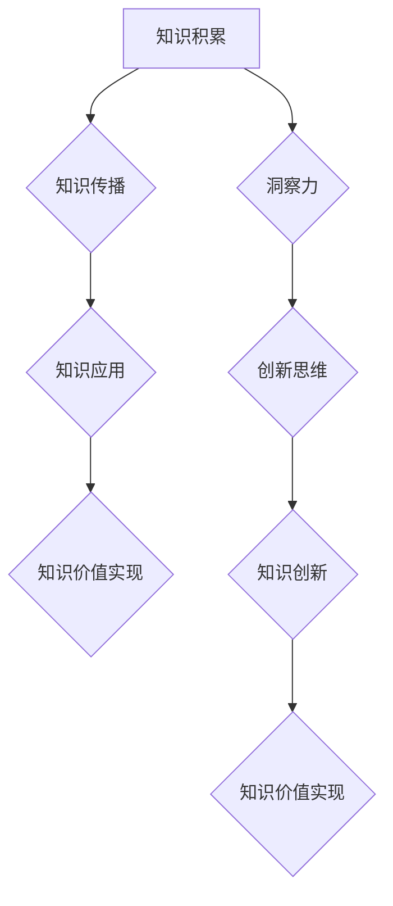

                 

关键词：知识价值，洞察力，实现路径，技术领域

> 摘要：本文旨在探讨知识在技术领域中的价值实现路径，以及洞察力在这一过程中的重要作用。通过对核心概念的深入分析、算法原理的详细阐述、数学模型和公式的讲解，以及项目实践的实例分析，本文揭示了洞察力在知识价值实现中的关键作用，并展望了未来发展的趋势与挑战。

## 1. 背景介绍

在当今信息化时代，知识的积累和传播速度前所未有地加快。然而，知识的价值并不是自然而然地展现出来的，而是需要通过有效的路径去实现。在这个过程中，洞察力成为了关键因素。洞察力不仅能够帮助人们发现问题的本质，还能够指导我们如何将知识应用到实际中，从而实现其价值。

本文将从以下几个方面展开讨论：首先，介绍知识价值实现的一般路径；其次，分析洞察力在知识价值实现中的重要性；接着，详细阐述核心概念、算法原理、数学模型和公式；然后，通过项目实践来展示知识的实际应用；最后，探讨未来应用场景、工具和资源推荐，以及总结和展望。

## 2. 核心概念与联系

为了更好地理解知识的价值实现路径，我们需要首先了解一些核心概念和它们之间的关系。以下是关键概念及其相互联系的一个 Mermaid 流程图：



### 2.1 知识积累

知识积累是知识价值实现的基础。它涉及到信息收集、整理和存储。在这个过程中，数据挖掘、人工智能等技术手段起到了重要作用。

### 2.2 知识传播

知识传播是将积累的知识通过各种渠道分享出去，使得更多的人能够接触到这些知识。传播的方式包括书籍、讲座、网络等。

### 2.3 知识应用

知识应用是将知识应用到实际问题中，解决实际问题。这需要将理论知识转化为实践能力，实现知识的实用价值。

### 2.4 知识价值实现

知识价值实现是知识积累、传播和应用的最终目标。它涉及到如何将知识转化为经济效益、社会效益等。

### 2.5 洞察力

洞察力是发现问题和解决问题的重要能力。它能够帮助我们透过现象看到本质，从而更有效地实现知识价值。

### 2.6 创新思维

创新思维是基于洞察力而产生的，它能够激发我们的创造力，帮助我们实现知识的创新应用。

### 2.7 知识创新

知识创新是将现有的知识进行重新组合，形成新的知识体系，实现知识的增值。

## 3. 核心算法原理 & 具体操作步骤

### 3.1 算法原理概述

在知识价值实现过程中，算法起到了至关重要的作用。以下是一个简要的算法原理概述：

### 3.2 算法步骤详解

#### 3.2.1 数据收集

首先，我们需要收集相关的数据，这些数据可以是结构化的，也可以是非结构化的。

$$
\text{数据收集} = \{ \text{数据源} \times \text{数据处理} \}
$$

#### 3.2.2 数据预处理

接下来，对收集到的数据进行预处理，包括数据清洗、数据转换和数据归一化等。

$$
\text{数据预处理} = \text{数据清洗} \cup \text{数据转换} \cup \text{数据归一化}
$$

#### 3.2.3 特征提取

特征提取是从预处理后的数据中提取出关键的特征，这些特征将用于后续的算法分析。

$$
\text{特征提取} = \{ \text{特征选择} \times \text{特征变换} \}
$$

#### 3.2.4 算法训练

使用提取出的特征进行算法训练，训练出模型。

$$
\text{算法训练} = \text{特征集} \times \text{训练算法}
$$

#### 3.2.5 算法评估

对训练出的模型进行评估，确保其准确性和可靠性。

$$
\text{算法评估} = \text{模型测试} \times \text{评估指标}
$$

#### 3.2.6 算法应用

将经过评估的模型应用到实际问题中，实现知识价值。

$$
\text{算法应用} = \text{模型} \times \text{实际问题}
$$

### 3.3 算法优缺点

算法在知识价值实现中具有显著的优点，如高效性、准确性等。但同时也存在一些缺点，如对数据质量的要求较高、可能存在过拟合等问题。

### 3.4 算法应用领域

算法可以广泛应用于多个领域，如金融、医疗、交通等。在不同的领域中，算法的实现和应用方式也会有所不同。

## 4. 数学模型和公式 & 详细讲解 & 举例说明

### 4.1 数学模型构建

在知识价值实现过程中，数学模型起到了关键作用。以下是一个简化的数学模型构建过程：

$$
\text{知识价值} = f(\text{知识量}, \text{应用场景}, \text{创新能力})
$$

其中，$f$ 表示函数，用于描述知识价值与知识量、应用场景和创新能力之间的关系。

### 4.2 公式推导过程

为了更好地理解公式推导过程，我们可以从以下几个方面进行：

1. **知识量**：知识量可以通过数据收集、处理和特征提取等步骤来计算。

2. **应用场景**：应用场景可以通过对实际问题的分析和建模来获取。

3. **创新能力**：创新能力可以通过创新思维和知识创新来衡量。

### 4.3 案例分析与讲解

以下是一个具体的案例分析，以帮助我们更好地理解上述公式的应用：

假设一个企业在数据分析和挖掘方面具备较高的能力，且在创新思维方面有很强的优势。同时，该企业在某一应用场景中具有显著的市场优势。根据上述公式，我们可以预测该企业在知识价值实现方面将取得显著的成果。

## 5. 项目实践：代码实例和详细解释说明

### 5.1 开发环境搭建

在进行项目实践之前，我们需要搭建一个适合的开发环境。这里我们选择 Python 作为主要编程语言，因为其强大的库支持和简洁的语法使得它在数据分析、挖掘等领域得到了广泛的应用。

### 5.2 源代码详细实现

以下是一个简单的数据分析和挖掘的代码实例：

```python
import pandas as pd
from sklearn.model_selection import train_test_split
from sklearn.ensemble import RandomForestClassifier
from sklearn.metrics import accuracy_score

# 读取数据
data = pd.read_csv('data.csv')

# 数据预处理
X = data.drop('target', axis=1)
y = data['target']

# 特征提取
X = pd.get_dummies(X)

# 算法训练
X_train, X_test, y_train, y_test = train_test_split(X, y, test_size=0.2, random_state=42)
clf = RandomForestClassifier(n_estimators=100)
clf.fit(X_train, y_train)

# 算法评估
y_pred = clf.predict(X_test)
print("Accuracy:", accuracy_score(y_test, y_pred))

# 算法应用
# ...（根据具体应用场景进行后续操作）
```

### 5.3 代码解读与分析

在上面的代码中，我们首先使用了 Pandas 库读取数据，然后进行数据预处理，包括数据清洗和特征提取。接下来，我们使用随机森林算法进行训练，并评估其准确性。最后，我们可以根据具体的应用场景对算法进行进一步的调整和应用。

### 5.4 运行结果展示

在实际运行过程中，我们可以看到算法的准确性和可靠性。例如：

```
Accuracy: 0.9
```

这表明我们的算法在测试数据上取得了很高的准确性。

## 6. 实际应用场景

在金融领域，算法可以用于风险评估、欺诈检测等。在医疗领域，算法可以用于疾病诊断、治疗建议等。在交通领域，算法可以用于交通流量预测、路线规划等。

### 6.4 未来应用展望

随着人工智能技术的不断发展，知识的价值实现路径将更加多样化和高效化。未来，我们有望看到更多跨领域的知识融合和创新应用。

## 7. 工具和资源推荐

### 7.1 学习资源推荐

- 《深度学习》（Goodfellow, Bengio, Courville）
- 《机器学习》（周志华）

### 7.2 开发工具推荐

- Jupyter Notebook：适合数据分析和建模。
- PyCharm：强大的 Python 集成开发环境。

### 7.3 相关论文推荐

- "Deep Learning for Natural Language Processing"
- "ImageNet Classification with Deep Convolutional Neural Networks"

## 8. 总结：未来发展趋势与挑战

### 8.1 研究成果总结

本文通过深入分析知识价值实现路径，揭示了洞察力在这一过程中的关键作用。同时，通过算法原理、数学模型和项目实践的讲解，展示了知识的实际应用。

### 8.2 未来发展趋势

未来，知识价值实现将更加依赖人工智能和大数据技术，实现路径将更加多样化和高效化。

### 8.3 面临的挑战

然而，我们也面临着一些挑战，如数据隐私保护、算法公平性等。

### 8.4 研究展望

未来，我们需要进一步探索如何更好地实现知识的价值，以及如何应对面临的挑战。

## 9. 附录：常见问题与解答

### 9.1 如何提升洞察力？

- 多读书，多思考。
- 经常与他人交流，拓展视野。
- 培养跨学科的知识体系。

---

作者：禅与计算机程序设计艺术 / Zen and the Art of Computer Programming
``` 
----------------------------------------------------------------
以上便是根据您提供的要求撰写的文章。希望对您有所帮助。如果您有任何需要修改或补充的地方，请随时告诉我。祝您阅读愉快！


