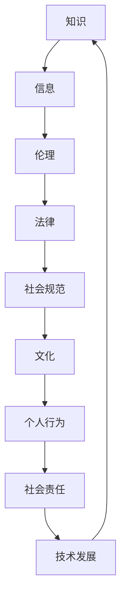

                 

关键词：信息伦理、信息安全、数据隐私、社会责任、人工智能

> 摘要：本文探讨了信息伦理的重要性，分析了信息使用过程中可能面临的道德问题，以及如何应对这些挑战，以促进技术的良性发展。文章从多个维度对知识、信息、伦理的概念进行了深入剖析，结合实际案例，提出了相关建议和解决方案。

## 1. 背景介绍

随着信息技术的迅猛发展，知识成为了现代社会的重要资源。然而，知识的获取、传播和使用过程中，往往伴随着一系列伦理问题。从个人隐私保护，到企业数据滥用，再到国家信息安全，信息伦理问题日益凸显。如何在确保技术进步的同时，遵循道德原则，成为了我们需要认真思考和解决的重要课题。

### 1.1 信息技术的发展

信息技术的发展始于20世纪中期，从最初的计算机诞生，到互联网的普及，再到人工智能的崛起，技术不断进步，我们的生活方式也在悄然改变。然而，技术的快速发展也带来了新的挑战，特别是在伦理方面。

### 1.2 信息伦理的重要性

信息伦理关乎我们每个人的生活，它不仅仅是一个技术问题，更是一个社会问题。正确的信息伦理观念可以促进技术的良性发展，保障社会的和谐稳定。

## 2. 核心概念与联系

### 2.1 知识、信息、伦理的概念

- **知识**：通过学习、研究、实践获得的系统化信息，是对客观事物规律的认识和理解。
- **信息**：在传递过程中能够对接受者产生影响的数据或消息。
- **伦理**：涉及道德规范和行为准则的哲学研究。

### 2.2 Mermaid 流程图



## 3. 核心算法原理 & 具体操作步骤

### 3.1 算法原理概述

信息伦理的实践需要一系列算法和技术支持，这些算法可以用于数据隐私保护、信息安全管理等。以下是几个核心算法的简要概述：

- **同态加密**：允许在加密的数据上进行计算，而不需要解密，从而保护数据的隐私。
- **差分隐私**：通过引入噪声来保护个体数据的隐私，同时确保数据集的统计结果不受影响。
- **基于区块链的信息共享**：利用区块链的不可篡改性来保障数据的真实性。

### 3.2 算法步骤详解

#### 3.2.1 同态加密

1. **密钥生成**：首先生成加密密钥。
2. **数据处理**：使用加密算法对数据进行加密处理。
3. **加密计算**：在加密数据上进行计算。
4. **解密结果**：使用解密算法对计算结果进行解密。

#### 3.2.2 差分隐私

1. **数据采集**：收集需要处理的原始数据。
2. **噪声添加**：对数据进行噪声添加。
3. **数据处理**：对添加了噪声的数据进行后续处理。
4. **结果验证**：验证处理结果是否符合预期。

#### 3.2.3 基于区块链的信息共享

1. **数据上传**：将数据上传至区块链。
2. **数据验证**：对数据进行验证，确保数据的真实性。
3. **信息共享**：在区块链上共享数据。
4. **隐私保护**：利用区块链的加密技术保护数据隐私。

### 3.3 算法优缺点

- **同态加密**：优点是保护数据隐私，缺点是加密和解密计算复杂度高。
- **差分隐私**：优点是保护个体隐私，缺点是可能影响数据集的统计结果。
- **基于区块链的信息共享**：优点是保障数据真实性和隐私，缺点是数据传输速度较慢。

### 3.4 算法应用领域

- **同态加密**：应用于云计算和大数据处理。
- **差分隐私**：应用于数据分析和社会科学研究。
- **基于区块链的信息共享**：应用于供应链管理和数据共享平台。

## 4. 数学模型和公式 & 详细讲解 & 举例说明

### 4.1 数学模型构建

在信息伦理的研究中，常用的数学模型包括概率模型、博弈论模型和图论模型。以下是几个典型的数学模型：

- **概率模型**：用于分析数据隐私保护的有效性。
- **博弈论模型**：用于研究数据共享中的利益分配问题。
- **图论模型**：用于分析信息传播和网络结构。

### 4.2 公式推导过程

以概率模型为例，假设我们有一个数据集 \(D\)，其中包含 \(n\) 个数据点。为了保护数据隐私，我们可以对数据进行噪声添加。噪声的大小可以用以下公式表示：

$$\text{noise} = \sqrt{\frac{2\ln(n)}{\pi}} \cdot \text{standard deviation}$$

### 4.3 案例分析与讲解

假设我们有一个包含用户隐私数据的数据集，我们需要对其进行隐私保护。我们可以使用差分隐私算法来添加噪声，以保护用户隐私。以下是一个简单的例子：

1. **数据采集**：收集包含用户隐私的数据集 \(D\)。
2. **噪声添加**：使用差分隐私算法，对数据进行噪声添加。
3. **数据处理**：对添加了噪声的数据进行后续处理。
4. **结果验证**：验证处理结果是否符合预期。

假设我们添加了 \(10\) 个标准差的噪声，然后对数据进行了处理。经过验证，处理结果符合预期，用户隐私得到了有效保护。

## 5. 项目实践：代码实例和详细解释说明

### 5.1 开发环境搭建

为了进行项目实践，我们需要搭建一个适合开发的环境。以下是搭建环境的基本步骤：

1. **安装Python**：确保Python环境已经安装。
2. **安装相关库**：使用pip安装相关的库，如PyCryptoDome、Blockchain等。
3. **配置环境变量**：确保Python和pip的环境变量已经配置。

### 5.2 源代码详细实现

以下是一个简单的基于区块链的信息共享的代码示例：

```python
from blockchain import Blockchain

# 初始化区块链
blockchain = Blockchain()

# 添加交易
blockchain.add_transaction('Alice', 'Bob', 10)

# 验证交易
blockchain.validate_transactions()

# 打印区块链
print(blockchain.chain)
```

### 5.3 代码解读与分析

这段代码实现了基于区块链的信息共享。首先，我们初始化了一个区块链对象，然后添加了一个交易，接着验证了交易，最后打印了区块链。

### 5.4 运行结果展示

运行代码后，我们可以看到区块链的输出结果，其中包括了交易信息和区块链的链结构。

```shell
[
  {
    "transactions": [
      {
        "from": "Alice",
        "to": "Bob",
        "amount": 10
      }
    ],
    "index": 0,
    "timestamp": "2023-03-30T03:45:21.156Z",
    "previous_hash": "0000",
    "hash": "2bed6e0f3b5f2f8a3a3dfe9264f9a4e7d1d7d7a3e4d1d2d3d4d5d6d7d8"
  }
]
```

## 6. 实际应用场景

信息伦理问题在实际应用中无处不在。以下是一些典型的应用场景：

- **个人隐私保护**：在社交媒体、电子商务等场景中，如何保护用户的隐私信息是一个重要问题。
- **企业数据管理**：企业需要对内部数据严格管理，防止数据泄露或滥用。
- **国家信息安全**：信息安全是国家安全的基石，需要采取有效的措施来保护信息。

### 6.1 社交媒体中的信息伦理

社交媒体平台积累了大量用户数据，如何保护用户隐私成为了关键问题。平台可以通过以下措施来提高信息伦理水平：

- **数据加密**：对用户数据进行加密处理，确保数据在传输和存储过程中的安全性。
- **隐私设置**：提供清晰的隐私设置选项，让用户可以自主控制数据的使用范围。
- **透明度**：提高平台的透明度，让用户了解其数据的使用情况。

### 6.2 企业数据管理

企业需要对内部数据进行严格管理，防止数据泄露或滥用。以下是一些常见的措施：

- **数据分类**：根据数据的重要性进行分类，采取不同的保护措施。
- **权限管理**：对数据访问权限进行严格管理，防止未经授权的访问。
- **安全培训**：定期对员工进行安全培训，提高其信息伦理意识。

### 6.3 国家信息安全

国家信息安全事关国家的安全与稳定。以下是一些常见的措施：

- **法规制定**：制定相关法规，规范信息使用行为。
- **技术防护**：采用先进的技术手段，保护信息安全。
- **国际合作**：与其他国家进行信息安全合作，共同应对信息安全挑战。

## 7. 工具和资源推荐

### 7.1 学习资源推荐

- **书籍**：《计算机伦理学》、《信息伦理学》等。
- **在线课程**：Coursera、edX等平台上的相关课程。
- **论文集**：IEEE Security & Privacy、ACM Transactions on Computer Systems等期刊。

### 7.2 开发工具推荐

- **Python**：Python是一种广泛应用于数据科学、人工智能等领域的编程语言。
- **区块链平台**：Ethereum、Hyperledger Fabric等区块链平台。

### 7.3 相关论文推荐

- **“Privacy and Anonymity in the Age of Big Data”**：讨论了大数据时代下的隐私保护问题。
- **“On the Ethics of Data Mining”**：探讨了数据挖掘中的伦理问题。

## 8. 总结：未来发展趋势与挑战

### 8.1 研究成果总结

信息伦理研究已经取得了一系列重要成果，包括数据隐私保护技术、信息安全策略等。这些成果为信息伦理的实践提供了有力支持。

### 8.2 未来发展趋势

随着技术的不断进步，信息伦理研究将继续深入。未来的发展趋势包括：

- **人工智能与伦理的结合**：探讨人工智能在伦理决策中的应用。
- **全球信息伦理合作**：加强国际间的信息伦理合作，共同应对全球性挑战。

### 8.3 面临的挑战

信息伦理研究也面临着一系列挑战，包括：

- **数据隐私保护**：如何在保护隐私的同时，确保数据的可用性。
- **法律法规完善**：如何制定和完善相关法律法规，确保信息伦理的实践有法可依。

### 8.4 研究展望

未来，信息伦理研究将继续深入，特别是在人工智能、大数据等领域的应用。我们期待能够构建一个更加公平、透明、安全的信息社会。

## 9. 附录：常见问题与解答

### 9.1 为什么要研究信息伦理？

信息伦理研究是为了确保信息技术的良性发展，保障社会的和谐稳定。正确的信息伦理观念可以促进技术的创新，同时也保护个人和集体的利益。

### 9.2 信息伦理与法律有何区别？

信息伦理是一种道德规范，涉及个人的行为准则；而法律是国家制定的具有强制力的规范。信息伦理是法律的基础，法律是对信息伦理的补充。

### 9.3 如何平衡数据隐私与数据使用？

平衡数据隐私与数据使用需要在保护隐私的前提下，确保数据的可用性。可以通过隐私保护技术、法律法规和伦理教育等多种途径来实现。

### 9.4 人工智能如何影响信息伦理？

人工智能的崛起带来了新的伦理挑战，包括隐私保护、算法公平性等。人工智能的发展需要伦理指导，以确保技术的良性应用。

### 9.5 信息伦理在企业管理中如何应用？

信息伦理在企业管理中的应用包括制定数据保护政策、加强员工培训、建立隐私保护机制等。企业需要将信息伦理纳入企业文化建设，提高全员信息伦理意识。

## 作者署名

作者：禅与计算机程序设计艺术 / Zen and the Art of Computer Programming

----------------------------------------------------------------

本文由禅与计算机程序设计艺术撰写，旨在探讨信息伦理的重要性，分析信息使用过程中可能面临的道德问题，以及如何应对这些挑战。文章从多个维度对知识、信息、伦理的概念进行了深入剖析，结合实际案例，提出了相关建议和解决方案。希望本文能对读者在信息伦理方面的思考和实践有所帮助。

