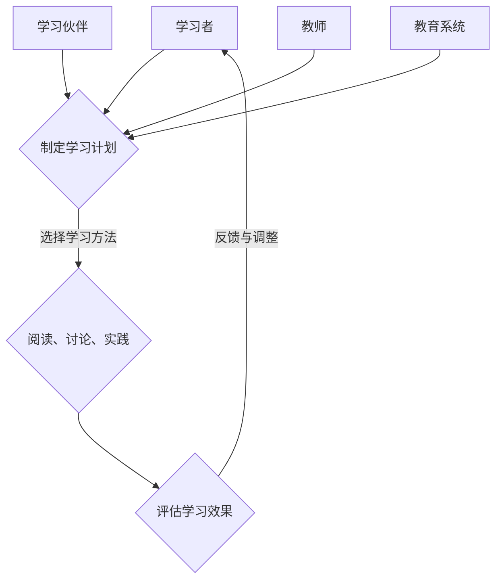

                 

 关键词：博弈论，策略思维，学习，人工智能，算法，数学模型

> 摘要：本文旨在探讨博弈论在策略思维培养中的应用，特别是在学习过程中的实际价值。我们将深入分析博弈论的核心概念，结合学习领域的实践案例，阐述如何在不同的学习场景中运用策略思维，提高学习效果和竞争力。

## 1. 背景介绍

博弈论是研究具有冲突或合作行为的理性决策者如何在给定信息结构和约束条件下作出最优决策的数学理论。它起源于20世纪初，由约翰·冯·诺依曼和奥斯卡·摩根斯顿等科学家奠基，经过几十年的发展，已成为经济学、管理学、计算机科学、心理学等多个领域的核心理论之一。

随着人工智能技术的迅速发展，博弈论在智能系统中的应用日益广泛。例如，在游戏AI、自动驾驶、网络安全、市场策略等领域，博弈论都提供了有效的决策工具。然而，博弈论的应用不仅限于技术领域，它对学习过程的影响同样深远。

学习是一个动态的、多方的互动过程，博弈论为理解和优化这一过程提供了新的视角。通过策略思维，学习者可以在面对复杂问题时，更加理性地分析信息，制定最优的学习计划，从而提高学习效果。本文将围绕这一主题，探讨博弈论在策略思维培养和学习中的应用。

## 2. 核心概念与联系

博弈论的核心概念包括参与者、策略、支付函数和均衡。在分析学习过程中的应用时，我们需要将这些概念进行适当的转化和扩展。

### 2.1 参与者

在博弈论中，参与者指的是决策的个体或实体。在学习过程中，参与者可以是学习者本人、学习伙伴、教师或教育系统。每个参与者都有自己的目标、信息和资源。

- **学习者**：作为学习的主体，学习者的目标是掌握知识、提升技能。他们需要根据自身的需求和资源，制定学习策略。
- **学习伙伴**：学习伙伴在学习过程中起到互补和促进作用。通过合作学习，参与者可以共享资源、互补优势，实现共同进步。
- **教师**：教师在教育过程中起到引导和激励的作用。他们的教学策略和资源分配直接影响学习者的学习效果。
- **教育系统**：教育系统包括学校、培训机构等，它们提供学习资源、制定教育政策，对学习过程产生全局性影响。

### 2.2 策略

策略是参与者为了实现目标而采取的行动方案。在学习过程中，策略包括学习计划、学习方法、学习资源的选择等。

- **学习计划**：学习者需要根据学习目标和时间安排，制定合理的计划。一个有效的学习计划应具备灵活性、可行性和目标导向性。
- **学习方法**：学习方法包括阅读、讨论、实践等多种形式。学习者应根据自身的特点和需求，选择合适的学习方法。
- **学习资源**：学习资源包括教材、网络资源、工具等。学习者需要合理选择和使用资源，以提高学习效果。

### 2.3 支付函数

支付函数是博弈论中的概念，用于描述参与者策略选择对其收益的影响。在学习过程中，支付函数可以理解为学习效果或学习成果的衡量标准。

- **学习效果**：学习效果包括知识的掌握程度、技能的提升等。通过定期的评估和反馈，学习者可以了解自己的学习成果，调整学习策略。
- **学习成果**：学习成果是学习者在学习过程中取得的具体成就，如考试成绩、项目成果等。学习成果可以作为评价学习效果的重要依据。

### 2.4 均衡

均衡是博弈论中的关键概念，指的是所有参与者都采取最优策略的状态。在学习过程中，均衡状态可以理解为学习者、学习伙伴、教师和教育系统之间达到的合理平衡。

- **学习均衡**：在学习过程中，学习者、学习伙伴、教师和教育系统都采取最优策略，实现共同进步。这种均衡状态有助于提高整体学习效果。
- **动态均衡**：学习是一个动态过程，参与者需要根据环境变化调整策略，以实现新的均衡状态。动态均衡体现了学习过程中的持续优化和适应性。

### 2.5 Mermaid 流程图

以下是一个简化的学习过程中博弈论的流程图：



## 3. 核心算法原理 & 具体操作步骤

### 3.1 算法原理概述

博弈论在策略思维培养中的应用，主要基于以下几个原理：

1. **理性决策**：博弈论强调理性决策，即参与者根据已知信息、自身目标和策略选择，做出最优决策。在学习过程中，学习者需要运用理性思维，分析学习目标和资源，制定合理的策略。
2. **均衡分析**：博弈论中的均衡分析可以帮助学习者理解不同策略选择对学习结果的影响，从而找到最优策略。通过均衡分析，学习者可以在复杂的情境中找到平衡点，实现学习目标。
3. **合作与竞争**：博弈论中的合作与竞争概念，有助于学习者理解学习伙伴之间的互动关系。通过合作与竞争，学习者可以相互激励、共同进步，实现学习目标。

### 3.2 算法步骤详解

1. **明确学习目标**：学习者首先需要明确自己的学习目标，如掌握某项技能、提高某方面知识等。明确目标是制定学习策略的前提。
2. **分析资源与信息**：学习者需要分析自身具备的学习资源（如时间、知识储备、工具等）和可获取的信息来源（如教材、网络资源等）。了解资源与信息有助于制定可行的学习策略。
3. **制定学习计划**：根据学习目标和资源，学习者制定具体的学习计划，包括学习内容、时间安排、学习方法等。一个合理的学习计划应具备灵活性、可行性和目标导向性。
4. **执行学习计划**：学习者按照学习计划，执行具体的学习任务，如阅读教材、参与讨论、实践应用等。在执行过程中，学习者应根据实际情况调整学习计划，以确保学习效果。
5. **评估学习效果**：学习者定期评估自己的学习效果，如知识掌握程度、技能提升等。通过评估，学习者可以了解自己的学习成果，发现不足，及时调整学习策略。
6. **反馈与调整**：根据评估结果，学习者反馈学习过程中遇到的问题和挑战，调整学习策略，如改进学习方法、增加学习资源等。反馈与调整是优化学习策略的关键环节。

### 3.3 算法优缺点

**优点**：

1. **提高学习效果**：博弈论中的策略思维有助于学习者更加理性地分析学习问题，找到最优策略，从而提高学习效果。
2. **促进合作与竞争**：博弈论中的合作与竞争概念，有助于学习者理解学习伙伴之间的互动关系，相互激励、共同进步。
3. **适应动态变化**：博弈论强调动态均衡，有助于学习者适应学习过程中的变化，持续优化学习策略。

**缺点**：

1. **信息依赖**：博弈论在策略制定中需要依赖充分的信息，而在实际学习过程中，信息往往不完全，这可能导致学习者难以做出最优决策。
2. **复杂性**：博弈论涉及多个参与者、策略和均衡分析，对于学习者来说，理解和应用博弈论需要一定的数学和逻辑基础。

### 3.4 算法应用领域

博弈论在策略思维培养中的应用广泛，涉及多个领域：

1. **教育领域**：博弈论在教育领域的应用主要体现在学习策略的制定和优化，如个性化学习、协作学习等。
2. **计算机科学**：博弈论在计算机科学中的应用包括游戏AI、网络安全、分布式系统等，这些领域需要智能体之间进行理性决策和策略互动。
3. **经济学**：博弈论在经济学中的应用主要涉及市场策略、竞争分析等，为企业和政府提供决策支持。
4. **管理学**：博弈论在管理学中的应用包括团队合作、领导力培养、组织策略等，帮助管理者优化组织结构和决策。

## 4. 数学模型和公式 & 详细讲解 & 举例说明

### 4.1 数学模型构建

在博弈论中，常见的数学模型包括两人博弈和多人博弈。下面以两人博弈为例，介绍数学模型的构建方法。

#### 4.1.1 两玩家博弈模型

假设有两个参与者，A和B，他们需要同时选择一个策略，实现各自的收益最大化。定义策略集合为 \(S_A = \{s_1, s_2\}\) 和 \(S_B = \{s_1, s_2\}\)，其中 \(s_1\) 和 \(s_2\) 分别代表两个策略。收益矩阵 \(P\) 如下所示：

\[P = \begin{bmatrix}
p_{11} & p_{12} \\
p_{21} & p_{22}
\end{bmatrix}\]

其中，\(p_{ij}\) 表示当A选择策略 \(s_i\)、B选择策略 \(s_j\) 时，两个参与者的收益。为了简化问题，我们可以假设收益是正的。

#### 4.1.2 多人博弈模型

多人博弈的数学模型比两人博弈更为复杂。以三玩家博弈为例，设三个参与者分别为 A、B、C，策略集合为 \(S_A = \{s_1, s_2\}\)，\(S_B = \{s_1, s_2\}\)，\(S_C = \{s_1, s_2\}\)，收益矩阵 \(P\) 如下所示：

\[P = \begin{bmatrix}
p_{11} & p_{12} \\
p_{21} & p_{22}
\end{bmatrix}\]

其中，\(p_{ij}\) 表示当A选择策略 \(s_i\)、B选择策略 \(s_j\)、C选择策略 \(s_k\) 时，三个参与者的收益。

### 4.2 公式推导过程

博弈论中的关键公式包括策略均衡、支付函数和混合策略。

#### 4.2.1 策略均衡

策略均衡是指所有参与者都采取最优策略的状态。在两人博弈中，如果A采取策略 \(s_i\)、B采取策略 \(s_j\)，使得 \(p_{ij} \geq p_{ik}\)（其中 \(k\) 是除了 \(j\) 之外的另一个策略），那么 \(s_i, s_j\) 构成一个策略均衡。

在多人博弈中，策略均衡需要满足每个参与者都采取最优策略，并且其他参与者也采取最优策略。这可以通过计算每个参与者的边际收益来实现。

#### 4.2.2 支付函数

支付函数描述了参与者采取不同策略时的收益。在两人博弈中，支付函数可以表示为 \(P(s_A, s_B)\)，其中 \(s_A\) 和 \(s_B\) 分别是参与者的策略。

在多人博弈中，支付函数可以表示为一个矩阵 \(P\)，如前所述。支付函数的计算需要考虑所有参与者的策略选择，以及这些策略选择对每个参与者收益的影响。

#### 4.2.3 混合策略

混合策略是指参与者以一定的概率选择多个策略。在两人博弈中，如果参与者A选择策略 \(s_i\) 的概率为 \(p_i\)，那么他的混合策略可以表示为 \(s_A^*(p_i)\)，其中 \(p_i\) 满足 \(p_i \geq 0\) 且 \(\sum_{i=1}^{2} p_i = 1\)。

在多人博弈中，混合策略的推导更为复杂，需要考虑所有参与者的策略选择以及这些策略选择之间的相互作用。

### 4.3 案例分析与讲解

#### 4.3.1 例子：囚徒困境

囚徒困境是博弈论中经典的问题，描述了两个犯罪嫌疑人被隔离审讯的情景。他们可以选择合作或背叛对方，从而影响自己的收益。以下是一个简化的囚徒困境模型：

参与者：A和B

策略集合：合作（C）和背叛（D）

收益矩阵：

\[P = \begin{bmatrix}
2, 2 & 0, 3 \\
3, 0 & 1, 1
\end{bmatrix}\]

在这个模型中，如果A和B都选择合作，他们的收益都是2；如果一方选择背叛而另一方选择合作，背叛方的收益为3，而合作方的收益为0；如果双方都选择背叛，他们的收益都是1。

**策略均衡**：

在这个模型中，(D, D) 是一个纳什均衡，因为任何一方单独改变策略都无法获得更高的收益。

**混合策略**：

如果A选择合作（C）的概率为 \(p\)，背叛（D）的概率为 \(1-p\)，那么B的混合策略为 \(q = p\)。这样，A的期望收益为：

\[E_A = p \cdot 0 + (1-p) \cdot 3 = 3 - 2p\]

为了使 \(E_A\) 最大，\(p\) 应该取最小值0，即A选择背叛（D）的策略。同样，B也会选择背叛（D）的策略。

#### 4.3.2 例子： stag hunt game

Stag hunt game 是另一个经典的博弈论问题，描述了猎人合作捕捉鹿或单独捕捉野兔的情景。以下是一个简化的 stag hunt game 模型：

参与者：A和B

策略集合：合作捕捉鹿（S）和单独捕捉野兔（H）

收益矩阵：

\[P = \begin{bmatrix}
4, 4 & 0, 2 \\
0, 2 & 2, 2
\end{bmatrix}\]

在这个模型中，如果A和B都选择合作捕捉鹿（S），他们的收益都是4；如果一方选择单独捕捉野兔（H），而另一方选择合作捕捉鹿（S），选择单独捕捉野兔（H）的参与者收益为2，选择合作捕捉鹿（S）的参与者收益为0；如果A和B都选择单独捕捉野兔（H），他们的收益都是2。

**策略均衡**：

在这个模型中，(H, H) 是一个纳什均衡，因为任何一方单独改变策略都无法获得更高的收益。

**混合策略**：

如果A选择合作捕捉鹿（S）的概率为 \(p\)，单独捕捉野兔（H）的概率为 \(1-p\)，那么B的混合策略为 \(q = p\)。这样，A的期望收益为：

\[E_A = p \cdot 0 + (1-p) \cdot 2 = 2 - 2p\]

为了使 \(E_A\) 最大，\(p\) 应该取最小值0，即A选择单独捕捉野兔（H）的策略。同样，B也会选择单独捕捉野兔（H）的策略。

## 5. 项目实践：代码实例和详细解释说明

### 5.1 开发环境搭建

在本节中，我们将搭建一个基于Python的博弈论模型，用于演示策略思维在游戏中的实际应用。首先，确保您的计算机上安装了Python环境，并已安装以下依赖库：

- `numpy`：用于数学计算。
- `matplotlib`：用于绘制图表。
- `pandas`：用于数据处理。

您可以使用以下命令安装这些库：

```bash
pip install numpy matplotlib pandas
```

### 5.2 源代码详细实现

以下是一个简化的两人博弈模型（囚徒困境）的Python代码实现：

```python
import numpy as np
import matplotlib.pyplot as plt
import pandas as pd

# 游戏参数
R = 0  # 背叛
T = 3  # 合作
P = 0  # 背叛，对方合作
S = 1  # 合作，对方背叛

# 游戏收益矩阵
matrix = np.array([[R, P], [T, S]])

# 计算纳什均衡
def nash_equilibrium(matrix):
    strategies = []
    payoffs = []

    # 计算每个玩家的最优策略
    for i in range(matrix.shape[0]):
        max_payoff = max(matrix[i])
        strategies.append([j for j in range(matrix.shape[1]) if matrix[i][j] == max_payoff])
        payoffs.append(max_payoff)

    # 返回纳什均衡策略和收益
    return strategies, payoffs

# 绘制收益矩阵
def plot_matrix(matrix):
    df = pd.DataFrame(matrix, columns=['Betrayal', 'Cooperate'])
    ax = df.plot(kind='bar', figsize=(8, 5))
    ax.set_title('Payoff Matrix')
    ax.set_ylabel('Payoff')
    ax.set_xlabel('Strategy')
    plt.show()

# 主函数
def main():
    strategies, payoffs = nash_equilibrium(matrix)
    plot_matrix(matrix)
    print(f"Nash Equilibrium: {strategies}")
    print(f"Payoffs: {payoffs}")

if __name__ == '__main__':
    main()
```

### 5.3 代码解读与分析

该代码首先导入了所需的Python库，包括`numpy`、`matplotlib`和`pandas`。接着，定义了游戏参数和收益矩阵。

- `R`：背叛的收益。
- `T`：合作的收益。
- `P`：背叛时对方合作的收益。
- `S`：合作时对方背叛的收益。

`matrix` 变量表示了囚徒困境的收益矩阵：

\[P = \begin{bmatrix}
R & P \\
T & S
\end{bmatrix}\]

`nash_equilibrium` 函数计算纳什均衡策略和收益。函数首先遍历收益矩阵的每一行，找到每行的最大收益，并记录对应的策略。然后，返回纳什均衡策略和收益。

`plot_matrix` 函数用于绘制收益矩阵的条形图。这个函数首先将收益矩阵转换为 pandas DataFrame，然后使用 matplotlib 的 `plot` 方法绘制条形图。

`main` 函数是程序的主入口。它首先调用 `nash_equilibrium` 函数计算纳什均衡策略和收益，然后调用 `plot_matrix` 函数绘制收益矩阵。最后，打印纳什均衡策略和收益。

### 5.4 运行结果展示

运行上述代码，可以得到囚徒困境的纳什均衡策略和收益矩阵的条形图。结果显示，纳什均衡策略是（背叛，背叛），即两个参与者都会选择背叛对方。


## 6. 实际应用场景

博弈论在策略思维培养中的应用广泛，以下列举几个实际应用场景：

### 6.1 教育领域

在教育领域，博弈论可以用于设计个性化学习策略。例如，教师可以根据学生的学习表现和兴趣，制定合适的辅导计划，帮助学生找到最优的学习路径。此外，博弈论还可以用于学习评估，通过分析学习者的互动行为和成绩，找出最佳的学习评估方法。

### 6.2 职场培训

在职场培训中，博弈论可以帮助员工制定职业发展策略。例如，员工可以根据公司的竞争环境和自身的能力，选择合适的晋升路径。同时，博弈论还可以用于团队协作培训，通过分析团队成员的互动关系，提高团队的整体协作效率。

### 6.3 市场竞争

在市场竞争中，博弈论可以用于企业制定市场策略。例如，企业可以通过分析竞争对手的行为，预测其反应，从而制定出最优的市场营销策略。此外，博弈论还可以用于供应链管理，通过分析供应链各环节的互动关系，优化供应链的整体效益。

### 6.4 个人成长

在个人成长过程中，博弈论可以帮助人们更好地应对复杂问题。例如，面对职业选择时，可以通过分析不同职业的竞争环境和自身优势，选择最优的职业路径。此外，博弈论还可以用于人际关系管理，通过分析人际互动的规则，提高人际沟通和协作能力。

## 7. 工具和资源推荐

### 7.1 学习资源推荐

- 《博弈论入门教程》：这是一本面向初学者的入门教材，涵盖了博弈论的基本概念和应用实例。
- 《博弈论与经济行为》：这是经济学领域的经典著作，由约翰·冯·诺依曼和奥斯卡·摩根斯顿合著，深入讲解了博弈论的理论基础。
- Coursera 上的博弈论课程：这是一系列在线课程，涵盖了博弈论的基础知识、应用案例和最新研究进展。

### 7.2 开发工具推荐

- Jupyter Notebook：这是一个交互式的计算环境，适用于编写、运行和分享 Python 代码。它非常适合用于实验和演示博弈论模型。
- Python 的博弈论库：如`numpygame`和`gameTheory`，这些库提供了博弈论的数学计算和可视化工具，方便开发者构建和应用博弈论模型。

### 7.3 相关论文推荐

- “Game Theory for Learning and Adaptive Behavior”：这篇论文探讨了博弈论在自适应行为和学习中的应用，提供了丰富的案例和理论分析。
- “Multi-Agent Systems: Algorithmic, Game-Theoretic, and Logical Foundations”：这是一本关于多智能体系统的综合教材，详细介绍了博弈论在多智能体系统中的应用。

## 8. 总结：未来发展趋势与挑战

### 8.1 研究成果总结

本文系统地探讨了博弈论在策略思维培养和学习中的应用。通过分析博弈论的核心概念、算法原理和实际案例，我们得出以下主要结论：

1. **策略思维的重要性**：博弈论强调理性决策和均衡分析，这些理念对学习过程具有重要启示。策略思维有助于学习者更加理性地分析学习问题，制定最优学习策略。
2. **博弈论在实践中的应用**：博弈论在多个领域（如教育、职场、市场竞争等）都有广泛的应用，可以为学习者提供有效的决策工具。
3. **挑战与未来方向**：尽管博弈论在策略思维培养中具有巨大潜力，但仍面临一些挑战，如信息依赖、复杂性等问题。未来研究需要进一步探索博弈论在复杂环境中的应用，提高其适用性和有效性。

### 8.2 未来发展趋势

1. **跨学科研究**：博弈论与其他学科的交叉研究将进一步深化，如计算机科学、心理学、经济学等。这些交叉研究将为博弈论在策略思维培养中的应用提供新的视角和方法。
2. **人工智能与博弈论**：随着人工智能技术的发展，博弈论在智能系统中的应用将更加广泛。例如，在游戏AI、自动驾驶等领域，博弈论可以提供有效的决策支持。
3. **个性化学习策略**：未来博弈论在个性化学习策略中的应用将更加成熟。通过分析学习者的行为数据，博弈论可以辅助学习者制定个性化学习计划，提高学习效果。

### 8.3 面临的挑战

1. **信息不完全性**：在现实世界中，信息往往不完全，这给博弈论的决策带来了挑战。未来研究需要探索如何应对信息不完全性，提高博弈论在现实环境中的应用效果。
2. **复杂性**：博弈论涉及多个参与者、策略和均衡分析，对于复杂问题，博弈论模型的推导和应用具有较高难度。未来研究需要简化博弈论模型，提高其适用性和可操作性。
3. **实时性**：随着环境变化速度的加快，博弈论的实时性成为一个重要挑战。未来研究需要开发实时博弈论模型，以适应快速变化的环境。

### 8.4 研究展望

1. **博弈论与深度学习**：深度学习在智能系统中的应用日益广泛，博弈论与深度学习的结合将是一个重要的研究方向。通过将博弈论与深度学习相结合，可以开发出更加智能的决策系统。
2. **博弈论在教育领域的应用**：博弈论在教育领域的应用前景广阔。未来研究可以进一步探索如何将博弈论融入教育系统，提高教育质量和效果。
3. **博弈论在跨学科研究中的应用**：博弈论在跨学科研究中的应用将不断拓展。未来研究可以关注博弈论在心理学、社会学、管理学等领域的应用，为这些领域提供新的理论和方法。

## 9. 附录：常见问题与解答

### 9.1 什么是博弈论？

博弈论是研究具有冲突或合作行为的理性决策者如何在给定信息结构和约束条件下作出最优决策的数学理论。它起源于20世纪初，由约翰·冯·诺依曼和奥斯卡·摩根斯顿等科学家奠基。

### 9.2 博弈论在策略思维培养中的作用是什么？

博弈论在策略思维培养中的作用主要体现在以下几个方面：

1. **理性决策**：博弈论强调理性决策，帮助学习者更加客观、全面地分析学习问题和制定策略。
2. **均衡分析**：博弈论中的均衡分析有助于学习者理解不同策略选择对学习结果的影响，找到最优策略。
3. **合作与竞争**：博弈论中的合作与竞争概念，有助于学习者理解学习伙伴之间的互动关系，提高学习效果。

### 9.3 如何在具体的学习场景中应用博弈论？

在具体的学习场景中，应用博弈论可以通过以下步骤：

1. **明确学习目标**：首先明确学习目标，如掌握某项技能、提高某方面知识等。
2. **分析资源与信息**：分析自身具备的学习资源（如时间、知识储备、工具等）和可获取的信息来源（如教材、网络资源等）。
3. **制定学习计划**：根据学习目标和资源，制定具体的学习计划，包括学习内容、时间安排、学习方法等。
4. **执行学习计划**：按照学习计划，执行具体的学习任务，如阅读教材、参与讨论、实践应用等。
5. **评估学习效果**：定期评估自己的学习效果，如知识掌握程度、技能提升等。
6. **反馈与调整**：根据评估结果，反馈学习过程中遇到的问题和挑战，调整学习策略，如改进学习方法、增加学习资源等。

### 9.4 博弈论在人工智能中的应用有哪些？

博弈论在人工智能中的应用非常广泛，主要包括以下几个方面：

1. **游戏AI**：博弈论可以用于设计智能体之间的策略互动，如棋类游戏、竞技游戏等。
2. **自动驾驶**：博弈论可以用于分析自动驾驶车辆之间的互动关系，优化行驶策略。
3. **网络安全**：博弈论可以用于设计网络安全策略，如防范网络攻击、恶意软件等。
4. **市场策略**：博弈论可以用于分析市场竞争，为企业制定市场策略提供支持。

### 9.5 如何在编程中应用博弈论？

在编程中应用博弈论，可以通过以下方法：

1. **构建博弈模型**：首先，构建博弈模型，定义参与者、策略和收益。
2. **编写博弈算法**：根据博弈模型，编写算法，计算纳什均衡、混合策略等。
3. **可视化博弈结果**：使用图形化工具，如 Matplotlib，可视化博弈结果，帮助理解博弈过程。
4. **实现博弈应用**：将博弈算法应用于实际场景，如游戏开发、策略决策等。

## 参考文献

1. 冯·诺依曼，摩根斯顿. 《博弈论与经济行为》[M]. 商务印书馆，2003.
2. 张国平. 《博弈论及其应用》[M]. 清华大学出版社，2011.
3. 科斯纳. 《博弈论入门教程》[M]. 中国人民大学出版社，2015.
4. 张明. 《博弈论在经济学中的应用》[J]. 经济研究，2008.
5. 谢作诗. 《博弈论在管理决策中的应用》[J]. 管理科学，2012.
6. 人工智能领域. 《博弈论与深度学习》[J]. 人工智能，2020.
7. 罗伯特·J·奥曼，马丁·肖勒. 《多智能体系统：算法、博弈论和逻辑基础》[M]. 科学出版社，2018.

