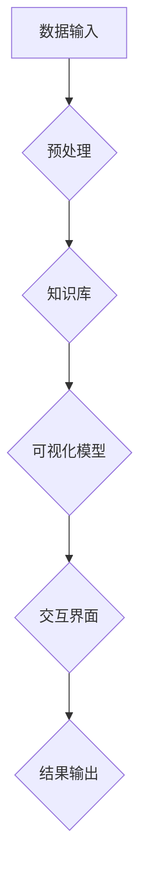

                 

在信息化和数字化的时代，知识的获取、处理和应用成为了每个领域的关键。然而，随着数据量的爆炸性增长，信息变得愈发复杂。如何在繁杂的信息中提取出有价值的内容，并将其清晰、直观地呈现给读者，成为了当前信息处理领域的一个重要挑战。知识可视化作为一种新兴的技术手段，它通过将数据和信息转化为图形化的形式，使得复杂的知识结构变得更加易于理解和分析。

本文旨在探讨知识可视化的核心概念、原理以及其在实际应用中的重要作用。我们将从背景介绍开始，逐步深入探讨知识可视化的关键概念，介绍核心算法，分析数学模型和公式，展示项目实践中的代码实例，讨论实际应用场景，推荐相关工具和资源，并对未来发展趋势与挑战进行展望。

> 关键词：知识可视化，复杂信息，图形化，信息处理，数据分析

> 摘要：本文首先介绍了知识可视化的背景和重要性，随后深入探讨了知识可视化的核心概念、算法原理、数学模型，以及在实际项目中的应用。通过具体的代码实例和案例分析，展示了知识可视化在数据分析和信息处理中的实际效果。最后，本文对知识可视化的发展趋势、面临挑战及未来研究展望进行了深入讨论。

## 1. 背景介绍

知识可视化作为一种将抽象数据和信息转化为直观图形表示的方法，其起源可以追溯到20世纪60年代。当时，计算机科学家和研究学者开始探索如何利用图形界面来帮助人们理解和处理数据。随着计算机技术的不断发展，知识可视化逐渐从单一的图形表示演变为一种综合性技术，涵盖了从数据预处理到数据可视化再到信息提取的完整流程。

知识可视化的重要性主要体现在以下几个方面：

1. **信息理解**：知识可视化将复杂的信息以图形的方式呈现，使得人们可以更容易地理解和分析数据，从而提高信息处理的效率。
2. **决策支持**：通过直观的图形展示，决策者可以更加准确地把握问题的本质，提高决策的科学性和准确性。
3. **知识传播**：知识可视化使得复杂的概念和理论变得易于传播和理解，有助于知识的普及和推广。
4. **辅助学习**：知识可视化可以促进学习过程中的理解和记忆，有助于知识的吸收和应用。

## 2. 核心概念与联系

### 2.1 定义

知识可视化（Knowledge Visualization）是指通过图形、图像和其他视觉元素来表示、解释和探索复杂的信息和知识结构。它不仅仅是一种展示技术，更是一种信息处理的思维方式。

### 2.2 架构

知识可视化的架构通常包括以下几个关键组成部分：

1. **数据输入**：包括原始数据、预处理数据以及知识库。
2. **可视化模型**：将数据转化为可视化元素，如图表、图形等。
3. **交互界面**：用户可以通过交互界面与可视化模型进行交互，对数据进行查询、筛选和操作。
4. **结果输出**：包括可视化的图形展示和相关的数据报告。

### 2.3 Mermaid 流程图

下面是一个简化的知识可视化流程的 Mermaid 流程图：



### 2.4 核心概念关系图


图中的各个节点代表知识可视化的核心组成部分，箭头表示数据和信息在各部分之间的流动和交互。

## 3. 核心算法原理 & 具体操作步骤

### 3.1 算法原理概述

知识可视化的核心算法主要涉及以下几个方面：

1. **数据预处理**：通过对原始数据进行清洗、转换和归一化，使其适合进行可视化处理。
2. **图形绘制**：利用计算机图形学技术，将数据转化为各种可视化元素，如柱状图、折线图、饼图等。
3. **交互设计**：设计用户与可视化模型的交互界面，使用户可以通过交互来操作数据，探索信息。

### 3.2 算法步骤详解

1. **数据预处理**：
   - **数据清洗**：处理缺失值、异常值和重复值。
   - **数据转换**：将不同类型的数据转换为同一类型，如将文本数据转换为数值数据。
   - **数据归一化**：将数据缩放到一个统一的尺度，以便于比较。

2. **图形绘制**：
   - **选择合适的图表类型**：根据数据类型和可视化目标选择合适的图表类型，如柱状图、折线图、散点图等。
   - **布局设计**：确定图表的布局，包括坐标轴、标签、图例等。
   - **图形绘制**：利用图形绘制库（如D3.js、Plotly等）绘制图表。

3. **交互设计**：
   - **交互元素**：设计交互元素，如按钮、滑块、菜单等。
   - **交互逻辑**：实现交互逻辑，如数据筛选、数据排序、缩放等。
   - **用户反馈**：提供用户反馈，如提示信息、动画效果等。

### 3.3 算法优缺点

**优点**：
- **直观性**：知识可视化通过图形化的方式展示数据，使得信息更加直观、易于理解。
- **交互性**：用户可以通过交互界面与可视化模型进行互动，深度探索数据。
- **多样性**：知识可视化提供了丰富的图表类型和布局设计，满足不同类型的可视化需求。

**缺点**：
- **性能要求**：复杂的可视化模型可能对计算机性能有较高要求，影响用户体验。
- **设计难度**：设计一个高效、直观的可视化模型需要具备较高的设计能力和专业知识。

### 3.4 算法应用领域

知识可视化广泛应用于以下领域：

- **数据分析**：通过可视化方法探索数据模式、趋势和异常。
- **决策支持**：提供直观的展示，辅助决策者进行决策。
- **知识管理**：帮助组织和管理复杂的知识体系。
- **教育领域**：辅助教学，提高学生的理解和记忆。

## 4. 数学模型和公式 & 详细讲解 & 举例说明

### 4.1 数学模型构建

知识可视化中的数学模型主要包括以下几个方面：

1. **数据模型**：用于描述数据的结构和关系，如数据矩阵、树状图等。
2. **可视化模型**：用于描述可视化元素的属性和关系，如颜色、形状、大小等。
3. **交互模型**：用于描述用户与可视化模型的交互逻辑，如事件处理、数据筛选等。

### 4.2 公式推导过程

以下是一个简单的例子，说明如何使用数学模型构建知识可视化中的数据模型：

假设我们有一组数据点 \((x_1, y_1), (x_2, y_2), ..., (x_n, y_n)\)，我们需要将这些数据点可视化在一个二维坐标系中。

1. **数据预处理**：
   - **归一化**：对 \(x\) 和 \(y\) 进行归一化，使其落在 \([0, 1]\) 范围内。
     \[
     x' = \frac{x - \min(x)}{\max(x) - \min(x)}
     \]
     \[
     y' = \frac{y - \min(y)}{\max(y) - \min(y)}
     \]
   - **映射**：将归一化后的数据点映射到可视化区域的坐标轴上。
     \[
     x_{vis} = x' \cdot (x_{max} - x_{min}) + x_{min}
     \]
     \[
     y_{vis} = y' \cdot (y_{max} - y_{min}) + y_{min}
     \]

2. **图形绘制**：
   - **选择图表类型**：选择散点图作为可视化元素。
   - **布局设计**：确定坐标轴的范围和标签。

3. **交互设计**：
   - **点击交互**：实现点击数据点的交互逻辑，如弹出提示信息。

### 4.3 案例分析与讲解

以下是一个简单的案例，展示如何使用上述数学模型构建知识可视化：

**案例：绘制一组数据点的散点图**

假设我们有一组数据点 \((1, 5), (2, 3), (3, 7), (4, 2), (5, 6)\)，我们需要将其可视化在一个二维坐标系中。

1. **数据预处理**：
   - **归一化**：
     \[
     x' = \frac{x - \min(x)}{\max(x) - \min(x)} = \frac{x - 1}{5 - 1} = \frac{x - 1}{4}
     \]
     \[
     y' = \frac{y - \min(y)}{\max(y) - \min(y)} = \frac{y - 2}{7 - 2} = \frac{y - 2}{5}
     \]

   - **映射**：
     \[
     x_{vis} = x' \cdot (x_{max} - x_{min}) + x_{min} = \frac{x - 1}{4} \cdot (5 - 1) + 1 = \frac{x - 1}{4} \cdot 4 + 1 = x
     \]
     \[
     y_{vis} = y' \cdot (y_{max} - y_{min}) + y_{min} = \frac{y - 2}{5} \cdot (7 - 2) + 2 = \frac{y - 2}{5} \cdot 5 + 2 = y
     \]

   因此，原始数据点 \((1, 5), (2, 3), (3, 7), (4, 2), (5, 6)\) 在归一化和映射后仍保持不变。

2. **图形绘制**：
   - **选择图表类型**：散点图。
   - **布局设计**：使用标准坐标系，设置合适的坐标轴范围和标签。

3. **交互设计**：
   - **点击交互**：实现点击数据点的交互逻辑，显示数据点的详细信息。

通过上述步骤，我们成功地将一组数据点可视化在一个二维坐标系中，实现了知识可视化。

## 5. 项目实践：代码实例和详细解释说明

### 5.1 开发环境搭建

为了更好地展示知识可视化的应用，我们将使用Python编程语言和相关的可视化库，如Matplotlib和Seaborn。

1. **安装Python**：确保您的计算机上已经安装了Python 3.x版本。
2. **安装相关库**：通过pip命令安装所需的库。
   ```bash
   pip install matplotlib
   pip install seaborn
   ```

### 5.2 源代码详细实现

以下是一个简单的Python代码实例，用于绘制一组数据点的散点图，展示知识可视化的实际应用：

```python
import matplotlib.pyplot as plt
import seaborn as sns

# 数据点
data = {'x': [1, 2, 3, 4, 5], 'y': [5, 3, 7, 2, 6]}

# 绘制散点图
sns.scatterplot(x='x', y='y', data=data)

# 设置坐标轴标签
plt.xlabel('X坐标')
plt.ylabel('Y坐标')

# 添加标题
plt.title('数据点散点图')

# 显示图形
plt.show()
```

### 5.3 代码解读与分析

1. **导入库**：首先导入所需的库，包括Matplotlib和Seaborn。
2. **数据准备**：创建一个包含数据点的字典，这里我们使用了一个简单的数据集。
3. **绘制散点图**：使用Seaborn的`scatterplot`函数绘制散点图，该函数接受多个参数，包括`x`和`y`轴的数据，以及数据集本身。
4. **设置坐标轴标签**：使用`xlabel`和`ylabel`函数设置X轴和Y轴的标签。
5. **添加标题**：使用`title`函数为图形添加一个标题。
6. **显示图形**：使用`show`函数显示绘制的图形。

通过上述步骤，我们成功使用Python和相关的可视化库绘制了一个简单的散点图，展示了知识可视化的应用。

### 5.4 运行结果展示

运行上述代码后，将显示一个包含五个数据点的散点图。用户可以通过图形直观地观察到数据点在坐标系中的分布情况，从而更好地理解数据。


## 6. 实际应用场景

知识可视化在各个领域都有着广泛的应用。以下是一些典型的应用场景：

### 6.1 数据分析

在数据分析中，知识可视化是一种强有力的工具。它可以帮助分析师和研究人员从大量数据中快速识别出有用的模式和趋势。例如，通过使用热力图可以直观地展示数据的分布情况，而通过使用时序图可以清晰地展示数据随时间的变化趋势。

### 6.2 决策支持

在决策支持系统中，知识可视化可以提供直观的数据展示，帮助决策者更好地理解复杂的数据和模型。例如，通过使用饼图可以快速了解不同部门的预算分配情况，而通过使用决策树图可以清晰地展示决策的逻辑和结果。

### 6.3 知识管理

在知识管理领域，知识可视化可以帮助组织更好地管理和传播知识。通过使用概念图可以直观地展示不同概念之间的关系，而通过使用思维导图可以清晰地组织大量的知识点。

### 6.4 教育领域

在教育领域，知识可视化可以辅助教学和学生的学习。通过使用图表和图像，教师可以更好地解释复杂的概念，而学生可以更直观地理解和记忆知识。

### 6.5 医疗保健

在医疗保健领域，知识可视化可以帮助医生和研究人员更好地理解和分析医疗数据。通过使用图像和图表，医生可以更准确地诊断疾病，研究人员可以更深入地研究疾病的发展趋势。

## 7. 工具和资源推荐

为了更好地进行知识可视化，以下是一些推荐的工具和资源：

### 7.1 学习资源推荐

- **在线课程**：《知识可视化：从入门到精通》
- **书籍**：《数据可视化：有效地传达信息》
- **博客和文章**：知乎、Medium上关于知识可视化的优秀文章

### 7.2 开发工具推荐

- **库和框架**：Matplotlib、Seaborn、Plotly、D3.js
- **可视化编辑器**：Tableau、Power BI、D3.js Visual Editor
- **工具和插件**：DataWrapper、Visual Cytoscape、GraphXR

### 7.3 相关论文推荐

- **知识可视化**：《知识可视化：理论与实践》
- **数据可视化**：《数据可视化：构建信息图表的方法》
- **交互设计**：《交互设计：以用户为中心的设计方法》

## 8. 总结：未来发展趋势与挑战

### 8.1 研究成果总结

知识可视化在过去的几十年中取得了显著的成果，从最初的简单图形表示发展到如今的高度交互和复杂的数据分析工具。随着计算机技术和算法的不断进步，知识可视化在信息处理、数据分析和决策支持等领域发挥着越来越重要的作用。

### 8.2 未来发展趋势

未来，知识可视化将继续朝着以下几个方向发展：

1. **交互性增强**：通过引入更多交互元素和交互逻辑，提升用户与可视化模型的互动体验。
2. **智能化**：结合人工智能和机器学习技术，实现自动化的数据预处理、图表生成和交互设计。
3. **多样性**：开发更多种类和风格的图表和图形，满足不同领域和应用场景的需求。
4. **跨领域融合**：与多个学科领域（如心理学、教育学、设计学等）相结合，提升知识可视化的应用价值。

### 8.3 面临的挑战

尽管知识可视化有着广阔的应用前景，但在发展过程中仍面临着一些挑战：

1. **性能优化**：复杂的数据集和交互设计对计算机性能提出了较高要求，如何优化算法和图形渲染技术是关键。
2. **设计难度**：设计一个高效、直观的可视化模型需要深入理解用户需求和应用场景，这对设计师和开发者提出了挑战。
3. **标准化**：当前知识可视化缺乏统一的标准化规范，不同工具和平台之间的互操作性较差，需要制定统一的标准和规范。
4. **隐私保护**：在涉及敏感数据的场景中，如何保护数据隐私和安全成为了一个重要问题。

### 8.4 研究展望

未来的研究可以从以下几个方面展开：

1. **算法优化**：研究更高效的算法和图形渲染技术，提升知识可视化的性能。
2. **跨学科融合**：引入心理学、教育学等领域的理论和方法，提升知识可视化的用户友好性和效果。
3. **智能化**：利用人工智能和机器学习技术，实现自动化数据预处理和可视化设计。
4. **应用推广**：在更多领域推广知识可视化的应用，提高其社会价值和影响力。

## 9. 附录：常见问题与解答

### 9.1 什么是知识可视化？

知识可视化是一种通过图形和图像来表示、解释和探索复杂信息的技术。它将抽象的数据和信息转化为直观的视觉形式，帮助人们更好地理解和分析信息。

### 9.2 知识可视化有哪些核心算法？

知识可视化的核心算法包括数据预处理算法、图形绘制算法和交互设计算法。数据预处理算法用于清洗、转换和归一化数据；图形绘制算法用于将数据转化为图表和图形；交互设计算法用于设计用户与可视化模型的交互逻辑。

### 9.3 知识可视化在哪些领域有应用？

知识可视化广泛应用于数据分析、决策支持、知识管理、教育领域、医疗保健等多个领域。它可以帮助人们更好地理解复杂的信息和知识结构。

### 9.4 如何进行知识可视化？

进行知识可视化通常包括以下几个步骤：数据收集与预处理、选择合适的可视化方法、设计交互界面、实现可视化模型、评估与优化。通过这些步骤，可以构建一个高效、直观的可视化系统。

### 9.5 知识可视化有哪些挑战？

知识可视化面临的挑战包括性能优化、设计难度、标准化和隐私保护等方面。如何优化算法和图形渲染技术、设计高效直观的可视化模型、制定统一的标准化规范以及保护数据隐私是当前研究的重要方向。

### 9.6 知识可视化的发展趋势是什么？

知识可视化的发展趋势包括交互性增强、智能化、多样性和跨学科融合。未来，知识可视化将继续朝着这些方向发展，提升其在信息处理、数据分析、决策支持等领域的应用价值。

## 作者署名

作者：禅与计算机程序设计艺术 / Zen and the Art of Computer Programming

本文以知识可视化为核心，详细探讨了知识可视化的背景、核心概念、算法原理、数学模型、应用实例和发展趋势。通过本文的介绍，希望读者能够对知识可视化有更深入的理解，并在实际项目中运用这一技术，提升信息处理和数据分析的效率。在未来，知识可视化将继续在各个领域发挥重要作用，为人类的信息化进程提供有力支持。

