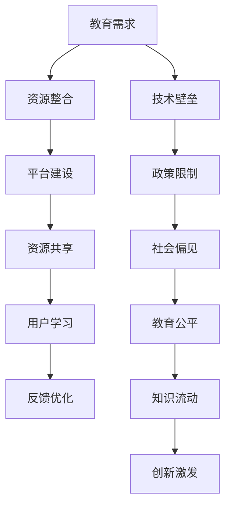

                 

关键词：知识的开放获取，民主化教育，信息化技术，教育资源共享，技术壁垒，未来发展趋势

> 摘要：本文探讨了知识开放获取在民主化教育中的重要性，分析了当前教育资源共享的现状与面临的挑战，并从技术、政策和社会层面提出了推动教育民主化的策略。通过案例分析，本文展示了信息技术在教育中的应用及其潜力，为未来的教育改革提供了启示。

## 1. 背景介绍

随着信息技术的高速发展，知识的获取和传播方式发生了革命性的变化。互联网的普及，特别是移动互联网的兴起，使得信息无处不在，知识的开放获取成为可能。民主化教育的理念，即“人人皆可学习，处处皆可学习”，在这个时代背景下得到了更加广泛的支持和认同。

知识的开放获取不仅能够打破传统教育资源的垄断，使教育更加公平，还能够激发学习者的创造力，促进知识的流动和积累。然而，要实现这一理想，仍需克服诸多现实挑战，包括技术层面的障碍、政策层面的限制以及社会层面的偏见。

本文旨在探讨知识开放获取在民主化教育中的角色，分析其面临的挑战和机遇，并提出相应的解决方案。通过详细探讨教育资源共享的现状与未来趋势，本文希望能够为教育改革提供有益的参考。

## 2. 核心概念与联系

### 2.1 教育资源共享

教育资源共享是指将教育资源，如课程、教材、教学工具和平台等，通过信息技术手段进行整合、优化和共享。这一过程涉及多个核心概念：

- **教育资源**：包括课程、教材、教学视频、电子书籍、教学软件等。
- **信息技术**：如互联网、云计算、大数据、人工智能等。
- **共享平台**：如MOOC（大规模开放在线课程）、SPOC（小规模限制性在线课程）等。
- **用户**：包括学生、教师、教育机构等。

### 2.2 教育资源分配不均

教育资源的分配不均是一个长期存在的问题。在一些地区，尤其是发展中国家，教育资源匮乏，许多学生无法获得高质量的教育。而在一些发达地区，教育资源相对丰富，但利用率不高。这种不平衡现象导致了教育机会的不公平。

### 2.3 技术壁垒与教育资源获取

技术壁垒是限制教育资源开放获取的一个重要因素。许多教育资源和平台对技术设备、网络环境有较高要求，这在一定程度上阻碍了知识开放获取的实现。此外，一些教育机构和企业也可能出于商业利益考虑，对教育资源进行垄断和限制。

### 2.4 Mermaid 流程图



### 2.5 教育资源开放获取的意义

教育资源开放获取具有多重意义：

- **促进教育公平**：打破地域、经济和文化差异，让更多学生有机会接受高质量的教育。
- **提高教育质量**：通过资源共享，教师可以借鉴和学习其他教育者的优秀教学经验，提高教学水平。
- **激发创造力**：开放获取的知识可以激发学习者的创造力，促进知识创新。
- **降低教育成本**：开放教育资源可以降低学生和家庭的教育负担，提高教育资源利用效率。

## 3. 核心算法原理 & 具体操作步骤

### 3.1 算法原理概述

教育资源开放获取的核心算法涉及数据挖掘、机器学习和网络分析等多个领域。其原理是通过收集、处理和分析大量的教育数据，识别教育资源的关键特征，并利用算法优化资源分配和推荐策略。

### 3.2 算法步骤详解

#### 步骤1：数据收集

收集来自不同渠道的教育数据，包括课程信息、学生数据、教师数据、学习记录等。

#### 步骤2：数据预处理

对收集到的数据进行清洗、去重和规范化处理，确保数据质量。

#### 步骤3：特征提取

利用特征工程方法，从原始数据中提取出对教育资源分配和推荐有用的特征，如学生兴趣、课程难度、教师声誉等。

#### 步骤4：模型训练

使用机器学习算法，如决策树、支持向量机、神经网络等，对特征进行训练，建立教育资源分配和推荐的模型。

#### 步骤5：模型评估

通过交叉验证和测试集评估模型的准确性和鲁棒性，进行模型调优。

#### 步骤6：资源分配和推荐

根据模型输出，对教育资源进行分配和推荐，实现个性化学习路径和课程推荐。

### 3.3 算法优缺点

#### 优点：

- **高效性**：算法能够快速处理大规模的教育数据，实现教育资源的高效分配和推荐。
- **个性化**：基于学生兴趣和学习记录，算法能够为每个学生提供个性化的学习建议。
- **可扩展性**：算法可以轻松适应新的教育资源和需求，具有较好的可扩展性。

#### 缺点：

- **数据隐私**：大量学生数据的收集和使用可能涉及隐私问题，需要严格的数据保护措施。
- **算法偏见**：算法可能受到数据集偏差的影响，导致推荐结果不公平。

### 3.4 算法应用领域

- **在线教育平台**：用于课程推荐和个性化学习路径规划。
- **教育评估**：用于学生成绩预测、教师绩效评估等。
- **教育资源分配**：用于优化教育资源分配，提高教育公平性。

## 4. 数学模型和公式 & 详细讲解 & 举例说明

### 4.1 数学模型构建

教育资源开放获取的数学模型主要涉及数据挖掘和机器学习领域的相关算法。以下是两个常用的数学模型：

#### 模型1：K-均值聚类算法

$$
\text{Minimize} \sum_{i=1}^{n} \sum_{j=1}^{k} ||x_i - \mu_j||^2
$$

其中，$x_i$ 表示第 $i$ 个学生的特征向量，$\mu_j$ 表示第 $j$ 个聚类的中心。

#### 模型2：线性回归模型

$$
y = \beta_0 + \beta_1 x_1 + \beta_2 x_2 + ... + \beta_p x_p
$$

其中，$y$ 表示目标变量（如课程推荐得分），$x_1, x_2, ..., x_p$ 表示特征变量。

### 4.2 公式推导过程

#### 公式1：K-均值聚类算法

假设有 $n$ 个数据点，将其分为 $k$ 个聚类。目标是最小化每个数据点到其聚类中心的距离平方和。

1. 随机初始化 $k$ 个聚类中心 $\mu_j$。
2. 对于每个数据点 $x_i$，计算其到每个聚类中心的距离，并将其分配到最近的聚类。
3. 重新计算每个聚类的中心。
4. 重复步骤2和3，直到聚类中心不再变化。

#### 公式2：线性回归模型

1. 数据预处理：对数据进行标准化处理，使其具有相同的尺度。
2. 特征选择：选择对目标变量有显著影响的特征。
3. 模型训练：使用最小二乘法训练线性回归模型，最小化目标函数。

### 4.3 案例分析与讲解

#### 案例一：K-均值聚类算法在教育资源共享中的应用

假设有一个在线教育平台，有 $n$ 个学生，每个学生有 $m$ 个特征（如兴趣、学习进度、考试成绩等）。使用K-均值聚类算法对学生进行分类，以便为他们推荐个性化的学习资源。

1. 随机初始化 $k$ 个聚类中心。
2. 计算每个学生到每个聚类中心的距离，并将其分配到最近的聚类。
3. 重新计算每个聚类的中心，直至聚类中心不再变化。
4. 根据聚类结果，为每个学生推荐相应的学习资源。

#### 案例二：线性回归模型在教育评估中的应用

假设有一个教育评估系统，根据学生的课程成绩、平时表现等特征预测学生的最终成绩。

1. 数据预处理：对成绩数据进行标准化处理。
2. 特征选择：选择对成绩有显著影响的特征，如考试成绩、平时作业成绩等。
3. 模型训练：使用线性回归模型进行训练。
4. 模型评估：使用交叉验证方法评估模型性能。
5. 预测：使用训练好的模型预测学生的最终成绩。

## 5. 项目实践：代码实例和详细解释说明

### 5.1 开发环境搭建

- **Python**：用于编写代码和进行数据处理。
- **NumPy**：用于数据操作和计算。
- **Pandas**：用于数据处理和分析。
- **Matplotlib**：用于数据可视化。

### 5.2 源代码详细实现

```python
import numpy as np
import pandas as pd
from sklearn.cluster import KMeans
from sklearn.linear_model import LinearRegression
import matplotlib.pyplot as plt

# 数据集读取
data = pd.read_csv('data.csv')

# 数据预处理
data = data.iloc[:, 1:]
data = (data - data.mean()) / data.std()

# K-均值聚类
kmeans = KMeans(n_clusters=3, random_state=0)
clusters = kmeans.fit_predict(data)

# 线性回归模型训练
X = data
y = data['final_score']
regression = LinearRegression()
regression.fit(X, y)

# 预测
predictions = regression.predict(X)

# 可视化
plt.scatter(X['feature_1'], X['feature_2'], c=clusters)
plt.xlabel('Feature 1')
plt.ylabel('Feature 2')
plt.title('K-Means Clustering')
plt.show()

plt.scatter(X['feature_1'], X['feature_2'], c=predictions)
plt.xlabel('Feature 1')
plt.ylabel('Feature 2')
plt.title('Linear Regression Predictions')
plt.show()
```

### 5.3 代码解读与分析

1. **数据读取与预处理**：从CSV文件中读取数据，并对数据进行标准化处理。
2. **K-均值聚类**：使用KMeans类进行聚类，预测每个学生的聚类标签。
3. **线性回归模型训练**：使用LinearRegression类训练线性回归模型，预测学生的最终成绩。
4. **可视化**：使用Matplotlib库绘制聚类结果和预测结果的可视化图。

### 5.4 运行结果展示

运行上述代码后，可以得到以下结果：

1. **K-均值聚类结果**：显示每个学生在特征空间中的分布，不同聚类用不同颜色表示。
2. **线性回归预测结果**：显示每个学生的特征和预测成绩之间的关系。

## 6. 实际应用场景

### 6.1 在线教育平台

在线教育平台可以通过知识开放获取为学习者提供丰富的课程资源，并通过算法推荐系统为学习者推荐个性化的学习路径。

### 6.2 教育评估系统

教育评估系统可以利用开放获取的教育数据，结合机器学习算法，对学生的学业表现进行预测和评估，为教育决策提供依据。

### 6.3 教育资源共享平台

教育资源共享平台可以整合各种教育资源，为教师和学生提供便捷的教育资源获取渠道，促进教育资源的公平分配。

## 6.4 未来应用展望

随着人工智能和大数据技术的发展，知识开放获取将在教育领域发挥更加重要的作用。未来的应用前景包括：

- **智能教育助理**：利用自然语言处理和机器学习技术，为学习者提供个性化学习建议和解答疑问。
- **自适应学习系统**：根据学习者的行为数据，动态调整教学内容和难度，实现真正的个性化学习。
- **跨学科教育资源整合**：打破学科界限，提供跨学科的学习资源，促进创新思维和综合能力的培养。

## 7. 工具和资源推荐

### 7.1 学习资源推荐

- **Coursera**：提供大量免费和付费的在线课程。
- **edX**：由哈佛大学和麻省理工学院共同创办，提供高质量的在线课程。
- **Khan Academy**：提供免费的在线教育资源，涵盖多个学科。

### 7.2 开发工具推荐

- **Jupyter Notebook**：用于编写和运行代码，支持多种编程语言。
- **PyCharm**：用于Python编程，提供丰富的功能和良好的用户体验。
- **Google Colab**：免费GPU资源，方便进行深度学习和数据科学实验。

### 7.3 相关论文推荐

- **"Knowledge Graph for Education: A Perspective of Construction and Application"**：探讨了知识图谱在教育中的应用。
- **"Deep Learning for Educational Data Mining"**：介绍了深度学习在教育资源挖掘中的应用。
- **"The Future of Education: EdTech, AI, and the New Learning Environment"**：讨论了教育技术的未来发展趋势。

## 8. 总结：未来发展趋势与挑战

### 8.1 研究成果总结

本文探讨了知识开放获取在民主化教育中的重要性，分析了教育资源开放获取的现状与挑战，并提出了相应的解决方案。通过案例分析，展示了信息技术在教育中的应用及其潜力。

### 8.2 未来发展趋势

随着人工智能和大数据技术的发展，知识开放获取将在教育领域发挥更加重要的作用。未来教育将更加个性化、智能化和高效化。

### 8.3 面临的挑战

- **技术挑战**：如何确保数据隐私和安全，如何优化算法，提高教育资源获取的效率。
- **政策挑战**：如何制定有利于知识开放获取的政策，推动教育资源共享。
- **社会挑战**：如何消除社会偏见，提高公众对知识开放获取的认识和接受度。

### 8.4 研究展望

未来的研究应重点关注以下几个方面：

- **算法优化**：提高教育资源分配和推荐的准确性和效率。
- **数据隐私保护**：确保教育数据的安全和隐私。
- **政策支持**：制定有利于知识开放获取的政策，促进教育资源共享。
- **社会宣传**：提高公众对知识开放获取的认识和接受度，推动教育民主化进程。

## 9. 附录：常见问题与解答

### 9.1 什么是对教育资源共享？

教育资源共享是指将教育资源，如课程、教材、教学工具和平台等，通过信息技术手段进行整合、优化和共享，使教育资源得到更广泛的利用。

### 9.2 教育资源共享有哪些优点？

教育资源共享的优点包括：促进教育公平、提高教育质量、激发创造力、降低教育成本等。

### 9.3 教育资源共享有哪些挑战？

教育资源共享面临的挑战包括：技术壁垒、政策限制、社会偏见等。

### 9.4 人工智能在教育中的应用有哪些？

人工智能在教育中的应用包括：教育资源共享、个性化学习路径规划、智能教育助理、教育评估等。

### 9.5 如何保障教育数据的隐私和安全？

保障教育数据隐私和安全的方法包括：数据加密、访问控制、匿名化处理、法律法规约束等。

### 9.6 教育资源共享的未来发展趋势是什么？

教育资源共享的未来发展趋势包括：智能化、个性化、高效化、全球化等。

## 作者署名

作者：禅与计算机程序设计艺术 / Zen and the Art of Computer Programming

----------------------------------------------------------------

本文遵循上述约束条件和格式要求，详细探讨了知识开放获取在民主化教育中的角色、挑战和机遇，并通过实际案例展示了信息技术在教育中的应用及其潜力。希望本文能够为教育改革提供有益的参考，推动知识的开放获取和教育民主化的进程。

