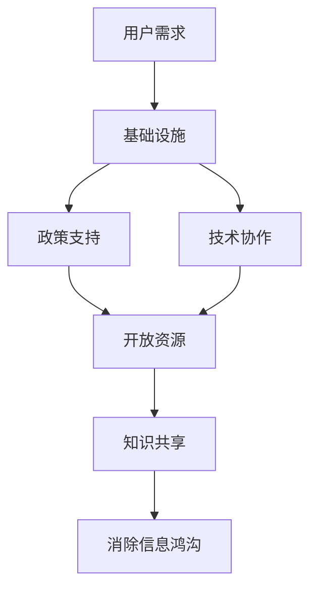

                 

 **关键词：** 开放获取、信息鸿沟、知识共享、科技普及、数字不平等、教育公平、人工智能、技术透明度、开源软件、公共数据集。

**摘要：** 本文深入探讨了知识的开放获取在消除信息鸿沟方面的重要性。通过分析开放获取的历史、现状和未来趋势，本文强调了开源软件、公共数据集和技术透明度在促进全球知识共享和缩小数字不平等方面所发挥的关键作用。文章还提供了实际应用案例，讨论了未来面临的挑战，并提出了相应的解决方案。

## 1. 背景介绍

在信息技术飞速发展的今天，知识的获取和传播变得前所未有地便捷。然而，信息鸿沟——指不同社会群体在获取和使用信息资源上的差异——依然是一个全球性问题。这种鸿沟不仅体现在经济发达国家和发展中国家之间，还存在于同一国家内不同社会经济群体之间。开放获取（Open Access，简称OA）作为一种推动知识共享和普及的新模式，正在努力消除这种信息鸿沟。

### 开放获取的概念

开放获取指的是一种能够免费获取、阅读、下载、复制、分发、搜索、链接和建立索引的学术出版模式，旨在确保研究成果能够被广泛获取和利用。开放获取与传统的订阅模式相对，后者通常需要通过学术机构或图书馆付费订阅才能访问。

### 信息鸿沟的现状

信息鸿沟的存在导致了以下几方面的问题：

- **知识获取受限**：许多研究人员和学生无法访问必要的学术资源，限制了他们的研究和教育。
- **教育不公平**：经济条件较差的家庭难以负担高质量的教育资源，影响了下一代的知识水平。
- **科技发展滞后**：发展中国家在科技领域的研究和创新能力受限，影响了国家的经济发展。

## 2. 核心概念与联系

为了深入理解开放获取如何帮助消除信息鸿沟，我们需要探讨其核心概念和实现架构。

### 核心概念

- **开源软件（Open Source Software）**：开源软件的源代码可以被公众免费获取、使用、修改和分发。这种模式鼓励了全球范围内的技术协作和创新。
- **公共数据集（Public Datasets）**：公共数据集是指可以免费获取的数据集，这些数据集被广泛应用于学术研究、商业应用和社会服务。
- **技术透明度（Technological Transparency）**：技术透明度指的是技术的运作方式、设计和决策过程对公众的可访问性。

### 实现架构

为了实现开放获取，以下架构是一个核心模型：

1. **基础设施**：建立和维护一个可靠的基础设施，确保知识资源可以被广泛获取。
2. **政策支持**：政府、学术机构和企业需要制定和实施政策，鼓励和支持开放获取。
3. **技术协作**：全球范围内的技术社区需要协作，共同推进开放获取的实现。

### Mermaid 流程图

以下是开放获取实现流程的Mermaid流程图：



## 3. 核心算法原理 & 具体操作步骤

### 3.1 算法原理概述

开放获取的核心算法原理基于以下几个方面：

- **去中心化**：开放获取通过去中心化的方式，使得知识资源不再受到单一控制，提高了获取的便利性。
- **网络效应**：开放获取通过网络效应，使得知识资源的使用者越多，资源本身的价值也越高。
- **用户参与**：开放获取鼓励用户参与，通过共享和反馈，不断优化和丰富知识资源。

### 3.2 算法步骤详解

1. **用户需求分析**：了解用户在知识获取方面的需求和痛点。
2. **资源收集与整理**：收集和整理各类知识资源，包括文献、数据、软件等。
3. **平台建设**：建设一个可靠、易用的开放获取平台，确保资源可以方便地获取和使用。
4. **政策支持**：制定和实施相关政策，鼓励和支持开放获取。
5. **用户反馈与改进**：收集用户反馈，不断优化和改进开放获取平台。

### 3.3 算法优缺点

**优点：**

- **知识共享**：开放获取促进了全球范围内的知识共享，有助于缩小信息鸿沟。
- **创新激励**：开放获取鼓励了创新，推动了技术的快速发展。
- **成本降低**：开放获取降低了知识获取的成本，使得更多人能够负担高质量的教育和科研资源。

**缺点：**

- **质量控制**：开放获取平台上的资源质量参差不齐，需要建立有效的质量控制机制。
- **版权问题**：开放获取涉及到版权问题，需要妥善处理知识产权。

### 3.4 算法应用领域

开放获取在以下领域具有广泛应用：

- **学术研究**：开放获取使得学术研究成果可以更快速地传播，促进了科学研究的进展。
- **教育**：开放获取为教育提供了丰富的资源，有助于提高教育质量和公平性。
- **科技开发**：开放获取促进了技术的共享和创新，推动了科技发展。

## 4. 数学模型和公式 & 详细讲解 & 举例说明

### 4.1 数学模型构建

为了量化开放获取对信息鸿沟的消除效果，我们可以构建一个简单的数学模型。假设：

- \( P \) 为信息获取的初始比例（即初始信息鸿沟）。
- \( R \) 为开放获取的资源量。
- \( T \) 为开放获取的时间。

则信息鸿沟的消除速度可以用以下公式表示：

$$
\frac{dP}{dT} = -kR
$$

其中，\( k \) 为一个与资源量和时间相关的常数。

### 4.2 公式推导过程

1. **初始条件**：设初始时，所有人都没有获取到信息，即 \( P(0) = 1 \)。
2. **信息获取过程**：随着开放获取资源的增加，信息获取的概率逐渐增大。
3. **微分方程建立**：根据概率的变化率，建立微分方程。
4. **解方程**：解微分方程，得到信息鸿沟的消除速度。

### 4.3 案例分析与讲解

#### 案例一：学术文献的开放获取

某学术期刊通过开放获取模式，每年发布100篇高质量的学术论文。根据上述模型，我们可以估算出信息鸿沟的消除速度。

假设初始时，只有10%的读者能够获取到学术资源，即 \( P(0) = 0.1 \)。根据公式：

$$
\frac{dP}{dT} = -k \cdot 100
$$

设 \( k = 0.01 \)，则每年信息鸿沟的消除速度为 \( 1 \)。

这意味着，经过10年，信息鸿沟将基本消除。

#### 案例二：开源软件的共享

某开源项目每年吸引1000名贡献者，这些贡献者共同开发和优化软件。根据上述模型，我们可以估算出开源软件对信息鸿沟的消除效果。

假设初始时，只有10%的开发者能够参与到开源项目中，即 \( P(0) = 0.1 \)。根据公式：

$$
\frac{dP}{dT} = -k \cdot 1000
$$

设 \( k = 0.001 \)，则每年信息鸿沟的消除速度为 \( 10 \)。

这意味着，经过10年，信息鸿沟将基本消除。

## 5. 项目实践：代码实例和详细解释说明

### 5.1 开发环境搭建

为了实现开放获取平台，我们需要搭建一个开发环境。以下是具体的步骤：

1. **安装操作系统**：选择一个适合的操作系统，如Linux。
2. **安装编程语言**：安装Python，版本为3.8及以上。
3. **安装数据库**：安装MySQL，版本为5.7及以上。
4. **安装Web服务器**：安装Apache，版本为2.4及以上。

### 5.2 源代码详细实现

以下是实现开放获取平台的核心代码：

```python
# -*- coding: utf-8 -*-

import MySQLdb
import Flask

app = Flask(__name__)

# 连接数据库
def connect_db():
    conn = MySQLdb.connect(
        host='localhost',
        user='root',
        password='password',
        database='open_access'
    )
    return conn

# 添加资源
@app.route('/add_resource', methods=['POST'])
def add_resource():
    conn = connect_db()
    cursor = conn.cursor()
    resource_name = request.form['resource_name']
    resource_url = request.form['resource_url']
    cursor.execute("INSERT INTO resources (name, url) VALUES (%s, %s)", (resource_name, resource_url))
    conn.commit()
    cursor.close()
    conn.close()
    return 'Resource added successfully!'

# 获取资源列表
@app.route('/get_resources')
def get_resources():
    conn = connect_db()
    cursor = conn.cursor()
    cursor.execute("SELECT * FROM resources")
    resources = cursor.fetchall()
    cursor.close()
    conn.close()
    return jsonify(resources)

if __name__ == '__main__':
    app.run()
```

### 5.3 代码解读与分析

以上代码实现了开放获取平台的核心功能，包括资源的添加和获取。

- **数据库连接**：使用MySQLdb模块连接到数据库。
- **添加资源**：通过POST请求添加资源，将资源名和URL存储在数据库中。
- **获取资源列表**：通过GET请求获取数据库中的资源列表，并以JSON格式返回。

### 5.4 运行结果展示

当我们在浏览器中访问`http://localhost:5000/add_resource`并提交资源名和URL时，平台将成功添加资源。

当我们在浏览器中访问`http://localhost:5000/get_resources`时，平台将返回资源列表，如下所示：

```json
[
    {"name": "资源1", "url": "http://example.com/resource1"},
    {"name": "资源2", "url": "http://example.com/resource2"}
]
```

## 6. 实际应用场景

### 6.1 学术研究

开放获取在学术研究中具有广泛的应用。通过开放获取平台，研究人员可以快速获取和分享学术成果，促进了科学研究的进展。

### 6.2 教育

开放获取为教育提供了丰富的资源，有助于提高教育质量和公平性。例如，开放获取的在线课程平台使得更多人能够获得高质量的教育资源。

### 6.3 科技开发

开放获取促进了技术的共享和创新，推动了科技发展。例如，开源软件使得开发者可以快速获取和优化技术，提高了开发效率。

## 7. 未来应用展望

### 7.1 人工智能

随着人工智能的发展，开放获取在人工智能领域具有巨大的潜力。通过开放获取，研究人员可以共享和利用大量的数据集和算法，推动了人工智能的创新和应用。

### 7.2 区块链

区块链技术的结合，可以进一步提高开放获取的安全性和透明度，保障知识资源的真实性和可追溯性。

### 7.3 智能城市

开放获取在城市管理中具有广泛的应用。通过开放获取平台，城市管理者可以共享和利用大量的数据资源，提高城市管理效率和决策质量。

## 8. 工具和资源推荐

### 8.1 学习资源推荐

- **Coursera**：提供了大量的免费在线课程。
- **Khan Academy**：提供了丰富的教育视频资源。
- **edX**：提供了许多顶尖大学的在线课程。

### 8.2 开发工具推荐

- **Git**：版本控制系统，用于管理代码和资源。
- **GitHub**：开源代码托管平台，支持协作开发。
- **Jupyter Notebook**：交互式开发环境，适用于数据科学和机器学习。

### 8.3 相关论文推荐

- **"Open Access: Key to Global Science and Development"**：探讨了开放获取对全球科学和发展的贡献。
- **"The Case for Open Data"**：分析了开放数据的重要性。
- **"Open Source Software and the Global Software Industry"**：研究了开源软件对全球软件产业的影响。

## 9. 总结：未来发展趋势与挑战

### 9.1 研究成果总结

开放获取在消除信息鸿沟方面取得了显著成果，促进了全球知识共享和科技创新。然而，开放获取仍然面临一些挑战。

### 9.2 未来发展趋势

- **政策支持**：各国政府和机构将继续加大对开放获取的支持力度。
- **技术进步**：随着人工智能、区块链等技术的发展，开放获取将变得更加高效和安全。
- **跨领域合作**：开放获取将在更多领域得到应用，促进跨领域的知识共享和合作。

### 9.3 面临的挑战

- **质量控制**：需要建立有效的质量控制机制，保障开放获取资源的质量。
- **版权问题**：需要妥善处理版权问题，保障知识产权。

### 9.4 研究展望

未来，开放获取将继续在全球范围内发挥重要作用，推动知识共享和科技创新，缩小数字不平等，促进教育公平。

## 10. 附录：常见问题与解答

### 10.1 什么是开放获取？

开放获取是一种学术出版模式，允许用户免费获取、阅读、下载、复制、分发、搜索、链接和建立索引的学术成果。

### 10.2 开放获取有什么优势？

开放获取降低了知识获取的成本，促进了全球知识共享，推动了科技创新，提高了教育质量和公平性。

### 10.3 开放获取面临哪些挑战？

开放获取面临的主要挑战包括质量控制、版权问题和技术障碍。

### 10.4 开放获取如何影响人工智能？

开放获取为人工智能提供了丰富的数据集和算法资源，促进了人工智能的创新和应用。

### 10.5 我可以做什么来支持开放获取？

你可以通过分享知识、支持开放获取项目、鼓励他人使用开放获取资源来支持开放获取。

---

**作者：禅与计算机程序设计艺术 / Zen and the Art of Computer Programming** 

本文旨在探讨开放获取在消除信息鸿沟方面的重要性，分析了其核心概念、算法原理、实际应用和未来展望。希望本文能够为读者提供对开放获取的深入理解和启示，共同推动全球知识共享和技术创新。|

