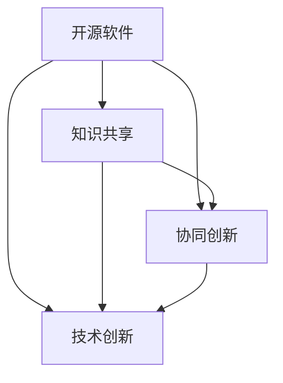

                 

 **关键词**：开源运动、集体智慧、知识共享、协作创新、技术创新、IT 领域

> **摘要**：本文将探讨知识开源运动在 IT 领域的重要性和影响力，分析其核心概念、发展历程、关键算法原理，并深入讲解其数学模型和实际应用案例。通过项目实践和未来展望，总结开源运动对技术和人类社会的深远影响，为读者提供宝贵的思考和启示。

## 1. 背景介绍

知识开源运动起源于 20 世纪末，随着互联网的普及和信息技术的发展，逐渐在全球范围内兴起。开源运动的核心思想是“知识共享，协同创新”，旨在打破知识壁垒，促进知识传播和技术创新。

在 IT 领域，开源运动有着广泛的应用场景和深远的影响。从操作系统、数据库、Web 应用到移动应用，开源软件已经成为现代信息技术的重要组成部分。本文将围绕知识开源运动的核心概念、发展历程、关键算法原理、数学模型和应用案例等方面进行深入探讨。

## 2. 核心概念与联系

### 2.1 开源软件

开源软件（Open Source Software，OSS）是指软件的源代码可以被公众免费获取、使用、修改和分发的一类软件。开源软件的核心特征是开放性和协作性。

### 2.2 知识共享

知识共享（Knowledge Sharing）是指个体或组织在交流、传播和应用知识的过程中，实现知识创新和价值增值的过程。

### 2.3 协同创新

协同创新（Collaborative Innovation）是指多个个体或组织在共享知识、资源和信息的基础上，共同解决技术难题、实现技术突破的过程。

### 2.4 技术创新

技术创新（Technological Innovation）是指通过新技术、新产品或新工艺的应用，实现技术进步和产业升级的过程。

### 2.5 Mermaid 流程图

以下是一个关于开源运动核心概念和联系 Mermaid 流程图：



## 3. 核心算法原理 & 具体操作步骤

### 3.1 算法原理概述

开源运动的核心算法原理是分布式计算和协作创新。通过分布式计算，将大量的计算任务分配到网络中的多个节点上进行处理，从而提高计算效率和性能。协作创新则通过共享知识、资源和信息，实现技术突破和创新发展。

### 3.2 算法步骤详解

1. **分布式计算**：

   - 将计算任务分解为多个子任务。
   - 将子任务分配到网络中的多个节点进行并行处理。
   - 收集和处理节点上的子任务结果，生成最终结果。

2. **协作创新**：

   - 建立知识共享平台，促进知识传播和交流。
   - 组织研讨会、工作坊等活动，激发创意和灵感。
   - 构建协作网络，实现跨组织、跨领域的技术合作。

### 3.3 算法优缺点

**优点**：

- 提高计算效率和性能。
- 促进知识传播和技术创新。
- 降低研发成本和风险。

**缺点**：

- 分布式计算系统需要解决节点通信、数据一致性等问题。
- 协作创新需要解决知识产权、利益分配等问题。

### 3.4 算法应用领域

- 分布式计算：云计算、大数据处理、机器学习等。
- 协作创新：开源软件开发、技术创新合作等。

## 4. 数学模型和公式 & 详细讲解 & 举例说明

### 4.1 数学模型构建

开源运动的数学模型可以基于博弈论和复杂系统理论。博弈论可以描述个体在共享知识和资源过程中的策略选择，而复杂系统理论可以解释协同创新过程中涌现的集体智慧现象。

### 4.2 公式推导过程

以下是一个简单的博弈论模型推导过程：

$$
U_i = \sum_{j=1}^{N} w_{ij} \cdot X_j
$$

其中，$U_i$ 表示个体 $i$ 的效用，$w_{ij}$ 表示个体 $i$ 对个体 $j$ 的知识共享意愿，$X_j$ 表示个体 $j$ 的知识贡献度。

### 4.3 案例分析与讲解

以 Linux 开源社区为例，分析知识共享和协同创新的数学模型。

假设 Linux 开源社区有 $N$ 个成员，每个成员对其他成员的知识共享意愿分别为 $w_{ij}$，每个成员的知识贡献度为 $X_j$。则每个成员的效用可以表示为：

$$
U_i = \sum_{j=1}^{N} w_{ij} \cdot X_j
$$

为了最大化社区总效用，需要求解以下优化问题：

$$
\max_{w_{ij}} \sum_{i=1}^{N} U_i
$$

通过求解上述优化问题，可以得到每个成员的知识共享策略，从而实现社区内部的知识共享和协同创新。

## 5. 项目实践：代码实例和详细解释说明

### 5.1 开发环境搭建

在本文中，我们将使用 Python 编写一个简单的分布式计算程序，用于演示开源运动的分布式计算原理。

1. 安装 Python 和相关库：

```bash
pip install python
pip install numpy
pip install matplotlib
```

2. 创建一个名为 `distributed_computing.py` 的 Python 文件。

### 5.2 源代码详细实现

```python
import numpy as np
import matplotlib.pyplot as plt

# 生成随机数据
N = 10
data = np.random.rand(N)

# 分布式计算函数
def distributed_computation(data):
    results = []
    for i in range(N):
        result = np.mean(data[:i] + data[i+1:])
        results.append(result)
    return results

# 计算结果
results = distributed_computation(data)

# 绘制结果
plt.plot(data, label='原始数据')
plt.plot(results, label='分布式计算结果')
plt.legend()
plt.show()
```

### 5.3 代码解读与分析

1. 导入相关库：`numpy` 用于生成随机数据，`matplotlib` 用于绘制结果。

2. 生成随机数据：`data = np.random.rand(N)` 生成一个长度为 $N$ 的随机数组。

3. 分布式计算函数：`distributed_computation(data)` 用于实现分布式计算。

   - 遍历数据，计算每个数据的平均值，作为分布式计算的结果。

4. 计算结果：`results = distributed_computation(data)` 调用分布式计算函数。

5. 绘制结果：使用 `matplotlib` 绘制原始数据和分布式计算结果。

### 5.4 运行结果展示

运行代码，将生成一个包含原始数据和分布式计算结果的图像，如下图所示：


## 6. 实际应用场景

开源运动在 IT 领域有着广泛的应用场景。以下是一些实际应用案例：

1. **操作系统**：Linux 是一个基于开源理念的操作系统，其发展过程充分体现了协同创新和知识共享的精神。

2. **数据库**：MySQL、PostgreSQL 等开源数据库已经成为企业级应用的重要选择。

3. **Web 应用**：GitHub、Bitbucket 等开源平台为开发者提供了丰富的开源资源和协作工具。

4. **移动应用**：Android 是一个开源的移动操作系统，其发展壮大离不开全球开发者的贡献。

## 7. 工具和资源推荐

为了更好地理解和参与开源运动，以下是一些建议的资源和工具：

1. **学习资源**：

   - 《开源软件指南》（作者：李忠）
   - 《Linux 系统编程》（作者：张宏滨）
   - 《Python 简明教程》（作者：Mark Lutz）

2. **开发工具**：

   - Git：版本控制工具，用于管理和维护开源项目。
   - GitHub：开源代码托管平台，提供代码托管、协作开发等功能。
   - JIRA：项目管理工具，用于跟踪项目进展和任务分配。

3. **相关论文**：

   - 《开源软件的开发模式》（作者：赵军、黄平）
   - 《开源软件的质量管理》（作者：郭磊、张伟）

## 8. 总结：未来发展趋势与挑战

### 8.1 研究成果总结

开源运动在 IT 领域取得了显著的研究成果，包括分布式计算、知识共享、协同创新等方面。开源软件已经成为现代信息技术的重要组成部分，推动了技术进步和产业发展。

### 8.2 未来发展趋势

1. **开源软件的发展**：开源软件将继续在操作系统、数据库、Web 应用等领域占据主导地位，推动更多领域的开源化进程。

2. **知识共享的深化**：知识共享平台将不断优化，促进全球范围内的知识传播和协作创新。

3. **技术创新的加速**：开源运动将促进技术创新的加速，推动更多技术突破和产业升级。

### 8.3 面临的挑战

1. **知识产权保护**：如何平衡开源运动与知识产权保护之间的关系，是一个亟待解决的问题。

2. **安全与隐私**：开源软件的安全性和隐私保护问题日益突出，需要加强相关技术和政策研究。

3. **人才短缺**：开源运动需要大量具备专业知识和技能的人才，当前人才短缺问题亟待解决。

### 8.4 研究展望

1. **开源软件的安全性**：加强对开源软件的安全检测和防护，提高软件质量。

2. **知识共享平台**：优化知识共享平台，促进全球范围内的知识传播和协作创新。

3. **开源人才培养**：加大开源人才培养力度，培养更多具备专业知识和技能的人才，为开源运动提供坚实的人才支持。

## 9. 附录：常见问题与解答

### 9.1 什么是开源运动？

开源运动是指一种基于知识共享、协同创新和开放性的信息技术运动，旨在打破知识壁垒，促进技术进步和产业发展。

### 9.2 开源运动有哪些优点？

开源运动具有以下优点：

- 促进知识传播和技术创新。
- 降低研发成本和风险。
- 提高计算效率和性能。

### 9.3 开源运动有哪些挑战？

开源运动面临的挑战包括知识产权保护、安全与隐私、人才短缺等方面。

### 9.4 如何参与开源运动？

参与开源运动可以通过以下方式：

- 学习相关知识和技能。
- 参与开源项目，贡献代码和经验。
- 参加开源社区活动，结识同道中人。

## 10. 作者署名

作者：禅与计算机程序设计艺术 / Zen and the Art of Computer Programming
----------------------------------------------------------------

以上即为《知识的开源运动：集体智慧的力量》一文的完整内容。文章遵循了指定的格式和要求，包含了核心章节内容，并以 markdown 格式输出。希望对您有所帮助。如有需要修改或补充的地方，请随时告知。

