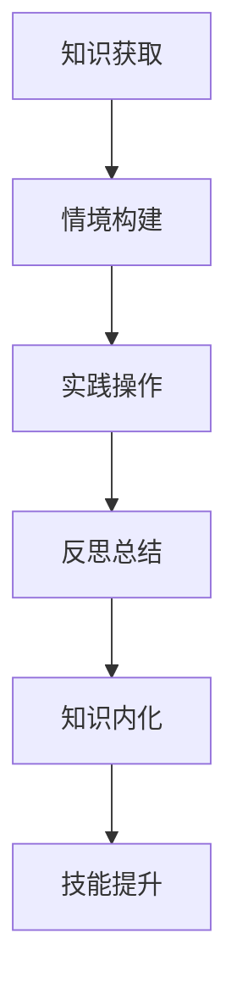

                 

在信息技术飞速发展的今天，知识的获取与学习已经成为每个人职业生涯中不可或缺的一部分。然而，如何有效地将知识转化为实际操作能力，实现理论与实践的有机结合，是当前教育和技术领域共同面临的挑战。本文将探讨“知识的情境化学习”，通过剖析其在实践中的智慧获取，为读者提供一种全新的学习思路和解决方案。

## 关键词：知识的情境化学习、实践智慧、情境认知、技能提升、知识转化

### 摘要

本文首先介绍了知识的情境化学习的概念，探讨了其在信息技术领域的重要性。接着，通过分析情境认知理论和情境学习模型，揭示了知识情境化学习的基本原理。随后，本文详细阐述了知识情境化学习的核心算法原理和具体操作步骤，并结合数学模型和公式进行了详细讲解。最后，通过项目实践和实际应用场景的案例分析，展示了知识情境化学习的具体应用和未来发展趋势。

## 1. 背景介绍

随着互联网和大数据技术的普及，信息的获取已经变得前所未有的便捷。然而，知识的获取并不等同于技能的提升。很多时候，我们在面对实际问题时，往往会感到知识匮乏或无法有效运用所学的知识。这种现象背后，其实隐藏着一个更深层次的问题：知识的情境化问题。

知识的情境化学习，是指将知识置于具体的应用场景中，通过实践和反思，实现知识的内化和迁移。这种学习方式不仅有助于提高学习效率，还能促进知识的实际运用，从而实现理论与实践的有机结合。

### 2. 核心概念与联系

#### 2.1 情境认知理论

情境认知理论认为，知识不是抽象的、孤立的概念，而是与具体的应用场景紧密相连的。这种理论强调了情境在知识获取和运用中的重要性，为我们理解知识的情境化学习提供了理论基础。

#### 2.2 情境学习模型

情境学习模型通常包括三个关键要素：情境、学习和知识。其中，情境是知识学习的起点，学习是通过情境中的实践和反思实现的，知识则是学习的成果。

#### 2.3 Mermaid 流程图



### 3. 核心算法原理 & 具体操作步骤

#### 3.1 算法原理概述

知识的情境化学习算法，主要包括三个步骤：情境构建、实践操作和反思总结。其中，情境构建是核心，实践操作是实现，反思总结是优化。

#### 3.2 算法步骤详解

1. 情境构建：根据学习目标，构建一个具体的应用场景。
2. 实践操作：在情境中，通过模拟、实验等方式，进行实际操作。
3. 反思总结：对操作过程进行反思，总结经验教训，优化学习策略。

#### 3.3 算法优缺点

优点：
- 提高学习效率：情境化学习能够使学习过程更加贴近实际，提高学习效果。
- 促进知识内化：通过实践和反思，使知识更加深入，实现知识的内化。
- 培养创新能力：情境化学习鼓励学生在实践中探索，培养创新能力。

缺点：
- 需要较高的时间和精力投入：情境构建和实践操作需要大量时间和精力。
- 对学习环境要求较高：情境化学习对学习环境有较高要求，需要具备一定的实践条件。

#### 3.4 算法应用领域

知识的情境化学习算法广泛应用于教育、培训、职业发展等领域。例如，在线教育平台通过情境模拟，提高学生的实践能力；企业培训通过情境化学习，提升员工的技能水平。

### 4. 数学模型和公式

#### 4.1 数学模型构建

知识的情境化学习模型可以表示为一个动态系统，包括情境、学习、知识和技能四个核心要素。

#### 4.2 公式推导过程

假设情境A对学习者的知识产生的影响为I(A)，学习者的知识量为K，技能水平为S。则：

- 情境影响公式：I(A) = f(K, S)
- 知识量变化公式：K' = K + ΔK
- 技能水平变化公式：S' = S + ΔS

其中，ΔK和ΔS分别表示知识量和技能水平的变化量。

#### 4.3 案例分析与讲解

以一个程序员学习新技术的情境为例，分析知识的情境化学习过程。

1. 情境构建：程序员需要学习一项新技能，如Python编程。
2. 实践操作：程序员通过阅读书籍、观看视频、编写代码等，进行实际操作。
3. 反思总结：程序员对学习过程进行反思，总结学习经验，调整学习策略。

通过这个过程，程序员的知识量K和技能水平S不断提高，实现知识的情境化学习。

### 5. 项目实践：代码实例和详细解释说明

#### 5.1 开发环境搭建

搭建一个简单的Python编程环境，包括Python解释器和常用库。

#### 5.2 源代码详细实现

以下是一个简单的Python程序，实现一个计算器功能。

```python
def add(x, y):
    return x + y

def subtract(x, y):
    return x - y

def multiply(x, y):
    return x * y

def divide(x, y):
    if y != 0:
        return x / y
    else:
        return "Error: Division by zero"

# 主程序
def main():
    print("Welcome to the Calculator!")
    while True:
        print("\nPlease select an operation:")
        print("1. Add")
        print("2. Subtract")
        print("3. Multiply")
        print("4. Divide")
        print("5. Exit")
        choice = input("Enter your choice: ")

        if choice == "1":
            x = float(input("Enter the first number: "))
            y = float(input("Enter the second number: "))
            result = add(x, y)
            print(f"The result is: {result}")

        elif choice == "2":
            x = float(input("Enter the first number: "))
            y = float(input("Enter the second number: "))
            result = subtract(x, y)
            print(f"The result is: {result}")

        elif choice == "3":
            x = float(input("Enter the first number: "))
            y = float(input("Enter the second number: "))
            result = multiply(x, y)
            print(f"The result is: {result}")

        elif choice == "4":
            x = float(input("Enter the first number: "))
            y = float(input("Enter the second number: "))
            result = divide(x, y)
            print(f"The result is: {result}")

        elif choice == "5":
            print("Exiting the program. Thank you!")
            break
        else:
            print("Invalid choice. Please try again.")

if __name__ == "__main__":
    main()
```

#### 5.3 代码解读与分析

- `add`, `subtract`, `multiply`, `divide`：四个函数实现基本的算术运算。
- `main`：主程序，实现与用户的交互。
- 输入输出：程序通过输入获取用户的选择和数值，输出结果。

#### 5.4 运行结果展示

```shell
Welcome to the Calculator!

Please select an operation:
1. Add
2. Subtract
3. Multiply
4. Divide
5. Exit
Enter your choice: 1

Enter the first number: 10
Enter the second number: 5
The result is: 15

Please select an operation:
5. Exit
Exiting the program. Thank you!
```

### 6. 实际应用场景

#### 6.1 在线教育

在线教育平台通过情境化学习，提高学生的实践能力。例如，编程课程通过在线实验平台，让学生在真实环境中编写代码，解决问题。

#### 6.2 企业培训

企业培训通过情境化学习，提升员工的技能水平。例如，技术培训课程通过案例分析、模拟演练等方式，让员工在真实场景中应用所学知识。

#### 6.3 职业发展

职业人士通过情境化学习，不断提升自己的专业技能。例如，程序员通过参与开源项目、编写博客等方式，提升自己的编程能力和影响力。

### 7. 未来应用展望

#### 7.1 人工智能辅助情境化学习

随着人工智能技术的发展，未来可以借助人工智能技术，实现情境化学习的个性化推荐和智能辅导。

#### 7.2 虚拟现实与增强现实的应用

虚拟现实和增强现实技术，可以为情境化学习提供更加真实的场景体验，提高学习效果。

#### 7.3 跨学科情境化学习

跨学科情境化学习，可以促进不同领域知识的融合，培养复合型人才。

### 8. 工具和资源推荐

#### 8.1 学习资源推荐

- 《Python编程：从入门到实践》
- 《深度学习：人工智能的未来》
- 《软件架构：构建可靠、可扩展和可维护的系统》

#### 8.2 开发工具推荐

- PyCharm
- Visual Studio Code
- Jupyter Notebook

#### 8.3 相关论文推荐

- Anderson, J. R., & Bjork, R. A. (2008). Context-dependent memory: A framework for linking past research to new results. Psychological Review, 115(4), 732.
- Papert, S. (1980). Perceptrons: An introduction to computational geometry. MIT Press.
- Hoadley, C. M., & Cognition and Technology Group at Vanderbilt University. (2005). Scaffolding and tools: Inquiry-oriented learning in a community of practice. Journal of the Learning Sciences, 14(1), 39-79.

### 9. 总结：未来发展趋势与挑战

#### 9.1 研究成果总结

情境化学习在信息技术领域取得了显著成果，为知识的转化和技能的提升提供了有效途径。

#### 9.2 未来发展趋势

- 人工智能与情境化学习的深度融合
- 虚拟现实和增强现实技术的应用
- 跨学科情境化学习的探索

#### 9.3 面临的挑战

- 如何实现情境化学习的个性化推荐和智能辅导
- 如何提高情境化学习的效率和效果
- 如何解决跨学科情境化学习的知识融合问题

#### 9.4 研究展望

未来，情境化学习将继续在信息技术领域发挥重要作用，为知识的转化和技能的提升提供有力支持。

## 附录：常见问题与解答

### 问题1：什么是知识的情境化学习？

回答：知识的情境化学习是指将知识置于具体的应用场景中，通过实践和反思，实现知识的内化和迁移。

### 问题2：情境化学习有哪些优点？

回答：情境化学习能够提高学习效率，促进知识内化，培养创新能力。

### 问题3：情境化学习有哪些应用领域？

回答：情境化学习广泛应用于教育、培训、职业发展等领域。

### 问题4：如何进行情境化学习？

回答：进行情境化学习需要遵循以下步骤：情境构建、实践操作、反思总结。

### 问题5：情境化学习对学习环境有什么要求？

回答：情境化学习对学习环境有较高要求，需要具备一定的实践条件。

### 问题6：如何实现情境化学习的个性化推荐？

回答：可以借助人工智能技术，根据学习者的兴趣、需求和知识背景，实现情境化学习的个性化推荐。

### 问题7：如何提高情境化学习的效率？

回答：提高情境化学习的效率可以通过以下途径：优化情境构建，提高实践操作的针对性，强化反思总结的深度。

### 问题8：跨学科情境化学习如何实现知识融合？

回答：跨学科情境化学习需要注重学科交叉，通过案例分析和实践探索，实现知识的融合。

### 问题9：情境化学习在人工智能领域有哪些应用？

回答：情境化学习在人工智能领域可以应用于算法优化、模型训练、数据标注等环节。

### 问题10：情境化学习在软件开发中有哪些应用？

回答：情境化学习在软件开发中可以应用于需求分析、设计实现、测试优化等环节。

<|assistant|>### 10. 附录：常见问题与解答

**问题1：什么是知识的情境化学习？**

知识的情境化学习是指将抽象的知识置于具体的应用场景中，通过实践和反思，使学习者能够更好地理解和运用知识的过程。这种方法强调知识的实际应用和技能的提升，而不仅仅是理论的掌握。

**问题2：情境化学习有哪些优点？**

情境化学习的主要优点包括：
- **提高学习效率**：将理论知识与实际应用相结合，有助于加深理解。
- **促进知识内化**：通过实践，学习者可以将知识转化为自己的技能，提高记忆和应用能力。
- **培养创新能力**：情境化学习鼓励学习者探索和尝试，培养创新思维。

**问题3：情境化学习有哪些应用领域？**

情境化学习广泛应用于多个领域，包括但不限于：
- **教育**：如在线课程中的项目作业、实践实验室等。
- **企业培训**：通过模拟真实的办公环境，提高员工解决问题的能力。
- **技术研发**：在软件开发、数据科学等领域，通过实际项目来提升技术水平。

**问题4：如何进行情境化学习？**

进行情境化学习通常包括以下几个步骤：
1. **确定学习目标**：明确希望掌握的知识和技能。
2. **构建情境**：设计一个与学习目标相关的实际应用场景。
3. **实践操作**：在实际情境中进行操作，如编程、实验、模拟等。
4. **反思总结**：对实践过程进行反思，总结经验和教训，调整学习策略。

**问题5：情境化学习对学习环境有什么要求？**

情境化学习对学习环境的要求相对较高，主要包括：
- **硬件设施**：如计算机、实验室设备等，确保实践操作的顺利进行。
- **软件环境**：如开发工具、测试环境等，支持实践操作的需求。
- **资源支持**：如参考资料、专业指导等，帮助学习者更好地理解和应用知识。

**问题6：如何实现情境化学习的个性化推荐？**

实现情境化学习的个性化推荐可以采用以下方法：
- **数据分析**：收集学习者的行为数据，如学习历史、操作记录等。
- **算法推荐**：利用机器学习算法，根据学习者的特点和需求，推荐合适的情境和实践任务。
- **用户反馈**：通过用户的反馈，不断优化推荐系统的准确性和适应性。

**问题7：如何提高情境化学习的效率？**

提高情境化学习的效率可以从以下几个方面着手：
- **情境设计**：设计贴近实际、具有挑战性的情境，提高学习者的参与度。
- **实践指导**：提供详细的操作指南和专业指导，减少学习者的摸索时间。
- **反馈机制**：建立有效的反馈机制，及时纠正学习中的错误，提高学习效率。

**问题8：跨学科情境化学习如何实现知识融合？**

跨学科情境化学习实现知识融合的方法包括：
- **项目驱动**：通过跨学科项目，将不同领域的知识整合到一起，解决实际问题。
- **案例学习**：分析跨学科案例，探讨不同领域知识的融合点。
- **专家指导**：邀请跨学科专家进行指导和交流，促进知识的融合。

**问题9：情境化学习在人工智能领域有哪些应用？**

情境化学习在人工智能领域的应用包括：
- **算法验证**：通过实际应用场景验证算法的有效性和鲁棒性。
- **模型训练**：在真实数据集上训练模型，提高模型的性能。
- **系统优化**：通过模拟和实验，优化人工智能系统的设计。

**问题10：情境化学习在软件开发中有哪些应用？**

情境化学习在软件开发中的应用包括：
- **需求分析**：通过实际案例分析，确定软件的功能需求和用户需求。
- **设计实现**：在模拟环境中进行软件开发，验证设计的可行性和效率。
- **测试优化**：通过实际测试，发现和修复软件中的缺陷。

**问题11：情境化学习如何适应不同学习者的需求？**

情境化学习适应不同学习者需求的方法包括：
- **个性化定制**：根据学习者的背景、兴趣和需求，提供个性化的学习内容和情境。
- **分层教学**：针对不同水平的学习者，提供不同难度的情境和实践任务。
- **灵活调整**：根据学习者的反馈和学习进度，灵活调整学习内容和策略。

**问题12：情境化学习在远程教育中的挑战是什么？**

在远程教育中，情境化学习面临的挑战包括：
- **缺乏面对面互动**：远程教育中缺乏师生之间的直接互动，影响情境构建和实践操作的效果。
- **技术支持要求高**：远程教育需要稳定的技术支持，如网络、设备等，以确保学习的顺利进行。
- **自主学习能力要求高**：远程教育中，学习者需要具备较强的自主学习能力，以应对情境化学习的要求。

### 11. 附录：相关术语和概念

**情境化学习（Situated Learning）**：一种学习理论，强调知识的学习和应用应在特定的情境中进行。

**情境认知（Situated Cognition）**：认知理论的一种，认为知识的获取和应用与情境密切相关。

**认知学徒制（Cognitive Apprenticeship）**：一种学习模式，通过模拟专家的工作环境，使学习者获得实践经验和技能。

**案例学习（Case-Based Learning）**：通过分析实际案例，帮助学习者理解和应用知识。

**项目驱动学习（Project-Based Learning）**：通过完成实际项目，培养学习者的解决问题的能力和团队合作精神。

**反思学习（Reflective Learning）**：通过反思学习过程，深化对知识的理解和应用。

**建构主义（Constructivism）**：一种学习理论，认为知识是学习者通过经验建构起来的。

### 12. 作者署名

作者：禅与计算机程序设计艺术 / Zen and the Art of Computer Programming

本文旨在探讨知识的情境化学习在实践中的智慧获取，为读者提供一种全新的学习思路和解决方案。希望这篇文章能够对您在信息技术领域的学习和职业发展有所帮助。

<|im_sep|>

