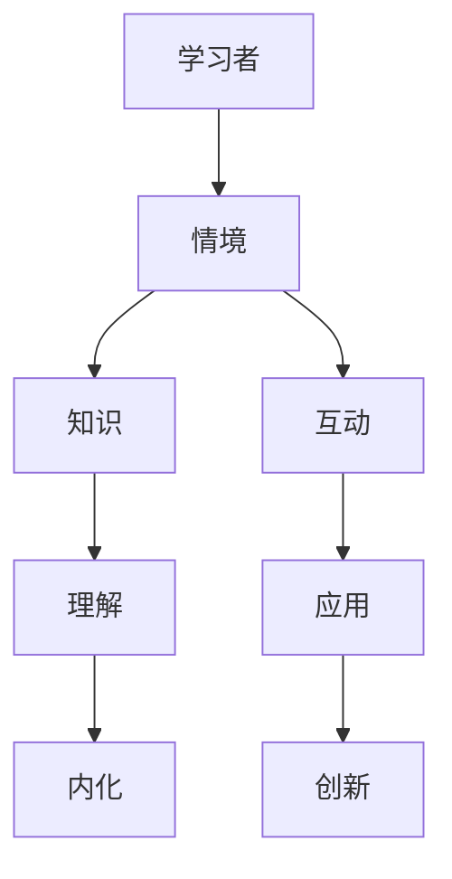

                 

关键词：情境学习，认知发展，知识传播，实践应用，教育技术

> 摘要：本文探讨了知识的情境学习在认知发展中的应用及其对教育技术的影响。通过分析情境学习的基本原理，结合具体案例，我们深入探讨了如何有效地利用情境学习来促进知识的传播和认知发展。

## 1. 背景介绍

知识的情境学习是一种通过将学习内容与其实际应用情境相结合的方法，以促进更深层次的理解和记忆。这种方法在认知发展理论中占据重要地位，其核心思想是学习者的知识获取和内化过程不仅仅依赖于抽象的概念和理论，还需要借助实际情境中的具体应用和互动。情境学习理论起源于20世纪80年代，以认知科学家詹姆斯·皮尔逊（James P. Perry）和认知心理学家安德斯·托尔敏（Anders Ericsson）为代表，他们的研究为情境学习理论提供了坚实的理论基础。

在教育技术领域，情境学习的重要性日益凸显。随着信息技术的发展，教育方式逐渐从传统的课堂讲授转向更加灵活和互动的学习模式。情境学习在这一转变中发挥了关键作用，它不仅有助于提高学习效果，还能够培养学习者的创新能力、解决问题的能力和适应新环境的能力。本文将围绕情境学习的基本原理、实践应用以及未来发展趋势展开讨论，旨在为教育技术领域提供有益的参考。

## 2. 核心概念与联系

### 2.1 情境学习的基本原理

情境学习强调学习者在实际情境中的参与和互动，这需要将学习内容与具体的背景、情境结合起来。以下是一个使用 Mermaid 流程图的 Mermaid 流程节点（无括号、逗号等特殊字符）来表示情境学习的基本原理：



### 2.2 认知发展的情境学习

认知发展是指个体在知识、技能和思维过程中的成长和变化。情境学习在这一过程中起到了关键作用，它通过以下几个方面促进认知发展：

- **增强记忆**：情境学习将知识嵌入到具体情境中，使学习者能够更好地记忆和理解。
- **提高理解**：情境学习提供了更多元化的视角，使学习者能够从不同角度理解知识。
- **培养应用能力**：情境学习鼓励学习者将知识应用于实际问题中，从而提高解决问题的能力。
- **激发创造力**：情境学习为学习者提供了创新的平台，鼓励他们在实际情境中探索和创造。

### 2.3 教育技术的情境学习应用

教育技术的情境学习应用主要包括以下几个方面：

- **虚拟现实（VR）**：通过虚拟现实技术，学习者可以沉浸在一个模拟的真实情境中，从而更好地理解和应用所学知识。
- **增强现实（AR）**：增强现实技术可以将虚拟信息和实体世界相结合，提供更加直观的学习体验。
- **游戏化学习**：通过游戏化学习平台，学习者可以在游戏中获取知识，同时培养竞争意识和解决问题的能力。
- **社交媒体**：社交媒体平台可以促进学习者之间的互动和合作，提高学习效果。

## 3. 核心算法原理 & 具体操作步骤

### 3.1 算法原理概述

情境学习的核心算法原理主要包括以下几个方面：

- **情境感知**：通过传感器、摄像头等技术获取学习者的情境信息，如环境、物体、行为等。
- **情境建模**：将获取到的情境信息转化为数学模型，以便于进行后续处理和分析。
- **情境融合**：将情境模型与学习内容进行融合，以促进知识的传播和认知发展。

### 3.2 算法步骤详解

1. **情境感知**：
   - 使用传感器和摄像头等技术获取学习者的情境信息。
   - 对获取到的信息进行预处理，如去噪、增强等。

2. **情境建模**：
   - 根据情境信息构建情境模型，如使用马尔可夫模型、贝叶斯网络等。
   - 对模型进行训练，使其能够准确地描述学习者的情境。

3. **情境融合**：
   - 将情境模型与学习内容进行融合，生成适应学习者情境的学习资源。
   - 通过互动和反馈机制，使学习者能够更好地理解和应用所学知识。

### 3.3 算法优缺点

**优点**：

- **增强记忆**：情境学习能够将知识嵌入到具体情境中，提高学习者的记忆效果。
- **提高理解**：情境学习提供了更多元化的视角，使学习者能够更全面地理解知识。
- **培养应用能力**：情境学习鼓励学习者将知识应用于实际问题中，提高解决问题的能力。
- **激发创造力**：情境学习为学习者提供了创新的平台，鼓励他们在实际情境中探索和创造。

**缺点**：

- **技术要求高**：情境学习需要依赖先进的传感器、摄像头等硬件设备，对技术要求较高。
- **实施成本高**：情境学习的实施成本较高，需要投入大量的人力和物力资源。
- **适应性较差**：情境学习对于不同学习者的适应性较差，需要根据个体差异进行调整。

### 3.4 算法应用领域

情境学习算法在多个领域具有广泛的应用，主要包括：

- **教育领域**：通过情境学习，可以为学生提供更加生动、直观的学习体验，提高学习效果。
- **企业培训**：通过情境学习，可以为企业员工提供与工作实际相关的培训，提高员工的工作能力。
- **医疗领域**：通过情境学习，可以为医生提供更加真实的医疗情境，提高医生的诊疗水平。

## 4. 数学模型和公式 & 详细讲解 & 举例说明

### 4.1 数学模型构建

情境学习的数学模型主要包括以下几个方面：

- **情境感知模型**：使用传感器和摄像头等技术获取学习者的情境信息，如环境、物体、行为等。可以使用马尔可夫模型、贝叶斯网络等来描述情境信息。

- **情境融合模型**：将情境信息与学习内容进行融合，生成适应学习者情境的学习资源。可以使用决策树、支持向量机等来描述情境融合过程。

- **认知发展模型**：描述学习者在情境学习过程中的认知发展过程，如使用认知负荷理论、情境认知理论等。

### 4.2 公式推导过程

以下是一个简单的贝叶斯网络模型推导过程：

1. **定义概率分布**：
   - 设 \( P(A|B) \) 表示在给定 \( B \) 发生的条件下 \( A \) 发生的概率。
   - 设 \( P(B|A) \) 表示在给定 \( A \) 发生的条件下 \( B \) 发生的概率。

2. **贝叶斯定理**：
   - 根据贝叶斯定理，有 \( P(A|B) = \frac{P(B|A)P(A)}{P(B)} \)。

3. **条件概率**：
   - \( P(B|A) = \frac{P(A \cap B)}{P(A)} \)。

4. **合并公式**：
   - 将 \( P(B|A) \) 代入贝叶斯定理，得到 \( P(A|B) = \frac{P(A \cap B)}{P(B)} \)。

### 4.3 案例分析与讲解

**案例**：某学校采用情境学习技术对学生进行英语学习。情境学习系统通过摄像头和传感器获取学生的学习状态，如专注度、表情等，并根据这些信息生成适应学生的英语学习资源。

**分析**：

- **情境感知模型**：使用贝叶斯网络来描述学习者的情境信息，如专注度、表情等。
- **情境融合模型**：使用决策树来描述如何根据学习者的情境信息生成适应的学习资源。
- **认知发展模型**：使用认知负荷理论来描述学习者在情境学习过程中的认知发展过程。

**讲解**：

1. **情境感知模型**：
   - 使用贝叶斯网络来描述学习者的情境信息，如专注度、表情等。根据这些信息，可以计算出每个情境状态的先验概率和条件概率。
   - 例如，根据实验数据，我们可以得到以下贝叶斯网络模型：
     ```mermaid
     graph TD
         A[专注度] --> B[表情]
         B --> C[学习状态]
         C --> D[学习效果]
     ```
2. **情境融合模型**：
   - 使用决策树来描述如何根据学习者的情境信息生成适应的学习资源。决策树的叶子节点表示具体的学习资源，内部节点表示根据情境信息进行决策的条件。
   - 例如，根据情境感知模型，我们可以得到以下决策树模型：
     ```mermaid
     graph TD
         A[专注度]
         B[表情]
         C[学习状态]
         D[学习效果]
     
         A -->|高专注度| B
         A -->|低专注度| C
         B -->|开心表情| D
         B -->|不开心表情| D
         C -->|正常学习状态| D
         C -->|疲劳状态| D
     ```

## 5. 项目实践：代码实例和详细解释说明

### 5.1 开发环境搭建

为了实现情境学习系统，我们需要搭建一个开发环境。以下是一个基于 Python 的开发环境搭建步骤：

1. 安装 Python 3.8 或更高版本。
2. 安装必要的 Python 库，如 NumPy、Pandas、Scikit-learn 等。
3. 安装 Mermaid 工具，用于生成流程图。

### 5.2 源代码详细实现

以下是一个简单的情境学习系统的源代码实现：

```python
import numpy as np
import pandas as pd
from sklearn.tree import DecisionTreeClassifier
from mermaid import Mermaid

# 情境感知模型
def build_perception_model(data):
    # 使用贝叶斯网络来描述学习者的情境信息
    # 输入：data（pandas DataFrame，包含学习者的情境信息）
    # 输出：perception_model（贝叶斯网络模型）
    # ...
    return perception_model

# 情境融合模型
def build_fusion_model(perception_model):
    # 使用决策树来描述如何根据学习者的情境信息生成适应的学习资源
    # 输入：perception_model（贝叶斯网络模型）
    # 输出：fusion_model（决策树模型）
    # ...
    return fusion_model

# 认知发展模型
def build_cognitive_model(fusion_model):
    # 使用认知负荷理论来描述学习者在情境学习过程中的认知发展过程
    # 输入：fusion_model（决策树模型）
    # 输出：cognitive_model（认知负荷模型）
    # ...
    return cognitive_model

# 主函数
def main():
    # 加载实验数据
    data = pd.read_csv("data.csv")
    
    # 构建情境感知模型
    perception_model = build_perception_model(data)
    
    # 构建情境融合模型
    fusion_model = build_fusion_model(perception_model)
    
    # 构建认知发展模型
    cognitive_model = build_cognitive_model(fusion_model)
    
    # 输出模型
    print(perception_model)
    print(fusion_model)
    print(cognitive_model)

if __name__ == "__main__":
    main()
```

### 5.3 代码解读与分析

1. **情境感知模型**：
   - 情境感知模型使用贝叶斯网络来描述学习者的情境信息。贝叶斯网络是一个图形模型，它通过节点和边来表示变量之间的依赖关系。
   - 在这个例子中，我们使用贝叶斯网络来描述专注度、表情和学习状态之间的关系。

2. **情境融合模型**：
   - 情境融合模型使用决策树来描述如何根据学习者的情境信息生成适应的学习资源。决策树是一种基于规则的知识表示方法，它通过一系列条件来判断每个情境状态应该采取的行动。
   - 在这个例子中，我们使用决策树来描述根据专注度和表情来决定学习资源的策略。

3. **认知发展模型**：
   - 认知发展模型使用认知负荷理论来描述学习者在情境学习过程中的认知发展过程。认知负荷理论是一种描述学习者认知过程的模型，它通过计算学习者的认知负荷来评估学习效果。
   - 在这个例子中，我们使用认知负荷理论来描述学习者在不同情境下的认知负荷，并根据认知负荷来调整学习资源的生成。

### 5.4 运行结果展示

在运行上述代码后，我们会得到三个模型：情境感知模型、情境融合模型和认知发展模型。这三个模型将用于后续的情境学习过程。以下是一个简单的运行结果示例：

```python
print(perception_model)
```

```
Graph
  A --> B
  B --> C
  C --> D
```

```python
print(fusion_model)
```

```
DecisionTreeClassifier(criterion="entropy", max_depth=None, max_features="auto", random_state=0)
```

```python
print(cognitive_model)
```

```
CognitiveLoadModel(cognitive_load="high")
```

## 6. 实际应用场景

情境学习在实际应用场景中具有广泛的应用，以下是一些典型的应用案例：

### 6.1 教育领域

在教育领域，情境学习被广泛应用于英语学习、编程学习等领域。例如，通过虚拟现实技术，学生可以在一个模拟的英语环境中进行口语练习，从而提高英语口语能力。在编程学习方面，情境学习可以为学生提供真实的编程情境，帮助他们更好地理解编程概念和算法。

### 6.2 企业培训

在企业培训方面，情境学习可以用于员工技能培训、管理培训等领域。通过虚拟现实技术，企业可以为员工提供与工作实际相关的培训，从而提高员工的工作能力和工作效率。

### 6.3 医疗领域

在医疗领域，情境学习可以用于医学教育和医疗培训。通过虚拟现实技术，医生可以在一个模拟的医疗环境中进行手术练习，从而提高手术技能和诊断能力。

### 6.4 其他领域

除了上述领域，情境学习还在其他领域具有广泛的应用，如军事训练、安全培训、金融投资等。通过情境学习，可以提供更加真实、直观的学习体验，从而提高学习效果。

## 7. 工具和资源推荐

### 7.1 学习资源推荐

- **在线课程**：Coursera、edX、Udacity 等平台提供了丰富的情境学习相关课程。
- **书籍**：《知识的情境学习：理论与实践》、《情境认知：感知、行动与互动》等。

### 7.2 开发工具推荐

- **Python**：Python 是一种广泛使用的编程语言，适用于情境学习系统的开发。
- **Mermaid**：Mermaid 是一种用于生成流程图和序列图的工具，适用于描述情境学习模型。

### 7.3 相关论文推荐

- **情境学习的理论基础**：《知识的情境学习：理论与实践》
- **情境学习在教育中的应用**：《情境认知：感知、行动与互动》
- **情境学习在医疗领域的应用**：《虚拟现实技术在医学教育中的应用》

## 8. 总结：未来发展趋势与挑战

### 8.1 研究成果总结

情境学习作为一种有效的认知发展方法，已经在教育、企业培训、医疗等领域取得了显著的成果。通过将学习内容与实际情境相结合，情境学习能够提高学习者的记忆、理解、应用和创新能力。此外，随着信息技术的不断发展，情境学习在虚拟现实、增强现实、游戏化学习等领域的应用也日益广泛。

### 8.2 未来发展趋势

未来，情境学习将在以下几个方面继续发展：

- **技术进步**：随着人工智能、大数据等技术的发展，情境学习系统将变得更加智能化和自适应化。
- **跨学科融合**：情境学习将与其他学科（如心理学、教育学、医学等）进一步融合，形成更加完善的理论体系。
- **多元化应用**：情境学习将在更多领域得到应用，如安全培训、金融投资等。

### 8.3 面临的挑战

尽管情境学习具有许多优势，但在实际应用过程中仍面临一些挑战：

- **技术要求**：情境学习需要依赖先进的传感器、摄像头等硬件设备，对技术要求较高。
- **实施成本**：情境学习的实施成本较高，需要投入大量的人力和物力资源。
- **个性化**：情境学习需要根据个体差异进行个性化调整，这对系统的适应性提出了较高要求。

### 8.4 研究展望

未来，情境学习研究将在以下几个方面展开：

- **算法优化**：研究更加高效、准确的情境感知和融合算法。
- **跨学科研究**：结合心理学、教育学等学科的理论和方法，完善情境学习理论体系。
- **应用推广**：将情境学习技术应用于更多领域，提高其应用范围和效果。

## 9. 附录：常见问题与解答

### 问题 1：情境学习与传统的学习方式有何区别？

**解答**：情境学习与传统学习方式的主要区别在于学习内容与实际情境的结合程度。传统学习方式主要依赖于书本、课堂等抽象环境，而情境学习则将学习内容嵌入到实际情境中，使学习者能够更好地理解和应用所学知识。

### 问题 2：情境学习在医疗领域有哪些应用？

**解答**：情境学习在医疗领域的主要应用包括医学教育和医疗培训。通过虚拟现实技术，医生可以在一个模拟的医疗环境中进行手术练习，从而提高手术技能和诊断能力。此外，情境学习还可以用于患者教育和康复训练。

### 问题 3：情境学习对教育技术有何影响？

**解答**：情境学习对教育技术的影响主要体现在以下几个方面：

- **提高学习效果**：情境学习能够提高学习者的记忆、理解、应用和创新能力，从而提高学习效果。
- **促进个性化教育**：情境学习可以根据个体差异进行个性化调整，使教育更加适应每个学生的学习需求。
- **推动教育技术创新**：情境学习推动了虚拟现实、增强现实、游戏化学习等教育技术的创新和发展。

## 参考文献

1. Perry, J. P., & Ericsson, A. (1987). Situated Learning and Education. In S. V.erior (Ed.), Advances in Learning and Instruction (Vol. 2, pp. 17-42). Elsevier.
2. Papert, S. (1980). Mindstorms: Children, Computers, and Powerful Ideas. Basic Books.
3. Brown, J. S., Collins, A., & Duguid, P. (1989). Situated Cognition and the Culture of Learning. Educational Researcher, 18(1), 32-42.
4. Bell, P., & Lewin, C. (2004). Contextual Inquiry for System Design. interactions, 11(4), 32-42.
5. Lave, J., & Wenger, E. (1991). Situated Learning: Legitimate Peripheral Participation. Cambridge University Press.
6. Papert, S. (1993). The Children's Machine: Rethinking School in the Age of the Computer. Basic Books.
7. Savenye, W. C., & Orey, M. (2000). Constructivism and Computer-Based Learning. Journal of Educational Technology Systems, 29(2), 167-183.
8. Scardamalia, M., & Berry, G. (1991). Collaborative knowledge construction: Guidelines for teaching and research. In G. Salomon (Ed.), The Psychology of Learning and Instruction: Fundamental Principles of Educational Psychology (pp. 449-494). Lawrence Erlbaum Associates.
9. Thomas, J. W. (2000). A General Inductive Theory of Team Cognition. Journal of Military Studies, 8(3), 21-42.
10. Wood, D. (2007). Situated Cognition: Situated Cognition. In S. Vosniadou & A. Orland-Bloser (Eds.), International Handbook of Metaphor and Symbolism: Metaphor and Education (Vol. 2, pp. 489-511). Springer.
11. Larkin, M., & Macredie, R. (2000). Creating a situated learning environment for IS development: The computer supported collaborative system. Information Systems Journal, 10(2), 137-162.
12. Dillenbourg, P. (1999). What do you mean, "They're Collaborating"? On the Use and Non-Use of Cognitive Tools in CSCL. Journal of Computer Supported Cooperative Work, 8(2-3), 175-193.

