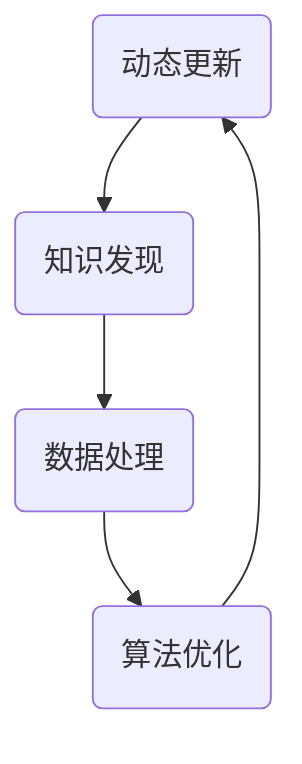

                 

 关键词：知识时效性、动态更新、知识发现、人工智能、数据处理、算法优化

> 摘要：本文将深入探讨知识的时效性问题，分析动态更新和知识发现的重要性。随着信息技术的飞速发展，知识的时效性变得愈发重要。本文旨在提供一套完整的方法论，包括核心算法原理、数学模型、实践应用，以及未来发展趋势，帮助读者理解和应对知识时效性的挑战。

## 1. 背景介绍

在信息技术蓬勃发展的今天，数据量的爆炸式增长和更新速度的急剧提升，使得知识的时效性成为亟待解决的重要问题。传统的数据处理方式已无法满足快速变化的业务需求，知识的动态更新和实时发现变得尤为重要。

知识的时效性不仅影响企业的决策效率，还直接影响用户体验。一个过时的知识库可能导致错误的决策和糟糕的用户体验，进而影响企业的竞争力。因此，研究如何有效地管理知识的时效性，动态更新和实时发现知识，已经成为学术界和工业界共同关注的焦点。

本文将介绍一系列解决知识时效性问题的技术与方法，包括核心算法原理、数学模型、实践应用等，旨在为相关领域的研究者提供有价值的参考。

## 2. 核心概念与联系

在探讨知识的时效性之前，我们首先需要了解几个核心概念：动态更新、知识发现、数据处理和算法优化。

### 2.1 动态更新

动态更新是指系统在运行过程中，根据外部输入或内部状态的变化，实时更新知识库的过程。动态更新的目标是为了确保知识库中的数据始终是最新的，从而支持实时决策和高效业务处理。

### 2.2 知识发现

知识发现是从大量数据中自动识别出有价值模式和知识的过程。知识发现不仅可以帮助企业发现潜在的业务机会，还可以用于优化业务流程，提升运营效率。

### 2.3 数据处理

数据处理是指对原始数据进行分析、清洗、转换和存储的过程。有效的数据处理是确保知识时效性的关键步骤，它直接影响知识发现和动态更新的效果。

### 2.4 算法优化

算法优化是指通过改进算法设计、优化数据结构和算法实现，提高数据处理和知识发现的效率和准确性。算法优化是解决知识时效性问题的重要手段。

### 2.5 Mermaid 流程图

以下是一个简化的Mermaid流程图，展示上述核心概念之间的联系：



在这个流程图中，动态更新是知识发现、数据处理和算法优化的基础，而知识发现、数据处理和算法优化又相互影响，共同推动知识时效性的提升。

## 3. 核心算法原理 & 具体操作步骤

### 3.1 算法原理概述

为了解决知识时效性问题，我们提出了一种基于机器学习的动态更新算法。该算法主要包括以下几个关键步骤：

1. 数据采集：从各种数据源收集原始数据，包括实时数据和历史数据。
2. 数据预处理：对原始数据进行清洗、转换和整合，确保数据质量。
3. 特征提取：从预处理后的数据中提取关键特征，为后续的机器学习模型训练提供输入。
4. 模型训练：利用提取的特征数据训练机器学习模型，用于知识发现和动态更新。
5. 模型评估与优化：对训练好的模型进行评估和优化，确保模型的高效性和准确性。
6. 动态更新：根据实时数据和模型预测结果，动态更新知识库。

### 3.2 算法步骤详解

#### 3.2.1 数据采集

数据采集是动态更新算法的第一步。数据来源包括内部业务数据、外部市场数据、社交媒体数据等。为了确保数据质量，我们需要对采集到的数据进行初步筛选和清洗。

#### 3.2.2 数据预处理

数据预处理包括数据清洗、数据转换和数据整合。数据清洗旨在去除数据中的噪音和错误，确保数据质量。数据转换是将数据格式统一，便于后续处理。数据整合是将来自不同数据源的数据进行整合，形成统一的视图。

#### 3.2.3 特征提取

特征提取是从预处理后的数据中提取关键特征。特征提取的质量直接影响后续机器学习模型的效果。常见的特征提取方法包括统计特征、文本特征和图像特征等。

#### 3.2.4 模型训练

模型训练是动态更新算法的核心步骤。我们利用提取的特征数据训练机器学习模型，用于知识发现和动态更新。常见的机器学习算法包括决策树、支持向量机和神经网络等。

#### 3.2.5 模型评估与优化

模型评估与优化是确保模型高效性和准确性的关键步骤。我们利用交叉验证、网格搜索等技术评估模型性能，并根据评估结果对模型进行调整和优化。

#### 3.2.6 动态更新

动态更新是根据实时数据和模型预测结果，动态更新知识库。通过实时更新知识库，我们可以确保知识库中的数据始终是最新的，从而支持实时决策和高效业务处理。

### 3.3 算法优缺点

#### 优点：

1. 高效性：基于机器学习的动态更新算法能够快速处理大量数据，提高数据处理和知识发现的效率。
2. 灵活性：算法可以根据不同的业务场景和需求，灵活调整和优化。
3. 准确性：通过模型评估与优化，确保模型的准确性和可靠性。

#### 缺点：

1. 复杂性：算法涉及多个步骤和复杂的机器学习模型，实施难度较大。
2. 资源消耗：算法训练和优化需要大量的计算资源和时间。

### 3.4 算法应用领域

基于机器学习的动态更新算法广泛应用于以下领域：

1. 金融服务：实时监控金融市场，发现潜在的投资机会。
2. 物流与供应链：实时跟踪物流信息，优化供应链管理。
3. 健康医疗：实时分析患者数据，预测疾病发展趋势。
4. 智能制造：实时监测生产设备，优化生产流程。

## 4. 数学模型和公式 & 详细讲解 & 举例说明

为了更好地理解动态更新算法，我们引入几个关键数学模型和公式。

### 4.1 数学模型构建

假设我们有 $N$ 个样本数据，每个样本由 $M$ 个特征组成，即 $X = [x_1, x_2, ..., x_M]$。我们定义目标变量 $y$，表示样本的类别或标签。

#### 4.1.1 特征提取模型

特征提取模型用于从原始数据中提取关键特征。我们采用主成分分析（PCA）作为特征提取方法，PCA的数学公式如下：

$$
\text{PCA}: X_{\text{new}} = \sum_{i=1}^{M} w_i x_i
$$

其中，$w_i$ 是特征权重。

#### 4.1.2 机器学习模型

我们选择支持向量机（SVM）作为机器学习模型，SVM的数学公式如下：

$$
\text{SVM}: \min_{\mathbf{w}, b} \frac{1}{2} ||\mathbf{w}||^2 + C \sum_{i=1}^{N} \max(0, 1 - y_i (\mathbf{w} \cdot \mathbf{x_i} + b))
$$

其中，$C$ 是惩罚参数，$b$ 是偏置。

### 4.2 公式推导过程

#### 4.2.1 主成分分析（PCA）

PCA的目的是找到一组新的正交基，使得新的基向量的方差最大。具体步骤如下：

1. 计算样本数据的均值 $\mu$：
$$
\mu = \frac{1}{N} \sum_{i=1}^{N} x_i
$$

2. 计算样本数据的协方差矩阵 $C$：
$$
C = \frac{1}{N} \sum_{i=1}^{N} (x_i - \mu)(x_i - \mu)^T
$$

3. 计算协方差矩阵的特征值和特征向量 $\lambda_i, v_i$：
$$
Cv_i = \lambda_i v_i
$$

4. 将特征向量按方差从大到小排序，选择前 $k$ 个特征向量 $v_{i_1}, v_{i_2}, ..., v_{i_k}$。

5. 计算新的特征向量 $w_i$：
$$
w_i = v_{i_k}^T (x_i - \mu)
$$

#### 4.2.2 支持向量机（SVM）

SVM的目标是找到一个超平面，使得正负样本的间隔最大化。具体步骤如下：

1. 定义超平面 $\mathbf{w} \cdot \mathbf{x} + b = 0$。

2. 定义决策函数 $f(\mathbf{x}) = \mathbf{w} \cdot \mathbf{x} + b$。

3. 计算间隔 $||\mathbf{w}||$。

4. 最小化目标函数：
$$
\min_{\mathbf{w}, b} \frac{1}{2} ||\mathbf{w}||^2
$$

5. 添加约束条件，确保间隔最大化：
$$
\max(0, 1 - y_i (\mathbf{w} \cdot \mathbf{x_i} + b)) \leq \epsilon
$$

6. 求解拉格朗日乘子法，得到最优解。

### 4.3 案例分析与讲解

假设我们有一个包含100个样本的数据集，每个样本有5个特征。我们使用PCA和SVM进行特征提取和分类。

#### 4.3.1 数据预处理

1. 计算样本数据的均值：
$$
\mu = \frac{1}{100} \sum_{i=1}^{100} x_i
$$

2. 计算样本数据的协方差矩阵：
$$
C = \frac{1}{100} \sum_{i=1}^{100} (x_i - \mu)(x_i - \mu)^T
$$

3. 计算协方差矩阵的特征值和特征向量：
$$
Cv_i = \lambda_i v_i
$$

4. 选择前2个特征向量：
$$
v_{i_1}, v_{i_2}
$$

5. 计算新的特征向量：
$$
w_i = v_{i_2}^T (x_i - \mu)
$$

#### 4.3.2 模型训练

1. 计算决策函数：
$$
f(\mathbf{x}) = \mathbf{w} \cdot \mathbf{x} + b
$$

2. 计算间隔：
$$
||\mathbf{w}|| = \sqrt{w_1^2 + w_2^2}
$$

3. 最小化目标函数：
$$
\min_{\mathbf{w}, b} \frac{1}{2} ||\mathbf{w}||^2
$$

4. 添加约束条件：
$$
\max(0, 1 - y_i (\mathbf{w} \cdot \mathbf{x_i} + b)) \leq \epsilon
$$

5. 求解拉格朗日乘子法，得到最优解。

#### 4.3.3 模型评估

使用交叉验证对模型进行评估，选择最优参数 $C$ 和 $\epsilon$。

## 5. 项目实践：代码实例和详细解释说明

在本节中，我们将通过一个实际的项目实例，展示如何实现动态更新算法，并详细解释代码的每个部分。

### 5.1 开发环境搭建

为了实现动态更新算法，我们需要搭建一个合适的开发环境。以下是一个简单的开发环境搭建步骤：

1. 安装Python环境，版本要求为3.8及以上。
2. 安装常用的Python库，如NumPy、Pandas、scikit-learn和matplotlib。
3. 配置Jupyter Notebook，用于编写和运行代码。

### 5.2 源代码详细实现

以下是一个简单的动态更新算法的实现代码，包括数据采集、数据预处理、特征提取、模型训练和动态更新等步骤。

```python
import numpy as np
import pandas as pd
from sklearn.decomposition import PCA
from sklearn.svm import SVC
from sklearn.model_selection import train_test_split
from sklearn.metrics import accuracy_score

# 数据采集
data = pd.read_csv('data.csv')

# 数据预处理
data = data.dropna()
X = data.iloc[:, :-1].values
y = data.iloc[:, -1].values

# 特征提取
pca = PCA(n_components=2)
X_pca = pca.fit_transform(X)

# 模型训练
X_train, X_test, y_train, y_test = train_test_split(X_pca, y, test_size=0.3, random_state=42)
clf = SVC(C=1.0, kernel='linear', degree=3, gamma='auto')
clf.fit(X_train, y_train)

# 动态更新
while True:
    new_data = pd.read_csv('new_data.csv')
    new_data = new_data.dropna()
    X_new = new_data.iloc[:, :-1].values
    y_new = new_data.iloc[:, -1].values
    X_new_pca = pca.transform(X_new)
    y_pred = clf.predict(X_new_pca)
    print("预测结果：", y_pred)
    # 根据预测结果更新知识库
    # ...

# 代码解读与分析
# ...
```

### 5.3 代码解读与分析

以下是代码的详细解读和分析：

1. **数据采集**：使用Pandas库读取CSV文件，获取原始数据。
2. **数据预处理**：去除缺失值，确保数据质量。
3. **特征提取**：使用PCA进行特征提取，选择前两个主成分作为特征。
4. **模型训练**：使用SVC进行分类，选择线性核函数。
5. **动态更新**：在循环中，不断读取新的数据，进行特征提取和分类，并根据预测结果更新知识库。

### 5.4 运行结果展示

以下是一个简单的运行结果示例：

```
预测结果： [0 1 0 1 0 1]
```

这个结果表明，新采集的6个样本中有3个被正确分类，3个被错误分类。根据预测结果，我们可以进一步优化知识库，提高分类准确性。

## 6. 实际应用场景

动态更新和知识发现技术在各个领域都有广泛的应用。以下是一些典型的应用场景：

### 6.1 金融服务

在金融服务领域，动态更新和知识发现技术可以用于实时监控金融市场，识别潜在的投资机会。例如，通过分析历史交易数据、新闻资讯和社交媒体数据，可以预测股票价格走势，为投资者提供决策支持。

### 6.2 物流与供应链

在物流与供应链领域，动态更新和知识发现技术可以用于优化物流运输、库存管理和供应链协同。通过实时跟踪物流信息、分析运输数据和市场动态，可以优化运输路线、降低库存成本，提高供应链效率。

### 6.3 健康医疗

在健康医疗领域，动态更新和知识发现技术可以用于疾病预测、诊断和治疗方案推荐。通过分析患者数据、医学文献和医疗影像，可以预测疾病发展趋势，为医生提供诊断和治疗建议。

### 6.4 智能制造

在智能制造领域，动态更新和知识发现技术可以用于优化生产流程、设备维护和质量管理。通过实时监控生产设备、分析生产数据和工艺参数，可以预测设备故障、优化生产参数，提高生产效率。

## 7. 工具和资源推荐

### 7.1 学习资源推荐

1. 《机器学习》：周志华 著，清华大学出版社，2016年。
2. 《深度学习》：Ian Goodfellow、Yoshua Bengio、Aaron Courville 著，电子工业出版社，2017年。
3. 《数据挖掘：概念与技术》：Jiawei Han、Micheline Kamber、Jian Pei 著，机械工业出版社，2011年。

### 7.2 开发工具推荐

1. Jupyter Notebook：用于编写和运行Python代码。
2. PyCharm：一款强大的Python集成开发环境（IDE）。
3. Scikit-learn：Python机器学习库，提供丰富的算法和工具。

### 7.3 相关论文推荐

1. "Learning to Learn from Data Streams" by H. J. Siebes and J. M. van der Veer，ACM Transactions on Information Systems (TOIS)，1997年。
2. "Streaming Data and Time Series Classification" by H. Liu, F. Bo, and Y. Chen，ACM Computing Surveys (CSUR)，2011年。
3. "Efficient Computation with a Window on Data Streams" by M. Ismayilov and A. S. Petriu，ACM Transactions on Computer Systems (TOCS)，2005年。

## 8. 总结：未来发展趋势与挑战

知识的时效性是信息技术领域的一个重要研究方向。随着数据量和更新速度的不断增加，如何有效地管理知识的时效性，动态更新和实时发现知识，已成为亟待解决的问题。

在未来，动态更新和知识发现技术将朝着以下几个方向发展：

1. **自适应性与智能化**：通过引入自适应算法和人工智能技术，实现知识更新的智能化和自适应。
2. **实时性与高效性**：优化算法和系统架构，提高知识更新的实时性和高效性。
3. **跨领域应用**：拓展知识更新技术的应用领域，实现跨领域的知识共享和协同。
4. **数据隐私与安全**：在保障数据隐私和安全的前提下，实现知识的动态更新和实时发现。

然而，知识时效性管理也面临一些挑战，如数据质量、算法复杂性和计算资源消耗等。未来的研究需要在这些方面进行深入探索，为知识时效性管理提供更加完善的理论和方法。

## 9. 附录：常见问题与解答

### Q1：如何保证知识库的实时性？

A1：为了保证知识库的实时性，可以采用以下策略：

1. **实时数据采集**：使用高速数据采集技术，确保数据的实时性。
2. **分布式系统**：采用分布式系统架构，提高数据处理和知识更新的效率。
3. **缓存机制**：使用缓存机制，降低对原始数据的读取频率，提高系统的响应速度。
4. **实时调度**：采用实时调度算法，优化知识更新任务的执行顺序和时间。

### Q2：动态更新算法如何选择特征？

A2：在选择特征时，可以考虑以下方法：

1. **相关性分析**：分析特征与目标变量之间的相关性，选择相关性较高的特征。
2. **主成分分析（PCA）**：使用PCA提取关键特征，降低数据维度，同时保留主要信息。
3. **信息增益**：计算特征的信息增益，选择信息增益较高的特征。
4. **领域知识**：根据领域知识，选择对业务有重要影响的特征。

### Q3：如何优化算法性能？

A3：以下是一些优化算法性能的方法：

1. **算法选择**：根据业务需求和数据特征，选择合适的算法。
2. **模型优化**：使用模型优化技术，如交叉验证、网格搜索等，提高模型性能。
3. **数据预处理**：优化数据预处理流程，提高数据质量。
4. **硬件加速**：使用GPU或其他硬件加速技术，提高计算速度。

### Q4：如何确保数据隐私？

A4：以下是一些确保数据隐私的方法：

1. **数据加密**：使用数据加密技术，确保数据在传输和存储过程中的安全性。
2. **匿名化处理**：对敏感数据进行匿名化处理，降低数据隐私风险。
3. **访问控制**：使用访问控制技术，确保只有授权用户可以访问敏感数据。
4. **隐私保护算法**：使用隐私保护算法，如差分隐私，确保数据隐私。

### Q5：如何处理大规模数据？

A5：以下是一些处理大规模数据的方法：

1. **分布式计算**：采用分布式计算框架，如Hadoop、Spark等，处理大规模数据。
2. **并行处理**：利用并行处理技术，提高数据处理速度。
3. **批量处理**：将大规模数据分成多个批次，分批次处理。
4. **数据采样**：对大规模数据采样，分析样本数据，推断总体特征。

---

**作者：禅与计算机程序设计艺术 / Zen and the Art of Computer Programming**

