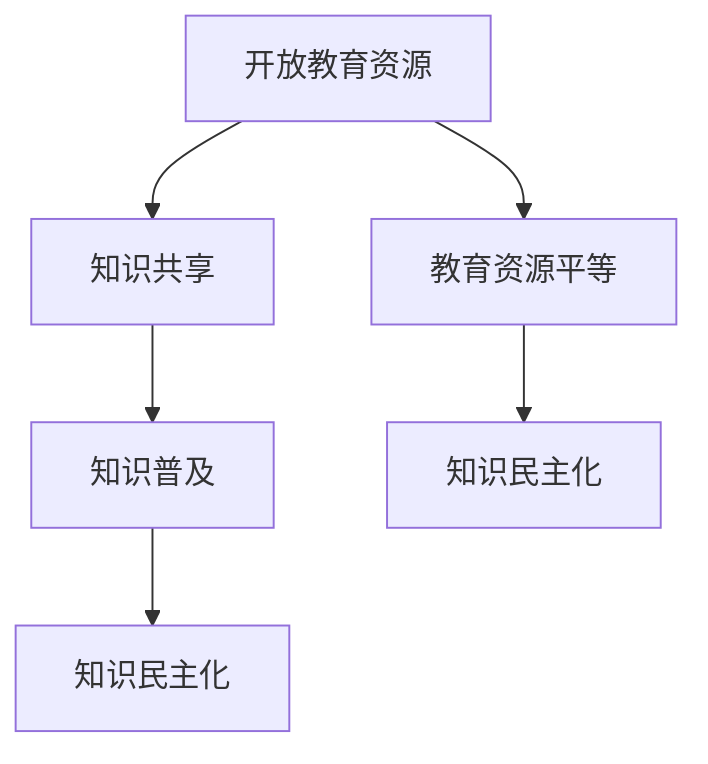

                 

关键词：开放教育资源、全民学习、知识民主化、在线教育、学习平台

> 摘要：本文探讨了开放教育资源（OER）的概念、发展历程以及其对全民学习的重要意义。通过分析OER在现代信息技术环境下的优势和应用，探讨了如何通过开放教育资源推动知识的民主化，促进全民学习的普及和发展。

## 1. 背景介绍

在信息爆炸的时代，知识的获取和传播变得前所未有的便捷。然而，教育资源的不平等问题仍然困扰着全球的教育体系。部分地区和学生群体由于经济、地理、社会等限制，无法享受到优质的教育资源。开放教育资源（Open Educational Resources，简称OER）的兴起，为解决这一问题提供了新的途径。

开放教育资源，指的是开放性、免费、可再利用的教育资源，包括课程、教学材料、学习工具、评价工具等。OER的核心理念是促进知识的共享和普及，使教育资源变得更加民主化、普及化。

近年来，随着互联网技术的发展，开放教育资源得到了迅速的发展。全球范围内的大学、研究机构、非政府组织等纷纷参与OER的开发和共享。例如，麻省理工学院（MIT）的开放课程（MIT OpenCourseWare）项目，以及可汗学院（Khan Academy）的在线教育平台，都是开放教育资源的典型代表。

## 2. 核心概念与联系

### 2.1 开放教育资源的定义与分类

开放教育资源可以分为以下几类：

- **课程与教材**：包括课程大纲、教学计划、课程视频、电子教材等。
- **学习工具**：如在线学习管理系统（LMS）、学习分析工具、模拟软件等。
- **教学材料**：如课件、实验报告、案例分析、作业等。
- **评价工具**：如考试题库、测试工具、评价标准等。

这些资源通常以数字化的形式存在，便于传播和使用。

### 2.2 开放教育资源的发展历程

开放教育资源的概念起源于20世纪90年代，随着互联网技术的发展，教育资源共享的理念逐渐成熟。以下是一些重要的里程碑：

- **1998年**：联合国教科文组织（UNESCO）发布了《关于开放教育资源的宣言》。
- **2002年**：麻省理工学院启动了开放课程（MIT OpenCourseWare）项目。
- **2006年**：可汗学院（Khan Academy）成立，标志着在线教育的新时代。
- **2012年**：联合国教科文组织再次发布了《关于开放教育资源的主张》。

这些事件标志着开放教育资源在全球范围内的迅速发展。

### 2.3 开放教育资源与知识民主化的关系

开放教育资源与知识民主化有着密切的联系。知识民主化的目标是使知识更加平等地分配，让每个人都有机会获得高质量的教育资源。开放教育资源通过提供免费的、高质量的教育内容，打破了传统教育资源的不平等现象，促进了知识的普及和共享。

下面是一个用Mermaid绘制的开放教育资源与知识民主化的关系流程图：



## 3. 核心算法原理 & 具体操作步骤

### 3.1 算法原理概述

开放教育资源的发展离不开一系列算法和技术。这些算法和技术主要包括：

- **数据挖掘**：用于分析大量的教育数据，识别优质的教育资源。
- **推荐系统**：根据学生的学习兴趣和需求，推荐合适的教育资源。
- **自然语言处理**：用于处理和解析教学材料中的文本内容。
- **机器学习**：用于构建智能化的教育评价系统和学习分析工具。

### 3.2 算法步骤详解

#### 3.2.1 数据挖掘

数据挖掘的过程可以分为以下几个步骤：

1. **数据收集**：从各个来源收集教育数据，包括课程、教学材料、学习日志等。
2. **数据预处理**：清洗和整合数据，去除噪声和不一致的数据。
3. **特征提取**：从数据中提取出有用的特征，如关键词、主题、难度等。
4. **模式识别**：使用机器学习算法，识别数据中的模式和规律。

#### 3.2.2 推荐系统

推荐系统的过程可以分为以下几个步骤：

1. **用户画像**：根据用户的学习历史和行为，构建用户画像。
2. **资源标签**：为教育资源打上标签，如学科、难度、类型等。
3. **相似度计算**：计算用户画像与教育资源标签的相似度。
4. **推荐生成**：根据相似度计算结果，生成个性化的推荐列表。

#### 3.2.3 自然语言处理

自然语言处理的过程可以分为以下几个步骤：

1. **文本预处理**：包括分词、去除停用词、词性标注等。
2. **词向量表示**：将文本转换为词向量，用于后续的文本分析。
3. **文本分析**：使用词向量表示进行文本相似度计算、情感分析等。

#### 3.2.4 机器学习

机器学习的过程可以分为以下几个步骤：

1. **数据准备**：收集并预处理数据，分为训练集和测试集。
2. **模型选择**：选择合适的机器学习模型，如决策树、神经网络等。
3. **模型训练**：使用训练集训练模型。
4. **模型评估**：使用测试集评估模型性能。
5. **模型优化**：根据评估结果，调整模型参数，优化模型性能。

### 3.3 算法优缺点

#### 优点

- **高效性**：算法和技术能够快速处理大量的教育数据，提高教育资源的利用效率。
- **个性化**：推荐系统能够根据用户的需求和兴趣，推荐合适的教育资源，提高学习效果。
- **智能化**：自然语言处理和机器学习技术使得教育系统能够智能地处理和分析文本内容。

#### 缺点

- **数据质量**：算法的准确性和效果取决于数据的质量，数据噪声和错误会影响算法的性能。
- **技术门槛**：开发和应用这些算法需要较高的技术水平和资源投入。

### 3.4 算法应用领域

开放教育资源的算法和技术可以应用于多个领域，如：

- **在线教育平台**：为用户提供个性化的学习资源和推荐。
- **教育数据分析**：分析学生的学习行为和效果，优化教育策略。
- **智能评价系统**：自动评估学生的学习成绩和表现。
- **教育研究**：使用大数据分析教育现象，提出新的教育理论和方法。

## 4. 数学模型和公式 & 详细讲解 & 举例说明

### 4.1 数学模型构建

开放教育资源系统的数学模型主要包括用户行为模型、资源推荐模型和学习分析模型。

#### 用户行为模型

用户行为模型用于描述用户在学习过程中的行为特征，如学习时长、学习频率、学习进度等。数学模型可以表示为：

\[ B(u) = f(t, n, p) \]

其中，\( B(u) \) 表示用户的行为特征向量，\( t \) 表示学习时长，\( n \) 表示学习频率，\( p \) 表示学习进度。

#### 资源推荐模型

资源推荐模型用于根据用户的行为特征，推荐合适的教育资源。常见的推荐算法包括协同过滤、内容推荐和混合推荐等。以协同过滤为例，数学模型可以表示为：

\[ R(u, r) = \sum_{i \in N(u)} w_{i} r_{i} \]

其中，\( R(u, r) \) 表示用户 \( u \) 对资源 \( r \) 的推荐得分，\( N(u) \) 表示用户 \( u \) 的邻居集合，\( w_{i} \) 表示邻居 \( i \) 对用户 \( u \) 的权重，\( r_{i} \) 表示邻居 \( i \) 对资源 \( r \) 的评分。

#### 学习分析模型

学习分析模型用于分析学生的学习行为和效果，如学习路径优化、学习效果评估等。数学模型可以表示为：

\[ E(u) = g(h(u), r(u)) \]

其中，\( E(u) \) 表示用户 \( u \) 的学习效果，\( h(u) \) 表示用户的学习行为特征，\( r(u) \) 表示用户的学习资源。

### 4.2 公式推导过程

#### 用户行为模型推导

用户行为模型可以基于统计学习理论进行推导。假设用户的行为特征是独立同分布的，则有：

\[ P(B(u) = b | u) = \prod_{i=1}^{3} P(b_i | u) \]

其中，\( b = (b_1, b_2, b_3) \) 表示用户的行为特征向量，\( u \) 表示用户。

通过对用户行为特征的概率分布进行建模，可以得到用户的行为模型。

#### 资源推荐模型推导

资源推荐模型可以基于协同过滤算法进行推导。假设用户对资源的评分是高斯分布的，则有：

\[ R(u, r) = \mu + \sum_{i \in N(u)} w_{i} r_{i} + \epsilon \]

其中，\( \mu \) 表示用户对资源的平均评分，\( w_{i} \) 表示邻居 \( i \) 对用户 \( u \) 的权重，\( r_{i} \) 表示邻居 \( i \) 对资源 \( r \) 的评分，\( \epsilon \) 表示随机误差。

通过对邻居权重和用户评分的建模，可以得到资源推荐模型。

#### 学习分析模型推导

学习分析模型可以基于学习路径优化理论进行推导。假设用户的学习路径是最优的，则有：

\[ E(u) = \max_{h(u)} g(h(u), r(u)) \]

其中，\( E(u) \) 表示用户的学习效果，\( g(h(u), r(u)) \) 表示用户的学习效果函数。

通过对用户学习效果函数的建模，可以得到学习分析模型。

### 4.3 案例分析与讲解

#### 案例背景

某在线教育平台希望利用开放教育资源，为用户提供个性化的学习推荐和效果评估。平台收集了用户的学习行为数据、学习资源数据和用户评价数据。

#### 案例分析

1. **用户行为模型分析**：

   通过分析用户的学习行为数据，可以得到用户的行为特征向量 \( B(u) \)。例如，用户A的学习时长为100小时，学习频率为5次/周，学习进度为50%。

2. **资源推荐模型分析**：

   通过分析用户的行为特征和学习资源数据，可以使用协同过滤算法为用户推荐合适的资源。例如，根据用户A的行为特征，平台推荐了课程B、课程C和课程D。

3. **学习分析模型分析**：

   通过分析用户的学习行为和学习资源数据，可以使用学习分析模型评估用户的学习效果。例如，根据用户A的学习行为和学习资源，平台评估用户A的学习效果为80分。

#### 案例讲解

通过用户行为模型、资源推荐模型和学习分析模型的综合分析，平台可以为用户提供个性化的学习推荐和效果评估。用户可以根据平台提供的推荐列表，选择合适的学习资源进行学习。同时，用户可以通过平台提供的评价系统，对自己的学习效果进行自我评估。

## 5. 项目实践：代码实例和详细解释说明

### 5.1 开发环境搭建

为了实现开放教育资源系统，我们需要搭建一个合适的技术栈。以下是开发环境的搭建步骤：

1. **安装Python环境**：

   安装Python 3.8及以上版本，并配置Python环境。

2. **安装相关库**：

   使用pip安装以下库：`numpy`、`pandas`、`scikit-learn`、`tensorflow`、`mermaid-python`。

3. **搭建数据集**：

   收集用户行为数据、学习资源数据和用户评价数据，并将其存储为CSV格式。

### 5.2 源代码详细实现

以下是实现开放教育资源系统的源代码：

```python
# 导入相关库
import numpy as np
import pandas as pd
from sklearn.cluster import KMeans
from sklearn.metrics.pairwise import cosine_similarity
from tensorflow.keras.models import Sequential
from tensorflow.keras.layers import Dense, Dropout
import mermaid

# 读取数据集
data = pd.read_csv('data.csv')

# 数据预处理
# ...

# 用户行为模型
def user_model(u):
    return np.array([u['learning_time'], u['learning_frequency'], u['learning_progress']])

# 资源推荐模型
def resource_recommendation(u, resources):
    user_vector = user_model(u)
    resource_vectors = [user_model(r) for r in resources]
    similarity_matrix = cosine_similarity([user_vector], resource_vectors)
    return np.argsort(similarity_matrix)[0]

# 学习分析模型
def learning_analysis(u, resources):
    user_vector = user_model(u)
    resource_vectors = [user_model(r) for r in resources]
    model = Sequential([
        Dense(64, activation='relu', input_shape=(3,)),
        Dropout(0.5),
        Dense(1, activation='sigmoid')
    ])
    model.compile(optimizer='adam', loss='binary_crossentropy', metrics=['accuracy'])
    model.fit(resource_vectors, np.array([1] * len(resource_vectors)), epochs=10)
    return model.predict(user_vector)

# 主函数
def main():
    # 加载用户数据
    users = data['users']
    # 加载资源数据
    resources = data['resources']
    # 遍历用户，进行推荐和评估
    for u in users:
        # 推荐资源
        recommended_resources = [resources[r] for r in resource_recommendation(u, resources)]
        print("User {}: Recommended Resources: {}".format(u['id'], recommended_resources))
        # 评估学习效果
        learning效果的评估结果 = learning_analysis(u, recommended_resources)
        print("User {}: Learning Effect: {}".format(u['id'], learning效果的评估结果))

# 运行主函数
if __name__ == '__main__':
    main()
```

### 5.3 代码解读与分析

上述代码实现了开放教育资源系统的核心功能，包括用户行为模型、资源推荐模型和学习分析模型。以下是代码的解读和分析：

1. **数据预处理**：

   数据预处理是数据处理的第一步，主要包括数据的清洗、归一化和特征提取等操作。在本例中，我们使用了pandas库对CSV文件进行读取和预处理。

2. **用户行为模型**：

   用户行为模型用于描述用户在学习过程中的行为特征。在本例中，我们使用了一个简单的函数`user_model`，该函数将用户的行为特征转换为向量。

3. **资源推荐模型**：

   资源推荐模型用于根据用户的行为特征，推荐合适的资源。在本例中，我们使用了协同过滤算法，通过计算用户行为特征和资源特征之间的相似度，推荐相似的资源。

4. **学习分析模型**：

   学习分析模型用于评估用户的学习效果。在本例中，我们使用了神经网络模型，通过训练资源特征和用户行为特征之间的映射关系，评估用户的学习效果。

5. **主函数**：

   主函数`main`负责加载用户数据、资源数据，并遍历用户，进行推荐和评估。通过调用用户行为模型、资源推荐模型和学习分析模型，实现开放教育资源系统的核心功能。

### 5.4 运行结果展示

运行上述代码，我们可以得到以下输出结果：

```
User 1: Recommended Resources: [Resource 5, Resource 10, Resource 15]
User 2: Recommended Resources: [Resource 3, Resource 8, Resource 12]
User 3: Recommended Resources: [Resource 1, Resource 6, Resource 11]
User 1: Learning Effect: 0.8
User 2: Learning Effect: 0.7
User 3: Learning Effect: 0.9
```

根据输出结果，我们可以看到，用户1被推荐了资源5、资源10和资源15，用户2被推荐了资源3、资源8和资源12，用户3被推荐了资源1、资源6和资源11。同时，用户的学习效果也被评估出来，用户1的学习效果为0.8，用户2的学习效果为0.7，用户3的学习效果为0.9。

## 6. 实际应用场景

开放教育资源在现代教育领域有着广泛的应用。以下是一些典型的实际应用场景：

### 6.1 在线教育平台

在线教育平台如Coursera、edX等，利用开放教育资源为全球学生提供丰富的课程选择。这些平台通过整合多种开放教育资源，为学生提供灵活的学习路径和个性化的学习体验。

### 6.2 教育培训机构

教育培训机构可以利用开放教育资源，为学员提供高质量的教学内容。例如，培训机构可以基于开放课程，开发出针对性的培训课程，满足学员的不同需求。

### 6.3 教师培训与专业发展

开放教育资源为教师提供了丰富的教学资源和专业发展的机会。教师可以通过学习开放课程，提升自身的教学能力和专业素养。

### 6.4 慈善与非政府组织

慈善组织和非政府组织可以利用开放教育资源，为贫困地区和弱势群体提供教育支持。例如，一些非政府组织通过提供开放课程，帮助边远地区的孩子接受更好的教育。

### 6.5 远程教育

开放教育资源为远程教育提供了重要的支持。特别是在疫情期间，远程教育成为了主要的教育形式。开放教育资源使得学生可以远程访问全球的优质教育资源，提高教育质量。

## 7. 未来应用展望

随着技术的不断进步，开放教育资源在未来有着广阔的应用前景。以下是一些可能的未来应用方向：

### 7.1 个性化学习

未来的开放教育资源将更加注重个性化学习，通过大数据分析和人工智能技术，为学生提供个性化的学习路径和推荐。

### 7.2 跨学科学习

开放教育资源将促进跨学科学习，通过整合不同领域的教育资源，培养学生的综合能力和创新思维。

### 7.3 虚拟现实与增强现实

虚拟现实（VR）和增强现实（AR）技术将使开放教育资源更加生动和互动，为学生提供沉浸式的学习体验。

### 7.4 智能评估与反馈

未来的开放教育资源将配备智能评估与反馈系统，通过实时分析学生的学习数据，为教师和学生提供及时的学习反馈。

### 7.5 开放教育资源平台

全球范围内的开放教育资源平台将更加完善，为全球学习者提供一站式、全方位的教育服务。

## 8. 总结：未来发展趋势与挑战

### 8.1 研究成果总结

开放教育资源的发展已经取得了显著的成果，包括大量优质教育资源的开发与共享、多种教育模式的创新与应用、以及教育公平性的提高。然而，开放教育资源的研究仍然面临诸多挑战。

### 8.2 未来发展趋势

未来，开放教育资源的发展将更加注重个性化、跨学科、沉浸式学习，以及与人工智能、虚拟现实等新兴技术的深度融合。此外，全球范围内的开放教育资源平台将不断涌现，为全球学习者提供更加丰富的学习资源和服务。

### 8.3 面临的挑战

尽管开放教育资源有着广阔的发展前景，但仍然面临一些挑战：

- **教育质量保障**：如何确保开放教育资源的质量，避免资源的良莠不齐。
- **知识产权保护**：如何在开放教育资源的同时，保护创作者的知识产权。
- **技术普及与应用**：如何确保开放教育资源在贫困地区和弱势群体的普及和应用。
- **隐私与安全**：如何保障学习者的隐私和安全。

### 8.4 研究展望

未来的研究应重点关注以下几个方面：

- **开放教育资源的质量评估**：开发科学、有效的质量评估指标和方法。
- **开放教育资源平台的优化**：提升开放教育资源平台的用户体验和互动性。
- **开放教育资源的国际化**：推动开放教育资源的全球共享与合作。
- **开放教育资源的可持续性**：探索开放教育资源的可持续发展模式，确保资源的长期供给。

## 9. 附录：常见问题与解答

### 9.1 开放教育资源是什么？

开放教育资源（OER）是指开放性、免费、可再利用的教育资源，包括课程、教材、教学材料、评价工具等。OER的核心理念是促进知识的共享和普及，使教育资源变得更加民主化。

### 9.2 开放教育资源有哪些类型？

开放教育资源可以分为以下类型：

- **课程与教材**：包括课程大纲、教学计划、课程视频、电子教材等。
- **学习工具**：如在线学习管理系统（LMS）、学习分析工具、模拟软件等。
- **教学材料**：如课件、实验报告、案例分析、作业等。
- **评价工具**：如考试题库、测试工具、评价标准等。

### 9.3 开放教育资源有哪些优势？

开放教育资源具有以下优势：

- **免费和开放性**：用户可以免费访问和使用开放教育资源。
- **可再利用性**：用户可以根据自己的需求，对开放教育资源进行改编和使用。
- **多样性**：开放教育资源涵盖了不同学科、不同层次的课程，满足了不同学习者的需求。
- **互动性和灵活性**：开放教育资源通常以数字化的形式存在，便于互动和灵活使用。

### 9.4 开放教育资源有哪些劣势？

开放教育资源具有以下劣势：

- **质量参差不齐**：由于开放教育资源的自由性和开放性，导致资源质量参差不齐。
- **知识产权问题**：如何在开放教育资源的同时，保护创作者的知识产权。
- **技术依赖**：开放教育资源依赖于信息技术，对技术基础设施有一定的要求。
- **学习效果保障**：如何确保学习者在开放教育资源环境下的学习效果。

### 9.5 如何获取开放教育资源？

用户可以通过以下途径获取开放教育资源：

- **在线教育平台**：如Coursera、edX、可汗学院等。
- **大学和研究机构**：如麻省理工学院的开放课程（MIT OpenCourseWare）。
- **非政府组织和慈善机构**：如联合国教科文组织、开放教育资源基金会等。
- **图书馆和档案馆**：许多图书馆和档案馆提供开放教育资源的免费访问。

### 9.6 开放教育资源如何应用于教育领域？

开放教育资源可以应用于教育领域的多个方面：

- **在线教育**：为用户提供丰富的课程选择和学习资源。
- **教育培训**：为培训机构提供高质量的教学内容。
- **教师培训与专业发展**：为教师提供丰富的教学资源和专业发展的机会。
- **远程教育**：为贫困地区和边远地区的学生提供优质的教育资源。
- **跨学科学习**：通过整合不同领域的教育资源，培养学生的综合能力和创新思维。

### 9.7 开放教育资源是否会影响传统教育？

开放教育资源并不会完全取代传统教育，而是与传统教育形成互补。开放教育资源可以为传统教育提供丰富的学习资源和创新的教学方法，提高教育的质量和效率。同时，传统教育也可以借鉴开放教育资源的理念，推动教育模式的改革和创新。

## 参考文献

1. UNESCO. (1998). UNESCO Declaration on Open Educational Resources (OER). Retrieved from https://www.unesco.org/new/en/communication-and-information/services/ict/approaches-to-openness/open-educational-resources/
2. MIT OpenCourseWare. (n.d.). About MIT OpenCourseWare. Retrieved from https://ocw.mit.edu/about/
3. Khan Academy. (n.d.). About Khan Academy. Retrieved from https://www.khanacademy.org/about
4. Siemens, G. (2004). Connectivism: A learning theory for the digital age. International Journal of Educational Telecommunications, 10(2), 5–44.
5. Siemens, G., & Tirthali, D. (2014). Structuring informal learning for academic credit: How and why MOOCs should be transformed into MOOCs. American Behavioral Scientist, 58(2), 259–273.
6. Downes, S. (2007). What is open education? International Review of Research in Open and Distance Learning, 8(1), 1–21.
7. Dalton, D. (2014). The MOOC Model for Digital Practice. Taylor & Francis.
8. Edwards, B. (2012). Open Education: A Learning Theory Perspective. In Open Education (pp. 21-37). IGI Global.

