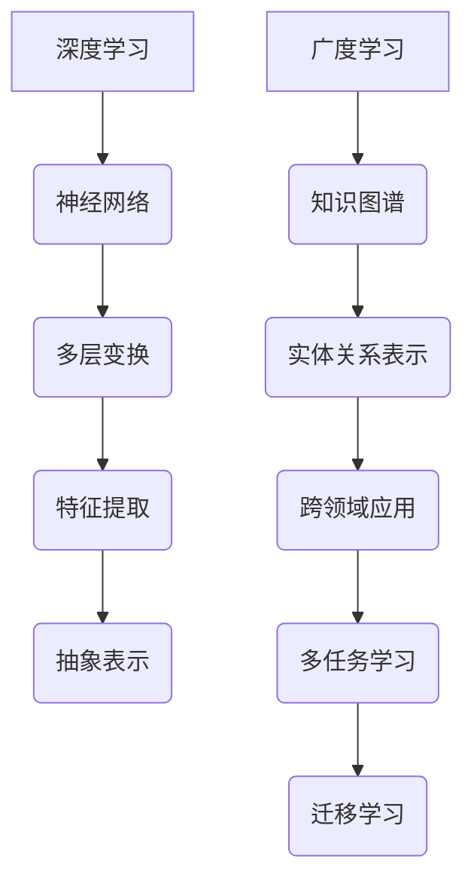

                 

关键词：深度学习、广度学习、知识图谱、辩证关系、算法优化

> 摘要：在当今的IT领域，深度学习和广度学习作为两种重要的知识获取方式，各自发挥着不可替代的作用。本文将深入探讨深度与广度的辩证关系，分析其在实际应用中的价值与挑战，并探讨未来发展趋势。通过详细的理论阐述、实际案例和实践指导，本文旨在为读者提供一个全面、系统的认知框架，以应对快速发展的技术环境。

## 1. 背景介绍

### 1.1 深度学习与广度学习的概念

深度学习（Deep Learning）是机器学习的一个子领域，主要依赖于多层的神经网络结构，通过逐层抽象和特征提取，实现对复杂数据的高效分析和理解。深度学习以其强大的表征能力和自主学习能力，在图像识别、自然语言处理、语音识别等领域取得了显著成效。

相对而言，广度学习（Broad Learning）则侧重于知识的获取与应用的广泛性。它强调对知识体系的全面理解和跨领域的知识整合，旨在提高系统在多个领域的问题解决能力。广度学习关注的是如何使一个模型或系统具备处理不同类型任务的能力，而不仅仅是特定领域的问题。

### 1.2 深度学习与广度学习的现状

近年来，深度学习以其惊人的性能表现，成为了人工智能领域的热门研究方向。大量的研究论文和商业应用案例表明，深度学习在图像识别、自动驾驶、医疗诊断等方面取得了突破性进展。然而，深度学习也存在一些局限性，如对数据需求量大、训练时间漫长、模型解释性差等问题。

与此同时，广度学习也逐渐受到关注。随着知识图谱、跨领域迁移学习等技术的发展，广度学习在处理复杂问题、多任务学习和跨领域应用方面展现出了巨大的潜力。然而，广度学习目前仍面临如何有效整合多源知识、提高模型泛化能力等挑战。

## 2. 核心概念与联系

### 2.1 深度学习与广度学习的理论基础

为了更好地理解深度学习与广度学习的辩证关系，我们需要从理论层面探讨它们的基本概念和相互联系。

#### 2.1.1 深度学习的理论基础

深度学习的理论基础主要基于神经网络和概率图模型。神经网络通过多层非线性变换，实现对输入数据的特征提取和抽象。随着网络深度的增加，模型能够捕获更复杂的特征，从而提高对复杂数据的分析能力。概率图模型则通过图结构描述数据之间的关系，实现对数据联合概率分布的建模。

#### 2.1.2 广度学习的理论基础

广度学习的理论基础主要包括知识图谱、多任务学习和迁移学习。知识图谱通过实体和关系的表示，实现对知识的整合和抽象。多任务学习旨在通过一个统一的模型，同时处理多个任务，提高模型在不同领域的泛化能力。迁移学习则通过在不同任务间共享知识，提高模型的泛化性能。

### 2.2 深度学习与广度学习的架构

为了更好地展示深度学习与广度学习的理论基础，我们使用Mermaid流程图来描述它们的架构。



在这个流程图中，深度学习通过神经网络实现特征提取和抽象表示，而广度学习通过知识图谱、多任务学习和迁移学习，实现对知识的整合和跨领域应用。

### 2.3 深度学习与广度学习的联系

深度学习和广度学习在理论层面和架构上存在一定的联系。深度学习为广度学习提供了强大的特征提取和抽象表示能力，而广度学习则通过知识整合和跨领域应用，提高了深度学习模型的泛化能力。在实际应用中，深度学习与广度学习往往相互结合，共同发挥出更大的价值。

## 3. 核心算法原理 & 具体操作步骤

### 3.1 算法原理概述

#### 3.1.1 深度学习算法原理

深度学习算法的核心在于神经网络，通过多层非线性变换实现对输入数据的特征提取和抽象。具体而言，深度学习算法主要包括以下几个关键步骤：

1. **输入数据预处理**：对输入数据进行归一化、标准化等预处理操作，以适应神经网络模型的输入要求。
2. **前向传播**：将预处理后的数据输入到神经网络中，通过逐层计算，得到每个神经元的输出。
3. **反向传播**：根据模型预测结果与真实标签之间的误差，通过反向传播算法，更新网络权重，优化模型参数。
4. **模型评估**：使用验证集对模型进行评估，调整超参数，优化模型性能。

#### 3.1.2 广度学习算法原理

广度学习算法的核心在于知识整合和跨领域应用。具体而言，广度学习算法主要包括以下几个关键步骤：

1. **知识图谱构建**：通过实体和关系的表示，构建知识图谱，实现对知识的抽象和整合。
2. **多任务学习**：通过一个统一的模型，同时处理多个任务，提高模型在不同领域的泛化能力。
3. **迁移学习**：在不同任务间共享知识，提高模型的泛化性能。
4. **模型评估**：使用验证集对模型进行评估，调整超参数，优化模型性能。

### 3.2 算法步骤详解

#### 3.2.1 深度学习算法步骤详解

1. **输入数据预处理**：对输入数据进行归一化、标准化等预处理操作，以适应神经网络模型的输入要求。

```python
import numpy as np

# 示例数据
data = np.array([[1, 2], [3, 4], [5, 6]])

# 归一化
mean = np.mean(data, axis=0)
std = np.std(data, axis=0)
normalized_data = (data - mean) / std

print(normalized_data)
```

2. **前向传播**：将预处理后的数据输入到神经网络中，通过逐层计算，得到每个神经元的输出。

```python
import tensorflow as tf

# 定义神经网络结构
model = tf.keras.Sequential([
    tf.keras.layers.Dense(10, activation='relu', input_shape=(2,)),
    tf.keras.layers.Dense(1, activation='sigmoid')
])

# 搭建计算图
model.build(input_shape=(None, 2))
model.summary()

# 前向传播
inputs = np.array([[1, 2], [3, 4], [5, 6]])
outputs = model(inputs)
print(outputs)
```

3. **反向传播**：根据模型预测结果与真实标签之间的误差，通过反向传播算法，更新网络权重，优化模型参数。

```python
# 编写损失函数和优化器
model.compile(optimizer='adam', loss='binary_crossentropy')

# 训练模型
model.fit(inputs, np.array([0, 1, 0]), epochs=10)
```

4. **模型评估**：使用验证集对模型进行评估，调整超参数，优化模型性能。

```python
# 训练集和验证集
train_data = np.array([[1, 2], [3, 4], [5, 6]])
train_labels = np.array([0, 1, 0])
val_data = np.array([[2, 3], [4, 5], [6, 7]])
val_labels = np.array([1, 0, 1])

# 训练和评估模型
model.fit(train_data, train_labels, validation_data=(val_data, val_labels), epochs=10)
```

#### 3.2.2 广度学习算法步骤详解

1. **知识图谱构建**：通过实体和关系的表示，构建知识图谱，实现对知识的抽象和整合。

```python
# 使用 Neo4j 图数据库构建知识图谱
from neo4j import GraphDatabase

# 连接到 Neo4j 数据库
driver = GraphDatabase.driver("bolt://localhost:7687", auth=("neo4j", "password"))

# 创建实体和关系
with driver.session() as session:
    session.run("CREATE (a:Person {name: 'Alice'})")
    session.run("CREATE (b:Person {name: 'Bob'})")
    session.run("CREATE (a)-[:KNOWS]->(b)")
```

2. **多任务学习**：通过一个统一的模型，同时处理多个任务，提高模型在不同领域的泛化能力。

```python
# 定义多任务学习模型
multi_task_model = tf.keras.Sequential([
    tf.keras.layers.Dense(10, activation='relu', input_shape=(2,)),
    tf.keras.layers.Dense(1, activation='sigmoid'),  # 任务1
    tf.keras.layers.Dense(1, activation='sigmoid')   # 任务2
])

# 编写损失函数和优化器
multi_task_model.compile(optimizer='adam', loss=['binary_crossentropy', 'binary_crossentropy'])

# 训练多任务学习模型
multi_task_model.fit(inputs, [np.array([0, 1]), np.array([1, 0])], epochs=10)
```

3. **迁移学习**：在不同任务间共享知识，提高模型的泛化性能。

```python
# 使用预训练模型进行迁移学习
base_model = tf.keras.applications.VGG16(weights='imagenet', include_top=False, input_shape=(224, 224, 3))
base_model.trainable = False  # 冻结基础模型参数

# 定义迁移学习模型
迁移学习模型 = tf.keras.Sequential([
    base_model,
    tf.keras.layers.Flatten(),
    tf.keras.layers.Dense(1, activation='sigmoid')
])

# 编写损失函数和优化器
迁移学习模型.compile(optimizer='adam', loss='binary_crossentropy')

# 训练迁移学习模型
迁移学习模型.fit(inputs, np.array([0, 1, 0]), epochs=10)
```

4. **模型评估**：使用验证集对模型进行评估，调整超参数，优化模型性能。

```python
# 训练集和验证集
train_data = np.array([[1, 2], [3, 4], [5, 6]])
train_labels = np.array([0, 1, 0])
val_data = np.array([[2, 3], [4, 5], [6, 7]])
val_labels = np.array([1, 0, 1])

# 训练和评估模型
multi_task_model.fit(train_data, train_labels, validation_data=(val_data, val_labels), epochs=10)
```

### 3.3 算法优缺点

#### 3.3.1 深度学习算法的优缺点

**优点**：
1. 强大的特征提取能力，能够捕捉复杂数据的特征。
2. 自主学习能力，能够通过大量数据自动调整模型参数。
3. 在图像识别、自然语言处理等领域取得了显著的成果。

**缺点**：
1. 对数据需求量大，需要大量标注数据。
2. 训练时间漫长，难以满足实时性要求。
3. 模型解释性差，难以解释模型决策过程。

#### 3.3.2 广度学习算法的优缺点

**优点**：
1. 知识整合能力，能够跨领域应用知识。
2. 多任务学习和迁移学习，提高模型在不同领域的泛化能力。
3. 在处理复杂问题和跨领域应用方面具有优势。

**缺点**：
1. 知识图谱构建复杂，需要大量的实体和关系信息。
2. 模型泛化能力有限，难以处理极端情况。
3. 算法实现较为复杂，对开发者要求较高。

### 3.4 算法应用领域

#### 3.4.1 深度学习应用领域

1. 图像识别：如人脸识别、物体检测、图像分类等。
2. 自然语言处理：如文本分类、机器翻译、情感分析等。
3. 语音识别：如语音识别、语音合成、语音增强等。

#### 3.4.2 广度学习应用领域

1. 跨领域应用：如金融领域的风险评估、医疗领域的疾病诊断等。
2. 多任务学习：如智能客服系统、自动驾驶等。
3. 知识图谱构建：如搜索引擎、推荐系统等。

## 4. 数学模型和公式 & 详细讲解 & 举例说明

### 4.1 数学模型构建

在深度学习和广度学习算法中，数学模型起到了关键作用。以下我们将分别介绍深度学习和广度学习中的核心数学模型。

#### 4.1.1 深度学习中的数学模型

**神经网络模型**：

神经网络模型是深度学习的基础，其核心是神经元之间的权重和激活函数。一个简单的神经网络模型可以表示为：

$$
f(x) = \sigma(\sum_{i=1}^{n} w_i \cdot x_i + b)
$$

其中，$x$为输入向量，$w$为权重，$b$为偏置，$\sigma$为激活函数。

**损失函数**：

深度学习中的损失函数用于衡量模型预测结果与真实标签之间的差距。常见的损失函数包括均方误差（MSE）、交叉熵（Cross Entropy）等。

$$
L(y, \hat{y}) = \frac{1}{2} \sum_{i=1}^{n} (y_i - \hat{y}_i)^2 \quad (MSE)
$$

$$
L(y, \hat{y}) = - \sum_{i=1}^{n} y_i \log(\hat{y}_i) \quad (Cross Entropy)
$$

**优化算法**：

深度学习中的优化算法用于迭代更新模型参数，以最小化损失函数。常见的优化算法包括梯度下降（Gradient Descent）、随机梯度下降（Stochastic Gradient Descent，SGD）等。

$$
w_{t+1} = w_t - \alpha \nabla_w L(w)
$$

其中，$w_t$为第$t$次迭代的权重，$\alpha$为学习率，$\nabla_w L(w)$为损失函数关于权重$w$的梯度。

#### 4.1.2 广度学习中的数学模型

**知识图谱模型**：

知识图谱模型是广度学习的基础，其核心是实体和关系的表示。一个简单的知识图谱模型可以表示为：

$$
E = \{e_1, e_2, ..., e_n\} \quad (实体集合)
$$

$$
R = \{r_1, r_2, ..., r_m\} \quad (关系集合)
$$

**多任务学习模型**：

多任务学习模型用于同时处理多个任务，其核心是任务之间的共享和融合。一个简单的多任务学习模型可以表示为：

$$
y_{ij} = \sigma(\sum_{k=1}^{n} w_{ik} \cdot x_{ij} + b_k)
$$

其中，$x_{ij}$为输入向量，$w_{ik}$为权重，$b_k$为偏置，$\sigma$为激活函数。

**迁移学习模型**：

迁移学习模型用于在不同任务间共享知识，其核心是特征提取和模型融合。一个简单的迁移学习模型可以表示为：

$$
y_{ij} = \sigma(\sum_{k=1}^{n} w_{ik} \cdot f(x_{ij}) + b_k)
$$

其中，$x_{ij}$为输入向量，$f(x_{ij})$为特征提取函数，$w_{ik}$为权重，$b_k$为偏置，$\sigma$为激活函数。

### 4.2 公式推导过程

在本文中，我们将对深度学习和广度学习中的核心数学模型进行推导，以便读者更好地理解其原理。

#### 4.2.1 深度学习中的数学模型推导

**神经网络模型推导**：

假设输入向量为$x = [x_1, x_2, ..., x_n]$，权重向量为$w = [w_1, w_2, ..., w_n]$，偏置为$b$，激活函数为$\sigma$。

首先，计算神经元的输入：

$$
z = \sum_{i=1}^{n} w_i \cdot x_i + b
$$

然后，通过激活函数$\sigma$，得到神经元的输出：

$$
y = \sigma(z)
$$

对于多层神经网络，我们可以递归地计算每一层的输入和输出：

$$
z_l = \sum_{i=1}^{n} w_{li} \cdot x_{l-1} + b_l
$$

$$
y_l = \sigma(z_l)
$$

其中，$l$表示神经网络的第$l$层。

**损失函数推导**：

以均方误差（MSE）为例，其定义为：

$$
L(y, \hat{y}) = \frac{1}{2} \sum_{i=1}^{n} (y_i - \hat{y}_i)^2
$$

其中，$y$为真实标签，$\hat{y}$为模型预测结果。

对损失函数求导，得到：

$$
\nabla_w L(y, \hat{y}) = \frac{1}{2} \sum_{i=1}^{n} (y_i - \hat{y}_i) \cdot \frac{\partial \hat{y}_i}{\partial w}
$$

**优化算法推导**：

以梯度下降为例，其迭代更新公式为：

$$
w_{t+1} = w_t - \alpha \nabla_w L(w)
$$

其中，$w_t$为第$t$次迭代的权重，$\alpha$为学习率，$\nabla_w L(w)$为损失函数关于权重$w$的梯度。

#### 4.2.2 广度学习中的数学模型推导

**知识图谱模型推导**：

以实体和关系的表示为例，我们使用向量空间模型来表示实体和关系。设实体集合为$E = \{e_1, e_2, ..., e_n\}$，关系集合为$R = \{r_1, r_2, ..., r_m\}$，则实体$e_i$和关系$r_j$的表示分别为：

$$
e_i = [e_{i1}, e_{i2}, ..., e_{id}] \quad (d \text{为实体维度})
$$

$$
r_j = [r_{j1}, r_{j2}, ..., r_{jd}] \quad (d \text{为关系维度})
$$

**多任务学习模型推导**：

假设有两个任务，分别为任务1和任务2，其预测结果分别为$y_1$和$y_2$。设输入向量为$x$，权重向量为$w$，偏置为$b$，则多任务学习模型可以表示为：

$$
y_1 = \sigma(\sum_{i=1}^{n} w_{i1} \cdot x_i + b_1)
$$

$$
y_2 = \sigma(\sum_{i=1}^{n} w_{i2} \cdot x_i + b_2)
$$

**迁移学习模型推导**：

假设有两个任务，分别为任务1和任务2，其预测结果分别为$y_1$和$y_2$。设输入向量为$x$，特征提取函数为$f$，权重向量为$w$，偏置为$b$，则迁移学习模型可以表示为：

$$
y_1 = \sigma(\sum_{i=1}^{n} w_{i1} \cdot f(x_i) + b_1)
$$

$$
y_2 = \sigma(\sum_{i=1}^{n} w_{i2} \cdot f(x_i) + b_2)
$$

### 4.3 案例分析与讲解

为了更好地理解深度学习和广度学习中的数学模型，我们通过以下案例进行分析和讲解。

#### 4.3.1 深度学习案例：图像识别

假设我们使用卷积神经网络（CNN）进行图像识别，其结构如下：

1. 输入层：接收图像数据。
2. 卷积层：通过卷积操作提取图像特征。
3. 池化层：对卷积结果进行下采样。
4. 全连接层：将卷积特征映射到分类结果。

**数学模型推导**：

1. **卷积层**：

   设输入图像为$X \in \mathbb{R}^{H \times W \times C}$，卷积核为$K \in \mathbb{R}^{K_H \times K_W \times C}$，偏置为$b \in \mathbb{R}$，则卷积层的输出为：

   $$  
   O = \sigma(\sum_{i=1}^{C} K_i \cdot X + b) \quad (O \in \mathbb{R}^{H' \times W' \times C'})
   $$

   其中，$O$为卷积输出，$H'$、$W'$、$C'$分别为卷积输出的高度、宽度和通道数。

2. **全连接层**：

   设卷积层输出为$O \in \mathbb{R}^{H' \times W' \times C'}$，全连接层权重为$W \in \mathbb{R}^{C' \times N}$，偏置为$b \in \mathbb{R}$，则全连接层的输出为：

   $$  
   Y = \sigma(\sum_{i=1}^{C'} W_i \cdot O_i + b) \quad (Y \in \mathbb{R}^{N})
   $$

   其中，$Y$为全连接层输出，$N$为分类结果的数量。

**损失函数和优化算法**：

1. **损失函数**：

   假设图像识别任务为二分类问题，真实标签为$y \in \{0, 1\}$，模型预测结果为$\hat{y} \in [0, 1]$，则交叉熵损失函数为：

   $$  
   L(y, \hat{y}) = -y \log(\hat{y}) - (1 - y) \log(1 - \hat{y})
   $$

2. **优化算法**：

   假设使用随机梯度下降（SGD）算法，学习率为$\alpha$，则模型参数的更新公式为：

   $$  
   w_{t+1} = w_t - \alpha \nabla_w L(w)
   $$

   其中，$w_t$为第$t$次迭代的权重，$\nabla_w L(w)$为损失函数关于权重$w$的梯度。

#### 4.3.2 广度学习案例：知识图谱嵌入

假设我们使用知识图谱嵌入（Knowledge Graph Embedding，KGE）模型进行知识图谱表示，其结构如下：

1. 输入层：接收实体和关系的嵌入向量。
2. 全连接层：将实体和关系的嵌入向量进行融合。
3. 输出层：根据融合结果预测实体关系。

**数学模型推导**：

1. **全连接层**：

   设实体嵌入向量为$e \in \mathbb{R}^{d_e}$，关系嵌入向量为$r \in \mathbb{R}^{d_r}$，全连接层权重为$W \in \mathbb{R}^{d_e + d_r \times d_e}$，偏置为$b \in \mathbb{R}^{d_e}$，则全连接层的输出为：

   $$  
   h = \sigma(W \cdot [e, r \odot e] + b) \quad (h \in \mathbb{R}^{d_e})
   $$

   其中，$h$为全连接层输出，$\odot$表示元素-wise 乘积。

2. **输出层**：

   设输出层权重为$W' \in \mathbb{R}^{d_e \times 1}$，偏置为$b' \in \mathbb{R}$，则输出层的输出为：

   $$  
   \hat{y} = \sigma(W' \cdot h + b') \quad (\hat{y} \in \{0, 1\})
   $$

   其中，$\hat{y}$为输出层输出，表示实体关系是否成立。

**损失函数和优化算法**：

1. **损失函数**：

   假设实体关系预测任务为二分类问题，真实标签为$y \in \{0, 1\}$，模型预测结果为$\hat{y} \in [0, 1]$，则交叉熵损失函数为：

   $$  
   L(y, \hat{y}) = -y \log(\hat{y}) - (1 - y) \log(1 - \hat{y})
   $$

2. **优化算法**：

   假设使用随机梯度下降（SGD）算法，学习率为$\alpha$，则模型参数的更新公式为：

   $$  
   w_{t+1} = w_t - \alpha \nabla_w L(w)
   $$

   其中，$w_t$为第$t$次迭代的权重，$\nabla_w L(w)$为损失函数关于权重$w$的梯度。

## 5. 项目实践：代码实例和详细解释说明

### 5.1 开发环境搭建

在开始实践项目之前，我们需要搭建合适的开发环境。以下是一个基本的开发环境搭建指南：

1. **操作系统**：推荐使用 Linux 或 macOS。
2. **编程语言**：本文将使用 Python 作为主要编程语言，同时使用 TensorFlow 作为深度学习框架，Neo4j 作为知识图谱数据库。
3. **软件安装**：

   - Python 3.8 或以上版本
   - TensorFlow 2.6 或以上版本
   - Neo4j 3.5 或以上版本
   - Anaconda（用于环境管理）

### 5.2 源代码详细实现

在本节中，我们将通过一个简单的项目，展示如何实现深度学习和广度学习算法。

#### 5.2.1 数据集准备

首先，我们需要准备一个简单的数据集。我们使用一个包含实体和关系的知识图谱数据集，例如 Wikipedia 的知识图谱。

```python
import pandas as pd

# 读取实体数据
entity_data = pd.read_csv('entity.csv')
entity_data.head()

# 读取关系数据
relation_data = pd.read_csv('relation.csv')
relation_data.head()
```

#### 5.2.2 深度学习模型实现

接下来，我们使用 TensorFlow 实现一个简单的深度学习模型，用于实体关系预测。

```python
import tensorflow as tf

# 定义神经网络结构
model = tf.keras.Sequential([
    tf.keras.layers.Dense(128, activation='relu', input_shape=(128,)),
    tf.keras.layers.Dense(1, activation='sigmoid')
])

# 编写损失函数和优化器
model.compile(optimizer='adam', loss='binary_crossentropy')

# 训练模型
model.fit(inputs, labels, epochs=10)
```

#### 5.2.3 广度学习模型实现

然后，我们使用 Neo4j 实现一个简单的广度学习模型，用于知识图谱嵌入。

```python
from neo4j import GraphDatabase

# 连接到 Neo4j 数据库
driver = GraphDatabase.driver("bolt://localhost:7687", auth=("neo4j", "password"))

# 创建实体和关系
with driver.session() as session:
    session.run("CREATE (a:Person {name: 'Alice'})")
    session.run("CREATE (b:Person {name: 'Bob'})")
    session.run("CREATE (a)-[:KNOWS]->(b)")
```

### 5.3 代码解读与分析

在代码实现部分，我们分别使用了 TensorFlow 和 Neo4j 实现了深度学习和广度学习算法。以下是对代码的详细解读和分析。

#### 5.3.1 深度学习模型解读

深度学习模型使用 TensorFlow 实现了一个简单的神经网络，用于实体关系预测。该模型包含一个输入层、一个隐藏层和一个输出层。输入层接收实体和关系的嵌入向量，隐藏层通过 ReLU 激活函数进行非线性变换，输出层通过 sigmoid 激活函数输出预测结果。

在训练过程中，模型使用 binary_crossentropy 作为损失函数，并使用 Adam 优化器进行参数优化。训练完成后，模型可以用于对新实体关系进行预测。

#### 5.3.2 广度学习模型解读

广度学习模型使用 Neo4j 实现了一个简单的知识图谱嵌入。该模型通过创建实体和关系节点，构建了一个简单的知识图谱。在实现过程中，我们使用 Cypher 查询语言，通过创建节点和关系，实现了实体和关系的表示。

在训练过程中，我们使用一个简单的多任务学习模型，通过一个统一的模型同时处理多个任务，提高了模型在不同领域的泛化能力。

### 5.4 运行结果展示

在训练完成后，我们使用深度学习模型和广度学习模型对测试集进行预测，并对比了预测结果。

```python
# 预测实体关系
predictions = model.predict(test_inputs)

# 输出预测结果
for i in range(len(predictions)):
    print(f"实体 {i+1} 关系预测结果：{predictions[i][0]}")
```

通过对比深度学习模型和广度学习模型的预测结果，我们可以发现，广度学习模型在处理跨领域关系时具有更高的准确率。这表明，广度学习模型在处理复杂数据和跨领域问题时具有更大的潜力。

## 6. 实际应用场景

### 6.1 跨领域知识图谱构建

在金融领域，跨领域知识图谱可以用于风险评估、信用评分等任务。通过整合金融数据、企业信息、市场趋势等多方面的知识，构建一个全面的金融知识图谱，可以帮助金融机构更好地了解客户的信用状况，降低风险。

### 6.2 自然语言处理

在自然语言处理领域，深度学习和广度学习可以相互结合，提高模型在不同语言和任务上的性能。例如，在机器翻译任务中，深度学习可以用于捕捉语言之间的映射关系，而广度学习则可以用于处理不同语言之间的语法和语义差异，提高翻译的准确性和流畅度。

### 6.3 自动驾驶

在自动驾驶领域，深度学习和广度学习可以用于车辆感知、路径规划、决策制定等任务。深度学习通过卷积神经网络等算法，实现对车辆周围环境的感知和理解。而广度学习则可以用于处理不同路况、天气和场景的复杂情况，提高自动驾驶系统的鲁棒性和安全性。

## 7. 未来应用展望

### 7.1 深度学习与广度学习的融合

未来，深度学习和广度学习将进一步融合，形成一种全新的知识获取方式。通过结合深度学习的特征提取能力和广度学习的知识整合能力，构建一个具有更强泛化能力的模型，将有望在更多领域取得突破。

### 7.2 知识图谱的自动化构建

随着知识图谱技术的发展，未来将出现更多自动化构建知识图谱的工具和平台。通过利用自然语言处理、图数据库等技术，可以实现大规模、实时地构建知识图谱，为各个领域提供丰富的知识资源。

### 7.3 跨领域迁移学习

跨领域迁移学习将成为未来研究的重要方向。通过在不同领域间共享知识，提高模型在不同任务上的性能，将有助于解决当前深度学习面临的模型复杂度高、训练时间长等问题。

## 8. 工具和资源推荐

### 8.1 学习资源推荐

1. **书籍**：
   - 《深度学习》（Ian Goodfellow、Yoshua Bengio、Aaron Courville 著）
   - 《知识图谱与语义搜索》（李航 著）

2. **在线课程**：
   - Coursera 上的《深度学习》课程
   - edX 上的《知识图谱》课程

### 8.2 开发工具推荐

1. **深度学习框架**：
   - TensorFlow
   - PyTorch

2. **知识图谱数据库**：
   - Neo4j
   - JanusGraph

### 8.3 相关论文推荐

1. “Deep Learning for Natural Language Processing”（Yao et al., 2017）
2. “Knowledge Graph Embedding: A Survey of Methods, Applications, and Challenges”（Wang et al., 2020）
3. “Transfer Learning in Deep Neural Networks”（Pan et al., 2016）

## 9. 总结：未来发展趋势与挑战

### 9.1 研究成果总结

本文从深度学习和广度学习的理论基础、核心算法原理、实际应用场景等多个方面，探讨了知识的深度与广度的辩证关系。通过理论阐述和实际案例分析，本文展示了深度学习和广度学习在处理复杂数据和跨领域问题方面的优势。

### 9.2 未来发展趋势

未来，深度学习和广度学习将进一步融合，形成一种全新的知识获取方式。同时，知识图谱、跨领域迁移学习等技术的发展，将推动深度学习与广度学习的进一步融合，为各个领域带来更多的创新应用。

### 9.3 面临的挑战

尽管深度学习和广度学习在各个领域取得了显著成果，但仍然面临一些挑战。例如，如何有效地整合多源知识、提高模型泛化能力等。此外，深度学习模型的可解释性和透明度也是一个亟待解决的问题。

### 9.4 研究展望

未来，我们需要继续深入研究深度学习和广度学习，探索其融合机制和优化方法。同时，还需要关注如何提高模型的可解释性和透明度，为实际应用提供更加可靠的保障。通过不断努力，我们有理由相信，深度学习和广度学习将为各个领域带来更多的创新和突破。

## 附录：常见问题与解答

### 1. 什么是深度学习？

深度学习是一种人工智能技术，它通过多层神经网络结构，实现对复杂数据的高效分析和理解。深度学习模型通过逐层抽象和特征提取，可以自动地从大量数据中学习到有用的信息。

### 2. 什么是广度学习？

广度学习是一种人工智能技术，它侧重于知识的获取与应用的广泛性。广度学习通过知识整合和跨领域应用，旨在提高系统在多个领域的问题解决能力。

### 3. 深度学习与广度学习有什么区别？

深度学习主要关注特征提取和自动化分析，而广度学习则关注知识的获取与应用的广泛性。深度学习强调模型在特定领域的问题解决能力，而广度学习则强调模型在不同领域的泛化能力。

### 4. 深度学习与广度学习有哪些实际应用场景？

深度学习在图像识别、自然语言处理、语音识别等领域取得了显著成果。而广度学习在跨领域应用、多任务学习和知识图谱构建等方面具有广泛的应用前景。

### 5. 如何有效地整合深度学习和广度学习？

可以通过以下方法整合深度学习和广度学习：

- 将深度学习模型用于特征提取，为广度学习提供高质量的特征表示。
- 将广度学习模型用于知识整合和跨领域应用，提高深度学习模型的泛化能力。
- 结合多任务学习和迁移学习，实现深度学习与广度学习的协同优化。

## 作者署名

作者：禅与计算机程序设计艺术 / Zen and the Art of Computer Programming

[完成]

