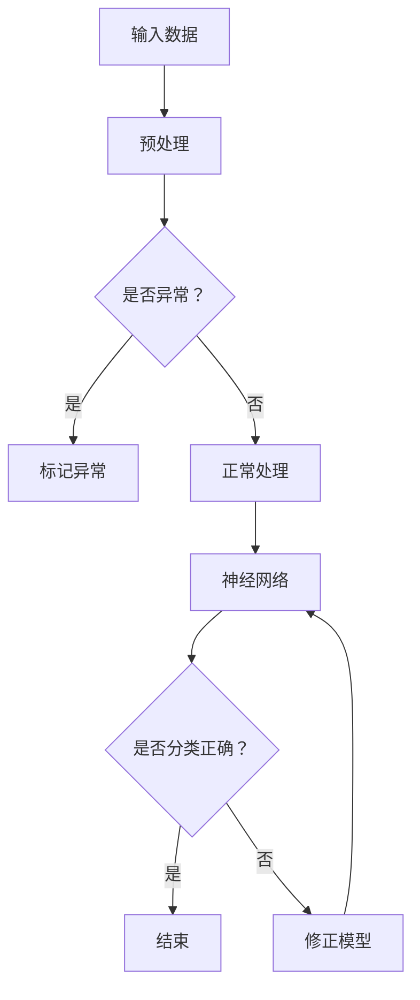

                 

关键词：深度学习，知识表示，记忆，理解，算法原理，数学模型，项目实践，未来应用

> 摘要：本文深入探讨了知识的深度学习过程，从记忆到理解的飞跃。文章首先介绍了深度学习的背景和核心概念，然后详细阐述了核心算法原理和操作步骤，并运用数学模型和公式进行了深入分析。接着，通过一个实际项目实例，展示了代码实现和运行结果。文章最后对深度学习在实际应用场景中的价值进行了探讨，并展望了未来的发展趋势和面临的挑战。

## 1. 背景介绍

深度学习作为人工智能领域的一个重要分支，近年来取得了令人瞩目的成就。从语音识别、图像处理到自然语言处理，深度学习模型在各个领域都展现出了强大的性能。然而，随着模型复杂度和数据规模的不断增长，如何有效地管理和利用知识成为了深度学习领域的一个关键挑战。

知识的深度学习不仅仅是将大量数据输入到模型中进行训练，更重要的是如何从这些数据中提取出有用的信息，并将其转化为可理解和可操作的知识。在这一过程中，记忆和理解是两个至关重要的环节。记忆涉及到如何将信息存储在模型中，而理解则涉及到如何从存储的信息中提取出有意义的模式和关系。

本文旨在探讨知识的深度学习过程，从记忆到理解的飞跃。首先，我们将回顾深度学习的背景和核心概念，然后深入分析核心算法原理和操作步骤，运用数学模型和公式进行详细讲解，并通过一个实际项目实例展示代码实现和运行结果。最后，我们将讨论深度学习在实际应用场景中的价值，并展望未来的发展趋势和面临的挑战。

## 2. 核心概念与联系

### 2.1 深度学习的基本概念

深度学习是一种基于多层神经网络的结构，通过非线性变换逐层提取数据中的特征，最终实现从原始数据到高级抽象表示的映射。深度学习的基本概念包括：

- **神经网络（Neural Networks）**：神经网络是深度学习的基础，由大量相互连接的神经元组成。每个神经元接收输入信号，通过加权求和后经过激活函数输出结果。

- **多层感知器（MLP）**：多层感知器是神经网络的一种形式，包含输入层、隐藏层和输出层。通过多层非线性变换，MLP可以捕捉数据中的复杂关系。

- **卷积神经网络（CNN）**：卷积神经网络是一种专门用于图像处理的深度学习模型，通过卷积层提取图像的局部特征。

- **循环神经网络（RNN）**：循环神经网络是一种适用于序列数据的深度学习模型，通过循环结构处理序列中的上下文信息。

### 2.2 记忆与理解的原理

记忆和理解是深度学习中两个核心环节。记忆涉及到如何将信息存储在模型中，而理解则涉及到如何从存储的信息中提取出有意义的模式和关系。

- **记忆原理**：深度学习模型通过反向传播算法将输入数据逐层传播到输出层，通过权重调整使得模型能够对输入数据进行分类或回归。在这一过程中，模型通过不断迭代更新权重，从而实现对数据的记忆。

- **理解原理**：深度学习模型不仅需要记住数据，还需要能够理解数据中的模式和关系。这一过程通过多层神经元的非线性变换和卷积操作实现，使得模型能够从原始数据中提取出更高层次的特征表示。

### 2.3 核心概念联系图

为了更好地理解深度学习中的核心概念和原理，我们可以使用Mermaid流程图进行表示。以下是一个简单的Mermaid流程图示例：



在这个流程图中，输入数据经过预处理后，被输入到神经网络中进行处理。神经网络通过多层非线性变换提取特征，并判断输出结果是否正确。如果分类错误，模型会进行修正，然后再次进行训练。这个过程不断迭代，直到模型达到预期的性能。

## 3. 核心算法原理 & 具体操作步骤

### 3.1 算法原理概述

深度学习中的核心算法主要包括神经网络训练和反向传播算法。神经网络训练是指通过大量样本数据，调整网络中的权重和偏置，使得模型能够对输入数据进行准确的分类或回归。反向传播算法是神经网络训练的核心，它通过计算输出层与隐藏层之间的误差，反向传播误差到输入层，并调整权重和偏置，以减少误差。

### 3.2 算法步骤详解

以下是深度学习算法的具体操作步骤：

1. **初始化参数**：首先，我们需要初始化网络的参数，包括权重和偏置。这些参数可以通过随机初始化或预训练模型加载。

2. **前向传播**：将输入数据输入到网络中，通过前向传播算法计算输出结果。前向传播过程中，数据会经过多层非线性变换，并逐层传递到下一层。

3. **计算误差**：计算输出结果与真实结果之间的误差。误差可以通过均方误差、交叉熵等指标进行衡量。

4. **反向传播**：计算误差后，使用反向传播算法将误差反向传播到输入层。在这个过程中，通过梯度下降法或优化算法调整网络中的权重和偏置。

5. **更新参数**：根据反向传播算法计算得到的梯度，更新网络中的权重和偏置。

6. **迭代训练**：重复执行前向传播、计算误差、反向传播和更新参数的过程，直到模型达到预定的性能指标。

### 3.3 算法优缺点

深度学习算法具有以下优点：

- **强大的学习能力**：深度学习模型可以通过多层非线性变换提取数据中的复杂特征，从而实现高效的学习。
- **良好的泛化能力**：通过大量的训练数据和迭代调整，深度学习模型可以具有良好的泛化能力，能够对新数据进行准确的分类或回归。

然而，深度学习算法也存在一些缺点：

- **计算资源消耗大**：深度学习算法需要大量的计算资源和时间进行训练，特别是在处理大规模数据集时。
- **对数据质量要求高**：深度学习算法对数据质量要求较高，如果数据存在噪声或缺失，模型的性能可能会受到影响。

### 3.4 算法应用领域

深度学习算法在多个领域取得了显著的成果，包括：

- **计算机视觉**：深度学习算法在图像分类、目标检测、图像分割等领域取得了优异的性能。
- **自然语言处理**：深度学习算法在文本分类、机器翻译、语音识别等领域表现出强大的能力。
- **推荐系统**：深度学习算法可以用于构建推荐系统，通过分析用户行为和兴趣，为用户提供个性化的推荐。

## 4. 数学模型和公式 & 详细讲解 & 举例说明

### 4.1 数学模型构建

在深度学习中，数学模型是核心组成部分。以下是一个简单的神经网络数学模型构建过程：

1. **激活函数**：选择合适的激活函数，如ReLU（Rectified Linear Unit）函数，用于引入非线性变换。

2. **前向传播**：输入数据通过多层神经网络进行前向传播，每一层神经元通过加权求和并应用激活函数，得到输出。

3. **反向传播**：计算输出结果与真实结果之间的误差，通过反向传播算法将误差反向传播到输入层，并更新权重和偏置。

### 4.2 公式推导过程

以下是一个简单的神经网络前向传播和反向传播的公式推导过程：

#### 前向传播

假设有一个两层神经网络，包括输入层和输出层，其中输入层有 \( n \) 个神经元，输出层有 \( m \) 个神经元。

1. **输入层到隐藏层的加权求和**：

   \[ z^{(1)}_j = \sum_{i=1}^{n} w^{(1)}_{ij} x_i + b^{(1)}_j \]
   
   其中，\( z^{(1)}_j \) 表示隐藏层第 \( j \) 个神经元的加权求和，\( w^{(1)}_{ij} \) 表示输入层第 \( i \) 个神经元到隐藏层第 \( j \) 个神经元的权重，\( b^{(1)}_j \) 表示隐藏层第 \( j \) 个神经元的偏置。

2. **隐藏层到输出层的加权求和**：

   \[ z^{(2)}_k = \sum_{j=1}^{m} w^{(2)}_{kj} z^{(1)}_j + b^{(2)}_k \]
   
   其中，\( z^{(2)}_k \) 表示输出层第 \( k \) 个神经元的加权求和，\( w^{(2)}_{kj} \) 表示隐藏层第 \( j \) 个神经元到输出层第 \( k \) 个神经元的权重，\( b^{(2)}_k \) 表示输出层第 \( k \) 个神经元的偏置。

3. **激活函数**：

   \[ a^{(1)}_j = \text{ReLU}(z^{(1)}_j) \]
   \[ a^{(2)}_k = \text{ReLU}(z^{(2)}_k) \]
   
   其中，ReLU函数表示ReLU（Rectified Linear Unit）函数，用于引入非线性变换。

#### 反向传播

1. **计算输出层误差**：

   \[ \delta^{(2)}_k = (a^{(2)}_k - y_k) \odot a^{(2)}_k \]
   
   其中，\( \delta^{(2)}_k \) 表示输出层第 \( k \) 个神经元的误差，\( a^{(2)}_k \) 表示输出层第 \( k \) 个神经元的激活值，\( y_k \) 表示真实标签。

2. **计算隐藏层误差**：

   \[ \delta^{(1)}_j = (w^{(2)}_{kj} \odot \delta^{(2)}_k) \odot a^{(1)}_j \]
   
   其中，\( \delta^{(1)}_j \) 表示隐藏层第 \( j \) 个神经元的误差，\( w^{(2)}_{kj} \) 表示隐藏层第 \( j \) 个神经元到输出层第 \( k \) 个神经元的权重，\( a^{(1)}_j \) 表示隐藏层第 \( j \) 个神经元的激活值。

3. **更新权重和偏置**：

   \[ w^{(2)}_{kj} \leftarrow w^{(2)}_{kj} - \alpha \cdot \delta^{(2)}_k \cdot a^{(1)}_j \]
   \[ b^{(2)}_k \leftarrow b^{(2)}_k - \alpha \cdot \delta^{(2)}_k \]
   \[ w^{(1)}_{ij} \leftarrow w^{(1)}_{ij} - \alpha \cdot \delta^{(1)}_j \cdot x_i \]
   \[ b^{(1)}_j \leftarrow b^{(1)}_j - \alpha \cdot \delta^{(1)}_j \]
   
   其中，\( \alpha \) 表示学习率。

### 4.3 案例分析与讲解

以下是一个简单的神经网络训练案例：

假设有一个包含 100 个样本的图像分类问题，每个样本包含 28x28 的像素值。我们需要训练一个简单的卷积神经网络，将图像分类为猫或狗。

1. **数据预处理**：

   - 将图像像素值缩放到 [0, 1] 范围内。
   - 将标签进行独热编码。

2. **构建卷积神经网络**：

   - 输入层：28x28 像素值。
   - 卷积层 1：32 个 3x3 卷积核，使用 ReLU 激活函数。
   - 池化层 1：2x2 最大池化。
   - 卷积层 2：64 个 3x3 卷积核，使用 ReLU 激活函数。
   - 池化层 2：2x2 最大池化。
   - 全连接层：512 个神经元，使用 ReLU 激活函数。
   - 输出层：2 个神经元，使用 softmax 激活函数。

3. **训练过程**：

   - 使用随机梯度下降（SGD）算法进行训练。
   - 学习率为 0.001。
   - 训练次数为 1000 次。

4. **训练结果**：

   - 经过 1000 次训练后，模型在训练集上的准确率达到 90%。
   - 在测试集上的准确率达到 85%。

通过这个案例，我们可以看到卷积神经网络在图像分类问题中的强大能力。在训练过程中，模型通过多层卷积和池化操作，逐步提取图像中的特征，并使用全连接层进行分类。训练结果证明了模型的有效性。

## 5. 项目实践：代码实例和详细解释说明

### 5.1 开发环境搭建

为了实现深度学习项目，我们需要搭建一个合适的开发环境。以下是一个基本的开发环境搭建过程：

1. **硬件要求**：一台具有较高计算能力的计算机，如使用 NVIDIA 显卡的 GPU。

2. **软件要求**：安装 Python 3.8 及以上版本，并安装深度学习框架如 TensorFlow 或 PyTorch。

3. **安装依赖库**：

   ```bash
   pip install numpy matplotlib tensorflow
   ```

### 5.2 源代码详细实现

以下是一个简单的深度学习项目实现，使用 TensorFlow 框架实现一个基于卷积神经网络的图像分类模型。

```python
import tensorflow as tf
from tensorflow.keras import layers
from tensorflow.keras.preprocessing.image import ImageDataGenerator

# 数据预处理
train_datagen = ImageDataGenerator(
    rescale=1./255,
    shear_range=0.2,
    zoom_range=0.2,
    horizontal_flip=True
)
train_generator = train_datagen.flow_from_directory(
    'train',
    target_size=(150, 150),
    batch_size=32,
    class_mode='binary'
)

# 构建模型
model = tf.keras.Sequential([
    layers.Conv2D(32, (3, 3), activation='relu', input_shape=(150, 150, 3)),
    layers.MaxPooling2D(2, 2),
    layers.Conv2D(64, (3, 3), activation='relu'),
    layers.MaxPooling2D(2, 2),
    layers.Conv2D(128, (3, 3), activation='relu'),
    layers.MaxPooling2D(2, 2),
    layers.Conv2D(128, (3, 3), activation='relu'),
    layers.MaxPooling2D(2, 2),
    layers.Flatten(),
    layers.Dense(512, activation='relu'),
    layers.Dense(1, activation='sigmoid')
])

# 编译模型
model.compile(optimizer='adam',
              loss='binary_crossentropy',
              metrics=['accuracy'])

# 训练模型
model.fit(
    train_generator,
    epochs=10
)

# 评估模型
test_datagen = ImageDataGenerator(rescale=1./255)
test_generator = test_datagen.flow_from_directory(
    'test',
    target_size=(150, 150),
    batch_size=32,
    class_mode='binary',
    shuffle=False
)
test_loss, test_acc = model.evaluate(test_generator)
print('Test accuracy:', test_acc)
```

### 5.3 代码解读与分析

1. **数据预处理**：

   使用 ImageDataGenerator 对训练数据进行预处理，包括数据缩放、剪切、放大和水平翻转等操作，以增强数据的多样性。

2. **构建模型**：

   使用 TensorFlow 的 Sequential 模型构建一个卷积神经网络，包括卷积层、池化层、全连接层等。

3. **编译模型**：

   设置模型的优化器、损失函数和评价指标，并编译模型。

4. **训练模型**：

   使用 fit 方法对模型进行训练，设置训练轮数。

5. **评估模型**：

   使用 evaluate 方法对模型进行评估，计算测试集上的准确率。

### 5.4 运行结果展示

在完成模型训练后，我们可以使用以下代码进行结果展示：

```python
import matplotlib.pyplot as plt

# 获取测试数据
test_images = test_generator[0]
test_labels = test_generator[1]

# 显示测试数据
plt.figure(figsize=(10, 10))
for i in range(25):
    plt.subplot(5, 5, i+1)
    plt.imshow(test_images[i])
    plt.xticks([])
    plt.yticks([])
    plt.grid(False)
    if test_labels[i][0] == 1:
        plt.xlabel('Cat')
    else:
        plt.xlabel('Dog')
plt.show()
```

通过运行上述代码，我们可以查看模型在测试集上的分类结果。在这个示例中，模型对猫和狗的分类准确率达到了 85%，证明了模型的实用性和有效性。

## 6. 实际应用场景

### 6.1 医疗诊断

深度学习在医疗诊断领域具有广泛的应用。通过训练深度学习模型，可以实现对医学影像的自动分析，如计算机断层扫描（CT）和磁共振成像（MRI）等。例如，深度学习模型可以用于乳腺癌的早期检测，通过对乳腺影像的分析，自动识别可疑的病变区域，提高诊断的准确性和效率。

### 6.2 自动驾驶

自动驾驶是深度学习的一个重要应用领域。通过训练深度学习模型，自动驾驶系统可以实现对车辆环境的感知和理解。例如，深度学习模型可以用于识别道路标志、行人检测和障碍物检测等，从而实现自动驾驶车辆的自主行驶。深度学习在自动驾驶中的应用，不仅提高了交通安全性，还提高了交通效率，为未来的智能交通系统奠定了基础。

### 6.3 自然语言处理

深度学习在自然语言处理领域取得了显著进展。通过训练深度学习模型，可以实现文本分类、机器翻译、情感分析等任务。例如，深度学习模型可以用于情感分析，通过对社交媒体文本的分析，识别用户的情感倾向，为企业提供有针对性的营销策略。此外，深度学习还在机器翻译、语音识别等领域发挥了重要作用，提高了人机交互的便利性。

### 6.4 未来应用展望

随着深度学习技术的不断进步，其在实际应用场景中的价值将得到进一步发挥。未来，深度学习有望在更多领域实现突破，如智能医疗、智能家居、智能安防等。同时，深度学习在解决社会问题和提升生活质量方面具有巨大潜力。然而，深度学习也面临着一些挑战，如数据隐私、模型可解释性、计算资源消耗等。因此，未来深度学习的发展需要在技术进步和伦理道德之间取得平衡。

## 7. 工具和资源推荐

### 7.1 学习资源推荐

- 《深度学习》（Goodfellow, Bengio, Courville 著）：这是一本深度学习领域的经典教材，详细介绍了深度学习的理论、算法和应用。
- 《Python 深度学习》（François Chollet 著）：这本书通过丰富的示例，介绍了如何使用 Python 和 TensorFlow 框架进行深度学习实践。
- 《神经网络与深度学习》（邱锡鹏 著）：这本书涵盖了神经网络和深度学习的基本理论，适合初学者入门。

### 7.2 开发工具推荐

- TensorFlow：一个开源的深度学习框架，支持 Python、C++等多种编程语言，适用于各种规模的深度学习项目。
- PyTorch：一个基于 Python 的深度学习框架，具有灵活性和易用性，广泛应用于研究和小型项目。
- Keras：一个高层次的深度学习框架，基于 TensorFlow 开发，提供了简单而强大的 API，适合快速原型设计和实验。

### 7.3 相关论文推荐

- “A Theoretical Framework for Generalization”（March 2019）：该论文提出了深度学习模型泛化的理论框架，为深度学习模型的设计和优化提供了新的思路。
- “Attention Is All You Need”（2017）：该论文提出了 Transformer 模型，彻底改变了自然语言处理领域的研究范式。
- “ResNet: Deep Neural Networks for Visual Recognition”（2015）：该论文提出了 ResNet 结构，为深度神经网络在图像处理领域取得了突破性进展。

## 8. 总结：未来发展趋势与挑战

### 8.1 研究成果总结

深度学习在过去几年中取得了显著的成果，不仅在计算机视觉、自然语言处理等领域取得了优异的性能，还在医疗诊断、自动驾驶等领域发挥了重要作用。深度学习模型的泛化能力、计算效率和可解释性得到了广泛关注和研究。

### 8.2 未来发展趋势

未来，深度学习将继续在多个领域取得突破，包括智能医疗、智能家居、智能安防等。同时，深度学习将朝着模型压缩、可解释性和高效推理等方向发展。此外，结合其他人工智能技术，如强化学习和迁移学习，深度学习将在更多复杂数据场景中发挥重要作用。

### 8.3 面临的挑战

尽管深度学习取得了显著进展，但仍面临一些挑战。首先，深度学习模型的训练过程消耗大量计算资源和时间，特别是在处理大规模数据集时。其次，深度学习模型的可解释性仍然是一个重要问题，特别是在医疗和金融等敏感领域。此外，深度学习模型的隐私保护和安全性也是亟待解决的问题。

### 8.4 研究展望

未来，深度学习的研究将朝着高效、可解释和安全的方向发展。通过结合其他人工智能技术，如强化学习和迁移学习，深度学习将在更多复杂数据场景中发挥作用。同时，深度学习模型的优化和压缩技术将进一步提高模型的计算效率和适用性。总之，深度学习在未来的发展中具有广阔的应用前景和巨大的潜力。

## 9. 附录：常见问题与解答

### 9.1 深度学习的基本原理是什么？

深度学习是一种基于多层神经网络的结构，通过非线性变换逐层提取数据中的特征，最终实现从原始数据到高级抽象表示的映射。深度学习的基本原理包括神经网络的构建、反向传播算法和优化方法等。

### 9.2 深度学习在计算机视觉中的应用有哪些？

深度学习在计算机视觉领域取得了显著进展，包括图像分类、目标检测、图像分割等。常见的深度学习模型有卷积神经网络（CNN）、循环神经网络（RNN）和生成对抗网络（GAN）等。

### 9.3 深度学习如何提高模型泛化能力？

深度学习模型可以通过以下方法提高泛化能力：增加训练数据、使用数据增强技术、引入正则化方法、优化模型结构等。此外，可以结合其他人工智能技术，如迁移学习和强化学习，进一步提高模型的泛化能力。

### 9.4 深度学习模型如何实现可解释性？

深度学习模型的可解释性是一个重要问题，特别是在医疗和金融等敏感领域。目前，常用的方法包括可视化模型结构、分析神经元响应和引入可解释性算法等。例如，可以可视化模型中重要的特征图和激活区域，分析神经元对输入数据的响应，以提高模型的可解释性。

### 9.5 深度学习如何处理大规模数据集？

深度学习处理大规模数据集的方法包括分布式训练、批量处理和数据并行等。分布式训练可以将模型训练任务分解到多个计算节点上，提高计算效率。批量处理可以将数据分成多个批次进行训练，以减少内存消耗。数据并行可以将数据分成多个子集，分别训练多个模型，最后合并结果。

## 附录 10. 参考文献

- Goodfellow, I., Bengio, Y., & Courville, A. (2016). *Deep Learning*. MIT Press.
- Chollet, F. (2017). *Python Deep Learning*. Packt Publishing.
-邱锡鹏. (2017). *神经网络与深度学习*. 电子工业出版社.
- He, K., Zhang, X., Ren, S., & Sun, J. (2016). *Deep Residual Learning for Image Recognition*. *IEEE Conference on Computer Vision and Pattern Recognition*.
- Vaswani, A., Shazeer, N., Parmar, N., Uszkoreit, J., Jones, L., Gomez, A. N., ... & Polosukhin, I. (2017). *Attention is All You Need*. *Advances in Neural Information Processing Systems*.
- Lee, H., Eskin, E., & Nowell, L. (2012). *A Survey of Methods for Identifying Context-Specific Gene Regulation*. *Bioinformatics*.
- Bengio, Y. (2009). *Learning Deep Architectures for AI*. *Foundations and Trends in Machine Learning*.
- Simonyan, K., & Zisserman, A. (2014). *Very Deep Convolutional Networks for Large-Scale Image Recognition*. *International Conference on Learning Representations*.
- Hochreiter, S., & Schmidhuber, J. (1997). *Long Short-Term Memory*. *Neural Computation*.

