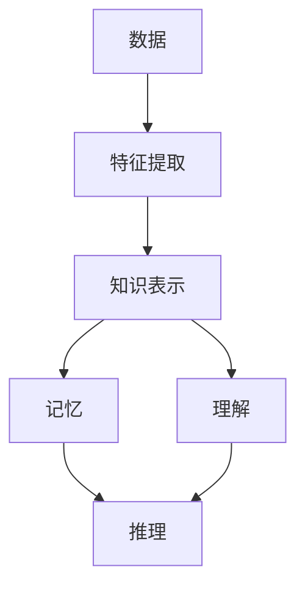

                 

关键词：深度学习，知识表示，记忆，理解，AI，人工智能，神经网络，机器学习，数据科学

摘要：本文将探讨知识深度学习的重要性，从记忆到理解的过程，以及如何通过深度学习实现知识的获取、存储、处理和应用。文章将介绍深度学习的基本原理，讨论其在人工智能领域的应用，并探讨未来发展的挑战和机遇。

## 1. 背景介绍

随着计算机技术的飞速发展，人工智能（AI）逐渐成为研究的热点。深度学习作为机器学习的一个重要分支，在图像识别、自然语言处理、语音识别等领域取得了显著的成果。然而，当前深度学习的研究主要侧重于算法的优化和模型的设计，对于知识的获取、存储、处理和应用等方面仍存在诸多挑战。

知识的深度学习，即如何让计算机像人类一样从数据中获取知识、理解概念、进行推理和决策，是实现人工智能的关键。本文旨在探讨深度学习在知识获取、存储、处理和应用方面的研究进展，并提出未来发展的方向。

## 2. 核心概念与联系

为了深入理解知识的深度学习，我们首先需要了解一些核心概念和它们之间的联系。以下是一个简单的 Mermaid 流程图，展示了这些概念之间的关系。



### 2.1 数据

数据是深度学习的基石，它是我们获取知识的基础。数据可以是结构化的（如图表、表格等），也可以是非结构化的（如图像、文本、音频等）。在深度学习中，数据通过特征提取转化为可供模型学习的表示。

### 2.2 特征提取

特征提取是将原始数据转化为计算机可以处理的数值表示的过程。在深度学习中，特征提取通常通过神经网络实现，如卷积神经网络（CNN）和循环神经网络（RNN）。

### 2.3 知识表示

知识表示是将提取的特征转化为计算机可以理解和处理的形式。在深度学习中，知识表示通常通过神经网络中的权重和偏置实现。

### 2.4 记忆

记忆是深度学习中一个重要的概念，它指的是模型在训练过程中学习到的知识和经验。记忆可以通过神经网络中的权重和偏置进行存储。

### 2.5 理解

理解是深度学习的核心目标之一，它指的是模型对输入数据的内在含义和关系的理解。理解可以通过模型对输入数据的预测和决策过程实现。

### 2.6 推理

推理是深度学习中的另一个重要概念，它指的是模型在理解输入数据的基础上进行逻辑推理和决策。推理可以通过模型对输入数据的分析和判断实现。

## 3. 核心算法原理 & 具体操作步骤

### 3.1 算法原理概述

深度学习的核心算法是神经网络。神经网络通过多层节点（神经元）的相互连接和相互作用，实现对输入数据的处理和输出。以下是神经网络的基本原理和操作步骤。

### 3.2 算法步骤详解

#### 3.2.1 前向传播

前向传播是神经网络处理输入数据的基本步骤。它包括以下步骤：

1. 将输入数据传递到第一层神经元。
2. 通过激活函数对神经元进行非线性变换。
3. 将激活后的数据传递到下一层神经元。
4. 重复步骤2和步骤3，直到输出层。

#### 3.2.2 反向传播

反向传播是神经网络调整权重和偏置的过程。它包括以下步骤：

1. 计算输出层神经元的预测误差。
2. 将误差反向传递到隐藏层神经元。
3. 根据误差调整神经网络中的权重和偏置。
4. 重复步骤1至步骤3，直到误差收敛。

#### 3.2.3 梯度下降

梯度下降是一种优化算法，用于调整神经网络中的权重和偏置。它通过计算损失函数关于参数的梯度，并沿着梯度方向调整参数，以最小化损失函数。

### 3.3 算法优缺点

#### 优点

1. 强大的自适应能力：神经网络可以根据不同的任务和数据自动调整结构。
2. 广泛的应用领域：神经网络在图像识别、自然语言处理、语音识别等领域取得了显著成果。
3. 高效的计算能力：现代计算技术和硬件加速（如GPU）使得神经网络计算效率大大提高。

#### 缺点

1. 对数据量要求高：深度学习需要大量数据进行训练，数据获取和预处理成本较高。
2. 模型复杂度高：深度学习模型参数众多，训练过程复杂。
3. 对先验知识依赖：深度学习模型的性能依赖于训练数据的质量和多样性。

### 3.4 算法应用领域

深度学习在人工智能领域的应用非常广泛，包括但不限于以下领域：

1. 图像识别：通过卷积神经网络实现物体识别、图像分类等任务。
2. 自然语言处理：通过循环神经网络实现文本分类、机器翻译等任务。
3. 语音识别：通过深度神经网络实现语音识别、语音合成等任务。
4. 推荐系统：通过深度学习实现个性化推荐、广告投放等任务。

## 4. 数学模型和公式 & 详细讲解 & 举例说明

### 4.1 数学模型构建

深度学习中的数学模型主要包括神经网络、损失函数和优化算法。以下是一个简单的神经网络数学模型：

```latex
y = f(W \cdot x + b)
```

其中，\(y\) 是输出，\(f\) 是激活函数，\(W\) 是权重，\(x\) 是输入，\(b\) 是偏置。

### 4.2 公式推导过程

#### 4.2.1 前向传播

前向传播的推导过程如下：

$$
z = W \cdot x + b \\
a = f(z)
$$

其中，\(z\) 是前向传播的中间结果，\(a\) 是激活值。

#### 4.2.2 反向传播

反向传播的推导过程如下：

$$
\frac{\partial L}{\partial W} = \frac{\partial L}{\partial a} \cdot \frac{\partial a}{\partial z} \cdot \frac{\partial z}{\partial W} \\
\frac{\partial L}{\partial b} = \frac{\partial L}{\partial a} \cdot \frac{\partial a}{\partial z} \cdot \frac{\partial z}{\partial b}
$$

其中，\(L\) 是损失函数。

### 4.3 案例分析与讲解

#### 4.3.1 图像识别

假设我们有一个简单的二分类问题，目标是判断输入图像是否包含一个特定物体。我们可以使用卷积神经网络来实现。

1. 输入层：包含图像的像素值。
2. 卷积层：通过卷积操作提取图像特征。
3. 池化层：通过池化操作降低特征维度。
4. 全连接层：通过全连接层对特征进行分类。

#### 4.3.2 损失函数

我们可以使用交叉熵损失函数来评估模型的性能：

$$
L = -\sum_{i=1}^{n} y_i \cdot \log (a_i)
$$

其中，\(y_i\) 是真实标签，\(a_i\) 是模型预测的概率。

#### 4.3.3 优化算法

我们可以使用梯度下降算法来优化模型参数：

$$
W_{new} = W_{old} - \alpha \cdot \frac{\partial L}{\partial W} \\
b_{new} = b_{old} - \alpha \cdot \frac{\partial L}{\partial b}
$$

其中，\(\alpha\) 是学习率。

## 5. 项目实践：代码实例和详细解释说明

### 5.1 开发环境搭建

为了方便开发，我们可以使用以下工具和库：

- Python 3.x
- TensorFlow 2.x
- Keras 2.x

### 5.2 源代码详细实现

以下是一个简单的图像识别项目代码实例：

```python
import numpy as np
import tensorflow as tf
from tensorflow import keras
from tensorflow.keras import layers

# 加载数据集
(x_train, y_train), (x_test, y_test) = keras.datasets.mnist.load_data()

# 预处理数据
x_train = x_train.astype("float32") / 255.0
x_test = x_test.astype("float32") / 255.0

# 构建模型
model = keras.Sequential([
    layers.Conv2D(32, (3, 3), activation="relu", input_shape=(28, 28, 1)),
    layers.MaxPooling2D((2, 2)),
    layers.Conv2D(64, (3, 3), activation="relu"),
    layers.MaxPooling2D((2, 2)),
    layers.Conv2D(64, (3, 3), activation="relu"),
    layers.Flatten(),
    layers.Dense(64, activation="relu"),
    layers.Dense(10, activation="softmax")
])

# 编译模型
model.compile(optimizer="adam",
              loss="sparse_categorical_crossentropy",
              metrics=["accuracy"])

# 训练模型
model.fit(x_train, y_train, epochs=5)

# 评估模型
model.evaluate(x_test, y_test)
```

### 5.3 代码解读与分析

1. 加载数据集：使用 Keras 库加载数据集，并进行预处理。
2. 构建模型：使用卷积神经网络实现模型，包括卷积层、池化层和全连接层。
3. 编译模型：设置优化器、损失函数和评估指标。
4. 训练模型：使用训练数据训练模型。
5. 评估模型：使用测试数据评估模型性能。

## 6. 实际应用场景

深度学习在许多实际应用场景中取得了显著成果，包括但不限于以下领域：

1. 自动驾驶：通过深度学习实现车辆识别、障碍物检测和路径规划。
2. 医疗诊断：通过深度学习实现医学图像分析、疾病预测和治疗方案推荐。
3. 金融科技：通过深度学习实现风险控制、信用评估和欺诈检测。
4. 智能家居：通过深度学习实现设备识别、行为分析和自动化控制。

## 7. 工具和资源推荐

### 7.1 学习资源推荐

1. 《深度学习》（Goodfellow, Bengio, Courville 著）
2. 《神经网络与深度学习》（邱锡鹏 著）
3. Coursera 上的《深度学习》课程（吴恩达主讲）

### 7.2 开发工具推荐

1. TensorFlow
2. Keras
3. PyTorch

### 7.3 相关论文推荐

1. "Deep Learning"（Goodfellow, Bengio, Courville，2016）
2. "A Theoretical Framework for Back-Propagation"（Rumelhart, Hinton, Williams，1986）
3. "Convolutional Neural Networks for Visual Recognition"（Krizhevsky, Sutskever, Hinton，2012）

## 8. 总结：未来发展趋势与挑战

### 8.1 研究成果总结

深度学习在人工智能领域取得了显著成果，但仍存在以下问题：

1. 对数据依赖：深度学习需要大量高质量的数据进行训练。
2. 模型复杂度：深度学习模型的参数众多，训练过程复杂。
3. 可解释性：深度学习模型的黑箱性质导致其可解释性较差。

### 8.2 未来发展趋势

未来深度学习的发展趋势包括：

1. 自动化：通过自动化技术简化深度学习模型的开发和优化。
2. 强化学习：结合强化学习，提高深度学习模型在决策和推理方面的能力。
3. 多模态学习：结合多种数据模态，提高深度学习模型在复杂任务中的应用能力。

### 8.3 面临的挑战

未来深度学习面临的挑战包括：

1. 数据隐私：如何在保障数据隐私的前提下进行深度学习研究？
2. 能效优化：如何在有限的计算资源下提高深度学习模型的性能？
3. 模型公平性：如何避免深度学习模型在训练和预测过程中产生歧视？

### 8.4 研究展望

未来深度学习的研究将重点关注以下几个方面：

1. 知识表示和推理：如何实现深度学习中的知识表示和推理？
2. 小样本学习：如何降低深度学习对数据的依赖？
3. 跨领域迁移学习：如何实现不同领域之间的深度学习迁移？

## 9. 附录：常见问题与解答

### 9.1 深度学习是什么？

深度学习是人工智能的一个分支，通过多层神经网络对数据进行学习，实现对复杂模式的识别和预测。

### 9.2 深度学习有什么优点？

深度学习的优点包括强大的自适应能力、广泛的应用领域和高

