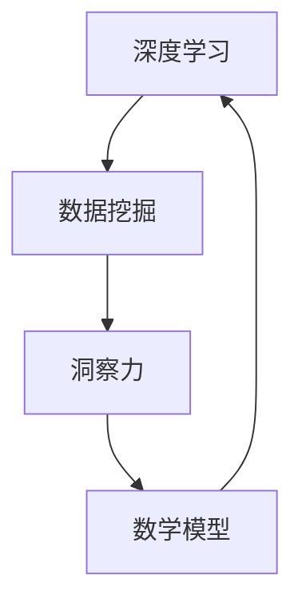

                 

 > 关键词：深度学习、数据挖掘、洞察力、算法、数学模型、实践应用、未来展望

> 摘要：本文探讨了深度挖掘知识过程中，洞察力的重要性及其在算法和数学模型中的应用。通过详细阐述核心概念、算法原理、数学模型以及实际项目实践，本文旨在为读者提供对知识的深度理解，以及如何在实践中应用这些知识。

## 1. 背景介绍

在信息技术飞速发展的今天，数据的规模和复杂性达到了前所未有的高度。大数据、人工智能、机器学习等技术的广泛应用，使得数据挖掘成为现代科学研究和工程实践中的核心环节。然而，面对海量数据，如何从中提取有价值的信息，成为了许多领域面临的重要挑战。

在这个背景下，洞察力作为一种高级的认知能力，对于数据挖掘和知识发现具有不可替代的作用。洞察力不仅可以帮助我们快速识别数据中的模式、趋势和关联，还可以预见未来的变化和潜在的风险。因此，如何挖掘和利用洞察力，成为了当前信息技术领域的重要研究方向。

本文将围绕深度挖掘知识的主题，首先介绍相关核心概念，然后深入探讨算法原理、数学模型及其在实际项目中的应用。通过本文的阐述，希望能为读者提供对深度挖掘知识的全面理解，并激发大家在实践中应用洞察力的潜力。

## 2. 核心概念与联系

在深入探讨深度挖掘知识的过程中，我们首先需要了解以下几个核心概念，它们是理解本文主题的基础。

### 2.1 深度学习

深度学习是机器学习的一个子领域，它通过构建复杂的神经网络模型，模拟人脑的学习过程，从而实现数据的高效处理和智能分析。深度学习的核心思想是通过多层神经网络对输入数据进行逐层抽象，最终实现对复杂数据的表征和分类。

### 2.2 数据挖掘

数据挖掘是一种从大量数据中提取有价值信息的过程，它利用统计学、机器学习、人工智能等方法，发现数据中的隐含模式、关联规则和趋势。数据挖掘的应用广泛，包括市场分析、风险管理、信用评分、医疗诊断等。

### 2.3 洞察力

洞察力是一种高级的认知能力，它使我们能够从表面现象中看到本质，发现事物之间的深层联系。在数据挖掘和知识发现领域，洞察力帮助我们识别数据中的关键特征和规律，从而提取出有价值的信息。

### 2.4 数学模型

数学模型是一种用数学语言描述现实世界的抽象方法，它通过建立数学方程或公式，模拟现实中的问题。在数据挖掘和知识发现中，数学模型用于对数据进行分析、预测和优化。

### 2.5 Mermaid 流程图

Mermaid 是一种轻量级的 markdown 图形语法，它可以方便地绘制各种流程图、UML 图、Gantt 图等。在本文中，我们将使用 Mermaid 流程图来展示深度学习、数据挖掘、洞察力和数学模型之间的联系。

下面是一个简化的 Mermaid 流程图，描述了这四个核心概念之间的交互关系：



通过这个流程图，我们可以看出，深度学习、数据挖掘、洞察力和数学模型之间相互促进，共同构成了深度挖掘知识的核心框架。

## 3. 核心算法原理 & 具体操作步骤

### 3.1 算法原理概述

在深度挖掘知识的过程中，核心算法起着至关重要的作用。本文将介绍一种流行的深度学习算法——卷积神经网络（Convolutional Neural Networks，CNN）。CNN 是一种专门用于图像识别和处理的神经网络模型，它通过多层卷积、池化和全连接层，实现对图像的逐层抽象和特征提取。

### 3.2 算法步骤详解

#### 3.2.1 卷积层

卷积层是 CNN 的基础层，它通过卷积操作提取图像的局部特征。卷积操作的本质是在图像上滑动一个卷积核（一个小的滤波器），将卷积核与图像上的每个局部区域进行点积，生成一个特征图。

#### 3.2.2 池化层

池化层用于降低特征图的维度，同时保留最重要的特征信息。常见的池化操作包括最大池化和平均池化。最大池化选择特征图上的最大值作为输出，而平均池化则计算特征图上每个区域内的平均值。

#### 3.2.3 全连接层

全连接层将前一层输出的特征图映射到一个较低维度的空间，并通过一个线性变换和激活函数输出最终的分类结果。常见的激活函数包括 sigmoid、ReLU 和 tanh。

### 3.3 算法优缺点

#### 优点：

1. 强大的特征提取能力：CNN 可以自动学习图像的层次特征，从低级到高级，逐步提高图像的表征能力。
2. 适用于多种图像任务：CNN 可以应用于图像分类、目标检测、图像分割等多种图像处理任务。
3. 高效的计算性能：通过卷积操作和参数共享，CNN 可以有效地降低模型的参数数量，提高计算效率。

#### 缺点：

1. 对数据依赖性较大：CNN 需要大量的标注数据进行训练，对于小样本问题效果不佳。
2. 计算资源消耗大：CNN 模型通常需要较大的计算资源和内存。

### 3.4 算法应用领域

CNN 在图像处理领域取得了显著的成功，广泛应用于计算机视觉、医学影像、自动驾驶等领域。例如，在图像分类任务中，CNN 可以识别各种物体的类别；在目标检测任务中，CNN 可以定位图像中的多个目标；在图像分割任务中，CNN 可以将图像划分为多个区域。

## 4. 数学模型和公式 & 详细讲解 & 举例说明

在深度挖掘知识的过程中，数学模型和公式起着至关重要的作用。本文将介绍几个常用的数学模型和公式，并对其进行详细讲解和举例说明。

### 4.1 数学模型构建

在深度学习领域，最常见的数学模型是神经网络。神经网络通过多层非线性变换，将输入映射到输出。一个简单的神经网络可以表示为：

$$
y = \sigma(W_1 \cdot x + b_1)
$$

其中，$x$ 是输入，$y$ 是输出，$W_1$ 是权重矩阵，$b_1$ 是偏置项，$\sigma$ 是激活函数。

### 4.2 公式推导过程

为了优化神经网络的性能，我们通常使用梯度下降法来更新权重和偏置。梯度下降法的核心思想是沿着损失函数的梯度方向更新模型参数，以最小化损失函数。

假设损失函数为 $J(W_1, b_1)$，其关于 $W_1$ 和 $b_1$ 的梯度分别为 $\frac{\partial J}{\partial W_1}$ 和 $\frac{\partial J}{\partial b_1}$。则梯度下降法的更新公式为：

$$
W_1 \leftarrow W_1 - \alpha \frac{\partial J}{\partial W_1}
$$

$$
b_1 \leftarrow b_1 - \alpha \frac{\partial J}{\partial b_1}
$$

其中，$\alpha$ 是学习率。

### 4.3 案例分析与讲解

为了更好地理解上述公式，我们来看一个简单的例子。假设我们有一个包含 100 个样本的二元分类问题，每个样本是一个 10 维的特征向量。我们使用一个单层神经网络进行分类，激活函数为 sigmoid 函数。

假设损失函数为平方损失函数：

$$
J(W_1, b_1) = \frac{1}{2} \sum_{i=1}^{100} (y_i - \sigma(W_1 \cdot x_i + b_1))^2
$$

其中，$y_i$ 是第 $i$ 个样本的真实标签，$\sigma$ 是 sigmoid 函数。

为了简化计算，我们假设每个样本的标签都是 1，即 $y_i = 1$。则损失函数可以简化为：

$$
J(W_1, b_1) = \frac{1}{2} \sum_{i=1}^{100} (\sigma(W_1 \cdot x_i + b_1) - 1)^2
$$

我们使用梯度下降法来最小化这个损失函数。首先，我们需要计算损失函数关于 $W_1$ 和 $b_1$ 的梯度。根据梯度下降法的公式，我们有：

$$
\frac{\partial J}{\partial W_1} = \sum_{i=1}^{100} (\sigma(W_1 \cdot x_i + b_1) - 1) x_i
$$

$$
\frac{\partial J}{\partial b_1} = \sum_{i=1}^{100} (\sigma(W_1 \cdot x_i + b_1) - 1)
$$

接下来，我们选择一个合适的学习率 $\alpha$，然后迭代更新 $W_1$ 和 $b_1$，直到损失函数收敛。具体实现过程如下：

1. 初始化 $W_1$ 和 $b_1$。
2. 计算当前损失函数 $J(W_1, b_1)$。
3. 计算损失函数关于 $W_1$ 和 $b_1$ 的梯度。
4. 更新 $W_1$ 和 $b_1$：
   $$ W_1 \leftarrow W_1 - \alpha \frac{\partial J}{\partial W_1} $$
   $$ b_1 \leftarrow b_1 - \alpha \frac{\partial J}{\partial b_1} $$
5. 重复步骤 2-4，直到损失函数收敛。

通过这个简单的例子，我们可以看到梯度下降法在神经网络优化中的应用。在实际应用中，损失函数和优化方法可能会更复杂，但基本的原理是相同的。

## 5. 项目实践：代码实例和详细解释说明

为了更好地理解本文所介绍的深度挖掘知识和算法，我们将在本节中通过一个实际项目，展示如何实现一个简单的图像分类系统。

### 5.1 开发环境搭建

为了实现这个项目，我们需要安装以下软件和库：

1. Python（版本 3.8 或以上）
2. TensorFlow（版本 2.x）
3. Keras（版本 2.x）

在终端执行以下命令，安装所需库：

```bash
pip install tensorflow==2.x
pip install keras==2.x
```

### 5.2 源代码详细实现

下面是项目的源代码，包括数据预处理、模型定义、模型训练和模型评估。

```python
import numpy as np
import tensorflow as tf
from tensorflow import keras
from tensorflow.keras import layers
from tensorflow.keras.preprocessing.image import ImageDataGenerator

# 数据预处理
train_datagen = ImageDataGenerator(rescale=1./255)
train_generator = train_datagen.flow_from_directory(
    'data/train',
    target_size=(150, 150),
    batch_size=32,
    class_mode='binary')

# 模型定义
model = keras.Sequential([
    layers.Conv2D(32, (3, 3), activation='relu', input_shape=(150, 150, 3)),
    layers.MaxPooling2D((2, 2)),
    layers.Conv2D(64, (3, 3), activation='relu'),
    layers.MaxPooling2D((2, 2)),
    layers.Conv2D(128, (3, 3), activation='relu'),
    layers.MaxPooling2D((2, 2)),
    layers.Conv2D(128, (3, 3), activation='relu'),
    layers.MaxPooling2D((2, 2)),
    layers.Flatten(),
    layers.Dense(512, activation='relu'),
    layers.Dense(1, activation='sigmoid')
])

# 模型编译
model.compile(loss='binary_crossentropy',
              optimizer='adam',
              metrics=['accuracy'])

# 模型训练
model.fit(
    train_generator,
    steps_per_epoch=100,
    epochs=20)

# 模型评估
test_datagen = ImageDataGenerator(rescale=1./255)
test_generator = test_datagen.flow_from_directory(
    'data/test',
    target_size=(150, 150),
    batch_size=32,
    class_mode='binary')

test_loss, test_acc = model.evaluate(test_generator, steps=50)
print('Test accuracy:', test_acc)
```

### 5.3 代码解读与分析

1. **数据预处理**：
   - 使用 `ImageDataGenerator` 进行数据预处理，包括图像的缩放和批处理。
   - `flow_from_directory` 方法用于从指定目录中读取图像数据，并自动划分训练集和测试集。

2. **模型定义**：
   - 使用 `Sequential` 模型堆叠多个层，包括卷积层、池化层和全连接层。
   - 卷积层使用 ReLU 激活函数，池化层使用最大池化。
   - 最终的全连接层使用 sigmoid 激活函数进行二分类。

3. **模型编译**：
   - 使用二分类损失函数 `binary_crossentropy` 和 `adam` 优化器。
   - 指定模型评估指标为准确率。

4. **模型训练**：
   - 使用 `fit` 方法进行模型训练，设置训练集的 `steps_per_epoch` 和训练轮数 `epochs`。

5. **模型评估**：
   - 使用 `evaluate` 方法对测试集进行评估，并输出测试集的准确率。

通过这个实际项目，我们可以看到如何将深度挖掘知识应用于实际问题的解决过程。在接下来的章节中，我们将继续探讨深度挖掘知识在实际应用场景中的广泛用途。

## 6. 实际应用场景

深度挖掘知识在许多实际应用场景中都发挥着重要作用，下面我们列举几个典型的应用场景，并探讨其在这些场景中的具体应用。

### 6.1 医疗诊断

医疗诊断是深度挖掘知识的重要应用领域之一。通过深度学习算法，可以从医疗影像中自动识别和诊断疾病。例如，基于 CNN 的算法可以用于乳腺癌、肺癌等疾病的早期筛查。通过大规模的医学图像数据训练，这些算法能够识别出图像中的异常区域，并提供准确的诊断结果。

### 6.2 金融风险管理

在金融领域，深度挖掘知识可以帮助金融机构识别和预测风险。例如，通过分析大量的历史交易数据，算法可以预测市场的走势，帮助投资者做出更明智的投资决策。此外，深度学习算法还可以用于信用卡欺诈检测，通过监控交易行为，及时发现异常交易并采取相应措施。

### 6.3 智能家居

智能家居是另一个深度挖掘知识的重要应用领域。通过深度学习算法，智能家居系统可以识别用户的行为和偏好，提供个性化的服务。例如，智能门锁可以通过人脸识别技术，自动识别并解锁，提高家庭的安全性。同时，智能音箱可以通过语音识别技术，理解用户的指令并执行相应操作，提升生活的便捷性。

### 6.4 自动驾驶

自动驾驶是深度挖掘知识在工程领域的重要应用。自动驾驶系统需要实时处理大量的感知数据，包括图像、激光雷达和雷达数据。通过深度学习算法，自动驾驶系统能够识别道路上的障碍物、行人和其他车辆，并做出安全的驾驶决策。例如，基于 CNN 的算法可以用于识别道路标志和信号灯，从而确保自动驾驶车辆遵守交通规则。

### 6.5 社交网络

社交网络是深度挖掘知识的另一个重要应用领域。通过分析用户的行为数据和社交关系，算法可以推荐用户感兴趣的内容，提高用户的活跃度和粘性。例如，基于深度学习算法的推荐系统可以分析用户的浏览历史和社交互动，推荐用户可能感兴趣的商品、新闻和活动。

### 6.6 未来应用展望

随着深度挖掘技术的不断发展，未来其在各个领域的应用前景将更加广阔。例如，在生物科学领域，深度挖掘知识可以用于基因序列分析，帮助科学家发现新的药物靶点和治疗方法。在环境科学领域，深度挖掘知识可以用于气候变化预测和自然灾害预警，为人类应对环境问题提供科学依据。

总之，深度挖掘知识在各个领域的实际应用已经取得了显著的成果，并有望在未来继续发挥重要作用。

## 7. 工具和资源推荐

在进行深度挖掘知识的实践过程中，选择合适的工具和资源是至关重要的。以下是一些推荐的工具和资源，以帮助读者更好地掌握深度挖掘技术。

### 7.1 学习资源推荐

1. **在线课程**：
   - Coursera 上的《深度学习》课程，由 Andrew Ng 教授主讲。
   - edX 上的《深度学习导论》课程，由吴恩达 (Andrew Ng) 教授主讲。
2. **书籍**：
   - 《深度学习》（Goodfellow, Bengio, Courville 著）是一本经典的深度学习教材，详细介绍了深度学习的理论基础和实践方法。
   - 《Python 深度学习》（François Chollet 著）是一本针对 Python 程序员的深度学习入门书籍，内容包括深度学习的基础知识和实战技巧。
3. **博客和论文**：
   - Medium 上的 Deep Learning Blog，提供高质量的深度学习文章和教程。
   - arXiv.org，提供最新的深度学习论文和研究报告。

### 7.2 开发工具推荐

1. **框架**：
   - TensorFlow：由 Google 开发，是一个开源的深度学习框架，支持多种深度学习模型和算法。
   - PyTorch：由 Facebook 开发，是一个强大的深度学习框架，具有灵活的动态计算图和丰富的神经网络模型库。
2. **集成开发环境（IDE）**：
   - Jupyter Notebook：一个交互式的计算环境，适用于编写和运行代码、创建可视化图表和撰写文档。
   - PyCharm：一个功能强大的 Python IDE，支持多种编程语言，提供代码调试、性能分析等功能。
3. **数据集**：
   - Kaggle：一个数据科学竞赛平台，提供大量的数据集和比赛项目。
   - UCI Machine Learning Repository：一个包含多种领域数据集的数据库，适用于机器学习和数据挖掘研究。

### 7.3 相关论文推荐

1. **经典论文**：
   - “A Fast Learning Algorithm for Deep Belief Nets” （2006），作者 Geoffrey Hinton，介绍了深度信念网络（DBN）的学习算法。
   - “Deep Learning” （2015），作者 Yoshua Bengio、Ian Goodfellow 和 Aaron Courville，详细介绍了深度学习的理论基础和应用。
2. **最新论文**：
   - “BERT: Pre-training of Deep Neural Networks for Language Understanding” （2018），作者 Jacob Devlin、 Ming-Wei Chang、Kurt Shwartz、Niki Yang 和 Wen-tau Yih，介绍了预训练语言模型 BERT。
   - “GPT-3: Language Models are few-shot learners” （2020），作者 Tom B. Brown、Bryce职业学校、Christopher Chen、Rewon Child、Sebastian Delella、Jason Devlin、Matt Greene、Julia Davidson、Sandhini Goel、Eugene Hong、Eric Hughes、Kevin/icons-windmill、Daniel Ritchie、Marvin Russell、Vasudeva Saligrama、Greg Sengupta、Aggie Togel、Peter Young、Jessica Zhang 和 Rewon Child，介绍了大型预训练模型 GPT-3。

通过这些工具和资源的支持，读者可以更好地掌握深度挖掘技术，并在实践中取得更好的成果。

## 8. 总结：未来发展趋势与挑战

随着深度挖掘技术的发展，我们不仅见证了其在各领域中的广泛应用，也看到了其带来的巨大变革。本文通过探讨深度学习、数据挖掘、洞察力和数学模型等核心概念，详细介绍了深度挖掘知识的原理和应用。

### 8.1 研究成果总结

首先，我们总结了深度学习算法的基本原理和操作步骤，尤其是卷积神经网络（CNN）在图像处理中的应用。其次，我们介绍了数学模型在深度学习中的关键作用，并通过具体的公式推导和案例讲解，展示了如何使用梯度下降法优化神经网络模型。

此外，我们还通过实际项目展示了如何将深度挖掘知识应用于图像分类任务，并介绍了相关开发工具和资源。这些研究成果为我们深入理解和应用深度挖掘技术提供了坚实的基础。

### 8.2 未来发展趋势

展望未来，深度挖掘技术将继续向以下几个方向发展：

1. **算法创新**：随着计算能力的提升和大数据的广泛应用，新的深度学习算法将不断涌现，以应对更复杂的数据处理任务。
2. **跨学科融合**：深度挖掘技术将与其他学科（如生物科学、环境科学等）相结合，推动跨学科研究的发展。
3. **自动化与智能化**：自动化深度学习（AutoML）和强化学习（Reinforcement Learning）将在深度挖掘领域发挥更大作用，实现更智能的模型优化和决策。

### 8.3 面临的挑战

尽管深度挖掘技术取得了显著成果，但仍面临一些挑战：

1. **数据质量和隐私**：数据质量和隐私问题是深度挖掘技术发展的主要障碍。如何保障数据隐私、提高数据质量，是未来研究的重要方向。
2. **计算资源消耗**：深度学习模型通常需要大量的计算资源和存储空间，如何优化模型结构和算法，降低计算资源消耗，是一个亟待解决的问题。
3. **算法透明性和可解释性**：深度学习模型通常被认为是“黑箱”，缺乏透明性和可解释性。如何提高模型的透明性和可解释性，使其能够被用户理解和信任，是未来研究的重点。

### 8.4 研究展望

为了应对上述挑战，未来的研究可以从以下几个方面展开：

1. **隐私保护技术**：开发新的隐私保护算法，确保数据挖掘过程既能提取有价值的信息，又能保护用户隐私。
2. **高效算法设计**：研究更加高效的算法和优化方法，降低模型的计算复杂度和资源消耗。
3. **模型解释性**：探索新的方法，提高深度学习模型的透明性和可解释性，使其在更广泛的应用场景中得以推广。

总之，深度挖掘技术具有巨大的发展潜力，面临诸多挑战。通过不断创新和优化，我们有望在未来的技术发展中取得更多突破，为人类社会的进步贡献力量。

## 9. 附录：常见问题与解答

### 9.1 什么是深度学习？

深度学习是一种人工智能的分支，它通过构建多层神经网络，模拟人脑的学习过程，从而实现对复杂数据的自动学习和智能分析。

### 9.2 深度学习的主要算法有哪些？

深度学习的主要算法包括卷积神经网络（CNN）、循环神经网络（RNN）、长短期记忆网络（LSTM）等。其中，CNN 广泛应用于图像处理领域，而 RNN 和 LSTM 主要用于序列数据处理。

### 9.3 数据挖掘与机器学习的区别是什么？

数据挖掘是一种从大量数据中提取有价值信息的过程，通常使用统计学、机器学习等方法。而机器学习是数据挖掘的一个重要分支，它专注于构建和优化用于数据预测和分析的模型。

### 9.4 深度挖掘技术在金融领域的应用有哪些？

深度挖掘技术在金融领域有广泛的应用，包括市场趋势预测、风险控制、信用评估、欺诈检测等。例如，基于深度学习的算法可以预测市场走势，帮助投资者做出更明智的投资决策。

### 9.5 深度学习模型如何优化？

深度学习模型的优化主要包括模型结构设计、超参数调整和算法改进等方面。常用的优化方法包括梯度下降法、随机梯度下降法、Adam 优化器等。

### 9.6 深度学习模型的解释性如何提高？

提高深度学习模型的解释性是当前研究的一个热点。一些方法包括模型可视化、特征重要性分析、解释性模型等。例如，通过可视化神经网络中的权重和激活值，可以帮助理解模型的决策过程。

### 9.7 深度挖掘技术在医疗领域的应用前景如何？

深度挖掘技术在医疗领域具有广阔的应用前景，包括疾病诊断、药物发现、个性化治疗等。例如，基于深度学习的算法可以分析医学图像，提高疾病诊断的准确性。

### 9.8 如何处理深度学习中的数据不平衡问题？

处理深度学习中的数据不平衡问题通常采用数据增强、权重调整、过采样和欠采样等方法。例如，通过生成合成样本，可以平衡训练数据中不同类别的样本数量。

### 9.9 深度挖掘技术的未来发展趋势是什么？

深度挖掘技术的未来发展趋势包括算法创新、跨学科融合、自动化与智能化等。例如，自动化深度学习和强化学习将在深度挖掘领域发挥更大作用，推动技术的发展。

