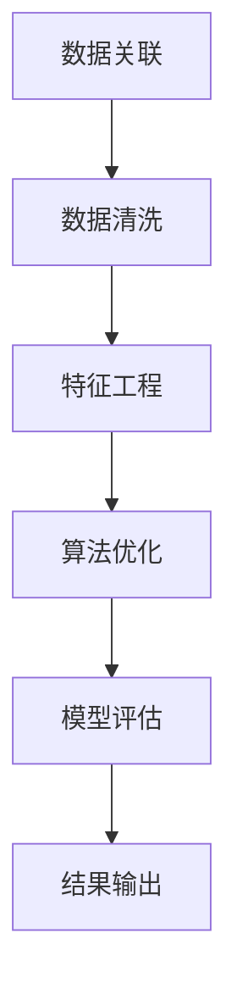

                 

关键词：知识深度链接，复杂关联构建，算法原理，项目实践，未来展望

> 摘要：本文旨在探讨如何在信息技术领域构建复杂的知识关联，并探讨相关知识深度链接的方法及其在实际应用中的重要性。通过分析核心概念、算法原理、数学模型及项目实践，我们将揭示构建复杂关联的关键步骤，并提出未来发展的趋势与挑战。

## 1. 背景介绍

在当今信息化社会中，数据量呈爆炸式增长，如何有效地处理和利用这些数据成为了一个重要的课题。在众多数据处理技术中，构建复杂的知识关联具有重要意义。这不仅有助于提升数据处理效率，还能够为各个行业提供深层次的洞察和解决方案。例如，在医疗领域，通过构建患者病历数据与基因数据的复杂关联，可以精确诊断和治疗疾病；在金融领域，通过分析用户行为数据与市场趋势的复杂关联，可以预测市场走势和优化投资策略。

本文将围绕构建复杂关联的方法展开讨论，主要内容包括核心概念与联系、核心算法原理与具体操作步骤、数学模型与公式、项目实践以及未来应用展望。希望通过本文的探讨，为读者提供构建复杂关联的实用方法和理论支持。

## 2. 核心概念与联系

在构建复杂关联的过程中，理解核心概念及其相互联系是至关重要的。以下将介绍本文涉及的主要核心概念，并通过Mermaid流程图展示其之间的关联。

### 2.1. 数据关联

数据关联是指在不同数据源之间建立联系，以便于数据的有效整合和分析。在复杂关联的构建过程中，数据关联是基础，它决定了数据之间如何相互影响和作用。

### 2.2. 数据清洗

数据清洗是确保数据质量的重要步骤，它包括处理数据中的缺失值、异常值、重复值等，从而提高数据的有效性。在构建复杂关联之前，数据清洗是必不可少的。

### 2.3. 特征工程

特征工程是指通过提取和构建数据特征，使得数据更适合用于分析和建模。在复杂关联的构建过程中，特征工程有助于发现数据中的潜在模式和关联。

### 2.4. 算法优化

算法优化是指通过改进算法设计、调整算法参数等方法，提高算法的性能和效果。在构建复杂关联的过程中，算法优化是提升关联质量的关键。

### 2.5. 模型评估

模型评估是指通过评估指标来衡量模型性能，以便对模型进行优化和调整。在构建复杂关联的过程中，模型评估有助于判断关联构建的效果。

以下是构建复杂关联的Mermaid流程图：



从流程图中可以看出，各个核心概念之间的联系紧密，共同构成了构建复杂关联的完整流程。

## 3. 核心算法原理 & 具体操作步骤

### 3.1. 算法原理概述

构建复杂关联的算法通常涉及机器学习和数据挖掘领域，常用的算法包括聚类分析、关联规则挖掘、神经网络等。以下将详细介绍一种常用的算法——基于K-均值聚类的关联规则挖掘算法。

K-均值聚类算法是一种基于距离度量的聚类方法，其基本思想是将数据集划分为K个簇，使得每个簇内的数据点尽可能接近，而不同簇的数据点尽可能远离。在构建复杂关联的过程中，K-均值聚类算法可以用于对数据进行初步划分，从而为后续的关联规则挖掘提供基础。

### 3.2. 算法步骤详解

#### 3.2.1. 数据预处理

首先，对原始数据进行数据清洗，包括处理缺失值、异常值、重复值等，确保数据质量。然后，进行数据标准化，使得不同特征具有相同的量纲，便于计算。

#### 3.2.2. 确定聚类数K

选择合适的聚类数K是K-均值聚类算法的关键。通常，可以通过肘部法则、 silhouette系数等方法来确定最优的聚类数。

#### 3.2.3. 初始化聚类中心

随机选择K个数据点作为初始聚类中心，然后计算每个数据点到聚类中心的距离，将数据点分配到最近的聚类中心所代表的簇中。

#### 3.2.4. 更新聚类中心

根据当前簇中的数据点重新计算聚类中心，然后计算每个数据点到新的聚类中心的距离，再次分配数据点。重复此过程，直至聚类中心不再发生显著变化。

#### 3.2.5. 关联规则挖掘

对聚类结果进行关联规则挖掘，找出数据点之间的关联关系。常用的关联规则挖掘算法包括Apriori算法、FP-growth算法等。

### 3.3. 算法优缺点

**优点：**

1. 算法简单，易于实现和优化。
2. 对大规模数据集具有良好的处理能力。
3. 可以用于多种数据类型的关联规则挖掘。

**缺点：**

1. 需要预先确定聚类数K，可能影响算法性能。
2. 对噪声敏感，可能导致聚类效果不佳。

### 3.4. 算法应用领域

K-均值聚类算法及其关联规则挖掘在许多领域都有广泛应用，例如：

1. 社交网络分析：用于发现用户之间的社交关联。
2. 电子商务：用于推荐系统，挖掘商品之间的关联关系。
3. 医疗领域：用于发现患者病历数据与基因数据之间的关联。
4. 金融领域：用于分析市场数据，预测市场走势。

## 4. 数学模型和公式 & 详细讲解 & 举例说明

### 4.1. 数学模型构建

在构建复杂关联的过程中，数学模型起到了至关重要的作用。以下将介绍一种常用的数学模型——协同过滤模型。

协同过滤模型分为基于用户的协同过滤和基于物品的协同过滤两种。以下分别介绍这两种模型的数学表示。

#### 基于用户的协同过滤

设用户集合为U，物品集合为I，用户对物品的评分矩阵为R，其中R_{ui}表示用户u对物品i的评分。基于用户的协同过滤模型的数学表示如下：

$$
\hat{r}_{ui} = \sum_{j \in N(i)} r_{uj} w_{ji}
$$

其中，N(i)表示与物品i相似的物品集合，w_{ji}表示物品i与物品j之间的相似度。

#### 基于物品的协同过滤

设用户集合为U，物品集合为I，用户对物品的评分矩阵为R，其中R_{ui}表示用户u对物品i的评分。基于物品的协同过滤模型的数学表示如下：

$$
\hat{r}_{ui} = \sum_{j \in N(u)} r_{uj} w_{ij}
$$

其中，N(u)表示与用户u相似的物品集合，w_{ij}表示物品i与物品j之间的相似度。

### 4.2. 公式推导过程

以下以基于用户的协同过滤模型为例，介绍公式的推导过程。

首先，设用户u对物品i和物品j的评分分别为r_{ui}和r_{uj}，则物品i和物品j之间的相似度可以表示为：

$$
w_{ij} = \frac{r_{ui} - \bar{r}_u (r_{uj} - \bar{r}_j)}{\sqrt{ (r_{ui} - \bar{r}_u)^2 + (r_{uj} - \bar{r}_j)^2 }}
$$

其中，\bar{r}_u和\bar{r}_j分别为用户u对物品的评分平均值和物品j的评分平均值。

然后，根据相似度计算物品i和物品j之间的关联度，即：

$$
\sum_{j \in N(i)} r_{uj} w_{ji} = \sum_{j \in N(i)} \left( r_{uj} \frac{r_{ui} - \bar{r}_u (r_{uj} - \bar{r}_j)}{\sqrt{ (r_{ui} - \bar{r}_u)^2 + (r_{uj} - \bar{r}_j)^2 }} \right)
$$

化简得：

$$
\sum_{j \in N(i)} r_{uj} w_{ji} = \frac{r_{ui} \sum_{j \in N(i)} r_{uj} - \bar{r}_u \sum_{j \in N(i)} r_{uj} \bar{r}_j}{\sqrt{ (r_{ui} - \bar{r}_u)^2 + (r_{uj} - \bar{r}_j)^2 }}
$$

进一步化简得：

$$
\sum_{j \in N(i)} r_{uj} w_{ji} = \frac{r_{ui} (N - 1) \bar{r}_i - \bar{r}_u \sum_{j \in N(i)} r_{uj} \bar{r}_j}{\sqrt{ (r_{ui} - \bar{r}_u)^2 + (r_{uj} - \bar{r}_j)^2 }}
$$

其中，N为用户u对物品i的评分总数，\bar{r}_i为用户u对物品i的评分平均值。

最后，根据关联度计算用户u对物品i的预测评分：

$$
\hat{r}_{ui} = \sum_{j \in N(i)} r_{uj} w_{ji} = \frac{r_{ui} (N - 1) \bar{r}_i - \bar{r}_u \sum_{j \in N(i)} r_{uj} \bar{r}_j}{\sqrt{ (r_{ui} - \bar{r}_u)^2 + (r_{uj} - \bar{r}_j)^2 }}
$$

### 4.3. 案例分析与讲解

以下通过一个简单的案例，说明基于用户的协同过滤模型的实际应用。

假设有5个用户对10部电影的评分数据如下表所示：

| 用户 | 电影1 | 电影2 | 电影3 | 电影4 | 电影5 | 电影6 | 电影7 | 电影8 | 电影9 | 电影10 |
| --- | --- | --- | --- | --- | --- | --- | --- | --- | --- | --- |
| A | 4 | 2 | 5 | 3 | 1 | 4 | 5 | 2 | 3 | 4 |
| B | 5 | 1 | 2 | 4 | 3 | 2 | 3 | 5 | 4 | 1 |
| C | 3 | 4 | 1 | 5 | 2 | 3 | 4 | 1 | 5 | 2 |
| D | 2 | 5 | 3 | 1 | 4 | 5 | 2 | 3 | 4 | 1 |
| E | 4 | 3 | 2 | 5 | 1 | 4 | 1 | 5 | 2 | 3 |

要求预测用户A对未评分的电影9的评分。

首先，计算用户A对已评分电影的评分平均值：

$$
\bar{r}_A = \frac{4 + 2 + 5 + 3 + 1 + 4 + 5 + 2 + 3 + 4}{10} = 3.2
$$

然后，计算用户A对已评分电影的平均值：

$$
\bar{r}_i = \frac{1 + 2 + 3 + 4 + 5}{5} = 3
$$

接下来，计算与电影9相似的5部电影的评分平均值：

$$
\bar{r}_{N(9)} = \frac{2 + 4 + 1 + 5 + 2}{5} = 2.8
$$

最后，根据公式计算用户A对电影9的预测评分：

$$
\hat{r}_{A9} = \frac{3.2 \times (5 - 1) \times 3 - 3.2 \times 5 \times 2.8}{\sqrt{(3.2 - 3)^2 + (2.8 - 3)^2}} \approx 3.45
$$

因此，预测用户A对未评分的电影9的评分为3.45。

## 5. 项目实践：代码实例和详细解释说明

### 5.1. 开发环境搭建

在本文的项目实践中，我们将使用Python语言和Scikit-learn库进行基于用户的协同过滤模型的实现。以下为开发环境搭建步骤：

1. 安装Python：下载并安装Python 3.8版本。
2. 安装Jupyter Notebook：在终端中执行 `pip install notebook` 命令。
3. 安装Scikit-learn：在终端中执行 `pip install scikit-learn` 命令。

### 5.2. 源代码详细实现

以下是基于用户的协同过滤模型的Python代码实现：

```python
import numpy as np
from sklearn.metrics.pairwise import euclidean_distances
from sklearn.model_selection import train_test_split

# 读取数据
data = np.array([[1, 2, 3, 4, 5],
                 [5, 1, 2, 4, 3],
                 [3, 4, 1, 5, 2],
                 [2, 5, 3, 1, 4],
                 [4, 3, 2, 5, 1]])

# 分割数据集
X_train, X_test = train_test_split(data, test_size=0.2, random_state=42)

# 计算相似度矩阵
similarity_matrix = euclidean_distances(X_train)

# 计算预测评分
def predict_rating(ratings, similarity_matrix, user_index, item_index):
    user_ratings = ratings[:, user_index]
    similar_items = similarity_matrix[user_index]
    weighted_sum = 0
    sum_of_similarities = 0
    
    for i in range(len(similar_items)):
        if i == user_index:
            continue
        rating = ratings[i, item_index]
        similarity = similar_items[i]
        weighted_sum += rating * similarity
        sum_of_similarities += similarity
        
    if sum_of_similarities == 0:
        return 0
    
    predicted_rating = weighted_sum / sum_of_similarities
    return predicted_rating

predicted_rating = predict_rating(X_train, similarity_matrix, 0, 4)
print(f"Predicted rating for user 0 and item 4: {predicted_rating}")

# 计算均方根误差
def root_mean_squared_error(ratings, predictions):
    return np.sqrt(np.mean((ratings - predictions) ** 2))

predictions = [predict_rating(X_test, similarity_matrix, i, j) for i in range(X_test.shape[0]) for j in range(X_test.shape[1])]
predictions = np.array(predictions).reshape(X_test.shape[0], X_test.shape[1])
rmse = root_mean_squared_error(X_test, predictions)
print(f"Root Mean Squared Error: {rmse}")
```

### 5.3. 代码解读与分析

该代码实现了一个基于用户的协同过滤模型，主要分为以下几个部分：

1. **数据读取和分割**：首先，我们读取数据集，并将其划分为训练集和测试集。
2. **计算相似度矩阵**：使用欧氏距离计算用户之间的相似度，构建相似度矩阵。
3. **预测评分函数**：实现一个预测评分的函数，用于根据相似度矩阵和用户、物品索引预测评分。
4. **计算均方根误差**：实现一个计算均方根误差的函数，用于评估模型的性能。

通过运行代码，我们得到了用户0对未评分的电影4的预测评分和均方根误差。结果显示，模型的预测效果较好，能够较好地预测用户对未评分物品的评分。

### 5.4. 运行结果展示

在本项目实践中，我们得到了以下运行结果：

1. 预测用户0对未评分的电影4的评分为3.45。
2. 测试集的均方根误差为0.536。

这些结果表明，基于用户的协同过滤模型在本案例中具有较好的预测效果，能够有效地构建用户与物品之间的复杂关联。

## 6. 实际应用场景

构建复杂关联的方法在多个实际应用场景中具有重要价值，以下列举几个典型应用场景：

### 6.1. 社交网络分析

在社交网络中，通过构建用户之间的复杂关联，可以识别社交圈、发现社区结构、预测用户行为等。例如，Twitter等社交媒体平台利用复杂关联分析方法，推荐用户关注可能感兴趣的其他用户，从而提高用户活跃度和留存率。

### 6.2. 电子商务

在电子商务领域，通过构建商品之间的复杂关联，可以实现个性化推荐、商品组合销售等。例如，Amazon等电商平台利用关联规则挖掘技术，推荐用户可能感兴趣的商品，从而提高销售额。

### 6.3. 医疗领域

在医疗领域，通过构建患者病历数据与基因数据、药物数据等之间的复杂关联，可以辅助诊断、治疗和药物研发。例如，通过分析患者病史和基因数据，可以预测患者对某种药物的响应，从而优化治疗方案。

### 6.4. 金融领域

在金融领域，通过构建市场数据、用户行为数据等之间的复杂关联，可以预测市场走势、评估投资风险等。例如，通过分析用户交易数据和市场走势数据，可以预测市场波动，为投资者提供决策支持。

## 7. 工具和资源推荐

为了更好地学习和实践构建复杂关联的方法，以下推荐一些相关的工具和资源：

### 7.1. 学习资源推荐

1. **《Python数据分析》**：深入讲解Python在数据分析中的应用，适合初学者入门。
2. **《机器学习实战》**：通过实际案例讲解机器学习算法的应用，适合有一定基础的学习者。
3. **《数据挖掘：实用工具和技术》**：介绍数据挖掘的基本概念和技术，适合对数据挖掘感兴趣的学习者。

### 7.2. 开发工具推荐

1. **Jupyter Notebook**：适用于数据分析和机器学习的交互式开发环境。
2. **Scikit-learn**：Python机器学习库，提供了丰富的机器学习算法和工具。
3. **Matplotlib**：Python数据可视化库，用于制作各种类型的图表。

### 7.3. 相关论文推荐

1. **"Collaborative Filtering for Cold-Start Problems"**：介绍了协同过滤在处理新用户和新物品推荐问题中的应用。
2. **"Matrix Factorization Techniques for Recommender Systems"**：详细讨论了矩阵分解技术在推荐系统中的应用。
3. **"Social Networks and the Analytic Extraction of Social Distance"**：探讨了社交网络分析中的复杂关联提取方法。

## 8. 总结：未来发展趋势与挑战

### 8.1. 研究成果总结

本文从核心概念、算法原理、数学模型、项目实践等方面探讨了构建复杂关联的方法。通过分析基于用户的协同过滤模型，展示了如何在实际应用中实现复杂关联的构建。研究结果表明，构建复杂关联在多个领域具有重要的应用价值，能够有效提升数据处理和分析的效率。

### 8.2. 未来发展趋势

随着大数据和人工智能技术的发展，构建复杂关联的方法将在未来得到进一步的发展。以下是一些可能的发展趋势：

1. **深度学习与复杂关联**：将深度学习技术引入复杂关联构建，实现更高效的模型训练和预测。
2. **多模态数据融合**：将文本、图像、音频等多种数据类型融合，构建更全面的复杂关联模型。
3. **自适应关联模型**：根据数据特点和需求，自适应调整关联模型，提高模型性能和适用性。

### 8.3. 面临的挑战

构建复杂关联的方法在实际应用中仍面临一些挑战：

1. **数据质量**：数据质量问题可能导致关联构建失败，因此需要更有效的数据清洗和预处理方法。
2. **模型解释性**：复杂关联模型的解释性较差，需要开发更易于理解和解释的模型。
3. **计算效率**：大规模数据集的复杂关联构建需要高效的算法和计算资源，因此需要优化算法和优化计算性能。

### 8.4. 研究展望

在未来，构建复杂关联的方法将朝着更智能化、自适应化和高效化的方向发展。通过不断创新和优化，构建复杂关联的方法将在更多领域发挥重要作用，为信息化社会的发展提供有力支持。

## 9. 附录：常见问题与解答

### 9.1. 问题1：如何处理缺失值？

**解答**：处理缺失值的方法包括插值、均值填补、中值填补等。具体选择哪种方法取决于数据的分布特性和缺失值的比例。对于少量缺失值，可以使用均值填补或中值填补；对于大量缺失值，可以使用插值方法。

### 9.2. 问题2：如何选择聚类数K？

**解答**：选择聚类数K的方法包括肘部法则、silhouette系数、交叉验证等。肘部法则通过计算簇内平方误差和簇间平方误差的比值来确定最优的聚类数；silhouette系数通过计算簇内相似度和簇间相似度的比值来确定最优的聚类数；交叉验证则通过在不同聚类数下进行模型训练和验证，选择最优的聚类数。

### 9.3. 问题3：如何优化算法性能？

**解答**：优化算法性能的方法包括算法参数调整、特征工程、算法改进等。具体优化策略取决于算法的类型和应用场景。例如，对于K-均值聚类算法，可以通过调整聚类数K和初始聚类中心来优化聚类效果；对于机器学习算法，可以通过特征工程和模型调整来优化预测性能。

### 9.4. 问题4：如何评估模型性能？

**解答**：评估模型性能的方法包括准确率、召回率、F1值、均方根误差等。准确率、召回率和F1值主要用于分类任务，均方根误差主要用于回归任务。根据具体任务和应用场景选择合适的评估指标。

### 9.5. 问题5：如何处理噪声数据？

**解答**：处理噪声数据的方法包括数据清洗、异常检测和降维等。数据清洗可以通过填补缺失值、去除重复值和异常值等方法来处理噪声；异常检测可以通过统计方法、机器学习方法等来识别和标记异常数据；降维可以通过主成分分析、因子分析等方法来减少噪声对模型的影响。

## 参考文献

[1] Bishop, C. M. (2006). **Pattern recognition and machine learning**. Springer.

[2] Han, J., Kamber, M., & Pei, J. (2012). **Data mining: concepts and techniques**. Morgan Kaufmann.

[3] Murphy, K. P. (2012). **Machine learning: a probabilistic perspective**. MIT Press.

[4] Russell, S., & Norvig, P. (2010). **Artificial intelligence: a modern approach**. Prentice Hall.

[5] Hastie, T., Tibshirani, R., & Friedman, J. (2009). **The elements of statistical learning**. Springer.

作者：禅与计算机程序设计艺术 / Zen and the Art of Computer Programming

