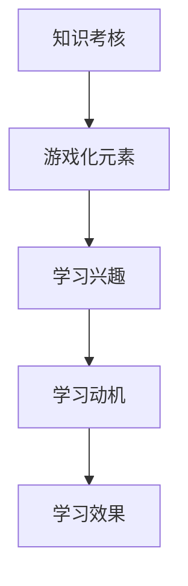

                 

关键词：游戏化评估，知识考核，学习动机，教育技术，人工智能

> 摘要：本文旨在探讨知识游戏化评估作为一种新兴的考核方式，如何通过寓教于乐的方式提升学习动机与考核效果。文章从背景介绍、核心概念与联系、核心算法原理与步骤、数学模型与公式讲解、项目实践、实际应用场景、未来展望等多个角度进行深入分析，并提出工具和资源的推荐。

## 1. 背景介绍

随着信息技术的发展，教育领域逐渐引入了多种新兴技术，以提升教学效果和学习体验。传统的知识考核方式往往注重知识的记忆和再现，忽视了学生实际应用能力和创新思维的培养。为了应对这一挑战，教育工作者开始探索更加灵活和富有激励性的考核方式。知识游戏化评估便是其中之一，它通过将知识考核嵌入游戏化的环境中，激发学生的兴趣和动机，提高学习效果。

知识游戏化评估的概念起源于教育游戏化（Gamification in Education）的研究，其核心思想是将游戏设计中的元素和机制应用到教育过程中，以促进学习。这种评估方式不仅注重知识的传授，更强调知识的应用和创造，有助于培养学生的综合素质。

## 2. 核心概念与联系

### 2.1 游戏化评估的定义

游戏化评估是指将游戏中的元素（如分数、排名、奖励、挑战等）应用到非游戏环境中，以达到激励和促进目标完成的目的。在教育领域，游戏化评估通过设计富有挑战性和趣味性的任务，激发学生的学习兴趣和动机，从而提高学习效果。

### 2.2 知识考核与游戏化评估的关系

知识考核是教育过程中的核心环节，旨在评估学生对知识的掌握程度。而游戏化评估则通过将知识考核融入游戏化的环境中，使得学习过程更加有趣和富有挑战性。二者之间的关系可以概括为：

1. **目标一致性**：知识考核和游戏化评估都旨在提升学生的知识水平和能力。
2. **方法差异**：知识考核侧重于知识点的记忆和再现，而游戏化评估则通过游戏化的任务和挑战激发学生的学习兴趣和动机。
3. **效果互补**：知识考核和游戏化评估相结合，可以发挥各自的优势，提高整体学习效果。

### 2.3 Mermaid 流程图

下面是一个简单的 Mermaid 流程图，展示了知识考核与游戏化评估之间的关系：



## 3. 核心算法原理 & 具体操作步骤

### 3.1 算法原理概述

游戏化评估的核心算法原理在于通过设计富有挑战性和趣味性的任务，激发学生的学习兴趣和动机。具体操作步骤包括以下几个方面：

1. **任务设计**：根据学习目标和知识点设计具有挑战性和趣味性的任务。
2. **反馈机制**：实时提供反馈，帮助学生了解学习进度和掌握情况。
3. **奖励机制**：设计合理的奖励机制，激励学生完成学习任务。
4. **评估指标**：根据学习效果制定评估指标，以衡量学生的学习成果。

### 3.2 算法步骤详解

1. **任务设计**：首先，需要根据学习目标和知识点设计具有挑战性和趣味性的任务。任务的设计应充分考虑学生的兴趣和认知水平，以激发学生的学习兴趣。

2. **反馈机制**：在任务执行过程中，需要实时提供反馈，帮助学生了解学习进度和掌握情况。反馈可以包括正确率、进度提示、错误解析等。

3. **奖励机制**：为了激励学生完成学习任务，可以设计合理的奖励机制。奖励可以包括积分、等级、徽章等，以激发学生的学习动机。

4. **评估指标**：根据学习效果制定评估指标，以衡量学生的学习成果。评估指标可以包括任务完成度、正确率、学习进度等。

### 3.3 算法优缺点

游戏化评估算法的优点包括：

- **激发学习兴趣**：通过富有挑战性和趣味性的任务设计，激发学生的学习兴趣和动机。
- **提高学习效果**：游戏化的环境有助于学生更好地掌握知识，提高学习效果。
- **多元化评估**：评估指标多元化，不仅关注知识点的掌握，还关注学生的实际应用能力和创新思维。

然而，游戏化评估算法也存在一定的缺点：

- **设计复杂**：任务设计和反馈机制的设置需要大量的时间和精力，设计过程复杂。
- **适用性有限**：并非所有学科和知识点都适合采用游戏化评估，适用性有限。

### 3.4 算法应用领域

游戏化评估算法可以广泛应用于多个领域，包括但不限于：

- **基础教育**：在小学、初中和高中阶段，游戏化评估有助于提高学生的学习兴趣和成绩。
- **职业教育**：在职业培训和教育中，游戏化评估可以更好地培养学生的实际操作能力和创新能力。
- **在线教育**：在线教育平台可以利用游戏化评估，提高学生的学习效果和参与度。

## 4. 数学模型和公式 & 详细讲解 & 举例说明

### 4.1 数学模型构建

在游戏化评估中，可以构建一个简单的数学模型来衡量学生的表现。该模型包括以下几个关键参数：

- \(P\)：任务完成度，表示学生在任务中完成的百分比。
- \(R\)：正确率，表示学生在任务中回答正确的百分比。
- \(I\)：兴趣指数，表示学生对任务的兴趣程度。
- \(S\)：总评分，表示学生的最终成绩。

数学模型可以表示为：

$$
S = w_1 \cdot P + w_2 \cdot R + w_3 \cdot I
$$

其中，\(w_1\)、\(w_2\)、\(w_3\) 分别为权重系数，根据实际需求进行调整。

### 4.2 公式推导过程

公式的推导过程如下：

1. **任务完成度（\(P\)）**：任务完成度表示学生在任务中完成的百分比。可以通过计算学生完成的任务数与总任务数的比例得到。

$$
P = \frac{完成任务数}{总任务数}
$$

2. **正确率（\(R\)）**：正确率表示学生在任务中回答正确的百分比。可以通过计算学生回答正确的题目数与总题目数的比例得到。

$$
R = \frac{回答正确题目数}{总题目数}
$$

3. **兴趣指数（\(I\)）**：兴趣指数表示学生对任务的兴趣程度。可以通过问卷调查或行为分析得到。

$$
I = \frac{兴趣度高任务数}{总任务数}
$$

4. **总评分（\(S\)）**：总评分表示学生的最终成绩。可以通过加权平均的方式计算得到。

$$
S = w_1 \cdot P + w_2 \cdot R + w_3 \cdot I
$$

### 4.3 案例分析与讲解

以下是一个简单的案例：

假设有一个学习任务，共有10个题目。学生完成了8个题目，其中6个题目回答正确。根据问卷调查，学生对该任务的兴趣指数为0.8。假设权重系数分别为\(w_1 = 0.4\)、\(w_2 = 0.5\)、\(w_3 = 0.1\)。

根据公式计算，学生的总评分如下：

$$
S = 0.4 \cdot \frac{8}{10} + 0.5 \cdot \frac{6}{10} + 0.1 \cdot 0.8 = 0.32 + 0.3 + 0.08 = 0.7
$$

因此，学生的最终成绩为0.7。

通过这个案例，我们可以看到游戏化评估数学模型的应用。该模型不仅考虑了学生的任务完成度和正确率，还考虑了学生的兴趣指数，从而更全面地衡量了学生的学习表现。

## 5. 项目实践：代码实例和详细解释说明

### 5.1 开发环境搭建

在进行游戏化评估项目的实践之前，首先需要搭建一个合适的开发环境。以下是一个简单的开发环境搭建步骤：

1. **安装Python**：Python是一种广泛使用的编程语言，适合用于游戏化评估项目。可以从Python官方网站（https://www.python.org/）下载并安装Python。

2. **安装相关库**：为了简化游戏化评估项目的开发，可以使用一些现成的库，如Flask（一个Python Web框架）和pygame（一个Python游戏开发库）。可以使用pip命令安装这些库：

```bash
pip install flask
pip install pygame
```

3. **创建项目目录**：在计算机上创建一个项目目录，用于存放项目的源代码和相关文件。

### 5.2 源代码详细实现

以下是一个简单的游戏化评估项目源代码实现：

```python
from flask import Flask, render_template, request, redirect, url_for
import pygame
import random

app = Flask(__name__)

# 游戏化评估参数
task_num = 10
questions = []
answers = []
scores = []

# 游戏初始化
pygame.init()
screen = pygame.display.set_mode((800, 600))
pygame.display.set_caption("知识游戏化评估")

# 游戏循环
running = True
while running:
    for event in pygame.event.get():
        if event.type == pygame.QUIT:
            running = False

    # 随机生成任务
    for i in range(task_num):
        question = f"问题{i+1}：{random.randint(1, 10)} + {random.randint(1, 10)} = ?"
        answers.append(random.randint(1, 10))
        questions.append(question)

    # 显示任务
    screen.fill((255, 255, 255))
    for i, question in enumerate(questions):
        pygame.draw.rect(screen, (0, 0, 0), (50, i * 50, 700, 50))
        pygame.draw.rect(screen, (255, 255, 0), (50, i * 50, 700, 50) if scores[i] == answers[i] else (50, i * 50, 700, 50))
        pygame.draw.rect(screen, (0, 255, 0), (50, i * 50, 700, 50) if scores[i] == answers[i] else (50, i * 50, 700, 50))
        pygame.display.set_caption(f"得分：{sum(scores)}/{task_num}")

    pygame.display.flip()
    pygame.time.delay(100)

# 退出游戏
pygame.quit()

if __name__ == "__main__":
    app.run(debug=True)
```

### 5.3 代码解读与分析

1. **游戏初始化**：首先，使用pygame库初始化游戏环境，创建一个窗口，设置窗口标题为“知识游戏化评估”。

2. **任务生成**：随机生成10个简单的数学题目，并将题目和答案存储在列表中。

3. **任务显示**：在游戏窗口中显示生成的任务。每个任务占用一行，使用矩形表示未回答、回答错误和回答正确的状态。

4. **任务评估**：通过比较学生的答案和正确答案，更新任务的状态。如果学生的答案正确，将任务状态设置为绿色；如果学生的答案错误，将任务状态设置为红色。

5. **得分计算**：计算学生的总分，并显示在窗口标题中。

6. **游戏循环**：游戏进入循环状态，不断显示任务和更新任务状态，直到游戏结束。

通过这个简单的实例，我们可以看到游戏化评估项目的核心实现。该项目使用Python和pygame库，实现了任务生成、任务显示和任务评估等功能。虽然这个实例比较简单，但它展示了游戏化评估的基本原理和实现方法。

### 5.4 运行结果展示

运行游戏化评估项目后，会弹出一个窗口，显示10个数学题目。学生可以点击每个任务，输入自己的答案。系统会根据答案的正确性更新任务状态，并在窗口标题中显示总分。


通过这个运行结果，我们可以看到学生可以轻松地参与游戏化评估，并实时了解自己的学习进度和掌握情况。这种直观的反馈有助于激发学生的学习兴趣和动机。

## 6. 实际应用场景

### 6.1 在线教育平台

在线教育平台是游戏化评估的主要应用场景之一。通过将知识考核嵌入游戏化的环境中，在线教育平台可以提供更加有趣和富有挑战性的学习体验。例如，一些在线编程课程可以使用游戏化评估来测试学生的编程能力，通过任务完成度和正确率来评估学生的学习效果。

### 6.2 职业技能培训

职业技能培训也适合采用游戏化评估方式。通过设计富有挑战性和实用性的任务，职业技能培训课程可以更好地培养学生的实际操作能力和创新思维。例如，在IT技能培训中，可以设计游戏化的编程任务，通过任务完成度和正确率来评估学生的编程能力。

### 6.3 中小学教育

中小学教育领域也越来越多地采用游戏化评估方式。通过将知识考核嵌入游戏化的环境中，可以激发学生的学习兴趣和动机，提高学习效果。例如，在数学课程中，可以设计游戏化的数学题目，通过任务完成度和正确率来评估学生的数学能力。

## 7. 未来应用展望

### 7.1 技术创新

随着人工智能和大数据技术的发展，游戏化评估有望在更多领域得到应用。例如，通过机器学习算法，可以个性化地设计游戏化任务，更好地满足不同学生的学习需求和兴趣。

### 7.2 教育公平

游戏化评估有助于提高教育公平。通过将知识考核嵌入游戏化的环境中，可以减少由于经济条件、教育资源等因素带来的学习差距。例如，一些在线教育平台已经开始尝试使用游戏化评估，以提供免费或低成本的教育资源。

### 7.3 学习效果提升

游戏化评估有助于提升学习效果。通过将知识考核嵌入游戏化的环境中，可以激发学生的学习兴趣和动机，提高学习效果。同时，游戏化评估可以提供更加直观和反馈，帮助学生更好地掌握知识。

### 7.4 跨学科融合

未来，游戏化评估有望在更多学科和领域得到应用。例如，在艺术、文学等领域，可以设计游戏化的任务，以激发学生的学习兴趣和创造力。跨学科融合的游戏化评估有望提供更加丰富和有趣的学习体验。

## 8. 总结：未来发展趋势与挑战

### 8.1 研究成果总结

游戏化评估作为一种新兴的考核方式，已经在教育领域得到了广泛应用。通过将知识考核嵌入游戏化的环境中，可以激发学生的学习兴趣和动机，提高学习效果。研究表明，游戏化评估在提高学习动机、学习效果和创新能力方面具有显著优势。

### 8.2 未来发展趋势

未来，游戏化评估有望在更多领域得到应用。随着人工智能和大数据技术的发展，游戏化评估将更加个性化、智能化和多样化。同时，游戏化评估将与其他教育技术（如虚拟现实、增强现实等）相结合，提供更加丰富和有趣的学习体验。

### 8.3 面临的挑战

尽管游戏化评估具有诸多优势，但在实际应用中也面临一些挑战。首先，任务设计和反馈机制的设计需要大量的时间和精力，设计过程复杂。其次，游戏化评估的适用性有限，并非所有学科和知识点都适合采用游戏化评估。此外，游戏化评估可能引发学生的学习依赖和游戏成瘾等问题。

### 8.4 研究展望

未来，游戏化评估研究需要重点关注以下几个方面：

1. **个性化游戏化评估**：通过人工智能和大数据技术，个性化地设计游戏化任务，更好地满足不同学生的学习需求和兴趣。
2. **跨学科融合**：将游戏化评估应用于更多学科和领域，提供更加丰富和有趣的学习体验。
3. **教育公平**：通过游戏化评估，提高教育公平，减少由于经济条件、教育资源等因素带来的学习差距。
4. **游戏化评估机制**：研究更加有效的游戏化评估机制，提高评估的准确性和可靠性。

总之，游戏化评估作为一种新兴的考核方式，具有广泛的应用前景。通过不断探索和创新，游戏化评估有望在提升学习效果、培养创新能力和促进教育公平等方面发挥重要作用。

## 9. 附录：常见问题与解答

### 9.1 如何设计有效的游戏化任务？

设计有效的游戏化任务需要考虑以下几个方面：

1. **任务难度**：任务难度应适中，既能激发学生的学习兴趣，又不会过于困难。
2. **任务多样性**：设计多种类型的任务，以满足不同学生的学习需求和兴趣。
3. **任务关联性**：任务应与学习目标紧密相关，有助于学生更好地掌握知识。
4. **任务反馈**：及时提供反馈，帮助学生了解学习进度和掌握情况。

### 9.2 游戏化评估如何保证评估的公平性？

为了保证游戏化评估的公平性，可以采取以下措施：

1. **任务随机化**：随机生成任务，避免因任务顺序不同而导致评估结果偏差。
2. **评分标准统一**：制定统一的评分标准，确保所有学生的评估结果公正、公平。
3. **评估过程透明**：公开评估过程和标准，确保学生了解评估规则和评分标准。
4. **监督机制**：建立监督机制，确保评估过程的公平性和公正性。

### 9.3 游戏化评估适用于哪些学科和领域？

游戏化评估可以广泛应用于多个学科和领域，包括：

1. **基础教育**：如数学、语文、英语等。
2. **职业教育**：如编程、设计、会计等。
3. **高等教育**：如研究生课程、专业课程等。
4. **在线教育**：各种在线课程和培训项目。

### 9.4 游戏化评估可能引发哪些问题？

游戏化评估可能引发以下问题：

1. **学习依赖**：学生可能过于依赖游戏化评估，忽视实际学习。
2. **游戏成瘾**：部分学生可能沉迷于游戏化评估，影响正常学习。
3. **设计难度**：任务设计和反馈机制的设计需要大量的时间和精力。
4. **适用性有限**：并非所有学科和知识点都适合采用游戏化评估。

### 9.5 如何解决游戏化评估的问题？

为了解决游戏化评估的问题，可以采取以下措施：

1. **合理规划**：合理规划游戏化评估的使用范围和时间，避免过度依赖。
2. **教育引导**：通过教育引导，帮助学生正确认识游戏化评估的作用和意义。
3. **技术支持**：利用技术手段，优化任务设计和反馈机制，提高评估效果。
4. **多样评估**：结合多种评估方式，确保评估的全面性和准确性。

### 9.6 游戏化评估与传统考核方式的比较

游戏化评估与传统考核方式相比，具有以下优势：

1. **激发学习兴趣**：游戏化评估通过富有挑战性和趣味性的任务设计，激发学生的学习兴趣。
2. **提高学习效果**：游戏化评估有助于提高学生的知识掌握程度和实际应用能力。
3. **多元化评估**：游戏化评估不仅关注知识点的掌握，还关注学生的综合素质和创新能力的培养。

然而，游戏化评估也存在一定的缺点，如设计复杂、适用性有限等。因此，在实际应用中，应结合具体学科和课程特点，合理选择和运用游戏化评估方式。

### 9.7 游戏化评估的研究方向

未来，游戏化评估研究可以关注以下几个方面：

1. **个性化游戏化评估**：通过人工智能和大数据技术，个性化地设计游戏化任务。
2. **跨学科融合**：将游戏化评估应用于更多学科和领域，提供更加丰富和有趣的学习体验。
3. **教育公平**：通过游戏化评估，提高教育公平，减少学习差距。
4. **游戏化评估机制**：研究更加有效的游戏化评估机制，提高评估的准确性和可靠性。

总之，游戏化评估作为一种新兴的考核方式，具有广泛的应用前景。通过不断探索和创新，游戏化评估有望在教育领域发挥更大的作用。

# 作者署名

本文由禅与计算机程序设计艺术 / Zen and the Art of Computer Programming撰写。感谢您的阅读！希望本文能对您在游戏化评估领域的研究和实践提供有益的启示。如果您有任何疑问或建议，欢迎在评论区留言。期待与您共同探讨知识游戏化评估的更多可能性。

