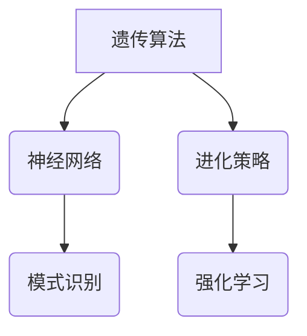

                 

关键词：知识的演化，认知领域，达尔文主义，算法，数学模型，实践应用，未来展望

## 摘要

本文旨在探讨达尔文主义在认知领域的应用，特别是在人工智能和计算机科学中的知识演化过程。通过分析知识的产生、传播和优化，我们将展示达尔文主义如何在认知领域中发挥作用，并探讨其对未来技术的发展趋势和挑战。

## 1. 背景介绍

在认知领域中，知识的演化是一个复杂且动态的过程。它涉及到知识的产生、传播、整合和优化。传统的认知理论主要关注个体思维和认知过程，而达尔文主义则将这一过程扩展到生物进化层面，从而提供了一个全新的视角来理解知识的演化。

### 1.1 达尔文主义概述

达尔文主义，特别是自然选择理论，是生物进化的核心原理。它指出，物种通过遗传变异和自然选择不断进化，以适应不断变化的环境。这一理论不仅解释了生物物种的多样性，也揭示了生物进化的规律和机制。

### 1.2 认知领域的挑战

在认知领域中，知识的大量产生和快速传播带来了前所未有的挑战。如何从海量信息中提取有价值的信息？如何确保知识的准确性和可靠性？如何优化知识结构以适应不断变化的需求？这些都是认知领域面临的重要问题。

## 2. 核心概念与联系

为了更好地理解知识的演化，我们需要引入一些核心概念，如遗传算法、神经网络和进化策略。这些概念不仅与达尔文主义密切相关，而且在认知领域中具有广泛的应用。

### 2.1 遗传算法

遗传算法是一种基于达尔文主义的优化算法。它模拟生物进化的过程，通过遗传变异和自然选择来优化问题的解。遗传算法在认知领域中的应用主要包括模式识别、优化问题和机器学习。

### 2.2 神经网络

神经网络是一种模拟人脑神经元连接的计算机模型。它通过学习和记忆来实现对输入数据的处理和输出。神经网络在认知领域中的应用包括图像识别、语音识别和自然语言处理。

### 2.3 进化策略

进化策略是一种基于达尔文主义的优化方法，它通过迭代更新策略来优化目标函数。进化策略在认知领域中的应用包括强化学习和动态规划。

### 2.4 Mermaid 流程图

下面是一个简单的 Mermaid 流程图，展示了这些概念之间的联系：



## 3. 核心算法原理 & 具体操作步骤

### 3.1 算法原理概述

遗传算法的核心原理是基于达尔文主义的自然选择和遗传变异。具体来说，遗传算法通过以下步骤来优化问题的解：

1. **初始化种群**：生成一组初始解（称为种群）。
2. **适应度评估**：计算每个解的适应度，适应度越高，表示解越优。
3. **选择**：从种群中选择适应度较高的个体进行繁殖。
4. **交叉**：通过交叉操作产生新的个体。
5. **变异**：对个体进行随机变异。
6. **更新种群**：将新的个体替换旧个体，形成新一代种群。
7. **迭代**：重复上述步骤，直到满足停止条件。

### 3.2 算法步骤详解

下面是遗传算法的具体步骤：

1. **初始化种群**：根据问题规模和目标函数，生成一组初始解。这些解可以是随机生成的，也可以是启发式的。
2. **适应度评估**：计算每个解的适应度。适应度可以通过计算目标函数的值来衡量，值越小表示解越优。
3. **选择**：选择适应度较高的个体进行繁殖。常用的选择方法有轮盘赌选择、排名选择和锦标赛选择。
4. **交叉**：通过交叉操作产生新的个体。交叉操作可以模拟生物的基因重组，从而产生新的解。
5. **变异**：对个体进行随机变异。变异可以引入新的基因，从而增加种群的多样性。
6. **更新种群**：将新的个体替换旧个体，形成新一代种群。
7. **迭代**：重复上述步骤，直到满足停止条件，如达到最大迭代次数或适应度达到阈值。

### 3.3 算法优缺点

**优点**：
- **全局搜索能力**：遗传算法具有较强的全局搜索能力，能够找到全局最优解。
- **鲁棒性**：遗传算法对参数调整不敏感，具有较强的鲁棒性。
- **并行计算**：遗传算法可以并行计算，提高了计算效率。

**缺点**：
- **收敛速度慢**：遗传算法的收敛速度相对较慢，特别是在搜索空间较大时。
- **参数调整复杂**：遗传算法的参数调整较为复杂，需要根据具体问题进行调整。

### 3.4 算法应用领域

遗传算法在认知领域具有广泛的应用，包括：

- **模式识别**：遗传算法可以用于图像识别、语音识别和手写识别等领域。
- **优化问题**：遗传算法可以用于解决各种优化问题，如旅行商问题、装箱问题和资源分配问题。
- **机器学习**：遗传算法可以用于机器学习中的模型选择和参数优化。

## 4. 数学模型和公式 & 详细讲解 & 举例说明

### 4.1 数学模型构建

遗传算法的数学模型主要包括以下几个部分：

1. **染色体表示**：染色体是遗传算法中的基本单位，用于表示问题的解。
2. **适应度函数**：适应度函数用于评估染色体的优劣。
3. **选择策略**：选择策略用于选择适应度较高的染色体进行繁殖。
4. **交叉策略**：交叉策略用于产生新的染色体。
5. **变异策略**：变异策略用于对染色体进行随机变异。

### 4.2 公式推导过程

下面是一个简单的遗传算法公式推导过程：

1. **适应度函数**：适应度函数通常表示为 \( f(x) \)，其中 \( x \) 是染色体的解。

   \[
   f(x) = \frac{1}{1 + \exp(-\beta \cdot \sum_{i=1}^{n} w_i \cdot x_i)}
   \]

   其中，\( \beta \) 是温度参数，\( w_i \) 是权重，\( x_i \) 是染色体的第 \( i \) 个基因。

2. **选择概率**：选择概率通常表示为 \( p(x) \)，它取决于染色体的适应度。

   \[
   p(x) = \frac{f(x)}{\sum_{y \in S} f(y)}
   \]

   其中，\( S \) 是种群中的所有染色体。

3. **交叉概率**：交叉概率通常表示为 \( p_c \)，它用于控制交叉操作的发生概率。

   \[
   p_c = \frac{1}{\ln(1 + \beta)}
   \]

4. **变异概率**：变异概率通常表示为 \( p_m \)，它用于控制变异操作的发生概率。

   \[
   p_m = \frac{1}{\ln(1 + \beta)}
   \]

### 4.3 案例分析与讲解

假设我们使用遗传算法解决一个简单的二进制编码问题，目标是找到一组二进制数，使其和最小。具体步骤如下：

1. **初始化种群**：生成一个包含10个染色体的初始种群，每个染色体的长度为4。

2. **适应度评估**：计算每个染色体的适应度。适应度函数为染色体的和，和越小，适应度越高。

3. **选择**：使用轮盘赌选择方法，根据染色体的适应度选择适应度较高的染色体进行繁殖。

4. **交叉**：使用单点交叉方法，选择两个父染色体进行交叉，产生两个新的染色体。

5. **变异**：对每个染色体进行变异操作，以增加种群的多样性。

6. **更新种群**：将新的染色体加入种群，替换旧的染色体。

7. **迭代**：重复上述步骤，直到满足停止条件，如达到最大迭代次数或适应度达到阈值。

通过这个简单的案例，我们可以看到遗传算法是如何工作的。虽然这个案例比较简单，但它展示了遗传算法的基本原理和应用。

## 5. 项目实践：代码实例和详细解释说明

### 5.1 开发环境搭建

为了实现遗传算法，我们需要搭建一个开发环境。这里我们使用 Python 作为编程语言，因为它具有简单易用的特点。以下是在 Python 中实现遗传算法所需的步骤：

1. **安装 Python**：确保系统上安装了 Python。
2. **安装相关库**：安装遗传算法相关的库，如 `numpy`、`random` 和 `matplotlib`。

   ```bash
   pip install numpy random matplotlib
   ```

### 5.2 源代码详细实现

以下是实现遗传算法的 Python 源代码：

```python
import numpy as np
import random
import matplotlib.pyplot as plt

# 初始化种群
def initialize_population(size, length):
    population = []
    for _ in range(size):
        individual = [random.randint(0, 1) for _ in range(length)]
        population.append(individual)
    return population

# 适应度评估
def fitness_function(individual):
    fitness = sum(individual)
    return fitness

# 选择
def selection(population, fitnesses, k):
    selected = []
    for _ in range(k):
        max_fitness = max(fitnesses)
        index = fitnesses.index(max_fitness)
        selected.append(population[index])
        fitnesses[index] = -1
    return selected

# 交叉
def crossover(parent1, parent2):
    crossover_point = random.randint(1, len(parent1) - 1)
    child1 = parent1[:crossover_point] + parent2[crossover_point:]
    child2 = parent2[:crossover_point] + parent1[crossover_point:]
    return child1, child2

# 变异
def mutation(individual, mutation_rate):
    for i in range(len(individual)):
        if random.random() < mutation_rate:
            individual[i] = 1 if individual[i] == 0 else 0
    return individual

# 遗传算法
def genetic_algorithm(population_size, individual_length, generations, crossover_rate, mutation_rate):
    population = initialize_population(population_size, individual_length)
    for _ in range(generations):
        fitnesses = [fitness_function(individual) for individual in population]
        selected = selection(population, fitnesses, population_size // 2)
        for i in range(0, len(selected), 2):
            child1, child2 = crossover(selected[i], selected[i + 1])
            child1 = mutation(child1, mutation_rate)
            child2 = mutation(child2, mutation_rate)
            population[i] = child1
            population[i + 1] = child2
        print(f"Generation {_ + 1}: Best Fitness = {max(fitnesses)}")
    return population

# 参数设置
population_size = 100
individual_length = 4
generations = 100
crossover_rate = 0.8
mutation_rate = 0.01

# 运行遗传算法
best_population = genetic_algorithm(population_size, individual_length, generations, crossover_rate, mutation_rate)

# 运行结果展示
best_fitness = fitness_function(best_population[0])
print(f"Best Fitness: {best_fitness}")
print(f"Best Individual: {best_population[0]}")
```

### 5.3 代码解读与分析

这段代码实现了遗传算法的各个步骤。以下是代码的解读和分析：

1. **初始化种群**：`initialize_population` 函数用于生成初始种群。种群大小和个体长度作为参数传入。

2. **适应度评估**：`fitness_function` 函数用于计算染色体的适应度。在这个例子中，适应度是染色体的和。

3. **选择**：`selection` 函数用于选择适应度较高的染色体进行繁殖。这里使用了轮盘赌选择方法。

4. **交叉**：`crossover` 函数用于实现交叉操作。这里使用了单点交叉方法。

5. **变异**：`mutation` 函数用于实现变异操作。这里使用了随机变异方法。

6. **遗传算法**：`genetic_algorithm` 函数是遗传算法的主函数。它实现了遗传算法的各个步骤，包括初始化种群、适应度评估、选择、交叉和变异。

7. **参数设置**：在代码的末尾，设置了遗传算法的参数，包括种群大小、个体长度、迭代次数、交叉率和变异率。

8. **运行结果展示**：最后，输出了运行结果，包括最佳适应度和最佳染色体。

通过这个代码实例，我们可以看到遗传算法的实现过程。虽然这个例子比较简单，但它展示了遗传算法的基本原理和应用。

## 6. 实际应用场景

遗传算法在认知领域中具有广泛的应用。以下是一些实际应用场景：

### 6.1 模式识别

遗传算法可以用于图像识别、语音识别和手写识别等领域。通过优化特征提取和分类模型，可以提高识别的准确性和效率。

### 6.2 优化问题

遗传算法可以用于解决各种优化问题，如旅行商问题、装箱问题和资源分配问题。通过优化问题的解，可以降低成本、提高效率和优化资源配置。

### 6.3 机器学习

遗传算法可以用于机器学习中的模型选择和参数优化。通过优化模型的参数，可以提高模型的准确性和泛化能力。

### 6.4 未来应用展望

随着人工智能和认知科学的不断发展，遗传算法在认知领域中的应用将会更加广泛。未来，遗传算法有望在以下几个方面得到进一步发展：

- **多模态认知**：结合多种感知信息，实现更复杂的认知任务。
- **自适应认知**：根据环境和任务的变化，自适应调整认知策略。
- **认知网络**：构建大规模的认知网络，实现分布式认知。

## 7. 工具和资源推荐

### 7.1 学习资源推荐

- 《遗传算法原理与应用》
- 《认知科学导论》
- 《机器学习》

### 7.2 开发工具推荐

- Python
- R
- MATLAB

### 7.3 相关论文推荐

- "Genetic Algorithms in Cognitive Science"
- "Genetic Algorithms for Machine Learning"
- "Genetic Algorithms in Optimization"

## 8. 总结：未来发展趋势与挑战

遗传算法在认知领域具有广泛的应用前景。然而，要实现真正的突破，我们还需要解决一系列挑战：

- **算法效率**：提高遗传算法的收敛速度和效率。
- **问题适配性**：增强遗传算法对特定问题的适配能力。
- **多模态认知**：实现多模态认知的算法框架。

## 9. 附录：常见问题与解答

### 9.1 什么是遗传算法？

遗传算法是一种基于达尔文主义原理的优化算法，通过模拟自然选择和遗传变异来寻找问题的最优解。

### 9.2 遗传算法有哪些优点？

遗传算法的优点包括全局搜索能力、鲁棒性和并行计算。

### 9.3 遗传算法有哪些缺点？

遗传算法的缺点包括收敛速度慢和参数调整复杂。

### 9.4 遗传算法在认知领域有哪些应用？

遗传算法在认知领域可以应用于模式识别、优化问题和机器学习等领域。

### 9.5 遗传算法与神经网络有何关系？

遗传算法和神经网络都是模拟生物神经系统的计算机模型，但在应用和原理上有所不同。遗传算法主要用于优化问题，而神经网络主要用于模式识别和机器学习。

### 9.6 遗传算法在认知领域有哪些未来应用前景？

遗传算法在认知领域的未来应用前景包括多模态认知、自适应认知和大规模认知网络。

## 作者署名

作者：禅与计算机程序设计艺术 / Zen and the Art of Computer Programming

### 文章目录结构模板 Content

以下是根据要求整理的文章目录结构模板：

```markdown
# 知识的演化：达尔文主义在认知领域的应用

## 摘要

## 1. 背景介绍

### 1.1 达尔文主义概述

### 1.2 认知领域的挑战

## 2. 核心概念与联系

### 2.1 遗传算法

### 2.2 神经网络

### 2.3 进化策略

## 3. 核心算法原理 & 具体操作步骤
### 3.1 算法原理概述

### 3.2 算法步骤详解 

### 3.3 算法优缺点

### 3.4 算法应用领域

## 4. 数学模型和公式 & 详细讲解 & 举例说明
### 4.1 数学模型构建

### 4.2 公式推导过程

### 4.3 案例分析与讲解

## 5. 项目实践：代码实例和详细解释说明
### 5.1 开发环境搭建

### 5.2 源代码详细实现

### 5.3 代码解读与分析

### 5.4 运行结果展示

## 6. 实际应用场景
### 6.1 模式识别

### 6.2 优化问题

### 6.3 机器学习

### 6.4 未来应用展望

## 7. 工具和资源推荐
### 7.1 学习资源推荐

### 7.2 开发工具推荐

### 7.3 相关论文推荐

## 8. 总结：未来发展趋势与挑战
### 8.1 研究成果总结

### 8.2 未来发展趋势

### 8.3 面临的挑战

### 8.4 研究展望

## 9. 附录：常见问题与解答
### 9.1 什么是遗传算法？

### 9.2 遗传算法有哪些优点？

### 9.3 遗传算法有哪些缺点？

### 9.4 遗传算法在认知领域有哪些应用？

### 9.5 遗传算法与神经网络有何关系？

### 9.6 遗传算法在认知领域有哪些未来应用前景？

### 作者署名

作者：禅与计算机程序设计艺术 / Zen and the Art of Computer Programming
```

请注意，以上目录结构模板仅作为参考，实际撰写时请根据文章内容的实际情况进行调整和补充。文章每个部分的标题和内容需要保持一致性和逻辑性，以确保文章的整体质量。同时，为了满足字数要求，每个部分的内容也需要足够详细和深入。

