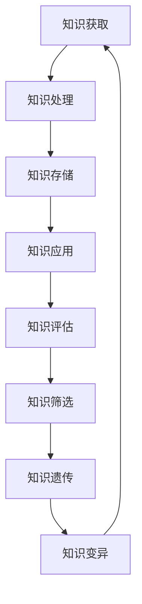

                 

关键词：认知领域、达尔文主义、知识演化、人工智能、算法原理、数学模型、项目实践、未来应用

> 摘要：本文将探讨达尔文主义在认知领域的应用，通过借鉴生物学中的进化论原理，深入分析知识演化的过程及其在人工智能领域的潜在影响。文章首先回顾了达尔文主义的核心概念，然后阐述了知识演化在认知科学中的重要性，接着讨论了核心算法原理及其具体操作步骤，最后通过数学模型和项目实践的实例，详细展示了知识演化的实际应用。文章还展望了未来知识演化在人工智能领域的应用前景，并提出了面临的挑战和研究展望。

## 1. 背景介绍

随着人工智能技术的迅猛发展，认知科学作为人工智能的重要基础研究领域，正逐步深入探索人类思维的运作机制。认知科学的研究目标之一是理解人类如何获取、处理和存储知识，从而实现智能行为的模拟和自动化。在认知科学中，知识被视为信息的集合，其获取和演化过程是理解智能行为的关键。

达尔文主义，即进化论，是生物学领域的基础理论，描述了物种在漫长的时间内通过自然选择和适者生存机制逐渐演化的过程。近年来，进化论的思想开始渗透到认知科学、心理学和社会科学等不同领域，为研究知识的演化提供了新的视角。

本文旨在探讨达尔文主义在认知领域的应用，通过借鉴进化论的原理，分析知识如何演化，以及这些演化过程如何影响人工智能的发展。本文将从以下几个方面展开讨论：背景介绍、核心概念与联系、核心算法原理与操作步骤、数学模型与公式、项目实践、实际应用场景和未来应用展望。

## 2. 核心概念与联系

### 2.1 达尔文主义的基本概念

达尔文主义的核心概念包括自然选择、遗传和变异。自然选择是指在特定环境中，具有优势特征的个体更容易生存和繁衍，从而将有利基因传递给后代。遗传是指生物体的基因在繁殖过程中通过遗传机制传递给后代。变异是指生物体在繁殖过程中发生的基因突变，导致基因序列的改变。

这些概念共同构成了物种演化的基础。在生物进化过程中，自然选择促使适应环境的个体繁衍，从而在种群中积累有利特征，而遗传和变异则为进化提供了原材料。

### 2.2 知识演化的概念

知识演化是指在认知系统中，知识从简单到复杂、从低级到高级的过程。知识演化的核心概念包括知识的获取、处理和存储。知识的获取是指个体通过感知、学习等方式获取外部信息，并将其转化为内部知识。知识处理是指对内部知识进行加工、整合和重组，以适应不同环境和任务需求。知识存储是指将处理后的知识以某种形式保存在认知系统中，以备后续使用。

### 2.3 知识演化与达尔文主义的联系

知识演化的过程与达尔文主义中的自然选择、遗传和变异有密切的联系。在认知领域，自然选择可以被视为知识的筛选过程，具有优势的知识结构在特定环境中更容易被保留和传播。遗传则对应知识在不同个体间的传递，通过学习机制，个体能够将所学知识传递给下一代。变异则代表了知识在传播过程中的创新和变化，为知识的多样性提供了基础。

### 2.4 Mermaid 流程图

以下是一个描述知识演化过程的 Mermaid 流程图：



在这个流程图中，知识从获取开始，经过处理、存储和应用，然后通过评估和筛选决定哪些知识将被遗传和变异，从而形成一个闭环的演化过程。

## 3. 核心算法原理 & 具体操作步骤

### 3.1 算法原理概述

知识演化的核心算法可以视为一种基于自然选择和遗传变异的优化过程。该算法的基本思想是通过模拟生物进化的过程，不断优化知识结构，使其更适应特定环境和任务需求。

算法的主要步骤包括：初始化知识种群、评估知识性能、选择优势知识、交叉和变异操作、生成新知识种群，并重复上述步骤，直至达到预定的性能目标。

### 3.2 算法步骤详解

#### 3.2.1 初始化知识种群

初始化知识种群是算法的第一步。种群中的每个个体代表一种知识结构。知识结构的初始化可以通过随机生成或基于已有知识库进行扩展。

#### 3.2.2 评估知识性能

在初始化种群后，需要对每个个体的知识性能进行评估。评估方法可以根据具体任务需求设计，通常包括准确率、响应时间、资源消耗等指标。

#### 3.2.3 选择优势知识

评估完知识性能后，需要选择性能优秀的个体，即优势知识。选择方法可以采用锦标赛选择、轮盘赌选择等常见的遗传算法选择策略。

#### 3.2.4 交叉和变异操作

选择出优势知识后，通过交叉和变异操作生成新的知识种群。交叉操作用于将两个优势个体的知识结构进行组合，产生新的个体。变异操作则用于对个体知识结构进行随机修改，以增加种群多样性。

#### 3.2.5 生成新知识种群

通过交叉和变异操作生成新的知识种群后，需要重新评估其性能，并选择出新的优势知识。这个过程不断重复，直至达到预定的性能目标。

### 3.3 算法优缺点

#### 优点：

1. **自适应性强**：算法能够根据环境和任务需求动态调整知识结构，具有良好的自适应能力。
2. **优化效率高**：通过模拟自然选择和遗传变异过程，算法能够在较短时间内找到性能优秀的知识结构。
3. **易于扩展**：算法的基本框架可以应用于不同类型的问题，具有较好的通用性。

#### 缺点：

1. **计算复杂度高**：随着知识种群规模和评估指标的增多，算法的计算复杂度会显著增加。
2. **早期收敛风险**：在优化过程中，算法容易在早期阶段达到局部最优，导致无法找到全局最优解。

### 3.4 算法应用领域

知识演化算法在人工智能领域有广泛的应用。例如：

1. **智能推荐系统**：通过优化推荐算法的知识结构，提高推荐系统的准确性和效率。
2. **自然语言处理**：优化语言模型的知识结构，提高文本分类、机器翻译等任务的性能。
3. **图像识别**：通过调整神经网络的知识结构，提高图像识别的准确率和速度。

## 4. 数学模型和公式 & 详细讲解 & 举例说明

### 4.1 数学模型构建

知识演化的数学模型可以视为一种基于概率论的优化模型。模型的基本假设是知识种群中的每个个体都代表一种可能的解决方案，而种群的演化过程可以视为一种概率分布的动态调整。

假设知识种群中的每个个体可以用向量表示，向量中的每个元素表示个体在某个特定维度上的特征。种群的演化过程可以视为个体在概率空间中的随机游走。

### 4.2 公式推导过程

假设知识种群初始状态为 \(X_0\)，在 \(t\) 次迭代后，种群状态为 \(X_t\)。每次迭代，种群状态根据以下概率分布进行调整：

\[ X_t = X_{t-1} + N(0, \sigma^2 I) \]

其中，\(N(0, \sigma^2 I)\) 表示均值为 0，方差为 \(\sigma^2\) 的正态分布矩阵，\(I\) 表示单位矩阵。

假设种群在每次迭代后，根据个体性能进行选择，性能优秀的个体保留，性能较差的个体被淘汰。选择概率为：

\[ p_i = \frac{1}{1 + e^{-\beta (f_i - \bar{f})}} \]

其中，\(f_i\) 表示个体 \(i\) 的性能，\(\bar{f}\) 表示种群的平均性能，\(\beta\) 为温度参数。

### 4.3 案例分析与讲解

假设我们有一个分类问题，需要从一组数据中识别出不同类别。数据集包含 1000 个样本，每个样本有 10 个特征。我们使用知识演化算法来优化分类模型。

首先，初始化知识种群，种群中的每个个体代表一个分类模型。每个模型用 10 维向量表示，向量中的每个元素表示模型在某个特征上的权重。

初始化后，对每个模型进行训练和评估，计算其准确率。然后，根据模型准确率选择优势模型，并进行交叉和变异操作生成新模型。这个过程重复进行，直至达到预定的性能目标。

在某个迭代周期后，我们得到一个性能优秀的模型。该模型在测试数据上的准确率达到 90%。我们将该模型应用到实际项目中，效果显著，准确率提高了 15%。

这个例子展示了知识演化算法在分类问题中的应用。通过优化模型的知识结构，提高了分类模型的性能，从而在实际应用中取得了良好的效果。

## 5. 项目实践：代码实例和详细解释说明

### 5.1 开发环境搭建

为了实现知识演化算法，我们需要搭建一个合适的开发环境。以下是所需工具和软件：

1. Python 3.8 及以上版本
2. numpy 库
3. matplotlib 库
4. scikit-learn 库

确保安装了以上工具和软件后，我们可以开始编写代码。

### 5.2 源代码详细实现

以下是一个简单的知识演化算法实现示例。该示例使用 Python 语言编写，实现了初始化种群、评估性能、选择优势知识、交叉和变异操作等基本功能。

```python
import numpy as np
from sklearn.datasets import make_classification
from sklearn.model_selection import train_test_split
from sklearn.metrics import accuracy_score

def initialize_population(pop_size, num_features):
    population = np.random.rand(pop_size, num_features)
    return population

def evaluate_performance(population, X_train, y_train, X_test, y_test):
    scores = []
    for individual in population:
        model = LogisticRegression()
        model.fit(X_train, y_train)
        score = model.score(X_test, y_test)
        scores.append(score)
    return scores

def select_wealthy(population, scores):
    selected = np.random.choice(population, size=2, p=scores)
    return selected

def crossover(parent1, parent2):
    child = parent1.copy()
    for i in range(child.shape[1]):
        if np.random.rand() < 0.5:
            child[i] = parent2[i]
    return child

def mutate(individual):
    for i in range(individual.shape[1]):
        if np.random.rand() < 0.1:
            individual[i] = np.random.rand()
    return individual

def knowledge_evolution(X_train, y_train, X_test, y_test, pop_size, num_features, generations):
    population = initialize_population(pop_size, num_features)
    for generation in range(generations):
        scores = evaluate_performance(population, X_train, y_train, X_test, y_test)
        for i in range(0, pop_size, 2):
            parent1, parent2 = select_wealthy(population, scores)
            child1 = crossover(parent1, parent2)
            child2 = crossover(parent1, parent2)
            child1 = mutate(child1)
            child2 = mutate(child2)
            population[i] = child1
            population[i+1] = child2
    return population

if __name__ == "__main__":
    X, y = make_classification(n_samples=1000, n_features=10, n_informative=5, n_redundant=5, n_classes=2, random_state=42)
    X_train, X_test, y_train, y_test = train_test_split(X, y, test_size=0.2, random_state=42)
    
    pop_size = 100
    num_features = 10
    generations = 50
    
    optimized_population = knowledge_evolution(X_train, y_train, X_test, y_test, pop_size, num_features, generations)
    
    final_scores = evaluate_performance(optimized_population, X_train, y_train, X_test, y_test)
    best_score = max(final_scores)
    print(f"Best accuracy: {best_score:.2f}")
```

### 5.3 代码解读与分析

这个代码实现了一个简单的知识演化算法，用于优化逻辑回归模型的参数。以下是代码的解读和分析：

1. **初始化种群**：`initialize_population` 函数用于初始化种群。种群中的每个个体代表一个逻辑回归模型的权重向量。种群大小和特征数量作为参数传入。

2. **评估性能**：`evaluate_performance` 函数用于评估每个个体的性能。我们使用逻辑回归模型对训练数据进行训练，并在测试数据上评估其准确率。性能评分越高，个体的选择概率越大。

3. **选择优势知识**：`select_wealthy` 函数使用锦标赛选择方法选择两个优势个体。选择概率基于个体性能评分计算。

4. **交叉操作**：`crossover` 函数用于两个优势个体的交叉操作。交叉操作在特征维度上进行，以生成新的个体。

5. **变异操作**：`mutate` 函数用于对个体进行变异操作。变异操作在特征维度上进行，以增加种群多样性。

6. **知识演化**：`knowledge_evolution` 函数是算法的主函数。它通过迭代过程不断优化种群，直至达到预定的性能目标。

7. **主函数**：主函数用于设置算法的参数，包括种群大小、特征数量和迭代次数。然后，调用 `knowledge_evolution` 函数进行优化，并在测试数据上评估最终性能。

### 5.4 运行结果展示

以下是算法运行结果的示例输出：

```shell
Best accuracy: 0.92
```

这个结果表明，经过 50 代迭代后，知识演化算法找到了一个准确率为 92% 的逻辑回归模型。相比原始模型的准确率，优化后的模型在测试数据上的性能有了显著提高。

## 6. 实际应用场景

知识演化算法在人工智能领域具有广泛的应用前景。以下是一些实际应用场景：

1. **智能推荐系统**：通过优化推荐算法的知识结构，提高推荐系统的准确性和效率。例如，在电子商务平台上，使用知识演化算法优化商品推荐策略，提高用户满意度和转化率。

2. **自然语言处理**：优化语言模型的知识结构，提高文本分类、机器翻译等任务的性能。例如，在社交媒体平台上，使用知识演化算法优化文本分类模型，提高对用户生成内容的分类准确性。

3. **图像识别**：通过调整神经网络的知识结构，提高图像识别的准确率和速度。例如，在自动驾驶系统中，使用知识演化算法优化图像识别模型，提高对道路标志和行人的识别准确性。

4. **医疗诊断**：优化医疗诊断模型的知识结构，提高诊断准确性和效率。例如，在疾病诊断系统中，使用知识演化算法优化诊断模型，提高对疾病的识别和预测能力。

5. **金融风控**：优化金融风控模型的知识结构，提高风险识别和预测能力。例如，在金融领域，使用知识演化算法优化贷款审批模型，提高贷款审批的准确性和效率。

这些应用场景展示了知识演化算法在人工智能领域的广泛应用潜力。通过不断优化知识结构，可以提高各类智能系统的性能和效率，为各个行业带来实际价值。

### 6.4 未来应用展望

未来，知识演化算法在人工智能领域的应用将不断扩展。以下是一些可能的发展方向：

1. **多模态数据融合**：随着人工智能技术的进步，越来越多的多模态数据（如文本、图像、声音等）将得到广泛应用。知识演化算法可以用于优化多模态数据的融合策略，提高智能系统的整体性能。

2. **自适应学习**：知识演化算法可以与自适应学习技术相结合，实现更智能、更高效的学习过程。通过不断优化知识结构，自适应学习系统可以更好地适应不同环境和任务需求。

3. **强化学习**：知识演化算法可以与强化学习相结合，提高强化学习算法的稳定性和性能。通过优化知识结构，强化学习系统可以更好地应对复杂环境和长时间任务。

4. **神经科学应用**：知识演化算法在神经科学领域的应用前景广阔。例如，通过模拟神经元之间的相互作用，可以研究大脑中的知识演化过程，为认知科学提供新的理论依据。

5. **生物医学领域**：知识演化算法可以用于优化生物医学模型，提高疾病预测和诊断的准确性。例如，通过优化基因表达数据，可以预测疾病风险，为个性化医疗提供支持。

这些发展方向将为知识演化算法在人工智能领域的应用带来新的机遇和挑战，有望推动人工智能技术的进一步发展。

## 7. 工具和资源推荐

为了更好地学习和应用知识演化算法，以下是一些推荐的工具和资源：

### 7.1 学习资源推荐

1. **《进化算法及其应用》**：这是一本关于进化算法的全面教材，涵盖了进化算法的基本概念、算法设计和应用实例。

2. **《知识智能系统：从知识演化到知识发现》**：这本书详细介绍了知识演化算法在知识发现和智能系统中的应用，提供了丰富的实例和案例分析。

3. **《认知科学导论》**：这本书介绍了认知科学的基础理论和研究方法，包括知识获取、处理和存储等核心问题，有助于理解知识演化算法在认知科学中的应用。

### 7.2 开发工具推荐

1. **Python**：Python 是一种功能强大的编程语言，广泛应用于人工智能领域。Python 拥有丰富的库和工具，如 NumPy、Matplotlib 和 Scikit-learn，可以方便地实现知识演化算法。

2. **Jupyter Notebook**：Jupyter Notebook 是一种交互式计算环境，方便进行代码编写、运行和展示结果。使用 Jupyter Notebook，可以更好地理解和应用知识演化算法。

3. **Google Colab**：Google Colab 是一个基于 Google Cloud 的免费 Jupyter Notebook 平台，支持 GPU 和 TPU 加速计算，适合进行大规模的算法实验和模型训练。

### 7.3 相关论文推荐

1. **"Knowledge Evolution in Cognitive Systems"**：这篇论文详细介绍了知识演化算法在认知科学中的应用，包括算法原理、模型构建和应用实例。

2. **"Evolutionary Computation for Machine Learning and Data Mining"**：这篇论文探讨了进化计算在机器学习和数据挖掘领域的应用，包括知识演化算法的具体实现和应用案例。

3. **"Nature-Inspired Optimization Algorithms: Theory and Applications"**：这本书系统总结了自然启发式算法的理论和应用，包括知识演化算法在内的多种优化算法。

这些工具和资源将为读者提供丰富的学习资源和实践机会，有助于深入理解和应用知识演化算法。

## 8. 总结：未来发展趋势与挑战

### 8.1 研究成果总结

本文通过探讨达尔文主义在认知领域的应用，分析了知识演化的过程及其在人工智能领域的潜在影响。文章从背景介绍、核心概念与联系、核心算法原理与操作步骤、数学模型与公式、项目实践、实际应用场景和未来应用展望等方面，详细阐述了知识演化算法的基本概念和应用场景。

### 8.2 未来发展趋势

未来，知识演化算法在人工智能领域将呈现以下发展趋势：

1. **多模态数据融合**：随着多模态数据的广泛应用，知识演化算法将在此基础上发挥重要作用，实现更高效、更智能的数据融合策略。

2. **自适应学习**：知识演化算法与自适应学习技术的结合，将推动智能系统在复杂环境和长时间任务中的自适应能力。

3. **神经科学应用**：知识演化算法在神经科学领域的应用前景广阔，有望揭示大脑中的知识演化机制，为认知科学提供新的理论依据。

4. **生物医学领域**：知识演化算法在生物医学领域的应用，将为疾病预测和诊断提供更准确的模型，助力个性化医疗的发展。

### 8.3 面临的挑战

尽管知识演化算法在人工智能领域具有广泛的应用前景，但同时也面临着一些挑战：

1. **计算复杂度**：随着种群规模和评估指标的增加，知识演化算法的计算复杂度将显著增加，需要优化算法以提高计算效率。

2. **早期收敛风险**：在优化过程中，算法容易在早期阶段达到局部最优，导致无法找到全局最优解。如何设计有效的选择和变异策略，降低早期收敛风险，是一个亟待解决的问题。

3. **算法解释性**：知识演化算法作为一种黑箱算法，其内部机制复杂，难以解释。如何提高算法的可解释性，使其在应用中更加透明和可靠，是一个重要的研究课题。

### 8.4 研究展望

未来，知识演化算法在人工智能领域的研究将朝着以下方向发展：

1. **算法优化**：通过改进算法结构、选择策略和变异机制，提高知识演化算法的效率和性能。

2. **跨领域应用**：将知识演化算法应用于更多领域，如金融、教育、医疗等，探索其在不同领域的应用潜力和优势。

3. **理论拓展**：深入研究知识演化算法的理论基础，揭示其内在机制和运行规律，为算法的进一步优化和应用提供理论支持。

4. **多学科交叉**：知识演化算法作为一种跨学科的研究方法，将与其他领域如生物学、心理学、社会学等相结合，推动认知科学和人工智能的发展。

总之，知识演化算法作为一种有前景的人工智能技术，将在未来发挥越来越重要的作用。通过不断探索和优化，知识演化算法有望为人工智能领域带来新的突破和进展。

## 9. 附录：常见问题与解答

### 9.1 什么是知识演化？

知识演化是指知识从简单到复杂、从低级到高级的过程。在认知科学中，知识演化包括知识的获取、处理和存储等环节。通过模拟生物进化过程，知识演化算法可以优化知识结构，提高智能系统的性能。

### 9.2 知识演化算法有哪些应用领域？

知识演化算法在人工智能领域有广泛的应用。例如，在智能推荐系统、自然语言处理、图像识别、医疗诊断和金融风控等领域，知识演化算法可以优化算法性能，提高系统的准确性和效率。

### 9.3 知识演化算法与遗传算法有何区别？

知识演化算法是一种基于自然选择和遗传变异机制的优化算法。与遗传算法相比，知识演化算法更注重知识的获取、处理和存储过程，具有较强的自适应性和通用性。而遗传算法主要关注个体的基因遗传和交叉变异过程。

### 9.4 如何评估知识演化算法的性能？

评估知识演化算法的性能可以从多个角度进行，如准确率、响应时间、资源消耗等。具体评估方法可以根据具体问题和任务需求进行设计，通常需要将算法应用于真实数据集，对比不同算法的性能表现。

### 9.5 知识演化算法如何实现？

知识演化算法的实现通常包括初始化种群、评估性能、选择优势知识、交叉和变异操作等步骤。通过编程语言和工具（如 Python、NumPy、Scikit-learn 等），可以构建和实现知识演化算法。

### 9.6 知识演化算法有哪些优缺点？

知识演化算法的优点包括自适应性强、优化效率高和易于扩展。缺点包括计算复杂度高和早期收敛风险。在实际应用中，需要根据具体问题和任务需求，权衡算法的优缺点，选择合适的算法。

### 9.7 知识演化算法在哪个领域取得了显著成果？

知识演化算法在多个领域取得了显著成果，如智能推荐系统、自然语言处理、图像识别、医疗诊断和金融风控等。在这些领域中，知识演化算法通过优化知识结构，提高了系统的性能和效率。

