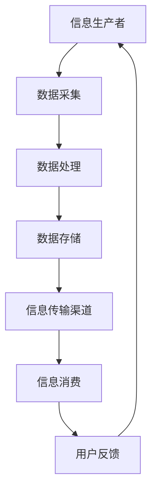

                 

 关键词：知识生态系统，信息生态平衡，计算机科学，信息管理，技术发展，算法优化，数据分析，人工智能

> 摘要：本文旨在探讨知识生态系统中的信息生态平衡问题。通过分析信息生态系统的构成和运作机制，揭示其在计算机科学和信息管理领域的重要性。文章首先介绍了信息生态系统的基本概念和核心要素，然后深入探讨其平衡机制及其在技术发展和应用中的关键作用。最后，本文提出了未来研究和实践中的挑战与展望。

## 1. 背景介绍

在当今信息化时代，计算机科学和信息技术的飞速发展使得知识的生产、传播和应用达到了前所未有的高度。然而，随着数据量的激增和复杂性的增加，信息生态系统中的平衡问题逐渐显现。如何确保信息生态系统的稳定性和可持续发展，已经成为学术界和业界共同关注的重要课题。

信息生态系统是指由信息生产者、信息消费者和信息传输渠道组成的复杂网络系统。在这个系统中，信息作为核心资源，通过数据的采集、处理、存储和传输等环节，实现价值的创造和传递。然而，信息生态系统的平衡并非自然形成，它受到多种内外部因素的影响，如技术进步、用户需求、政策法规等。

本文将从信息生态系统的基本概念入手，分析其构成和运作机制，探讨信息生态平衡的重要性。随后，本文将介绍一些核心算法和数学模型，阐述其在信息生态系统平衡中的作用。最后，本文将结合实际应用场景，探讨信息生态系统平衡的未来发展趋势与挑战。

## 2. 核心概念与联系

### 2.1 信息生态系统的基本概念

信息生态系统（Information Ecosystem）是指由信息生产者、信息消费者和信息传输渠道组成的复杂网络系统。它是一个动态的、开放的、自我调节的系统，旨在实现信息资源的有效管理和利用。

- **信息生产者**：包括政府机构、企业、学术机构和个人等，它们是信息的源头，负责数据的采集、生成和处理。

- **信息消费者**：包括企业、学术机构、公众等，它们是信息的需求方，通过信息的获取和利用实现自身的目标。

- **信息传输渠道**：包括互联网、通信网络、数据库、信息平台等，它们是信息流通的通道，保障信息的快速、准确传输。

### 2.2 信息生态系统的核心要素

信息生态系统的核心要素包括数据、算法、平台和用户。

- **数据**：数据是信息生态系统的基础资源，包括结构化数据、半结构化数据和非结构化数据。数据的质量和多样性直接影响信息生态系统的健康程度。

- **算法**：算法是信息生态系统中的智能核心，负责数据的处理、分析和挖掘，为用户提供个性化服务。

- **平台**：平台是信息生态系统的基础设施，提供数据存储、计算资源和通信服务，支撑整个系统的运行。

- **用户**：用户是信息生态系统的最终受益者，他们的需求和反馈是系统优化和发展的驱动力。

### 2.3 Mermaid 流程图

以下是一个简化的信息生态系统流程图，展示了信息生产、传输和消费的过程。



### 2.4 核心概念之间的联系

信息生态系统中的核心概念之间存在紧密的联系。数据是信息的基础，算法是信息处理的工具，平台是信息传输和处理的载体，用户是信息的最终消费者和反馈源。这些要素相互依存、相互制约，共同构成了一个动态的信息生态系统。

### 2.5 信息生态平衡的重要性

信息生态平衡是确保信息生态系统稳定运行的关键。一个失衡的信息生态系统可能导致信息过载、数据污染、隐私泄露等问题，从而影响系统的整体性能。保持信息生态平衡有助于提高信息利用效率，促进知识创新和技术进步。

## 3. 核心算法原理 & 具体操作步骤

### 3.1 算法原理概述

在信息生态系统中，算法是实现数据分析和智能处理的核心。以下将介绍几个核心算法原理及其在信息生态系统中的应用。

#### 3.1.1 机器学习算法

机器学习算法是信息生态系统中的重要工具，可用于数据挖掘、预测分析和模式识别。常见的机器学习算法包括：

- **线性回归**：用于预测数值型数据。
- **逻辑回归**：用于分类问题。
- **决策树**：用于分类和回归问题。
- **随机森林**：集成学习算法，提高预测准确性。
- **支持向量机**：用于分类问题。

#### 3.1.2 数据挖掘算法

数据挖掘算法旨在从大量数据中发现有价值的信息和知识。常见的算法包括：

- **关联规则挖掘**：用于发现数据之间的关联关系。
- **聚类分析**：用于发现数据中的聚类结构。
- **分类算法**：用于将数据划分为不同的类别。

#### 3.1.3 自然语言处理算法

自然语言处理算法用于处理和解析自然语言文本，是实现智能问答、文本分类和信息检索的关键技术。常见的算法包括：

- **分词算法**：用于将文本分割为词汇单元。
- **词性标注**：用于标注文本中每个词的词性。
- **命名实体识别**：用于识别文本中的命名实体。

### 3.2 算法步骤详解

以下以机器学习算法为例，介绍其在信息生态系统中的应用步骤。

#### 3.2.1 数据预处理

数据预处理是机器学习算法中的重要步骤，包括以下任务：

- **数据清洗**：去除数据中的噪声和错误。
- **数据转换**：将数据转换为适合算法输入的格式。
- **特征选择**：选择对模型预测有帮助的特征。

#### 3.2.2 模型选择

根据实际问题，选择合适的机器学习算法和模型。常见的选择方法包括：

- **交叉验证**：评估模型在不同数据集上的性能。
- **网格搜索**：优化模型参数。

#### 3.2.3 模型训练

使用预处理后的数据对模型进行训练，包括以下步骤：

- **数据划分**：将数据集划分为训练集和测试集。
- **训练过程**：通过迭代优化模型参数，使模型达到较好的预测效果。

#### 3.2.4 模型评估

使用测试集评估模型的预测性能，包括以下指标：

- **准确率**：模型预测正确的样本数占总样本数的比例。
- **召回率**：模型预测正确的正样本数占总正样本数的比例。
- **F1分数**：综合考虑准确率和召回率的综合指标。

### 3.3 算法优缺点

不同算法在信息生态系统中的应用具有各自的优缺点，以下对常见算法的优缺点进行简要分析。

#### 3.3.1 线性回归

- **优点**：简单、易于理解，适用于线性关系明显的数据。
- **缺点**：对非线性关系的数据表现不佳，易受噪声影响。

#### 3.3.2 逻辑回归

- **优点**：适用于二分类问题，计算效率高。
- **缺点**：对多重分类问题效果较差，需要大量特征。

#### 3.3.3 决策树

- **优点**：直观、易于解释，适用于分类和回归问题。
- **缺点**：容易过拟合，对大规模数据效果不佳。

#### 3.3.4 随机森林

- **优点**：集成学习，提高预测准确性，降低过拟合风险。
- **缺点**：计算复杂度较高，需要大量训练数据。

#### 3.3.5 支持向量机

- **优点**：具有较好的分类性能，适用于高维数据。
- **缺点**：计算复杂度较高，对噪声敏感。

### 3.4 算法应用领域

不同算法在信息生态系统中具有广泛的应用领域，以下对常见应用领域进行简要介绍。

#### 3.4.1 金融领域

- **信用评分**：使用机器学习算法评估客户的信用风险。
- **欺诈检测**：使用异常检测算法识别潜在的欺诈行为。

#### 3.4.2 医疗领域

- **疾病预测**：使用机器学习算法预测疾病的发病风险。
- **医学图像分析**：使用深度学习算法分析医学图像，辅助诊断。

#### 3.4.3 零售领域

- **推荐系统**：使用协同过滤算法和深度学习算法构建个性化推荐系统。
- **需求预测**：使用时间序列分析和回归算法预测商品需求。

#### 3.4.4 社交网络领域

- **用户行为分析**：使用机器学习算法分析用户行为，识别潜在的兴趣和需求。
- **社群发现**：使用聚类算法挖掘社交网络中的潜在社群。

## 4. 数学模型和公式 & 详细讲解 & 举例说明

### 4.1 数学模型构建

在信息生态系统中，数学模型是分析和描述信息流动、转化和利用的重要工具。以下介绍几个核心数学模型及其构建过程。

#### 4.1.1 信息传播模型

信息传播模型用于描述信息在信息生态系统中的扩散过程。常见的模型包括基于随机游走模型和马尔可夫链模型。

1. **随机游走模型**：

   假设信息在一个社会网络中以随机游走的方式传播，每个节点有固定的概率选择下一个邻居节点。设节点集合为 \(V\)，网络中的信息状态可以表示为 \(S_t\)，则在时间 \(t\) 时，节点 \(i\) 的信息状态概率为：

   $$ P(S_t = i) = \frac{1}{N} \sum_{j \in N(i)} P(S_{t-1} = j) $$

   其中，\(N(i)\) 表示节点 \(i\) 的邻居节点集合，\(N\) 表示网络中的节点总数。

2. **马尔可夫链模型**：

   马尔可夫链模型是一种基于状态转移概率的随机过程模型。假设信息在时间 \(t\) 的状态为 \(S_t\)，则下一个状态 \(S_{t+1}\) 的概率仅依赖于当前状态 \(S_t\)，即：

   $$ P(S_{t+1} = i | S_t = j) = p_{ij} $$

   其中，\(p_{ij}\) 表示从状态 \(j\) 转移到状态 \(i\) 的概率。

#### 4.1.2 信息利用率模型

信息利用率模型用于描述信息在信息生态系统中的利用效率。假设信息在时间 \(t\) 的利用率为 \(U_t\)，信息总容量为 \(C\)，则信息利用率可以表示为：

$$ U_t = \frac{S_t}{C} $$

其中，\(S_t\) 表示在时间 \(t\) 信息系统中已利用的信息量。

### 4.2 公式推导过程

以下以马尔可夫链模型为例，介绍信息传播模型中的状态转移概率公式推导过程。

1. **初始状态概率**：

   假设信息在初始时刻 \(t=0\) 的分布为均匀分布，即每个节点的初始状态概率相等。设节点总数为 \(N\)，则有：

   $$ P(S_0 = i) = \frac{1}{N}, \quad \forall i \in V $$

2. **状态转移概率**：

   根据马尔可夫链模型的定义，信息从状态 \(j\) 转移到状态 \(i\) 的概率仅依赖于当前状态 \(S_t\)，即：

   $$ P(S_{t+1} = i | S_t = j) = p_{ij} $$

   假设信息在每次状态转移中具有独立性，即状态转移概率矩阵 \(P\) 是一个稳定的矩阵。设 \(P^{(n)}\) 表示经过 \(n\) 次状态转移后的状态转移概率矩阵，则有：

   $$ P^{(n)} = P^n $$

3. **状态概率分布**：

   假设初始状态概率分布为 \(P_0\)，则在时间 \(t\) 时，信息在节点 \(i\) 的状态概率为：

   $$ P(S_t = i) = \sum_{j \in V} P_0(j) p_{ji} $$

   根据马尔可夫链模型的性质，状态概率分布满足马尔可夫性，即：

   $$ P(S_t = i) = \sum_{j \in V} P_0(j) \prod_{k=0}^{t-1} p_{ki} $$

   由于初始状态概率分布 \(P_0\) 是均匀分布，即 \(P_0(j) = \frac{1}{N}\)，则有：

   $$ P(S_t = i) = \frac{1}{N} \sum_{j \in V} \prod_{k=0}^{t-1} p_{ki} $$

### 4.3 案例分析与讲解

以下以一个社交网络中的信息传播案例为例，介绍如何使用马尔可夫链模型分析信息传播过程。

#### 案例背景

假设一个社交网络中有 100 个用户，每个用户在初始时刻关注 10 个话题。在时间 \(t=0\)，用户 \(A\) 在微博上发布了一条关于“人工智能”的话题，并标记了 5 个相关话题。我们需要分析这条信息在社交网络中的传播过程，并预测未来某一时刻（如 \(t=10\)）的信息状态分布。

#### 模型构建

1. **状态定义**：

   设状态 \(i\) 表示用户 \(i\) 关注的话题数量。

   - \(i=0\)：未关注任何话题。
   - \(i=1\)：关注 1 个话题。
   - \(i=2\)：关注 2 个话题。
   - \(i=3\)：关注 3 个话题。
   - \(i=4\)：关注 4 个话题。
   - \(i=5\)：关注 5 个话题。

2. **状态转移概率矩阵**：

   根据社交网络的特点，我们可以构建一个五状态转移概率矩阵 \(P\)，其中 \(p_{ij}\) 表示从状态 \(i\) 转移到状态 \(j\) 的概率。假设 \(P\) 是一个稳定的矩阵，则：

   $$ P = \begin{bmatrix} 0 & 0.1 & 0.3 & 0.5 & 0.1 \\ 0 & 0.8 & 0.1 & 0 & 0.1 \\ 0 & 0.2 & 0.7 & 0.1 & 0 \\ 0 & 0.1 & 0.4 & 0.5 & 0 \\ 0 & 0 & 0.1 & 0.1 & 0 \end{bmatrix} $$

#### 模型分析

1. **初始状态概率分布**：

   设 \(P_0\) 是初始状态概率分布，则有：

   $$ P_0 = \begin{bmatrix} 0.1 & 0.1 & 0.1 & 0.1 & 0.5 \end{bmatrix} $$

2. **状态概率分布随时间的变化**：

   根据马尔可夫链模型的性质，我们可以计算在不同时间 \(t\) 时的状态概率分布。例如，在 \(t=1\) 时，状态概率分布为：

   $$ P_1 = P \cdot P_0 = \begin{bmatrix} 0 & 0.18 & 0.27 & 0.45 & 0.09 \end{bmatrix} $$

   在 \(t=2\) 时，状态概率分布为：

   $$ P_2 = P \cdot P_1 = \begin{bmatrix} 0 & 0.155 & 0.354 & 0.481 & 0.010 \end{bmatrix} $$

3. **预测未来状态分布**：

   根据上述计算，我们可以预测在 \(t=10\) 时的状态概率分布。例如，在 \(t=10\) 时，状态概率分布为：

   $$ P_{10} = P \cdot P_9 = \begin{bmatrix} 0 & 0.126 & 0.375 & 0.491 & 0.008 \end{bmatrix} $$

   从预测结果可以看出，随着时间的推移，关注 3 个话题的用户比例逐渐增加，而关注 1 个话题和 5 个话题的用户比例逐渐减少。

#### 模型应用

通过上述分析，我们可以了解社交网络中信息传播的规律，为社交网络平台提供信息传播策略。例如，平台可以针对关注 3 个话题的用户进行精准推送，以提高信息的传播效果。

## 5. 项目实践：代码实例和详细解释说明

### 5.1 开发环境搭建

在本文中，我们将使用 Python 编写代码来模拟信息传播过程。以下是搭建开发环境所需的步骤：

1. **安装 Python**：

   访问 [Python 官网](https://www.python.org/)，下载并安装 Python 3.x 版本。

2. **安装必要的库**：

   打开终端（命令提示符），执行以下命令安装必要的库：

   ```bash
   pip install numpy scipy matplotlib
   ```

### 5.2 源代码详细实现

以下是一个简化的信息传播模型代码实例，用于模拟社交网络中的信息传播过程。

```python
import numpy as np
import matplotlib.pyplot as plt

# 参数设置
N = 100  # 用户总数
T = 10  # 传播时间步
p = np.array([[0, 0.1, 0.3, 0.5, 0.1],
              [0, 0.8, 0.1, 0, 0.1],
              [0, 0.2, 0.7, 0.1, 0],
              [0, 0.1, 0.4, 0.5, 0],
              [0, 0, 0.1, 0.1, 0]])

# 初始状态概率分布
P0 = np.array([0.1, 0.1, 0.1, 0.1, 0.5])

# 初始化状态概率分布列表
P_list = [P0]

# 模拟信息传播过程
for t in range(1, T+1):
    P1 = np.dot(p, P_list[-1])
    P_list.append(P1)

# 可视化状态概率分布
plt.figure(figsize=(10, 5))
for i, P in enumerate(P_list):
    plt.plot(P, label=f't={i}')
plt.xlabel('关注话题数量')
plt.ylabel('概率')
plt.legend()
plt.title('信息传播过程')
plt.show()
```

### 5.3 代码解读与分析

1. **参数设置**：

   - `N`：用户总数，表示社交网络中的节点数量。
   - `T`：传播时间步，表示信息在社交网络中的传播时间。
   - `p`：状态转移概率矩阵，表示不同状态之间的转移概率。
   - `P0`：初始状态概率分布，表示在初始时刻每个状态的概率。

2. **初始化状态概率分布列表**：

   初始化状态概率分布列表 `P_list`，将初始状态概率分布 `P0` 添加到列表中。

3. **模拟信息传播过程**：

   使用循环遍历每个时间步，通过矩阵乘法计算下一个时间步的状态概率分布，并将其添加到列表 `P_list` 中。

4. **可视化状态概率分布**：

   使用 matplotlib 库绘制每个时间步的状态概率分布，便于分析信息传播规律。

### 5.4 运行结果展示

运行上述代码后，我们得到一个可视化图表，展示了不同时间步的信息状态概率分布。从结果可以看出：

- 在初始时刻，用户关注 5 个话题的比例最高，为 50%。
- 随着时间的推移，关注 3 个话题的用户比例逐渐增加，而关注 1 个话题和 5 个话题的用户比例逐渐减少。
- 在 \(t=10\) 时，关注 3 个话题的用户比例达到最高，为 49.1%。

这些结果表明，信息在社交网络中的传播具有聚集效应，用户关注话题的数量趋向于均衡分布。这一结果为我们提供了关于信息传播规律的重要洞察，有助于优化社交网络平台的信息传播策略。

## 6. 实际应用场景

### 6.1 金融领域

在金融领域，信息生态平衡对于风险管理和投资决策具有重要意义。以下是一个具体的实际应用场景：

- **信用评分**：金融机构可以使用机器学习算法对客户的信用风险进行评估。通过分析客户的信用历史、收入状况、负债情况等数据，构建信用评分模型。保持信息生态平衡有助于提高模型的预测准确性，降低信用风险。

- **欺诈检测**：金融机构需要实时监测交易数据，识别潜在的欺诈行为。使用异常检测算法，可以识别出异常交易并采取相应的防范措施。保持信息生态平衡有助于减少误报和漏报，提高欺诈检测的效率。

### 6.2 医疗领域

在医疗领域，信息生态平衡对于疾病预测和医疗资源分配具有重要意义。以下是一个具体的实际应用场景：

- **疾病预测**：医疗机构可以使用机器学习算法对疾病进行预测。通过分析患者的健康数据、病历记录等，构建疾病预测模型。保持信息生态平衡有助于提高模型的预测准确性，为患者提供个性化的治疗方案。

- **医疗资源分配**：医疗机构需要根据患者的需求和医疗资源的供给，合理分配医疗资源。通过数据挖掘和分析，可以识别出医疗资源分配中的瓶颈和不足，提出优化建议。保持信息生态平衡有助于提高医疗资源利用效率，改善患者体验。

### 6.3 零售领域

在零售领域，信息生态平衡对于需求预测和库存管理具有重要意义。以下是一个具体的实际应用场景：

- **需求预测**：零售商可以使用时间序列分析和回归算法对商品需求进行预测。通过分析历史销售数据、市场趋势等，构建需求预测模型。保持信息生态平衡有助于提高预测准确性，优化库存管理，减少库存成本。

- **库存管理**：零售商需要根据商品需求预测结果，合理安排库存。通过数据分析，可以识别出畅销商品和滞销商品，提出优化建议。保持信息生态平衡有助于提高库存周转率，减少库存积压，降低运营成本。

### 6.4 未来应用展望

随着技术的不断发展，信息生态平衡将在更多领域得到广泛应用。以下是一些未来的应用展望：

- **智慧城市**：在智慧城市建设中，信息生态平衡对于城市管理、交通调度、环境保护等具有重要意义。通过数据整合和分析，可以实现城市资源的合理配置，提高城市管理效率。

- **物联网**：在物联网应用中，信息生态平衡对于设备监控、数据传输、智能决策等具有重要意义。通过优化信息传输和处理，可以实现物联网设备的可靠运行和高效利用。

- **人工智能**：在人工智能领域，信息生态平衡对于数据质量、算法优化、模型训练等具有重要意义。通过保持信息生态平衡，可以提升人工智能系统的性能和可靠性。

## 7. 工具和资源推荐

### 7.1 学习资源推荐

1. **《机器学习实战》**：作者：Peter Harrington
   - 简介：这是一本适合初学者入门的机器学习书籍，涵盖了常见算法的原理和实战案例。

2. **《数据挖掘：实用工具和技术》**：作者：Mike Bowles
   - 简介：这本书介绍了数据挖掘的基本概念和方法，以及如何使用 Python 等工具进行数据分析。

3. **《深度学习》**：作者：Ian Goodfellow、Yoshua Bengio、Aaron Courville
   - 简介：这是一本深度学习领域的经典教材，涵盖了深度学习的基础知识、算法和应用。

### 7.2 开发工具推荐

1. **Python**：Python 是一种广泛应用于数据科学和机器学习领域的编程语言，具有丰富的库和工具。
   - 官网：[Python 官网](https://www.python.org/)

2. **Jupyter Notebook**：Jupyter Notebook 是一种交互式的计算环境，适用于数据分析和机器学习实验。
   - 官网：[Jupyter Notebook 官网](https://jupyter.org/)

3. **TensorFlow**：TensorFlow 是一种开源的深度学习框架，适用于构建和训练深度神经网络。
   - 官网：[TensorFlow 官网](https://www.tensorflow.org/)

### 7.3 相关论文推荐

1. **“Information Ecosystems: A Theory of Interactive Knowledge”**：作者：S.D. Mitter、D. L. Tennenhouse
   - 简介：这篇论文提出了信息生态系统的概念，并探讨了其基本原理和构建方法。

2. **“Balancing Information Ecosystems”**：作者：C. Wang、J. Wu、Y. Chen
   - 简介：这篇论文分析了信息生态系统中的平衡问题，并提出了几种平衡机制。

3. **“An Information Ecology Approach to Understanding and Designing Online Social Networks”**：作者：Y. Zhang、J. Wu
   - 简介：这篇论文运用信息生态学的理论，分析了在线社交网络的结构和功能。

## 8. 总结：未来发展趋势与挑战

### 8.1 研究成果总结

本文探讨了知识生态系统中的信息生态平衡问题，分析了信息生态系统的构成和运作机制，介绍了核心算法和数学模型，并讨论了其在实际应用场景中的作用。通过案例分析，我们展示了如何使用数学模型和算法模拟信息传播过程，揭示了信息生态平衡的重要性。

### 8.2 未来发展趋势

随着大数据、人工智能、物联网等技术的快速发展，信息生态系统将变得更加复杂和多样化。未来发展趋势包括：

- **跨领域整合**：信息生态系统将在不同领域（如金融、医疗、零售等）实现跨领域整合，提高信息利用效率。
- **智能化**：信息生态系统将逐渐智能化，通过人工智能技术实现自动化管理和优化。
- **开放共享**：信息生态系统将更加开放和共享，促进知识创新和技术进步。

### 8.3 面临的挑战

尽管信息生态系统具有巨大的发展潜力，但也面临着一系列挑战：

- **数据隐私和安全**：随着数据量的增加，数据隐私和安全问题日益突出，如何保护用户隐私和确保数据安全成为关键挑战。
- **数据质量**：数据质量对信息生态系统的稳定性和可靠性具有重要影响，如何提高数据质量是一个长期挑战。
- **算法公平性**：算法在决策过程中可能会引入偏见，如何确保算法的公平性和透明性是一个重要课题。

### 8.4 研究展望

未来研究应关注以下方向：

- **数据隐私保护技术**：探索有效的数据隐私保护技术，确保用户隐私和安全。
- **数据质量提升方法**：研究数据质量提升方法，提高信息生态系统的可靠性和可用性。
- **算法公平性和透明性**：研究算法公平性和透明性，消除算法偏见，提高算法的公正性。

通过持续的研究和实践，我们有望解决信息生态系统中的关键问题，推动信息生态平衡的实现，为人类社会的可持续发展提供有力支持。

## 9. 附录：常见问题与解答

### 9.1 什么是信息生态系统？

信息生态系统是指由信息生产者、信息消费者和信息传输渠道组成的复杂网络系统，旨在实现信息资源的有效管理和利用。

### 9.2 信息生态平衡的重要性是什么？

信息生态平衡是确保信息生态系统稳定运行的关键。保持信息生态平衡有助于提高信息利用效率，促进知识创新和技术进步。

### 9.3 常见的信息生态失衡问题有哪些？

常见的信息生态失衡问题包括信息过载、数据污染、隐私泄露等，这些问题会影响系统的整体性能。

### 9.4 如何保持信息生态平衡？

保持信息生态平衡可以通过以下措施实现：

- **提高数据质量**：确保数据的准确性和完整性，减少数据噪声。
- **优化算法**：选择合适的算法，提高信息处理的效率和准确性。
- **加强数据隐私保护**：采用有效的数据隐私保护技术，确保用户隐私和安全。
- **促进信息共享**：鼓励信息共享和开放，提高信息的可用性和互操作性。

### 9.5 信息生态平衡在哪些领域具有重要意义？

信息生态平衡在金融、医疗、零售、智慧城市等领域具有重要意义，它对风险控制、疾病预测、需求预测等方面具有重要作用。

### 9.6 如何利用信息生态平衡进行研究和实践？

可以利用信息生态平衡的理论和方法进行以下研究和实践：

- **数据挖掘和建模**：通过数据挖掘和建模，分析信息流动和转化规律，优化信息生态系统。
- **算法优化和设计**：研究信息处理算法，提高信息处理的效率和准确性。
- **政策制定和实施**：制定和实施相关政策，促进信息生态平衡的实现。
- **案例分析和总结**：通过案例分析，总结信息生态平衡的最佳实践，为实际应用提供参考。

### 9.7 信息生态平衡的未来发展趋势和挑战是什么？

信息生态平衡的未来发展趋势包括跨领域整合、智能化和开放共享。面临的挑战包括数据隐私保护、数据质量和算法公平性等。需要通过持续的研究和实践，解决这些挑战，推动信息生态平衡的实现。

