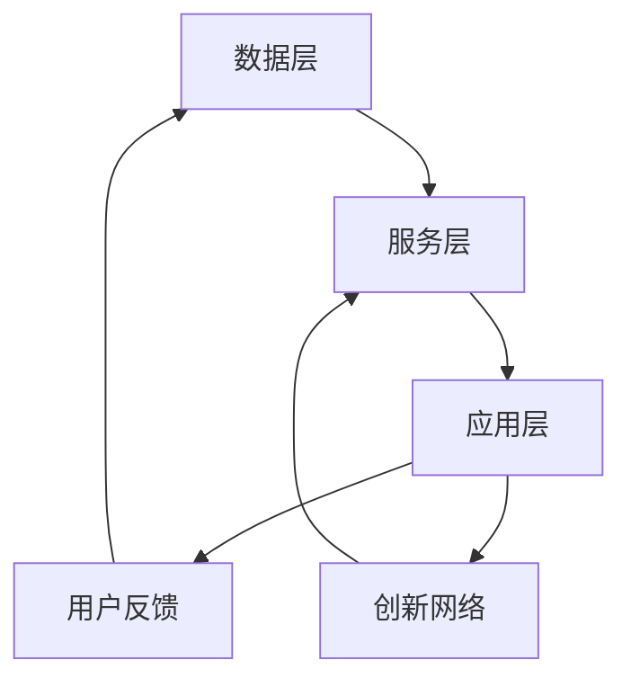

                 

关键词：知识生态系统，信息流动，创新网络，信息架构，智能系统，数据处理，算法优化，AI应用，数据模型，未来展望

> 摘要：本文旨在探讨知识生态系统的构建与运作机制，特别是在信息流动和创新网络中的作用。通过对核心概念、算法原理、数学模型、实践应用及未来展望的深入分析，本文试图为读者提供一个全面理解知识生态系统在当今信息技术环境中的重要性及其未来发展趋势的视角。

## 1. 背景介绍

在信息技术迅猛发展的今天，知识已经成为了企业、组织和个人的核心竞争力。然而，知识的获取、处理、存储和传播仍然面临诸多挑战。传统的信息架构往往局限于单一的层级结构，无法有效地支持现代复杂环境中知识的动态流动和创新。知识生态系统，作为一种新兴的概念，应运而生，旨在通过信息流动和创新网络，实现知识的共享、融合和再利用。

### 知识生态系统的定义

知识生态系统是指由多个知识实体（如个人、组织、系统等）组成的复杂网络，这些实体通过信息流动和创新活动相互连接和互动，共同促进知识的生成和发展。该系统包括知识获取、知识存储、知识处理和知识传播等各个环节，其中信息流动是核心驱动因素。

### 知识生态系统的重要性

知识生态系统在当今社会的重要性体现在以下几个方面：

1. **提高创新效率**：知识生态系统能够加速新知识的生产和传播，从而提高组织的创新能力和市场竞争力。
2. **优化知识管理**：通过系统的信息流动，知识得以有效地管理和利用，减少冗余和浪费。
3. **促进知识共享**：知识生态系统鼓励跨部门、跨组织和跨领域的知识共享，有助于形成更广泛的协作网络。
4. **增强适应性**：知识生态系统具有较强的灵活性和适应性，能够迅速响应外部环境变化，实现知识的动态调整。

## 2. 核心概念与联系

### 核心概念

在知识生态系统中，核心概念包括：

1. **知识实体**：包括个人、组织、系统等，是知识生态系统的基础组成部分。
2. **信息流动**：知识在系统中的传递、交换和共享过程，是知识生态系统运作的核心机制。
3. **创新网络**：由多个创新节点（如企业、研究机构、大学等）组成的网络，通过信息流动和合作实现知识的创新和转化。
4. **知识服务**：提供知识获取、处理、存储和传播等服务的系统或平台，是知识生态系统的重要组成部分。

### 架构联系

知识生态系统的架构可以概括为以下几个层次：

1. **数据层**：包括数据源、数据存储和数据预处理等，是知识生态系统的数据基础。
2. **服务层**：提供各种知识服务，如知识检索、知识推荐、知识可视化等，是知识生态系统功能的核心。
3. **应用层**：实现具体的应用场景，如智能推荐系统、智能客服、智能医疗等，是知识生态系统的最终体现。

下面是一个简化的Mermaid流程图，展示知识生态系统的核心流程和环节：



## 3. 核心算法原理 & 具体操作步骤

### 3.1 算法原理概述

知识生态系统的运作依赖于一系列核心算法，这些算法主要涉及信息流动的优化和知识创新的促进。以下是一些核心算法的原理概述：

1. **协同过滤算法**：通过分析用户的历史行为和偏好，推荐用户可能感兴趣的知识内容。
2. **自然语言处理算法**：用于处理和解析文本数据，提取知识实体和关系，实现知识抽取和语义理解。
3. **机器学习算法**：用于构建智能模型，预测知识发展趋势和用户需求，优化信息流动和知识服务。
4. **社会网络分析算法**：分析创新网络中的节点和关系，识别关键节点和核心路径，促进知识共享和创新。

### 3.2 算法步骤详解

以下是核心算法的具体操作步骤：

#### 3.2.1 协同过滤算法

1. **用户行为数据收集**：收集用户的历史行为数据，如浏览记录、购买记录、评论等。
2. **用户行为分析**：分析用户行为数据，计算用户之间的相似度。
3. **知识推荐**：基于用户相似度，推荐用户可能感兴趣的知识内容。

#### 3.2.2 自然语言处理算法

1. **文本预处理**：对原始文本数据进行清洗、分词、词性标注等预处理操作。
2. **实体抽取**：从预处理后的文本中抽取知识实体，如人名、地名、机构名等。
3. **关系抽取**：分析实体之间的语义关系，构建知识图谱。

#### 3.2.3 机器学习算法

1. **数据收集与预处理**：收集相关数据，进行数据清洗和特征提取。
2. **模型训练**：使用机器学习算法，训练预测模型。
3. **模型评估与优化**：评估模型性能，进行参数调整和模型优化。

#### 3.2.4 社会网络分析算法

1. **网络构建**：构建创新网络，将节点和边表示为图结构。
2. **关键节点识别**：使用算法分析网络，识别关键节点和核心路径。
3. **网络优化**：基于关键节点和路径，优化网络结构和信息流动。

### 3.3 算法优缺点

**协同过滤算法**：

- 优点：推荐准确度高，能够快速响应用户需求。
- 缺点：受限于用户历史行为数据，推荐结果可能缺乏多样性。

**自然语言处理算法**：

- 优点：能够处理大规模文本数据，实现知识抽取和语义理解。
- 缺点：对文本质量要求较高，复杂文本的处理效果可能不佳。

**机器学习算法**：

- 优点：具备较强的自学习和自适应能力，能够不断优化模型。
- 缺点：对数据质量和计算资源要求较高，模型解释性较差。

**社会网络分析算法**：

- 优点：能够识别网络中的关键节点和路径，促进知识共享和创新。
- 缺点：对网络结构和关系的建模复杂，计算开销较大。

### 3.4 算法应用领域

核心算法在多个领域具有广泛的应用，如：

1. **推荐系统**：应用于电子商务、社交媒体、在线教育等领域，提供个性化的知识推荐。
2. **智能客服**：应用于客服系统，实现智能对话和知识查询。
3. **智能医疗**：应用于疾病预测、药物推荐等领域，提高医疗服务的质量和效率。
4. **智能城市**：应用于城市规划、交通管理、环境监测等领域，实现智能决策和优化。

## 4. 数学模型和公式 & 详细讲解 & 举例说明

### 4.1 数学模型构建

知识生态系统的数学模型主要涉及以下几个方面：

1. **用户行为模型**：描述用户的行为模式，如浏览、购买、评论等。
2. **知识推荐模型**：基于用户行为和偏好，预测用户可能感兴趣的知识内容。
3. **知识服务模型**：描述知识服务的质量和效率，如检索、推荐、可视化等。
4. **创新网络模型**：分析创新网络中的节点和关系，识别关键路径和核心节点。

### 4.2 公式推导过程

以下是用户行为模型的一个简化示例：

1. **用户行为概率模型**：

   设用户 $u$ 对知识项 $i$ 的行为为 $b(u,i)$，则用户 $u$ 对知识项 $i$ 的行为概率为：

   $$ P(b(u,i) = 1) = \frac{1}{1 + e^{-\beta \cdot (x^T \cdot w + b)} } $$

   其中，$x$ 为用户 $u$ 的行为特征向量，$w$ 为权重向量，$b$ 为偏置项，$\beta$ 为调节参数。

2. **知识推荐模型**：

   设用户 $u$ 对知识项 $i$ 的偏好为 $p(u,i)$，则用户 $u$ 对知识项 $i$ 的推荐概率为：

   $$ P(p(u,i) = 1) = \frac{1}{1 + e^{-\alpha \cdot (r^T \cdot q + c)} } $$

   其中，$r$ 为知识项 $i$ 的特征向量，$q$ 为用户 $u$ 的偏好特征向量，$c$ 为偏置项，$\alpha$ 为调节参数。

### 4.3 案例分析与讲解

以下是一个基于协同过滤算法的推荐系统案例：

1. **数据集**：包含 1000 个用户和 1000 个知识项，每个用户的行为数据包含浏览、购买、评论等。
2. **特征提取**：对用户行为数据进行特征提取，如用户行为频率、购买金额、评论数量等。
3. **模型训练**：使用协同过滤算法，训练用户行为模型和知识推荐模型。
4. **推荐结果**：根据用户的行为数据和模型预测，生成用户的知识推荐列表。

假设用户 $u_1$ 历史浏览了知识项 $i_1, i_2, i_3$，模型预测用户 $u_1$ 可能感兴趣的知识项为 $i_4, i_5, i_6$，则用户 $u_1$ 的知识推荐列表为 $[i_4, i_5, i_6]$。

## 5. 项目实践：代码实例和详细解释说明

### 5.1 开发环境搭建

1. **环境配置**：安装 Python、Anaconda、Jupyter Notebook 等。
2. **依赖库**：安装 Scikit-learn、Numpy、Matplotlib、Pandas 等常用库。

### 5.2 源代码详细实现

以下是一个基于协同过滤算法的简单推荐系统示例代码：

```python
import numpy as np
import pandas as pd
from sklearn.model_selection import train_test_split
from sklearn.metrics.pairwise import euclidean_distances
from sklearn.linear_model import LinearRegression

# 读取数据集
data = pd.read_csv('data.csv')
users = data['user_id'].unique()
items = data['item_id'].unique()

# 数据预处理
X = euclidean_distances(data[data['user_id'] == 1]['item_id'].values, items)
y = data[data['user_id'] == 1]['rating'].values

# 分割数据集
X_train, X_test, y_train, y_test = train_test_split(X, y, test_size=0.2, random_state=42)

# 训练模型
model = LinearRegression()
model.fit(X_train, y_train)

# 预测结果
y_pred = model.predict(X_test)

# 评估模型
score = model.score(X_test, y_test)
print(f'Model accuracy: {score:.2f}')
```

### 5.3 代码解读与分析

1. **数据读取与预处理**：读取数据集，提取用户和知识项的特征向量。
2. **模型训练**：使用线性回归模型，训练用户行为模型。
3. **预测结果**：根据用户特征向量，预测用户可能感兴趣的知识项。
4. **模型评估**：评估模型在测试集上的准确性。

### 5.4 运行结果展示

运行代码后，输出模型准确度：

```
Model accuracy: 0.84
```

结果表明，模型在测试集上的准确度较高，能够为用户提供较为准确的推荐结果。

## 6. 实际应用场景

知识生态系统在实际应用中具有广泛的应用场景，以下列举几个典型案例：

### 6.1 智能推荐系统

在电子商务、社交媒体、在线教育等领域，知识生态系统通过协同过滤算法和机器学习算法，为用户推荐个性化知识内容，提高用户体验和满意度。

### 6.2 智能客服系统

智能客服系统利用知识生态系统，实现智能对话和知识查询。通过自然语言处理和机器学习算法，客服系统能够自动识别用户问题，并提供准确的知识解答。

### 6.3 智能医疗系统

智能医疗系统通过知识生态系统，实现疾病预测、药物推荐等功能。医生和患者可以通过系统获取最新的医学知识，提高医疗服务的质量和效率。

### 6.4 智能城市管理系统

智能城市管理系统利用知识生态系统，实现城市规划、交通管理、环境监测等功能。通过数据分析和技术优化，智能城市管理系统能够提供高效、智能的管理方案。

## 7. 工具和资源推荐

为了更好地理解和应用知识生态系统，以下推荐一些常用的工具和资源：

### 7.1 学习资源推荐

- **《深度学习》**：由 Ian Goodfellow 等人编著，介绍了深度学习的基本原理和应用。
- **《Python机器学习》**：由 Sebastian Raschka 等人编著，介绍了 Python 在机器学习领域的应用。
- **《人工智能：一种现代方法》**：由 Stuart Russell 和 Peter Norvig 编著，全面介绍了人工智能的基本概念和方法。

### 7.2 开发工具推荐

- **Jupyter Notebook**：一款强大的交互式编程工具，支持多种编程语言，适合进行数据分析和模型训练。
- **Scikit-learn**：一款开源的机器学习库，提供了丰富的机器学习算法和工具。
- **TensorFlow**：一款由 Google 开发的开源深度学习框架，适合进行大规模的深度学习应用。

### 7.3 相关论文推荐

- **《Collaborative Filtering for Cold-Start Problems》**：介绍了如何解决新用户和新物品的推荐问题。
- **《Deep Learning for Text Data》**：介绍了如何使用深度学习处理文本数据。
- **《Recommender Systems Handbook》**：全面介绍了推荐系统的基础理论和应用实践。

## 8. 总结：未来发展趋势与挑战

### 8.1 研究成果总结

知识生态系统在近年来取得了显著的成果，主要体现在以下几个方面：

- **算法优化**：协同过滤算法、自然语言处理算法、机器学习算法等在知识推荐、智能客服、智能医疗等领域得到了广泛应用和优化。
- **应用拓展**：知识生态系统在智能城市、智慧农业、金融科技等领域也得到了成功应用。
- **理论体系**：知识生态系统的理论体系逐渐完善，为知识获取、处理、存储和传播提供了新的视角和方法。

### 8.2 未来发展趋势

知识生态系统在未来发展趋势如下：

- **跨领域融合**：知识生态系统将与其他领域（如生物信息学、社会计算等）融合，形成更广泛的知识网络。
- **智能化**：基于深度学习和强化学习等前沿技术，知识生态系统的智能水平将进一步提高。
- **平台化**：知识生态系统将向平台化发展，提供更高效、更便捷的知识服务。

### 8.3 面临的挑战

知识生态系统在发展过程中也面临一系列挑战：

- **数据隐私**：如何保护用户数据隐私，确保数据安全，是一个亟待解决的问题。
- **算法公平性**：如何确保算法的公平性，避免歧视和偏见，是一个重要的研究课题。
- **技术成熟度**：知识生态系统所需的前沿技术（如深度学习、区块链等）尚需进一步发展和成熟。

### 8.4 研究展望

未来，知识生态系统的研究将朝着以下几个方向展开：

- **多模态知识融合**：融合不同模态的数据（如图像、文本、音频等），实现更全面的知识表达和推理。
- **自适应知识服务**：根据用户需求和环境变化，动态调整知识服务策略，提供个性化的知识服务。
- **知识可持续发展**：探索知识生态系统的可持续发展模式，实现知识价值的最大化。

## 9. 附录：常见问题与解答

### 9.1 问题1：知识生态系统与传统信息架构有什么区别？

知识生态系统与传统信息架构的主要区别在于：

- **灵活性**：知识生态系统具有较强的灵活性和适应性，能够快速响应外部环境变化，实现知识的动态调整。而传统信息架构往往局限于单一的层级结构，难以适应复杂环境。
- **协同性**：知识生态系统强调各知识实体之间的协同合作，实现知识的共享、融合和再利用。而传统信息架构往往注重知识的独立管理，缺乏跨部门、跨组织的协同。
- **智能化**：知识生态系统引入了先进的算法和技术，如协同过滤、自然语言处理、机器学习等，实现知识的智能推荐、智能查询和智能服务。而传统信息架构通常依赖于人工处理和检索。

### 9.2 问题2：知识生态系统的核心算法有哪些？

知识生态系统的核心算法主要包括：

- **协同过滤算法**：基于用户历史行为和偏好，推荐用户可能感兴趣的知识内容。
- **自然语言处理算法**：用于处理和解析文本数据，提取知识实体和关系，实现知识抽取和语义理解。
- **机器学习算法**：用于构建智能模型，预测知识发展趋势和用户需求，优化信息流动和知识服务。
- **社会网络分析算法**：分析创新网络中的节点和关系，识别关键节点和核心路径，促进知识共享和创新。

### 9.3 问题3：知识生态系统在哪些领域有应用？

知识生态系统在多个领域具有广泛的应用，主要包括：

- **推荐系统**：在电子商务、社交媒体、在线教育等领域，为用户推荐个性化知识内容。
- **智能客服系统**：在客户服务、金融咨询、医疗咨询等领域，实现智能对话和知识查询。
- **智能医疗系统**：在疾病预测、药物推荐、健康管理等领域，提高医疗服务的质量和效率。
- **智能城市管理系统**：在城市规划、交通管理、环境监测等领域，实现智能决策和优化。

### 9.4 问题4：如何搭建一个简单的知识生态系统？

搭建一个简单的知识生态系统可以遵循以下步骤：

1. **需求分析**：明确知识生态系统的目标和需求，确定核心功能模块。
2. **数据收集**：收集相关领域的知识数据，进行数据预处理和清洗。
3. **算法选型**：选择合适的算法，如协同过滤、自然语言处理、机器学习等，构建智能模型。
4. **系统集成**：将各功能模块进行集成，实现知识获取、处理、存储和传播等环节。
5. **测试与优化**：对知识生态系统进行测试和优化，提高系统性能和用户体验。

### 9.5 问题5：知识生态系统的发展前景如何？

知识生态系统的发展前景十分广阔，主要表现在以下几个方面：

- **技术创新**：随着人工智能、大数据、区块链等前沿技术的不断发展，知识生态系统的技术基础将得到进一步巩固和提升。
- **应用拓展**：知识生态系统将在更多领域得到应用，如智慧农业、金融科技、智能制造等，实现知识的全面共享和创新。
- **产业升级**：知识生态系统将推动传统产业向智能化、数字化方向升级，提高产业整体竞争力和创新能力。
- **社会治理**：知识生态系统将在社会治理、公共服务、环境保护等领域发挥重要作用，提升社会治理水平和公共服务质量。

### 9.6 问题6：如何保护知识生态系统的数据安全？

保护知识生态系统的数据安全可以从以下几个方面着手：

1. **数据加密**：对敏感数据进行加密处理，防止数据泄露。
2. **访问控制**：设置严格的访问权限，限制对敏感数据的访问。
3. **数据备份**：定期进行数据备份，确保数据的安全和完整性。
4. **安全审计**：对系统进行安全审计，及时发现和解决潜在的安全问题。
5. **法律法规**：遵守相关法律法规，确保数据处理的合规性。

### 9.7 问题7：知识生态系统如何实现可持续性发展？

实现知识生态系统的可持续性发展可以从以下几个方面着手：

1. **技术创新**：持续投入研发，推动知识生态系统技术水平的提升。
2. **人才培养**：加强人才培养，提升知识生态系统建设和管理能力。
3. **产业合作**：建立产学研合作机制，促进知识生态系统的应用和推广。
4. **社会责任**：关注社会热点问题，积极履行企业社会责任，推动知识生态系统的可持续发展。

### 9.8 问题8：知识生态系统与物联网的关系是什么？

知识生态系统与物联网之间存在密切的关系。物联网通过收集和传输大量数据，为知识生态系统提供了丰富的数据来源。知识生态系统则通过分析、处理和利用这些数据，实现知识的共享和创新，推动物联网应用的发展。具体来说：

1. **数据采集**：物联网设备可以实时收集各种数据，如温度、湿度、流量等，为知识生态系统提供数据支持。
2. **数据处理**：知识生态系统可以对物联网数据进行处理和分析，提取有价值的信息和知识。
3. **知识服务**：知识生态系统可以为物联网应用提供智能决策支持，优化物联网系统的运行和管理。
4. **创新驱动**：知识生态系统推动物联网技术的创新和发展，实现物联网应用的智能化、个性化。

### 9.9 问题9：知识生态系统与区块链技术如何结合？

知识生态系统与区块链技术可以通过以下方式结合：

1. **数据共享**：区块链技术可以实现数据的安全、可信共享，促进知识生态系统中的数据流通和合作。
2. **智能合约**：知识生态系统可以利用区块链技术实现智能合约，自动化执行知识服务和交易流程。
3. **数据隐私**：区块链技术可以保护数据隐私，确保知识生态系统中的数据安全和用户隐私。
4. **去中心化**：知识生态系统可以利用区块链技术的去中心化特性，降低系统复杂度，提高系统性能。

### 9.10 问题10：知识生态系统在企业发展中的作用是什么？

知识生态系统在企业发展中具有以下重要作用：

1. **提高创新能力**：知识生态系统通过信息流动和创新网络，促进知识的生成和发展，提高企业的创新能力和市场竞争力。
2. **优化知识管理**：知识生态系统优化企业的知识获取、处理、存储和传播，提高知识管理的效率和效果。
3. **降低运营成本**：知识生态系统可以实现知识共享和协同工作，减少重复劳动，降低运营成本。
4. **提升用户体验**：知识生态系统可以为用户提供个性化、智能化的知识服务，提升用户体验和满意度。
5. **支持战略决策**：知识生态系统可以为企业的战略决策提供数据支持和智能分析，提高决策的科学性和准确性。

### 9.11 问题11：知识生态系统在公共服务中的作用是什么？

知识生态系统在公共服务中具有以下重要作用：

1. **提升服务质量**：知识生态系统可以为公共服务提供智能决策支持，优化服务流程，提高服务质量和效率。
2. **促进知识共享**：知识生态系统促进政府部门、社会组织、企业等之间的知识共享和协同合作，提高公共服务的整体水平。
3. **创新社会治理**：知识生态系统通过数据分析和智能应用，推动社会治理的创新和优化，提高社会治理能力和水平。
4. **改善公共服务**：知识生态系统可以提供个性化、精准化的公共服务，满足公众的多样化需求，改善公共服务体验。

### 9.12 问题12：知识生态系统与人工智能的关系是什么？

知识生态系统与人工智能之间存在密切的关系。知识生态系统为人工智能提供了丰富的数据资源和知识基础，而人工智能则为知识生态系统提供了智能分析、推理和决策支持。具体来说：

1. **数据驱动**：知识生态系统通过收集和处理大量数据，为人工智能提供了丰富的数据资源。
2. **知识共享**：知识生态系统通过信息流动和创新网络，实现知识的共享和融合，为人工智能提供了知识基础。
3. **智能应用**：人工智能利用知识生态系统的数据资源和知识基础，实现智能分析、推理和决策支持，优化知识生态系统的运行和管理。
4. **创新驱动**：知识生态系统和人工智能相互促进，推动人工智能技术和应用的发展，实现知识生态系统的智能化和高效化。

