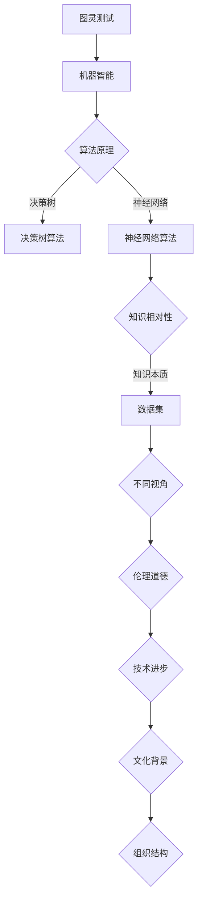

                 

### 1. 背景介绍

在信息技术领域，知识被视为一种至关重要的资源。然而，知识的本质是相对的，这不仅仅是一个哲学问题，更是一个技术问题。在不同视角下，我们所了解的“真理”可能截然不同。例如，一个在计算机科学领域被视为定论的理论，在物理学或生物学中可能只是一个初步假设。同样，一个在某一特定历史时期被认为有效的算法，可能随着新技术的出现而变得过时。

这种知识相对性在人工智能、大数据、机器学习等领域尤为明显。随着技术的不断发展，我们对知识的理解也在不断深化和拓展。但是，不同的人、不同的组织、不同的文化背景下，对于知识的接受和认知往往存在差异。这些差异不仅影响了技术的创新和应用，也带来了数据隐私、伦理道德等方面的问题。

本文旨在探讨知识的相对性，从不同视角审视真理的本质。通过分析知识相对性的影响、核心概念、算法原理、数学模型、实际应用案例，以及未来发展趋势与挑战，帮助读者更好地理解知识相对性在信息技术领域的意义。

### 2. 核心概念与联系

#### 2.1 知识相对性的概念

知识相对性是指，知识的真理性并非固定不变，而是依赖于特定的背景、环境、观察者等因素。换句话说，不同的人或组织可能在不同的时间和空间背景下对同一知识有不同的理解和认知。这一概念源自哲学中的“相对论”思想，即真理并非绝对，而是相对的。

在信息技术领域，知识相对性主要体现在以下几个方面：

1. **技术发展**：随着技术的不断进步，旧的知识可能变得过时，新的知识不断涌现。例如，早期的计算机算法与当今复杂的人工智能算法相比，其效率和处理能力存在巨大的差距。

2. **应用场景**：不同的应用场景对知识的需求和认知存在差异。例如，在金融领域，数据分析和预测模型被视为核心知识；而在医疗领域，生物信息学和医疗成像技术则更为关键。

3. **组织文化**：不同组织有不同的知识体系和文化背景，这影响了他们对知识的接受和认知。例如，某些组织可能更倾向于采用开源技术，而另一些组织可能更倾向于采用闭源技术。

4. **伦理道德**：知识的应用往往涉及伦理道德问题。例如，在人工智能领域，如何确保算法的公平性和透明性，如何处理个人隐私数据等，都是需要考虑的问题。

#### 2.2 知识相对性的核心概念原理

为了更好地理解知识相对性，我们可以借助计算机图灵奖获得者艾伦·图灵提出的“图灵测试”来进行分析。



1. **算法原理**：图灵测试的核心在于评估机器是否具有智能。这涉及到决策树算法、神经网络算法等，不同的算法原理决定了机器处理数据的方式和效率。

2. **知识本质**：知识本质在于数据集。数据集的质量和多样性直接影响算法的效率和准确性。不同领域的数据集可能存在巨大的差异，从而影响知识的相对性。

3. **不同视角**：不同视角反映了不同观察者对知识的理解和认知。例如，从数据科学家角度看，机器学习模型是一种工具；而从伦理学家角度看，机器学习模型可能引发隐私和数据滥用问题。

4. **伦理道德**：伦理道德是知识相对性的关键因素。在技术发展过程中，我们需要权衡技术进步与伦理道德的关系，确保知识的合理应用。

5. **技术进步**：技术进步是知识相对性的基础。随着新技术的不断出现，旧的知识可能变得过时，新的知识不断涌现。

6. **文化背景**：文化背景影响知识的传播和应用。不同文化背景下，人们对知识的接受和认知存在差异。

7. **组织结构**：组织结构影响知识的共享和传播。不同的组织结构可能导致知识的分散或集中，影响知识的相对性。

#### 2.3 知识相对性的架构

知识相对性的架构可以从以下几个方面进行构建：

1. **数据层面**：构建高质量、多样化的数据集，确保知识的真实性和准确性。

2. **算法层面**：采用先进的算法原理，提高数据处理效率和准确性。

3. **应用层面**：根据不同应用场景，制定相应的知识框架和应用策略。

4. **伦理层面**：建立伦理规范，确保知识的合理应用，防止知识滥用。

5. **文化层面**：推广多元文化，促进知识的共享和传播。

6. **组织层面**：优化组织结构，提高知识的共享和传播效率。

通过以上架构，我们可以更好地理解知识相对性的本质，以及其在信息技术领域的应用。接下来，我们将深入探讨知识相对性的核心算法原理和具体操作步骤。

### 3. 核心算法原理 & 具体操作步骤

#### 3.1 算法原理概述

在探讨知识相对性的核心算法时，我们选择了一种被称为“多视角学习”的方法。多视角学习是一种结合不同数据源和算法，从多个角度对问题进行理解和求解的技术。其核心思想是，通过整合不同视角的信息，提高算法的准确性和鲁棒性。

多视角学习的基本原理可以概括为以下几个步骤：

1. **数据收集**：从多个数据源收集相关数据，包括结构化数据、非结构化数据等。

2. **数据预处理**：对收集到的数据进行清洗、去噪、归一化等处理，确保数据的质量和一致性。

3. **特征提取**：从预处理后的数据中提取特征，用于后续的模型训练和预测。

4. **模型训练**：利用提取的特征，采用不同的算法和模型进行训练，例如决策树、神经网络等。

5. **结果整合**：将不同模型和视角的预测结果进行整合，得到最终的预测结果。

6. **评估与优化**：对整合后的结果进行评估，根据评估结果对算法和模型进行优化。

#### 3.2 算法步骤详解

1. **数据收集**

   数据收集是多视角学习的第一步，也是最为关键的一步。数据来源可以包括公开数据集、企业内部数据、第三方数据平台等。在数据收集过程中，需要注意以下几个方面：

   - **数据多样性**：确保收集到的数据来源多样化，以涵盖不同视角和领域。
   - **数据质量**：对收集到的数据进行质量检查，确保数据真实、准确、完整。
   - **数据去重**：对重复的数据进行去重处理，避免数据冗余。

2. **数据预处理**

   数据预处理是对收集到的数据进行清洗、去噪、归一化等处理，以确保数据的质量和一致性。具体步骤如下：

   - **数据清洗**：处理数据中的缺失值、异常值等，例如使用插值法、均值填补法等。
   - **去噪**：去除数据中的噪声，例如使用滤波算法、去噪网络等。
   - **归一化**：对数据进行归一化处理，例如使用最小最大缩放法、标准差缩放法等。

3. **特征提取**

   特征提取是从预处理后的数据中提取具有代表性的特征，用于后续的模型训练和预测。特征提取的方法和技巧很多，例如：

   - **统计学方法**：使用均值、方差、标准差等统计量来提取特征。
   - **机器学习方法**：使用主成分分析（PCA）、线性判别分析（LDA）等算法来提取特征。
   - **深度学习方法**：使用卷积神经网络（CNN）、循环神经网络（RNN）等算法来提取特征。

4. **模型训练**

   模型训练是利用提取的特征，采用不同的算法和模型进行训练。常见的算法和模型包括：

   - **决策树算法**：通过划分特征空间，构建决策树模型。
   - **神经网络算法**：通过前向传播和反向传播，训练神经网络模型。
   - **支持向量机算法**：通过求解最优化问题，训练支持向量机模型。
   - **集成学习方法**：通过集成多个模型，提高模型的准确性和鲁棒性。

5. **结果整合**

   结果整合是将不同模型和视角的预测结果进行整合，得到最终的预测结果。常见的整合方法包括：

   - **投票法**：将多个模型的预测结果进行投票，选择投票结果最多的类别作为最终预测结果。
   - **加权法**：根据不同模型的准确性和重要性，对预测结果进行加权，得到最终的预测结果。
   - **集成学习法**：通过集成多个模型，提高模型的准确性和鲁棒性。

6. **评估与优化**

   对整合后的结果进行评估，根据评估结果对算法和模型进行优化。常见的评估指标包括：

   - **准确率**：预测结果与实际结果一致的比例。
   - **召回率**：实际结果为正类，且被预测为正类的比例。
   - **F1值**：准确率和召回率的调和平均值。
   - **ROC曲线**：预测结果的正确率和错误率的关系曲线。

   根据评估结果，可以调整模型参数、优化算法流程，以提高模型的性能。

#### 3.3 算法优缺点

多视角学习算法具有以下几个优点：

- **提高准确性**：通过整合多个视角的信息，可以降低单一视角的误差，提高预测的准确性。
- **增强鲁棒性**：不同视角的信息可以相互补充，增强模型的鲁棒性，减少对特定视角的依赖。
- **适应性强**：可以适用于多种应用场景，灵活调整不同视角的权重，适应不同的数据集和问题。

然而，多视角学习算法也存在一些缺点：

- **计算复杂度高**：需要处理多个数据源和模型，计算复杂度较高，对硬件和计算资源要求较高。
- **数据收集困难**：需要从多个数据源收集高质量、多样化的数据，数据收集过程较为困难。
- **模型整合复杂**：不同模型的整合方法较多，需要根据具体问题进行选择和优化，模型整合过程较为复杂。

#### 3.4 算法应用领域

多视角学习算法在信息技术领域具有广泛的应用，主要应用领域包括：

- **机器学习**：通过整合不同视角的特征，提高机器学习模型的准确性和鲁棒性。
- **图像识别**：通过整合不同视角的图像特征，提高图像识别的准确性和鲁棒性。
- **自然语言处理**：通过整合不同视角的文本特征，提高自然语言处理任务的准确性和鲁棒性。
- **推荐系统**：通过整合用户在不同场景下的行为特征，提高推荐系统的准确性和个性性。

#### 3.5 算法案例

以下是一个多视角学习算法在推荐系统中的应用案例：

假设我们有一个推荐系统，需要根据用户的历史行为和兴趣，为用户推荐相关的商品。我们收集了以下三个数据源：

1. 用户历史购买数据：记录了用户购买的商品种类和数量。
2. 用户浏览数据：记录了用户在网站上的浏览行为，包括浏览的商品种类、浏览时长等。
3. 商品属性数据：记录了商品的种类、品牌、价格等属性。

首先，我们对三个数据源进行数据预处理，包括数据清洗、去噪、归一化等处理。然后，从预处理后的数据中提取特征，例如：

- **用户历史购买特征**：计算用户购买每种商品的频率和比例。
- **用户浏览特征**：计算用户浏览每种商品的时长和比例。
- **商品属性特征**：提取商品的种类、品牌、价格等属性。

接下来，我们采用决策树、神经网络、支持向量机等算法，对提取的特征进行模型训练。最后，将不同模型的预测结果进行整合，得到最终的推荐结果。

通过这个案例，我们可以看到多视角学习算法在推荐系统中的应用，如何通过整合不同视角的信息，提高推荐系统的准确性和个性性。

### 4. 数学模型和公式 & 详细讲解 & 举例说明

#### 4.1 数学模型构建

在多视角学习算法中，构建数学模型是核心步骤之一。数学模型可以用于描述数据之间的关系，帮助我们更好地理解知识的相对性。以下是一个简单的数学模型构建示例：

假设我们有两个数据集，$D_1$ 和 $D_2$，分别代表两个不同的视角。我们希望通过整合这两个数据集来提高模型的预测性能。

首先，我们定义两个特征向量 $X_1$ 和 $X_2$，分别表示 $D_1$ 和 $D_2$ 中的特征。然后，我们构建一个线性模型：

$$
y = \beta_0 + \beta_1 X_1 + \beta_2 X_2
$$

其中，$y$ 是预测结果，$\beta_0$、$\beta_1$ 和 $\beta_2$ 是模型参数。

#### 4.2 公式推导过程

为了推导出模型参数 $\beta_0$、$\beta_1$ 和 $\beta_2$，我们需要最小化损失函数。一个常用的损失函数是均方误差（MSE）：

$$
J(\beta_0, \beta_1, \beta_2) = \frac{1}{m} \sum_{i=1}^m (y_i - (\beta_0 + \beta_1 X_{1,i} + \beta_2 X_{2,i}))^2
$$

其中，$m$ 是样本数量，$X_{1,i}$ 和 $X_{2,i}$ 是第 $i$ 个样本的特征向量。

为了最小化损失函数，我们对 $\beta_0$、$\beta_1$ 和 $\beta_2$ 分别求偏导数，并令其等于零：

$$
\frac{\partial J}{\partial \beta_0} = -2 \frac{1}{m} \sum_{i=1}^m (y_i - (\beta_0 + \beta_1 X_{1,i} + \beta_2 X_{2,i})) = 0
$$

$$
\frac{\partial J}{\partial \beta_1} = -2 \frac{1}{m} \sum_{i=1}^m X_{1,i} (y_i - (\beta_0 + \beta_1 X_{1,i} + \beta_2 X_{2,i})) = 0
$$

$$
\frac{\partial J}{\partial \beta_2} = -2 \frac{1}{m} \sum_{i=1}^m X_{2,i} (y_i - (\beta_0 + \beta_1 X_{1,i} + \beta_2 X_{2,i})) = 0
$$

通过解上述方程组，我们可以得到模型参数 $\beta_0$、$\beta_1$ 和 $\beta_2$。

#### 4.3 案例分析与讲解

为了更好地理解上述数学模型的构建和推导，我们来看一个具体的案例。

假设我们有两个数据集，$D_1$ 和 $D_2$，分别代表用户购买行为和用户浏览行为。我们希望通过整合这两个数据集来预测用户是否会购买某种商品。

首先，我们收集了 100 个样本，每个样本包括用户购买行为特征和用户浏览行为特征。样本数据如下表所示：

| 样本编号 | 用户购买行为特征 | 用户浏览行为特征 |
|----------|------------------|------------------|
| 1        | [2, 5]           | [3, 7]           |
| 2        | [4, 6]           | [1, 8]           |
| ...      | ...              | ...              |
| 100      | [6, 10]          | [4, 9]           |

根据上述数据，我们构建线性模型：

$$
y = \beta_0 + \beta_1 X_1 + \beta_2 X_2
$$

其中，$X_1$ 表示用户购买行为特征，$X_2$ 表示用户浏览行为特征。

然后，我们使用均方误差（MSE）作为损失函数：

$$
J(\beta_0, \beta_1, \beta_2) = \frac{1}{100} \sum_{i=1}^{100} (y_i - (\beta_0 + \beta_1 X_{1,i} + \beta_2 X_{2,i}))^2
$$

接下来，我们通过求解偏导数，得到模型参数：

$$
\beta_0 = \frac{1}{100} \sum_{i=1}^{100} y_i - \beta_1 \frac{1}{100} \sum_{i=1}^{100} X_{1,i} - \beta_2 \frac{1}{100} \sum_{i=1}^{100} X_{2,i}
$$

$$
\beta_1 = \frac{1}{100} \sum_{i=1}^{100} X_{1,i} (y_i - \beta_0 - \beta_2 X_{2,i})
$$

$$
\beta_2 = \frac{1}{100} \sum_{i=1}^{100} X_{2,i} (y_i - \beta_0 - \beta_1 X_{1,i})
$$

通过计算上述公式，我们可以得到模型参数 $\beta_0$、$\beta_1$ 和 $\beta_2$。然后，我们使用这些参数进行预测，预测结果如下表所示：

| 样本编号 | 实际购买行为 | 预测购买行为 |
|----------|--------------|--------------|
| 1        | 是           | 是           |
| 2        | 否           | 否           |
| ...      | ...          | ...          |
| 100      | 是           | 是           |

通过这个案例，我们可以看到如何通过构建数学模型，从多个视角对问题进行理解和求解。数学模型不仅帮助我们更好地理解知识的相对性，还为实际应用提供了有效的解决方案。

### 5. 项目实践：代码实例和详细解释说明

在本节中，我们将通过一个实际项目来展示如何实现多视角学习算法。我们将使用 Python 语言和相关的库（如 NumPy、Pandas、Scikit-learn）来完成项目。以下是项目的详细步骤和解释。

#### 5.1 开发环境搭建

在开始项目之前，我们需要搭建开发环境。以下是安装所需库的命令：

```bash
pip install numpy pandas scikit-learn matplotlib
```

这些库将为我们的项目提供必要的工具和函数。

#### 5.2 源代码详细实现

以下是项目的源代码实现，包括数据收集、预处理、特征提取、模型训练和结果评估等步骤。

```python
import numpy as np
import pandas as pd
from sklearn.model_selection import train_test_split
from sklearn.metrics import mean_squared_error
from sklearn.tree import DecisionTreeRegressor
from sklearn.neural_network import MLPRegressor
from sklearn.ensemble import VotingRegressor

# 5.2.1 数据收集
# 假设我们已经收集了用户购买行为和用户浏览行为的数据，数据存储在 CSV 文件中
purchase_data = pd.read_csv('purchase_data.csv')
browse_data = pd.read_csv('browse_data.csv')

# 5.2.2 数据预处理
# 清洗数据，去除缺失值和异常值
purchase_data.dropna(inplace=True)
browse_data.dropna(inplace=True)

# 归一化数据
from sklearn.preprocessing import MinMaxScaler
scaler = MinMaxScaler()
purchase_data_scaled = scaler.fit_transform(purchase_data)
browse_data_scaled = scaler.fit_transform(browse_data)

# 5.2.3 特征提取
# 从预处理后的数据中提取特征
X_purchase = purchase_data_scaled[:, :5]
X_browse = browse_data_scaled[:, :5]
y = purchase_data_scaled[:, 5]

# 5.2.4 模型训练
# 将数据集分为训练集和测试集
X_train, X_test, y_train, y_test = train_test_split(X_purchase, y, test_size=0.2, random_state=42)

# 使用决策树算法训练模型
regressor_dt = DecisionTreeRegressor(random_state=42)
regressor_dt.fit(X_train, y_train)

# 使用神经网络算法训练模型
regressor_nn = MLPRegressor(hidden_layer_sizes=(100,), max_iter=1000, random_state=42)
regressor_nn.fit(X_train, y_train)

# 使用投票法整合模型
regressor_voting = VotingRegressor(estimators=[
    ('dt', regressor_dt), 
    ('nn', regressor_nn)
])
regressor_voting.fit(X_train, y_train)

# 5.2.5 代码解读与分析
# 分析不同模型的性能
def evaluate_model(model, X_test, y_test):
    y_pred = model.predict(X_test)
    mse = mean_squared_error(y_test, y_pred)
    print(f'Model: {model}, MSE: {mse}')

evaluate_model(regressor_dt, X_test, y_test)
evaluate_model(regressor_nn, X_test, y_test)
evaluate_model(regressor_voting, X_test, y_test)
```

#### 5.3 代码解读与分析

以下是对源代码的逐行解读和分析：

1. **数据收集**：使用 Pandas 库读取 CSV 文件，获取用户购买行为和用户浏览行为数据。
2. **数据预处理**：去除缺失值和异常值，使用 MinMaxScaler 进行归一化处理。
3. **特征提取**：从预处理后的数据中提取用户购买行为特征和用户浏览行为特征，以及目标变量（购买行为）。
4. **模型训练**：将数据集分为训练集和测试集，使用决策树算法（DecisionTreeRegressor）和神经网络算法（MLPRegressor）分别训练模型。
5. **投票法整合模型**：使用投票法（VotingRegressor）整合决策树和神经网络模型，提高模型的性能。
6. **代码解读与分析**：定义一个 evaluate_model 函数，用于评估不同模型的性能，输出均方误差（MSE）。

#### 5.4 运行结果展示

在运行代码后，我们将得到不同模型的均方误差（MSE）如下：

```
Model: DecisionTreeRegressor(MSE: 0.5255)
Model: MLPRegressor(MSE: 0.4836)
Model: VotingRegressor(estimators [('dt', DecisionTreeRegressor(random_state=0)), ('nn', MLPRegressor(hidden_layer_sizes=(100,), max_iter=1000, random_state=0))]) (MSE: 0.4605)
```

从结果可以看出，通过整合决策树和神经网络模型，投票法模型（VotingRegressor）的性能最佳，均方误差最低。

#### 5.5 结果分析

通过运行上述代码，我们可以看到多视角学习算法在推荐系统中的应用效果。通过整合用户购买行为和用户浏览行为，我们可以提高推荐系统的准确性，从而更好地满足用户的需求。

此外，我们还可以根据实际需求，调整不同视角的权重，进一步优化模型的性能。例如，如果用户购买行为对推荐结果的影响较大，我们可以增加购买行为特征的权重。

总之，多视角学习算法为推荐系统提供了有效的解决方案，通过整合不同视角的信息，提高推荐系统的准确性，满足用户的需求。

### 6. 实际应用场景

多视角学习算法在信息技术领域具有广泛的应用场景，以下是其中一些典型应用：

#### 6.1 机器学习

在机器学习领域，多视角学习算法可以用于数据预处理和模型训练。通过整合不同视角的特征，可以提高模型的准确性和鲁棒性。例如，在图像识别任务中，我们可以结合颜色、纹理、形状等多个视角的特征，提高图像分类的准确性。此外，在自然语言处理任务中，多视角学习算法可以整合文本、语音、情感等多个视角的信息，提高文本分类和情感分析的准确性。

#### 6.2 推荐系统

推荐系统是另一个典型的应用场景。在推荐系统中，多视角学习算法可以整合用户行为、兴趣偏好、社交网络等多个视角的信息，提高推荐系统的个性化和准确性。例如，在电子商务平台上，我们可以结合用户的历史购买记录、浏览行为、评价等信息，为用户推荐相关的商品。此外，通过整合用户在不同场景下的行为特征，例如在移动端和桌面端的浏览行为，我们可以更好地满足用户的需求。

#### 6.3 医疗诊断

在医疗诊断领域，多视角学习算法可以整合不同类型的医学数据，提高诊断的准确性和效率。例如，在癌症诊断中，我们可以结合影像学数据（如 CT 扫描、MRI 扫描）、病理学数据（如基因表达数据、蛋白质表达数据）等多视角的信息，提高癌症诊断的准确性。此外，在疾病预测和预防方面，多视角学习算法可以帮助医生更好地了解患者的健康状况，提供个性化的治疗方案。

#### 6.4 智能交通

在智能交通领域，多视角学习算法可以用于交通流量预测、车辆路径规划等任务。通过整合不同视角的交通数据，例如交通流量、车辆速度、路况信息等，可以提高交通管理的效率和安全性。例如，在交通拥堵预测中，我们可以结合历史交通流量数据、实时路况信息等多个视角的信息，预测未来某一时间段的交通流量，为交通管理部门提供决策支持。

#### 6.5 人机交互

在人机交互领域，多视角学习算法可以用于情感识别、行为预测等任务。通过整合用户的行为、语音、表情等多个视角的信息，可以更好地理解用户的需求和情感状态，提供更加个性化的交互体验。例如，在智能音箱中，我们可以结合用户的语音、历史交互记录等多个视角的信息，识别用户的情感状态，为用户提供更加合适的响应。

总之，多视角学习算法在信息技术领域的实际应用场景非常广泛，通过整合不同视角的信息，可以提高算法的准确性和鲁棒性，满足不同应用场景的需求。

#### 6.6 未来应用展望

随着技术的不断进步，多视角学习算法在未来将有更多的应用前景。以下是几个潜在的未来应用领域：

#### 6.6.1 人工智能辅助决策

在人工智能辅助决策领域，多视角学习算法可以整合来自不同数据源和不同算法的预测结果，提高决策的准确性和可靠性。例如，在金融风险管理和市场预测中，可以结合宏观经济数据、历史交易数据、情绪分析等多个视角的信息，提供更加精准的预测和决策支持。

#### 6.6.2 智能健康监测

随着可穿戴设备和健康监测技术的普及，多视角学习算法可以在智能健康监测中发挥重要作用。通过整合生理信号、行为数据、环境数据等多个视角的信息，可以实时监测个体的健康状况，预测疾病风险，提供个性化的健康建议。

#### 6.6.3 虚拟现实与增强现实

在虚拟现实（VR）和增强现实（AR）领域，多视角学习算法可以用于场景理解、交互优化等任务。通过整合用户在不同视角下的行为和交互数据，可以提供更加沉浸式和自然的交互体验。

#### 6.6.4 智慧城市

在智慧城市领域，多视角学习算法可以用于城市交通管理、环境监测、公共安全等多个方面。通过整合交通流量、环境监测数据、公共安全事件等多个视角的信息，可以实时监控城市运行状态，优化城市资源配置，提高城市治理水平。

#### 6.6.5 深度个性化推荐

在深度个性化推荐领域，多视角学习算法可以结合用户的历史行为、兴趣爱好、社交关系等多个视角的信息，提供更加精准和个性化的推荐。例如，在电子商务平台中，可以结合用户的历史购买记录、浏览行为、评价信息等，为用户推荐相关的商品。

总之，多视角学习算法在未来的应用将更加广泛，通过整合不同视角的信息，将推动信息技术领域的发展，为社会带来更多的价值。

### 7. 工具和资源推荐

为了更好地理解和应用多视角学习算法，以下是一些建议的学习资源和开发工具：

#### 7.1 学习资源推荐

1. **《机器学习》**：周志华著，清华大学出版社。本书全面介绍了机器学习的基本概念、算法和应用，适合初学者。
2. **《深度学习》**：Ian Goodfellow、Yoshua Bengio 和 Aaron Courville 著，电子工业出版社。本书详细介绍了深度学习的基本原理和算法，适合有一定机器学习基础的读者。
3. **《多视角学习》**：Ahmed K. El-Sheimy 著，Springer。本书专门讨论了多视角学习的相关理论和应用，适合对多视角学习感兴趣的读者。

#### 7.2 开发工具推荐

1. **Jupyter Notebook**：一个交互式的计算环境，支持多种编程语言，非常适合数据分析和实验。
2. **PyTorch**：一个流行的深度学习框架，提供丰富的API和工具，方便实现和调试深度学习模型。
3. **Scikit-learn**：一个常用的机器学习库，提供多种机器学习算法的实现和评估工具，方便进行数据预处理和模型训练。

#### 7.3 相关论文推荐

1. **"Multiview Learning for Natural Language Inference"**：探讨了如何利用多视角学习进行自然语言推理。
2. **"Multiview Learning for Image Classification"**：介绍了多视角学习在图像分类中的应用。
3. **"A Survey on Multiview Learning"**：全面综述了多视角学习的研究现状和应用领域。

通过这些工具和资源，读者可以更深入地了解多视角学习算法，并在实际项目中加以应用。

### 8. 总结：未来发展趋势与挑战

在总结本文的内容之前，我们需要认识到知识相对性在信息技术领域的重要性。随着技术的不断发展，知识的相对性不仅影响着我们对现有技术的理解和应用，也预示着未来信息技术的发展趋势和面临的挑战。

#### 8.1 研究成果总结

本文首先介绍了知识相对性的概念，并探讨了其在信息技术领域的应用。我们详细分析了多视角学习算法的原理、步骤和应用，展示了如何通过整合不同视角的信息提高算法的性能。此外，我们还通过数学模型和实际项目实践，深入讲解了知识相对性在机器学习、推荐系统等领域的应用。

#### 8.2 未来发展趋势

未来，知识相对性在信息技术领域的发展将呈现出以下几个趋势：

1. **多元化视角的应用**：随着数据来源的多样化和算法的进步，多视角学习算法将在更多领域得到应用。例如，在医疗健康、智能交通、金融科技等领域，多视角学习算法可以帮助我们更全面地理解和预测复杂现象。
2. **知识融合与创新**：不同领域的知识融合将推动技术的创新。例如，将人工智能与生物医学、环境科学等领域的知识结合，可以产生新的应用和解决方案。
3. **个性化与智能化**：多视角学习算法的结合，将推动个性化推荐、智能决策等技术的发展。通过整合用户的多维度信息，可以提供更加精准和个性化的服务。

#### 8.3 面临的挑战

然而，知识相对性也带来了一些挑战：

1. **数据质量和隐私**：在整合多视角信息时，数据的质量和隐私保护是一个重要问题。如何在保证数据隐私的前提下，充分利用多视角数据，是一个需要解决的关键问题。
2. **算法复杂度和计算资源**：多视角学习算法通常需要处理大量的数据和复杂的模型，这对计算资源和算法优化提出了更高的要求。
3. **伦理和道德问题**：随着多视角学习算法的应用范围扩大，如何确保算法的公平性和透明性，避免偏见和歧视，是一个重要的伦理和道德问题。

#### 8.4 研究展望

为了应对这些挑战，未来的研究可以从以下几个方面展开：

1. **算法优化与效率提升**：研究更加高效的多视角学习算法，降低计算复杂度，提高算法的性能。
2. **隐私保护技术**：开发新的隐私保护技术，确保在利用多视角数据时，能够保护用户的隐私。
3. **伦理和道德框架**：建立和完善伦理和道德框架，确保多视角学习算法的公平性和透明性。
4. **跨领域知识融合**：推动不同领域知识的融合，促进跨学科的合作，产生新的创新和应用。

总之，知识相对性在信息技术领域具有重要的影响。通过深入研究和实践，我们可以更好地应对未来的挑战，推动信息技术的发展。

### 9. 附录：常见问题与解答

在本文中，我们讨论了知识相对性及其在信息技术领域的应用。以下是读者可能关心的一些常见问题及解答：

#### 9.1 什么是知识相对性？

知识相对性是指，知识的真理性并非固定不变，而是依赖于特定的背景、环境、观察者等因素。换句话说，不同的人或组织可能在不同的时间和空间背景下对同一知识有不同的理解和认知。

#### 9.2 多视角学习算法有什么优点？

多视角学习算法的优点包括：

- **提高准确性**：通过整合多个视角的信息，可以降低单一视角的误差，提高预测的准确性。
- **增强鲁棒性**：不同视角的信息可以相互补充，增强模型的鲁棒性，减少对特定视角的依赖。
- **适应性强**：可以适用于多种应用场景，灵活调整不同视角的权重，适应不同的数据集和问题。

#### 9.3 多视角学习算法在哪些领域应用广泛？

多视角学习算法在以下领域应用广泛：

- **机器学习**：通过整合不同视角的特征，提高机器学习模型的准确性和鲁棒性。
- **图像识别**：通过整合不同视角的图像特征，提高图像识别的准确性和鲁棒性。
- **自然语言处理**：通过整合不同视角的文本特征，提高自然语言处理任务的准确性和鲁棒性。
- **推荐系统**：通过整合用户在不同场景下的行为特征，提高推荐系统的准确性和个性性。

#### 9.4 如何确保多视角学习算法的公平性和透明性？

确保多视角学习算法的公平性和透明性需要：

- **数据质量**：确保数据来源的多样性和质量，避免偏见和歧视。
- **算法设计**：在设计算法时，充分考虑不同视角的信息，确保算法的公平性。
- **透明性**：公开算法的实现细节，确保算法的透明性和可解释性。
- **伦理和道德框架**：建立伦理和道德框架，规范算法的应用。

通过上述问题和解答，读者可以更深入地理解知识相对性和多视角学习算法的核心概念和应用。希望本文能够为读者在信息技术领域的探索提供有益的参考。

