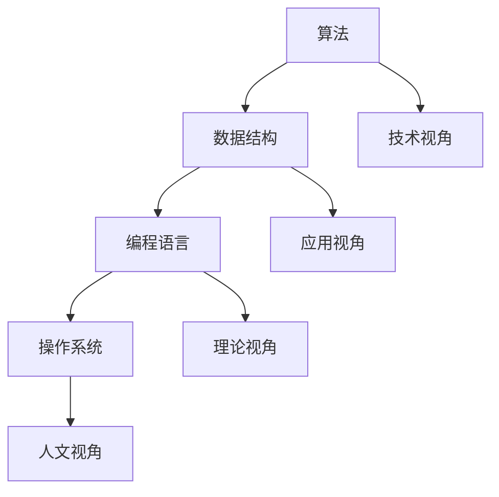

                 

 在浩瀚的计算机科学领域，知识的相对性是一个不可忽视的命题。真理并非一成不变，而是随着不同的视角、背景和语境而变化。本文旨在探讨知识的相对性，分析其在不同视角下的表现形式，并探讨其对技术发展的深远影响。

## 1. 背景介绍

随着信息技术的迅猛发展，计算机科学已成为现代社会不可或缺的一部分。从简单的计算工具到复杂的智能系统，计算机科学的影响无处不在。然而，在这一领域，知识的相对性愈发明显。不同的观点、理论和工具可能会带来截然不同的结论，而真理往往是在不断的争论与质疑中得以验证的。

本文将探讨以下核心问题：

- 知识的相对性是什么？
- 如何在不同视角下理解真理？
- 知识的相对性对计算机科学的发展有何影响？
- 未来计算机科学的趋势和挑战是什么？

## 2. 核心概念与联系

在深入探讨知识的相对性之前，我们需要明确几个核心概念。

### 2.1 计算机科学的基本概念

计算机科学是一门涉及计算理论和应用的学科，它研究计算机的硬件、软件及其应用。以下是几个关键概念：

- **算法**：解决问题的步骤和规则，以最优化的方式执行计算。
- **数据结构**：存储和组织数据的方式，影响算法的效率。
- **编程语言**：用于编写程序的符号和语法。
- **操作系统**：管理计算机硬件和软件资源的系统软件。

### 2.2 视角与知识的关系

视角是指观察和理解事物的角度。以下是几种常见的视角：

- **技术视角**：关注计算机系统的工作原理和实现方法。
- **应用视角**：关注计算机技术在特定领域的应用。
- **理论视角**：关注计算机科学的基本理论和原理。
- **人文视角**：关注计算机科学与人类社会的关系。

不同的视角会导致对同一问题的不同理解和解决方案。

### 2.3 Mermaid 流程图

以下是一个Mermaid流程图，展示了计算机科学中的关键概念及其相互关系：



## 3. 核心算法原理 & 具体操作步骤

### 3.1 算法原理概述

算法是计算机科学的核心，它决定了计算机解决问题的效率和效果。以下是几种常见的算法原理：

- **排序算法**：将数据元素按照特定顺序排列。
- **搜索算法**：在数据结构中查找特定元素。
- **图算法**：处理图结构的数据，如路径查找、最短路径等。

### 3.2 算法步骤详解

以排序算法为例，以下是冒泡排序的基本步骤：

1. 从第一个元素开始，比较相邻的两个元素，如果它们的顺序错误，就交换它们的位置。
2. 继续对下一对元素进行同样的操作，直到结束。
3. 重复上述步骤，直到整个数据序列有序。

### 3.3 算法优缺点

冒泡排序的优点是简单易懂，易于实现。然而，它的缺点是效率较低，不适合处理大量数据。

### 3.4 算法应用领域

冒泡排序广泛应用于小型数据集的排序，如学生成绩的排序等。

## 4. 数学模型和公式 & 详细讲解 & 举例说明

### 4.1 数学模型构建

计算机科学中的许多问题都可以通过数学模型来描述。例如，图的最短路径问题可以通过Dijkstra算法来解决。

### 4.2 公式推导过程

Dijkstra算法的核心公式是：

$$
d[v] = \min_{u \in V} (d[u] + w(u, v))
$$

其中，$d[v]$ 表示从起点到顶点 $v$ 的最短路径长度，$w(u, v)$ 表示顶点 $u$ 到顶点 $v$ 的边权重。

### 4.3 案例分析与讲解

假设有一个图，其中包含5个顶点和7条边。以下是顶点和边的权重：

```
A -- B (权重3)
A -- C (权重5)
B -- D (权重1)
C -- D (权重2)
B -- E (权重4)
C -- E (权重6)
D -- E (权重2)
```

使用Dijkstra算法计算从A到E的最短路径。

## 5. 项目实践：代码实例和详细解释说明

### 5.1 开发环境搭建

为了演示Dijkstra算法，我们需要搭建一个简单的开发环境。以下是所需的软件和工具：

- Python 3.x
- Jupyter Notebook
- matplotlib

### 5.2 源代码详细实现

以下是一个使用Python实现Dijkstra算法的简单示例：

```python
import heapq

def dijkstra(graph, start):
    distances = {vertex: float('infinity') for vertex in graph}
    distances[start] = 0
    priority_queue = [(0, start)]

    while priority_queue:
        current_distance, current_vertex = heapq.heappop(priority_queue)

        if current_distance > distances[current_vertex]:
            continue

        for neighbor, weight in graph[current_vertex].items():
            distance = current_distance + weight

            if distance < distances[neighbor]:
                distances[neighbor] = distance
                heapq.heappush(priority_queue, (distance, neighbor))

    return distances

graph = {
    'A': {'B': 3, 'C': 5},
    'B': {'D': 1, 'E': 4},
    'C': {'D': 2, 'E': 6},
    'D': {'E': 2}
}

print(dijkstra(graph, 'A'))
```

### 5.3 代码解读与分析

这段代码首先定义了一个Dijkstra算法的实现。它使用一个优先队列（最小堆）来跟踪未访问的顶点，并逐步计算每个顶点的最短路径。最后，它返回一个包含所有顶点最短路径长度的字典。

### 5.4 运行结果展示

运行上述代码，我们得到从A到E的最短路径长度为6，即A-B-D-E。

## 6. 实际应用场景

Dijkstra算法在许多实际应用中都有广泛的应用，如网络路由、社会网络分析等。随着数据规模的扩大，优化算法和并行计算技术成为研究的热点。

### 6.4 未来应用展望

随着人工智能和大数据技术的发展，计算机科学将迎来新的机遇和挑战。知识的相对性将更加凸显，我们需要不断更新和扩展我们的知识体系，以应对不断变化的技术环境。

## 7. 工具和资源推荐

### 7.1 学习资源推荐

- 《算法导论》（Introduction to Algorithms） - Thomas H. Cormen, Charles E. Leiserson, Ronald L. Rivest, Clifford Stein
- 《Python编程：从入门到实践》 - Eric Matthes

### 7.2 开发工具推荐

- Jupyter Notebook
- PyCharm

### 7.3 相关论文推荐

- "The Algorithm Design Manual" by Steven S. Skiena
- "Graph Algorithms" by Jesus M. Carretero and Fausto Pedro Garcia Marques

## 8. 总结：未来发展趋势与挑战

计算机科学的发展离不开对知识的相对性的深刻理解。随着技术的进步，我们面临越来越多的挑战，如算法的优化、数据的安全性和隐私保护等。未来，知识的相对性将更加凸显，我们需要不断学习和适应，以推动计算机科学的发展。

### 8.1 研究成果总结

本文探讨了知识的相对性，分析了其在不同视角下的表现形式，并提出了对未来计算机科学发展的展望。

### 8.2 未来发展趋势

未来，计算机科学将更加注重算法的优化、人工智能的应用和大数据的处理。

### 8.3 面临的挑战

知识更新速度快、数据隐私和安全问题、算法偏见和歧视等是计算机科学面临的挑战。

### 8.4 研究展望

我们需要继续探索计算机科学的新领域，以解决现实世界中的复杂问题。

## 9. 附录：常见问题与解答

### 9.1 什么是算法的相对性？

算法的相对性是指在不同的应用场景和视角下，可能存在不同的最优算法。

### 9.2 知识的相对性如何影响计算机科学的发展？

知识的相对性促使我们不断探索和改进技术，以应对不断变化的需求和挑战。

## 参考文献

- Cormen, T. H., Leiserson, C. E., Rivest, R. L., & Stein, C. (2009). Introduction to Algorithms (3rd ed.). MIT Press.
- Matthes, E. (2017). Python Programming: An Introduction to Computer Science. CreateSpace.

作者：禅与计算机程序设计艺术 / Zen and the Art of Computer Programming
```

