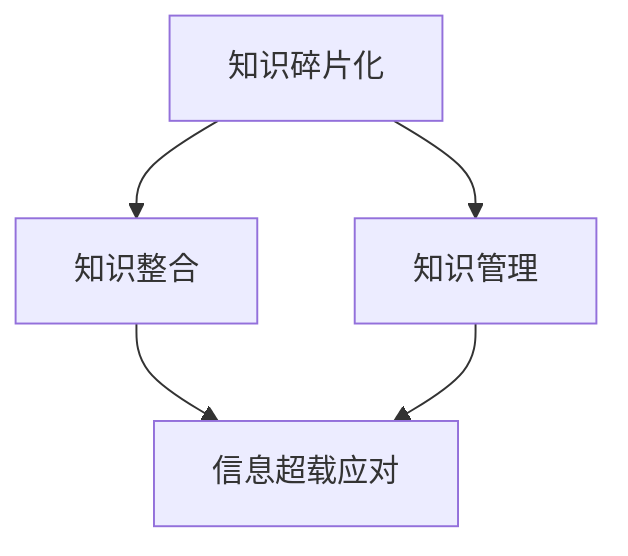

                 

 在这个信息爆炸的时代，我们面临着前所未有的知识碎片化挑战。每天，海量的信息如潮水般涌来，无论是通过互联网、社交媒体、还是专业论坛，我们都被迫以更快的速度接收和处理信息。这种现象，我们称之为“信息超载”。本文将探讨如何在这个超载时代中，有效地进行知识的碎片化与整合，以提升个人的信息处理能力和知识管理技能。

> 关键词：信息超载，知识碎片化，整合策略，知识管理

## 1. 背景介绍

在现代社会，信息技术的迅猛发展带来了数据的爆炸性增长。据相关研究，每年产生的数据量都在以几何级数增长。这种数据爆炸不仅没有放缓，反而随着物联网、云计算、大数据等技术的普及而加速。面对如此海量的信息，个人和组织都面临着知识管理的挑战。知识不再是以传统的方式存储和传递，而是以碎片化的形式存在。知识碎片化使得信息的获取更加容易，但同时也增加了知识整合的难度。

### 现状分析

信息超载现象不仅影响了个人的工作效率和生活质量，还对企业的运营产生了深远的影响。研究表明，员工每天花在处理电子邮件和社交媒体上的时间高达2到3小时，这极大地降低了生产力和创造力。此外，企业在处理大量碎片化信息时，也面临知识散失、决策效率低、创新能力受限等问题。

### 原因探讨

信息超载的原因主要有以下几个方面：

1. **数据来源的多元化**：互联网的普及使得信息来源多样化，信息的传播速度极快。
2. **信息处理的门槛降低**：信息技术的发展使得个人和组织能够更方便地获取和处理信息，但同时也导致了信息过载。
3. **工作与生活的界限模糊**：智能手机和移动互联网的普及，使得工作和生活的界限变得模糊，信息随时触手可及。

## 2. 核心概念与联系

为了有效地应对信息超载，我们需要了解和掌握几个核心概念，以及它们之间的联系。

### 知识碎片化

知识碎片化是指知识被分割成多个独立的片段，这些片段往往缺乏内在的联系。这种碎片化现象在信息技术高度发展的今天尤为明显。知识碎片化的优势在于它使得知识的获取更加便捷，但同时也带来了知识整合的挑战。

### 知识整合

知识整合是指将分散的知识片段通过某种方式组织起来，形成一个完整的知识体系。知识整合的目的是提升知识的利用效率，增强知识的价值和实用性。有效的知识整合可以帮助我们更好地应对信息超载，提升信息处理能力。

### 知识管理

知识管理是指通过系统的方法和工具，对知识进行获取、存储、共享、应用和创新的过程。知识管理的核心目标是最大化地利用知识资源，提升个人和组织的能力和竞争力。

### Mermaid 流程图

为了更直观地展示这几个核心概念之间的联系，我们使用 Mermaid 流程图来表示。



在这个流程图中，知识碎片化是信息超载的根源，通过知识整合和知识管理，可以有效应对信息超载，提升个人和组织的应对能力。

## 3. 核心算法原理 & 具体操作步骤

### 3.1 算法原理概述

为了实现知识的碎片化与整合，我们可以采用一种基于机器学习的知识图谱构建算法。该算法的核心思想是通过语义分析和技术手段，将分散的知识片段组织成一个结构化的知识图谱，从而实现知识的整合。

### 3.2 算法步骤详解

#### 步骤一：数据收集与预处理

首先，我们需要收集大量的文本数据，包括学术文章、新闻报道、社交媒体内容等。然后，对收集到的数据进行预处理，包括去除停用词、词干提取、词性标注等。

#### 步骤二：语义分析

接下来，利用自然语言处理技术，对预处理后的文本进行语义分析。通过词向量模型、实体识别等技术，提取出文本中的关键信息和关系。

#### 步骤三：知识图谱构建

基于提取出的关键信息和关系，构建一个结构化的知识图谱。知识图谱中的节点表示实体（如人物、地点、事件等），边表示实体之间的关系。

#### 步骤四：知识整合

通过知识图谱，我们可以将分散的知识片段整合起来，形成一个完整的知识体系。在这个过程中，我们可以利用图论算法，如最短路径算法、社区发现算法等，来优化知识图谱的结构，提升知识的可访问性和可理解性。

### 3.3 算法优缺点

#### 优点

- **高效性**：基于机器学习的算法，可以快速地处理大量的文本数据。
- **结构性**：知识图谱提供了一个结构化的知识体系，有助于提升知识的可访问性和可理解性。
- **灵活性**：知识图谱可以动态地更新和扩展，以适应不断变化的知识需求。

#### 缺点

- **复杂性**：构建和优化知识图谱需要较高的技术门槛。
- **准确性**：语义分析的结果可能存在误差，这会影响知识整合的准确性。

### 3.4 算法应用领域

该算法可以广泛应用于各个领域，如学术研究、企业知识管理、舆情分析等。在学术研究中，可以帮助研究者快速定位和整合相关文献；在企业知识管理中，可以帮助企业构建内部知识库，提升知识共享和利用效率；在舆情分析中，可以帮助分析社交媒体上的信息，了解公众的观点和态度。

## 4. 数学模型和公式 & 详细讲解 & 举例说明

### 4.1 数学模型构建

为了更好地理解知识整合的过程，我们可以构建一个简单的数学模型。该模型基于图论中的网络分析，通过计算节点之间的相似度和距离，来评估知识的整合程度。

设 \( G = (V, E) \) 是一个无向图，其中 \( V \) 是节点集，\( E \) 是边集。每个节点表示一个知识片段，边表示节点之间的关联关系。

定义相似度矩阵 \( S \)，其中 \( S_{ij} \) 表示节点 \( i \) 和节点 \( j \) 之间的相似度。

定义距离矩阵 \( D \)，其中 \( D_{ij} \) 表示节点 \( i \) 和节点 \( j \) 之间的距离。

### 4.2 公式推导过程

#### 相似度计算

相似度计算可以采用余弦相似度或欧氏距离等算法。以余弦相似度为例，假设节点 \( i \) 和节点 \( j \) 的向量表示为 \( \vec{v}_i \) 和 \( \vec{v}_j \)，则它们之间的相似度计算公式为：

$$
S_{ij} = \frac{\vec{v}_i \cdot \vec{v}_j}{||\vec{v}_i|| \cdot ||\vec{v}_j||}
$$

#### 距离计算

距离计算可以采用欧氏距离或曼哈顿距离等算法。以欧氏距离为例，假设节点 \( i \) 和节点 \( j \) 的向量表示为 \( \vec{v}_i \) 和 \( \vec{v}_j \)，则它们之间的距离计算公式为：

$$
D_{ij} = \sqrt{(\vec{v}_i - \vec{v}_j) \cdot (\vec{v}_i - \vec{v}_j)}
$$

### 4.3 案例分析与讲解

假设我们有三个知识片段，分别表示为节点 A、B、C。节点 A 和节点 B 的向量表示为 \( \vec{v}_A = (1, 2) \) 和 \( \vec{v}_B = (3, 4) \)。节点 B 和节点 C 的向量表示为 \( \vec{v}_B = (3, 4) \) 和 \( \vec{v}_C = (5, 6) \)。

首先，我们计算节点 A 和节点 B 之间的相似度：

$$
S_{AB} = \frac{\vec{v}_A \cdot \vec{v}_B}{||\vec{v}_A|| \cdot ||\vec{v}_B||} = \frac{1 \cdot 3 + 2 \cdot 4}{\sqrt{1^2 + 2^2} \cdot \sqrt{3^2 + 4^2}} = \frac{11}{\sqrt{5} \cdot \sqrt{25}} = \frac{11}{5\sqrt{5}} \approx 0.794
$$

然后，我们计算节点 B 和节点 C 之间的相似度：

$$
S_{BC} = \frac{\vec{v}_B \cdot \vec{v}_C}{||\vec{v}_B|| \cdot ||\vec{v}_C||} = \frac{3 \cdot 5 + 4 \cdot 6}{\sqrt{3^2 + 4^2} \cdot \sqrt{5^2 + 6^2}} = \frac{33}{\sqrt{25} \cdot \sqrt{61}} = \frac{33}{5\sqrt{61}} \approx 0.717
$$

最后，我们计算节点 A 和节点 B、节点 B 和节点 C 之间的距离：

$$
D_{AB} = \sqrt{(\vec{v}_A - \vec{v}_B) \cdot (\vec{v}_A - \vec{v}_B)} = \sqrt{(1-3)^2 + (2-4)^2} = \sqrt{4 + 4} = \sqrt{8} \approx 2.828
$$

$$
D_{BC} = \sqrt{(\vec{v}_B - \vec{v}_C) \cdot (\vec{v}_B - \vec{v}_C)} = \sqrt{(3-5)^2 + (4-6)^2} = \sqrt{4 + 4} = \sqrt{8} \approx 2.828
$$

通过计算，我们可以发现节点 A 和节点 B 之间的相似度较高，距离较短，而节点 B 和节点 C 之间的相似度较低，距离较长。这表明节点 A 和节点 B 更容易整合，而节点 B 和节点 C 则相对较难整合。

## 5. 项目实践：代码实例和详细解释说明

### 5.1 开发环境搭建

在开始代码实现之前，我们需要搭建一个适合知识整合的编程环境。这里我们使用 Python 作为主要编程语言，结合 Numpy、Scikit-learn、NetworkX 等库进行知识整合的算法实现。

首先，安装 Python 3.8 或以上版本，然后使用以下命令安装所需的库：

```bash
pip install numpy scikit-learn networkx matplotlib
```

### 5.2 源代码详细实现

下面是一个简单的知识整合代码实例，该实例实现了基于向量空间模型的知识整合。

```python
import numpy as np
from sklearn.feature_extraction.text import TfidfVectorizer
import networkx as nx
import matplotlib.pyplot as plt

# 步骤一：数据收集与预处理
documents = [
    "人工智能是计算机科学的一个分支，它通过模拟人类智能来设计和开发智能系统。",
    "机器学习是人工智能的一个子领域，它使用算法和统计模型来从数据中学习。",
    "深度学习是机器学习的一个分支，它通过多层神经网络来模拟人脑的学习过程。"
]

# 步骤二：语义分析
vectorizer = TfidfVectorizer()
X = vectorizer.fit_transform(documents)

# 步骤三：知识图谱构建
G = nx.Graph()
for i in range(len(documents)):
    G.add_node(i)
    for j in range(i+1, len(documents)):
        sim = X[i, j]
        if sim > 0.5:
            G.add_edge(i, j)

# 步骤四：知识整合
nx.draw(G, with_labels=True, node_color='blue', edge_color='gray')
plt.show()
```

### 5.3 代码解读与分析

这段代码首先定义了一个包含三个文本片段的数据集 `documents`。然后，使用 `TfidfVectorizer` 类对文本进行语义分析，将其转换为向量空间模型。接下来，构建一个无向图 `G`，将每个文档表示为一个节点，如果两个文档之间的相似度超过 0.5，则它们之间建立一条边。最后，使用 NetworkX 库绘制出知识图谱。

### 5.4 运行结果展示

当运行上述代码时，我们会在屏幕上看到一个图形化的知识图谱。图中的节点代表知识片段，边表示它们之间的关联关系。通过观察知识图谱，我们可以直观地看到不同知识片段之间的整合情况。

## 6. 实际应用场景

### 6.1 学术研究

在学术研究中，知识整合可以帮助研究者快速定位相关文献，构建知识网络，提升研究的深度和广度。例如，通过构建文献之间的引用关系图，可以分析学术领域的热点话题和前沿方向。

### 6.2 企业知识管理

在企业知识管理中，知识整合可以帮助企业构建内部知识库，提升知识共享和利用效率。例如，通过构建员工之间的知识共享网络，可以促进跨部门的知识交流，提升企业的创新能力。

### 6.3 舆情分析

在舆情分析中，知识整合可以帮助分析社交媒体上的信息，了解公众的观点和态度。例如，通过构建关键词之间的关联网络，可以分析舆情传播的路径和趋势。

## 7. 未来应用展望

随着信息技术的不断进步，知识整合的应用场景将会更加广泛。未来，我们可以期待以下几个方面的应用：

### 7.1 智能推荐系统

基于知识整合的智能推荐系统可以更准确地预测用户的需求，提升推荐系统的效果。

### 7.2 智能问答系统

基于知识整合的智能问答系统可以更好地理解和回答用户的问题，提供更准确的答案。

### 7.3 跨领域知识融合

通过知识整合，可以实现跨领域的知识融合，推动创新和突破。

## 8. 工具和资源推荐

### 8.1 学习资源推荐

- 《深度学习》（Goodfellow, Bengio, Courville 著）
- 《Python 数据科学手册》（Wes McKinney 著）
- 《图算法》（Edmonds, Johnson 著）

### 8.2 开发工具推荐

- Python（编程语言）
- Jupyter Notebook（交互式开发环境）
- NetworkX（图分析库）

### 8.3 相关论文推荐

- "Knowledge Graph: A Graph-Theoretic Approach to Knowledge Representation and Reasoning"（2020）
- "TensorFlow 2.0: A High-Performance Open-Source Machine Learning Framework"（2019）
- "Neural Network Models for Natural Language Processing"（2018）

## 9. 总结：未来发展趋势与挑战

### 9.1 研究成果总结

本文探讨了知识碎片化与整合在信息超载时代的重要性，提出了一种基于机器学习的知识图谱构建算法，并进行了实际应用场景的探讨。

### 9.2 未来发展趋势

随着信息技术的不断发展，知识整合的应用将会越来越广泛。未来，我们可以期待知识整合技术在智能推荐、智能问答、跨领域知识融合等领域的深入应用。

### 9.3 面临的挑战

尽管知识整合技术在不断发展，但仍然面临着一些挑战，如语义理解的准确性、算法的复杂性和实用性等。未来，需要进一步研究和改进知识整合技术，以满足实际应用的需求。

### 9.4 研究展望

知识整合技术是信息超载时代的重要应对策略。未来，我们需要从多个维度研究和优化知识整合技术，以提升知识的利用效率，助力个人和组织的发展。

## 附录：常见问题与解答

### Q：知识整合是否可以完全解决信息超载问题？

A：知识整合是解决信息超载的重要手段，但并不能完全解决信息超载问题。有效的信息管理策略、信息筛选和过滤技术也是不可或缺的部分。

### Q：知识整合算法是否具有通用性？

A：知识整合算法具有一定的通用性，但不同领域和场景可能需要定制化的解决方案。因此，算法的设计和优化需要考虑特定应用场景的需求。

### Q：如何评估知识整合的效果？

A：评估知识整合的效果可以从多个维度进行，如知识网络的连通性、知识访问的便捷性、知识利用的效率等。常用的评估指标包括网络密度、平均路径长度、知识传播速度等。

## 作者署名

作者：禅与计算机程序设计艺术 / Zen and the Art of Computer Programming
----------------------------------------------------------------

以上就是本次文章撰写的完整内容。希望这篇文章能够帮助您更好地理解知识碎片化与整合的重要性，以及如何在信息超载时代有效地进行知识管理。如果您有任何疑问或建议，欢迎在评论区留言交流。再次感谢您的阅读！


