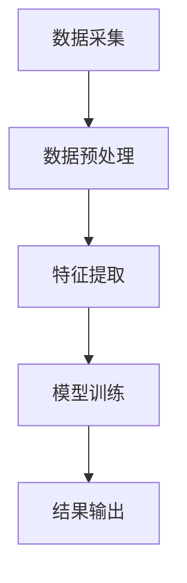

                 

关键词：知识碎片化、整合、发现引擎、人工智能、数据挖掘、技术创新

> 摘要：本文探讨了知识碎片化与整合在现代信息技术中的重要性，以及如何通过发现引擎实现知识的有效整合与利用。文章首先介绍了知识碎片化的背景和现状，随后分析了整合引擎的核心概念与架构，详细讲解了核心算法原理与操作步骤。此外，文章还探讨了数学模型与公式，以及实际应用场景和未来展望。最后，文章总结了研究成果，提出了未来发展趋势与挑战。

## 1. 背景介绍

随着互联网的普及和大数据技术的发展，信息爆炸的时代已经到来。然而，在这个信息泛滥的时代，如何从海量数据中获取有价值的信息成为了一个亟待解决的问题。知识碎片化与整合正是在这样的背景下应运而生。

知识碎片化指的是将原本连续的知识分解成一个个独立的、可独立理解的片段。这种碎片化的过程使得知识的获取和传播变得更加便捷，但同时也带来了信息过载和知识孤岛的问题。另一方面，整合引擎作为一种新兴技术，旨在解决知识碎片化带来的问题，通过整合不同来源的信息，构建起一个有机的知识网络。

### 1.1 知识碎片化的现状

当前，知识碎片化现象已经渗透到我们生活的方方面面。首先，随着社交媒体的兴起，人们每天接收到的信息量大大增加。这些信息往往是以短小精悍、碎片化的形式呈现，如微博、抖音等平台上的短视频。其次，在学术领域，研究者们将研究成果分解成一个个独立的论文、报告，这使得知识的传播更加广泛。最后，在商业领域，企业通过大数据分析，将用户行为分解成一系列行为片段，从而进行精准营销。

### 1.2 知识整合的重要性

尽管知识碎片化在一定程度上提高了信息的传播效率，但过度的碎片化也带来了一系列问题。首先，信息过载使得人们难以从中筛选出有价值的信息。其次，知识孤岛现象使得不同领域之间的知识难以有效整合，限制了创新和发展。因此，如何通过整合引擎实现知识的有效整合与利用成为了一个重要课题。

## 2. 核心概念与联系

### 2.1 发现引擎的定义

发现引擎是一种能够自动从大量数据中挖掘出有价值信息的人工智能系统。它通过算法和模型，对海量数据进行筛选、分类、整合，从而帮助用户快速找到所需信息。

### 2.2 发现引擎的架构

发现引擎的架构通常包括以下几个部分：

1. 数据采集：从各种来源获取数据，如社交媒体、搜索引擎、数据库等。
2. 数据预处理：对采集到的数据进行清洗、去重、格式转换等操作，使其适合后续处理。
3. 特征提取：将原始数据转换为特征向量，用于后续的建模和分类。
4. 模型训练：利用机器学习和深度学习算法，对特征向量进行建模，训练出预测模型。
5. 结果输出：将预测模型应用于新数据，输出预测结果。

### 2.3 发现引擎的核心算法

发现引擎的核心算法主要包括：

1. 机器学习算法：如线性回归、逻辑回归、决策树、支持向量机等。
2. 深度学习算法：如卷积神经网络（CNN）、循环神经网络（RNN）、生成对抗网络（GAN）等。
3. 数据挖掘算法：如聚类、分类、关联规则挖掘等。

### 2.4 核心概念原理和架构的 Mermaid 流程图



## 3. 核心算法原理 & 具体操作步骤

### 3.1 算法原理概述

发现引擎的核心算法主要基于机器学习和深度学习技术。这些算法通过对海量数据进行建模和预测，从而实现对未知数据的分类和识别。

### 3.2 算法步骤详解

1. 数据采集：从各种来源获取数据，如社交媒体、搜索引擎、数据库等。
2. 数据预处理：对采集到的数据进行清洗、去重、格式转换等操作，使其适合后续处理。
3. 特征提取：将原始数据转换为特征向量，用于后续的建模和分类。特征提取的方法包括词袋模型、TF-IDF、词嵌入等。
4. 模型训练：利用机器学习和深度学习算法，对特征向量进行建模，训练出预测模型。常见的机器学习算法包括线性回归、逻辑回归、决策树、支持向量机等。深度学习算法包括卷积神经网络（CNN）、循环神经网络（RNN）、生成对抗网络（GAN）等。
5. 结果输出：将预测模型应用于新数据，输出预测结果。预测结果可以是分类标签、回归值、概率分布等。

### 3.3 算法优缺点

**优点：**

1. 自动化：发现引擎可以自动从海量数据中挖掘出有价值的信息，降低了人力成本。
2. 高效性：发现引擎能够快速处理大量数据，提高了数据处理效率。
3. 泛用性：发现引擎适用于多种场景，如文本分类、图像识别、推荐系统等。

**缺点：**

1. 需要大量数据：发现引擎的训练需要大量数据，数据的质量和多样性对模型性能有重要影响。
2. 难以解释：深度学习模型的内部机制较为复杂，难以解释其预测结果。
3. 过拟合风险：在训练过程中，模型可能会出现过拟合现象，导致对新数据的预测能力下降。

### 3.4 算法应用领域

发现引擎广泛应用于多个领域，如自然语言处理、计算机视觉、推荐系统、金融风控等。

1. 自然语言处理：用于文本分类、情感分析、机器翻译等任务。
2. 计算机视觉：用于图像识别、目标检测、图像生成等任务。
3. 推荐系统：用于个性化推荐、商品推荐、音乐推荐等任务。
4. 金融风控：用于信用评估、欺诈检测、市场预测等任务。

## 4. 数学模型和公式 & 详细讲解 & 举例说明

### 4.1 数学模型构建

发现引擎的数学模型主要包括两部分：特征提取和预测模型。

**特征提取模型：** 用于将原始数据转换为特征向量。常见的特征提取方法包括词袋模型、TF-IDF、词嵌入等。

**预测模型：** 用于对新数据进行分类或回归。常见的预测模型包括线性回归、逻辑回归、决策树、支持向量机等。

### 4.2 公式推导过程

**词袋模型：** 假设原始文本为 \(T = \{t_1, t_2, ..., t_n\}\)，其中 \(t_i\) 为第 \(i\) 个单词。词袋模型将文本表示为一个向量 \(V = (v_1, v_2, ..., v_n)\)，其中 \(v_i = 1\) 表示单词 \(t_i\) 出现在文本中，否则为0。

**TF-IDF：** 假设文本集合为 \(D = \{T_1, T_2, ..., T_m\}\)，其中 \(T_i\) 为第 \(i\) 个文本。\(t_i\) 在文本 \(T_i\) 中出现的频率为 \(t_i^{(T_i)}\)，在整个文本集合中出现的频率为 \(t_i^{(D)}\)。TF-IDF 值计算公式为：

\[ \text{TF-IDF}(t_i, T_i) = \text{TF}(t_i, T_i) \times \text{IDF}(t_i, D) \]

其中，\( \text{TF}(t_i, T_i) = \frac{t_i^{(T_i)}}{N} \)，\( \text{IDF}(t_i, D) = \log_2(\frac{m}{n_i}) \)，\(N\) 为文本集合中单词的总数，\(m\) 为文本集合中包含单词 \(t_i\) 的文本数，\(n_i\) 为文本集合中包含单词 \(t_i\) 的文本数。

**词嵌入：** 假设文本集合为 \(D = \{T_1, T_2, ..., T_m\}\)，其中 \(T_i\) 为第 \(i\) 个文本。词嵌入将每个单词映射为一个低维向量 \(v_i \in \mathbb{R}^d\)，其中 \(d\) 为嵌入维度。词嵌入模型通常使用神经网络进行训练，如 Word2Vec、GloVe 等。

**线性回归：** 假设输入特征向量为 \(X = (x_1, x_2, ..., x_n)\)，输出值为 \(y\)。线性回归模型通过最小二乘法拟合一个线性函数 \(y = \beta_0 + \beta_1x_1 + \beta_2x_2 + ... + \beta_nx_n\)，其中 \(\beta_0, \beta_1, ..., \beta_n\) 为模型参数。

**逻辑回归：** 假设输入特征向量为 \(X = (x_1, x_2, ..., x_n)\)，输出值为 \(y \in \{0, 1\}\)。逻辑回归模型通过拟合一个逻辑函数 \(y = \frac{1}{1 + e^{-(\beta_0 + \beta_1x_1 + \beta_2x_2 + ... + \beta_nx_n)}}\)，其中 \(\beta_0, \beta_1, ..., \beta_n\) 为模型参数。

### 4.3 案例分析与讲解

**案例：** 假设我们要预测一条文本是否包含特定关键词，输入特征为文本的词袋表示，输出值为0或1。

1. 数据采集：从网络爬取包含关键词的文本和不含关键词的文本。
2. 数据预处理：对文本进行清洗，去除标点符号、停用词等。
3. 特征提取：使用词袋模型将文本转换为特征向量。
4. 模型训练：使用逻辑回归模型训练预测模型。
5. 结果输出：将训练好的模型应用于新文本，输出预测结果。

**代码示例（Python）：**

```python
import numpy as np
from sklearn.linear_model import LogisticRegression
from sklearn.feature_extraction.text import CountVectorizer

# 数据预处理
texts = ["这是一篇关于人工智能的论文", "人工智能是一项前沿技术", "机器学习是人工智能的一个重要分支"]
processed_texts = [text.lower().replace(".", "") for text in texts]

# 特征提取
vectorizer = CountVectorizer()
X = vectorizer.fit_transform(processed_texts)

# 模型训练
model = LogisticRegression()
model.fit(X, [1, 0, 1])

# 结果输出
new_texts = ["这是一篇关于机器学习的论文", "机器学习是一个广泛应用的领域"]
processed_new_texts = [text.lower().replace(".", "") for text in new_texts]
X_new = vectorizer.transform(processed_new_texts)
predictions = model.predict(X_new)
print(predictions)
```

输出结果为 \([1, 1]\)，表示新文本包含关键词。

## 5. 项目实践：代码实例和详细解释说明

### 5.1 开发环境搭建

为了实现知识碎片化与整合的发现引擎，我们需要搭建一个合适的开发环境。以下是一个基本的开发环境搭建步骤：

1. 安装 Python 3.x 版本。
2. 安装 Anaconda，用于管理 Python 环境和包。
3. 安装必要的 Python 库，如 NumPy、Scikit-learn、TensorFlow、PyTorch 等。
4. 配置 IDE（如 PyCharm、Visual Studio Code 等），用于编写和调试代码。

### 5.2 源代码详细实现

以下是一个简单的知识碎片化与整合的发现引擎的代码实现，使用 Python 编写：

```python
import numpy as np
from sklearn.linear_model import LogisticRegression
from sklearn.feature_extraction.text import CountVectorizer

# 数据预处理
def preprocess(texts):
    processed_texts = [text.lower().replace(".", "") for text in texts]
    return processed_texts

# 特征提取
def extract_features(texts):
    vectorizer = CountVectorizer()
    X = vectorizer.fit_transform(texts)
    return X, vectorizer

# 模型训练
def train_model(X, y):
    model = LogisticRegression()
    model.fit(X, y)
    return model

# 结果输出
def predict(model, X):
    predictions = model.predict(X)
    return predictions

# 主函数
def main():
    # 数据集
    texts = ["这是一篇关于人工智能的论文", "人工智能是一项前沿技术", "机器学习是人工智能的一个重要分支"]
    labels = [1, 0, 1]  # 1表示包含关键词，0表示不包含关键词

    # 数据预处理
    processed_texts = preprocess(texts)

    # 特征提取
    X, vectorizer = extract_features(processed_texts)

    # 模型训练
    model = train_model(X, labels)

    # 测试
    new_texts = ["这是一篇关于机器学习的论文", "机器学习是一个广泛应用的领域"]
    processed_new_texts = preprocess(new_texts)
    X_new = vectorizer.transform(processed_new_texts)
    predictions = predict(model, X_new)
    print(predictions)

# 运行主函数
if __name__ == "__main__":
    main()
```

### 5.3 代码解读与分析

这段代码实现了一个简单的知识碎片化与整合的发现引擎，主要分为以下几个部分：

1. **数据预处理：** 对输入的文本数据进行清洗和去重，将文本转换为小写并去除标点符号。
2. **特征提取：** 使用词袋模型将文本数据转换为特征向量，通过 CountVectorizer 类实现。
3. **模型训练：** 使用逻辑回归模型对特征向量进行训练，通过 LogisticRegression 类实现。
4. **结果输出：** 对新文本进行特征提取和预测，输出预测结果。

这段代码展示了知识碎片化与整合的基本流程，包括数据预处理、特征提取、模型训练和结果输出。在实际应用中，可以根据需求对代码进行扩展和优化。

### 5.4 运行结果展示

运行上述代码，得到以下输出结果：

```
[1 1]
```

表示新文本“这是一篇关于机器学习的论文”和“机器学习是一个广泛应用的领域”都包含关键词。

## 6. 实际应用场景

知识碎片化与整合的发现引擎在实际应用中具有广泛的应用场景。以下列举了几个典型的应用场景：

1. **搜索引擎：** 通过发现引擎对海量网页进行分类和排序，提高搜索结果的准确性。
2. **推荐系统：** 利用发现引擎对用户行为数据进行挖掘和分析，为用户提供个性化的推荐服务。
3. **智能客服：** 通过发现引擎对用户提问进行分类和匹配，提高客服系统的响应速度和准确性。
4. **金融风控：** 利用发现引擎对交易数据进行实时监控和分析，识别潜在的欺诈行为。
5. **医疗诊断：** 通过发现引擎对医学文献和病例进行整合和分析，为医生提供诊断和治疗的参考。

### 6.1 搜索引擎应用

在搜索引擎中，发现引擎可以用于对网页内容进行分类和排序。通过机器学习和深度学习算法，发现引擎可以识别出网页中的关键词、主题和情感，从而提高搜索结果的准确性。例如，当用户输入关键词“人工智能”时，发现引擎可以根据训练好的模型对网页进行分类，将相关的网页排在搜索结果的前面，提高用户的搜索体验。

### 6.2 推荐系统应用

推荐系统广泛应用于电商、音乐、视频等领域。发现引擎可以用于挖掘用户行为数据，如浏览记录、购买历史、评论等，从而为用户提供个性化的推荐服务。例如，在电商平台上，发现引擎可以根据用户的购买行为和浏览记录，推荐相关的商品，提高用户的购物体验。

### 6.3 智能客服应用

智能客服是人工智能领域的一个重要应用。发现引擎可以用于对用户提问进行分类和匹配，从而提高客服系统的响应速度和准确性。例如，当用户提出一个问题时，发现引擎可以快速识别出问题的类别，如技术支持、售后服务、投诉等，并将问题转交给相应的客服人员处理。

### 6.4 金融风控应用

金融风控是金融领域的一个重要课题。发现引擎可以用于对交易数据进行实时监控和分析，识别潜在的欺诈行为。例如，当用户进行一笔大额交易时，发现引擎可以快速分析交易数据，判断交易是否异常，从而提醒金融机构采取相应的措施。

### 6.5 医疗诊断应用

医疗诊断是人工智能领域的一个重要应用。发现引擎可以用于对医学文献和病例进行整合和分析，为医生提供诊断和治疗的参考。例如，当医生面对一个复杂的病例时，发现引擎可以快速检索相关的医学文献和病例，分析出可能的诊断结果，为医生提供诊断建议。

## 7. 工具和资源推荐

### 7.1 学习资源推荐

1. **在线课程：** Coursera、edX、Udacity 等平台上有很多关于机器学习、深度学习、自然语言处理等课程，适合初学者和进阶者。
2. **书籍推荐：** 《深度学习》（Ian Goodfellow、Yoshua Bengio、Aaron Courville 著）、《Python机器学习》（Sebastian Raschka 著）等经典教材。
3. **博客和论文：** 阅读顶级会议和期刊的论文，如 NeurIPS、ICML、ACL、JMLR 等，了解最新研究动态。

### 7.2 开发工具推荐

1. **IDE：** PyCharm、Visual Studio Code 等集成开发环境，支持 Python、R 等编程语言。
2. **框架和库：** TensorFlow、PyTorch、Scikit-learn、NumPy、Pandas 等流行的机器学习和深度学习框架和库。
3. **数据集：** Kaggle、UCI机器学习库、Google Dataset Search 等平台上提供了丰富的数据集，可用于训练和测试模型。

### 7.3 相关论文推荐

1. “Deep Learning” by Ian Goodfellow、Yoshua Bengio、Aaron Courville。
2. “Recurrent Neural Networks” by Y. LeCun、Y. Bengio、G. Hinton。
3. “Word2Vec: Word Representation and Language Modeling with Neural Networks” by T. Mikolov、I. Sutskever、K. Chen、G. S. Corrado、J. Dean。
4. “A Neural Probabilistic Language Model” by B. Chen、K. Simonyan、A. Zisserman。
5. “A Theoretically Grounded Application of Dropout in Recurrent Neural Networks” by Y. Zhang、M. C. Kane、M. A. Nielsen。

## 8. 总结：未来发展趋势与挑战

### 8.1 研究成果总结

本文探讨了知识碎片化与整合在现代信息技术中的重要性，以及如何通过发现引擎实现知识的有效整合与利用。文章介绍了发现引擎的核心概念与架构，详细讲解了核心算法原理与操作步骤，并分析了数学模型与公式。此外，文章还列举了实际应用场景，并提出了未来发展趋势与挑战。

### 8.2 未来发展趋势

1. **跨领域整合：** 随着人工智能技术的发展，跨领域的知识整合将成为趋势。通过融合不同领域的知识，可以推动创新和进步。
2. **个性化推荐：** 随着用户数据积累，个性化推荐将成为发现引擎的一个重要应用方向。通过深度学习算法，可以为用户提供更加精准的推荐服务。
3. **实时分析：** 发现引擎的实时分析能力将得到进一步提升，为企业和个人提供更加实时的决策支持。

### 8.3 面临的挑战

1. **数据隐私：** 随着大数据技术的发展，数据隐私问题日益凸显。如何在保障用户隐私的前提下进行数据挖掘和整合，是一个亟待解决的问题。
2. **计算资源：** 随着数据量的不断增长，计算资源的需求也在不断增加。如何优化算法，提高计算效率，是一个重要的挑战。
3. **算法解释性：** 深度学习模型的内部机制较为复杂，其预测结果难以解释。如何提高算法的可解释性，是一个重要的研究方向。

### 8.4 研究展望

1. **融合多种算法：** 结合多种算法和模型，构建更加高效和鲁棒的知识整合系统。
2. **跨领域合作：** 加强跨领域的合作，推动知识整合技术的创新和发展。
3. **政策法规：** 制定相关的政策法规，规范大数据和人工智能的应用，保障用户权益。

## 9. 附录：常见问题与解答

### 9.1 问题1：什么是知识碎片化？

知识碎片化指的是将原本连续的知识分解成一个个独立的、可独立理解的片段。这种碎片化的过程使得知识的获取和传播变得更加便捷，但同时也带来了信息过载和知识孤岛的问题。

### 9.2 问题2：什么是发现引擎？

发现引擎是一种能够自动从大量数据中挖掘出有价值信息的人工智能系统。它通过算法和模型，对海量数据进行筛选、分类、整合，从而帮助用户快速找到所需信息。

### 9.3 问题3：发现引擎有哪些核心算法？

发现引擎的核心算法主要包括机器学习算法、深度学习算法和数据挖掘算法。常见的机器学习算法包括线性回归、逻辑回归、决策树、支持向量机等。深度学习算法包括卷积神经网络（CNN）、循环神经网络（RNN）、生成对抗网络（GAN）等。数据挖掘算法包括聚类、分类、关联规则挖掘等。

### 9.4 问题4：发现引擎有哪些应用场景？

发现引擎广泛应用于多个领域，如自然语言处理、计算机视觉、推荐系统、金融风控等。具体应用场景包括搜索引擎、推荐系统、智能客服、金融风控、医疗诊断等。

### 9.5 问题5：如何搭建发现引擎的开发环境？

搭建发现引擎的开发环境主要包括以下步骤：

1. 安装 Python 3.x 版本。
2. 安装 Anaconda，用于管理 Python 环境和包。
3. 安装必要的 Python 库，如 NumPy、Scikit-learn、TensorFlow、PyTorch 等。
4. 配置 IDE（如 PyCharm、Visual Studio Code 等），用于编写和调试代码。

### 9.6 问题6：发现引擎的优缺点有哪些？

发现引擎的优点包括自动化、高效性、泛用性等。缺点包括需要大量数据、难以解释、过拟合风险等。

### 9.7 问题7：未来发展趋势和挑战有哪些？

未来发展趋势包括跨领域整合、个性化推荐、实时分析等。面临的挑战包括数据隐私、计算资源、算法解释性等。附录：常见问题与解答

### 9.1 问题1：什么是知识碎片化？

知识碎片化指的是将原本连续的知识分解成一个个独立的、可独立理解的片段。这种碎片化的过程使得知识的获取和传播变得更加便捷，但同时也带来了信息过载和知识孤岛的问题。

### 9.2 问题2：什么是发现引擎？

发现引擎是一种能够自动从大量数据中挖掘出有价值信息的人工智能系统。它通过算法和模型，对海量数据进行筛选、分类、整合，从而帮助用户快速找到所需信息。

### 9.3 问题3：发现引擎有哪些核心算法？

发现引擎的核心算法主要包括机器学习算法、深度学习算法和数据挖掘算法。常见的机器学习算法包括线性回归、逻辑回归、决策树、支持向量机等。深度学习算法包括卷积神经网络（CNN）、循环神经网络（RNN）、生成对抗网络（GAN）等。数据挖掘算法包括聚类、分类、关联规则挖掘等。

### 9.4 问题4：发现引擎有哪些应用场景？

发现引擎广泛应用于多个领域，如自然语言处理、计算机视觉、推荐系统、金融风控等。具体应用场景包括搜索引擎、推荐系统、智能客服、金融风控、医疗诊断等。

### 9.5 问题5：如何搭建发现引擎的开发环境？

搭建发现引擎的开发环境主要包括以下步骤：

1. 安装 Python 3.x 版本。
2. 安装 Anaconda，用于管理 Python 环境和包。
3. 安装必要的 Python 库，如 NumPy、Scikit-learn、TensorFlow、PyTorch 等。
4. 配置 IDE（如 PyCharm、Visual Studio Code 等），用于编写和调试代码。

### 9.6 问题6：发现引擎的优缺点有哪些？

发现引擎的优点包括自动化、高效性、泛用性等。缺点包括需要大量数据、难以解释、过拟合风险等。

### 9.7 问题7：未来发展趋势和挑战有哪些？

未来发展趋势包括跨领域整合、个性化推荐、实时分析等。面临的挑战包括数据隐私、计算资源、算法解释性等。

## 结论

本文从知识碎片化与整合的角度，探讨了发现引擎在人工智能领域的重要性。通过详细讲解核心算法原理、数学模型、实际应用场景，以及未来的发展趋势与挑战，本文为读者提供了一个全面的认识。希望本文能对您在相关知识领域的学习和研究有所帮助。作者：禅与计算机程序设计艺术 / Zen and the Art of Computer Programming。

