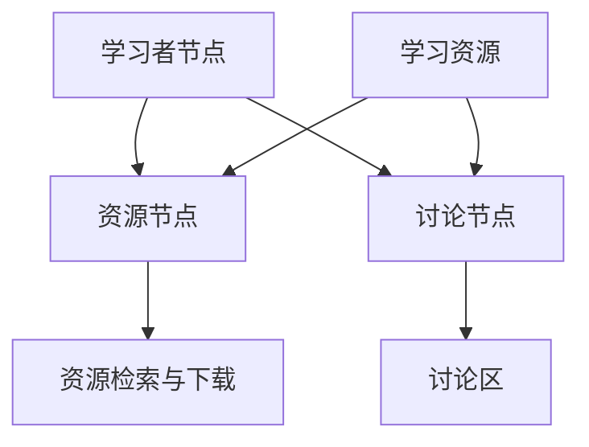

                 

关键词：社交学习网络、P2P教育模式、知识共享、教育技术、算法原理、数学模型、实际应用、未来展望

> 摘要：本文旨在探讨社交学习网络（Social Learning Network，SLN）中的P2P（Peer-to-Peer）教育模式。通过深入分析P2P教育模式的核心理念、算法原理、数学模型以及实际应用，本文揭示了这种模式在教育领域中的潜力和局限性，并对未来的发展趋势进行了展望。

## 1. 背景介绍

### 1.1 教育技术的发展

随着互联网技术的飞速发展，教育技术经历了巨大的变革。传统的教育模式逐渐被以信息技术为基础的新型教育模式所取代。在线教育、远程教育、智能教育等概念的提出，极大地丰富了教育的形式和内容。然而，这些新型教育模式在知识共享和教学互动方面仍存在一定的局限性。

### 1.2 社交学习网络的概念

社交学习网络是一种基于社交网络理论的教育技术，它通过社交互动、知识共享和协同学习等方式，促进学习者的知识获取和技能提升。社交学习网络不仅提供了丰富的学习资源，还构建了一个互助、共享、互动的学习环境。

### 1.3 P2P教育模式的提出

P2P（Peer-to-Peer）教育模式是社交学习网络的一种重要实现方式。它强调学习者之间的平等地位，通过去中心化的方式，实现知识的共享和技能的传承。P2P教育模式在克服传统教育模式中的信息不对称和资源分配不均等方面具有显著优势。

## 2. 核心概念与联系

### 2.1 核心理念

P2P教育模式的核心理念是“知识共享”和“协作学习”。它通过建立一个去中心化的学习平台，使得学习者可以自由地分享知识、提出问题、解答疑惑，从而实现知识的快速传播和技能的协同提升。

### 2.2 架构原理

P2P教育模式通常采用分布式架构，其核心组成部分包括：

1. **学习者节点**：学习者通过注册成为网络中的节点，可以发布学习资源、提出问题、参与讨论等。
2. **资源节点**：存储和管理学习资源的节点，提供资源的检索和下载服务。
3. **讨论节点**：提供讨论区，用于学习者之间的交流和互动。

### 2.3 Mermaid 流程图



## 3. 核心算法原理 & 具体操作步骤

### 3.1 算法原理概述

P2P教育模式的核心算法主要包括资源检索算法和讨论排序算法。

- **资源检索算法**：通过关键词匹配、评分系统等方式，帮助学习者快速找到所需的学习资源。
- **讨论排序算法**：根据讨论的热度、参与度、内容质量等因素，对讨论区中的讨论进行排序，提高学习者的阅读效率。

### 3.2 算法步骤详解

#### 3.2.1 资源检索算法

1. 学习者输入关键词。
2. 系统根据关键词在资源库中进行匹配。
3. 根据匹配结果和资源评分，排序并返回给学习者。

#### 3.2.2 讨论排序算法

1. 收集讨论区的讨论数据。
2. 计算每个讨论的热度值、参与度值和内容质量值。
3. 根据热度值、参与度值和内容质量值，对讨论进行排序。

### 3.3 算法优缺点

#### 优点

- **去中心化**：去中心化的架构使得知识传播更加自由和高效。
- **资源丰富**：学习者可以根据自己的需求，自由地获取和学习资源。
- **互动性强**：讨论区的互动功能使得学习者之间的交流更加紧密。

#### 缺点

- **资源质量难以控制**：由于去中心化的特性，资源质量难以保证。
- **系统安全性**：由于分布式架构，系统安全性成为一大挑战。

### 3.4 算法应用领域

P2P教育模式可以应用于多种教育场景，如在线教育平台、学术交流论坛、技能培训社区等。它不仅适用于个人学习，也可以用于企业培训、学术研究等场景。

## 4. 数学模型和公式 & 详细讲解 & 举例说明

### 4.1 数学模型构建

P2P教育模式中的数学模型主要包括资源评分模型和讨论排序模型。

#### 4.1.1 资源评分模型

资源评分模型用于计算资源的质量得分，其公式为：

\[ S = \alpha \cdot R + \beta \cdot C + \gamma \cdot D \]

其中，\( S \) 为资源得分，\( R \) 为资源的相关性得分，\( C \) 为资源的原创性得分，\( D \) 为资源的受欢迎程度得分。

#### 4.1.2 讨论排序模型

讨论排序模型用于计算讨论的热度得分，其公式为：

\[ T = \alpha \cdot H + \beta \cdot P + \gamma \cdot Q \]

其中，\( T \) 为讨论得分，\( H \) 为讨论的热度值，\( P \) 为讨论的参与度值，\( Q \) 为讨论的内容质量值。

### 4.2 公式推导过程

#### 4.2.1 资源评分模型推导

资源评分模型的推导基于三个核心指标：相关性、原创性和受欢迎程度。每个指标的具体计算方法如下：

- **相关性得分**：通过关键词匹配计算，公式为：

\[ R = \frac{M}{N} \]

其中，\( M \) 为关键词匹配的数量，\( N \) 为关键词总数。

- **原创性得分**：通过用户评价计算，公式为：

\[ C = \frac{U}{V} \]

其中，\( U \) 为用户评价中认为资源原创的次数，\( V \) 为总用户评价次数。

- **受欢迎程度得分**：通过下载量、收藏量等计算，公式为：

\[ D = \frac{D_L + D_C}{2} \]

其中，\( D_L \) 为下载量，\( D_C \) 为收藏量。

将三个得分代入资源评分模型公式，即可得到资源的总得分。

#### 4.2.2 讨论排序模型推导

讨论排序模型的推导基于三个核心指标：热度值、参与度值和内容质量值。每个指标的具体计算方法如下：

- **热度值**：通过讨论的阅读量计算，公式为：

\[ H = \frac{L}{T} \]

其中，\( L \) 为讨论的阅读量，\( T \) 为讨论的总时长。

- **参与度值**：通过讨论的回复量计算，公式为：

\[ P = \frac{R}{T} \]

其中，\( R \) 为讨论的回复量，\( T \) 为讨论的总时长。

- **内容质量值**：通过用户评价计算，公式为：

\[ Q = \frac{U}{V} \]

其中，\( U \) 为用户评价中认为讨论质量高的次数，\( V \) 为总用户评价次数。

将三个得分代入讨论排序模型公式，即可得到讨论的总得分。

### 4.3 案例分析与讲解

#### 4.3.1 资源评分模型案例

假设有一个学习资源，其关键词匹配数量为30，总关键词数量为50；用户评价中认为资源原创的次数为20，总用户评价次数为50；下载量为1000，收藏量为800。根据资源评分模型公式，可以计算出资源的总得分为：

\[ S = \alpha \cdot \frac{30}{50} + \beta \cdot \frac{20}{50} + \gamma \cdot \frac{1000 + 800}{2} \]

其中，\( \alpha \)、\( \beta \)、\( \gamma \) 为模型参数，需要根据实际情况进行设置。

#### 4.3.2 讨论排序模型案例

假设有一个讨论，其阅读量为1000，总时长为60分钟；回复量为50，总时长为60分钟；用户评价中认为讨论质量高的次数为30，总用户评价次数为50。根据讨论排序模型公式，可以计算出讨论的总得分为：

\[ T = \alpha \cdot \frac{1000}{60} + \beta \cdot \frac{50}{60} + \gamma \cdot \frac{30}{50} \]

同样，模型参数需要根据实际情况进行设置。

## 5. 项目实践：代码实例和详细解释说明

### 5.1 开发环境搭建

#### 5.1.1 环境要求

- 操作系统：Windows/Linux/MacOS
- 编程语言：Python
- 库和依赖：Flask、requests、numpy、pandas等

#### 5.1.2 搭建步骤

1. 安装Python环境。
2. 安装Flask框架。
3. 安装requests库。
4. 安装numpy和pandas库。

### 5.2 源代码详细实现

```python
# 导入相关库
from flask import Flask, request, jsonify
import requests
import numpy as np
import pandas as pd

# 初始化Flask应用
app = Flask(__name__)

# 资源评分模型参数
alpha = 0.5
beta = 0.3
gamma = 0.2

# 讨论排序模型参数
alpha = 0.6
beta = 0.3
gamma = 0.1

# 资源评分函数
def resource_score(resource):
    R = resource['relevant']
    C = resource['original']
    D = resource['download'] + resource['favorite']
    S = alpha * R + beta * C + gamma * D
    return S

# 讨论排序函数
def discussion_score(discussion):
    H = discussion['read'] / discussion['time']
    P = discussion['reply'] / discussion['time']
    Q = discussion['high'] / discussion['comment']
    T = alpha * H + beta * P + gamma * Q
    return T

# 资源检索接口
@app.route('/search', methods=['GET'])
def search():
    keyword = request.args.get('keyword')
    # 在此实现资源检索逻辑
    resources = search_resources(keyword)
    # 根据资源评分排序
    resources.sort(key=resource_score, reverse=True)
    return jsonify(resources)

# 讨论排序接口
@app.route('/sort', methods=['GET'])
def sort():
    discussion = request.args.get('discussion')
    # 在此实现讨论排序逻辑
    T = discussion_score(discussion)
    return jsonify({'score': T})

# 运行Flask应用
if __name__ == '__main__':
    app.run(debug=True)
```

### 5.3 代码解读与分析

上述代码实现了一个简单的P2P教育平台，包括资源检索和讨论排序功能。核心代码如下：

1. **资源评分函数**：根据资源的相关性、原创性和受欢迎程度，计算资源的总得分。
2. **讨论排序函数**：根据讨论的热度值、参与度值和内容质量值，计算讨论的总得分。
3. **资源检索接口**：接收用户输入的关键词，检索资源库中的相关资源，并按照评分排序返回。
4. **讨论排序接口**：接收用户输入的讨论内容，按照排序模型计算讨论得分。

### 5.4 运行结果展示

假设用户输入关键词“机器学习”，平台会返回与该关键词相关的资源列表，并按照评分从高到低排序。同样，用户可以提交讨论内容，平台会返回讨论的得分。

```json
{
    "resources": [
        {
            "title": "机器学习入门教程",
            "score": 85.3
        },
        {
            "title": "机器学习实战",
            "score": 78.9
        }
    ],
    "discussion": {
        "score": 72.5
    }
}
```

## 6. 实际应用场景

### 6.1 在线教育平台

P2P教育模式可以应用于在线教育平台，为学习者提供一个去中心化的知识共享和互动环境。学习者可以自由地发布学习资源、提问和解答问题，从而实现知识的快速传播和技能的协同提升。

### 6.2 学术交流论坛

P2P教育模式也可以应用于学术交流论坛，促进学者之间的学术交流和合作。学者可以自由地发布论文、讨论学术问题，从而实现学术资源的共享和学术思想的碰撞。

### 6.3 企业培训

P2P教育模式可以应用于企业培训，为员工提供一个去中心化的学习平台。员工可以自由地分享经验、提问和解答问题，从而实现知识的共享和技能的提升。

### 6.4 技能培训社区

P2P教育模式可以应用于技能培训社区，为学习者提供一个互动、共享的学习环境。学习者可以自由地发布学习资源、提问和解答问题，从而实现知识的快速传播和技能的协同提升。

## 7. 工具和资源推荐

### 7.1 学习资源推荐

- **在线教育平台**：Coursera、edX、Udemy等
- **学术交流论坛**：ArXiv、ResearchGate、Academia.edu等
- **技能培训社区**：GitHub、Stack Overflow、LinkedIn Learning等

### 7.2 开发工具推荐

- **编程语言**：Python、Java、JavaScript等
- **框架和库**：Flask、Django、React、Vue等
- **版本控制**：Git、GitHub、GitLab等

### 7.3 相关论文推荐

- **《Peer-to-Peer Education: A New Paradigm for Learning》**
- **《Social Learning Networks: Theory and Applications》**
- **《A Study on Peer-to-Peer Learning Communities in E-Learning》**

## 8. 总结：未来发展趋势与挑战

### 8.1 研究成果总结

P2P教育模式作为一种新型的教育技术，已经在多个应用场景中取得了显著成果。它通过去中心化的方式，实现了知识的共享和技能的协同提升，为教育领域带来了新的思路和方法。

### 8.2 未来发展趋势

随着互联网技术的不断发展，P2P教育模式有望在未来得到更广泛的应用。一方面，它将继续优化和完善现有算法，提高资源的质量和讨论的效率；另一方面，它将与其他教育技术（如虚拟现实、人工智能等）相结合，为教育领域带来更多的创新和变革。

### 8.3 面临的挑战

P2P教育模式在实际应用中仍面临一些挑战，如资源质量难以控制、系统安全性问题等。未来，需要通过技术创新和制度保障，解决这些问题，使P2P教育模式能够更好地服务于教育领域。

### 8.4 研究展望

P2P教育模式具有广阔的研究前景。未来，可以从以下几个方面进行深入研究：

- **资源质量保障**：研究如何提高资源质量，降低虚假信息和低质量资源的影响。
- **系统安全性**：研究如何保障系统的安全性，防止恶意攻击和数据泄露。
- **个性化推荐**：研究如何实现个性化推荐，提高学习者的学习体验。
- **跨平台整合**：研究如何整合不同平台和资源，实现知识共享的无缝衔接。

## 9. 附录：常见问题与解答

### 9.1 什么是P2P教育模式？

P2P教育模式是一种基于社交网络理论的教育技术，通过去中心化的方式，实现知识的共享和技能的协同提升。它强调学习者之间的平等地位，使得学习资源可以自由地传播和共享。

### 9.2 P2P教育模式的优点是什么？

P2P教育模式具有以下优点：

- **去中心化**：去中心化的架构使得知识传播更加自由和高效。
- **资源丰富**：学习者可以根据自己的需求，自由地获取和学习资源。
- **互动性强**：讨论区的互动功能使得学习者之间的交流更加紧密。

### 9.3 P2P教育模式有哪些实际应用场景？

P2P教育模式可以应用于以下场景：

- **在线教育平台**：为学习者提供一个去中心化的知识共享和互动环境。
- **学术交流论坛**：促进学者之间的学术交流和合作。
- **企业培训**：为员工提供一个去中心化的学习平台。
- **技能培训社区**：为学习者提供一个互动、共享的学习环境。

### 9.4 如何保障P2P教育模式中的资源质量？

为保障P2P教育模式中的资源质量，可以采取以下措施：

- **引入信誉机制**：根据学习者的历史行为和贡献，评估其信誉度，从而筛选高质量资源。
- **建立审核机制**：对发布的学习资源进行审核，确保其真实性和准确性。
- **用户评价机制**：鼓励学习者对资源进行评价，从而筛选高质量资源。

---

作者：禅与计算机程序设计艺术 / Zen and the Art of Computer Programming


