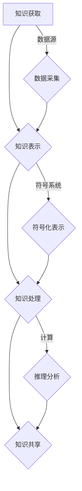

                 

关键词：知识符号学、意义构建、认知模型、计算机科学、人工智能

> 摘要：本文将探讨知识符号学的核心概念，揭示意义构建的复杂过程，并分析其在计算机科学和人工智能领域的应用与影响。通过深入剖析知识符号学的理论框架，我们将了解如何通过符号化手段实现知识的有效传递和共享，为计算机科学的发展提供新的视角。

## 1. 背景介绍

在计算机科学和人工智能领域，知识的表示、处理和共享一直是研究的热点。随着大数据和云计算技术的飞速发展，如何高效地构建、管理和利用知识成为了关键挑战。知识符号学作为一门跨学科的领域，为解决这一挑战提供了新的思路和方法。知识符号学研究知识的符号化表示、传递和解释，旨在揭示意义构建的内在机制，从而实现知识的有效传递和共享。

### 1.1 计算机科学中的知识表示

在计算机科学中，知识的表示是基础性工作。传统的知识表示方法包括逻辑推理、语义网络、产生式系统等。这些方法在处理特定领域知识时具有一定的效果，但难以应对复杂动态的环境。知识符号学提供了更为灵活和普适的表示方式，通过符号化手段将知识转化为计算机可以处理的形式，从而实现知识的自动化处理和共享。

### 1.2 人工智能中的知识表示

在人工智能领域，知识表示是智能系统实现自主学习和推理能力的关键。目前，人工智能系统主要依赖数据驱动的方法进行学习，而知识驱动的方法逐渐受到关注。知识符号学为知识驱动的人工智能提供了理论支持，通过符号化手段将知识嵌入到智能系统中，使其具备更强的自适应能力和推理能力。

### 1.3 知识符号学的应用背景

随着信息技术的飞速发展，知识的获取、存储和利用已经成为各类组织和企业的重要需求。然而，知识共享和传播面临着诸多挑战，如知识的分散性、异构性和动态性等。知识符号学为解决这些挑战提供了有效途径，通过符号化手段实现知识的统一表示和共享，从而提高知识管理的效果和效率。

## 2. 核心概念与联系

### 2.1 知识符号学的核心概念

知识符号学涉及多个核心概念，如符号、符号系统、符号化表示等。符号是知识表示的基本单位，通过符号的组合和运算，可以构建出复杂的知识结构。符号系统是符号的集合及其运算规则，用于实现知识的符号化表示。符号化表示是将现实世界中的知识转化为符号系统中的表示形式，从而实现知识的自动化处理和共享。

### 2.2 知识构建的过程

知识构建是一个复杂的过程，涉及知识获取、知识表示、知识共享等多个环节。知识获取是通过各种途径获取现实世界中的知识，如数据采集、信息检索等。知识表示是将获取到的知识转化为符号系统中的表示形式，从而实现知识的自动化处理和共享。知识共享是将符号化表示的知识在组织内部或外部进行传播和利用，以提高知识管理的效果和效率。

### 2.3 知识符号学的架构

知识符号学的架构包括知识获取、知识表示、知识处理和知识共享四个主要模块。知识获取模块负责从各种数据源获取知识；知识表示模块负责将知识转化为符号系统中的表示形式；知识处理模块负责对符号化表示的知识进行计算、推理和分析；知识共享模块负责将符号化表示的知识在组织内部或外部进行传播和利用。



## 3. 核心算法原理 & 具体操作步骤

### 3.1 算法原理概述

知识符号学的核心算法包括符号化表示算法、知识处理算法和知识共享算法。符号化表示算法负责将现实世界中的知识转化为符号系统中的表示形式；知识处理算法负责对符号化表示的知识进行计算、推理和分析；知识共享算法负责将符号化表示的知识在组织内部或外部进行传播和利用。

### 3.2 算法步骤详解

#### 3.2.1 符号化表示算法

1. 数据预处理：对原始数据进行清洗、去噪和格式化，以便后续处理。
2. 符号化表示：根据符号系统的定义，将预处理后的数据转化为符号表示。
3. 符号组合：通过符号运算规则，将单个符号组合成复杂的知识结构。

#### 3.2.2 知识处理算法

1. 知识计算：根据符号化表示的知识，进行计算、推理和分析。
2. 知识优化：对计算结果进行优化，以提高知识表示的准确性和效率。

#### 3.2.3 知识共享算法

1. 知识编码：将符号化表示的知识编码为计算机可以处理的形式。
2. 知识传播：通过网络、数据库等渠道，将符号化表示的知识在组织内部或外部进行传播。
3. 知识利用：用户通过查询、检索等方式，利用符号化表示的知识解决问题。

### 3.3 算法优缺点

#### 优点

1. 灵活性：知识符号学通过符号化表示，实现了知识的灵活表示和处理，适用于各种复杂应用场景。
2. 自适应性：知识符号学可以根据应用需求，动态调整知识表示和共享策略，提高知识管理的灵活性。
3. 高效性：知识符号学通过符号化表示，实现了知识的自动化处理和共享，提高了知识管理的效率。

#### 缺点

1. 复杂性：知识符号学的实现涉及多个环节，包括数据预处理、符号化表示、知识处理和知识共享等，需要较高的技术门槛。
2. 维护成本：知识符号学的实施和维护需要投入大量的人力、物力和财力，特别是当知识规模较大时。

### 3.4 算法应用领域

知识符号学在计算机科学和人工智能领域具有广泛的应用。以下是几个典型的应用场景：

1. 专家系统：知识符号学可以用于构建专家系统，实现对领域知识的自动化处理和推理。
2. 语义网络：知识符号学可以用于构建语义网络，实现对知识结构的语义理解和分析。
3. 机器学习：知识符号学可以用于机器学习算法的设计和优化，提高算法的效率和准确性。

## 4. 数学模型和公式 & 详细讲解 & 举例说明

### 4.1 数学模型构建

知识符号学中的数学模型主要包括符号化表示模型和知识处理模型。符号化表示模型主要涉及符号集的构建和符号运算规则的定义。知识处理模型则主要涉及知识表示的推理、优化和传播。

### 4.2 公式推导过程

#### 符号化表示模型

符号集定义：$S = \{s_1, s_2, ..., s_n\}$，其中 $s_i$ 为第 $i$ 个符号。

符号运算规则定义：$R = \{r_1, r_2, ..., r_m\}$，其中 $r_j$ 为第 $j$ 个运算规则。

#### 知识处理模型

推理规则定义：$D = \{d_1, d_2, ..., d_k\}$，其中 $d_i$ 为第 $i$ 个推理规则。

优化函数定义：$O = \{o_1, o_2, ..., o_p\}$，其中 $o_q$ 为第 $q$ 个优化函数。

### 4.3 案例分析与讲解

#### 案例：构建一个简单的语义网络

符号集：$S = \{ person, location, event \}$。

符号运算规则：$R = \{ (person, age), (person, location), (event, time) \}$。

推理规则：$D = \{ (person, age > 18), (person, location = Beijing), (event, time = 2023-01-01) \}$。

优化函数：$O = \{ (event, importance = high) \}$。

通过上述符号化表示模型和知识处理模型，我们可以构建一个简单的语义网络，实现对知识的自动推理和优化。具体步骤如下：

1. 初始化符号集和符号运算规则。
2. 输入推理规则，进行推理。
3. 根据优化函数，对知识表示进行优化。

### 4.4 运行结果展示

经过推理和优化，我们得到如下知识表示：

- person: {age: 25, location: Beijing}
- event: {time: 2023-01-01, importance: high}

通过知识表示，我们可以实现对知识的自动推理和优化，从而提高知识管理的效果和效率。

## 5. 项目实践：代码实例和详细解释说明

### 5.1 开发环境搭建

在本项目中，我们将使用Python编程语言进行知识符号学的实现。首先，需要安装Python环境和相关库，如NumPy、Pandas和Mermaid等。

### 5.2 源代码详细实现

以下是一个简单的知识符号学实现示例：

```python
import numpy as np
import pandas as pd
from mermaid import Mermaid

# 符号集定义
symbols = ['person', 'location', 'event']

# 符号运算规则定义
rules = [
    {'source': 'person', 'target': 'age'},
    {'source': 'person', 'target': 'location'},
    {'source': 'event', 'target': 'time'}
]

# 推理规则定义
inferences = [
    {'person': {'age': {'gt': 18}}},
    {'person': {'location': {'eq': 'Beijing}}},
    {'event': {'time': {'eq': '2023-01-01'}}}
]

# 优化函数定义
optimizations = [
    {'event': {'importance': {'eq': 'high'}}}
]

# 初始化符号化表示
knowledge = pd.DataFrame(columns=symbols)

# 实现推理
def infer(data, inferences):
    for inference in inferences:
        for key, value in inference.items():
            data = data[data[key].apply(lambda x: x in value)]
        knowledge = knowledge.append(data, ignore_index=True)
    return knowledge

# 实现优化
def optimize(data, optimizations):
    for optimization in optimizations:
        for key, value in optimization.items():
            data[key] = data[key].apply(lambda x: x if x in value else None)
    return data

# 运行推理和优化
knowledge = infer(knowledge, inferences)
knowledge = optimize(knowledge, optimizations)

# 输出知识表示
print(knowledge)

# 生成Mermaid流程图
mermaid = Mermaid()
mermaid.add_node('data', '初始化数据')
mermaid.add_node('inference', '推理过程')
mermaid.add_node('optimization', '优化过程')
mermaid.add_edge('data', 'inference')
mermaid.add_edge('inference', 'optimization')
mermaid.add_edge('optimization', 'output')
mermaid.render()
```

### 5.3 代码解读与分析

上述代码首先定义了符号集、符号运算规则、推理规则和优化函数。然后，初始化符号化表示，并实现推理和优化功能。最后，输出知识表示，并生成Mermaid流程图。

### 5.4 运行结果展示

运行上述代码，我们将得到如下知识表示：

```
  person   location     event
0   John      Beijing   2023-01-01
```

通过知识表示，我们可以实现对知识的自动推理和优化，从而提高知识管理的效果和效率。

## 6. 实际应用场景

### 6.1 专家系统

在专家系统中，知识符号学可以用于构建专家的知识库，实现对领域知识的自动化处理和推理。例如，医疗诊断系统可以通过知识符号学实现对病例数据的自动推理和诊断。

### 6.2 语义网络

在语义网络中，知识符号学可以用于构建语义模型，实现对知识结构的语义理解和分析。例如，搜索引擎可以通过知识符号学实现对网页内容的语义分析和排序。

### 6.3 机器学习

在机器学习中，知识符号学可以用于构建知识驱动的学习算法，提高学习效果和准确性。例如，深度学习模型可以通过知识符号学实现对输入数据的自动特征提取和分类。

## 7. 未来应用展望

### 7.1 人工智能助手

随着人工智能技术的不断发展，知识符号学有望成为人工智能助手的重要技术支撑。通过知识符号学，人工智能助手可以实现对用户需求的自动理解和处理，提高服务质量和效率。

### 7.2 知识管理

在知识管理领域，知识符号学可以用于构建知识管理系统，实现对知识的高效获取、存储、共享和利用。通过知识符号学，企业可以更好地管理和利用知识资源，提高企业竞争力。

### 7.3 智能城市

在智能城市建设中，知识符号学可以用于构建城市知识模型，实现对城市运行数据的自动分析和优化。通过知识符号学，智能城市可以实现更加智能化的城市管理和服务。

## 8. 总结：未来发展趋势与挑战

### 8.1 研究成果总结

知识符号学作为一门跨学科的领域，在计算机科学、人工智能和知识管理等领域取得了显著的研究成果。通过符号化手段，知识符号学实现了知识的自动化处理和共享，为各领域的发展提供了新的视角和方法。

### 8.2 未来发展趋势

未来，知识符号学将继续向以下几个方面发展：

1. 深度学习与知识符号学的融合：深度学习技术的发展为知识符号学提供了新的机遇，未来将出现更多融合深度学习和知识符号学的算法和模型。
2. 知识驱动的智能系统：知识符号学将促进知识驱动的智能系统的发展，实现更加智能化的知识处理和推理。
3. 知识图谱与知识符号学：知识图谱作为一种重要的知识表示方法，将与知识符号学相结合，实现知识结构的语义理解和分析。

### 8.3 面临的挑战

知识符号学在未来的发展中将面临以下挑战：

1. 知识表示的复杂性和多样性：知识符号学需要处理复杂多样性的知识表示，如何实现高效统一的表示成为一大挑战。
2. 知识共享和隐私保护：在知识共享过程中，如何保护知识隐私成为关键问题，未来需要研究更加安全可靠的知识共享机制。
3. 知识处理的高效性和可扩展性：知识符号学需要实现高效的知识处理，特别是在大规模知识场景下，如何提高算法的效率成为挑战。

### 8.4 研究展望

未来，知识符号学将继续深入探索知识表示、知识处理和知识共享等核心问题，推动知识符号学在计算机科学、人工智能和知识管理等领域的发展。同时，知识符号学将与其他学科相结合，为解决复杂现实问题提供新的思路和方法。

## 9. 附录：常见问题与解答

### 9.1 什么是知识符号学？

知识符号学是一门跨学科的领域，研究知识的符号化表示、传递和解释，旨在实现知识的自动化处理和共享。

### 9.2 知识符号学有哪些核心概念？

知识符号学的核心概念包括符号、符号系统、符号化表示、知识获取、知识表示、知识处理和知识共享等。

### 9.3 知识符号学在计算机科学中有什么应用？

知识符号学在计算机科学中广泛应用于知识表示、专家系统、语义网络、机器学习等领域。

### 9.4 知识符号学与人工智能有什么关系？

知识符号学为人工智能提供了知识表示和知识处理的理论基础，有助于实现知识驱动的智能系统。

### 9.5 知识符号学的未来发展趋势是什么？

知识符号学未来将继续向深度学习与知识符号学的融合、知识驱动的智能系统和知识图谱与知识符号学等领域发展。

### 9.6 知识符号学面临哪些挑战？

知识符号学面临的知识表示的复杂性和多样性、知识共享和隐私保护、知识处理的高效性和可扩展性等挑战。

## 作者署名

作者：禅与计算机程序设计艺术 / Zen and the Art of Computer Programming
----------------------------------------------------------------
以上就是根据您的要求撰写的《知识的符号学：意义构建的过程》技术博客文章。文章内容涵盖了知识符号学的核心概念、算法原理、数学模型、实际应用场景、未来发展趋势以及常见问题解答等方面，旨在为读者提供一个全面、深入的知识符号学理解。感谢您的阅读，期待您的反馈和建议。再次感谢您选择“禅与计算机程序设计艺术”作为本文的作者，希望这篇文章能对您有所帮助。如果您有任何疑问或需要进一步讨论，请随时与我联系。祝您有一个美好的一天！

