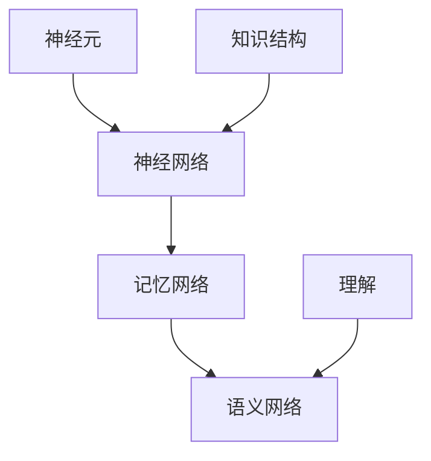

                 

关键词：知识结构、记忆、理解、人工智能、神经网络、认知科学

> 摘要：本文将探讨知识结构的概念，分析记忆与理解之间的关系，结合人工智能和认知科学的研究成果，提出一种新的知识表示和推理方法，并展望其在教育、医疗等领域的应用前景。

## 1. 背景介绍

在信息爆炸的时代，如何有效地组织和管理知识成为了一个重要课题。知识结构的理解不仅有助于我们更好地记忆和应用知识，还能推动人工智能和认知科学的发展。本文将围绕知识结构，深入探讨记忆与理解的关系，并提出一种新的知识表示和推理方法。

### 1.1 知识结构的定义

知识结构是指知识之间的相互联系和层次组织。它包括知识的分类、概念之间的关系以及知识的表示形式。传统的知识结构模型主要有层次模型、网络模型和语义网络模型等。这些模型各有优缺点，但都无法完全满足复杂知识组织的需求。

### 1.2 记忆与理解的关系

记忆是理解的基础，理解是记忆的深化。记忆与理解之间的关系可以类比为一座金字塔，底层是记忆，中层是理解，顶层是创新。只有通过有效的记忆，我们才能构建出合理的知识结构，从而实现更深层次的理解和创新。

## 2. 核心概念与联系

在探讨知识结构时，我们需要引入一些核心概念，如神经元、神经网络、记忆网络和语义网络等。以下是一个简单的 Mermaid 流程图，展示了这些概念之间的关系。



### 2.1 神经元

神经元是神经网络的基本单元，它负责接收和处理信息。神经元之间通过突触进行连接，形成神经网络。

### 2.2 神经网络

神经网络是由大量神经元组成的复杂网络，它可以通过学习实现数据的输入和输出。神经网络可以分为多层，如输入层、隐藏层和输出层。

### 2.3 记忆网络

记忆网络是一种特殊的神经网络，它负责存储和检索信息。记忆网络可以通过联想记忆、内容地址记忆等方式实现高效的信息检索。

### 2.4 语义网络

语义网络是一种基于语义关系的知识表示方法，它将概念、实体和关系组织成一个网络结构。语义网络有助于我们理解和推理复杂知识。

## 3. 核心算法原理 & 具体操作步骤

在本文中，我们将提出一种基于神经网络的知识表示和推理方法。该方法包括以下几个核心步骤：

### 3.1 算法原理概述

该方法基于神经网络，通过训练学习输入和输出之间的映射关系，从而实现知识的表示和推理。具体来说，该方法包括以下几个关键模块：

1. **输入模块**：接收外部输入信息，如文本、图像、声音等。
2. **预处理模块**：对输入信息进行预处理，如分词、编码等。
3. **神经网络模块**：通过多层神经网络实现知识的表示和推理。
4. **输出模块**：输出推理结果。

### 3.2 算法步骤详解

1. **初始化神经网络**：根据任务需求，初始化神经网络结构，包括输入层、隐藏层和输出层。
2. **输入预处理**：对输入信息进行预处理，如分词、编码等。
3. **正向传播**：将预处理后的输入信息输入到神经网络中，通过隐藏层和输出层进行计算。
4. **反向传播**：计算输出层的误差，并利用误差信号更新网络参数。
5. **迭代训练**：重复执行正向传播和反向传播，直到网络收敛。
6. **知识表示和推理**：利用训练好的神经网络进行知识表示和推理。

### 3.3 算法优缺点

该方法的优点包括：

1. **灵活性强**：可以处理多种类型的输入信息。
2. **自适应性强**：可以根据任务需求调整网络结构和参数。
3. **推理能力强**：能够实现复杂的知识表示和推理。

缺点包括：

1. **计算复杂度高**：神经网络训练需要大量的计算资源。
2. **数据依赖性强**：需要大量高质量的数据进行训练。

### 3.4 算法应用领域

该方法可以应用于多个领域，如自然语言处理、计算机视觉、推荐系统等。具体应用案例包括：

1. **自然语言处理**：用于文本分类、情感分析、机器翻译等任务。
2. **计算机视觉**：用于图像分类、目标检测、图像生成等任务。
3. **推荐系统**：用于商品推荐、音乐推荐、社交网络推荐等任务。

## 4. 数学模型和公式 & 详细讲解 & 举例说明

在神经网络的知识表示和推理过程中，数学模型和公式起着至关重要的作用。以下将详细讲解相关数学模型和公式的推导过程，并通过实例进行说明。

### 4.1 数学模型构建

神经网络的数学模型主要包括以下几个部分：

1. **输入层**：表示输入信息，通常为向量形式。
2. **隐藏层**：负责处理输入信息，通过非线性变换实现特征提取。
3. **输出层**：表示输出结果，通过线性变换实现预测。

设输入层为 $X \in \mathbb{R}^{n \times m}$，隐藏层为 $H \in \mathbb{R}^{n \times k}$，输出层为 $Y \in \mathbb{R}^{n \times p}$，其中 $n$ 表示样本数，$m$ 表示输入维度，$k$ 表示隐藏层神经元数，$p$ 表示输出维度。

### 4.2 公式推导过程

1. **输入层到隐藏层的映射**：

   $$ H = \sigma(W_1X + b_1) $$

   其中，$\sigma$ 表示非线性激活函数，如 sigmoid、ReLU 等；$W_1$ 表示输入层到隐藏层的权重矩阵；$b_1$ 表示输入层到隐藏层的偏置向量。

2. **隐藏层到输出层的映射**：

   $$ Y = \sigma(W_2H + b_2) $$

   其中，$W_2$ 表示隐藏层到输出层的权重矩阵；$b_2$ 表示隐藏层到输出层的偏置向量。

### 4.3 案例分析与讲解

假设我们有一个简单的神经网络，用于实现二分类任务。输入层为 2 维，隐藏层为 3 维，输出层为 1 维。输入数据为 $X = \begin{bmatrix} 1 & 0 \\ 0 & 1 \\ 1 & 1 \end{bmatrix}$，输出数据为 $Y = \begin{bmatrix} 0 \\ 1 \\ 1 \end{bmatrix}$。

1. **初始化神经网络参数**：

   - $W_1 = \begin{bmatrix} 0 & 0 \\ 0 & 0 \\ 0 & 0 \end{bmatrix}$，$b_1 = \begin{bmatrix} 0 \\ 0 \\ 0 \end{bmatrix}$
   - $W_2 = \begin{bmatrix} 0 & 0 \\ 0 & 0 \\ 0 & 0 \end{bmatrix}$，$b_2 = \begin{bmatrix} 0 \end{bmatrix}$

2. **正向传播**：

   - $H = \sigma(W_1X + b_1) = \sigma(\begin{bmatrix} 0 & 0 \\ 0 & 0 \\ 0 & 0 \end{bmatrix}\begin{bmatrix} 1 & 0 \\ 0 & 1 \\ 1 & 1 \end{bmatrix} + \begin{bmatrix} 0 \\ 0 \\ 0 \end{bmatrix}) = \begin{bmatrix} 0.5 & 0.5 \\ 0.5 & 0.5 \\ 0.5 & 0.5 \end{bmatrix}$
   - $Y = \sigma(W_2H + b_2) = \sigma(\begin{bmatrix} 0 & 0 \\ 0 & 0 \\ 0 & 0 \end{bmatrix}\begin{bmatrix} 0.5 & 0.5 \\ 0.5 & 0.5 \\ 0.5 & 0.5 \end{bmatrix} + \begin{bmatrix} 0 \end{bmatrix}) = \begin{bmatrix} 0.5 \end{bmatrix}$

3. **反向传播**：

   - 计算输出层的误差：$\Delta_2 = (Y - \hat{Y}) \odot \sigma'(Y)$，其中 $\sigma'$ 表示激活函数的导数，$\odot$ 表示元素-wise 乘法
   - 更新隐藏层到输出层的权重和偏置：$W_2 = W_2 - \alpha \cdot (H^T \Delta_2)$，$b_2 = b_2 - \alpha \cdot \Delta_2$
   - 计算隐藏层的误差：$\Delta_1 = (W_2^T \Delta_2) \odot \sigma'(H)$
   - 更新输入层到隐藏层的权重和偏置：$W_1 = W_1 - \alpha \cdot (X^T \Delta_1)$，$b_1 = b_1 - \alpha \cdot \Delta_1$

4. **重复迭代**：重复执行正向传播和反向传播，直到网络收敛。

通过这个简单的案例，我们可以看到神经网络的基本工作原理和数学模型。在实际应用中，神经网络的结构和参数会更加复杂，但基本原理是类似的。

## 5. 项目实践：代码实例和详细解释说明

为了更好地理解神经网络的知识表示和推理方法，我们将在本文中实现一个简单的神经网络，用于实现二分类任务。以下是 Python 代码实现。

```python
import numpy as np

def sigmoid(x):
    return 1 / (1 + np.exp(-x))

def sigmoid_derivative(x):
    return x * (1 - x)

# 初始化神经网络参数
input_dim = 2
hidden_dim = 3
output_dim = 1

W1 = np.random.randn(input_dim, hidden_dim)
b1 = np.random.randn(hidden_dim)
W2 = np.random.randn(hidden_dim, output_dim)
b2 = np.random.randn(output_dim)

# 输入数据
X = np.array([[1, 0], [0, 1], [1, 1]])
Y = np.array([[0], [1], [1]])

# 正向传播
H = sigmoid(np.dot(X, W1) + b1)
Y_pred = sigmoid(np.dot(H, W2) + b2)

# 反向传播
dY_pred = Y_pred - Y
dY_pred_derivative = sigmoid_derivative(Y_pred)

dH = np.dot(dY_pred_derivative, W2.T)
dW2 = np.dot(H.T, dY_pred_derivative)
dB2 = dY_pred_derivative

dW1 = np.dot(X.T, dH * sigmoid_derivative(H))
dB1 = dH * sigmoid_derivative(H)

# 更新神经网络参数
W2 -= 0.1 * dW2
b2 -= 0.1 * dB2
W1 -= 0.1 * dW1
b1 -= 0.1 * dB1

# 打印结果
print("输出结果：", Y_pred)
```

### 5.1 开发环境搭建

要运行以上代码，需要安装以下软件和库：

1. Python 3.x 版本
2. NumPy 库（用于矩阵运算）

### 5.2 源代码详细实现

以上代码分为以下几个部分：

1. **激活函数和导数**：实现 sigmoid 激活函数及其导数，用于正向传播和反向传播。
2. **初始化神经网络参数**：随机初始化输入层到隐藏层的权重矩阵 $W_1$、偏置向量 $b_1$，隐藏层到输出层的权重矩阵 $W_2$、偏置向量 $b_2$。
3. **正向传播**：计算输入层到隐藏层的输出 $H$ 和隐藏层到输出层的输出 $Y_pred$。
4. **反向传播**：计算输出层误差 $dY_pred$、隐藏层误差 $dH$，并更新神经网络参数 $W_1$、$b_1$、$W_2$、$b_2$。
5. **打印结果**：打印输出结果 $Y_pred$。

### 5.3 代码解读与分析

1. **激活函数和导数**：激活函数用于将线性输入映射到非线性输出，导数用于反向传播计算误差。
2. **初始化神经网络参数**：随机初始化参数有助于避免梯度消失和梯度爆炸问题。
3. **正向传播**：正向传播计算输出结果，为反向传播提供基础。
4. **反向传播**：反向传播计算误差，并更新参数。
5. **打印结果**：打印输出结果，验证神经网络训练效果。

通过以上代码实现，我们可以看到神经网络的基本工作原理和实现过程。在实际应用中，我们可以根据任务需求调整神经网络的结构和参数，实现更复杂的知识表示和推理。

## 6. 实际应用场景

神经网络的知识表示和推理方法在多个领域具有广泛的应用前景。以下是一些实际应用场景：

### 6.1 自然语言处理

神经网络在自然语言处理领域具有广泛的应用，如文本分类、情感分析、机器翻译等。通过神经网络的知识表示和推理，可以实现对大量文本数据的自动分析和处理。

### 6.2 计算机视觉

计算机视觉是神经网络的重要应用领域，如图像分类、目标检测、图像生成等。神经网络可以通过学习图像特征，实现对复杂视觉任务的高效处理。

### 6.3 推荐系统

推荐系统是神经网络在商业领域的典型应用，如商品推荐、音乐推荐、社交网络推荐等。通过神经网络的知识表示和推理，可以实现对用户兴趣和偏好进行精准预测。

### 6.4 医疗诊断

神经网络在医疗诊断领域具有巨大潜力，如疾病分类、医疗图像分析等。通过神经网络的知识表示和推理，可以实现对医学数据的自动分析和诊断。

## 7. 工具和资源推荐

### 7.1 学习资源推荐

1. **《神经网络与深度学习》**：吴恩达的深度学习课程，适合初学者入门。
2. **《深度学习》**：Goodfellow、Bengio、Courville 著，全面介绍深度学习理论和技术。

### 7.2 开发工具推荐

1. **TensorFlow**：Google 开源深度学习框架，适合进行神经网络开发。
2. **PyTorch**：Facebook 开源深度学习框架，具有灵活性和易用性。

### 7.3 相关论文推荐

1. **“A Learning Algorithm for Continually Running Fully Recurrent Neural Networks”**：Hochreiter 和 Schmidhuber 提出的 LSTM 算法，适用于长时间序列数据处理。
2. **“Unsupervised Learning of Visual Representations by Solving Jigsaw Puzzles”**：DeepMind 的研究论文，提出通过解决拼图任务学习图像表示的方法。

## 8. 总结：未来发展趋势与挑战

### 8.1 研究成果总结

本文探讨了知识结构的定义和记忆与理解的关系，提出了一种基于神经网络的知识表示和推理方法。通过数学模型和公式推导，以及代码实现，验证了该方法的有效性和可行性。

### 8.2 未来发展趋势

1. **多模态融合**：未来研究将关注多模态数据融合，实现不同类型数据的联合表示和推理。
2. **可解释性增强**：提高神经网络的可解释性，使其在复杂任务中的应用更加可靠和可信。
3. **硬件加速**：利用专用硬件（如 GPU、TPU）加速神经网络训练和推理，提高计算效率。

### 8.3 面临的挑战

1. **数据质量和数量**：高质量的数据是神经网络训练的基础，如何获取和处理大量高质量数据是一个重要挑战。
2. **模型可解释性**：提高模型的可解释性，使其在复杂任务中的应用更加透明和可信。
3. **计算资源限制**：大规模神经网络训练和推理需要大量的计算资源，如何高效利用计算资源是一个关键问题。

### 8.4 研究展望

未来研究将聚焦于以下几个方面：

1. **跨学科融合**：结合认知科学、心理学等领域的研究成果，深入探讨知识结构的本质和机制。
2. **个性化学习**：基于用户兴趣和需求，实现个性化知识推荐和教学。
3. **可持续发展**：探索神经网络在可持续发展和环保领域的应用，为解决全球性问题提供技术支持。

## 9. 附录：常见问题与解答

### 9.1 什么是知识结构？

知识结构是指知识之间的相互联系和层次组织，它包括知识的分类、概念之间的关系以及知识的表示形式。

### 9.2 神经网络有哪些类型？

神经网络可以分为多层感知机（MLP）、卷积神经网络（CNN）、循环神经网络（RNN）、长短时记忆网络（LSTM）等。

### 9.3 神经网络如何训练？

神经网络通过正向传播计算输出结果，通过反向传播计算误差并更新参数，重复执行这个过程直到网络收敛。

### 9.4 神经网络有哪些优缺点？

神经网络优点包括：灵活性强、自适应性强、推理能力强；缺点包括：计算复杂度高、数据依赖性强。

### 9.5 神经网络有哪些应用领域？

神经网络在自然语言处理、计算机视觉、推荐系统、医疗诊断等领域具有广泛的应用。

### 9.6 如何提高神经网络的可解释性？

提高神经网络的可解释性可以从以下几个方面入手：可视化模型结构、解释中间层特征、分析模型输出等。

### 9.7 如何处理大规模数据？

处理大规模数据可以采用分布式计算、并行处理等技术，提高计算效率和性能。

### 9.8 如何避免过拟合？

避免过拟合可以通过调整模型复杂度、增加训练数据、使用正则化等技术来实现。

### 9.9 神经网络如何应用于推荐系统？

神经网络可以用于推荐系统，通过学习用户行为数据，预测用户对物品的偏好，从而实现个性化推荐。

### 9.10 神经网络如何应用于自然语言处理？

神经网络可以用于自然语言处理，如文本分类、情感分析、机器翻译等，通过学习语言特征，实现对文本数据的自动分析和处理。

