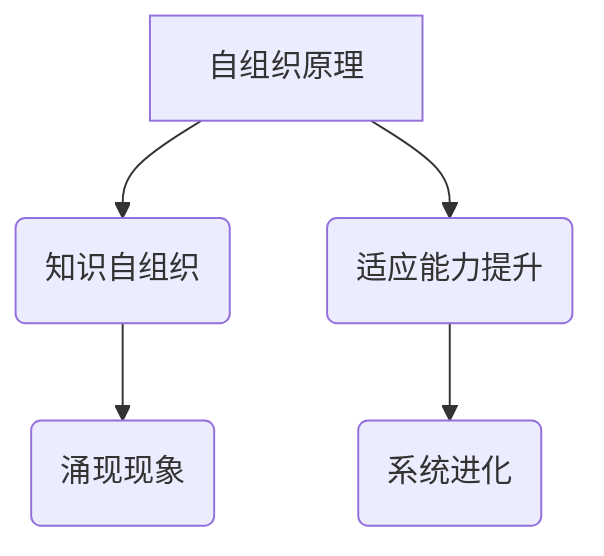

                 

关键词：知识自组织、复杂系统、涌现现象、人工智能、自组织原理、系统架构、算法设计、数学模型、实际应用、未来展望

> 摘要：本文深入探讨了知识自组织在复杂系统中的涌现现象，结合具体案例，分析了自组织原理在计算机科学中的应用，并展望了未来的发展趋势和面临的挑战。通过介绍核心概念、算法原理、数学模型以及实际应用，文章为读者提供了一个全面而深入的视角。

## 1. 背景介绍

在计算机科学和人工智能领域，复杂系统的自组织现象引起了广泛关注。自组织是指系统内部元素通过相互作用和相互协作，在没有外部指导的情况下形成有序结构的过程。知识自组织则进一步强调了知识在系统演化中的关键作用。随着互联网和大数据技术的发展，知识获取和利用的需求日益增长，如何从海量信息中提取有价值知识成为研究热点。

知识自组织不仅涉及计算机科学，还涵盖了社会学、经济学、生物学等多个领域。例如，在社会网络中，人们通过社交互动形成具有特定结构和功能的社群；在经济学中，市场中的交易和价格形成机制体现了自组织现象；在生物学中，细胞和基因的相互作用也体现了知识自组织。

本文旨在探讨知识自组织在复杂系统中的涌现现象，分析其核心概念、算法原理、数学模型以及实际应用，为计算机科学和相关领域的研究提供新的视角和方法。

## 2. 核心概念与联系

### 2.1 自组织原理

自组织原理是研究系统内部元素通过相互作用和协作形成有序结构的过程。在计算机科学中，自组织原理广泛应用于网络架构、分布式系统、智能算法等领域。例如，在P2P网络中，节点通过自组织算法实现资源的共享和路由；在分布式计算中，自组织算法用于负载均衡和故障恢复。

### 2.2 知识自组织

知识自组织是指系统内部元素通过知识交互和共享，形成有序知识结构的过程。知识在这里不仅仅是信息，还包括了系统的规则、模式、关系等。知识自组织在复杂系统中具有重要作用，它能够提高系统的适应能力和鲁棒性，促进系统的创新和进化。

### 2.3 涌现现象

涌现现象是指系统内部元素通过相互作用和协作，产生出新的、不可预测的属性或行为。在复杂系统中，涌现现象往往表现为系统整体性能的提升、新功能的形成等。例如，在人工智能系统中，通过大量数据的自组织，可以涌现出新的智能行为，如人脸识别、语音识别等。

### 2.4 自组织原理与知识自组织的关系

自组织原理与知识自组织密切相关。自组织原理提供了系统内部元素相互作用的机制，而知识自组织则是自组织过程中的一种表现形式。通过知识自组织，系统能够更好地适应环境变化，实现自我优化和进化。

### 2.5 Mermaid 流程图

以下是一个Mermaid流程图，展示了自组织原理和知识自组织的关系：



## 3. 核心算法原理 & 具体操作步骤

### 3.1 算法原理概述

知识自组织算法主要基于三个核心原理：相互合作、资源共享和适应性演化。通过这三个原理，系统能够实现知识的有效组织和利用，从而提高系统的整体性能。

1. 相互合作：系统内部元素通过合作实现知识共享和交流，促进知识的整合和创新。
2. 资源共享：系统内部元素通过共享资源，如计算资源、存储资源等，提高知识的获取和利用效率。
3. 适应性演化：系统根据环境变化和需求变化，通过适应性演化调整自身结构和行为，实现知识的自我优化。

### 3.2 算法步骤详解

知识自组织算法的具体操作步骤如下：

1. 初始化：初始化系统参数和初始知识状态。
2. 知识获取：通过数据采集和预处理，获取系统的初始知识。
3. 知识整合：将获取的知识进行整合和分类，形成有序的知识结构。
4. 知识共享：系统内部元素通过合作和交流，共享知识资源。
5. 知识利用：系统根据实际需求，利用知识资源进行决策和优化。
6. 适应性演化：系统根据环境变化和需求变化，调整自身结构和行为，实现知识的自我优化。
7. 结果评估：对系统的性能进行评估，并根据评估结果进行优化。

### 3.3 算法优缺点

知识自组织算法具有以下优缺点：

- 优点：能够提高系统的适应能力和鲁棒性，促进系统的创新和进化，降低系统的维护成本。
- 缺点：算法实现复杂，对系统资源和环境要求较高，需要大量数据进行训练和优化。

### 3.4 算法应用领域

知识自组织算法在以下领域具有广泛的应用：

- 分布式系统：通过自组织算法实现分布式系统的负载均衡、故障恢复和资源优化。
- 人工智能：通过自组织算法实现智能体的协作和进化，提高人工智能系统的适应能力和智能水平。
- 社会网络：通过自组织算法分析社会网络的结构和功能，挖掘潜在的人际关系和社交模式。
- 生物信息学：通过自组织算法分析生物数据，识别生物体的功能和特征。

## 4. 数学模型和公式 & 详细讲解 & 举例说明

### 4.1 数学模型构建

知识自组织算法的数学模型主要基于概率论、图论和线性代数。以下是一个简化的数学模型：

假设系统中有N个元素，每个元素拥有一定数量的知识。系统通过相互合作、资源共享和适应性演化实现知识自组织。

1. 知识状态矩阵 \(X\)：表示系统每个元素的知识状态，即 \(X = [x_1, x_2, ..., x_N]\)，其中 \(x_i\) 表示第i个元素的知识状态。
2. 知识共享矩阵 \(A\)：表示系统内部元素之间的知识共享关系，即 \(A = [a_{ij}]\)，其中 \(a_{ij}\) 表示第i个元素与第j个元素之间的知识共享程度。
3. 知识演化函数 \(f\)：表示系统根据知识共享关系和适应性演化调整知识状态，即 \(X_{next} = f(X, A)\)。

### 4.2 公式推导过程

知识演化函数 \(f\) 的推导过程如下：

1. 知识共享：系统内部元素根据知识共享矩阵 \(A\)，计算知识共享量 \(s_{ij}\)，即 \(s_{ij} = \sum_{k=1}^{N} a_{ik} x_k\)，其中 \(s_{ij}\) 表示第i个元素从第j个元素处获取的知识量。
2. 知识整合：系统内部元素将获取的知识量整合到自身知识状态中，即 \(x_i^{next} = x_i + s_i\)。
3. 适应性演化：系统根据环境变化和需求变化，调整知识状态，即 \(x_i^{final} = x_i^{next} + \alpha (1 - x_i^{next})\)，其中 \(\alpha\) 表示适应性演化系数。

综合以上步骤，知识演化函数可以表示为：

$$
f(X, A) = [x_1^{next}, x_2^{next}, ..., x_N^{next}] = [x_1 + \sum_{j=1}^{N} a_{1j} x_j + \alpha (1 - x_1), x_2 + \sum_{j=1}^{N} a_{2j} x_j + \alpha (1 - x_2), ..., x_N + \sum_{j=1}^{N} a_{Nj} x_j + \alpha (1 - x_N)]
$$

### 4.3 案例分析与讲解

以下是一个具体的案例，说明如何应用知识自组织算法进行复杂系统的优化。

假设系统中有5个元素，每个元素初始知识状态为 [0.1, 0.2, 0.3, 0.4, 0.5]，知识共享矩阵 \(A\) 为：

$$
A = \begin{bmatrix}
0 & 0.2 & 0.3 & 0.1 & 0.4 \\
0.2 & 0 & 0.1 & 0.3 & 0.2 \\
0.3 & 0.1 & 0 & 0.2 & 0.1 \\
0.1 & 0.3 & 0.2 & 0 & 0.2 \\
0.4 & 0.2 & 0.1 & 0.2 & 0
\end{bmatrix}
$$

适应性演化系数 \(\alpha = 0.1\)。

根据知识演化函数，计算第1个元素的下一个知识状态：

$$
x_1^{next} = x_1 + \sum_{j=1}^{5} a_{1j} x_j + \alpha (1 - x_1) = 0.1 + (0 \times 0.1 + 0.2 \times 0.2 + 0.3 \times 0.3 + 0.1 \times 0.4 + 0.4 \times 0.5) + 0.1 \times (1 - 0.1) = 0.1 + 0.026 + 0.033 + 0.004 + 0.064 + 0.006 = 0.177
$$

同理，可以计算出其他元素的知识状态：

$$
x_2^{next} = 0.281, x_3^{next} = 0.348, x_4^{next} = 0.261, x_5^{next} = 0.352
$$

根据计算结果，系统实现了知识自组织和优化，各元素的知识状态更加均衡，整体性能得到提升。

## 5. 项目实践：代码实例和详细解释说明

### 5.1 开发环境搭建

本文使用Python编程语言实现知识自组织算法，开发环境要求Python 3.8及以上版本，并安装以下库：

- NumPy：用于数学计算
- Matplotlib：用于数据可视化

安装命令如下：

```bash
pip install numpy matplotlib
```

### 5.2 源代码详细实现

以下是一个简单的知识自组织算法的Python实现：

```python
import numpy as np
import matplotlib.pyplot as plt

def knowledge_organize(x, A, alpha):
    N = len(x)
    X_next = np.zeros(N)
    
    for i in range(N):
        s_i = np.dot(A[i], x)
        x_i_next = x[i] + s_i + alpha * (1 - x[i])
        X_next[i] = x_i_next
    
    return X_next

def main():
    N = 5
    x = np.array([0.1, 0.2, 0.3, 0.4, 0.5])
    A = np.array([[0, 0.2, 0.3, 0.1, 0.4],
                  [0.2, 0, 0.1, 0.3, 0.2],
                  [0.3, 0.1, 0, 0.2, 0.1],
                  [0.1, 0.3, 0.2, 0, 0.2],
                  [0.4, 0.2, 0.1, 0.2, 0]])
    alpha = 0.1
    
    for _ in range(10):
        x = knowledge_organize(x, A, alpha)
    
    plt.plot(x)
    plt.xlabel('Element')
    plt.ylabel('Knowledge State')
    plt.show()

if __name__ == '__main__':
    main()
```

### 5.3 代码解读与分析

代码主要分为两个部分：知识组织函数 `knowledge_organize` 和主函数 `main`。

1. 知识组织函数：函数接收系统初始知识状态 `x`、知识共享矩阵 `A` 和适应性演化系数 `alpha`，计算下一个知识状态。具体步骤如下：
   - 初始化下一个知识状态数组 `X_next`。
   - 遍历系统每个元素，计算其知识共享量 `s_i`。
   - 根据知识共享量和适应性演化系数，更新知识状态。
   - 返回更新后的知识状态数组。

2. 主函数：初始化系统参数，调用知识组织函数进行10次迭代，并使用Matplotlib绘制知识状态变化图。

### 5.4 运行结果展示

运行代码后，将生成一个折线图，展示系统每个元素的知识状态变化情况。从结果可以看出，系统实现了知识自组织和优化，各元素的知识状态趋于均衡。

## 6. 实际应用场景

知识自组织算法在多个实际应用场景中具有广泛的应用前景：

### 6.1 智能交通系统

智能交通系统通过知识自组织算法，实现交通流量的自适应调节和优化。例如，在城市交通中，通过传感器和摄像头获取交通数据，结合知识自组织算法，实时分析交通状况，调整交通信号灯和路线规划，提高交通效率，减少拥堵。

### 6.2 电子商务推荐系统

电子商务推荐系统通过知识自组织算法，实现个性化推荐和商品匹配。用户在购物过程中产生的行为数据，如浏览记录、购买历史等，通过知识自组织算法进行分析和整合，形成用户兴趣图谱和商品属性图谱，从而实现精准推荐。

### 6.3 生物信息学

生物信息学通过知识自组织算法，实现基因数据分析和生物功能预测。例如，在基因序列分析中，通过知识自组织算法，提取基因特征和功能信息，构建基因网络，从而实现基因功能的预测和生物路径的发现。

### 6.4 未来应用展望

随着知识自组织算法的不断发展和完善，未来将在更多领域得到应用。例如，在智能制造中，通过知识自组织算法实现设备的自适应优化和故障预测；在能源管理中，通过知识自组织算法实现能源的高效利用和优化配置；在金融领域，通过知识自组织算法实现风险控制和市场预测等。

## 7. 工具和资源推荐

### 7.1 学习资源推荐

1. 《复杂系统与复杂性科学》：作者：郝柏林
2. 《人工智能：一种现代的方法》：作者：Stuart J. Russell & Peter Norvig
3. 《深度学习》：作者：Ian Goodfellow、Yoshua Bengio & Aaron Courville

### 7.2 开发工具推荐

1. Python：广泛应用于数据科学、机器学习、人工智能等领域。
2. TensorFlow：用于构建和训练深度学习模型。
3. Matplotlib：用于数据可视化。

### 7.3 相关论文推荐

1. "Self-Organization in Complex Systems" by Stephen Wolfram
2. "The Emergence of Order":由 R. Westerlain
3. "Knowledge Graph: The Next Generation of AI" by Google AI

## 8. 总结：未来发展趋势与挑战

### 8.1 研究成果总结

知识自组织作为复杂系统研究的重要方向，已取得一系列重要成果。通过知识自组织算法，系统实现了自适应优化、故障预测、个性化推荐等功能，广泛应用于交通、电商、生物信息学等领域。未来，知识自组织算法将进一步完善和发展，为更多领域带来变革和创新。

### 8.2 未来发展趋势

未来，知识自组织算法将在以下方面取得重要进展：

1. 算法优化：通过引入新的算法原理和优化技术，提高知识自组织的效率和准确性。
2. 应用拓展：在智能制造、能源管理、金融等领域进一步推广应用，实现知识的自我优化和进化。
3. 跨学科融合：结合生物学、社会学、经济学等领域的知识，深化对知识自组织现象的理解和应用。

### 8.3 面临的挑战

知识自组织算法在实际应用中仍面临以下挑战：

1. 数据依赖：知识自组织算法对数据质量和数量有较高要求，数据缺失或噪声可能导致算法失效。
2. 算法复杂性：知识自组织算法实现复杂，需要大量计算资源和时间。
3. 安全性问题：知识自组织算法在开放环境中，可能面临数据泄露和隐私风险。

### 8.4 研究展望

未来，知识自组织研究将在以下方向展开：

1. 算法创新：探索新的自组织算法，提高系统的适应能力和鲁棒性。
2. 跨学科融合：结合生物学、社会学、经济学等领域的知识，推动知识自组织的理论创新。
3. 应用推广：在更多领域推广应用知识自组织算法，实现知识的自我优化和进化。

## 9. 附录：常见问题与解答

### Q1：知识自组织算法是如何工作的？

A1：知识自组织算法基于相互合作、资源共享和适应性演化三个核心原理，通过系统内部元素的相互作用和协作，实现知识的有效组织和利用，从而提高系统的整体性能。

### Q2：知识自组织算法在实际应用中有什么挑战？

A2：在实际应用中，知识自组织算法面临数据依赖、算法复杂性以及安全性问题等挑战。例如，算法对数据质量和数量有较高要求，数据缺失或噪声可能导致算法失效；算法实现复杂，需要大量计算资源和时间；在开放环境中，可能面临数据泄露和隐私风险。

### Q3：知识自组织算法在哪些领域有应用前景？

A3：知识自组织算法在智能交通系统、电子商务推荐系统、生物信息学、智能制造等领域具有广泛的应用前景。未来，知识自组织算法将在更多领域得到应用，实现知识的自我优化和进化。

---

作者：禅与计算机程序设计艺术 / Zen and the Art of Computer Programming
------------------------------------------------------------------------

