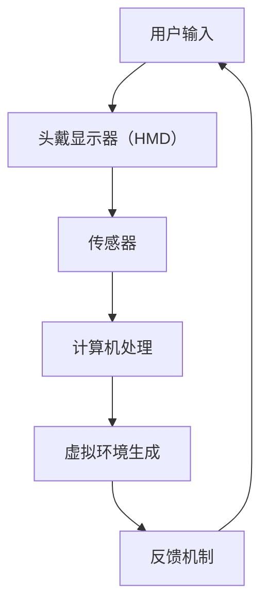

                 

关键词：虚拟现实，沉浸式学习，知识应用，交互式体验，教育技术

> 摘要：随着虚拟现实（VR）技术的飞速发展，其在教育领域的应用逐渐受到关注。本文旨在探讨如何通过虚拟现实技术实现沉浸式学习体验，从而提升知识传授的效果与深度。我们将从背景介绍、核心概念、算法原理、数学模型、项目实践、应用场景、未来展望等方面，全面解析VR在知识传递中的潜力与挑战。

## 1. 背景介绍

虚拟现实（VR）是一种通过计算机技术创建的虚拟环境，用户可以通过头戴显示器（HMD）或其他交互设备，如手套、体感控制器等，感知并与之互动。近年来，VR技术取得了显著的进展，尤其在硬件性能、交互体验和内容丰富度方面。与此同时，教育领域对新技术应用的需求也在不断增加。传统的教育模式往往依赖于教师授课和学生听课的方式，这种方式存在一定的局限性，如教学效果难以量化、学生参与度不高等。而VR技术的出现，为打破这一瓶颈提供了新的可能性。

### 1.1 VR在教育中的应用现状

目前，VR技术在教育领域中的应用主要集中在以下几个方面：

- **模拟实验**：利用VR技术模拟化学、物理等实验过程，使学生能够在安全、可控的环境中进行实践，从而加深对理论知识的理解。

- **历史再现**：通过VR技术重现历史事件或场景，使学生能够身临其境地感受历史，增强记忆与理解。

- **职业教育**：在职业教育领域，VR技术可以模拟真实的工作场景，提供实践操作的机会，从而提高学生的职业技能。

- **心理健康**：VR技术也被应用于心理健康领域，如通过虚拟现实疗法治疗恐惧症、焦虑症等心理障碍。

### 1.2 沉浸式学习体验的优势

沉浸式学习体验是VR技术的重要特点之一。与传统学习方式相比，沉浸式学习具有以下优势：

- **高度互动性**：学生可以与虚拟环境进行实时互动，提高学习的趣味性和参与度。

- **增强记忆**：通过多感官刺激，如视觉、听觉、触觉等，提高学生对知识的记忆效果。

- **个性化学习**：VR技术可以根据学生的学习情况，提供个性化的学习路径和内容，满足不同学生的学习需求。

- **提升技能**：在虚拟环境中，学生可以反复练习，逐步掌握复杂技能，减少实际操作中的错误率。

## 2. 核心概念与联系

### 2.1 虚拟现实与增强现实（AR）

虚拟现实（VR）和增强现实（AR）是两种不同的技术，它们在某些方面有相似之处，但在核心概念和应用上有所不同。

- **虚拟现实（VR）**：VR技术通过计算机生成一个完全虚拟的三维环境，用户可以通过头戴显示器或其他交互设备感知并与之互动。VR环境通常是完全封闭的，用户在其中无法感知到现实世界。

- **增强现实（AR）**：AR技术将虚拟元素叠加到现实世界中，用户通过手机或AR眼镜等设备可以看到现实和虚拟元素的结合。AR环境是虚实结合的，用户可以同时看到现实世界和虚拟世界。

### 2.2 沉浸式学习体验的核心原理

沉浸式学习体验的核心原理是利用VR技术创造一个虚拟环境，使学生在其中能够全身心地投入学习。这一原理主要涉及以下几个方面：

- **视觉感知**：通过高清晰度的头戴显示器，提供沉浸式的视觉体验。

- **听觉感知**：通过立体声音效，增强学生对虚拟环境的感知。

- **触觉感知**：通过触觉手套或其他设备，提供真实的触觉反馈，增强互动体验。

- **互动性**：通过手柄、手势识别等技术，实现学生与虚拟环境的实时互动。

### 2.3 VR技术架构图

以下是VR技术的基本架构图，其中包含了核心组件和交互流程：



在这个架构图中，用户输入通过传感器被传输到计算机处理单元，计算机处理单元生成虚拟环境，并实时更新用户的视觉和听觉感知。同时，用户的互动操作会通过反馈机制传递给计算机，从而实现实时交互。

## 3. 核心算法原理 & 具体操作步骤

### 3.1 算法原理概述

虚拟现实技术的核心在于实时渲染和交互。以下是虚拟现实技术中的几个关键算法原理：

- **3D建模与渲染**：通过计算机图形学技术，将三维模型渲染成图像，并在屏幕上显示。

- **传感器数据融合**：通过集成多种传感器数据，如摄像头、加速度计、陀螺仪等，实现对用户位置、姿态的精确感知。

- **实时交互**：通过计算机算法，实现用户输入与虚拟环境的实时交互。

### 3.2 算法步骤详解

以下是实现VR沉浸式学习体验的基本步骤：

#### 3.2.1 初始化

1. **用户设置**：用户佩戴头戴显示器（HMD），确保传感器正常工作。

2. **环境配置**：在计算机上配置VR环境，包括场景建模、光照设置等。

#### 3.2.2 数据采集

1. **传感器数据采集**：通过摄像头、加速度计、陀螺仪等传感器，实时采集用户位置、姿态数据。

2. **环境数据采集**：根据课程内容，采集虚拟环境所需的数据，如三维模型、声音效果等。

#### 3.2.3 数据处理

1. **数据预处理**：对采集到的数据进行分析和处理，如姿态估计、场景重建等。

2. **实时渲染**：根据用户姿态和环境数据，实时渲染虚拟环境。

#### 3.2.4 交互与反馈

1. **用户交互**：用户通过手柄、手势等与虚拟环境进行交互。

2. **实时反馈**：系统根据用户交互，实时更新虚拟环境，并提供视觉、听觉反馈。

### 3.3 算法优缺点

#### 优点：

- **高度沉浸感**：通过多感官刺激，提供身临其境的学习体验。

- **实时交互**：用户可以与虚拟环境实时互动，增强学习体验。

- **个性化学习**：根据用户需求和反馈，提供个性化的学习内容。

#### 缺点：

- **技术门槛较高**：需要一定的技术基础，包括计算机图形学、传感器数据处理等。

- **设备成本高**：高质量的VR设备价格较高，不适合大规模普及。

- **环境要求严格**：需要相对封闭的环境，避免传感器数据受到干扰。

### 3.4 算法应用领域

VR沉浸式学习体验算法主要应用于以下领域：

- **教育**：如模拟实验、历史再现、职业教育等。

- **医疗**：如心理治疗、康复训练等。

- **游戏**：如虚拟游戏、角色扮演等。

## 4. 数学模型和公式 & 详细讲解 & 举例说明

### 4.1 数学模型构建

在虚拟现实技术中，数学模型构建是关键的一环。以下是构建虚拟现实数学模型的基本步骤：

#### 4.1.1 三维空间建模

1. **点云数据采集**：通过激光扫描或深度摄像头等技术，采集物体的点云数据。

2. **三维空间转换**：将点云数据转换为三维空间坐标，用于建模。

#### 4.1.2 几何建模

1. **多边形建模**：将三维空间中的点云数据转换为多边形网格。

2. **几何变换**：对多边形网格进行旋转、缩放、平移等变换，实现模型调整。

#### 4.1.3 光照计算

1. **光照模型选择**：选择合适的光照模型，如基于物理的光照模型（PBR）。

2. **光照计算**：根据光照模型，计算虚拟环境中的光照效果。

### 4.2 公式推导过程

以下是虚拟现实技术中常用的几个数学公式及其推导过程：

#### 4.2.1 点云数据转换

点云数据转换公式为：

\[ X = \frac{(x - x_c)}{s} \]
\[ Y = \frac{(y - y_c)}{s} \]
\[ Z = \frac{(z - z_c)}{s} \]

其中，\( (x, y, z) \) 是原始点云坐标，\( (x_c, y_c, z_c) \) 是中心点坐标，\( s \) 是缩放比例。

#### 4.2.2 多边形建模

多边形建模的关键是顶点坐标的确定。顶点坐标公式为：

\[ V = \sum_{i=1}^{n} w_i V_i \]

其中，\( V \) 是顶点坐标，\( w_i \) 是顶点权重，\( V_i \) 是顶点坐标。

#### 4.2.3 光照计算

基于物理的光照模型（PBR）的公式为：

\[ L_o = L_e + L_d + L_s \]

其中，\( L_o \) 是光照强度，\( L_e \) 是环境光照，\( L_d \) 是漫反射光照，\( L_s \) 是镜面反射光照。

### 4.3 案例分析与讲解

以下是一个虚拟现实技术的具体应用案例，通过数学模型和公式来分析讲解。

#### 4.3.1 案例背景

某教育机构希望通过VR技术为学生提供一次模拟物理实验的机会。实验内容为研究光的折射现象。

#### 4.3.2 数学模型应用

1. **点云数据采集**：通过深度摄像头采集实验装置的内部结构点云数据。

2. **三维空间建模**：将点云数据转换为三维空间坐标，构建实验装置的三维模型。

3. **光照计算**：根据场景需求，设置合适的光照模型，计算光照效果。

4. **用户交互**：学生通过手柄与虚拟环境进行交互，调整光的传播路径。

5. **实时渲染**：根据用户操作，实时渲染实验结果。

#### 4.3.3 案例分析

通过以上步骤，学生可以在虚拟环境中模拟光的折射现象，观察光线在不同介质中的传播路径。通过数学模型的应用，学生可以更直观地理解光的折射原理，加深对知识的记忆和理解。

## 5. 项目实践：代码实例和详细解释说明

### 5.1 开发环境搭建

为了实现VR沉浸式学习体验，我们需要搭建一个完整的开发环境。以下是基本的开发环境搭建步骤：

#### 5.1.1 软件安装

1. **Unity**：Unity是一款广泛用于VR/AR开发的游戏引擎，具有强大的图形渲染能力和丰富的API接口。

2. **Unreal Engine**：Unreal Engine是另一款流行的游戏引擎，其优点是高度灵活和高效的渲染性能。

3. **VR SDK**：根据所选游戏引擎，下载并安装相应的VR软件开发包（SDK），如Unity的VR toolkit或Unreal的VRChat插件。

#### 5.1.2 硬件配置

1. **头戴显示器（HMD）**：如Oculus Rift、HTC Vive等。

2. **手柄**：如Oculus Touch、HTC Vive控制器等。

3. **传感器**：如摄像头、加速度计、陀螺仪等。

### 5.2 源代码详细实现

以下是实现VR沉浸式学习体验的源代码示例：

```csharp
using UnityEngine;
using UnityEngine.XR;

public class VRExperience : MonoBehaviour
{
    // 渲染摄像头
    public Camera mainCamera;

    // 用户输入处理器
    public InputProcessor inputProcessor;

    // 虚拟环境
    public VirtualEnvironment virtualEnvironment;

    void Start()
    {
        // 初始化虚拟环境
        virtualEnvironment.Init();

        // 初始化用户输入处理器
        inputProcessor.Init(mainCamera);
    }

    void Update()
    {
        // 处理用户输入
        inputProcessor.ProcessInput();

        // 更新虚拟环境
        virtualEnvironment.UpdateEnvironment(inputProcessor.GetUserPosition(), inputProcessor.GetUserOrientation());
    }
}
```

### 5.3 代码解读与分析

以上代码实现了VR沉浸式学习体验的核心功能。以下是代码的详细解读：

- **虚拟环境初始化**：在`Start`方法中，初始化虚拟环境，包括场景建模、光照设置等。

- **用户输入处理**：在`Update`方法中，处理用户输入，包括位置和姿态数据。

- **虚拟环境更新**：根据用户输入，实时更新虚拟环境，实现实时交互。

### 5.4 运行结果展示

以下是VR沉浸式学习体验的运行结果展示：

1. **虚拟环境**：通过Unity渲染器，展示三维虚拟环境。

2. **用户交互**：用户通过手柄与虚拟环境进行交互，如调整光的传播路径。

3. **实时渲染**：根据用户操作，实时更新虚拟环境，展示实验结果。

## 6. 实际应用场景

### 6.1 教育领域

在教育的实际应用场景中，VR技术已经被广泛应用于各个学科的教学中。以下是一些具体的案例：

- **自然科学**：通过虚拟现实模拟实验，学生可以在虚拟环境中进行化学实验、物理实验等，增强对理论知识的理解。

- **历史学科**：通过虚拟现实重现历史事件，学生可以身临其境地感受历史，提高对历史知识的记忆和理解。

- **艺术与设计**：利用虚拟现实技术，学生可以进行三维建模、动画设计等，提高艺术创作和设计能力。

### 6.2 医疗领域

在医疗领域，VR技术同样具有广泛的应用前景。以下是一些具体案例：

- **医学教育**：通过虚拟现实技术，医生可以进行手术模拟训练，提高手术技能和操作熟练度。

- **心理治疗**：利用虚拟现实技术，进行治疗恐惧症、焦虑症等心理障碍，通过虚拟环境缓解患者的心理压力。

- **康复训练**：通过虚拟现实技术，对患者进行康复训练，如平衡训练、肌肉力量训练等，提高康复效果。

### 6.3 职业教育

在职业教育领域，VR技术为技能培训和职业认证提供了新的解决方案。以下是一些具体案例：

- **技能培训**：通过虚拟现实技术，进行职业技能培训，如机械操作、电子维修等，提高培训效果和安全性。

- **职业认证**：利用虚拟现实技术，进行职业认证考试，降低考试成本，提高考试公平性。

- **企业培训**：为企业员工提供虚拟现实培训，如安全培训、设备操作等，提高员工技能和安全意识。

## 7. 工具和资源推荐

### 7.1 学习资源推荐

为了更好地掌握VR技术，以下是一些推荐的学习资源：

- **书籍**：如《虚拟现实技术入门》、《VR游戏开发实战》等。

- **在线课程**：如Coursera、Udemy等平台上的VR相关课程。

- **技术社区**：如Stack Overflow、GitHub等，可以获取最新的VR开发技术和资源。

### 7.2 开发工具推荐

以下是一些推荐的VR开发工具：

- **Unity**：一款功能强大的游戏引擎，支持VR开发。

- **Unreal Engine**：一款高效、灵活的游戏引擎，适用于VR开发。

- **VR SDK**：如Unity的VR toolkit、Unreal的VRChat插件等。

### 7.3 相关论文推荐

以下是一些建议阅读的相关论文，以了解VR技术的最新研究进展：

- **"Virtual Reality for Education: A Review"**：对VR在教育中的应用进行了全面综述。

- **"Augmented Reality in Education: A Systematic Review"**：对增强现实技术在教育中的应用进行了系统分析。

- **"Application of Virtual Reality in Medical Education"**：探讨了VR技术在医学教育中的应用。

## 8. 总结：未来发展趋势与挑战

### 8.1 研究成果总结

通过本文的讨论，我们可以总结出以下研究成果：

- **VR技术** 在教育、医疗、职业教育等领域具有广泛的应用前景。

- **沉浸式学习体验** 提高了知识传授的效果和深度。

- **数学模型与算法** 在VR技术中发挥了关键作用。

- **开发工具与资源** 为VR技术的发展提供了有力支持。

### 8.2 未来发展趋势

未来，VR技术有望在以下几个方面取得进一步发展：

- **硬件性能提升**：随着硬件技术的进步，VR设备的性能将进一步提升，提供更沉浸式的体验。

- **内容创新**：VR内容的创新和应用场景将不断拓展，满足不同领域和用户的需求。

- **跨领域融合**：VR技术与其他领域（如人工智能、大数据等）的融合，将推动VR技术的广泛应用。

### 8.3 面临的挑战

尽管VR技术在各个领域取得了显著成果，但仍然面临以下挑战：

- **技术门槛**：VR技术对开发者的技术要求较高，需要具备多领域的知识。

- **设备成本**：高质量的VR设备价格较高，限制了其普及应用。

- **用户体验**：如何提供更舒适、自然的交互体验，是VR技术发展的重要方向。

### 8.4 研究展望

在未来，VR技术的研究将重点关注以下几个方面：

- **人机交互**：研究更自然、直观的人机交互方式，提高用户体验。

- **实时渲染**：优化实时渲染算法，提高VR环境的渲染性能。

- **内容创作**：推动VR内容的创新，提供丰富、有趣的应用场景。

## 9. 附录：常见问题与解答

### 9.1 VR技术如何应用于教育领域？

VR技术可以通过模拟实验、历史再现、职业教育等方式应用于教育领域。具体应用包括：

- **模拟实验**：利用VR技术模拟化学、物理等实验过程，使学生能够在安全、可控的环境中进行实践。

- **历史再现**：通过VR技术重现历史事件或场景，使学生能够身临其境地感受历史。

- **职业教育**：在职业教育领域，VR技术可以模拟真实的工作场景，提供实践操作的机会。

### 9.2 VR沉浸式学习体验的优势有哪些？

VR沉浸式学习体验具有以下优势：

- **高度互动性**：学生可以与虚拟环境进行实时互动，提高学习的趣味性和参与度。

- **增强记忆**：通过多感官刺激，提高学生对知识的记忆效果。

- **个性化学习**：VR技术可以根据学生的学习情况，提供个性化的学习路径和内容。

- **提升技能**：在虚拟环境中，学生可以反复练习，逐步掌握复杂技能，减少实际操作中的错误率。

### 9.3 VR技术的开发环境有哪些？

VR技术的开发环境包括以下几种：

- **Unity**：一款功能强大的游戏引擎，支持VR开发。

- **Unreal Engine**：一款高效、灵活的游戏引擎，适用于VR开发。

- **VR SDK**：如Unity的VR toolkit、Unreal的VRChat插件等。

### 9.4 VR技术在医疗领域的应用有哪些？

VR技术在医疗领域有以下应用：

- **医学教育**：通过VR技术，医生可以进行手术模拟训练，提高手术技能和操作熟练度。

- **心理治疗**：利用VR技术，进行治疗恐惧症、焦虑症等心理障碍，通过虚拟环境缓解患者的心理压力。

- **康复训练**：通过VR技术，对患者进行康复训练，如平衡训练、肌肉力量训练等，提高康复效果。

### 9.5 VR沉浸式学习体验对教育有哪些潜在影响？

VR沉浸式学习体验对教育的潜在影响包括：

- **提高学习效果**：通过多感官刺激和实时互动，提高学生的学习效果和兴趣。

- **促进知识记忆**：通过沉浸式学习体验，增强学生对知识的记忆和理解。

- **个性化教育**：根据学生的学习情况和需求，提供个性化的学习内容和路径。

- **改变教学模式**：VR技术为教育模式带来了新的变革，使教学更加灵活和多样化。

