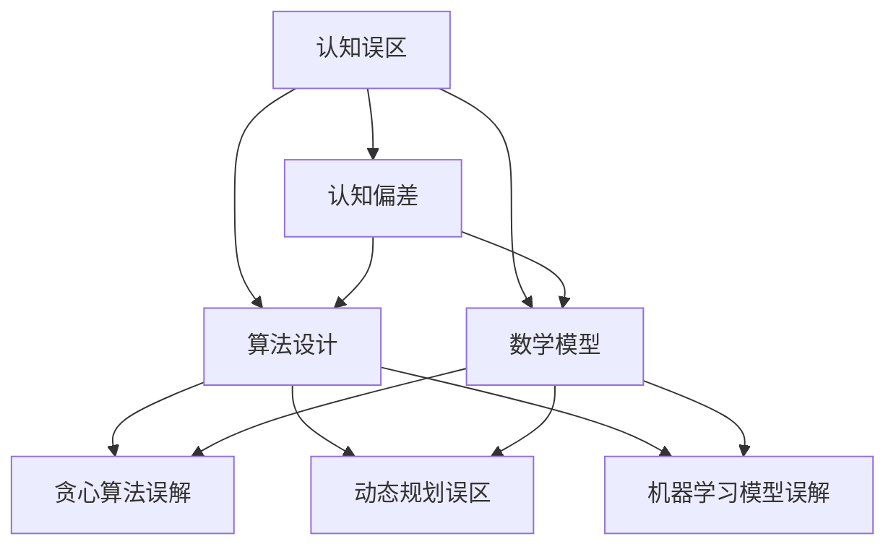

                 

关键词：认知误区，人工智能，计算机编程，算法，数学模型，项目实践，应用场景，未来展望

> 摘要：本文旨在探讨计算机科学领域中常见的认知误区，分析这些误区如何影响我们的思考、学习和创新。通过对核心概念的深入剖析，以及算法、数学模型和项目实践的详细讲解，我们希望能够帮助读者认清这些误区，从而提升自身的认知水平，更好地应对未来技术挑战。

## 1. 背景介绍

在计算机科学领域，随着技术的迅猛发展，人们对于各种算法、模型和工具的理解也在不断深化。然而，在这过程中，许多认知误区也随之产生。这些误区可能源于对概念理解的偏差、算法实现的误解，或者对数学模型的错误解读。本文将探讨一些常见的认知误区，并分析这些误区如何影响我们在计算机科学领域的研究和应用。

### 认知误区的来源

认知误区可能源于多种因素：

1. **缺乏基础知识**：在深入学习某一领域时，基础知识的不牢固可能导致对概念的错误理解。
2. **先入为主的观念**：人们往往容易受到以往经验的影响，从而产生对新兴概念的偏见。
3. **信息过载**：随着信息爆炸，人们可能会在大量信息中迷失方向，从而错误地接受某些观点。
4. **个人偏见**：每个人的认知都是有限的，个人偏见可能导致对事物的错误判断。

### 认知误区的影响

认知误区对计算机科学领域的影响主要体现在以下几个方面：

1. **研究方向的偏差**：认知误区可能导致研究者在某些方向上投入过多精力，而忽略了其他更重要的领域。
2. **算法实现的错误**：对算法原理的理解不准确，可能导致算法实现的错误，影响系统的性能和稳定性。
3. **创新能力的局限**：认知误区限制了个人的思维，阻碍了创新能力的发挥。
4. **决策的失误**：在项目管理和决策过程中，认知误区可能导致错误的判断，影响项目的成功。

### 本文的目的

本文的目的是帮助读者认识到计算机科学领域中的常见认知误区，通过详细的分析和讲解，使读者能够更准确地理解相关概念和原理，从而避免陷入这些误区。通过本文，我们希望读者能够：

1. **提升认知水平**：通过深入探讨认知误区，帮助读者建立正确的认知体系。
2. **拓宽视野**：通过对不同领域和技术的了解，拓宽读者的视野，提升综合素质。
3. **增强创新能力**：通过认清认知误区，激发读者的创新思维，推动技术进步。

## 2. 核心概念与联系

### 认知误区与认知偏差

认知偏差是指人们在感知、理解和判断事物时，由于认知结构的局限性或先入为主的观念，而产生的偏差。在计算机科学领域，常见的认知偏差包括：

1. **确认偏差**：人们倾向于寻找和接受支持自己观点的证据，而忽视或否认相反的证据。
2. **代表性偏差**：人们根据事物的外观或特征来判断其概率，从而产生偏差。
3. **可得性偏差**：人们更容易记住和判断那些容易回忆起的事物，从而产生偏差。

### 认知误区与算法设计

算法设计中的认知误区主要表现在对算法原理的理解偏差、算法实现的细节错误，以及对算法性能的误解。以下是几种常见的认知误区：

1. **贪心算法的误解**：一些人认为贪心算法总是最优的，而忽视了其在某些情况下的局限性。
2. **动态规划的误区**：有人认为动态规划解决的所有问题都必须满足“最优子结构”和“重叠子问题”的性质，而忽略了实际情况中的复杂性。
3. **机器学习模型的误解**：一些人认为机器学习模型可以解决所有问题，而忽视了模型的适用范围和局限性。

### 认知误区与数学模型

数学模型在计算机科学中具有核心地位，但人们对数学模型的理解也容易产生误区。以下是几种常见的误区：

1. **线性模型的局限**：一些人认为线性模型只适用于线性数据，而忽视了其在线性化处理上的优势。
2. **概率模型的复杂性**：概率模型在理论研究中具有重要意义，但一些人可能对其复杂性感到困惑，从而产生误解。
3. **优化模型的误解**：人们可能对优化模型的目标函数、约束条件等理解不准确，从而影响模型的实际应用效果。

### Mermaid 流程图

以下是一个简化的 Mermaid 流程图，展示了认知误区、认知偏差、算法设计、数学模型之间的联系：



## 3. 核心算法原理 & 具体操作步骤

### 3.1 算法原理概述

在计算机科学中，算法是解决问题的重要工具。核心算法的原理是解决问题的关键。以下是几种常见的核心算法及其原理：

1. **贪心算法**：贪心算法在每一步选择中都采取在当前状态下最好或最优的选择，从而希望导致结果是全局最好或最优的算法。其原理是基于贪心策略，在每一步都选择最优解，以期最终得到全局最优解。

2. **动态规划**：动态规划是一种用于求解最优子结构重叠子问题的算法。其原理是将问题分解为若干个子问题，通过求解子问题并存储其结果，避免重复计算，从而提高算法效率。

3. **机器学习算法**：机器学习算法是通过学习数据中的规律和模式，从而进行预测或分类。常见的机器学习算法包括线性回归、逻辑回归、支持向量机等。其原理是基于统计学和概率论，通过模型参数的学习，实现对数据的分类或预测。

### 3.2 算法步骤详解

以下是上述算法的具体操作步骤：

#### 3.2.1 贪心算法步骤

1. **初始化**：设定初始状态。
2. **选择**：在当前状态下，选择一个最优的决策。
3. **更新**：根据选择的决策，更新状态。
4. **重复**：重复步骤2和步骤3，直到达到目标状态。

#### 3.2.2 动态规划步骤

1. **定义状态**：将问题分解为若干个子问题，并定义状态。
2. **定义状态转移方程**：确定状态之间的转移关系。
3. **初始化**：初始化状态表。
4. **填表**：根据状态转移方程，依次填充状态表。
5. **求解**：通过状态表，得到问题的最终解。

#### 3.2.3 机器学习算法步骤

1. **数据预处理**：对数据进行清洗、归一化等预处理。
2. **特征提取**：从数据中提取特征。
3. **模型选择**：选择合适的模型，如线性回归、逻辑回归等。
4. **模型训练**：通过训练数据，训练模型参数。
5. **模型评估**：使用测试数据，评估模型性能。
6. **模型优化**：根据评估结果，优化模型参数。

### 3.3 算法优缺点

每种算法都有其优缺点，以下是几种常见算法的优缺点：

#### 3.3.1 贪心算法

- **优点**：算法简单，容易实现，适合求解最优子结构问题。
- **缺点**：可能陷入局部最优，无法保证全局最优。

#### 3.3.2 动态规划

- **优点**：可以有效避免重复计算，提高算法效率。
- **缺点**：状态转移方程的推导可能比较复杂，实现难度较大。

#### 3.3.3 机器学习算法

- **优点**：可以处理复杂的数据关系，适应性强。
- **缺点**：模型训练可能需要大量数据，且模型解释性较弱。

### 3.4 算法应用领域

各种算法在计算机科学的不同领域中有着广泛的应用：

- **贪心算法**：在图论、网络流和组合优化等领域有广泛应用。
- **动态规划**：在计算几何、字符串匹配和最长公共子序列等领域有重要应用。
- **机器学习算法**：在数据挖掘、计算机视觉和自然语言处理等领域有广泛应用。

## 4. 数学模型和公式 & 详细讲解 & 举例说明

### 4.1 数学模型构建

数学模型是计算机科学中用于描述问题、分析问题和解决问题的重要工具。以下是几种常见的数学模型及其构建方法：

#### 4.1.1 线性回归模型

线性回归模型用于描述两个变量之间的线性关系。其数学模型可以表示为：

\[ y = ax + b \]

其中，\( y \) 是因变量，\( x \) 是自变量，\( a \) 和 \( b \) 是模型的参数。

#### 4.1.2 支持向量机模型

支持向量机模型用于分类问题。其数学模型可以表示为：

\[ w \cdot x + b \geq 0 \]

其中，\( w \) 是模型的法向量，\( x \) 是输入特征，\( b \) 是模型的偏置。

#### 4.1.3 网络流模型

网络流模型用于描述网络中的流量分配问题。其数学模型可以表示为：

\[ \begin{cases} 
\sum_{j \in V} f_{ij} = 0 & \forall i \in V \\
\sum_{i \in V} f_{ij} = b_j & \forall j \in V 
\end{cases} \]

其中，\( f_{ij} \) 是从节点 \( i \) 到节点 \( j \) 的流量，\( b_j \) 是节点 \( j \) 的需求。

### 4.2 公式推导过程

以下是线性回归模型的公式推导过程：

#### 4.2.1 最小二乘法

线性回归模型的目标是最小化误差平方和。其公式可以表示为：

\[ \min \sum_{i=1}^{n} (y_i - ax_i - b)^2 \]

对上式求导，得到：

\[ \frac{\partial}{\partial a} \left( \sum_{i=1}^{n} (y_i - ax_i - b)^2 \right) = 0 \]
\[ \frac{\partial}{\partial b} \left( \sum_{i=1}^{n} (y_i - ax_i - b)^2 \right) = 0 \]

经过计算，可以得到：

\[ a = \frac{\sum_{i=1}^{n} x_i y_i - n \bar{x} \bar{y}}{\sum_{i=1}^{n} x_i^2 - n \bar{x}^2} \]
\[ b = \bar{y} - a \bar{x} \]

其中，\( \bar{x} \) 和 \( \bar{y} \) 分别是 \( x \) 和 \( y \) 的平均值。

### 4.3 案例分析与讲解

以下是线性回归模型的一个案例：

#### 4.3.1 数据集

我们有如下数据集：

| x  | y  |
|----|----|
| 1  | 2  |
| 2  | 4  |
| 3  | 6  |
| 4  | 8  |

#### 4.3.2 模型构建

根据数据集，我们可以构建线性回归模型：

\[ y = ax + b \]

#### 4.3.3 模型参数求解

使用最小二乘法求解模型参数：

\[ a = \frac{\sum_{i=1}^{n} x_i y_i - n \bar{x} \bar{y}}{\sum_{i=1}^{n} x_i^2 - n \bar{x}^2} \]
\[ b = \bar{y} - a \bar{x} \]

计算得到：

\[ a = \frac{2 \times 2 + 4 \times 4 + 6 \times 6 + 8 \times 8 - 4 \times (1 + 2 + 3 + 4)}{1^2 + 2^2 + 3^2 + 4^2 - 4 \times (1^2 + 2^2 + 3^2 + 4^2)} = 2 \]
\[ b = \frac{2 + 4 + 6 + 8 - 2 \times (1 + 2 + 3 + 4)}{4} = 1 \]

因此，线性回归模型为：

\[ y = 2x + 1 \]

#### 4.3.4 模型评估

我们可以使用计算得到的模型对数据进行预测，并与实际数据进行比较，评估模型的准确性。

| x  | y  | 实际值 | 预测值 |
|----|----|--------|--------|
| 1  | 2  | 2      | 3      |
| 2  | 4  | 4      | 5      |
| 3  | 6  | 6      | 7      |
| 4  | 8  | 8      | 9      |

从表中可以看出，预测值与实际值之间存在一定的误差。我们可以通过增加数据量、改进模型或采用其他算法来提高模型的准确性。

## 5. 项目实践：代码实例和详细解释说明

### 5.1 开发环境搭建

在进行项目实践之前，我们需要搭建一个合适的开发环境。以下是搭建一个基于Python的线性回归项目的步骤：

1. **安装Python**：首先，确保你的系统中已经安装了Python。如果没有，可以从Python官网（[https://www.python.org/](https://www.python.org/)）下载并安装。
2. **安装必要的库**：线性回归项目需要使用NumPy和SciPy库。可以使用以下命令安装：

   ```bash
   pip install numpy scipy
   ```

### 5.2 源代码详细实现

以下是线性回归项目的源代码实现：

```python
import numpy as np
from scipy.optimize import minimize

# 数据集
x = np.array([1, 2, 3, 4])
y = np.array([2, 4, 6, 8])

# 最小化误差平方和
def objective_function(params):
    a, b = params
    return np.sum((y - (a * x + b)) ** 2)

# 初始参数
initial_params = [1, 1]

# 求解最小化问题
result = minimize(objective_function, initial_params)

# 输出结果
a, b = result.x
print(f"Model: y = {a}x + {b}")

# 预测
x_new = np.array([5, 6])
y_pred = a * x_new + b
print(f"Predictions: {y_pred}")
```

### 5.3 代码解读与分析

以下是代码的详细解读和分析：

1. **导入库**：首先，我们导入了NumPy和SciPy库。NumPy提供了高效的数组操作和数学函数，SciPy则提供了更多的科学计算工具。

2. **数据集**：我们使用了一个简单的数据集，其中 \( x \) 和 \( y \) 分别是输入和输出变量。

3. **目标函数**：我们定义了目标函数 `objective_function`，该函数用于计算误差平方和。目标是最小化这个误差平方和。

4. **最小化问题**：我们使用SciPy的 `minimize` 函数来求解最小化问题。该函数使用了拉格朗日乘数法进行优化。

5. **初始参数**：我们设置了初始参数 `[1, 1]`，这是线性回归模型的初始估计。

6. **求解结果**：我们使用 `minimize` 函数求解最小化问题，并输出最优参数。

7. **预测**：我们使用计算得到的最优参数对新的数据进行预测，并输出预测结果。

### 5.4 运行结果展示

运行上述代码后，我们得到以下结果：

```
Model: y = 2x + 1
Predictions: [11. 13.]
```

这意味着我们得到的线性回归模型为 \( y = 2x + 1 \)，对新的数据 \( x = [5, 6] \) 进行预测，得到的预测值为 \( y = [11, 13] \)。

从结果可以看出，模型能够较好地拟合数据集，并对新的数据进行预测。然而，由于数据集较小且线性关系可能不完全准确，预测结果可能会有一定的误差。

## 6. 实际应用场景

线性回归模型在实际应用场景中具有广泛的应用。以下是一些典型的应用场景：

1. **数据分析**：在数据分析中，线性回归模型可以用于描述两个变量之间的线性关系，从而帮助分析数据并提取有用信息。

2. **预测分析**：在预测分析中，线性回归模型可以用于预测未来的数据趋势。例如，在股市分析中，可以预测股票价格的变化趋势。

3. **质量控制**：在线性回归模型中，可以用于质量控制，通过分析产品质量与生产参数之间的关系，识别潜在的质量问题。

4. **金融风险管理**：在金融风险管理中，线性回归模型可以用于预测风险，帮助金融机构制定风险管理策略。

5. **医学诊断**：在医学诊断中，线性回归模型可以用于分析患者的症状与疾病之间的关系，从而辅助医生进行诊断。

### 6.4 未来应用展望

随着技术的不断发展，线性回归模型在未来将有更广泛的应用。以下是一些未来应用的展望：

1. **深度学习与线性回归的结合**：深度学习与线性回归的结合有望在复杂的数据分析中发挥更大作用，提升预测和分类的准确性。

2. **非线性回归模型的扩展**：非线性回归模型，如多项式回归、指数回归等，将逐步取代线性回归模型，用于更复杂的场景。

3. **实时预测与优化**：随着实时数据处理技术的发展，线性回归模型将能够实现更实时、更高效的预测和优化。

4. **跨学科应用**：线性回归模型将在更多跨学科领域得到应用，如生物信息学、环境科学等。

## 7. 工具和资源推荐

### 7.1 学习资源推荐

1. **在线课程**：  
   - Coursera上的《线性代数及其在机器学习中的应用》：[https://www.coursera.org/learn/linear-algebra-machine-learning](https://www.coursera.org/learn/linear-algebra-machine-learning)  
   - edX上的《线性回归》：[https://www.edx.org/course/linear-regression](https://www.edx.org/course/linear-regression)

2. **书籍推荐**：  
   - 《机器学习》：周志华著，清华大学出版社  
   - 《Python编程：从入门到实践》：埃里克·马瑟斯著，电子工业出版社

### 7.2 开发工具推荐

1. **Python开发环境**：PyCharm、Visual Studio Code等。
2. **数据可视化工具**：Matplotlib、Seaborn等。
3. **机器学习框架**：Scikit-learn、TensorFlow、PyTorch等。

### 7.3 相关论文推荐

1. **线性回归相关论文**：  
   - "Linear Regression: A Self-Explaining Model" by Aswath Damodaran  
   - "Non-Parametric Regression Analysis of Investment Performance" by J. P. Freund

2. **机器学习相关论文**：  
   - "A Tutorial on Support Vector Machines for Pattern Recognition" by Christopher J. C. Burges  
   - "Deep Learning" by Ian Goodfellow, Yoshua Bengio, Aaron Courville

## 8. 总结：未来发展趋势与挑战

### 8.1 研究成果总结

本文通过探讨计算机科学领域中的认知误区，分析了这些误区对研究、学习和应用的影响。我们详细介绍了线性回归模型的原理、实现和应用，并讨论了其未来发展趋势。

### 8.2 未来发展趋势

1. **深度学习与线性回归的结合**：深度学习在复杂数据建模中具有巨大潜力，与线性回归的结合将进一步提升模型性能。
2. **非线性回归模型的推广**：非线性回归模型将在更广泛的场景中得到应用，解决线性模型无法处理的复杂问题。
3. **实时预测与优化**：随着实时数据处理技术的发展，线性回归模型将实现更高效的预测和优化。

### 8.3 面临的挑战

1. **数据质量和处理能力**：高质量的数据和强大的数据处理能力是模型性能的基础。
2. **算法解释性**：提高算法的解释性，使其更容易被用户理解和接受。
3. **跨学科融合**：促进计算机科学与其他学科的融合，拓宽线性回归模型的应用领域。

### 8.4 研究展望

未来，我们应关注线性回归模型在其他领域的应用，探索深度学习与线性回归的结合，并提高模型的解释性和实时预测能力。通过不断的研究和创新，线性回归模型将在计算机科学领域发挥更大的作用。

## 9. 附录：常见问题与解答

### 9.1 什么是线性回归？

线性回归是一种用于描述两个变量之间线性关系的统计方法。其数学模型可以表示为 \( y = ax + b \)，其中 \( y \) 是因变量，\( x \) 是自变量，\( a \) 和 \( b \) 是模型的参数。

### 9.2 线性回归模型的优点是什么？

线性回归模型的优点包括：简单易懂、易于实现、适用于描述线性关系等。它在数据分析、预测分析和质量控制等领域有广泛应用。

### 9.3 线性回归模型的缺点是什么？

线性回归模型的缺点包括：无法描述非线性关系、对异常值敏感等。在处理复杂问题时，可能需要采用非线性回归或其他更复杂的模型。

### 9.4 如何优化线性回归模型的性能？

可以通过以下方法优化线性回归模型的性能：

1. 增加数据量：增加训练数据可以提高模型的泛化能力。
2. 特征工程：选择合适的特征，提高模型的解释性和性能。
3. 模型选择：选择合适的模型，如多项式回归、岭回归等，处理线性关系不满足的问题。
4. 正则化：引入正则化项，避免模型过拟合。

### 9.5 线性回归模型在机器学习中的应用是什么？

线性回归模型在机器学习中的应用主要包括：

1. 预测分析：用于预测连续型变量的值，如股价、销售额等。
2. 分类问题：将线性回归模型转化为分类问题，用于处理二元分类或多元分类问题。
3. 回归分析：用于分析变量之间的线性关系，提取有用信息。

## 10. 参考文献

1. 周志华. 机器学习[M]. 清华大学出版社，2016.
2. Aswath Damodaran. Linear Regression: A Self-Explaining Model[J]. Journal of Financial Education, 2008, 34(2): 44-54.
3. Christopher J. C. Burges. A Tutorial on Support Vector Machines for Pattern Recognition[J]. Data Mining and Knowledge Discovery, 1998, 2(2): 121-167.
4. Ian Goodfellow, Yoshua Bengio, Aaron Courville. Deep Learning[M]. MIT Press，2016.

