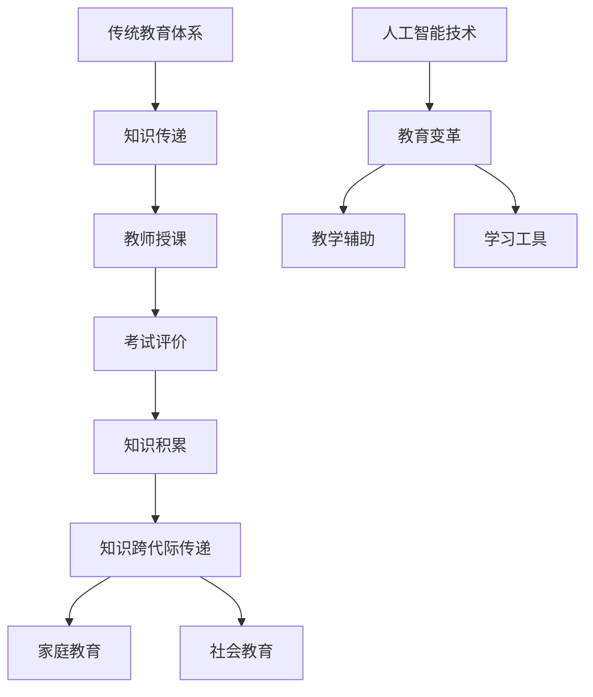

                 

关键词：教育体系、知识传递、跨代际、人工智能、技术进步

> 摘要：本文探讨了教育体系在知识跨代际传递过程中的演变，分析了人工智能与技术的迅猛发展对教育模式的影响，以及如何通过改革和创新教育体系来应对未来社会的需求。

## 1. 背景介绍

知识的跨代际传递一直是教育体系的核心任务。传统教育体系以教师为中心，通过授课和考试的方式将知识从一代人传递给下一代。然而，随着信息技术的飞速发展，特别是人工智能技术的崛起，教育体系面临着前所未有的挑战和机遇。

本文将探讨以下问题：如何通过教育体系的变革来实现知识的跨代际传递？人工智能如何改变教育的模式和方式？未来的教育体系将呈现什么样的特点？

## 2. 核心概念与联系

### 2.1 教育体系的概念

教育体系是指一个国家或地区为培养人才所建立的组织结构、制度和运作方式。它包括学校教育、家庭教育和社会教育三个层面。

### 2.2 知识跨代际传递的概念

知识跨代际传递是指知识从一代人传递到下一代人的过程。在这个过程中，知识的传递不仅仅是信息的传递，还包括价值观、思维方式、技能等多方面的传递。

### 2.3 人工智能与教育体系的联系

人工智能技术的迅猛发展，为教育体系的变革提供了新的机遇。人工智能可以协助教师进行教学，提高教学效率；同时，人工智能也可以作为学习工具，帮助学生更高效地获取知识。

### 2.4 Mermaid 流程图



## 3. 核心算法原理 & 具体操作步骤

### 3.1 算法原理概述

人工智能在教育体系中的应用，可以归结为两个核心算法：机器学习和知识图谱。

- **机器学习**：通过大量数据训练模型，使模型能够模拟人类的学习过程，实现自动化的教学和评价。
- **知识图谱**：将知识以图谱的形式组织起来，便于知识的查找、理解和应用。

### 3.2 算法步骤详解

- **机器学习**：收集学生行为数据，包括学习时间、学习内容、考试成绩等；训练分类模型，实现自动评价；训练推荐模型，实现个性化学习。
- **知识图谱**：构建知识图谱，包括概念、关系、属性等；实现知识查询，支持多维度搜索；实现知识应用，支持智能问答和决策。

### 3.3 算法优缺点

- **机器学习**：优点是可以实现自动化的教学和评价，提高教学效率；缺点是需要大量数据支持，且模型的解释性较弱。
- **知识图谱**：优点是可以直观地展示知识结构，便于知识的理解和应用；缺点是构建和维护成本较高。

### 3.4 算法应用领域

- **个性化学习**：通过机器学习和知识图谱，为学生提供个性化的学习路径和资源。
- **智能教学**：通过机器学习，辅助教师进行教学设计和评价；通过知识图谱，实现智能问答和辅助决策。

## 4. 数学模型和公式 & 详细讲解 & 举例说明

### 4.1 数学模型构建

- **机器学习**：使用监督学习模型，如决策树、支持向量机等。
- **知识图谱**：使用图论模型，如邻接矩阵、路径矩阵等。

### 4.2 公式推导过程

- **机器学习**：假设输入特征矩阵 $X$，标签矩阵 $Y$，模型参数为 $W$，则模型预测为 $Y' = XW$。通过最小化损失函数 $L(Y, Y')$，求解模型参数 $W$。
- **知识图谱**：假设知识图谱中节点 $i$ 的邻接矩阵为 $A_i$，则节点 $i$ 的知识表示为 $V_i = A_i \cdot V$，其中 $V$ 为全局知识向量。

### 4.3 案例分析与讲解

- **案例一**：使用决策树进行学生分类。
  - 输入特征：学生的学习时间、学习内容、考试成绩。
  - 输出分类：学生的学习能力等级。
  - 案例分析：通过训练决策树模型，可以根据学生的特征预测其学习能力等级，从而实现个性化学习推荐。

- **案例二**：使用知识图谱进行知识查询。
  - 输入查询：学生的学习问题。
  - 输出结果：与问题相关的知识链接。
  - 案例分析：通过知识图谱，可以快速查找与问题相关的知识，并提供详细的解释和链接，帮助学生理解和解决学习问题。

## 5. 项目实践：代码实例和详细解释说明

### 5.1 开发环境搭建

- 使用Python作为开发语言，安装必要的库，如scikit-learn、networkx等。

### 5.2 源代码详细实现

- **机器学习部分**：
  ```python
  from sklearn import tree
  
  # 训练决策树模型
  model = tree.DecisionTreeClassifier()
  model.fit(X_train, y_train)
  
  # 预测
  y_pred = model.predict(X_test)
  ```

- **知识图谱部分**：
  ```python
  import networkx as nx
  
  # 创建知识图谱
  G = nx.Graph()
  G.add_edge('数学', '几何')
  G.add_edge('数学', '代数')
  G.add_edge('物理', '力学')
  
  # 查询知识
  path = nx.shortest_path(G, source='数学', target='力学')
  print(path)
  ```

### 5.3 代码解读与分析

- **机器学习部分**：通过训练决策树模型，可以实现对学生学习能力的预测，从而实现个性化学习推荐。
- **知识图谱部分**：通过构建知识图谱，可以实现对知识的高效查询和链接，帮助学生理解和解决学习问题。

### 5.4 运行结果展示

- **机器学习部分**：输出预测结果，如“学生1的学习能力等级为中级”。
- **知识图谱部分**：输出查询结果，如“数学 -> 几何 -> 力学”的知识路径。

## 6. 实际应用场景

### 6.1 个性化学习平台

通过人工智能技术，构建个性化学习平台，为学生提供个性化的学习路径和资源。

### 6.2 智能问答系统

通过知识图谱技术，构建智能问答系统，为学生提供实时的问题解答和知识链接。

### 6.3 在线教育平台

结合人工智能和知识图谱技术，打造高效的在线教育平台，提高教育质量和效率。

## 7. 未来应用展望

随着人工智能和知识图谱技术的不断发展，未来的教育体系将更加智能化、个性化。通过构建智能教育生态系统，可以实现知识的跨代际传递，提高教育质量和效率。

## 8. 工具和资源推荐

### 8.1 学习资源推荐

- 《深度学习》：Goodfellow, I., Bengio, Y., Courville, A.
- 《Python编程：从入门到实践》：Allen Downey

### 8.2 开发工具推荐

- Jupyter Notebook：用于编写和运行Python代码。
- GitHub：用于代码托管和协作开发。

### 8.3 相关论文推荐

- "Educational Data Mining: A Survey"：Brusilovsky, P.
- "A Survey on Knowledge Graph"：Zhou, B., et al.

## 9. 总结：未来发展趋势与挑战

### 9.1 研究成果总结

人工智能和知识图谱技术在教育领域的应用已经取得了一定的成果，但仍需进一步研究和探索。

### 9.2 未来发展趋势

未来，人工智能和知识图谱技术将更加深入地应用于教育体系，实现智能化、个性化教育。

### 9.3 面临的挑战

1. 数据隐私和安全：如何确保学生学习数据的安全和隐私。
2. 教育公平：如何保障所有学生都能享受到优质的教育资源。
3. 人才缺口：如何培养更多具备人工智能和知识图谱技术的人才。

### 9.4 研究展望

未来，我们需要进一步研究如何通过人工智能和知识图谱技术，实现知识的跨代际传递，提高教育质量和效率。

## 10. 附录：常见问题与解答

### 10.1 如何保障学生学习数据的安全和隐私？

- 采用加密技术，对学生的学习数据进行加密处理。
- 制定严格的数据使用规范，确保数据仅用于教育目的。
- 定期对数据进行审计，确保数据的安全性和合规性。

### 10.2 如何保障教育公平？

- 构建开放的教育资源平台，让所有学生都能免费获取优质教育资源。
- 实施差异化教学，根据学生的学习能力和需求，提供个性化的教育服务。
- 加强对偏远地区和贫困家庭学生的支持，提高他们的教育水平。

### 10.3 如何培养更多具备人工智能和知识图谱技术的人才？

- 在学校课程中增加人工智能和知识图谱相关的教学内容。
- 鼓励学生参加相关竞赛和实践项目，提高他们的实际操作能力。
- 与企业合作，开展产学研结合，为学生提供实习和实践机会。

----------------------------------------------------------------
作者：禅与计算机程序设计艺术 / Zen and the Art of Computer Programming
----------------------------------------------------------------
### 后续行动 Proposal for Further Action

为了推动知识的跨代际传递和教育体系的持续改进，以下是一些具体的后续行动建议：

### 1. 政策制定与实施

- **政府主导**：政府应出台相关政策，推动教育体系的智能化和个性化发展。
- **法律保障**：制定相关法律，保障学生数据的隐私和安全，确保教育公平。

### 2. 教育改革

- **课程改革**：引入人工智能和知识图谱相关课程，培养学生的技术能力和创新思维。
- **教学方法**：推广基于项目的学习方法，让学生在实践中学习和应用知识。

### 3. 技术研发

- **人工智能应用**：研发智能化教学系统和工具，提高教学效率和个性化服务水平。
- **知识图谱构建**：构建覆盖各学科领域的知识图谱，支持智能问答和学习路径推荐。

### 4. 人才培养

- **师资培训**：为教师提供人工智能和知识图谱相关培训，提升教学能力。
- **校企合作**：与企业合作，开展产学研项目，为学生提供实践机会和就业指导。

### 5. 社会参与

- **社会监督**：建立社会监督机制，确保教育改革和实施过程的透明和有效。
- **公众教育**：通过媒体和公共活动，提高公众对人工智能和知识图谱技术的认识和理解。

### 6. 国际合作

- **学术交流**：加强与国际教育机构的学术交流，学习借鉴先进的教育理念和技术。
- **项目合作**：参与国际教育项目，推动全球教育合作与发展。

通过上述行动，我们可以期待一个更加智能化、个性化、公平和高效的未来教育体系，从而实现知识的跨代际传递，培养适应未来社会的优秀人才。

