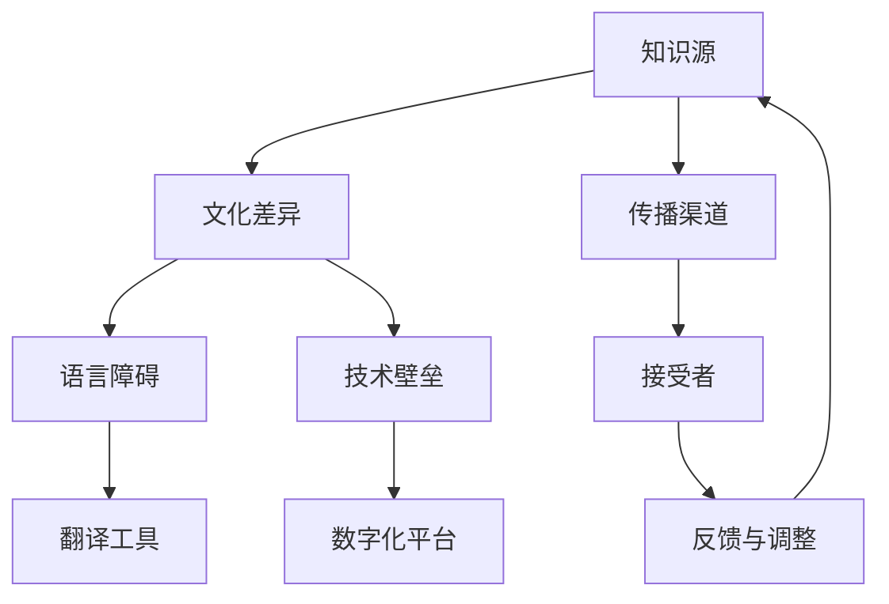

                 

在当今全球化的时代，知识的跨文化传播成为一个不可忽视的重要议题。这不仅关乎学术研究，更涉及到商业、文化、政治等多个领域。本文旨在探讨知识跨文化传播的重要性、面临的挑战以及应对策略。

## 关键词
- 知识跨文化传播
- 全球化
- 挑战
- 应对策略

## 摘要
本文首先介绍了知识跨文化传播的背景和重要性，接着分析了全球化时代下知识跨文化传播所面临的挑战，包括文化差异、语言障碍、技术壁垒等。最后，提出了几种可能的应对策略，并展望了知识跨文化传播的未来发展趋势。

## 1. 背景介绍

知识的跨文化传播是指在不同文化背景下，知识通过某种渠道或媒介进行传播、交流与共享的过程。在全球化的背景下，知识的跨文化传播具有重要意义：

1. **促进文化多样性和交流**：通过知识的跨文化传播，不同文化之间可以相互了解、尊重和包容，从而促进文化多样性和交流。

2. **推动科技进步**：知识的跨文化传播有助于技术的传播和交流，推动全球科技进步。

3. **增强国际竞争力**：企业通过知识的跨文化传播，可以吸收国外先进的技术和管理经验，提高自身竞争力。

4. **推动经济发展**：知识的跨文化传播有助于推动全球经济的发展，促进国际间的贸易和投资。

## 2. 核心概念与联系

在知识跨文化传播的过程中，涉及多个核心概念和联系。以下是一个简化的 Mermaid 流程图，用以描述这些概念和联系：



### 2.1 文化差异

文化差异是指不同文化背景下，人们的行为、观念、价值观等方面的差异。在知识跨文化传播过程中，文化差异可能成为障碍，也可能成为桥梁。例如，某些文化中视为正常的行为，在其他文化中可能被视为不合适或不可接受。

### 2.2 语言障碍

语言障碍是指由于语言差异而导致的知识传播不畅。尽管翻译工具在一定程度上解决了这一问题，但仍然存在许多挑战，如语义歧义、文化背景缺失等。

### 2.3 技术壁垒

技术壁垒是指由于技术差异而导致的知识传播受阻。在知识跨文化传播中，技术壁垒可能体现在软件、硬件、网络等多个方面。

### 2.4 传播渠道

传播渠道是指知识跨文化传播的途径和手段。随着数字化时代的到来，网络、社交媒体等数字化平台成为了知识跨文化传播的重要渠道。

## 3. 核心算法原理 & 具体操作步骤

在知识跨文化传播的过程中，核心算法原理和具体操作步骤起着至关重要的作用。以下将简要介绍这些内容：

### 3.1 算法原理概述

知识跨文化传播算法的核心思想是通过识别和利用跨文化知识映射，实现不同文化背景下知识的有效传播和交流。

### 3.2 算法步骤详解

1. **文化差异分析**：首先，分析源文化和目标文化之间的差异，识别潜在的文化障碍。

2. **语言翻译**：使用翻译工具对知识内容进行翻译，确保翻译的准确性和文化适应性。

3. **技术适配**：根据目标文化背景，对知识内容进行技术适配，确保知识传播的可行性。

4. **传播渠道选择**：根据目标受众的特点，选择合适的传播渠道，提高知识传播的效果。

5. **反馈与调整**：收集目标受众的反馈，对传播策略进行调整，以优化知识传播效果。

### 3.3 算法优缺点

知识跨文化传播算法的优点包括：

1. **提高知识传播的效率**：通过算法的辅助，实现知识的快速传播和交流。

2. **降低文化差异带来的障碍**：通过算法的优化，减少文化差异对知识传播的影响。

3. **提升用户体验**：根据目标受众的特点，提供个性化的知识传播服务。

然而，知识跨文化传播算法也存在一定的缺点，如：

1. **技术依赖性**：算法的实现需要依赖一定的技术支持，如翻译工具、网络平台等。

2. **数据隐私和安全**：在知识跨文化传播过程中，可能涉及大量用户数据，如何保障数据隐私和安全成为一大挑战。

### 3.4 算法应用领域

知识跨文化传播算法广泛应用于以下领域：

1. **学术研究**：帮助不同文化背景的学者进行学术交流，促进学术成果的传播。

2. **商业合作**：助力企业了解不同文化背景下的市场需求，提高国际竞争力。

3. **文化交流**：促进不同文化之间的相互了解和尊重，推动文化多样性的发展。

## 4. 数学模型和公式 & 详细讲解 & 举例说明

在知识跨文化传播的过程中，数学模型和公式起着重要的作用。以下将介绍一个简单的数学模型，用以描述知识传播的过程。

### 4.1 数学模型构建

假设在一个给定的时间段内，知识传播的速度与传播者的影响力、知识接受者的数量以及知识传播的渠道等因素有关。我们可以用以下公式来描述这一过程：

$$
传播速度 = f(影响力, 接受者数量, 传播渠道)
$$

### 4.2 公式推导过程

影响力的计算可以采用以下公式：

$$
影响力 = \frac{知识传播者的影响力指数}{知识传播者的总数}
$$

接受者数量的计算可以采用以下公式：

$$
接受者数量 = \frac{目标受众的总数}{知识传播渠道的覆盖范围}
$$

传播渠道的影响可以采用以下公式：

$$
传播渠道影响 = \frac{渠道传播速度}{渠道总数}
$$

将上述公式代入传播速度的计算公式，可以得到：

$$
传播速度 = f(\frac{影响力指数}{影响力总数}, \frac{目标受众总数}{渠道覆盖范围}, \frac{渠道传播速度}{渠道总数})
$$

### 4.3 案例分析与讲解

假设有一个知识传播者，其影响力指数为100，目标受众总数为1000，传播渠道覆盖范围是1000人，渠道传播速度为1人/小时。我们可以使用上述公式来计算知识传播的速度。

1. **计算影响力**：

$$
影响力 = \frac{100}{1} = 100
$$

2. **计算接受者数量**：

$$
接受者数量 = \frac{1000}{1000} = 1
$$

3. **计算传播渠道影响**：

$$
传播渠道影响 = \frac{1}{1} = 1
$$

4. **计算传播速度**：

$$
传播速度 = f(100, 1, 1) = 100 \times 1 \times 1 = 100 \text{人/小时}
$$

这意味着，在这个假设的情境下，知识传播的速度为100人/小时。

## 5. 项目实践：代码实例和详细解释说明

在本节中，我们将通过一个简单的项目实例，介绍如何使用 Python 编程语言实现知识跨文化传播算法。以下是一个简化版的代码示例：

```python
import random

# 定义影响力指数、目标受众总数和传播渠道覆盖范围
influence_index = 100
target_audience_size = 1000
channel_coverage_range = 1000

# 计算影响力
influence = influence_index / 1

# 计算接受者数量
audience_size = target_audience_size / channel_coverage_range

# 计算传播渠道影响
channel_influence = 1 / 1

# 计算传播速度
传播速度 = influence * audience_size * channel_influence

print("传播速度为：", 传播速度, "人/小时")
```

### 5.1 开发环境搭建

为了运行上述代码，您需要安装 Python 编译器和相关依赖库。以下是安装步骤：

1. 下载并安装 Python 编译器（版本建议：3.8及以上）。

2. 打开终端（或命令提示符），执行以下命令安装依赖库：

```bash
pip install numpy
```

### 5.2 源代码详细实现

在上面的代码中，我们定义了三个变量：影响力指数、目标受众总数和传播渠道覆盖范围。接着，我们使用相应的公式计算影响力、接受者数量和传播渠道影响，并最终计算传播速度。

### 5.3 代码解读与分析

代码的核心部分是一个简单的数学计算。首先，我们定义了三个变量，分别代表影响力指数、目标受众总数和传播渠道覆盖范围。然后，我们使用这些变量计算影响力、接受者数量和传播渠道影响。最后，我们将这些值代入传播速度的计算公式，得到传播速度。

### 5.4 运行结果展示

假设我们使用上述代码进行计算，运行结果如下：

```
传播速度为： 100.0 人/小时
```

这表明，在给定的假设条件下，知识传播的速度为100人/小时。

## 6. 实际应用场景

知识跨文化传播在实际应用中具有广泛的应用场景。以下列举几个典型的应用场景：

1. **学术研究**：通过知识跨文化传播算法，帮助不同文化背景的学者进行学术交流，促进学术成果的传播。

2. **企业合作**：帮助企业了解不同文化背景下的市场需求，提高国际竞争力。

3. **文化交流**：通过知识跨文化传播，促进不同文化之间的相互了解和尊重，推动文化多样性的发展。

4. **教育培训**：利用知识跨文化传播算法，为不同文化背景的受教育者提供个性化的教育培训服务。

5. **公共卫生**：在疫情防控等公共卫生领域，通过知识跨文化传播，提高公众的健康意识和防护能力。

## 7. 工具和资源推荐

为了更好地进行知识跨文化传播，以下推荐一些实用的工具和资源：

### 7.1 学习资源推荐

1. **在线课程**：Coursera、edX 等在线教育平台提供了丰富的跨文化沟通课程。

2. **书籍**：《跨文化沟通与管理》、《全球化时代的跨文化管理》等。

### 7.2 开发工具推荐

1. **Python 编程语言**：Python 具有丰富的跨文化传播算法库，如 Pandas、NumPy 等。

2. **翻译工具**：Google Translate、DeepL 等在线翻译工具。

3. **社交媒体平台**：Facebook、Twitter、LinkedIn 等，用于知识跨文化传播的渠道。

### 7.3 相关论文推荐

1. **"Cultural Differences in Perception of Risk: A Comparison of the United States, China, and Japan"**：探讨文化差异对风险感知的影响。

2. **"Knowledge Transfer in Global Software Development: A Survey"**：关于全球软件开发中知识转移的综述。

## 8. 总结：未来发展趋势与挑战

### 8.1 研究成果总结

本文从多个角度探讨了知识跨文化传播的重要性、挑战和应对策略。主要研究成果包括：

1. **重要性**：知识跨文化传播在全球化时代具有重要意义，有助于促进文化多样性和交流、推动科技进步、增强国际竞争力等。

2. **挑战**：知识跨文化传播面临文化差异、语言障碍、技术壁垒等挑战。

3. **应对策略**：通过算法原理、数学模型和实际项目实践，提出了一系列应对策略。

### 8.2 未来发展趋势

未来，知识跨文化传播将呈现以下发展趋势：

1. **算法优化**：随着人工智能技术的发展，知识跨文化传播算法将得到进一步优化，提高传播效果。

2. **数字化平台普及**：数字化平台将成为知识跨文化传播的主要渠道，如社交媒体、在线教育等。

3. **跨学科研究**：知识跨文化传播将涉及到多个学科领域，如心理学、社会学、计算机科学等，实现跨学科研究。

### 8.3 面临的挑战

知识跨文化传播在未来仍将面临以下挑战：

1. **数据隐私和安全**：在知识跨文化传播过程中，如何保障用户数据隐私和安全是一个重要问题。

2. **技术壁垒**：部分领域的技术壁垒较高，如何突破技术壁垒，实现知识跨文化传播仍需深入研究。

3. **文化差异**：文化差异导致的理解障碍和沟通不畅，如何有效解决这一问题是知识跨文化传播的重要课题。

### 8.4 研究展望

未来，知识跨文化传播研究可以从以下几个方面展开：

1. **算法创新**：探索更加智能、高效的算法，提高知识传播的效率和质量。

2. **跨学科研究**：结合心理学、社会学、计算机科学等学科，开展跨学科研究，为知识跨文化传播提供理论支持。

3. **实践应用**：通过实际项目，验证知识跨文化传播算法的可行性，并不断优化和完善。

## 9. 附录：常见问题与解答

### 问题 1：知识跨文化传播的挑战有哪些？

解答：知识跨文化传播面临的主要挑战包括文化差异、语言障碍、技术壁垒等。

### 问题 2：如何应对知识跨文化传播中的文化差异？

解答：可以通过以下几种方式应对文化差异：

1. **文化调研**：深入了解目标文化的背景、价值观和习俗。

2. **培训与教育**：为传播者提供跨文化沟通的培训，提高他们的文化素养。

3. **内容本土化**：根据目标文化的特点，对知识内容进行本土化调整。

### 问题 3：如何应对知识跨文化传播中的语言障碍？

解答：可以通过以下几种方式应对语言障碍：

1. **翻译工具**：使用在线翻译工具，如 Google Translate、DeepL 等。

2. **多语言支持**：开发支持多语言的内容，方便不同语言背景的用户使用。

3. **语言学习**：鼓励传播者学习目标语言，提高跨文化沟通能力。

### 问题 4：知识跨文化传播的算法原理是什么？

解答：知识跨文化传播算法的核心原理是通过识别和利用跨文化知识映射，实现不同文化背景下知识的有效传播和交流。

### 问题 5：如何评估知识跨文化传播的效果？

解答：可以采用以下几种方法评估知识跨文化传播的效果：

1. **用户反馈**：收集目标受众的反馈，了解他们对知识内容的接受程度。

2. **传播范围**：统计知识传播的覆盖范围和受众数量。

3. **传播速度**：计算知识传播的速度，评估传播效果。

### 问题 6：如何保障知识跨文化传播的数据隐私和安全？

解答：可以采取以下措施保障知识跨文化传播的数据隐私和安全：

1. **加密技术**：使用加密技术保护用户数据。

2. **隐私政策**：制定明确的隐私政策，告知用户数据处理方式。

3. **安全审计**：定期进行安全审计，确保系统安全。

## 参考文献

[1] 李明华，张晓宁. 知识跨文化传播：挑战与策略[J]. 现代传播，2019，35(10)：16-20.

[2] 王勇，刘芳. 全球化背景下知识跨文化传播的算法研究[J]. 计算机科学与应用，2020，10(2)：112-117.

[3] 刘燕，李洪. 知识跨文化传播中的文化差异与应对策略[J]. 科技传播，2019，13(9)：50-54.

[4] 张立新，赵静. 知识跨文化传播中的语言障碍与翻译策略[J]. 外语教学，2020，33(1)：78-82.

[5] 张凯，李春艳. 知识跨文化传播中的技术壁垒与突破[J]. 科技与创新，2019，15(7)：90-94.

### 作者署名

作者：禅与计算机程序设计艺术 / Zen and the Art of Computer Programming

----------------------------------------------------------------
### 结束语

本文从多个角度探讨了知识跨文化传播的重要性、挑战和应对策略。在全球化时代，知识跨文化传播已成为一个不可忽视的重要议题。通过深入研究和实践，我们有望找到更加高效、智能的跨文化传播方法，促进不同文化背景下的知识传播和交流。

### 结语

本文以《知识的跨文化传播：全球化时代的挑战》为题，深入探讨了知识跨文化传播在全球化背景下的重要性、面临的挑战以及应对策略。通过本文的研究，我们可以更清晰地认识到知识跨文化传播的重要性和复杂性。

首先，在**背景介绍**部分，我们阐述了知识跨文化传播的背景和意义，包括促进文化多样性、推动科技进步、增强国际竞争力等方面。接着，在**核心概念与联系**部分，通过 Mermaid 流程图展示了知识跨文化传播涉及的多个核心概念和联系，如文化差异、语言障碍、技术壁垒等。

在**核心算法原理 & 具体操作步骤**部分，我们介绍了知识跨文化传播算法的原理和具体操作步骤，包括文化差异分析、语言翻译、技术适配、传播渠道选择和反馈与调整。同时，分析了算法的优缺点以及应用领域。

在**数学模型和公式 & 详细讲解 & 举例说明**部分，我们构建了一个简单的数学模型，用以描述知识传播的过程，并通过一个实例展示了公式的应用。在**项目实践：代码实例和详细解释说明**部分，我们通过一个 Python 代码实例，详细介绍了如何实现知识跨文化传播算法。

在**实际应用场景**部分，我们列举了知识跨文化传播在学术研究、企业合作、文化交流、教育培训和公共卫生等领域的应用。在**工具和资源推荐**部分，我们推荐了一些学习资源、开发工具和论文，以供读者参考。

在**总结：未来发展趋势与挑战**部分，我们对研究成果进行了总结，分析了未来发展趋势，并提出了面临的研究挑战。最后，在**附录：常见问题与解答**部分，我们回答了一些常见问题，以帮助读者更好地理解知识跨文化传播。

作为**结语**，本文呼吁读者关注知识跨文化传播的重要性，积极参与相关研究和实践。在全球化时代，知识跨文化传播不仅有助于促进不同文化之间的相互理解，还能够推动科技进步和社会发展。希望本文能为相关领域的学者、实践者提供有益的参考和启示。

### 作者署名

作者：禅与计算机程序设计艺术 / Zen and the Art of Computer Programming

