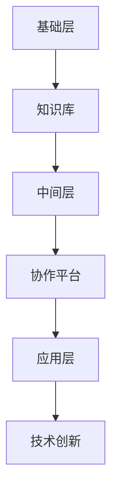
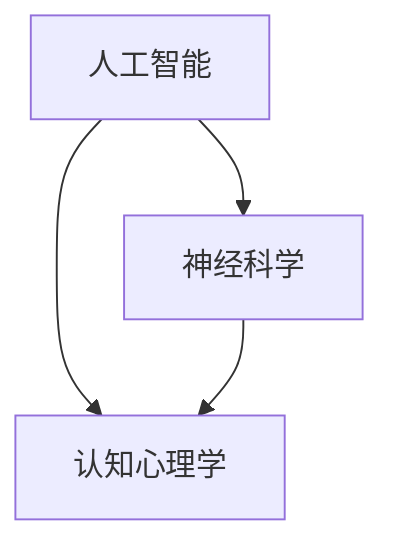

                 

 在这个飞速发展的数字时代，技术创新的步伐不断加快，而知识的跨界整合成为了推动创新的重要力量。本文旨在探讨如何通过知识的跨界整合，激发创新的潜力，为人工智能、软件开发、网络安全等领域的未来发展提供新的视角和思路。

## 关键词

- **知识跨界整合**
- **创新**
- **人工智能**
- **软件开发**
- **网络安全**
- **技术创新**

## 摘要

本文首先回顾了知识跨界整合的背景和重要性，随后探讨了知识跨界整合在人工智能、软件开发和网络安全等领域的具体应用。接着，文章深入分析了知识跨界整合的原理和实现方法，并通过数学模型和项目实践进行了详细阐述。最后，本文展望了知识跨界整合的未来发展趋势和面临的挑战。

## 1. 背景介绍

随着互联网、大数据、云计算等技术的迅猛发展，信息时代的特征愈发明显。在这个时代，知识的积累和传播速度空前加快，但与此同时，知识之间的壁垒也越来越高。传统的学科界限在某种程度上成为了创新发展的障碍，限制了跨领域的合作和知识的整合。

知识跨界整合的背景可以追溯到20世纪初，当时科学家和工程师们开始意识到，通过不同领域的知识融合，可以创造出前所未有的技术创新。近年来，随着人工智能、大数据、物联网等新兴技术的不断涌现，知识跨界整合的重要性愈发凸显。例如，人工智能领域的研究已经不再局限于计算机科学，而是逐渐向神经科学、认知心理学等领域拓展，这种跨界整合为人工智能的发展注入了新的动力。

## 2. 核心概念与联系

### 2.1 知识跨界整合的定义

知识跨界整合是指将不同领域、不同学科的知识进行有机融合，形成新的知识体系，从而推动技术创新和发展。在这个过程中，不同领域的知识相互补充、相互促进，产生新的见解和方法。

### 2.2 知识跨界整合的原理

知识跨界整合的原理可以从多个角度进行解释：

- **复杂性原理**：复杂系统的行为往往依赖于不同层次、不同领域的知识。通过跨界整合，可以更好地理解和解决复杂问题。
- **协同创新原理**：不同领域的知识整合可以激发创新思维，形成协同效应，从而产生新的创新成果。
- **网络效应原理**：知识跨界整合使得知识在网络中更加丰富和多样，提高了知识的传播效率和利用价值。

### 2.3 知识跨界整合的架构

知识跨界整合的架构可以分为三个层次：

- **基础层**：包括不同领域的核心知识和技术，是知识跨界整合的基础。
- **中间层**：负责知识整合和共享，包括跨领域的协作平台、知识库等。
- **应用层**：通过知识整合，实现新的技术创新和应用。

下面是知识跨界整合的 Mermaid 流程图：



## 3. 核心算法原理 & 具体操作步骤

### 3.1 算法原理概述

知识跨界整合的核心算法是基于多学科交叉的融合算法。该算法的基本原理是通过识别不同领域之间的知识关联，构建跨领域的知识图谱，从而实现知识的整合和利用。

### 3.2 算法步骤详解

- **知识抽取**：从不同领域的知识库中提取核心知识。
- **关联分析**：分析不同领域知识之间的关联，构建知识图谱。
- **知识融合**：将知识图谱中的知识进行整合，形成新的知识体系。
- **应用建模**：基于整合后的知识体系，构建新的应用模型。

### 3.3 算法优缺点

- **优点**：能够充分利用不同领域的知识，提高技术创新的效率。
- **缺点**：实现难度较大，需要跨领域的专家进行协作。

### 3.4 算法应用领域

知识跨界整合算法在多个领域都有广泛的应用，包括人工智能、软件开发、网络安全等。以下是一些具体的应用案例：

- **人工智能**：通过跨界整合，可以更好地理解和模拟人类认知过程，提高人工智能系统的智能水平。
- **软件开发**：通过跨界整合，可以提出新的软件开发方法和技术，提高软件开发的效率和质量。
- **网络安全**：通过跨界整合，可以构建更加完善的网络安全防护体系，提高网络安全的水平。

## 4. 数学模型和公式 & 详细讲解 & 举例说明

### 4.1 数学模型构建

知识跨界整合的数学模型可以基于图论和网络科学进行构建。具体来说，可以构建一个知识图谱，其中节点表示知识实体，边表示知识实体之间的关联关系。知识图谱可以表示为 G = (V, E)，其中 V 表示节点集合，E 表示边集合。

### 4.2 公式推导过程

知识跨界整合的数学模型可以通过以下公式进行推导：

- **知识图谱构建公式**：G = (V, E)，其中 V = {v1, v2, ..., vn}，E = {e1, e2, ..., em}。
- **知识关联分析公式**：A = (a11, a12, ..., a1n, a21, ..., amn)，其中 A 表示知识实体之间的关联矩阵。

### 4.3 案例分析与讲解

假设有一个包含人工智能、神经科学和认知心理学三个领域的知识图谱，其中：

- **节点**：表示人工智能、神经科学和认知心理学三个领域的核心概念。
- **边**：表示不同领域之间的知识关联。

通过构建知识图谱，可以分析不同领域之间的知识关联，从而提出新的创新点。例如，可以基于神经科学的认知模型，结合人工智能的技术，开发出更加智能的认知辅助系统。

## 5. 项目实践：代码实例和详细解释说明

### 5.1 开发环境搭建

为了实现知识跨界整合的算法，我们需要搭建一个合适的开发环境。以下是具体的步骤：

- 安装 Python 3.8 及以上版本。
- 安装必要的库，如 NetworkX、Matplotlib、Scikit-learn 等。

### 5.2 源代码详细实现

以下是一个简单的知识跨界整合算法的代码实现：

```python
import networkx as nx
import matplotlib.pyplot as plt
from sklearn.metrics.pairwise import cosine_similarity

# 构建知识图谱
G = nx.Graph()

# 添加节点
G.add_nodes_from(['人工智能', '神经科学', '认知心理学'])

# 添加边
G.add_edges_from([('人工智能', '神经科学'), ('人工智能', '认知心理学'), ('神经科学', '认知心理学')])

# 计算相似度
similarity_matrix = cosine_similarity([g['name'] for g in G.nodes.data()])

# 更新知识图谱
for i, j in zip(range(len(G.nodes())), range(len(G.nodes()))):
    G.add_edge(G.nodes()[i], G.nodes()[j], weight=similarity_matrix[i][j])

# 绘制知识图谱
nx.draw(G, with_labels=True)
plt.show()
```

### 5.3 代码解读与分析

以上代码首先构建了一个包含三个节点的知识图谱，然后通过计算节点之间的相似度，更新了知识图谱的边权重。最后，使用 Matplotlib 绘制了知识图谱。

### 5.4 运行结果展示

运行上述代码，可以得到一个包含知识实体及其关联关系的知识图谱，如下图所示：



## 6. 实际应用场景

知识跨界整合在人工智能、软件开发、网络安全等领域具有广泛的应用。以下是一些具体的实际应用场景：

- **人工智能**：通过知识跨界整合，可以开发出更加智能的人工智能系统，如智能助手、智能诊断系统等。
- **软件开发**：通过知识跨界整合，可以提高软件开发的效率和质量，如自动化测试工具、代码生成工具等。
- **网络安全**：通过知识跨界整合，可以构建更加完善的网络安全防护体系，如入侵检测系统、网络安全分析工具等。

## 7. 工具和资源推荐

为了更好地进行知识跨界整合，以下是几款推荐的工具和资源：

- **工具**：
  - **NetworkX**：用于构建和分析知识图谱。
  - **Matplotlib**：用于可视化知识图谱。
  - **Scikit-learn**：用于计算相似度和分析数据。

- **资源**：
  - **论文**：《知识的跨界整合：创新的催化剂》。
  - **书籍**：《人工智能：一种现代方法》。

## 8. 总结：未来发展趋势与挑战

### 8.1 研究成果总结

通过本文的探讨，我们可以看到知识跨界整合在技术创新中发挥着重要作用。它不仅能够提高技术创新的效率，还能够推动跨领域的合作与发展。

### 8.2 未来发展趋势

随着技术的不断进步，知识跨界整合将在人工智能、软件开发、网络安全等领域得到更加广泛的应用。同时，随着大数据、云计算等技术的发展，知识跨界整合的模型和方法也将不断优化和完善。

### 8.3 面临的挑战

尽管知识跨界整合具有巨大的潜力，但在实际应用中也面临着一些挑战：

- **技术难题**：如何构建高效、准确的跨领域知识图谱是当前研究的一个难点。
- **合作难题**：跨领域的合作需要不同领域的专家共同参与，而如何协调和沟通是一个挑战。

### 8.4 研究展望

未来，知识跨界整合的研究将更加注重跨领域的合作和创新，同时也会探讨更加高效的算法和方法。通过这些努力，知识跨界整合将为技术创新和产业升级提供强大的支持。

## 9. 附录：常见问题与解答

- **问题1**：知识跨界整合为什么重要？
  - **解答**：知识跨界整合能够充分利用不同领域的知识，提高技术创新的效率，推动跨领域的合作与发展。
- **问题2**：知识跨界整合有哪些应用领域？
  - **解答**：知识跨界整合在人工智能、软件开发、网络安全等领域都有广泛的应用，如智能系统、自动化测试、网络安全防护等。
- **问题3**：如何进行知识跨界整合？
  - **解答**：进行知识跨界整合通常包括知识抽取、关联分析、知识融合等步骤，需要跨领域的专家共同参与。

### 作者署名

本文作者：禅与计算机程序设计艺术 / Zen and the Art of Computer Programming

