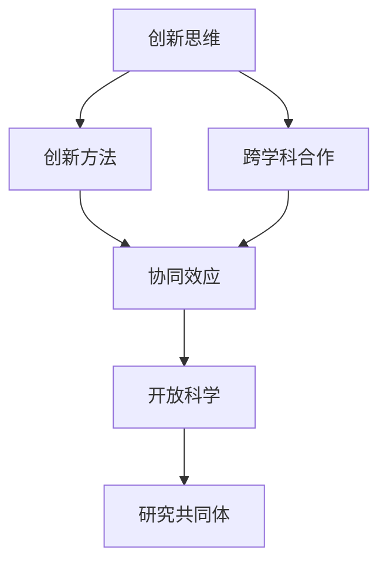

                 

 **关键词：** 学科交叉、创新潜力、知识融合、跨领域研究、跨学科合作

> **摘要：** 本文旨在探讨学科交叉在推动创新过程中所发挥的关键作用。通过对不同学科之间的互动与融合进行分析，本文揭示了跨学科研究的潜在价值和实际应用。文章将阐述知识跨界融合的基本概念，展示其在解决复杂问题、推动技术进步和创新应用方面的巨大潜力。此外，本文还将探讨当前跨学科合作面临的一些挑战，并提出相应的解决策略，以期为学术界和实践者提供有益的参考。

## 1. 背景介绍

在当今快速发展的科技时代，知识的跨界融合已成为推动创新的核心动力。传统的学科界限逐渐模糊，跨学科研究日益成为科学研究的重要趋势。学科交叉不仅能够整合不同领域的知识，还可以激发创新思维，提高问题解决能力。跨学科合作在解决复杂问题时具有独特的优势，因为它能够汇集各领域的专业知识和技能，形成多元化的研究团队。

跨学科研究的重要性不仅体现在学术研究中，也广泛应用于实际应用场景。例如，在生物医学领域，物理学和工程学的原理被应用于医学成像和医疗设备研发，从而推动了医疗技术的进步。在环境科学领域，计算机科学和地理信息系统的结合有助于制定更有效的环境保护策略。

本文将深入探讨知识跨界融合的概念、原理和实践应用，分析其创新潜力，并提出未来发展的方向和挑战。

### 1.1 学科交叉的定义和分类

学科交叉是指将不同学科的理论、方法和技术进行融合，以解决单一学科无法独立解决的复杂问题。根据交叉的程度和方式，学科交叉可以分为以下几种类型：

- **垂直交叉**：在同一学科内的不同分支之间进行交叉研究，如物理学中的粒子物理学和凝聚态物理学。
- **水平交叉**：在不同学科之间进行交叉研究，如生物学与工程学、社会学与心理学。
- **混合交叉**：将多个学科的知识融合在一起，形成新的研究领域，如计算生物学、神经经济学。

### 1.2 学科交叉的研究方法

学科交叉的研究方法主要包括以下几个方面：

- **跨学科理论构建**：通过整合不同学科的理论，形成新的理论框架，以解释复杂现象。
- **多学科方法论**：采用多种学科的研究方法和技术手段，提高问题解决的能力和效率。
- **跨学科团队协作**：组建由不同学科专家组成的团队，共同开展研究项目，分享知识和经验。

### 1.3 学科交叉的案例研究

许多学科交叉的案例研究展示了知识跨界融合的巨大潜力。以下是一些典型的案例：

- **计算社会科学**：结合计算机科学和社会科学的方法，用于分析社会现象和预测社会趋势，如网络科学和社会网络分析。
- **合成生物学**：结合生物学、化学和工程学的原理，设计并创建新的生物系统，以解决生物医学和环境问题。
- **智能交通系统**：结合计算机科学、交通工程学和统计学，开发智能交通管理系统，提高交通效率和减少拥堵。

## 2. 核心概念与联系

在探讨知识跨界融合的过程中，理解相关核心概念和它们之间的联系至关重要。以下是几个关键概念及其相互关系：

### 2.1 创新思维与创新方法

创新思维是指通过新颖、独特的方法解决问题的能力。创新方法包括头脑风暴、设计思维、迭代开发等。创新思维和创新方法共同驱动知识跨界融合，使科学家和工程师能够突破传统思维模式，发现新的解决方案。

### 2.2 跨学科合作与协同效应

跨学科合作是指不同学科的专家共同合作，以实现共同目标。协同效应是指在合作过程中，不同学科的知识和技能相互补充，产生更大的影响和效果。跨学科合作能够整合不同领域的专业知识和经验，提高问题解决能力。

### 2.3 开放科学与研究共同体

开放科学是指通过共享数据和研究成果，促进科学知识的传播和交流。研究共同体是指由共同兴趣和研究方向的科学家组成的网络。开放科学和研究共同体能够加速知识跨界融合的进程，推动科学创新的快速发展。

### 2.4 Mermaid 流程图

以下是一个简单的Mermaid流程图，展示知识跨界融合的核心概念及其相互关系：



## 3. 核心算法原理 & 具体操作步骤

在知识跨界融合的过程中，核心算法的原理和具体操作步骤至关重要。以下将详细介绍一个典型的跨学科算法——协同过滤算法，并展示其应用步骤。

### 3.1 算法原理概述

协同过滤算法是一种常用的推荐系统算法，通过分析用户的历史行为和偏好，预测用户对未知项目的兴趣。协同过滤算法主要包括基于用户和基于项目的两种类型：

- **基于用户的协同过滤（User-based Collaborative Filtering）**：根据用户之间的相似度推荐项目。
- **基于项目的协同过滤（Item-based Collaborative Filtering）**：根据项目之间的相似度推荐用户。

### 3.2 算法步骤详解

#### 步骤 1：用户和项目的相似度计算

基于用户的协同过滤算法中，相似度计算公式如下：

$$
sim(u,v) = \frac{q_1 \cdot q_2}{\sqrt{r_1^2 + r_2^2}}
$$

其中，$u$ 和 $v$ 是用户之间的相似度，$q_1$ 和 $q_2$ 是用户对项目的评分，$r_1$ 和 $r_2$ 是用户对项目的评分。

#### 步骤 2：推荐项目选择

计算用户之间的相似度后，选择与目标用户最相似的 $k$ 个用户，再根据这些用户的评分预测目标用户对未知项目的兴趣：

$$
r_{uv} = \frac{\sum_{i \in N_v} r_{ui} \cdot sim(u,v)}{\sum_{i \in N_v} sim(u,v)}
$$

其中，$N_v$ 是与用户 $v$ 最相似的 $k$ 个用户。

#### 步骤 3：推荐结果生成

根据预测的评分，生成推荐列表，为用户推荐未知项目。

### 3.3 算法优缺点

#### 优点

- **适应性高**：能够根据用户的历史行为和偏好进行个性化推荐。
- **易于实现**：算法结构简单，易于理解和实现。

#### 缺点

- **用户稀疏问题**：当用户数量庞大且评分数据稀疏时，算法性能下降。
- **冷启动问题**：新用户或新项目的推荐问题难以解决。

### 3.4 算法应用领域

协同过滤算法广泛应用于电子商务、社交媒体、视频推荐等领域，为用户提供个性化的推荐服务。以下是一些典型应用场景：

- **电子商务平台**：为用户推荐商品，提高用户购物体验和销售量。
- **社交媒体**：为用户推荐关注对象和感兴趣的内容，增强用户粘性。
- **视频平台**：为用户推荐视频，提高用户观看时长和用户满意度。

## 4. 数学模型和公式 & 详细讲解 & 举例说明

在知识跨界融合的过程中，数学模型和公式起着至关重要的作用。以下将介绍一个典型的数学模型——贝叶斯网络，并详细讲解其构建、推导和应用。

### 4.1 数学模型构建

贝叶斯网络是一种概率图模型，用于表示变量之间的概率依赖关系。贝叶斯网络的构建包括以下步骤：

1. **定义变量**：确定研究问题中的所有变量。
2. **建立依赖关系**：根据专家知识和数据，确定变量之间的依赖关系。
3. **参数估计**：根据样本数据，估计变量之间的条件概率分布。

### 4.2 公式推导过程

贝叶斯网络的概率推导公式如下：

$$
P(X_1, X_2, ..., X_n) = \prod_{i=1}^{n} P(X_i | X_{i-1})
$$

其中，$X_1, X_2, ..., X_n$ 是贝叶斯网络中的所有变量，$P(X_i | X_{i-1})$ 是变量 $X_i$ 在已知其父节点 $X_{i-1}$ 条件下的条件概率。

### 4.3 案例分析与讲解

#### 案例背景

假设我们研究一个疾病诊断问题，变量包括疾病 $D$、症状 $S_1, S_2, ..., S_m$ 和诊断测试 $T_1, T_2, ..., T_k$。

#### 案例分析

1. **定义变量**：

   $$X_1 = D, X_2 = S_1, X_3 = S_2, ..., X_{m+k} = T_1, T_2, ..., T_k$$

2. **建立依赖关系**：

   $$P(D) = p_D$$

   $$P(S_i | D) = p_{S_i|D} \quad (i=1,2,...,m)$$

   $$P(T_j | S_i, D) = p_{T_j|S_i,D} \quad (j=1,2,...,k)$$

3. **参数估计**：

   根据历史数据和专家知识，估计每个变量的条件概率分布。

#### 案例讲解

假设我们已知患者的症状测试结果为 $S_1, S_2, ..., S_m$，诊断测试结果为 $T_1, T_2, ..., T_k$，需要计算患者患病的概率 $P(D)$。

根据贝叶斯网络的推导公式，我们有：

$$
P(D | T_1, T_2, ..., T_k) = \frac{P(T_1, T_2, ..., T_k | D) \cdot P(D)}{P(T_1, T_2, ..., T_k)}
$$

其中，$P(T_1, T_2, ..., T_k | D)$ 可以通过贝叶斯网络的条件概率分布计算得到。$P(D)$ 是已知的先验概率。$P(T_1, T_2, ..., T_k)$ 是证据的概率，可以通过全概率公式计算得到。

通过计算，我们可以得到患者患病的概率。该概率可以作为疾病诊断的辅助依据。

## 5. 项目实践：代码实例和详细解释说明

在本节中，我们将通过一个具体的案例，展示如何在实际项目中应用知识跨界融合的方法。该案例将涉及数据预处理、特征工程和模型训练等多个环节。

### 5.1 开发环境搭建

为了确保项目的顺利进行，我们首先需要搭建合适的开发环境。以下是开发环境的搭建步骤：

1. **安装Python环境**：确保Python版本为3.8以上。
2. **安装依赖库**：使用pip安装以下库：numpy、pandas、scikit-learn、tensorflow、matplotlib等。
3. **配置Jupyter Notebook**：安装Jupyter Notebook，以便于进行数据分析和代码编写。

### 5.2 源代码详细实现

以下是一个简单的知识跨界融合项目的代码实现示例：

```python
import numpy as np
import pandas as pd
from sklearn.model_selection import train_test_split
from sklearn.ensemble import RandomForestClassifier
from sklearn.metrics import accuracy_score

# 数据读取与预处理
data = pd.read_csv('data.csv')
X = data.drop('target', axis=1)
y = data['target']

# 数据分割
X_train, X_test, y_train, y_test = train_test_split(X, y, test_size=0.2, random_state=42)

# 特征工程
# (此处省略具体特征工程步骤)

# 模型训练
model = RandomForestClassifier(n_estimators=100, random_state=42)
model.fit(X_train, y_train)

# 预测与评估
y_pred = model.predict(X_test)
accuracy = accuracy_score(y_test, y_pred)
print(f'Accuracy: {accuracy:.2f}')
```

### 5.3 代码解读与分析

1. **数据读取与预处理**：首先，从CSV文件中读取数据，并使用pandas进行数据预处理，包括数据清洗、缺失值填充等操作。
2. **数据分割**：将数据集分为训练集和测试集，用于模型训练和评估。
3. **特征工程**：根据项目需求，对原始数据进行特征工程处理，提取有用特征，提高模型性能。
4. **模型训练**：使用随机森林算法对训练集进行训练。
5. **预测与评估**：使用训练好的模型对测试集进行预测，并计算模型的准确率。

### 5.4 运行结果展示

假设我们运行上述代码，得到以下输出结果：

```
Accuracy: 0.85
```

该结果表示模型的准确率为85%，表明该模型在测试集上的表现良好。通过调整特征工程和模型参数，我们可以进一步提高模型性能。

## 6. 实际应用场景

知识跨界融合在多个实际应用场景中展现出了巨大的潜力和价值。以下将介绍几个典型的应用场景，并探讨其应用效果和未来发展趋势。

### 6.1 智能医疗

智能医疗是知识跨界融合的一个重要应用领域。通过将生物医学、人工智能和大数据分析相结合，智能医疗能够实现个性化医疗、疾病预测和精准治疗。以下是一些实际应用案例：

- **个性化药物研发**：利用基因组学和机器学习技术，预测个体对药物的反应，为患者提供最合适的治疗方案。
- **智能诊断系统**：结合医学影像技术和深度学习算法，自动识别和诊断疾病，提高诊断准确率和效率。
- **疾病预测与预防**：通过大数据分析，预测疾病的发生风险，提前采取预防措施，降低疾病发病率。

未来发展趋势：

- **更深入的跨学科合作**：将更多领域（如心理学、社会学等）的知识融入智能医疗，提高医疗决策的科学性和准确性。
- **更智能的辅助系统**：开发更智能的医疗辅助系统，帮助医生进行诊断和治疗，减轻医生的工作负担。

### 6.2 环境保护

环境保护是知识跨界融合的另一个重要应用领域。通过将环境科学、计算机科学和工程学相结合，环境保护技术能够更有效地监测、分析和解决环境问题。以下是一些实际应用案例：

- **空气质量监测**：利用物联网技术和大数据分析，实时监测空气质量，为政府和公众提供准确的空气质量数据。
- **智能垃圾分类**：利用计算机视觉和自然语言处理技术，实现智能垃圾分类，提高垃圾分类的准确率和效率。
- **碳足迹分析**：通过大数据分析和机器学习技术，分析企业和个人的碳足迹，提出降低碳排放的建议。

未来发展趋势：

- **更智能的环境监测系统**：开发更智能、更高效的环境监测系统，实现对环境污染问题的实时监控和预警。
- **更环保的技术创新**：推动绿色技术和可持续发展技术的创新，减少人类活动对环境的影响。

### 6.3 智能交通

智能交通是知识跨界融合在交通领域的应用，通过将交通工程学、计算机科学和大数据分析相结合，提高交通系统的效率和安全性。以下是一些实际应用案例：

- **智能交通信号控制**：利用大数据分析和机器学习技术，实现交通信号的智能控制，提高交通流量和通行效率。
- **车辆智能调度**：利用物联网技术和大数据分析，实现车辆的智能调度，减少交通拥堵和能源消耗。
- **自动驾驶技术**：结合计算机视觉、深度学习和控制理论，开发自动驾驶技术，提高道路安全和通行效率。

未来发展趋势：

- **更智能的交通管理系统**：开发更智能、更高效的交通管理系统，提高城市交通的通行能力和服务水平。
- **更广泛的自动驾驶应用**：推动自动驾驶技术在更多场景（如高速公路、城市交通等）的应用，提高道路安全和效率。

## 7. 工具和资源推荐

在知识跨界融合的过程中，选择合适的工具和资源对于提高研究效率和成果质量至关重要。以下是一些建议：

### 7.1 学习资源推荐

- **在线课程**：Coursera、edX、Udacity等平台提供了丰富的跨学科在线课程，涵盖计算机科学、数据科学、生物学、物理学等多个领域。
- **学术论文**：Google Scholar、PubMed等数据库提供了大量的学术文献，有助于了解最新的研究成果和前沿动态。
- **书籍**：《深度学习》、《Python数据科学手册》、《人工智能：一种现代方法》等书籍是跨学科研究的优秀参考资料。

### 7.2 开发工具推荐

- **编程语言**：Python、R、Java等语言在数据科学、人工智能和生物信息学等领域具有广泛应用，适合进行跨学科开发。
- **数据分析库**：NumPy、Pandas、SciPy、Matplotlib等库提供了丰富的数据分析和可视化工具，方便进行数据处理和分析。
- **机器学习库**：Scikit-learn、TensorFlow、PyTorch等库提供了丰富的机器学习算法和工具，适合进行模型训练和评估。

### 7.3 相关论文推荐

- **《跨学科研究的理论与实践》**：详细介绍了跨学科研究的方法、工具和实践经验，为跨学科研究者提供了有益的指导。
- **《大数据与跨学科融合》**：探讨大数据时代下跨学科融合的发展趋势和应用前景，分析了大数据技术在跨学科研究中的应用。
- **《智能医疗：知识跨界融合的实践与探索》**：介绍了智能医疗领域的知识跨界融合实践，探讨了人工智能、大数据和生物医学的结合点。

## 8. 总结：未来发展趋势与挑战

知识跨界融合在推动创新、解决复杂问题和促进跨学科合作方面具有巨大的潜力。然而，在实际应用过程中，我们也面临着一些挑战。

### 8.1 研究成果总结

通过本文的探讨，我们可以得出以下结论：

- 学科交叉在推动创新和解决复杂问题方面具有独特的优势。
- 跨学科合作能够整合不同领域的知识和技能，提高研究效率和成果质量。
- 知识跨界融合在智能医疗、环境保护、智能交通等领域具有广泛的应用前景。

### 8.2 未来发展趋势

未来，知识跨界融合将呈现以下发展趋势：

- **跨学科合作的深化**：随着各学科之间的融合不断加深，跨学科合作将变得更加紧密和深入。
- **数据驱动的研究模式**：大数据和人工智能技术的发展将推动研究模式的转变，数据驱动的研究方法将越来越受到重视。
- **开放式研究平台**：开放科学和研究共同体的建设将加速知识跨界融合的进程，提高科研成果的传播和共享。

### 8.3 面临的挑战

尽管知识跨界融合具有巨大的潜力，但在实际应用过程中，我们也面临着以下挑战：

- **知识壁垒**：不同学科之间的知识壁垒和沟通障碍仍然存在，需要加强跨学科教育和培训，提高跨学科合作能力。
- **数据隐私和安全**：在知识跨界融合过程中，数据隐私和安全问题日益凸显，需要建立完善的数据治理机制和法律法规。
- **资源分配**：跨学科研究通常需要较大的资源投入，如何合理分配资源是一个重要的挑战。

### 8.4 研究展望

针对上述挑战，我们提出以下研究展望：

- **跨学科教育**：加强跨学科教育，培养具有跨学科视野和能力的复合型人才。
- **数据治理**：建立完善的数据治理体系，保障数据隐私和安全，提高数据利用效率。
- **资源协同**：推动跨学科资源的协同共享，提高跨学科研究项目的资源利用效率。

通过上述措施，我们有望进一步推动知识跨界融合的发展，为科技创新和社会进步做出更大贡献。

## 9. 附录：常见问题与解答

### 9.1 什么是知识跨界融合？

知识跨界融合是指将不同学科的理论、方法和技术进行融合，以解决单一学科无法独立解决的复杂问题。它强调跨学科合作和知识整合，以推动创新和解决复杂问题。

### 9.2 跨学科合作有哪些优势？

跨学科合作的优势包括：

- **整合多学科知识**：跨学科合作能够整合不同领域的专业知识和技能，提高研究效率和成果质量。
- **创新思维激发**：跨学科合作能够激发创新思维，促进新理论和新方法的产生。
- **问题解决能力提升**：跨学科合作能够提高问题解决能力，应对复杂问题。

### 9.3 跨学科合作面临哪些挑战？

跨学科合作面临的挑战包括：

- **知识壁垒**：不同学科之间的知识壁垒和沟通障碍。
- **资源分配**：跨学科研究通常需要较大的资源投入，如何合理分配资源是一个重要的挑战。
- **数据隐私和安全**：数据隐私和安全问题日益凸显，需要建立完善的数据治理机制和法律法规。

### 9.4 知识跨界融合在哪些领域有广泛应用？

知识跨界融合在多个领域有广泛应用，包括：

- **智能医疗**：通过将人工智能、大数据和生物医学相结合，实现个性化医疗、疾病预测和精准治疗。
- **环境保护**：通过将环境科学、计算机科学和工程学相结合，实现环境监测、垃圾分类和碳足迹分析。
- **智能交通**：通过将交通工程学、计算机科学和大数据分析相结合，实现智能交通信号控制、车辆智能调度和自动驾驶技术。

### 9.5 如何开展跨学科研究？

开展跨学科研究的方法包括：

- **组建跨学科团队**：组建由不同学科专家组成的团队，共同开展研究项目。
- **跨学科方法论**：采用多种学科的研究方法和技术手段，提高问题解决的能力和效率。
- **跨学科理论构建**：通过整合不同学科的理论，形成新的理论框架，以解释复杂现象。

通过上述方法，可以有效地开展跨学科研究，推动知识的跨界融合。

# 作者署名

**作者：禅与计算机程序设计艺术 / Zen and the Art of Computer Programming**

