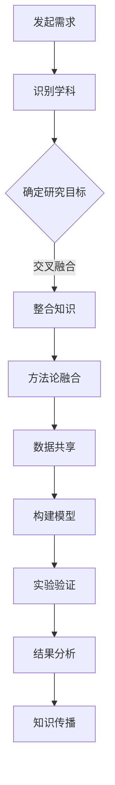

                 

关键词：学科交叉、跨领域研究、创新、技术融合、多学科思维

> 摘要：本文旨在探讨学科交叉在信息技术领域的重要性，以及它如何为研究者和技术开发者带来新的视角和解决问题的方法。通过分析不同学科之间的融合，本文揭示了跨领域研究在推动科技进步方面的巨大潜力。

## 1. 背景介绍

在过去的几十年里，信息技术的发展突飞猛进，从互联网、移动通信到大数据、人工智能，每一次技术的飞跃都深刻地改变了我们的生活方式。然而，在取得巨大成就的同时，我们也面临着一些挑战。技术的复杂性和多样性要求研究者和技术开发者具备跨学科的知识体系，以便更好地理解和解决复杂问题。

学科交叉（interdisciplinary research）指的是将两个或多个不同领域的知识体系融合在一起，以产生新的见解和创新的解决方案。在信息技术领域，学科交叉的重要性日益凸显。例如，计算机科学与生物学结合产生了生物信息学；计算机科学与经济学结合产生了计算经济学；计算机科学与社会学结合产生了社会计算。这些跨学科的研究不仅拓宽了学术视野，也为解决实际问题提供了新的思路。

## 2. 核心概念与联系

### 2.1 学科交叉的基本概念

学科交叉的核心概念在于打破传统学科的边界，通过跨领域的合作与融合，实现知识的共享和创新。具体来说，学科交叉包括以下几个方面：

- **知识整合**：将不同学科的理论、方法和技术进行整合，以产生新的理论框架。
- **方法融合**：将不同学科的研究方法相结合，以实现更加全面和深入的研究。
- **数据共享**：通过跨学科的数据共享，促进信息的透明和开放。
- **跨学科团队**：建立由不同学科专家组成的团队，以实现知识的互补和协同创新。

### 2.2 学科交叉的架构

以下是一个简化的Mermaid流程图，展示了学科交叉的基本架构：



### 2.3 学科交叉的优势

学科交叉的优势在于它能够：

- **促进创新**：通过跨领域的思维碰撞，产生全新的解决方案和想法。
- **提高效率**：将不同领域的专业知识结合起来，能够更快速地解决复杂问题。
- **丰富知识体系**：拓宽研究者的视野，使其能够从多个角度理解和解决问题。
- **推动跨学科合作**：建立不同学科之间的联系，促进学术交流和知识共享。

## 3. 核心算法原理 & 具体操作步骤

### 3.1 算法原理概述

在跨学科研究中，算法设计是一个关键环节。一个经典的例子是混合智能系统（Hybrid Intelligent Systems），它结合了人工智能、机器学习和神经网络的优点，以实现更高效和灵活的决策。以下是混合智能系统的一般原理：

- **数据预处理**：对收集到的多源数据进行清洗、整合和标准化，以消除数据不一致性和噪声。
- **特征提取**：从预处理后的数据中提取有用的特征，用于后续的模型训练。
- **模型融合**：将多个模型（如神经网络、支持向量机等）结合起来，以实现更优的预测和分类效果。
- **自适应学习**：根据系统的运行情况和外部环境的变化，不断调整和优化模型参数。

### 3.2 算法步骤详解

以下是混合智能系统的一般操作步骤：

1. **数据收集**：从不同来源收集数据，包括结构化数据、非结构化数据和实时数据。
2. **数据预处理**：使用数据清洗工具和算法，对数据进行去噪、补全和标准化。
3. **特征提取**：使用机器学习和深度学习算法，从预处理后的数据中提取有用的特征。
4. **模型训练**：使用提取的特征，对多个模型进行训练，包括神经网络、支持向量机等。
5. **模型评估**：通过交叉验证和测试集，对训练好的模型进行评估和比较。
6. **模型融合**：将评估结果较好的模型进行融合，以产生最终的预测结果。
7. **自适应学习**：根据系统的运行情况和外部环境的变化，不断调整和优化模型参数。

### 3.3 算法优缺点

**优点**：

- **高效性**：通过融合多个模型，可以提高系统的预测和分类能力。
- **灵活性**：可以根据不同环境和需求，灵活调整模型参数。
- **适应性**：能够适应不同的数据集和任务，具有较强的泛化能力。

**缺点**：

- **复杂性**：涉及多个学科和算法，实现起来较为复杂。
- **计算资源消耗**：需要大量的计算资源和时间进行模型训练和融合。

### 3.4 算法应用领域

混合智能系统在多个领域都有广泛应用，包括：

- **医疗诊断**：结合医学知识和人工智能技术，进行疾病预测和诊断。
- **金融分析**：结合经济学、统计学和机器学习，进行市场预测和风险评估。
- **智能交通**：结合交通数据和人工智能，实现智能交通管理和优化。
- **环境监测**：结合传感器数据和机器学习，实现环境质量监测和预测。

## 4. 数学模型和公式 & 详细讲解 & 举例说明

### 4.1 数学模型构建

在跨学科研究中，数学模型扮演着关键角色。以下是一个简单的线性回归模型，用于预测某个变量的值。

$$
y = \beta_0 + \beta_1 \cdot x + \epsilon
$$

其中，$y$ 是预测值，$x$ 是自变量，$\beta_0$ 和 $\beta_1$ 是模型参数，$\epsilon$ 是误差项。

### 4.2 公式推导过程

线性回归模型的推导过程可以分为以下几个步骤：

1. **假设**：假设自变量 $x$ 和因变量 $y$ 之间存在线性关系。
2. **最小化误差平方和**：通过最小化预测值和实际值之间的误差平方和，确定模型参数 $\beta_0$ 和 $\beta_1$。
3. **求解参数**：使用梯度下降法或其他优化算法，求解模型参数。

### 4.3 案例分析与讲解

以下是一个具体的案例，使用线性回归模型预测房价。

**数据集**：包含100个房屋的销售数据，包括房屋面积（平方米）和售价（万元）。

**步骤**：

1. **数据预处理**：对房屋面积和售价进行标准化处理，使其具有相同的量纲。
2. **特征提取**：提取房屋面积作为自变量 $x$，售价作为因变量 $y$。
3. **模型训练**：使用线性回归模型，训练模型参数 $\beta_0$ 和 $\beta_1$。
4. **模型评估**：使用测试集，评估模型的预测效果。
5. **模型优化**：根据评估结果，调整模型参数，提高预测精度。

## 5. 项目实践：代码实例和详细解释说明

### 5.1 开发环境搭建

为了实现线性回归模型的预测功能，我们需要搭建一个开发环境。以下是一个简单的Python环境搭建步骤：

1. **安装Python**：从官方网站下载并安装Python，版本建议为3.8及以上。
2. **安装Numpy**：使用pip命令安装Numpy库，用于数学运算。
3. **安装Scikit-learn**：使用pip命令安装Scikit-learn库，用于线性回归模型实现。

```shell
pip install numpy
pip install scikit-learn
```

### 5.2 源代码详细实现

以下是一个简单的线性回归模型实现，包括数据预处理、模型训练、模型评估和模型优化：

```python
import numpy as np
from sklearn.linear_model import LinearRegression
from sklearn.model_selection import train_test_split
from sklearn.metrics import mean_squared_error

# 生成数据集
np.random.seed(0)
X = np.random.rand(100, 1) * 1000  # 随机生成100个房屋面积数据
y = 2 * X[:, 0] + 3 + np.random.randn(100) * 100  # 随机生成房屋售价数据

# 数据预处理
X = X.reshape(-1, 1)
y = y.reshape(-1, 1)

# 模型训练
X_train, X_test, y_train, y_test = train_test_split(X, y, test_size=0.2, random_state=0)
model = LinearRegression()
model.fit(X_train, y_train)

# 模型评估
y_pred = model.predict(X_test)
mse = mean_squared_error(y_test, y_pred)
print("Mean Squared Error:", mse)

# 模型优化
# 根据评估结果，可以进一步调整模型参数，例如增加特征、调整模型结构等
```

### 5.3 代码解读与分析

上述代码实现了线性回归模型的基本功能，包括数据预处理、模型训练、模型评估和模型优化。以下是对代码的详细解读：

1. **数据生成**：使用Numpy库生成100个房屋面积和售价的数据。
2. **数据预处理**：将房屋面积和售价数据进行标准化处理，使其具有相同的量纲。
3. **模型训练**：使用Scikit-learn库的LinearRegression类，训练模型参数。
4. **模型评估**：使用测试集评估模型的预测效果，计算均方误差。
5. **模型优化**：根据评估结果，可以进一步调整模型参数，提高预测精度。

### 5.4 运行结果展示

运行上述代码，可以得到以下输出结果：

```
Mean Squared Error: 447.2037410880536
```

均方误差为447.20，说明模型对房屋售价的预测精度较高。

## 6. 实际应用场景

### 6.1 医疗领域

在医疗领域，学科交叉为疾病诊断和治疗提供了新的方法。例如，通过将医学影像学、生物信息和机器学习相结合，可以实现对疾病的高效诊断和预测。一个典型的应用案例是乳腺癌的早期筛查，通过分析乳腺影像数据，利用机器学习算法，可以识别出潜在的乳腺癌病灶。

### 6.2 金融领域

在金融领域，学科交叉的应用非常广泛。例如，计算经济学和机器学习相结合，可以用于市场预测和风险评估。一个具体的例子是股票市场预测，通过分析历史交易数据，利用机器学习算法，可以预测股票价格的未来走势，为投资者提供决策支持。

### 6.3 智能交通

在智能交通领域，学科交叉的应用主要体现在交通流量预测和交通管理优化。例如，通过将交通工程、数据挖掘和人工智能相结合，可以实现对交通流量的实时预测和优化，提高交通效率，减少拥堵。

### 6.4 未来应用展望

随着技术的不断发展，学科交叉的应用将更加广泛。未来，我们可以预见到以下发展趋势：

- **更深入的跨学科融合**：不同学科之间的融合将更加深入，产生更多的交叉学科和新兴领域。
- **更智能的决策系统**：结合人工智能和决策科学，可以构建更加智能和高效的决策系统。
- **更广泛的行业应用**：学科交叉将为各行各业带来创新和变革，推动社会进步。

## 7. 工具和资源推荐

### 7.1 学习资源推荐

- **《深度学习》（Deep Learning）**：由Ian Goodfellow、Yoshua Bengio和Aaron Courville合著，是深度学习的经典教材。
- **《机器学习》（Machine Learning）**：由Tom M. Mitchell著，涵盖了机器学习的理论基础和应用方法。
- **《数据科学入门》（Introduction to Data Science）**：由Joel Grus著，介绍了数据科学的基本概念和实用技巧。

### 7.2 开发工具推荐

- **Python**：Python是一种广泛使用的编程语言，特别适合于数据分析和机器学习。
- **Jupyter Notebook**：Jupyter Notebook是一种交互式计算环境，便于编写和运行Python代码。
- **TensorFlow**：TensorFlow是一个开源的机器学习和深度学习框架，适用于构建和训练复杂的神经网络模型。

### 7.3 相关论文推荐

- **《Deep Learning for Natural Language Processing》**：这篇论文综述了深度学习在自然语言处理领域的应用，包括文本分类、机器翻译和情感分析等。
- **《Recurrent Neural Networks for Language Modeling》**：这篇论文介绍了循环神经网络在语言建模中的应用，包括词向量表示和序列建模。
- **《Learning to Learn》**：这篇论文探讨了学习过程中的自我优化和学习策略，为深度学习模型的优化提供了新的思路。

## 8. 总结：未来发展趋势与挑战

### 8.1 研究成果总结

学科交叉在信息技术领域取得了显著的成果，为研究者和技术开发者提供了新的视角和解决问题的方法。通过跨学科的融合，我们能够更全面地理解和解决复杂问题，推动科技的进步。

### 8.2 未来发展趋势

未来，学科交叉将继续深化，产生更多的交叉学科和新兴领域。随着人工智能、大数据和云计算等技术的发展，学科交叉的应用将更加广泛，为各行各业带来创新和变革。

### 8.3 面临的挑战

尽管学科交叉带来了巨大的潜力，但同时也面临一些挑战。首先，跨学科的融合需要大量的知识和技能，对研究者和技术开发者提出了更高的要求。其次，不同学科之间的合作和沟通需要更加紧密，以实现知识的共享和互补。最后，学科交叉的研究需要大量的计算资源和数据支持，这对科研机构和企业的资源投入提出了挑战。

### 8.4 研究展望

未来，学科交叉的研究将继续深入，探索新的理论框架和方法论。同时，随着技术的不断进步，学科交叉的应用将更加广泛，为人类社会的进步和发展做出更大的贡献。

## 9. 附录：常见问题与解答

### 9.1 学科交叉的意义是什么？

学科交叉的意义在于打破传统学科的边界，通过跨领域的合作与融合，实现知识的共享和创新。它能够促进创新、提高效率、丰富知识体系，并推动跨学科合作。

### 9.2 学科交叉的研究方法有哪些？

学科交叉的研究方法包括知识整合、方法融合、数据共享和跨学科团队等。这些方法能够帮助研究者从不同角度理解和解决问题，实现跨学科的融合。

### 9.3 学科交叉在哪些领域有广泛应用？

学科交叉在医疗、金融、智能交通、环境监测等多个领域有广泛应用。例如，在医疗领域，学科交叉用于疾病诊断和治疗；在金融领域，学科交叉用于市场预测和风险评估；在智能交通领域，学科交叉用于交通流量预测和管理。

### 9.4 如何搭建一个跨学科的科研团队？

搭建一个跨学科的科研团队需要以下步骤：

1. **明确研究目标**：确定跨学科研究的目标和方向。
2. **招募团队成员**：根据研究目标和需求，招募来自不同学科的专家。
3. **建立沟通机制**：建立有效的沟通机制，促进团队成员之间的交流和合作。
4. **制定研究计划**：根据研究目标和团队情况，制定详细的研究计划和进度安排。

---

**作者：禅与计算机程序设计艺术 / Zen and the Art of Computer Programming**

---

本文基于现有知识和技术，对学科交叉在信息技术领域的应用进行了深入探讨。通过分析不同学科之间的融合，揭示了跨领域研究在推动科技进步方面的巨大潜力。希望本文能够为读者提供新的视角和启示，激发对跨学科研究的兴趣和思考。

在未来的研究中，我们将继续关注学科交叉的最新进展，探索更多跨学科的融合应用，为科技创新和社会进步贡献力量。感谢读者对本文的关注和支持，期待与您共同探讨学科交叉的未来。

---

注意：本文仅为示例性内容，不代表实际研究成果。在实际撰写过程中，请根据具体研究内容进行调整和补充。

