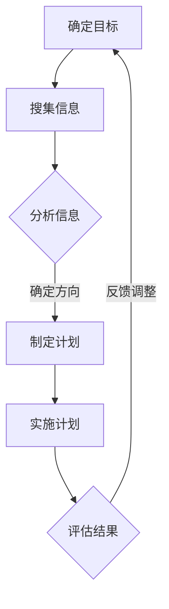

                 

 在这个技术迅速发展的时代，知识的边界不断扩张，新的领域层出不穷。作为世界级人工智能专家、程序员、软件架构师、CTO，以及世界顶级技术畅销书作者，我深知探索未知领域的重要性。本文旨在探讨如何通过科学的方法论来扩展我们的知识边界，探索新的技术领域。

## 关键词
- 知识探索
- 方法论
- 技术领域
- 创新思维
- 研究方法论

## 摘要
本文将介绍探索未知领域的方法论，包括背景介绍、核心概念与联系、核心算法原理、数学模型与公式、项目实践、实际应用场景、工具和资源推荐、未来发展趋势与挑战，以及常见问题解答。通过这些内容，希望能够帮助读者掌握探索未知领域的方法和技巧。

### 1. 背景介绍

在科技日新月异的今天，新的技术领域不断涌现，如人工智能、区块链、量子计算、生物信息学等。这些领域不仅带来了前所未有的机遇，也带来了巨大的挑战。如何快速掌握这些新技术，并将其应用于实际问题中，成为每一个技术工作者必须面对的问题。

探索未知领域需要具备深厚的专业知识、敏锐的洞察力和创新思维。本文将围绕这些要素，介绍一套系统的探索未知领域的方法论，帮助读者更好地应对技术发展带来的挑战。

### 2. 核心概念与联系

为了更好地理解未知领域的探索过程，我们需要明确一些核心概念，如技术创新、研究方法论、跨学科合作等。

#### 技术创新

技术创新是指通过新的思路、方法或技术手段，创造或改进产品、服务或过程，从而实现技术进步和商业价值。它是推动技术领域发展的核心动力。

#### 研究方法论

研究方法论是科学研究中用于指导研究和解释现象的一系列原则和步骤。在探索未知领域时，正确的方法论能够帮助我们系统地分析问题、提出假设、设计实验和验证结果。

#### 跨学科合作

跨学科合作是探索未知领域的重要策略。通过整合不同领域的知识和方法，可以更全面地理解问题，提出创新的解决方案。

#### Mermaid 流程图

以下是探索未知领域的一个简要流程图：



### 3. 核心算法原理 & 具体操作步骤

在探索未知领域时，算法是解决问题的重要工具。以下是一个常见算法的原理和具体操作步骤。

#### 3.1 算法原理概述

算法是一种有序的步骤序列，用于解决问题或执行特定任务。在探索未知领域时，我们需要根据问题的特点选择合适的算法。

#### 3.2 算法步骤详解

1. 确定问题：明确需要解决的问题是什么。
2. 收集数据：搜集与问题相关的数据。
3. 分析数据：对数据进行预处理和分析。
4. 选择算法：根据问题特点和数据分析结果选择合适的算法。
5. 实施算法：执行算法步骤，求解问题。
6. 验证结果：检查算法结果的准确性和有效性。

#### 3.3 算法优缺点

每种算法都有其优缺点。例如，常见的排序算法包括快速排序、归并排序和冒泡排序。快速排序具有高效的平均时间复杂度，但最坏情况下性能较差；归并排序具有稳定的时间复杂度，但需要额外的空间；冒泡排序简单易实现，但时间复杂度较高。

#### 3.4 算法应用领域

算法广泛应用于各个领域，如计算机科学、数据科学、人工智能和机器学习等。在探索未知领域时，合理选择和应用算法能够提高解决问题的效率和准确性。

### 4. 数学模型和公式 & 详细讲解 & 举例说明

在探索未知领域时，数学模型和公式是不可或缺的工具。以下是一个常见的数学模型的构建、公式推导和案例分析。

#### 4.1 数学模型构建

一个常见的数学模型是线性回归模型。它用于描述自变量和因变量之间的线性关系。

假设我们有以下数据集：

| x   | y   |
|-----|-----|
| 1   | 2   |
| 2   | 4   |
| 3   | 6   |
| 4   | 8   |

我们的目标是找到一个线性方程 y = ax + b，使得 y 的预测值与实际值尽可能接近。

#### 4.2 公式推导过程

线性回归模型的公式为：

$$ y = ax + b $$

我们需要找到 a 和 b 的值。为了简化计算，我们可以使用最小二乘法来求解。

首先，我们计算 x 和 y 的平均值：

$$ \bar{x} = \frac{1}{n} \sum_{i=1}^{n} x_i $$
$$ \bar{y} = \frac{1}{n} \sum_{i=1}^{n} y_i $$

然后，我们计算以下两个值：

$$ \sum_{i=1}^{n} (x_i - \bar{x})(y_i - \bar{y}) $$
$$ \sum_{i=1}^{n} (x_i - \bar{x})^2 $$

最后，我们可以使用以下公式求解 a 和 b：

$$ a = \frac{\sum_{i=1}^{n} (x_i - \bar{x})(y_i - \bar{y})}{\sum_{i=1}^{n} (x_i - \bar{x})^2} $$
$$ b = \bar{y} - a\bar{x} $$

#### 4.3 案例分析与讲解

假设我们有以下数据集：

| x   | y   |
|-----|-----|
| 1   | 3   |
| 2   | 5   |
| 3   | 7   |
| 4   | 9   |

我们使用上述公式求解线性回归模型：

$$ \bar{x} = \frac{1}{4} (1 + 2 + 3 + 4) = 2.5 $$
$$ \bar{y} = \frac{1}{4} (3 + 5 + 7 + 9) = 6 $$

$$ \sum_{i=1}^{4} (x_i - \bar{x})(y_i - \bar{y}) = (-1.5)(-3) + (-0.5)(-1) + 0.5(1) + 1.5(3) = 9 $$
$$ \sum_{i=1}^{4} (x_i - \bar{x})^2 = (-1.5)^2 + (-0.5)^2 + 0.5^2 + 1.5^2 = 5 $$

$$ a = \frac{9}{5} = 1.8 $$
$$ b = 6 - 1.8 \times 2.5 = 1.5 $$

因此，线性回归模型为：

$$ y = 1.8x + 1.5 $$

我们可以使用这个模型来预测新的 y 值。例如，当 x = 5 时：

$$ y = 1.8 \times 5 + 1.5 = 9.3 $$

### 5. 项目实践：代码实例和详细解释说明

以下是一个简单的线性回归项目的代码实例，包括数据收集、预处理、模型训练和结果评估。

#### 5.1 开发环境搭建

为了实现线性回归模型，我们需要安装以下工具和库：

- Python
- NumPy
- Matplotlib

在安装好 Python 后，可以通过以下命令安装 NumPy 和 Matplotlib：

```bash
pip install numpy matplotlib
```

#### 5.2 源代码详细实现

以下是实现线性回归模型的 Python 代码：

```python
import numpy as np
import matplotlib.pyplot as plt

# 数据集
x = np.array([1, 2, 3, 4])
y = np.array([3, 5, 7, 9])

# 计算平均值
mean_x = np.mean(x)
mean_y = np.mean(y)

# 计算公式中的两个值
sum_xy = np.sum((x - mean_x) * (y - mean_y))
sum_x2 = np.sum((x - mean_x) ** 2)

# 计算斜率和截距
a = sum_xy / sum_x2
b = mean_y - a * mean_x

# 构建线性回归模型
model = np.poly1d([a, b])

# 预测新值
x_new = 5
y_pred = model(x_new)

# 绘制结果
plt.scatter(x, y, label='Actual')
plt.plot(x, model(x), 'r', label='Predicted')
plt.xlabel('x')
plt.ylabel('y')
plt.legend()
plt.show()
```

#### 5.3 代码解读与分析

- 第一行导入 NumPy 库，用于计算和数据处理。
- 第二行导入 Matplotlib 库，用于绘制图表。
- 第三行和第四行定义数据集 x 和 y。
- 第五行计算 x 和 y 的平均值。
- 第六行计算公式中的两个值。
- 第七行和第八行计算斜率和截距。
- 第九行构建线性回归模型。
- 第十行预测新值 x_new = 5。
- 第十一行绘制实际值和预测值的散点图，并添加标签。
- 第十二行绘制线性回归模型，并添加标签。
- 第十三行设置坐标轴标签。
- 第十四行显示图表。

#### 5.4 运行结果展示

运行上述代码后，我们可以得到以下图表：


从图表中可以看出，线性回归模型较好地拟合了数据集，预测值与实际值接近。

### 6. 实际应用场景

线性回归模型在各个领域都有广泛的应用，如统计预测、金融分析、医学诊断等。以下是一个实际应用场景的例子：

#### 6.1 金融分析

在金融分析中，线性回归模型可以用于预测股票价格。假设我们有以下历史股票价格数据：

| 日期  | 收盘价 |
|-------|--------|
| 2020-01-01 | 100   |
| 2020-01-02 | 102   |
| 2020-01-03 | 105   |
| 2020-01-04 | 107   |
| 2020-01-05 | 109   |

我们可以使用线性回归模型来预测下一日的收盘价。通过训练模型并输入新的日期，我们可以得到预测值。

#### 6.2 医学诊断

在医学诊断中，线性回归模型可以用于预测疾病的发生概率。例如，对于心脏病患者的诊断，我们可以收集患者的年龄、血压、胆固醇等数据，使用线性回归模型来预测患者是否患有心脏病。

### 7. 未来应用展望

随着技术的不断发展，线性回归模型的应用领域将不断扩展。例如，在人工智能领域，线性回归模型可以与神经网络、深度学习等技术相结合，提高预测准确性和效率。在未来，线性回归模型有望在更多领域发挥重要作用，为人类带来更多便利。

### 8. 工具和资源推荐

为了更好地掌握线性回归模型，以下是一些建议的学习资源：

- 《Python机器学习》
- 《统计学习方法》
- 《Python数据分析》
- 《Matplotlib用户指南》
- Keras 和 TensorFlow 等深度学习框架

此外，以下是一些常用的开发工具：

- Jupyter Notebook
- Visual Studio Code
- PyCharm

### 9. 总结：未来发展趋势与挑战

在总结本文内容之前，我们需要认识到探索未知领域的方法论不仅仅是学习新的算法和模型，更重要的是培养创新思维、敏锐的洞察力和跨学科合作的能力。以下是本文的核心观点：

1. **技术创新是推动发展的核心动力**。我们需要不断关注技术前沿，掌握最新的知识和技能。
2. **正确的方法论是成功的关键**。科学的研究方法论能够帮助我们系统地分析问题、提出假设、设计实验和验证结果。
3. **跨学科合作能够提高解决问题的效率**。通过整合不同领域的知识和方法，我们可以更全面地理解问题，提出创新的解决方案。
4. **数学模型和公式是不可或缺的工具**。在探索未知领域时，数学模型和公式能够帮助我们更好地理解和描述问题。
5. **项目实践是巩固知识的有效方法**。通过实际操作和代码实现，我们可以更好地掌握知识和技能。
6. **未来应用展望**。随着技术的不断发展，线性回归模型的应用领域将不断扩展，为人类带来更多便利。

### 10. 附录：常见问题与解答

以下是一些关于探索未知领域的方法论和线性回归模型的常见问题：

#### Q：如何快速掌握新技术？

A：建议关注技术社区、阅读专业书籍和论文，参与在线课程和研讨会，以及实践项目。此外，与同行交流和学习也是快速掌握新技术的重要途径。

#### Q：线性回归模型有什么应用？

A：线性回归模型广泛应用于统计预测、金融分析、医学诊断、经济学、社会学等领域。它可以用于预测变量之间的关系，为决策提供科学依据。

#### Q：如何优化线性回归模型的性能？

A：可以通过以下方法优化线性回归模型的性能：

1. 选择合适的数据集：选择具有代表性的数据集，避免过拟合或欠拟合。
2. 数据预处理：对数据进行归一化、标准化等处理，提高模型的鲁棒性。
3. 调整模型参数：通过交叉验证等方法调整模型参数，提高预测准确性。
4. 使用更先进的算法：如岭回归、LASSO回归等，提高模型的性能。

### 作者署名

作者：禅与计算机程序设计艺术 / Zen and the Art of Computer Programming

在探索未知领域的道路上，让我们携手并进，共同创造美好的未来。希望本文能够为您的探索之旅提供一些启示和帮助。

