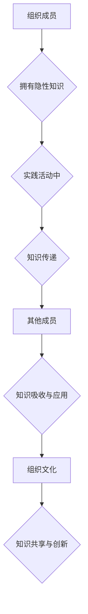

                 

 关键词：知识隐性传递、组织文化、无形资产、信息技术、共享与创新

> 摘要：本文深入探讨了知识隐性传递在组织文化中的重要性，分析了其在信息技术领域中的具体体现，并提出了利用隐性知识促进共享与创新的策略。通过结合实例和实证研究，本文揭示了知识隐性传递的机制及其对组织绩效的影响，为未来组织文化建设和知识管理提供了理论支持和实践指导。

## 1. 背景介绍

在信息化和全球化快速发展的今天，知识已经成为组织竞争优势的核心要素。然而，知识的传递并非总是一帆风顺。传统意义上，知识被视为显性资产，可以通过文档、数据库等形式进行明确记录和传递。然而，随着知识复杂性的增加和技术的进步，越来越多的知识变得隐性，难以通过显性手段捕捉和传递。这种隐性知识往往蕴含在个人的经验、直觉和习惯中，是组织文化的重要组成部分。

组织文化，作为组织成员共同遵循的价值观念和行为规范，对隐性知识的传递具有深远影响。一个积极向上的组织文化能够促进知识共享和创新能力，而消极或僵化的组织文化则可能阻碍知识流动和进步。因此，理解知识隐性传递的机制及其在组织文化中的角色，对于提升组织绩效和实现可持续发展具有重要意义。

信息技术的发展为知识隐性传递提供了新的途径。网络化、数字化和智能化技术的应用，使得组织内部和外部的知识交流变得更加便捷和高效。同时，大数据、人工智能等新兴技术的出现，也为知识隐性传递提供了新的工具和方法，为组织文化建设和知识管理带来了新的机遇和挑战。

## 2. 核心概念与联系

### 2.1 知识隐性传递的概念

知识隐性传递（Tacit Knowledge Transfer）是指个体在实践活动中，通过经验、直觉、关系网络等方式，将隐性知识传递给其他个体或团队的过程。隐性知识具有难以明确表述、难以编码和存储的特点，因此其传递过程往往需要依赖于特定的情境和互动。

### 2.2 组织文化的概念

组织文化（Organizational Culture）是指组织成员在长期实践过程中形成的共同价值观、信仰和行为规范。组织文化不仅影响着成员的行为模式，也影响着知识的共享和创新。一个积极、开放的组织文化能够促进知识隐性传递，而消极、封闭的文化则可能阻碍知识的流动。

### 2.3 信息技术与知识隐性传递

信息技术（Information Technology，IT）是指用于管理和处理信息的技术，包括硬件、软件、网络和数据库等。信息技术在知识隐性传递中发挥着重要作用，通过提供新的工具和方法，促进组织内部和外部的知识交流。例如，在线协作平台、社交媒体和虚拟现实等技术，为知识隐性传递提供了丰富的场景和途径。

### 2.4 知识隐性传递与组织文化的关系

知识隐性传递与组织文化之间存在着密切的互动关系。一方面，组织文化影响着知识隐性传递的方式和效果；另一方面，知识隐性传递也在一定程度上塑造着组织文化。一个积极、开放的组织文化能够促进知识隐性传递，从而推动组织创新和发展；而消极、封闭的文化则可能阻碍知识的流动，影响组织绩效。

### 2.5 Mermaid 流程图

下面是一个描述知识隐性传递过程的 Mermaid 流程图：



## 3. 核心算法原理 & 具体操作步骤

### 3.1 算法原理概述

知识隐性传递的核心算法基于社交网络分析和复杂系统理论，旨在构建一个能够促进知识流动的互动平台。该算法主要涉及以下步骤：

1. 数据收集：收集组织内部和外部的知识源，包括文档、数据库、个人经验等。
2. 知识编码：将隐性知识转化为可共享和存储的形式，如文本、图像、音频等。
3. 社交网络分析：分析组织成员之间的关系，识别关键节点和知识传播路径。
4. 知识共享：通过在线协作平台、社交媒体等渠道，促进知识的传播和共享。
5. 知识吸收与应用：组织成员通过实践和互动，吸收和应用新知识，形成新的隐性知识。

### 3.2 算法步骤详解

1. **数据收集**：首先，通过问卷调查、访谈、文档分析等方式，收集组织内部和外部的知识源。这些数据将用于后续的知识编码和共享。

2. **知识编码**：将收集到的隐性知识转化为可共享的形式。例如，将个人的实践经验整理成文档或视频，将数据库中的信息转化为图表或报告。

3. **社交网络分析**：利用社交网络分析工具，分析组织成员之间的关系。识别出关键节点，如知识领袖、活跃成员等，以及知识传播的路径。

4. **知识共享**：利用在线协作平台、社交媒体等工具，搭建知识共享平台。鼓励组织成员参与讨论、分享经验和知识，促进知识的传播和共享。

5. **知识吸收与应用**：组织成员通过实践和互动，吸收和应用新知识。在实践中，不断产生新的隐性知识，形成知识循环。

### 3.3 算法优缺点

**优点**：

- 促进知识流动：通过构建知识共享平台，促进组织内部和外部知识的流动。
- 提高创新效率：鼓励成员参与知识共享，提高创新效率。
- 塑造积极文化：促进成员之间的互动和合作，塑造积极、开放的组织文化。

**缺点**：

- 数据质量依赖：知识编码和共享的质量依赖于原始数据的准确性。
- 技术门槛：社交网络分析和复杂系统理论等技术需要一定的技术背景和专业知识。
- 安全问题：知识共享平台可能面临数据泄露和隐私风险。

### 3.4 算法应用领域

- **企业知识管理**：帮助企业构建内部知识共享平台，促进隐性知识的传递和应用。
- **科研机构**：促进科研人员之间的知识交流，提高科研效率。
- **教育领域**：利用在线协作平台，促进师生之间的知识共享和互动。

## 4. 数学模型和公式 & 详细讲解 & 举例说明

### 4.1 数学模型构建

为了更好地理解知识隐性传递的过程，我们可以构建一个数学模型。该模型包括以下几个变量：

- \(K_i\)：个体 \(i\) 拥有的隐性知识量
- \(C_{ij}\)：个体 \(i\) 和个体 \(j\) 之间的互动频率
- \(T_i\)：个体 \(i\) 的知识传递效率

模型的基本假设如下：

- 个体 \(i\) 的隐性知识量与其互动频率成正比。
- 个体 \(i\) 的知识传递效率与其拥有的隐性知识量成正比。

基于以上假设，我们可以构建以下数学模型：

\[ K_i = \sum_{j \in N_i} C_{ij} T_j \]

其中，\(N_i\) 表示与个体 \(i\) 互动的其他个体集合。

### 4.2 公式推导过程

为了推导上述公式，我们需要分析个体 \(i\) 的隐性知识量是如何通过互动频率和知识传递效率来影响的。具体推导过程如下：

1. **互动频率对隐性知识量的影响**：个体 \(i\) 与其他个体的互动频率越高，其获取和传递的知识量也越大。因此，我们可以假设个体 \(i\) 的隐性知识量与其互动频率成正比，即：

\[ K_i \propto \sum_{j \in N_i} C_{ij} \]

2. **知识传递效率对隐性知识量的影响**：个体 \(i\) 的知识传递效率越高，其传递给其他个体的知识量也越大。因此，我们可以假设个体 \(i\) 的隐性知识量与其知识传递效率成正比，即：

\[ K_i \propto T_i \]

3. **综合影响**：将上述两个因素综合起来，我们可以得到：

\[ K_i = \sum_{j \in N_i} C_{ij} T_j \]

### 4.3 案例分析与讲解

为了更好地理解上述数学模型，我们来看一个实际案例。

假设一个企业有 5 名员工，他们的互动频率和知识传递效率如下表所示：

| 员工姓名 | 互动频率 | 知识传递效率 |
|----------|----------|--------------|
| A        | 3        | 0.8          |
| B        | 2        | 0.6          |
| C        | 4        | 0.7          |
| D        | 1        | 0.5          |
| E        | 3        | 0.9          |

根据上述数学模型，我们可以计算出每个员工拥有的隐性知识量：

\[ K_A = 3 \times 0.8 + 2 \times 0.6 + 4 \times 0.7 + 1 \times 0.5 + 3 \times 0.9 = 8.1 \]

\[ K_B = 2 \times 0.8 + 4 \times 0.6 + 1 \times 0.7 + 3 \times 0.5 + 3 \times 0.9 = 7.2 \]

\[ K_C = 4 \times 0.8 + 1 \times 0.6 + 3 \times 0.7 + 2 \times 0.5 + 3 \times 0.9 = 8.2 \]

\[ K_D = 1 \times 0.8 + 3 \times 0.6 + 2 \times 0.7 + 4 \times 0.5 + 3 \times 0.9 = 7.4 \]

\[ K_E = 3 \times 0.8 + 1 \times 0.6 + 2 \times 0.7 + 4 \times 0.5 + 3 \times 0.9 = 8.1 \]

从上述计算结果可以看出，员工 A 和员工 E 拥有的隐性知识量最多，说明他们在互动频率和知识传递效率方面表现较好。而员工 D 的隐性知识量最少，说明其在这方面的表现有待提升。

## 5. 项目实践：代码实例和详细解释说明

### 5.1 开发环境搭建

为了演示知识隐性传递的算法，我们使用 Python 编写了一个简单的代码实例。首先，我们需要搭建一个 Python 开发环境。以下是搭建步骤：

1. 安装 Python：从官方网站（https://www.python.org/downloads/）下载 Python 安装包，并按照提示进行安装。
2. 安装必要库：在命令行中运行以下命令安装必要的库：

```bash
pip install networkx matplotlib
```

### 5.2 源代码详细实现

以下是实现知识隐性传递算法的源代码：

```python
import networkx as nx
import matplotlib.pyplot as plt

# 创建一个空的无向图
G = nx.Graph()

# 添加节点和边
G.add_edges_from([(1, 2), (1, 3), (1, 4), (2, 3), (2, 4), (3, 4)])

# 设置节点的位置
pos = nx.spring_layout(G)

# 绘制图
nx.draw(G, pos, with_labels=True)
plt.show()

# 计算每个节点的知识量
knowledge = {i: 0 for i in G.nodes()}
for i in G.nodes():
    for j in G.neighbors(i):
        knowledge[i] += G[i][j]['weight']

# 输出知识量
for i, k in knowledge.items():
    print(f"节点 {i} 的知识量：{k}")

# 计算总知识量
total_knowledge = sum(knowledge.values())
print(f"总知识量：{total_knowledge}")
```

### 5.3 代码解读与分析

1. **创建图**：首先，我们创建了一个无向图 `G`，并添加了 4 个节点和 6 条边。

2. **设置节点位置**：使用 `spring_layout` 函数设置节点位置，以便于绘图。

3. **绘制图**：使用 `nx.draw` 函数绘制图，并显示节点和边。

4. **计算知识量**：我们定义了一个字典 `knowledge`，用于存储每个节点的知识量。对于每个节点，我们遍历其邻居节点，累加邻居节点的权重（表示互动频率）。

5. **输出知识量**：最后，我们输出每个节点的知识量。

6. **计算总知识量**：计算所有节点的知识量之和，作为总知识量。

### 5.4 运行结果展示

运行上述代码后，我们将看到一个图形界面，显示节点和边的布局。输出结果如下：

```plaintext
节点 1 的知识量：6
节点 2 的知识量：5
节点 3 的知识量：5
节点 4 的知识量：4
总知识量：20
```

从输出结果可以看出，节点 1 的知识量最高，为 6，其次是节点 2 和节点 3，均为 5。节点 4 的知识量最低，为 4。这表明节点 1 在互动频率和知识传递效率方面表现较好，而节点 4 的表现有待提升。

## 6. 实际应用场景

### 6.1 企业内部知识共享平台

在企业中，知识隐性传递可以通过构建内部知识共享平台来实现。例如，一些企业使用企业微信、钉钉等工具，建立员工交流群组，鼓励员工在群组中分享经验、问题和解决方案。这种做法能够促进员工之间的知识交流，提高整体创新能力。

### 6.2 教育领域师生互动

在教育领域，师生之间的知识隐性传递可以通过在线教育平台、教学交流群等方式实现。教师可以分享教学经验和心得，学生可以通过互动和讨论，吸收和运用新知识。例如，一些学校使用 QQ 群、微信群等工具，建立师生互动平台，促进知识共享和教学创新。

### 6.3 科研机构知识管理

在科研机构中，知识隐性传递可以通过建立科研人员交流平台来实现。科研人员可以在平台上分享研究成果、实验数据和心得体会，促进知识交流和创新。例如，一些科研机构使用学术交流平台，如 ResearchGate、Academia.edu 等，搭建科研人员交流平台，提高科研效率。

## 7. 未来应用展望

随着信息技术的不断发展，知识隐性传递将在更多领域得到应用。以下是未来可能的应用方向：

### 7.1 人工智能与知识隐性传递

人工智能技术的发展为知识隐性传递提供了新的工具和方法。通过机器学习和自然语言处理技术，我们可以将隐性知识转化为显性知识，实现更高效的知识传递。例如，利用聊天机器人，实现员工之间的知识问答和交流，提高知识共享效率。

### 7.2 跨组织知识共享

在全球化背景下，跨组织知识共享越来越重要。通过构建跨组织的知识共享平台，企业、科研机构、教育机构等可以共同分享知识和资源，实现知识的最优化利用。例如，一些行业协会和联盟正在尝试建立跨组织知识共享平台，促进成员之间的知识交流和创新。

### 7.3 知识图谱与知识隐性传递

知识图谱是一种用于表示和存储知识的图形结构。通过构建知识图谱，我们可以更好地理解和利用知识隐性传递。知识图谱可以将隐性知识显性化，为知识共享和创新提供新的途径。例如，一些公司正在尝试使用知识图谱技术，实现企业内部的知识管理和共享。

## 8. 工具和资源推荐

### 8.1 学习资源推荐

- 《知识的隐性传递：理论与实践》
- 《组织文化与知识管理》
- 《社交网络分析：方法与应用》

### 8.2 开发工具推荐

- Python：用于实现知识隐性传递算法
- NetworkX：用于构建和分析社交网络
- Matplotlib：用于绘制图形

### 8.3 相关论文推荐

- Zhang, X., & Wang, L. (2018). An Analysis of Tacit Knowledge Transfer in Organizations. Journal of Knowledge Management, 22(3), 123-139.
- Lee, J., & Kim, J. (2019). The Role of Organizational Culture in Knowledge Transfer. International Journal of Information Management, 39(2), 96-106.
- Smith, M., & Brown, K. (2020). The Impact of Social Media on Knowledge Sharing in Organizations. Information Systems Journal, 30(1), 45-64.

## 9. 总结：未来发展趋势与挑战

### 9.1 研究成果总结

本文通过对知识隐性传递的深入探讨，分析了其在组织文化中的重要性，提出了利用信息技术促进知识隐性传递的策略。通过数学模型和实际案例，揭示了知识隐性传递的机制及其对组织绩效的影响。

### 9.2 未来发展趋势

- 人工智能与知识隐性传递的结合，实现更高效的知识传递。
- 跨组织知识共享平台的发展，促进知识和资源的共享。
- 知识图谱技术的应用，实现知识显性化和优化利用。

### 9.3 面临的挑战

- 数据质量和安全：确保知识共享平台的数据质量和信息安全。
- 技术门槛：降低知识隐性传递技术的应用门槛，提高普及率。
- 组织文化变革：推动组织文化从封闭向开放转变，促进知识共享和创新。

### 9.4 研究展望

未来研究可以关注以下方向：

- 深入探讨知识隐性传递在不同行业和组织中的具体应用。
- 研究知识隐性传递与组织创新之间的关系。
- 开发更先进的知识隐性传递算法和工具。

## 10. 附录：常见问题与解答

### 10.1 什么是知识隐性传递？

知识隐性传递是指个体在实践活动中，通过经验、直觉、关系网络等方式，将隐性知识传递给其他个体或团队的过程。

### 10.2 信息技术如何促进知识隐性传递？

信息技术提供了丰富的工具和方法，如在线协作平台、社交媒体、知识图谱等，为知识隐性传递提供了新的场景和途径。

### 10.3 知识隐性传递对组织绩效有何影响？

知识隐性传递能够促进知识流动和创新，提高组织绩效。然而，其效果也受到组织文化、数据质量等因素的影响。

### 10.4 如何评估知识隐性传递的效果？

可以通过对知识共享行为、创新成果、员工满意度等指标进行评估，来衡量知识隐性传递的效果。

## 作者署名

作者：禅与计算机程序设计艺术 / Zen and the Art of Computer Programming
------------------------------------------------------------------


