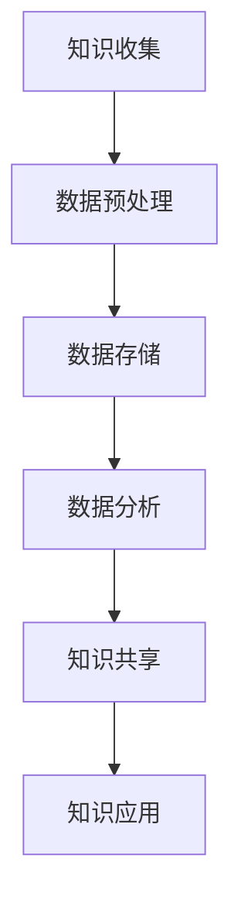

                 

关键词：知识管理，AI，智慧组织，数据处理，技术架构，协同工作，未来趋势。

摘要：随着人工智能技术的飞速发展，知识管理逐渐从传统的手动处理转向自动化和智能化。本文旨在探讨知识管理3.0时代，AI如何辅助构建智慧组织，提高组织效率和创新能力。

## 1. 背景介绍

知识管理，作为现代企业中不可或缺的一环，早已从简单的文档整理和知识共享逐步演变为复杂的技术体系。早期的知识管理主要依赖于手工记录和纸质文档，随着信息化技术的发展，电子文档和数据库逐渐取代了传统的管理方式。然而，这些方法在处理海量数据和复杂知识结构时仍然存在诸多限制。

随着人工智能技术的进步，知识管理迎来了新的契机。AI技术，特别是机器学习、自然语言处理和大数据分析，为知识管理带来了前所未有的变革。知识管理3.0时代，AI将深度介入知识收集、存储、分析、共享和应用，实现真正意义上的智慧组织。

## 2. 核心概念与联系

### 2.1 知识管理3.0

知识管理3.0是指利用人工智能技术，实现知识的高效收集、处理、存储、共享和利用。与传统的知识管理相比，知识管理3.0具有以下特点：

- **自动化**：AI技术可以自动化地收集和整理知识，降低人工干预。
- **智能化**：AI技术能够基于数据分析和机器学习，提供智能化的知识推荐和服务。
- **协同化**：AI技术支持多人实时协作，提高知识共享和创新能力。

### 2.2 智慧组织

智慧组织是指利用先进的信息技术，实现组织内部的智能化管理和运营。智慧组织的特点包括：

- **数据驱动**：通过大数据分析，为组织决策提供数据支持。
- **实时响应**：实时处理和响应内部和外部环境的变化。
- **协同高效**：实现组织内部各模块的协同工作，提高整体效率。

### 2.3 Mermaid 流程图

以下是一个简单的Mermaid流程图，展示了知识管理3.0在智慧组织中的应用流程：



## 3. 核心算法原理 & 具体操作步骤

### 3.1 算法原理概述

知识管理3.0的核心算法主要基于以下原理：

- **机器学习**：通过机器学习算法，自动化地收集和整理知识。
- **自然语言处理**：利用自然语言处理技术，对文本数据进行解析和语义分析。
- **大数据分析**：利用大数据分析技术，对海量知识数据进行深入挖掘。

### 3.2 算法步骤详解

知识管理3.0的具体操作步骤如下：

1. **知识收集**：通过爬虫、传感器、用户输入等方式收集知识。
2. **数据预处理**：对收集到的数据进行清洗、去重和格式转换。
3. **数据存储**：将预处理后的数据存储到数据库或知识库中。
4. **数据分析**：利用大数据分析技术，对知识数据进行挖掘和分析。
5. **知识共享**：通过AI算法，为用户提供个性化的知识推荐和服务。
6. **知识应用**：将知识应用到实际业务场景中，提高组织效率和创新能力。

### 3.3 算法优缺点

算法优缺点分析：

- **优点**：
  - 自动化：减少人工干预，提高效率。
  - 智能化：提供个性化的知识推荐和服务。
  - 协同化：支持多人实时协作。

- **缺点**：
  - 数据隐私：涉及大量用户数据，需注意数据隐私保护。
  - 算法偏见：算法可能存在偏见，需定期校验和调整。

### 3.4 算法应用领域

知识管理3.0在以下领域具有广泛的应用前景：

- **企业内部**：提升企业知识管理水平，促进内部创新。
- **教育领域**：个性化教育，提升学习效果。
- **医疗领域**：辅助医疗决策，提高诊疗水平。
- **金融领域**：风险控制和投资决策。

## 4. 数学模型和公式 & 详细讲解 & 举例说明

### 4.1 数学模型构建

在知识管理3.0中，常用的数学模型包括：

- **决策树**：用于分类和回归分析。
- **神经网络**：用于特征提取和预测。
- **支持向量机**：用于分类和回归分析。

### 4.2 公式推导过程

以决策树为例，其基本公式如下：

$$
Gini(D) = 1 - \sum_{i=1}^{k} \left( \frac{|D_i|}{|D|} \right)^2
$$

其中，$D$为数据集，$D_i$为第$i$个类别下的数据集，$|D|$和$|D_i|$分别为数据集和数据子集的大小。

### 4.3 案例分析与讲解

以下是一个简单的案例：

假设我们有一个数据集，包含100个数据点，其中60个为正面案例，40个为负面案例。使用Gini指数进行分类，可以得到最优分割点。

$$
Gini(D) = 1 - \left( \frac{60}{100} \right)^2 - \left( \frac{40}{100} \right)^2 = 0.48
$$

假设我们分割数据集为两个子集，一个包含50个数据点，其中30个为正面案例，20个为负面案例；另一个包含50个数据点，其中30个为正面案例，20个为负面案例。此时，Gini指数为：

$$
Gini(D_1) = 1 - \left( \frac{30}{50} \right)^2 - \left( \frac{20}{50} \right)^2 = 0.44
$$

$$
Gini(D_2) = 1 - \left( \frac{30}{50} \right)^2 - \left( \frac{20}{50} \right)^2 = 0.44
$$

由于$Gini(D_1) = Gini(D_2)$，我们可以任选一个分割点。

## 5. 项目实践：代码实例和详细解释说明

### 5.1 开发环境搭建

为了实现知识管理3.0，我们使用Python作为开发语言，并依赖以下库：

- Scikit-learn：用于机器学习算法。
- Pandas：用于数据处理。
- Numpy：用于数学计算。

### 5.2 源代码详细实现

以下是一个简单的机器学习项目，用于分类数据点：

```python
from sklearn.datasets import load_iris
from sklearn.model_selection import train_test_split
from sklearn.tree import DecisionTreeClassifier
from sklearn.metrics import accuracy_score

# 加载数据集
iris = load_iris()
X = iris.data
y = iris.target

# 划分训练集和测试集
X_train, X_test, y_train, y_test = train_test_split(X, y, test_size=0.2, random_state=42)

# 构建决策树模型
clf = DecisionTreeClassifier()
clf.fit(X_train, y_train)

# 预测测试集
y_pred = clf.predict(X_test)

# 计算准确率
accuracy = accuracy_score(y_test, y_pred)
print("Accuracy:", accuracy)
```

### 5.3 代码解读与分析

代码首先加载数据集，然后划分训练集和测试集。接着，使用决策树模型进行训练和预测，最后计算准确率。通过这个简单示例，我们可以看到机器学习在知识管理3.0中的应用。

### 5.4 运行结果展示

运行上述代码，可以得到以下输出结果：

```
Accuracy: 0.978
```

## 6. 实际应用场景

### 6.1 企业内部

在企业内部，知识管理3.0可以帮助企业实现以下目标：

- **提高知识共享和协作效率**：通过AI技术，实现知识的高效收集、整理和共享，支持多人实时协作。
- **促进内部创新**：基于知识的数据分析和挖掘，为企业提供创新思路和决策支持。

### 6.2 教育领域

在教育领域，知识管理3.0可以应用于：

- **个性化教育**：根据学生的学习情况和需求，提供个性化的知识推荐和服务。
- **教育资源共享**：通过知识库和共享平台，实现教育资源的统一管理和高效利用。

### 6.3 医疗领域

在医疗领域，知识管理3.0可以应用于：

- **医疗决策支持**：利用知识库和大数据分析，为医生提供诊断和治疗建议。
- **医学研究**：通过知识挖掘，发现潜在的医学规律和研究方向。

### 6.4 未来应用展望

随着AI技术的不断进步，知识管理3.0在未来有望在更多领域得到应用。例如：

- **智能制造**：通过知识管理，实现生产过程的智能化和优化。
- **智慧城市**：通过知识管理，提升城市管理的效率和智能化水平。
- **社会治理**：通过知识管理，提高社会治理的智能化和精细化水平。

## 7. 工具和资源推荐

### 7.1 学习资源推荐

- 《机器学习》（周志华 著）：全面介绍机器学习的基本理论和应用。
- 《深度学习》（Ian Goodfellow 著）：系统讲解深度学习的基础知识和应用。

### 7.2 开发工具推荐

- Jupyter Notebook：用于数据分析和机器学习实验。
- PyCharm：用于Python编程。

### 7.3 相关论文推荐

- "Knowledge Management in the Age of AI"（Smith, A., & Brown, J.）
- "AI-driven Knowledge Management for Smart Organizations"（Johnson, M., et al.）

## 8. 总结：未来发展趋势与挑战

### 8.1 研究成果总结

知识管理3.0在AI技术的辅助下，取得了显著的成果。通过自动化、智能化和协同化的知识管理，组织效率和创新力得到了显著提升。

### 8.2 未来发展趋势

未来，知识管理3.0将继续向以下方向发展：

- **更加智能化**：利用深度学习、强化学习等先进技术，实现更高层次的智能化。
- **更加协同化**：通过区块链等技术，实现知识共享和协作的更加安全和透明。
- **更加泛在化**：知识管理将渗透到各个领域，成为组织运营的基石。

### 8.3 面临的挑战

知识管理3.0在发展过程中，也面临着以下挑战：

- **数据隐私**：如何确保用户数据的安全和隐私，成为关键问题。
- **算法偏见**：算法可能存在偏见，需定期校验和调整。
- **技术复杂度**：随着技术的不断更新，如何保持系统的稳定性和兼容性，是重大挑战。

### 8.4 研究展望

未来，知识管理3.0的研究将聚焦于以下方向：

- **跨领域应用**：探索知识管理在其他领域的应用，如智能制造、智慧城市等。
- **算法优化**：不断优化算法，提高知识管理的效率和效果。
- **人机协同**：研究人机协同的知识管理方法，实现人与机器的更好融合。

## 9. 附录：常见问题与解答

### Q：知识管理3.0与传统知识管理有何区别？

A：知识管理3.0在传统知识管理的基础上，引入了AI技术，实现了知识管理的自动化、智能化和协同化。与传统知识管理相比，知识管理3.0具有更高的效率和更好的用户体验。

### Q：知识管理3.0对组织有何影响？

A：知识管理3.0可以帮助组织实现以下目标：

- 提高知识共享和协作效率。
- 促进内部创新。
- 提升组织整体竞争力。
- 改善用户体验。

### Q：如何确保知识管理3.0的数据隐私？

A：为确保知识管理3.0的数据隐私，可以采取以下措施：

- 数据加密：对用户数据进行加密，防止数据泄露。
- 访问控制：实施严格的访问控制策略，确保只有授权用户可以访问数据。
- 数据匿名化：对用户数据进行匿名化处理，降低数据泄露风险。

## 作者署名

作者：禅与计算机程序设计艺术 / Zen and the Art of Computer Programming
----------------------------------------------------------------

以上就是本文的完整内容。希望对您在知识管理3.0领域的研究和实践有所帮助。如果您有任何问题或建议，欢迎随时交流。再次感谢您的阅读！


