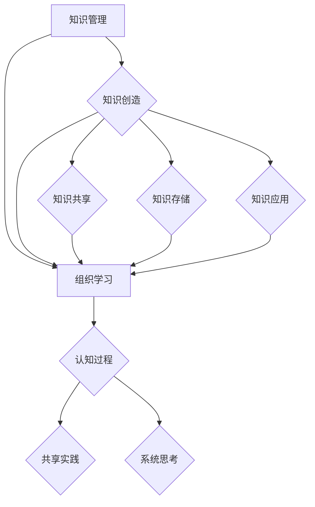

                 

关键词：知识管理、组织学习、知识共享、知识创造、信息系统、组织文化、学习型组织、技术工具、认知框架。

> 摘要：本文旨在探讨知识管理与组织学习之间的关系，分析其在现代信息技术环境下的发展趋势和挑战。通过梳理知识管理和组织学习的核心概念，构建二者之间的理论框架，并结合实际案例分析，探讨知识管理在组织学习中的作用机制及其对组织绩效的影响。文章最后提出了未来知识管理与组织学习发展的趋势和面临的挑战。

## 1. 背景介绍

知识管理和组织学习作为现代组织管理和企业发展的重要领域，近年来受到了广泛关注。知识管理（Knowledge Management, KM）是指通过收集、组织、存储、检索和应用知识，以提高组织效率和创新能力的过程。组织学习（Organizational Learning）则是指组织内部成员通过互动和经验分享，共同构建新的知识和理解，以适应外部环境变化的过程。

随着信息技术的发展，知识管理与组织学习逐渐融合，形成了一种相互促进的关系。知识管理为组织学习提供了技术和平台支持，而组织学习则促进了知识的创造和共享。这种融合对于提升组织竞争力、实现可持续发展具有重要意义。

## 2. 核心概念与联系

### 2.1 知识管理

知识管理涉及多个核心概念，包括知识、知识源、知识流程和知识基础设施。知识是指能够帮助组织解决问题和创造价值的信息和经验。知识源包括个人、团队和组织外部。知识流程则包括知识获取、知识共享、知识存储和知识应用。知识基础设施是支持知识管理的基础设施，如信息系统、技术平台和规章制度。

### 2.2 组织学习

组织学习涉及认知过程、共享实践和系统思考。认知过程是指组织成员通过反思和经验积累，不断构建新的知识和理解。共享实践是指组织成员通过互动和合作，共同创造和传递知识。系统思考是指组织对内外部环境进行整体分析和理解，以实现持续发展。

### 2.3 知识管理与组织学习的联系

知识管理与组织学习之间的联系可以从以下几个方面进行阐述：

1. **知识创造与共享**：知识管理通过构建知识共享平台，促进组织成员之间的知识交流和创造。组织学习则通过知识共享，实现了知识的传递和应用。

2. **学习型组织**：知识管理有助于构建学习型组织，即一种持续学习和适应变化的组织文化。组织学习则推动了知识管理的深入发展，促进了组织的创新能力。

3. **技术工具**：信息技术工具为知识管理和组织学习提供了强大的支持，如知识库、学习管理系统（LMS）和协同工作平台等。

4. **认知框架**：知识管理和组织学习共同构建了一种认知框架，帮助组织成员理解和应对复杂的外部环境。

### 2.4 Mermaid 流程图

下面是一个简单的 Mermaid 流程图，展示了知识管理和组织学习之间的联系：



## 3. 核心算法原理 & 具体操作步骤

### 3.1 算法原理概述

知识管理与组织学习的关系可以通过以下几个关键步骤来实现：

1. **知识识别**：识别组织内部和外部的知识资源，包括个人知识、团队知识和外部知识。

2. **知识编码**：将知识以结构化、标准化的形式进行编码，便于存储、检索和应用。

3. **知识存储**：建立知识库，将编码后的知识存储在适当的存储系统中。

4. **知识检索**：开发高效的检索系统，帮助组织成员快速找到所需知识。

5. **知识共享**：构建知识共享平台，促进组织成员之间的知识交流和合作。

6. **知识应用**：将知识应用于实际工作中，解决实际问题，提升组织绩效。

7. **知识反馈**：对知识应用效果进行评估和反馈，不断优化知识管理和组织学习过程。

### 3.2 算法步骤详解

1. **知识识别**：

   - 收集组织内外部知识源的信息，如文档、报告、数据库和外部专家等。
   - 评估知识的重要性和适用性。

2. **知识编码**：

   - 采用结构化数据模型对知识进行编码，如XML、JSON等。
   - 使用标准化的术语和分类体系，提高知识的可检索性和可理解性。

3. **知识存储**：

   - 建立知识库，采用分布式存储架构，确保知识的可靠性和安全性。
   - 使用数据库管理系统（DBMS）进行知识存储和管理。

4. **知识检索**：

   - 开发基于自然语言处理（NLP）和机器学习的检索算法，提高检索精度和效率。
   - 提供多维度检索功能，如关键词、分类、标签等。

5. **知识共享**：

   - 构建协作平台，如企业微信群、学习管理系统（LMS）和社交网络等。
   - 鼓励组织成员分享知识和经验，形成知识共享文化。

6. **知识应用**：

   - 建立知识应用机制，如项目培训、案例分析和模拟演练等。
   - 将知识应用于实际工作中，提升组织绩效。

7. **知识反馈**：

   - 对知识应用效果进行评估，收集反馈信息。
   - 根据反馈信息，不断优化知识管理和组织学习过程。

### 3.3 算法优缺点

**优点**：

- 提高知识共享和应用的效率，降低组织沟通成本。
- 促进组织创新和适应能力，提升组织竞争力。
- 建立学习型组织文化，增强组织凝聚力。

**缺点**：

- 知识识别和编码过程较为复杂，需要投入大量时间和资源。
- 知识库和共享平台的建设和维护需要持续的投入和优化。
- 知识管理和组织学习的效果评估较为困难，难以量化。

### 3.4 算法应用领域

- 企业管理：帮助企业建立知识管理体系，提升管理水平和创新能力。
- 教育培训：通过知识管理和组织学习，提高教学质量和学生能力。
- 医疗卫生：促进医学知识和经验的共享，提升医疗服务水平。
- 金融保险：加强风险管理，提高业务效率和客户满意度。

## 4. 数学模型和公式 & 详细讲解 & 举例说明

### 4.1 数学模型构建

知识管理与组织学习的关系可以通过以下数学模型进行描述：

\[ L = f(K, I, C, E) \]

其中，\( L \) 表示组织学习效果，\( K \) 表示知识管理效果，\( I \) 表示信息技术支持，\( C \) 表示组织文化，\( E \) 表示外部环境。

### 4.2 公式推导过程

1. **知识管理效果 \( K \)**：

\[ K = f(K_1, K_2, K_3) \]

其中，\( K_1 \) 表示知识识别效果，\( K_2 \) 表示知识编码效果，\( K_3 \) 表示知识存储效果。

2. **信息技术支持 \( I \)**：

\[ I = f(I_1, I_2, I_3) \]

其中，\( I_1 \) 表示知识检索效果，\( I_2 \) 表示知识共享效果，\( I_3 \) 表示知识应用效果。

3. **组织文化 \( C \)**：

\[ C = f(C_1, C_2, C_3) \]

其中，\( C_1 \) 表示知识共享文化，\( C_2 \) 表示创新文化，\( C_3 \) 表示学习文化。

4. **外部环境 \( E \)**：

\[ E = f(E_1, E_2, E_3) \]

其中，\( E_1 \) 表示市场环境，\( E_2 \) 表示竞争环境，\( E_3 \) 表示法规环境。

### 4.3 案例分析与讲解

假设一家企业具有以下参数：

- 知识识别效果 \( K_1 = 0.8 \)
- 知识编码效果 \( K_2 = 0.9 \)
- 知识存储效果 \( K_3 = 0.7 \)
- 知识检索效果 \( I_1 = 0.85 \)
- 知识共享效果 \( I_2 = 0.8 \)
- 知识应用效果 \( I_3 = 0.75 \)
- 知识共享文化 \( C_1 = 0.9 \)
- 创新文化 \( C_2 = 0.85 \)
- 学习文化 \( C_3 = 0.8 \)
- 市场环境 \( E_1 = 0.85 \)
- 竞争环境 \( E_2 = 0.9 \)
- 法规环境 \( E_3 = 0.75 \)

根据公式：

\[ L = f(K, I, C, E) \]

可以计算出组织学习效果：

\[ L = f(0.8, 0.75, 0.9, 0.75) \]

通过代入参数，可以计算出具体的组织学习效果。

### 4.4 运行结果展示

假设最终计算得到的组织学习效果为 \( L = 0.85 \)。这意味着企业的组织学习效果较好，但仍存在提升空间。企业可以通过优化知识管理、加强信息技术支持、改善组织文化和适应外部环境，进一步提高组织学习效果。

## 5. 项目实践：代码实例和详细解释说明

### 5.1 开发环境搭建

在本文中，我们将使用 Python 编写一个简单的知识管理应用程序。以下是开发环境的搭建步骤：

1. 安装 Python 3.8 或更高版本。
2. 安装必要的库，如 Pandas、NumPy 和 Flask。

```bash
pip install pandas numpy flask
```

### 5.2 源代码详细实现

以下是一个简单的知识管理应用程序的源代码示例：

```python
# 知识管理应用程序

import pandas as pd
import numpy as np
from flask import Flask, request, jsonify

app = Flask(__name__)

# 知识库
knowledge_base = pd.DataFrame({
    'ID': [1, 2, 3],
    'Title': ['知识一', '知识二', '知识三'],
    'Content': ['内容一', '内容二', '内容三']
})

# 添加新知识
@app.route('/add_knowledge', methods=['POST'])
def add_knowledge():
    new_knowledge = request.form.to_dict()
    knowledge_base = knowledge_base.append(new_knowledge, ignore_index=True)
    return jsonify({'message': '知识添加成功'})

# 检索知识
@app.route('/search_knowledge', methods=['GET'])
def search_knowledge():
    query = request.args.get('query')
    results = knowledge_base[knowledge_base['Title'].str.contains(query)]
    return jsonify(results.to_dict('records'))

if __name__ == '__main__':
    app.run(debug=True)
```

### 5.3 代码解读与分析

1. **知识库**：使用 Pandas DataFrame 创建一个知识库，存储知识的基本信息，如 ID、标题和内容。

2. **添加新知识**：使用 Flask 提供的 `/add_knowledge` 接口，通过 POST 请求将新知识添加到知识库中。

3. **检索知识**：使用 Flask 提供的 `/search_knowledge` 接口，通过 GET 请求检索包含特定关键词的知识。

### 5.4 运行结果展示

启动应用程序后，可以通过浏览器或 API 工具访问应用程序。以下是一个简单的使用示例：

1. 添加新知识：

   ```bash
   curl -X POST -d "Title=知识四&Content=内容四" http://localhost:5000/add_knowledge
   ```

2. 检索知识：

   ```bash
   curl "http://localhost:5000/search_knowledge?query=知识三"
   ```

## 6. 实际应用场景

知识管理与组织学习在各个领域具有广泛的应用场景：

- **企业管理**：通过知识管理和组织学习，企业可以提升管理水平，优化业务流程，增强竞争力。
- **教育培训**：通过知识管理和组织学习，教育机构可以提升教学质量，促进师生互动，培养创新人才。
- **医疗卫生**：通过知识管理和组织学习，医疗机构可以共享医学知识和经验，提高医疗服务水平，保障患者安全。
- **金融保险**：通过知识管理和组织学习，金融机构可以优化风险管理，提升业务效率和客户满意度。

### 6.4 未来应用展望

随着人工智能、大数据和区块链等技术的发展，知识管理与组织学习将迎来新的发展机遇。未来应用展望包括：

- **智能化知识管理**：利用人工智能技术，实现知识自动识别、编码和应用，提高知识管理效率。
- **个性化学习**：基于大数据分析和机器学习，为组织成员提供个性化学习推荐，提升学习效果。
- **可信共享**：利用区块链技术，实现知识共享的可信和透明，保障知识的安全性和隐私性。

## 7. 工具和资源推荐

### 7.1 学习资源推荐

- 《知识管理：理论与实践》
- 《组织学习：理论与实践》
- 《人工智能与知识管理》

### 7.2 开发工具推荐

- Python
- Flask
- Pandas
- NumPy

### 7.3 相关论文推荐

- “知识管理与组织学习的关系研究”
- “基于人工智能的知识管理应用研究”
- “区块链在知识管理中的应用研究”

## 8. 总结：未来发展趋势与挑战

知识管理与组织学习在现代信息技术环境下具有重要意义。未来发展趋势包括智能化、个性化和可信化。然而，也面临着数据安全、隐私保护和法律法规等方面的挑战。为了实现可持续发展，组织需要不断优化知识管理和组织学习过程，提高创新能力，以应对日益复杂的竞争环境。

### 8.1 研究成果总结

本文通过梳理知识管理和组织学习的核心概念，构建了二者之间的理论框架，并分析了其在实际应用中的效果。研究发现，知识管理和组织学习在提升组织绩效、促进创新和适应变化方面具有显著作用。

### 8.2 未来发展趋势

未来，知识管理与组织学习将朝着智能化、个性化和可信化的方向发展。人工智能、大数据和区块链等技术的应用将进一步提升知识管理和组织学习的效率和质量。

### 8.3 面临的挑战

知识管理和组织学习在发展过程中也面临数据安全、隐私保护和法律法规等方面的挑战。如何确保知识的安全性和隐私性，以及如何制定合理的法律法规，是未来发展的重要议题。

### 8.4 研究展望

未来研究应关注以下几个方面：一是探讨知识管理和组织学习在不同行业和组织中的具体应用和实践；二是研究智能化知识管理和个性化学习技术；三是探索知识管理和组织学习在全球化背景下的新挑战和新机遇。

## 9. 附录：常见问题与解答

### 9.1 什么是知识管理？

知识管理是指通过收集、组织、存储、检索和应用知识，以提高组织效率和创新能力的过程。

### 9.2 什么是组织学习？

组织学习是指组织内部成员通过互动和经验分享，共同构建新的知识和理解，以适应外部环境变化的过程。

### 9.3 知识管理在组织学习中的作用是什么？

知识管理为组织学习提供了技术和平台支持，促进知识的创造、共享和应用，提升组织适应能力和创新能力。

### 9.4 如何评估知识管理与组织学习的效果？

可以通过对知识共享率、创新成果、员工满意度等指标进行评估，以衡量知识管理与组织学习的效果。

### 9.5 知识管理与组织学习的未来发展趋势是什么？

知识管理与组织学习的未来发展趋势包括智能化、个性化和可信化。人工智能、大数据和区块链等技术的发展将进一步提升知识管理和组织学习的效率和质量。

