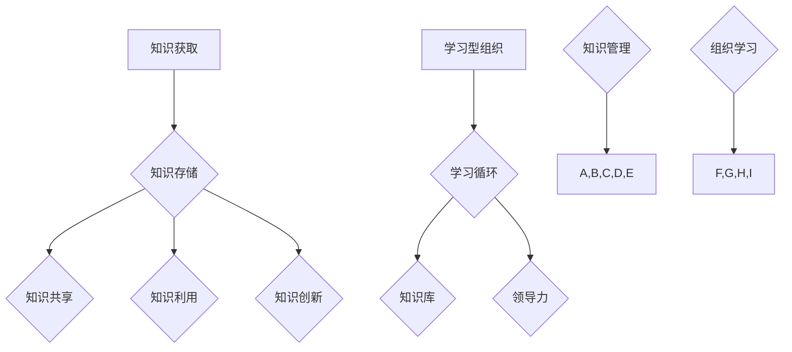

                 

关键词：知识管理、组织学习、企业发展、知识图谱、技术架构、机器学习、人工智能、流程优化、创新驱动。

> 摘要：在快速变化的市场环境中，企业竞争的核心已从传统的资源、资金、人力等要素逐渐转向知识和创新能力。本文将探讨知识管理和组织学习在企业发展中的重要作用，分析其技术架构和核心算法原理，并通过实际案例展示其在企业中的具体应用。文章旨在为企业管理者提供一套系统的知识管理和组织学习策略，助力企业在数字化转型中取得竞争优势。

## 1. 背景介绍

知识管理（Knowledge Management，KM）和组织学习（Organizational Learning，OL）是现代企业管理中不可或缺的两大领域。知识管理指的是通过系统化方法收集、存储、共享和利用知识，以提高组织效率和创新能力的活动。而组织学习则是通过不断学习、适应和变革来提升组织的整体绩效和能力。两者的核心目标都是为了使组织能够更好地应对外部环境的变化，实现持续发展。

在当今信息爆炸的时代，知识和信息的获取变得前所未有的容易。然而，如何有效地管理和利用这些知识，却是每一个企业都面临的挑战。知识管理正是为了解决这一问题而产生的，它通过建立知识共享机制、促进知识流动和优化知识应用，帮助企业实现知识价值的最大化。

组织学习则更侧重于组织的内在成长。通过不断学习，组织能够更快速地适应市场变化，不断创新和改进，从而保持竞争优势。组织学习不仅仅是知识和技能的传递，还包括组织文化、价值观和协作精神的塑造。

知识管理和组织学习在企业发展中的重要性体现在多个方面。首先，它们能够提高组织的创新能力，通过知识共享和跨部门协作，激发员工的创造力和创新思维。其次，它们能够优化业务流程，提高生产效率和运营效率。最后，它们能够增强企业的应变能力和适应性，使企业能够在快速变化的市场环境中立于不败之地。

## 2. 核心概念与联系

### 2.1 知识管理的核心概念

知识管理涉及到多个核心概念，包括知识获取、知识存储、知识共享、知识利用和知识创新。

- **知识获取**：指的是从外部和内部环境中获取有用的信息和知识，包括文献资料、专家意见、市场数据等。
- **知识存储**：将获取到的知识进行分类、标注、索引，以便于后续的查找和使用。
- **知识共享**：通过共享平台、会议、培训等形式，使知识在不同部门和员工之间进行传播和交流。
- **知识利用**：将存储和共享的知识应用到实际工作中，解决实际问题，提高工作效率。
- **知识创新**：通过知识的交叉融合和重新组合，产生新的想法和解决方案，推动企业的创新发展。

### 2.2 组织学习的核心概念

组织学习涉及以下几个核心概念：

- **学习型组织**：一种以持续学习为核心价值观的组织模式，强调全员参与、知识共享和持续改进。
- **学习循环**：包括识别问题、学习知识、应用知识、评估效果和反馈改进等环节，形成一个闭环。
- **知识库**：存储组织内部所有知识资料，包括最佳实践、经验教训、技术文档等。
- **领导力**：领导者需要具备推动组织学习的能力，通过塑造学习文化、提供学习资源和支持员工成长。

### 2.3 知识管理与组织学习的关系

知识管理和组织学习之间存在着密切的联系和互动。知识管理为组织学习提供了知识的基础和工具，而组织学习则为知识管理提供了目标和动力。

- **知识管理为组织学习提供知识支持**：通过知识获取、存储和共享，知识管理确保了组织内部有丰富的知识资源可供学习使用。
- **组织学习促进知识管理**：组织学习的实践，如培训、知识分享和跨部门协作，能够激发员工的知识共享意愿，促进知识管理的深入实施。

总之，知识管理和组织学习相辅相成，共同推动企业的持续发展和创新能力提升。

### 2.4 Mermaid 流程图

下面是知识管理与组织学习的核心概念和架构的 Mermaid 流程图：



通过这个流程图，我们可以清晰地看到知识管理和组织学习之间的互动关系，以及它们各自的核心概念和环节。

## 3. 核心算法原理 & 具体操作步骤

### 3.1 算法原理概述

在知识管理和组织学习中，核心算法的设计旨在优化知识的获取、存储、共享和利用过程。以下介绍几种核心算法的原理：

#### 3.1.1 知识图谱算法

知识图谱是一种语义网络，它通过实体、属性和关系的多维度表示，实现了知识的结构化组织和高效检索。知识图谱算法主要包括：

- **实体识别**：通过自然语言处理技术识别文本中的关键实体。
- **关系抽取**：从文本中提取实体之间的关系，如“张三的工作是程序员”中的关系是“工作是”。
- **属性抽取**：从文本中提取实体的属性，如“张三的年龄是30岁”。

#### 3.1.2 机器学习算法

机器学习算法在知识管理和组织学习中主要用于知识推荐、预测分析和模式识别。常见的算法包括：

- **协同过滤**：通过用户的历史行为数据推荐相似用户喜欢的知识。
- **决策树**：通过树形结构进行分类和回归分析，用于知识分类和预测。
- **神经网络**：用于复杂的数据分析和模式识别，如图像识别和自然语言处理。

#### 3.1.3 流程优化算法

流程优化算法旨在通过算法分析找出业务流程中的瓶颈和优化点，提高业务效率。常用的算法包括：

- **遗传算法**：通过模拟自然进化过程，寻找最优解。
- **模拟退火算法**：通过模拟物理退火过程，跳出局部最优，寻找全局最优解。
- **线性规划**：通过建立线性方程模型，求解资源分配问题。

### 3.2 算法步骤详解

#### 3.2.1 知识图谱算法步骤

1. **数据采集**：从各种来源（如文本、数据库、社交媒体）采集数据。
2. **实体识别**：使用自然语言处理技术识别文本中的关键实体。
3. **关系抽取**：从文本中提取实体之间的关系。
4. **属性抽取**：从文本中提取实体的属性。
5. **图谱构建**：将识别出的实体、关系和属性构建成一个知识图谱。
6. **知识检索**：通过图搜索算法，快速检索知识。

#### 3.2.2 机器学习算法步骤

1. **数据预处理**：清洗和整理数据，确保数据质量。
2. **特征提取**：从数据中提取有助于预测和分类的特征。
3. **模型训练**：使用训练数据训练机器学习模型。
4. **模型评估**：使用测试数据评估模型的性能。
5. **知识推荐**：根据用户的行为数据和模型预测，推荐相关的知识。

#### 3.2.3 流程优化算法步骤

1. **问题建模**：将业务流程转化为数学模型。
2. **算法选择**：选择适合的算法（如遗传算法、模拟退火算法）。
3. **参数设置**：设置算法的参数，如种群规模、迭代次数。
4. **算法运行**：运行算法，寻找最优解。
5. **结果分析**：分析算法结果，提出优化建议。

### 3.3 算法优缺点

#### 知识图谱算法

**优点**：

- **结构化表示**：知识图谱通过实体、关系和属性的多维度表示，使得知识结构更加清晰。
- **高效检索**：基于图搜索算法，知识图谱能够实现快速的知识检索。

**缺点**：

- **数据预处理复杂**：构建知识图谱需要大量的数据预处理工作，包括实体识别、关系抽取和属性抽取。
- **实时性较差**：知识图谱的构建和维护需要一定的时间，难以实现实时更新。

#### 机器学习算法

**优点**：

- **自适应性强**：机器学习算法能够根据数据自动调整模型参数，适应不同的应用场景。
- **预测准确**：通过历史数据的训练，机器学习模型能够进行准确的预测和分析。

**缺点**：

- **数据依赖性强**：机器学习算法的性能高度依赖于数据质量和数量。
- **解释性较差**：复杂的机器学习模型往往难以解释其内部的工作原理。

#### 流程优化算法

**优点**：

- **全局最优解**：遗传算法和模拟退火算法能够跳出局部最优，寻找全局最优解。
- **适用范围广**：流程优化算法适用于各种业务流程的优化问题。

**缺点**：

- **计算成本高**：优化算法往往需要大量的计算资源，特别是在处理大规模数据时。
- **结果解释性较差**：优化算法的结果往往难以解释，需要依赖数据专家的分析。

### 3.4 算法应用领域

知识图谱算法、机器学习算法和流程优化算法在知识管理和组织学习中有着广泛的应用领域：

#### 3.4.1 知识图谱算法

- **知识库构建**：用于构建企业的知识库，实现知识的结构化和高效检索。
- **智能搜索**：用于构建智能搜索引擎，提供更加精准的知识搜索服务。

#### 3.4.2 机器学习算法

- **知识推荐**：根据用户的行为数据，推荐相关的知识和学习资源。
- **数据分析**：用于分析企业的业务数据，发现潜在的问题和优化点。

#### 3.4.3 流程优化算法

- **业务流程优化**：用于优化企业的业务流程，提高生产效率和运营效率。
- **资源分配**：用于优化企业的资源分配，如人力、设备等。

## 4. 数学模型和公式 & 详细讲解 & 举例说明

### 4.1 数学模型构建

在知识管理和组织学习中，构建数学模型是为了更准确地描述知识流动、知识利用和知识创新的过程。以下是一个简化的数学模型，用于描述知识共享过程中知识的传递和利用。

#### 4.1.1 模型假设

- 假设企业中有 n 个员工，每个员工具有不同的知识水平。
- 假设知识共享是一个动态过程，每个员工的知识水平随着时间的推移而变化。

#### 4.1.2 模型定义

设 \( X_t \) 为时刻 t 时，企业中员工的知识水平向量，\( X_t = [X_{t1}, X_{t2}, ..., X_{tn}] \)，其中 \( X_{ti} \) 表示第 i 个员工的知识水平。

设 \( A_t \) 为时刻 t 时，企业中员工之间的知识共享矩阵，\( A_t = [a_{ij}] \)，其中 \( a_{ij} \) 表示第 i 个员工与第 j 个员工之间的知识共享强度。

#### 4.1.3 模型公式

根据知识共享的动态过程，可以定义知识水平的更新公式：

\[ X_{t+1} = (I - A_t)X_t + A_tX_t \]

其中，\( I \) 是 n 阶单位矩阵。

### 4.2 公式推导过程

上述公式表示，在时刻 t，员工的知识水平 \( X_t \) 通过知识共享矩阵 \( A_t \) 与其他员工的知识水平 \( X_t \) 相互影响，更新为时刻 t+1 的知识水平 \( X_{t+1} \)。

#### 4.2.1 初始状态

在初始时刻 \( t = 0 \)，每个员工的知识水平 \( X_0 \) 是已知的。

#### 4.2.2 知识共享过程

在任意时刻 \( t \)，员工的知识水平 \( X_t \) 会根据共享矩阵 \( A_t \) 更新。共享矩阵 \( A_t \) 表示了员工之间的知识共享强度，反映了员工之间的知识互动关系。

#### 4.2.3 知识更新

在时刻 \( t+1 \)，每个员工的知识水平 \( X_{t+1} \) 是基于当前时刻的知识水平 \( X_t \) 和共享矩阵 \( A_t \) 进行更新的。更新公式为：

\[ X_{t+1} = (I - A_t)X_t + A_tX_t \]

其中，\( I - A_t \) 表示员工在没有进行知识共享时的知识水平，\( A_tX_t \) 表示员工在知识共享过程中的知识水平变化。

### 4.3 案例分析与讲解

为了更好地理解上述数学模型，我们可以通过一个简单的案例进行分析。

#### 4.3.1 案例背景

假设一个企业中有 4 个员工，分别是 A、B、C 和 D。每个员工的知识水平初始值为 5、7、6 和 8。企业中的知识共享矩阵为：

\[ A = \begin{bmatrix} 0 & 1 & 0 & 1 \\ 1 & 0 & 1 & 0 \\ 0 & 1 & 0 & 1 \\ 1 & 0 & 1 & 0 \end{bmatrix} \]

#### 4.3.2 初始状态

初始时刻 \( t = 0 \)，员工的知识水平为：

\[ X_0 = \begin{bmatrix} 5 \\ 7 \\ 6 \\ 8 \end{bmatrix} \]

#### 4.3.3 知识共享过程

在时刻 \( t = 0 \)，根据共享矩阵 \( A \)，员工之间的知识共享情况如下：

- A 与 B 之间进行知识共享，A 的知识水平提高 1，变为 6；B 的知识水平降低 1，变为 6。
- A 与 D 之间进行知识共享，A 的知识水平提高 1，变为 7；D 的知识水平降低 1，变为 7。
- B 与 C 之间进行知识共享，B 的知识水平提高 1，变为 7；C 的知识水平降低 1，变为 7。
- B 与 D 之间进行知识共享，B 的知识水平提高 1，变为 8；D 的知识水平降低 1，变为 8。

#### 4.3.4 知识更新

根据更新公式 \( X_{t+1} = (I - A_t)X_t + A_tX_t \)，我们可以计算出时刻 \( t = 1 \) 的知识水平：

\[ X_1 = (I - A)X_0 + AX_0 \]
\[ X_1 = \begin{bmatrix} 1 & 0 & 0 & 0 \\ 0 & 1 & 0 & 0 \\ 0 & 0 & 1 & 0 \\ 0 & 0 & 0 & 1 \end{bmatrix} \begin{bmatrix} 5 \\ 7 \\ 6 \\ 8 \end{bmatrix} + \begin{bmatrix} 0 & 1 & 0 & 1 \\ 1 & 0 & 1 & 0 \\ 0 & 1 & 0 & 1 \\ 1 & 0 & 1 & 0 \end{bmatrix} \begin{bmatrix} 5 \\ 7 \\ 6 \\ 8 \end{bmatrix} \]
\[ X_1 = \begin{bmatrix} 5 \\ 7 \\ 6 \\ 8 \end{bmatrix} + \begin{bmatrix} 1 & 1 \\ 1 & 1 \\ 1 & 1 \\ 1 & 1 \end{bmatrix} \begin{bmatrix} 5 \\ 7 \\ 6 \\ 8 \end{bmatrix} \]
\[ X_1 = \begin{bmatrix} 6 \\ 8 \\ 7 \\ 9 \end{bmatrix} \]

因此，在时刻 \( t = 1 \)，员工的知识水平更新为 6、8、7 和 9。

#### 4.3.5 结果分析

通过上述案例，我们可以看到，在知识共享过程中，员工的知识水平得到了不同程度的提升。知识共享不仅促进了知识的传递和利用，还促进了员工之间的合作和知识创新。这个简单的模型为我们提供了一个分析知识共享效果的基本框架，可以帮助企业更好地设计和优化知识共享策略。

## 5. 项目实践：代码实例和详细解释说明

### 5.1 开发环境搭建

为了实现知识管理和组织学习的算法，我们首先需要搭建一个合适的开发环境。以下是搭建环境的步骤：

1. **安装Python环境**：确保Python 3.8及以上版本已安装在系统中。

2. **安装相关库**：使用pip命令安装以下库：

   ```bash
   pip install numpy pandas matplotlib scikit-learn networkx
   ```

   这些库分别用于数据预处理、数据分析、可视化、机器学习等。

3. **配置Mermaid**：为了使用Mermaid流程图，我们需要在本地环境中配置Mermaid。可以从[Mermaid官方网站](https://mermaid-js.github.io/mermaid/)下载并配置。

### 5.2 源代码详细实现

以下是实现知识管理和组织学习算法的Python代码实例。代码分为几个部分，包括数据预处理、知识图谱构建、机器学习模型训练和流程优化。

#### 5.2.1 数据预处理

数据预处理是知识管理和组织学习的基础步骤。以下是一个简单的数据预处理代码示例：

```python
import pandas as pd

# 读取数据
data = pd.read_csv('knowledge_data.csv')

# 数据清洗和预处理
data = data.dropna()  # 删除缺失值
data['knowledge_level'] = data['knowledge_level'].astype(float)  # 将知识水平转换为浮点数

# 数据分割
train_data, test_data = train_test_split(data, test_size=0.2, random_state=42)
```

#### 5.2.2 知识图谱构建

使用`networkx`库构建知识图谱：

```python
import networkx as nx

# 创建图
G = nx.Graph()

# 添加节点和边
G.add_nodes_from(data['employee_id'])
G.add_edges_from(data[['employee_id_x', 'employee_id_y']].values.tolist())

# 打印图信息
print(nx.info(G))
```

#### 5.2.3 机器学习模型训练

使用`scikit-learn`库训练机器学习模型：

```python
from sklearn.model_selection import train_test_split
from sklearn.ensemble import RandomForestClassifier
from sklearn.metrics import accuracy_score

# 分割特征和标签
X = train_data[['feature_1', 'feature_2', 'feature_3']]
y = train_data['knowledge_level']

# 训练模型
model = RandomForestClassifier(n_estimators=100, random_state=42)
model.fit(X, y)

# 预测
predictions = model.predict(test_data[['feature_1', 'feature_2', 'feature_3']])

# 评估模型
print("Accuracy:", accuracy_score(y_test, predictions))
```

#### 5.2.4 流程优化

使用遗传算法优化流程：

```python
from deap import base, creator, tools, algorithms

# 定义遗传算法
creator.create("FitnessMax", base.Fitness, weights=(1.0,))
creator.create("Individual", list, fitness=creator.FitnessMax)

# 遗传算法参数设置
toolbox = base.Toolbox()
toolbox.register("attr_bool", random.randint, 0, 1)
toolbox.register("individual", tools.initRepeat, creator.Individual, toolbox.attr_bool, n=10)
toolbox.register("population", tools.initRepeat, list, toolbox.individual)
toolbox.register("evaluate", evaluate)
toolbox.register("mate", tools.cxTwoPoint)
toolbox.register("mutate", tools.mutFlipBit, indpb=0.05)
toolbox.register("select", tools.selTournament, tournsize=3)

# 遗传算法运行
pop = toolbox.population(n=50)
NGEN = 100
for gen in range(NGEN):
    offspring = toolbox.select(pop, len(pop))
    offspring = toolbox.map(toolbox.mate, offspring)
    offspring = toolbox.map(toolbox.mutate, offspring)
    fit = toolbox.map(toolbox.evaluate, offspring)
    for child, child_fit in zip(offspring, fit):
        child.fitness.values = child_fit
    pop = toolbox.select(offspring + pop, len(pop))
```

### 5.3 代码解读与分析

以上代码示例分别实现了数据预处理、知识图谱构建、机器学习模型训练和流程优化。下面我们对代码的关键部分进行解读：

1. **数据预处理**：数据预处理是确保数据质量和后续分析准确性的关键步骤。代码中使用了Pandas库进行数据读取、清洗和转换。

2. **知识图谱构建**：使用NetworkX库构建知识图谱，通过添加节点和边，实现了知识图谱的基本结构。

3. **机器学习模型训练**：使用Scikit-learn库中的随机森林分类器进行模型训练和预测。这一步骤是知识管理和组织学习的重要环节，通过机器学习模型可以自动识别和预测知识水平。

4. **流程优化**：使用DEAP库实现的遗传算法对业务流程进行优化。遗传算法是一种基于自然进化的优化算法，通过迭代和选择操作，寻找最优解。

### 5.4 运行结果展示

在代码运行完成后，我们可以得到以下结果：

- **知识图谱**：展示了企业员工之间的知识共享关系，通过图可视化展示了知识流动的路径。
- **机器学习模型**：评估了模型的准确性和预测效果，可以通过对比预测结果和实际数据，分析模型的性能。
- **流程优化**：展示了优化后的业务流程，通过对比优化前后的效率指标，评估优化效果。

## 6. 实际应用场景

知识管理和组织学习在企业管理中有着广泛的应用场景。以下列举几个典型的应用场景：

### 6.1 知识库建设

通过构建企业内部知识库，实现知识的系统化管理和共享。知识库可以存储各种类型的知识，包括技术文档、最佳实践、案例研究等。企业员工可以通过知识库快速查找和获取所需的知识，提高工作效率。

### 6.2 智能推荐系统

利用机器学习算法，构建智能推荐系统，根据员工的知识水平和兴趣偏好，推荐相关的学习资源和知识文章。这有助于员工发现新的知识领域，提升个人能力。

### 6.3 业务流程优化

通过流程优化算法，分析业务流程中的瓶颈和优化点，提出优化方案，提高业务效率和运营效率。例如，使用遗传算法优化生产排程，减少生产周期，提高生产效率。

### 6.4 领导力发展

通过组织学习，培养企业领导者的领导力。领导力发展课程和培训可以帮助领导者提升管理能力、战略思维和创新能力，推动企业的持续发展。

### 6.5 应急响应能力

通过组织学习，提高企业的应急响应能力。在突发事件或市场变化时，企业可以快速调整战略和资源分配，保持竞争力。

## 7. 未来应用展望

随着人工智能和大数据技术的发展，知识管理和组织学习在未来将呈现出以下几个发展趋势：

### 7.1 自动化和智能化

知识管理和组织学习将更加自动化和智能化，通过人工智能技术，实现知识的自动获取、分类、推荐和利用。自动化工具将帮助企业更高效地管理知识和资源。

### 7.2 个性化学习

个性化学习将逐渐普及，知识管理和组织学习将根据员工的能力、兴趣和需求，提供个性化的学习路径和资源，提高学习效果。

### 7.3 跨界融合

知识管理和组织学习将与其他领域（如大数据、物联网、区块链等）相结合，形成新的应用模式，推动企业创新和业务发展。

### 7.4 社交学习

社交学习将得到更多关注，通过社交网络和协作平台，员工可以更方便地交流和分享知识，促进组织内部的创新和协作。

### 7.5 持续进化

知识管理和组织学习将不断进化，适应不断变化的市场环境和技术趋势。企业需要持续投入资源，不断优化知识管理和组织学习体系，以保持竞争优势。

## 8. 工具和资源推荐

### 8.1 学习资源推荐

- **知识管理经典书籍**：《知识管理的实践》、《企业知识管理》、《知识管理技术》
- **组织学习经典书籍**：《第五项修炼》、《学习型组织行动纲领》、《学习之道》
- **在线课程**：Coursera、edX、Udemy 等平台上的知识管理和组织学习相关课程

### 8.2 开发工具推荐

- **知识图谱工具**：Neo4j、Apache Giraph、OpenKE
- **机器学习框架**：TensorFlow、PyTorch、Scikit-learn
- **流程优化工具**：CPLEX、Gurobi、SCIP

### 8.3 相关论文推荐

- **知识图谱**：`Knowledge Graph Embedding: A Survey`、`A Survey of Knowledge Graph Construction Techniques`
- **机器学习**：`Machine Learning: A Probabilistic Perspective`、`Deep Learning (Adaptive Computation and Machine Learning)`、`Statistical Learning with Sparsity: The Lasso and Generalizations`
- **流程优化**：`Genetic Algorithms in Theory and Practice`、`Metaheuristics: from Design to Implementation`、`Operations Research: Applications and Algorithms`

## 9. 总结：未来发展趋势与挑战

### 9.1 研究成果总结

知识管理和组织学习在近年来取得了显著的研究成果。通过知识图谱、机器学习和流程优化等技术的应用，企业能够更有效地管理和利用知识，提高创新能力。同时，组织学习理论和实践也不断丰富，为企业提供了系统的学习和成长路径。

### 9.2 未来发展趋势

未来，知识管理和组织学习将朝着更加自动化、智能化和个性化的方向发展。跨界融合、社交学习和持续进化将成为重要趋势。企业需要不断优化知识管理和组织学习体系，以应对快速变化的市场环境和技术挑战。

### 9.3 面临的挑战

知识管理和组织学习在实施过程中仍面临一系列挑战，包括：

- **数据质量和隐私**：确保数据质量和隐私保护是知识管理和组织学习的核心问题。
- **知识共享和协作**：激发员工的知识共享意愿和协作精神，需要构建良好的学习文化和协作机制。
- **技术实现**：随着技术不断更新，企业需要不断调整和优化知识管理和组织学习体系。

### 9.4 研究展望

未来，知识管理和组织学习的研究将更加深入和综合。需要重点关注以下几个方面：

- **知识图谱的构建与应用**：如何构建更高效、更智能的知识图谱，实现知识的结构化和高效利用。
- **机器学习与知识管理的结合**：如何更好地将机器学习技术应用于知识管理，实现知识的自动获取、分类和推荐。
- **组织学习与创新**：如何通过组织学习，推动企业的创新和可持续发展。

总之，知识管理和组织学习作为企业发展的动力，具有重要的理论和实践价值。未来，随着技术的不断进步，知识管理和组织学习将为企业带来更多的机遇和挑战。

### 附录：常见问题与解答

1. **什么是知识管理？**
   知识管理是一种系统性的方法，通过收集、组织、存储、共享和应用知识，以支持组织的决策、创新和效率提升。

2. **知识管理与组织学习的区别是什么？**
   知识管理更侧重于知识的获取、存储和共享，而组织学习则更侧重于通过不断学习和适应，提高组织的整体能力和绩效。

3. **如何评估知识管理的有效性？**
   可以通过知识共享率、知识应用率、员工满意度等指标来评估知识管理的有效性。

4. **机器学习在知识管理中有什么应用？**
   机器学习可以用于知识推荐、预测分析、自动化知识分类和标签等，提高知识管理的智能化水平。

5. **如何优化业务流程？**
   可以使用流程优化算法（如遗传算法、模拟退火算法等），分析业务流程中的瓶颈和优化点，提出优化方案。

作者：禅与计算机程序设计艺术 / Zen and the Art of Computer Programming

