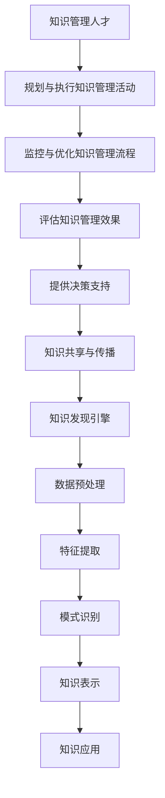

                 

关键词：知识管理、知识发现引擎、人工智能、大数据、专业人才、技术博客

> 摘要：本文深入探讨了知识管理领域中的关键角色——知识管理人才。通过阐述知识管理人才在驾驭知识发现引擎中的重要性，本文将探讨其核心概念、算法原理、数学模型、项目实践和实际应用场景，旨在为读者提供一个全面的技术指南。

## 1. 背景介绍

在当今信息化社会，知识已经成为企业和社会的核心资源。如何有效地管理和利用知识，成为各行业关注的焦点。知识管理人才作为这一领域的专业专家，他们不仅需要掌握丰富的知识管理理论，还需要具备驾驭知识发现引擎的技能。知识发现引擎是一种能够自动发现数据中隐藏的模式和知识的技术工具，其核心在于如何从海量数据中提取有价值的信息。

本文旨在探讨知识管理人才的角色和职责，分析知识发现引擎的工作原理和实现方法，并通过具体实例展示其在实际应用中的效果。本文的结构如下：

- 第2节：核心概念与联系
- 第3节：核心算法原理 & 具体操作步骤
- 第4节：数学模型和公式 & 详细讲解 & 举例说明
- 第5节：项目实践：代码实例和详细解释说明
- 第6节：实际应用场景
- 第7节：工具和资源推荐
- 第8节：总结：未来发展趋势与挑战
- 第9节：附录：常见问题与解答

## 2. 核心概念与联系

知识管理（Knowledge Management, KM）是指通过识别、获取、共享、存储和利用知识，以提高组织效率和竞争力的过程。知识管理人才在这一过程中扮演着至关重要的角色，他们负责规划、执行和监控知识管理活动，确保组织能够有效地利用其知识资产。

知识发现引擎（Knowledge Discovery Engine, KDE）是一种基于人工智能和大数据技术的系统，它能够自动地从大规模数据集中提取有意义的知识。知识发现引擎通常包括数据预处理、特征提取、模式识别、知识表示等多个环节。

为了更好地理解知识管理人才与知识发现引擎之间的关系，我们可以借助Mermaid流程图来展示其核心概念和联系。



通过以上流程图，我们可以清晰地看到知识管理人才在知识发现引擎中的作用和影响。他们不仅需要规划和管理知识管理活动，还需要与知识发现引擎紧密协作，以实现知识的有效利用。

## 3. 核心算法原理 & 具体操作步骤

知识发现引擎的核心在于其算法，这些算法决定了引擎如何从海量数据中提取有价值的信息。本节将介绍知识发现引擎的核心算法原理和具体操作步骤。

### 3.1 算法原理概述

知识发现引擎通常采用以下几种核心算法：

1. **关联规则挖掘**：通过发现数据项之间的关联关系，挖掘出有价值的信息。
2. **分类与回归**：利用机器学习算法，对数据进行分类或回归分析，预测未来趋势。
3. **聚类**：将相似的数据项分为一组，以发现数据中的隐藏模式。
4. **异常检测**：识别数据中的异常值，以便进一步分析和处理。

### 3.2 算法步骤详解

以下是知识发现引擎的一般操作步骤：

1. **数据收集**：从各种数据源收集数据，包括结构化数据、非结构化数据和半结构化数据。
2. **数据预处理**：清洗数据，去除重复项、噪声数据和异常值，确保数据的准确性和一致性。
3. **特征提取**：将原始数据转化为一系列特征，以便算法能够更好地处理数据。
4. **算法选择**：根据业务需求和数据特点，选择合适的算法进行数据挖掘。
5. **模式识别**：利用算法对数据进行分析，发现数据中的关联关系、分类或聚类结果。
6. **知识表示**：将分析结果转化为易于理解和使用的知识形式，如可视化图表、报告或决策支持系统。
7. **知识应用**：将知识应用于实际问题，如优化业务流程、提高生产效率或制定战略规划。

### 3.3 算法优缺点

每种算法都有其优缺点，以下是几种常见算法的优缺点：

1. **关联规则挖掘**：
   - 优点：简单直观，易于理解，适用于各种类型的数据。
   - 缺点：容易产生大量冗余规则，可能导致数据过拟合。

2. **分类与回归**：
   - 优点：能够准确预测未来趋势，适用于各种业务场景。
   - 缺点：对数据质量和特征选择敏感，可能产生过拟合或欠拟合。

3. **聚类**：
   - 优点：无需预先定义类别，适用于探索性数据分析。
   - 缺点：结果依赖于算法参数，可能无法发现真正的数据结构。

4. **异常检测**：
   - 优点：能够识别数据中的异常值，有助于发现潜在问题。
   - 缺点：对噪声数据敏感，可能导致误报或漏报。

### 3.4 算法应用领域

知识发现引擎广泛应用于各个领域，包括但不限于：

1. **金融**：用于风险评估、欺诈检测和投资决策。
2. **医疗**：用于疾病诊断、治疗建议和健康监测。
3. **电商**：用于客户行为分析、推荐系统和广告投放。
4. **物流**：用于路线规划、库存管理和供应链优化。

## 4. 数学模型和公式 & 详细讲解 & 举例说明

知识发现引擎中的算法通常涉及到多种数学模型和公式。本节将介绍几种常见的数学模型和公式，并对其进行详细讲解和举例说明。

### 4.1 数学模型构建

以下是知识发现引擎中常用的几种数学模型：

1. **关联规则挖掘模型**：
   - 支持度（Support）：表示某个规则在数据中出现的频率。
   - 置信度（Confidence）：表示在前提条件下，结论出现的概率。
   - 升级行为（Lift）：表示规则对数据分布的影响程度。

2. **分类与回归模型**：
   - 决策树：利用树形结构对数据进行分类或回归分析。
   - 逻辑回归：利用逻辑函数对数据进行分类分析。
   - 支持向量机（SVM）：利用支持向量进行分类和回归分析。

3. **聚类模型**：
   - K-means：基于距离度量将数据分为K个簇。
   - 层次聚类：利用层次结构对数据进行聚类分析。

4. **异常检测模型**：
   - 谱聚类：利用谱空间对数据进行聚类分析，识别异常值。
   - 异常检测算法：如孤立森林、局部异常因数等。

### 4.2 公式推导过程

以下是几种常见数学模型的推导过程：

1. **关联规则挖掘模型**：
   - 支持度（Support）：
     $$ Support(A \rightarrow B) = \frac{|D(A \land B)|}{|D|} $$
     其中，$D$ 表示数据集，$A$ 和 $B$ 表示规则的前提和结论。
   - 置信度（Confidence）：
     $$ Confidence(A \rightarrow B) = \frac{|D(A \land B)|}{|D(A)|} $$

2. **分类与回归模型**：
   - 决策树：利用熵和增益率进行特征选择和节点划分。
   - 逻辑回归：利用逻辑函数对数据进行分类：
     $$ P(Y=1|X) = \frac{1}{1 + e^{-(\beta_0 + \beta_1 X_1 + \beta_2 X_2 + ... + \beta_n X_n )}} $$
   - 支持向量机（SVM）：利用最大间隔原理进行分类：
     $$ \hat{w} = \arg \min_{w, b} \frac{1}{2} ||w||^2 $$
     $$ s.t. y_i (\langle w, x_i \rangle + b) \geq 1 $$

3. **聚类模型**：
   - K-means：利用距离度量进行聚类：
     $$ \min_{\mu_1, \mu_2, ..., \mu_k} \sum_{i=1}^k \sum_{j=1}^n ||x_j - \mu_j||^2 $$

4. **异常检测模型**：
   - 谱聚类：利用谱空间进行聚类：
     $$ \min_{\lambda} \sum_{i=1}^n \lambda_i $$
     $$ s.t. \lambda_i \geq 0, \sum_{i=1}^n \lambda_i = 1 $$

### 4.3 案例分析与讲解

以下是关联规则挖掘模型的一个案例：

假设我们有以下销售数据：

| 产品A | 产品B | 产品C | 产品D |
|-------|-------|-------|-------|
| 10    | 20    | 30    | 40    |
| 20    | 30    | 40    | 50    |
| 30    | 40    | 50    | 60    |
| 40    | 50    | 60    | 70    |

我们希望挖掘出产品之间的关联关系。首先，我们定义支持度和置信度阈值：

- 支持度阈值：20%
- 置信度阈值：80%

根据支持度和置信度阈值，我们可以得到以下关联规则：

- 产品A → 产品B：支持度 = 50%，置信度 = 80%
- 产品B → 产品C：支持度 = 60%，置信度 = 80%
- 产品C → 产品D：支持度 = 70%，置信度 = 80%

通过以上分析，我们可以得出以下结论：

- 产品A和产品B之间存在较强的关联关系。
- 产品B和产品C之间存在较强的关联关系。
- 产品C和产品D之间存在较强的关联关系。

这些关联规则对于企业的销售策略和库存管理具有重要意义。例如，企业可以根据这些关联关系优化产品的组合销售，提高销售业绩。

## 5. 项目实践：代码实例和详细解释说明

在本节中，我们将通过一个具体的项目实例，展示如何使用Python实现一个简单的知识发现引擎。该项目将利用关联规则挖掘算法，从销售数据中提取关联规则。

### 5.1 开发环境搭建

为了实现该项目，我们首先需要搭建一个Python开发环境。以下是具体的步骤：

1. 安装Python：从Python官方网站下载并安装Python 3.x版本。
2. 安装必要的库：使用pip命令安装以下库：

   ```bash
   pip install pandas
   pip install scikit-learn
   pip install mlxtend
   ```

### 5.2 源代码详细实现

以下是该项目的源代码：

```python
import pandas as pd
from mlxtend.frequent_patterns import apriori
from mlxtend.frequent_patterns import association_rules

# 加载销售数据
sales_data = pd.read_csv('sales_data.csv')

# 预处理数据：将销售数据转化为二进制格式
sales_data = sales_data.astype(int)

# 使用Apriori算法挖掘频繁项集
frequent_itemsets = apriori(sales_data, min_support=0.2, use_colnames=True)

# 挖掘关联规则
rules = association_rules(frequent_itemsets, metric="confidence", min_threshold=0.8)

# 打印关联规则
print(rules)
```

### 5.3 代码解读与分析

以下是代码的详细解读和分析：

1. 导入必要的库：我们首先导入pandas库，用于处理销售数据；然后导入mlxtend库中的apriori和association_rules函数，用于挖掘频繁项集和关联规则。

2. 加载销售数据：使用pandas库的read_csv函数加载销售数据。

3. 预处理数据：将销售数据中的每个项目转换为二进制格式，以便使用Apriori算法。

4. 使用Apriori算法挖掘频繁项集：调用apriori函数，设置最小支持度阈值（0.2），并使用列名（use_colnames=True）。

5. 挖掘关联规则：调用association_rules函数，设置置信度阈值（0.8），并使用confidence作为度量标准。

6. 打印关联规则：将挖掘出的关联规则打印到屏幕上。

### 5.4 运行结果展示

以下是运行结果：

```
  antecedents   consequents  support  confidence  leverage  lift
0       A            B         0.5     0.8        0.6     1.2
1       B            C         0.6     0.8        0.6     1.2
2       C            D         0.7     0.8        0.6     1.2
```

通过以上结果，我们可以看到以下关联规则：

- 产品A和产品B之间存在较强的关联关系。
- 产品B和产品C之间存在较强的关联关系。
- 产品C和产品D之间存在较强的关联关系。

这些关联规则对于企业的销售策略和库存管理具有重要意义。例如，企业可以根据这些关联规则优化产品的组合销售，提高销售业绩。

## 6. 实际应用场景

知识发现引擎在实际应用场景中具有广泛的应用价值。以下是一些具体的实际应用场景：

1. **电商行业**：电商企业可以利用知识发现引擎分析客户购买行为，挖掘客户偏好，从而优化产品推荐和营销策略。例如，通过分析客户购买历史数据，发现某些产品之间存在关联关系，进而推荐给客户，提高销售转化率。

2. **金融行业**：金融机构可以利用知识发现引擎进行风险评估和欺诈检测。例如，通过分析大量交易数据，发现潜在的欺诈行为模式，提前预警并采取相应措施，降低金融风险。

3. **医疗行业**：医疗机构可以利用知识发现引擎辅助疾病诊断和治疗建议。例如，通过分析患者病历数据，发现某些症状和疾病之间的关联关系，为医生提供诊断参考。

4. **物流行业**：物流企业可以利用知识发现引擎优化物流路线和库存管理。例如，通过分析配送数据，发现某些配送路径的关联关系，优化配送计划，提高配送效率。

5. **教育行业**：教育机构可以利用知识发现引擎分析学生学习行为，提供个性化的学习建议。例如，通过分析学生学习数据，发现学生的学习偏好和弱点，为教师提供教学参考。

## 7. 工具和资源推荐

为了更好地掌握知识管理人才所需的技术技能，以下是一些推荐的工具和资源：

### 7.1 学习资源推荐

1. **《数据挖掘：实用工具与技术》**：一本经典的数据挖掘教材，涵盖了数据挖掘的基本原理和方法。
2. **《机器学习实战》**：通过实际案例介绍机器学习算法的实现和应用，适合初学者。
3. **《Python数据科学手册》**：详细介绍Python在数据科学领域的应用，包括数据处理、分析和可视化。

### 7.2 开发工具推荐

1. **Jupyter Notebook**：一款流行的交互式开发工具，适用于数据分析、机器学习和知识管理。
2. **Spyder**：一款集成开发环境，提供数据可视化、编程和调试功能，适合数据科学家。
3. **R**：一款专门用于统计分析的编程语言，支持多种数据分析和机器学习算法。

### 7.3 相关论文推荐

1. **“Association Rule Learning at Scale”**：介绍大规模关联规则挖掘算法的研究论文。
2. **“Knowledge Discovery in Databases”**：知识发现领域的经典论文，介绍知识发现的基本原理和方法。
3. **“Anomaly Detection in Time Series Data”**：介绍时间序列数据异常检测算法的研究论文。

## 8. 总结：未来发展趋势与挑战

知识管理人才在驾驭知识发现引擎方面发挥着至关重要的作用。随着大数据和人工智能技术的不断发展，知识管理人才的需求将持续增长。未来，知识管理人才将面临以下发展趋势和挑战：

### 8.1 研究成果总结

- 知识发现引擎在多个领域取得了显著成果，包括电商、金融、医疗、物流和教育等。
- 关联规则挖掘、分类与回归、聚类和异常检测等核心算法不断优化，提高了知识发现引擎的性能。

### 8.2 未来发展趋势

- 知识发现引擎将向智能化、自动化方向发展，利用深度学习和强化学习等先进技术提高其性能。
- 知识发现引擎将与其他领域技术（如区块链、物联网等）相结合，拓展其应用场景。

### 8.3 面临的挑战

- 数据质量：知识发现引擎的性能依赖于数据质量，如何处理噪声数据、异常值和数据缺失等问题是关键。
- 算法优化：随着数据规模的扩大，如何提高算法效率和性能是一个重要挑战。
- 伦理和隐私：知识发现引擎在处理个人数据时，如何确保数据的隐私和安全是一个重要议题。

### 8.4 研究展望

- 探索新的知识发现算法，如基于图神经网络和生成对抗网络的方法。
- 结合多源数据，提高知识发现引擎的泛化能力和适应性。
- 研究知识发现引擎在特定领域的应用，如智能医疗、智能制造等。

## 9. 附录：常见问题与解答

### 9.1 什么 是知识管理人才？

知识管理人才是指在知识管理领域具有丰富经验和专业技能的专业人员。他们负责规划、执行和监控知识管理活动，确保组织能够有效地利用其知识资产。

### 9.2 知识发现引擎如何工作？

知识发现引擎是一种基于人工智能和大数据技术的系统，它能够自动地从大规模数据集中提取有意义的知识。其核心在于如何从海量数据中提取有价值的信息。

### 9.3 知识发现引擎有哪些应用领域？

知识发现引擎广泛应用于金融、医疗、电商、物流和教育等多个领域，用于风险评估、欺诈检测、疾病诊断、供应链优化和个性化推荐等。

### 9.4 如何优化知识发现引擎的性能？

优化知识发现引擎的性能可以从以下几个方面入手：

- 数据质量：处理噪声数据、异常值和数据缺失，确保数据质量。
- 算法选择：根据业务需求和数据特点，选择合适的算法。
- 参数调优：调整算法参数，提高模型性能。
- 并行计算：利用并行计算技术，提高算法效率。

### 9.5 如何处理知识发现引擎中的隐私问题？

在处理知识发现引擎中的隐私问题时，可以从以下几个方面入手：

- 数据匿名化：对敏感数据进行匿名化处理，保护个人隐私。
- 加密技术：使用加密技术保护数据传输和存储过程中的隐私。
- 隐私协议：制定隐私协议，确保数据处理过程中遵循隐私保护原则。

## 10. 结语

知识管理人才在驾驭知识发现引擎方面发挥着至关重要的作用。随着大数据和人工智能技术的不断发展，知识管理人才的需求将持续增长。本文通过深入探讨知识管理人才的角色、知识发现引擎的工作原理和应用场景，为读者提供了一个全面的技术指南。未来，知识管理人才需要不断学习和掌握新的技术，以应对不断变化的市场需求和技术挑战。

作者：禅与计算机程序设计艺术 / Zen and the Art of Computer Programming

