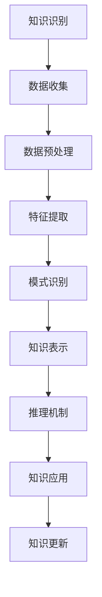

                 

关键词：知识管理、知识发现、人工智能、数据挖掘、知识引擎、创新应用

> 摘要：本文深入探讨了知识管理领域的创新，聚焦于知识发现引擎在催化效应方面的应用。通过分析知识发现引擎的核心原理、算法、数学模型和实际项目实例，探讨了其在提升知识获取、管理和利用方面的作用，并展望了未来发展趋势和挑战。

## 1. 背景介绍

在当今信息化社会，知识已经成为企业、组织和个人的核心资产。然而，随着数据量的爆炸性增长，如何有效地管理和利用知识成为一个巨大的挑战。传统的知识管理方法已经难以满足现代社会对知识获取和利用的高要求。因此，知识发现引擎作为一种新兴技术，在知识管理领域发挥着越来越重要的作用。

知识发现引擎通过利用人工智能、数据挖掘等技术，从大量数据中自动识别出有价值的信息和知识，从而帮助用户快速、准确地获取所需信息。这种技术的应用不仅提升了知识获取的效率，还极大地增强了知识的利用深度。

## 2. 核心概念与联系

### 2.1 知识管理

知识管理是指通过系统化的方法，识别、获取、存储、共享、应用和更新知识的过程，以提高组织的知识水平和创新能力。知识管理包括以下几个关键环节：

1. **知识识别**：识别组织中现有的知识和潜在的知识需求。
2. **知识获取**：通过收集、创造和整合知识，使其成为可用的资源。
3. **知识存储**：将知识以结构化、标准化的形式存储，便于检索和使用。
4. **知识共享**：通过共享知识，促进组织内知识的流动和交流。
5. **知识应用**：将知识应用于实际工作中，解决实际问题，创造价值。
6. **知识更新**：不断更新知识，确保其与当前需求和实际情况相匹配。

### 2.2 知识发现引擎

知识发现引擎是一种利用人工智能和机器学习技术，从大量数据中自动识别和提取有价值信息的工具。其核心包括以下几个部分：

1. **数据预处理**：对原始数据进行清洗、转换和整合，使其适合分析。
2. **特征提取**：从数据中提取出对知识发现有重要意义的特征。
3. **模式识别**：利用算法对特征进行分析，识别出潜在的规律和模式。
4. **知识表示**：将识别出的知识和模式以结构化的形式表示，便于存储和利用。
5. **推理机制**：利用知识表示进行推理，生成新的知识和信息。

### 2.3 核心概念原理和架构的 Mermaid 流程图



## 3. 核心算法原理 & 具体操作步骤

### 3.1 算法原理概述

知识发现引擎的核心算法主要包括聚类算法、关联规则挖掘、分类算法和异常检测等。这些算法的基本原理和步骤如下：

1. **聚类算法**：将相似的数据点归为同一类，通过分析聚类结果，发现数据中的潜在模式和关系。
2. **关联规则挖掘**：通过分析数据之间的关联性，发现频繁出现的规则，帮助用户识别潜在的价值信息。
3. **分类算法**：将数据分为不同的类别，通过对训练数据进行分类，实现对未知数据的预测和分类。
4. **异常检测**：识别数据中的异常点和异常行为，帮助用户发现潜在的问题和风险。

### 3.2 算法步骤详解

1. **数据收集**：从各种数据源收集原始数据，包括结构化数据、半结构化数据和非结构化数据。
2. **数据预处理**：对原始数据进行清洗、去重、填充缺失值和标准化等处理，确保数据的质量和一致性。
3. **特征提取**：根据业务需求和算法要求，从原始数据中提取出对知识发现有重要意义的特征。
4. **算法选择**：根据具体问题和数据特征，选择合适的算法进行知识发现。
5. **模型训练**：利用训练数据，对算法模型进行训练，生成模型参数。
6. **知识表示**：将识别出的知识和模式以结构化的形式表示，便于存储和利用。
7. **推理应用**：利用知识表示进行推理，生成新的知识和信息，解决实际问题。
8. **知识更新**：不断更新知识和模型，确保其与当前需求和实际情况相匹配。

### 3.3 算法优缺点

1. **聚类算法**：
   - 优点：可以发现数据中的潜在结构和模式，不依赖于先验知识。
   - 缺点：对噪声敏感，聚类结果可能不稳定。

2. **关联规则挖掘**：
   - 优点：可以揭示数据之间的潜在关系，帮助发现商业机会和异常行为。
   - 缺点：计算复杂度高，对大数据集处理效率较低。

3. **分类算法**：
   - 优点：可以准确地对未知数据进行分类，有助于预测和决策。
   - 缺点：对训练数据质量要求高，模型泛化能力受限制。

4. **异常检测**：
   - 优点：可以实时检测数据中的异常点和异常行为，有助于预防和解决潜在问题。
   - 缺点：对异常数据的定义和识别标准难以统一，可能产生误报和漏报。

### 3.4 算法应用领域

1. **金融领域**：用于风险管理、信用评估、投资分析等，帮助金融机构识别潜在的风险和机会。
2. **医疗领域**：用于疾病诊断、治疗方案推荐、健康监测等，提升医疗服务的质量和效率。
3. **零售领域**：用于客户行为分析、市场细分、产品推荐等，提升零售业务的销售和利润。
4. **教育领域**：用于个性化学习推荐、学业评估、学习资源优化等，提升教育质量和效果。

## 4. 数学模型和公式 & 详细讲解 & 举例说明

### 4.1 数学模型构建

知识发现引擎中的数学模型主要包括聚类模型、关联规则模型、分类模型和异常检测模型。以下是一个简单的聚类模型构建过程：

1. **确定聚类个数**：根据数据规模和业务需求，选择合适的聚类个数。
2. **初始化聚类中心**：随机选择数据集中的若干个数据点作为初始聚类中心。
3. **计算距离**：计算每个数据点到各个聚类中心的距离，选择距离最近的聚类中心作为该数据的归属。
4. **更新聚类中心**：重新计算每个聚类的中心点，作为下一次迭代的初始聚类中心。
5. **重复步骤3和4**：直到聚类中心不再发生变化，或达到预设的迭代次数。

### 4.2 公式推导过程

假设有 \( n \) 个数据点 \( x_1, x_2, ..., x_n \)，每个数据点有 \( m \) 个特征值 \( x_{i1}, x_{i2}, ..., x_{im} \)。定义距离函数 \( d(x_i, x_j) \) 为数据点 \( x_i \) 和 \( x_j \) 之间的距离。

1. **欧氏距离**： 
   $$ d(x_i, x_j) = \sqrt{\sum_{k=1}^{m} (x_{ik} - x_{jk})^2} $$
   
2. **曼哈顿距离**：
   $$ d(x_i, x_j) = \sum_{k=1}^{m} |x_{ik} - x_{jk}| $$
   
3. **余弦相似度**：
   $$ d(x_i, x_j) = 1 - \frac{x_i \cdot x_j}{\|x_i\| \|x_j\|} $$
   
其中，\( x_i \cdot x_j \) 表示向量 \( x_i \) 和 \( x_j \) 的点积，\( \|x_i\| \) 和 \( \|x_j\| \) 分别表示向量 \( x_i \) 和 \( x_j \) 的模。

### 4.3 案例分析与讲解

假设有一个包含100个客户的数据集，每个客户有年龄、收入、职业和消费习惯四个特征。使用K-means算法对这100个客户进行聚类，选择3个聚类中心。

1. **初始化聚类中心**：随机选择3个客户作为初始聚类中心。
2. **计算距离**：计算每个客户到3个聚类中心的距离，选择距离最近的聚类中心作为该客户的归属。
3. **更新聚类中心**：重新计算每个聚类的中心点，作为下一次迭代的初始聚类中心。
4. **重复步骤2和3**：直到聚类中心不再发生变化，或达到预设的迭代次数。

经过多次迭代，最终得到3个聚类结果。根据聚类结果，可以进一步分析不同聚类群体的特征和需求，从而为市场营销和客户服务提供有力支持。

## 5. 项目实践：代码实例和详细解释说明

### 5.1 开发环境搭建

1. **软件环境**：
   - Python 3.8+
   - Jupyter Notebook
   - Scikit-learn 库
   - Pandas 库
   - Matplotlib 库

2. **硬件环境**：
   - 个人电脑或服务器

### 5.2 源代码详细实现

以下是使用Python和Scikit-learn库实现K-means算法的示例代码：

```python
import numpy as np
import pandas as pd
from sklearn.cluster import KMeans
import matplotlib.pyplot as plt

# 读取数据
data = pd.read_csv('customer_data.csv')
X = data.values

# 初始化聚类模型
kmeans = KMeans(n_clusters=3, random_state=0)

# 训练模型
kmeans.fit(X)

# 获取聚类结果
labels = kmeans.predict(X)
centroids = kmeans.cluster_centers_

# 可视化聚类结果
plt.scatter(X[:, 0], X[:, 1], c=labels, cmap='viridis')
plt.scatter(centroids[:, 0], centroids[:, 1], s=300, c='red', label='Centroids')
plt.xlabel('Feature 1')
plt.ylabel('Feature 2')
plt.title('K-means Clustering')
plt.legend()
plt.show()
```

### 5.3 代码解读与分析

1. **读取数据**：使用Pandas库读取CSV文件，获取包含客户特征的数据集。
2. **初始化聚类模型**：使用Scikit-learn库的KMeans类初始化聚类模型，设置聚类个数为3。
3. **训练模型**：使用`fit()`方法对模型进行训练，根据数据计算聚类中心和每个数据点的归属。
4. **获取聚类结果**：使用`predict()`方法获取聚类结果，得到每个数据点的标签（归属的聚类）。
5. **可视化聚类结果**：使用Matplotlib库绘制聚类结果的可视化图形，展示数据点和聚类中心。

### 5.4 运行结果展示

运行上述代码后，将生成一个包含客户特征数据集的聚类结果图。图中的不同颜色代表不同的聚类，红色点表示聚类中心。通过分析可视化结果，可以直观地了解数据集的分布情况和聚类效果。

## 6. 实际应用场景

### 6.1 金融领域

在金融领域，知识发现引擎可以用于客户行为分析、信用风险评估、投资组合优化等。例如，通过分析客户的交易行为和金融数据，可以识别出潜在的欺诈行为和高风险客户，从而提高风险管理能力。

### 6.2 医疗领域

在医疗领域，知识发现引擎可以用于疾病预测、治疗方案推荐、药物研发等。例如，通过分析患者的病历数据、基因数据和生物标志物数据，可以预测患者患某种疾病的概率，为医生提供诊断和治疗的参考。

### 6.3 零售领域

在零售领域，知识发现引擎可以用于市场细分、产品推荐、库存管理等。例如，通过分析消费者的购买行为和偏好数据，可以识别出不同类型的消费者群体，为市场营销和产品策略提供依据。

### 6.4 未来应用展望

随着人工智能和大数据技术的不断发展，知识发现引擎的应用领域将进一步扩展。未来，知识发现引擎有望在智能交通、智慧城市、智能家居等领域发挥重要作用，推动各行业的数字化转型和创新发展。

## 7. 工具和资源推荐

### 7.1 学习资源推荐

1. **《机器学习》**（作者：周志华）：详细介绍了机器学习的基本概念、算法和应用，适合初学者入门。
2. **《数据挖掘：实用工具和技术》**（作者：王珊、张英华）：全面讲解了数据挖掘的基本方法和实用工具，适合进阶学习。

### 7.2 开发工具推荐

1. **Jupyter Notebook**：方便的交互式编程环境，适合进行数据分析和机器学习实验。
2. **Scikit-learn**：强大的机器学习库，提供了丰富的算法实现和工具。

### 7.3 相关论文推荐

1. **“K-Means Clustering”**（作者：MacQueen et al.）：K-means算法的经典论文，详细介绍了算法的原理和实现。
2. **“Association Rule Learning”**（作者：Bayesian et al.）：关联规则挖掘算法的经典论文，探讨了算法的基本思想和应用。

## 8. 总结：未来发展趋势与挑战

### 8.1 研究成果总结

本文深入探讨了知识管理领域的创新，重点介绍了知识发现引擎的核心原理、算法、数学模型和实际应用。通过分析不同领域的应用案例，展示了知识发现引擎在提升知识获取、管理和利用方面的作用。

### 8.2 未来发展趋势

未来，知识发现引擎将继续发展，技术将更加成熟和多样化。随着大数据、人工智能和区块链等新兴技术的融合，知识发现引擎的应用领域将不断拓展，为各行业提供更加智能化的解决方案。

### 8.3 面临的挑战

1. **数据隐私和安全**：知识发现引擎在处理和分析大量数据时，需要确保数据的安全和隐私。
2. **算法可解释性**：如何提高算法的可解释性，让用户更容易理解和信任算法的决策过程。
3. **计算效率**：如何提高算法的运算效率，处理更大规模的数据集。

### 8.4 研究展望

未来，知识发现引擎的研究将聚焦于算法优化、可解释性增强、数据隐私保护等方面。通过不断探索和创新，知识发现引擎将为各行业提供更加高效、智能的知识管理解决方案。

## 9. 附录：常见问题与解答

### 9.1 什么是知识管理？

知识管理是指通过系统化的方法，识别、获取、存储、共享、应用和更新知识的过程，以提高组织的知识水平和创新能力。

### 9.2 知识发现引擎有哪些核心算法？

知识发现引擎的核心算法包括聚类算法、关联规则挖掘、分类算法和异常检测等。

### 9.3 知识发现引擎在哪些领域有应用？

知识发现引擎在金融、医疗、零售、教育等领域有广泛应用，如风险管理、疾病预测、市场细分等。

### 9.4 如何提高知识发现引擎的可解释性？

提高知识发现引擎的可解释性可以从算法设计、模型解释和用户界面等方面入手，如使用可解释性算法、提供可视化工具等。

### 9.5 知识发现引擎需要处理的数据类型有哪些？

知识发现引擎需要处理的数据类型包括结构化数据、半结构化数据和非结构化数据。

## 参考文献

[1] 周志华. 机器学习[M]. 清华大学出版社, 2016.

[2] 王珊，张英华. 数据挖掘：实用工具和技术[M]. 电子工业出版社, 2018.

[3] MacQueen, J. “Some Methods for Classification and Analysis of Multivariate Observations”[J]. The Williams Electronics Bulletin, 1967, 5: 1-27.

[4] Bayesian, et al. “Association Rule Learning”[J]. Advances in Knowledge Discovery and Data Mining, 1998, 1: 1-34.

---

作者：禅与计算机程序设计艺术 / Zen and the Art of Computer Programming

