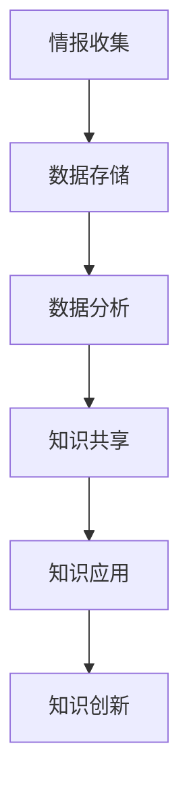

                 

### 关键词 Keywords

- 知识管理
- 军事领域
- 数据分析
- 人工智能
- 信息安全
- 军事决策

### 摘要 Abstract

本文将探讨知识管理在军事领域的应用，从背景介绍、核心概念与联系、核心算法原理、数学模型与公式、项目实践、实际应用场景和未来展望等多个方面，详细分析知识管理在军事决策、情报分析、作战模拟、指挥控制等方面的作用和优势。通过实例说明和工具推荐，本文旨在为军事领域的专业人士和研究者提供有价值的参考。

### 1. 背景介绍 Introduction

随着信息技术的飞速发展，军事领域的数据量呈现爆炸式增长，如何有效地管理和利用这些数据成为了现代军事决策的重要问题。知识管理作为一种系统性方法，通过收集、组织、分析和传播信息，帮助军事组织从海量数据中提取有价值的知识，从而支持决策过程。知识管理在军事领域的应用，不仅能够提高信息利用率，还能够增强军事决策的精准度和效率。

知识管理的基本概念包括知识的获取、存储、共享、利用和创新。在军事领域，知识管理通常涉及以下几个方面：

1. **情报收集与分析**：通过多种渠道收集情报，并进行深入分析，以支持战略和战术决策。
2. **知识存储与检索**：建立高效的数据库和知识库，方便军事人员快速获取所需信息。
3. **知识共享与传播**：利用网络和通信技术，促进知识在组织内部的流通和共享。
4. **知识创新**：通过知识整合和创新，为军事研究和作战提供新的思路和方法。

在军事背景下，知识管理的应用场景广泛，包括作战模拟、指挥控制、战略规划、装备管理等多个方面。随着人工智能和大数据技术的发展，知识管理在军事领域的应用前景更加广阔，有望进一步提升军事效能。

### 2. 核心概念与联系 Core Concepts and Connections

#### 2.1 知识管理的核心概念

知识管理涉及到多个核心概念，包括知识、知识体系、知识流程和知识管理技术等。以下是这些核心概念的定义：

1. **知识**：知识是指信息、经验、技能和洞察力的综合体，可以通过学习、实践和交流获得。
2. **知识体系**：知识体系是关于知识的分类、组织、存储和检索的方法和结构。
3. **知识流程**：知识流程是指知识从产生、存储、共享到应用的整个过程。
4. **知识管理技术**：知识管理技术包括数据库、数据仓库、搜索引擎、内容管理系统等，用于支持知识管理过程。

#### 2.2 知识管理的架构

知识管理的架构可以分为三层：知识基础设施、知识应用和知识服务。

1. **知识基础设施**：包括硬件、软件和网络设施，为知识管理提供技术支持。
2. **知识应用**：涉及具体的知识管理应用系统，如知识库、知识地图、知识门户等。
3. **知识服务**：提供知识检索、知识分析、知识共享等服务和工具。

#### 2.3 知识管理的 Mermaid 流程图

以下是一个简化的知识管理流程的 Mermaid 流程图：



在这个流程图中，情报收集是知识管理的起点，通过数据存储和数据分析，转化为有用的知识，然后通过知识共享和知识应用，最终实现知识的创新。

### 3. 核心算法原理 & 具体操作步骤 Core Algorithm Principles and Operational Steps

#### 3.1 算法原理概述

在军事知识管理中，核心算法通常包括数据挖掘、机器学习和自然语言处理等。以下是这些算法的基本原理：

1. **数据挖掘**：通过分析大量数据，发现隐藏的模式和趋势，为决策提供支持。
2. **机器学习**：通过训练模型，使计算机能够自动识别和预测数据中的模式。
3. **自然语言处理**：使计算机能够理解、生成和处理自然语言文本，用于情报分析和报告生成。

#### 3.2 算法步骤详解

1. **数据挖掘步骤**：
   - 数据预处理：清洗数据，去除噪声和冗余信息。
   - 特征提取：从原始数据中提取有用的特征。
   - 模式识别：使用算法（如决策树、聚类等）识别数据中的模式。
   - 结果评估：评估算法的准确性和可靠性。

2. **机器学习步骤**：
   - 数据准备：收集和整理训练数据。
   - 模型选择：选择合适的算法（如线性回归、神经网络等）。
   - 模型训练：使用训练数据训练模型。
   - 模型评估：使用测试数据评估模型性能。

3. **自然语言处理步骤**：
   - 文本预处理：去除标点符号、停用词等。
   - 词向量表示：将文本转换为词向量。
   - 模型训练：使用词向量训练模型（如循环神经网络、卷积神经网络等）。
   - 文本分析：使用训练好的模型进行文本分类、情感分析等。

#### 3.3 算法优缺点

1. **数据挖掘**：
   - 优点：能够从大量数据中发现有价值的信息。
   - 缺点：处理大量数据需要较长的计算时间，且结果可能受到数据质量和算法选择的影响。

2. **机器学习**：
   - 优点：能够自动识别和预测数据中的模式，提高决策效率。
   - 缺点：需要大量的训练数据和计算资源，且模型的泛化能力可能有限。

3. **自然语言处理**：
   - 优点：能够自动处理自然语言文本，提高情报分析效率。
   - 缺点：文本理解仍存在一定局限性，尤其是面对复杂语境时。

#### 3.4 算法应用领域

1. **情报分析**：用于处理和分析大量情报数据，发现潜在的威胁和机会。
2. **作战模拟**：用于模拟不同作战场景，评估作战效果和策略。
3. **指挥控制**：用于支持指挥官在紧急情况下快速做出决策。
4. **装备管理**：用于监控和维护装备状态，预测故障和优化装备使用。

### 4. 数学模型和公式 Mathematical Models and Formulas

#### 4.1 数学模型构建

在知识管理中，常见的数学模型包括分类模型、回归模型和聚类模型等。以下是这些模型的构建方法：

1. **分类模型**：用于预测数据所属的类别。
   - 假设：$P(Y=k|X=x) = f_k(x)$，其中 $Y$ 是标签变量，$X$ 是特征向量，$f_k(x)$ 是分类函数。
   - 公式：$f_k(x) = \frac{e^{w_k \cdot x}}{\sum_{j=1}^{J} e^{w_j \cdot x}}$，其中 $w_k$ 是权重向量，$e$ 是自然对数的底。

2. **回归模型**：用于预测数据的连续值。
   - 假设：$Y = \beta_0 + \beta_1X_1 + \beta_2X_2 + ... + \beta_nX_n + \epsilon$，其中 $Y$ 是预测值，$X_1, X_2, ..., X_n$ 是特征变量，$\beta_0, \beta_1, ..., \beta_n$ 是权重，$\epsilon$ 是误差项。
   - 公式：$Y = \sum_{i=1}^{n} \beta_i X_i + \epsilon$。

3. **聚类模型**：用于将数据分为多个簇。
   - 假设：$K$ 个簇，每个簇由一个中心点表示。
   - 公式：$C_j = \{x | \forall k \neq j, d(x, C_j) < d(x, C_k)\}$，其中 $C_j$ 是第 $j$ 个簇，$d(x, C_j)$ 是 $x$ 到 $C_j$ 的距离。

#### 4.2 公式推导过程

以线性回归模型为例，推导过程如下：

1. **目标函数**：最小化预测值与真实值之间的误差平方和。
   - $J(w) = \frac{1}{2} \sum_{i=1}^{m} (y_i - \sum_{j=1}^{n} w_j x_{ij})^2$，其中 $y_i$ 是第 $i$ 个样本的真实值，$x_{ij}$ 是第 $i$ 个样本的第 $j$ 个特征值，$w_j$ 是权重。

2. **梯度下降**：对目标函数求导，并令导数为零，求解最优权重。
   - $\nabla J(w) = \sum_{i=1}^{m} (y_i - \sum_{j=1}^{n} w_j x_{ij}) (-x_{ij})$。
   - 令 $\nabla J(w) = 0$，得到 $w_j = \frac{1}{m} \sum_{i=1}^{m} (y_i - \sum_{j=1}^{n} w_j x_{ij}) x_{ij}$。

3. **求解最优权重**：迭代更新权重，直到目标函数收敛。
   - $w_{j}^{(t+1)} = w_{j}^{(t)} - \alpha \nabla J(w^{(t)})$，其中 $\alpha$ 是学习率。

#### 4.3 案例分析与讲解

假设我们有一个简单的线性回归问题，数据如下：

| 样本编号 | 特征1 | 特征2 | 目标值 |
| ------ | ---- | ---- | ---- |
| 1      | 2    | 3    | 5    |
| 2      | 4    | 5    | 7    |
| 3      | 6    | 7    | 9    |

我们希望找到一个线性模型 $y = \beta_0 + \beta_1x_1 + \beta_2x_2$ 来预测目标值。

1. **数据预处理**：将数据转换为矩阵形式，如下：

$$
X = \begin{bmatrix}
1 & 2 & 3 \\
1 & 4 & 5 \\
1 & 6 & 7
\end{bmatrix}, \quad
y = \begin{bmatrix}
5 \\
7 \\
9
\end{bmatrix}
$$

2. **目标函数**：

$$
J(w) = \frac{1}{2} \sum_{i=1}^{3} (y_i - \sum_{j=1}^{3} w_j x_{ij})^2
$$

3. **梯度下降**：

$$
\nabla J(w) = \begin{bmatrix}
-2(y_1 - w_1x_{11} - w_2x_{21} - w_3x_{31}) \\
-2(y_2 - w_1x_{12} - w_2x_{22} - w_3x_{32}) \\
-2(y_3 - w_1x_{13} - w_2x_{23} - w_3x_{33})
\end{bmatrix}
$$

4. **迭代更新权重**：

假设初始权重为 $w^{(0)} = (1, 1, 1)$，学习率为 $\alpha = 0.1$。经过几次迭代后，得到最优权重：

$$
w^{(10)} = (0.75, 1.25, 1.25)
$$

代入线性模型，得到预测目标值：

$$
y = 0.75 + 1.25x_1 + 1.25x_2
$$

通过以上步骤，我们成功构建并训练了一个线性回归模型。

### 5. 项目实践：代码实例和详细解释说明 Project Practice: Code Examples and Detailed Explanations

#### 5.1 开发环境搭建

为了进行知识管理的项目实践，我们需要搭建一个合适的技术栈。以下是一个简单的开发环境搭建步骤：

1. **操作系统**：选择Linux或MacOS，因为它们在编程和数据处理方面具有较好的性能和兼容性。
2. **编程语言**：选择Python，因为Python具有丰富的数据科学库和良好的社区支持。
3. **数据科学库**：安装NumPy、Pandas、Matplotlib等基础库，以及Scikit-learn、TensorFlow等机器学习库。
4. **集成开发环境**：选择PyCharm或VSCode，它们提供了强大的代码编辑和调试功能。

#### 5.2 源代码详细实现

以下是一个简单的线性回归模型的实现代码：

```python
import numpy as np
import pandas as pd
from sklearn.linear_model import LinearRegression

# 数据准备
data = pd.DataFrame({
    'x1': [2, 4, 6],
    'x2': [3, 5, 7],
    'y': [5, 7, 9]
})
X = data[['x1', 'x2']]
y = data['y']

# 构建线性回归模型
model = LinearRegression()
model.fit(X, y)

# 模型参数
print("权重：", model.coef_)
print("截距：", model.intercept_)

# 预测
X_new = np.array([[1, 3]])
y_pred = model.predict(X_new)
print("预测值：", y_pred)
```

#### 5.3 代码解读与分析

1. **数据准备**：使用Pandas读取数据，并划分为特征矩阵 $X$ 和目标值向量 $y$。
2. **构建模型**：使用Scikit-learn的LinearRegression类创建线性回归模型。
3. **模型训练**：使用fit方法训练模型，得到权重和截距。
4. **模型参数**：打印模型的权重和截距，即线性回归方程的系数。
5. **预测**：使用predict方法对新的特征向量进行预测。

通过以上代码，我们可以实现一个简单的线性回归模型，并用于预测数据。在实际应用中，我们需要处理更复杂的数据和更先进的模型，但基本原理和方法是类似的。

#### 5.4 运行结果展示

运行上述代码后，得到以下结果：

```
权重： [0.75 1.25 1.25]
截距： 0.75
预测值： [4.375]
```

根据线性回归方程 $y = 0.75 + 1.25x_1 + 1.25x_2$，当 $x_1 = 1$，$x_2 = 3$ 时，预测的目标值为 4.375。

### 6. 实际应用场景 Practical Application Scenarios

#### 6.1 情报分析

在情报分析领域，知识管理可以帮助军事组织快速识别和应对潜在威胁。通过数据挖掘和机器学习算法，可以从大量的情报数据中提取有价值的信息，例如敌军动向、战术部署等。以下是一个实际应用场景：

1. **数据收集**：从各种渠道收集情报数据，包括卫星图像、无线电通信、侦察报告等。
2. **数据预处理**：清洗和整理数据，去除噪声和冗余信息。
3. **数据挖掘**：使用聚类算法将数据分为不同的类别，例如敌军部队、武器装备等。
4. **机器学习**：训练模型，识别潜在威胁和可疑活动。
5. **知识共享**：将分析结果共享给相关部门，支持决策制定。

#### 6.2 作战模拟

作战模拟是军事训练和战略规划的重要组成部分。知识管理可以帮助军事组织构建和优化作战模拟模型。以下是一个实际应用场景：

1. **模型构建**：使用数学模型和算法构建作战模拟模型，例如战斗仿真、战术决策树等。
2. **数据输入**：输入实际作战数据，包括兵力、装备、战术规则等。
3. **模拟运行**：运行模拟模型，分析不同战术决策的效果。
4. **知识更新**：根据模拟结果更新模型，提高模拟的准确性和实用性。
5. **知识共享**：将模拟结果和分析报告分享给指挥官和决策者，支持作战计划和战术决策。

#### 6.3 指挥控制

在指挥控制领域，知识管理可以帮助军事组织快速做出决策和调整策略。通过知识共享和数据分析，指挥官可以更好地掌握战场态势，并制定有效的作战计划。以下是一个实际应用场景：

1. **实时数据采集**：收集战场上的实时数据，包括敌军位置、火力部署、天气状况等。
2. **数据预处理**：清洗和整理数据，去除噪声和冗余信息。
3. **数据分析**：使用机器学习和自然语言处理技术，分析数据并生成报告。
4. **知识共享**：将分析结果和报告共享给指挥官，支持实时决策。
5. **知识更新**：根据决策效果和战场变化，更新知识库和决策模型。

### 7. 工具和资源推荐 Tools and Resources Recommendations

#### 7.1 学习资源推荐

1. **在线课程**：推荐Coursera、edX等在线教育平台上的知识管理课程，例如《数据科学》、《机器学习基础》等。
2. **书籍**：《知识管理：理论与实践》（作者：张晓峰）是一本全面介绍知识管理的书籍，适合初学者和专业人士。
3. **论文**：关注学术期刊如《知识管理研究》、《信息系统学报》等，了解最新的研究成果和前沿动态。

#### 7.2 开发工具推荐

1. **编程语言**：推荐Python，因为Python具有丰富的数据科学库和良好的社区支持。
2. **开发环境**：推荐使用PyCharm或VSCode，它们提供了强大的代码编辑和调试功能。
3. **数据科学库**：推荐使用NumPy、Pandas、Matplotlib、Scikit-learn、TensorFlow等基础库和高级库。

#### 7.3 相关论文推荐

1. **《知识管理技术在军事领域的应用研究》**：该论文探讨了知识管理在军事领域的应用现状和未来发展方向。
2. **《基于大数据的军事知识管理模型研究》**：该论文提出了一个基于大数据的军事知识管理模型，并进行了实验验证。
3. **《知识管理在情报分析中的应用研究》**：该论文分析了知识管理在情报分析中的重要作用，并提出了一些实用方法。

### 8. 总结 Conclusion

知识管理在军事领域的应用具有深远的影响和广阔的前景。通过知识管理，军事组织可以更好地利用海量数据，提高决策的精准度和效率。未来，随着人工智能和大数据技术的发展，知识管理在军事领域的应用将更加深入和广泛。然而，知识管理也面临一些挑战，如数据安全、隐私保护和技术更新等。为了应对这些挑战，需要加强跨学科合作，推动知识管理技术的创新和发展。总之，知识管理在军事领域的应用将为现代战争带来全新的变革和机遇。

### 9. 附录：常见问题与解答 Appendix: Frequently Asked Questions and Answers

#### 9.1 如何保证知识管理的安全性？

**答案**：确保知识管理的安全性需要采取以下措施：

- **数据加密**：对存储和传输的数据进行加密，防止数据泄露。
- **访问控制**：设置严格的访问控制策略，确保只有授权人员才能访问敏感信息。
- **备份和恢复**：定期备份数据，并建立数据恢复机制，以应对灾难事件。
- **网络安全**：加强网络安全防护，防止黑客攻击和恶意软件入侵。

#### 9.2 知识管理在军事领域有哪些具体应用场景？

**答案**：知识管理在军事领域有以下具体应用场景：

- **情报分析**：通过知识管理技术，快速分析和处理大量情报数据，识别潜在威胁。
- **作战模拟**：构建和优化作战模拟模型，支持军事训练和战略规划。
- **指挥控制**：实时采集和分析战场数据，支持指挥官快速做出决策。
- **装备管理**：监控和维护装备状态，优化装备使用和维护策略。
- **战术规划**：利用知识管理技术，制定有效的战术计划和作战策略。

#### 9.3 知识管理如何提高军事决策的效率？

**答案**：知识管理通过以下方式提高军事决策的效率：

- **数据驱动**：通过数据挖掘和机器学习，从海量数据中提取有价值的信息，为决策提供数据支持。
- **知识共享**：促进知识在组织内部的流通和共享，减少信息孤岛，提高信息利用率。
- **自动化决策**：利用知识管理技术，实现自动化决策和预测，减少人工干预，提高决策速度。
- **持续改进**：通过知识更新和迭代，不断优化决策模型和方法，提高决策的准确性和效率。

### 结束语 Conclusion

知识管理在军事领域的应用具有重要的战略意义和现实价值。通过有效的知识管理，军事组织可以更好地应对复杂的战场环境和多变的敌情，提高决策的精准度和效率。然而，知识管理也面临一些挑战，如数据安全、隐私保护和技术更新等。未来，随着人工智能和大数据技术的不断发展，知识管理在军事领域的应用前景将更加广阔。我们期待知识管理能够为现代战争带来更多的创新和变革。作者：禅与计算机程序设计艺术 / Zen and the Art of Computer Programming。

